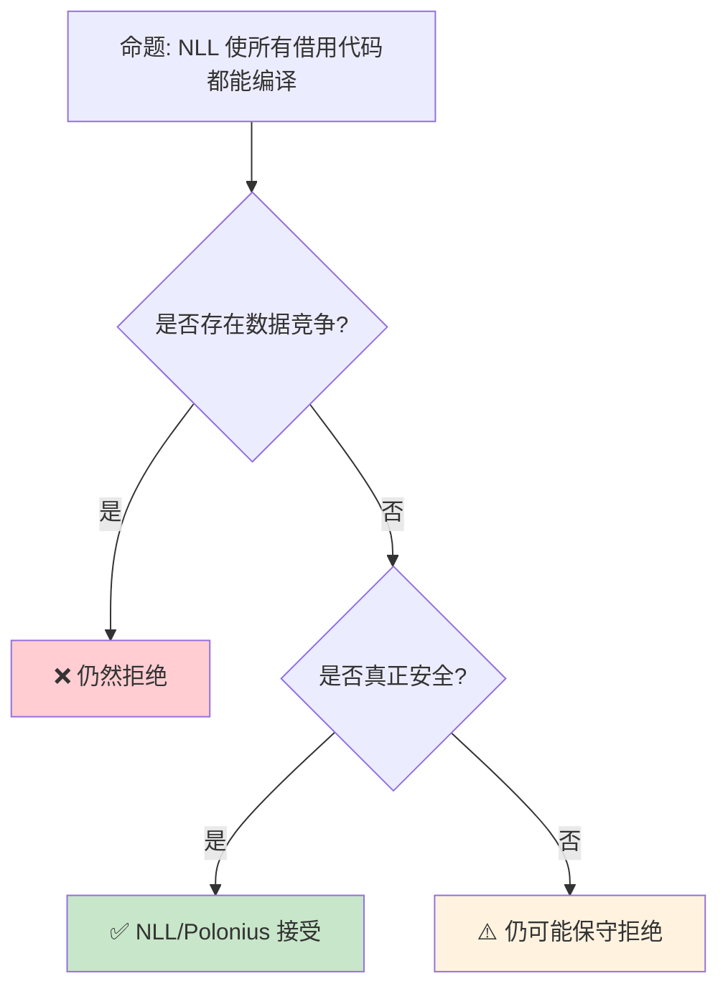

> **内容分级**: [专家级]

# NLL 与 Polonius：借用检查器的演进
>
> **EN**: Borrowing
> **Summary**: Borrowing. Core Rust concept covering mechanism analysis, in-depth analysis, type system mechanics.
> **受众**: [专家]
> **Bloom 层级**: 分析 → 评价
> **A/S/P 标记**: **S** — Structure
> **双维定位**: C×Ana — 分析借用（Borrowing）检查算法的精度演进
> **定位**: 深入分析 Rust **借用（Borrowing）检查器**的两个里程碑——Non-Lexical Lifetimes (NLL) 如何放宽词法作用域限制，以及 Polonius 如何通过数据流分析实现更精确的借用检查，揭示 Rust 类型系统（Type System）的持续演进。
> **前置概念**: [Borrowing](../01_foundation/02_borrowing.md) · [Lifetimes](../01_foundation/03_lifetimes.md) · [Type System](../01_foundation/04_type_system.md)
> **后置概念**: [Unsafe](03_unsafe.md) · [Formal Methods](../04_formal/04_rustbelt.md)
>
> **来源**: [RFC 2094 — NLL](https://rust-lang.github.io/rfcs//2094-nll.html) · [Polonius](https://github.com/rust-lang/polonius) · [Reference — Lifetimes](https://doc.rust-lang.org/reference/items/generics.html)
---

> **来源**: [NLL RFC](https://rust-lang.github.io/rfcs//2094-nll.html) ·
> [Polonius Talk — RustConf 2018](https://www.youtube.com/watch?v=_8X69Kw0EhY) ·
> [Polonius Repository](https://github.com/rust-lang/polonius) ·
> [The Rust Compiler Guide — Borrow Check](https://rustc-dev-guide.rust-lang.org/borrow_check.html) ·
> [Wikipedia — Data-flow Analysis](https://en.wikipedia.org/wiki/Data-flow_analysis)
> **前置依赖**: [Traits](../02_intermediate/01_traits.md)
> **对应 Crate**: [`c01_ownership_borrow_scope`](../../crates/c01_ownership_borrow_scope)
> **对应练习**: [`exercises/src/ownership_borrowing/`](../../exercises/src/ownership_borrowing)

## 📑 目录

- [NLL 与 Polonius：借用检查器的演进](#nll-与-polonius借用检查器的演进)
  - [📑 目录](#-目录)
  - [一、核心概念](#一核心概念)
    - [1.1 词法生命周期的问题](#11-词法生命周期的问题)
    - [1.2 NLL 的解决方案](#12-nll-的解决方案)
    - [1.3 Polonius 的进一步精确化](#13-polonius-的进一步精确化)
  - [二、技术细节](#二技术细节)
    - [2.1 NLL 的实现机制](#21-nll-的实现机制)
    - [2.2 Polonius 的约束传播](#22-polonius-的约束传播)
    - [2.3 借用检查的三代对比](#23-借用检查的三代对比)
  - [三、影响范围矩阵](#三影响范围矩阵)
  - [四、反命题与边界分析](#四反命题与边界分析)
    - [4.1 反命题树](#41-反命题树)
    - [4.2 边界极限](#42-边界极限)
  - [五、常见陷阱](#五常见陷阱)
    - [编译错误示例](#编译错误示例)
  - [六、来源与延伸阅读](#六来源与延伸阅读)
    - [编译验证示例](#编译验证示例)
  - [相关概念文件](#相关概念文件)
  - [逆向推理链（Backward Reasoning）](#逆向推理链backward-reasoning)
  - [权威来源索引](#权威来源索引)
    - [10.5 边界测试：Polonius 与 NLL 的接受程序差异（编译错误）](#105-边界测试polonius-与-nll-的接受程序差异编译错误)
    - [10.4 边界测试：NLL 的保守拒绝与 Polonius 的改进（编译错误/未来修复）](#104-边界测试nll-的保守拒绝与-polonius-的改进编译错误未来修复)
  - [嵌入式测验（Embedded Quiz）](#嵌入式测验embedded-quiz)
    - [测验 1：词法生命周期的问题（理解层）](#测验-1词法生命周期的问题理解层)
    - [测验 2：NLL 的改进范围（应用层）](#测验-2nll-的改进范围应用层)
    - [测验 3：Polonius 与 NLL 的关系（理解层）](#测验-3polonius-与-nll-的关系理解层)
    - [测验 4：NLL 与性能（分析层）](#测验-4nll-与性能分析层)
    - [测验 5：借用检查器三代对比（评价层）](#测验-5借用检查器三代对比评价层)
  - [认知路径](#认知路径)
    - [核心推理链](#核心推理链)
    - [反命题与边界](#反命题与边界)
  - [实践](#实践)
    - [对应代码示例](#对应代码示例)
    - [建议练习](#建议练习)
  - [导航：下一步去哪？](#导航下一步去哪)

---

## 一、核心概念
>
>

### 1.1 词法生命周期的问题
>

```rust
// 词法作用域借用检查（NLL 之前）的问题

fn lexical_lifetime_problem() {
    let mut data = vec![1, 2, 3];

    let x = &data[0];  // x 借用 data
    // ──────────────────────────────────────
    // 词法作用域: x 的生命周期延伸到作用域结束
    // 即使 x 不再使用，借用仍然"有效"
    // ──────────────────────────────────────

    println!("{}", x);  // x 最后一次使用

    // ❌ NLL 之前: 编译错误！
    // data.push(4);  // 不能可变借用 data
    // 因为 x 的词法生命周期尚未结束

    // ✅ NLL 之后: 编译通过！
    // x 的"实际使用"已经结束，可以重新借用
    data.push(4);
}

// 另一个经典例子
fn drop_and_use() {
    let mut s = String::from("hello");
    let r = &s;
    println!("{}", r);  // r 最后一次使用

    // NLL 之前: drop(s); 在这里会报错
    // NLL 之后: 可以，因为 r 不再使用
    drop(s);
}
```

> **认知功能**: 词法生命周期（Lifetimes）的**核心问题**是过度保守——它假设借用一直有效到作用域结束，而非实际最后一次使用。
> [来源: [RFC 2094 — NLL](https://rust-lang.github.io/rfcs//2094-nll.html)]

---

### 1.2 NLL 的解决方案
>

```text
NLL (Non-Lexical Lifetimes) 的核心思想:

  从"基于作用域"到"基于使用":
  ├── 旧: 生命周期 = 词法作用域范围
  ├── 新: 生命周期 = 从创建到最后一次使用的范围
  └── 关键洞察: 借用只需在实际使用时有效

  NLL 的实现:
  ├── 基于 MIR（Mid-level IR）
  ├── 数据流分析确定变量的"活跃性"
  └── 在控制流图（CFG）上分析借用关系

  影响:
  ├── 更少的借用检查错误
  ├── 更自然的代码模式
  └── 与 C/C++ 的直觉更接近

  稳定时间:
  ├── 2018 Edition 默认启用
  └── 所有 Edition 最终都迁移到 NLL
```

> **NLL 洞察**: NLL 是 Rust **借用检查器的第一次重大演进**——它将理论上的仿射类型系统（Type System）变得更实用，同时不牺牲安全性。
> [来源: [The Rust Compiler Guide — NLL](https://rustc-dev-guide.rust-lang.org/borrow_check/region_inference.html)]

---

### 1.3 Polonius 的进一步精确化
>

```text
Polonius: 下一代借用检查器

  命名来源:
  └── 以莎士比亚《哈姆雷特》中的角色命名
      // "To borrow, or not to borrow, that is the question"

  核心改进:
  ├── 基于"约束传播"而非"区域包含"
  ├── 更精确地处理复杂控制流
  └── 支持某些 NLL 拒绝的安全代码

  技术方法:
  ├── 将借用检查转化为逻辑约束求解
  ├── 使用 Datalog 表达约束
  └── 在 CFG 的每个点上传播借用信息

  当前状态 (2026-06):
  ├── ✅ #150551 已落地 — Polonius 核心实现完成
  ├── 🧪 `-Zpolonius` 标志在 nightly 可用
  ├── 📋 **感觉可稳定化（stabilizable）** — Project Goals 2026 最新评估
  ├── 📅 目标 **2026 年内稳定化 alpha 版本**（Rust Project Goals 2026 一级目标）
  └── 🎯 预计最终成为默认借用检查器

  Polonius 能编译的额外代码:
  ├── 某些条件借用模式
  ├── 循环中的更精确分析
  └── 某些当前需要 unsafe 的安全模式
```

> **Polonius 洞察**: Polonius 代表了借用检查从**专门算法**向**通用约束求解**的转变——它为未来的进一步精确化奠定了基础。
> [来源: [Polonius Repository](https://github.com/rust-lang/polonius)]

---

## 二、技术细节

### 2.1 NLL 的实现机制
>

```text
NLL 的数据流分析:

  控制流图 (CFG):
  ┌─────────┐
  │  Entry  │
  └────┬────┘
> [来源: [TRPL](https://doc.rust-lang.org/book/ch10-03-lifetime-syntax.html)] · [Brown University Interactive Book](https://rust-book.cs.brown.edu/ch10-03-lifetime-syntax.html)
       │
  ┌────▼────┐
  │ let x = │
  │ &data   │
  └────┬────┘
       │
  ┌────▼────┐
  │ println!│
  │ (x)     │
  └────┬────┘
       │
  ┌────▼────┐
  │ data.   │
  │ push(4) │
  └────┬────┘
       │
  ┌────▼────┐
  │  Exit   │
  └─────────┘

  分析过程:
  1. 标记每个借用创建点
  2. 反向传播"借用活跃"信息
  3. 在 push(4) 点检查: &data 是否仍活跃?
  4. 结论: x 在 println! 后不再活跃，可以 push

  与旧实现的对比:
  ├── 旧: 基于 AST 的词法作用域
  └── 新: 基于 MIR 的数据流分析
```

> **实现洞察**: NLL 使用 **MIR 级别的数据流分析**——这是 Rust 编译器内部表示的成熟应用。
> [来源: [rustc-dev-guide — Borrow Check](https://rustc-dev-guide.rust-lang.org/borrow_check.html)]

---

### 2.2 Polonius 的约束传播
>

```text
Polonius 的约束模型:

  基本约束:
  ├── loan_created_at(L, P): 借用 L 在点 P 创建
  ├── loan_killed_at(L, P): 借用 L 在点 P 被"杀死"
  ├── loan_invalidated_at(L, P): 借用 L 在点 P 被非法使用
  └── path_accessed_at(P, A): 路径 P 在点 A 被访问

  传播规则:
  ├── 如果借用 L 在点 P 创建，它向下游传播
  ├── 直到遇到 loan_killed_at 或 loan_invalidated_at
  └── 如果存在非法访问，报告错误

  Datalog 表达:
  // 借用活跃性传播
  loan_live_at(L, P) :- loan_created_at(L, P).
  loan_live_at(L, P2) :- loan_live_at(L, P1), successor(P1, P2), !loan_killed_at(L, P2).

  // 错误检测
  error(L, P) :- loan_live_at(L, P), loan_invalidated_at(L, P).

  优势:
  ├── 声明式表达使算法更清晰
  ├── 增量计算（只需重新分析变化的部分）
  └── 易于扩展新规则
```

> **约束洞察**: Polonius 使用 **Datalog** 表达借用约束——这是一种**声明式逻辑编程语言**，使约束求解更加清晰和可扩展。
> [来源: [Polonius — Datalog Approach](https://github.com/rust-lang/polonius/blob/master/README.md)]

---

### 2.3 借用检查的三代对比
>

```text
借用检查器演进:

  第一代: 词法生命周期 (Rust 1.0 - 2018)
  ├── 基于 AST
  ├── 生命周期 = 词法作用域
  ├── 保守但简单
  └── 示例: let x = &data; // x 活到作用域结束

  第二代: NLL (Rust 2018+)
  ├── 基于 MIR
  ├── 生命周期 = 实际使用范围
  ├── 通过数据流分析
  └── 示例: let x = &data; println!(x); data.push(4); // OK

  第三代: Polonius (未来)
  ├── 基于约束传播
  ├── 更精确的控制流分析
  ├── 使用 Datalog 表达
  └── 示例: 某些条件分支中的借用更精确

  兼容性:
  ├── 每一代都接受更多合法代码
  ├── 安全性不降低（只增加接受的安全代码）
  └── 无破坏性变更

  性能:
  ├── NLL 编译时间略增（MIR 分析）
  ├── Polonius 可能进一步优化（增量求解）
  └── 但代码质量提升值得代价
```

> **演进洞察**: 借用检查器的**三代演进**展示了 Rust **"不妥协安全，但持续改善 ergonomics"**的设计哲学。
> [来源: [Rust Compiler Team — Polonius](https://rust-lang.github.io/compiler-team/working-groups/polonius/)]

---

## 三、影响范围矩阵

```text
NLL / Polonius 影响的代码模式:

  模式 1: 提前释放借用
  ├── let x = &data;
  ├── use(x);
  ├── // NLL: 这里可以修改 data
  └── data.push(4);  // ✅ NLL 后编译通过

  模式 2: 条件借用
  ├── if condition {
  ├──     let x = &data;
  ├──     use(x);
  ├── }
  ├── // x 只在 if 分支中借用
  └── data.push(4);  // ✅ NLL 后编译通过

  模式 3: 循环中的借用
  ├── for item in &data {
  ├──     process(item);
  ├── }
  ├── // Polonius: 某些复杂循环模式
  └── data.clear();  // NLL 通常 OK

  模式 4: 交叉借用
  ├── let x = &data[0];
  ├── let y = &data[1];
  ├── use(x, y);
  └── // NLL 后更灵活
```

> **影响矩阵**: NLL 主要改善了**"提前释放"**和**"条件借用"**模式，Polonius 将进一步改善**循环**和**交叉借用**。
> [来源: [NLL Stabilization Report](https://github.com/rust-lang/rust/issues/43234)]

---

## 四、反命题与边界分析

### 4.1 反命题树
>



> **认知功能**: NLL 和 Polonius **只放宽"过度保守"**——它们不会接受任何不安全的代码。
> [来源: [RFC 2094 — NLL Safety](https://rust-lang.github.io/rfcs//2094-nll.html#safety)]

---

### 4.2 边界极限
>

```text
边界 1: NLL 仍保守的情况
├── 某些自引用结构
├── 某些复杂循环模式
├── 部分初始化数组
└── 缓解: 使用 unsafe 或 Pin

边界 2: Polonius 的编译时间
├── Datalog 求解可能较慢
├── 增量编译缓解部分问题
├── 大型 crate 可能受影响
└── 持续优化中

边界 3: 与 Unsafe 的交互
├── NLL 不分析 unsafe 块内部
├── unsafe 中的借用完全由开发者负责
├── 外部函数接口 (FFI) 不受 NLL 保护
└── 缓解: Miri 动态检测

边界 4: 教学复杂性
├── NLL 使借用规则更难直观解释
├── "实际使用范围"比"作用域"抽象
├── 新手可能困惑为什么某些代码通过
└── 缓解: 从"作用域"直觉开始，逐步深入

边界 5: 与 Edition 的关系
├── NLL 是 Edition 2018 的一部分
├── 旧 Edition 最终也迁移
├── Polonius 可能跨 Edition 启用
└── 无用户可见的 Edition 依赖
```

> **边界要点**: NLL/Polonius 的边界主要与**仍保守的情况**、**编译时间**、**unsafe 交互**、**教学**和 **Edition** 相关。
> [来源: [Polonius Limitations](https://github.com/rust-lang/polonius/blob/master/README.md)]

---

## 五、常见陷阱

```text
陷阱 1: 假设 NLL 允许所有安全代码
  ❌ NLL 仍然保守
     // 某些安全模式仍被拒绝

  ✅ NLL 只改善了最常见的情况
     // 不是完美的借用检查器

陷阱 2: 忽视 drop 的顺序
  ❌ let x = &data;
     drop(data);  // 即使 NLL，仍可能错误
     println!("{}", x);  // use after free!

  ✅ NLL 保证 drop 顺序正确
     // 但需理解为什么

陷阱 3: 在 unsafe 中依赖 NLL
  ❌ unsafe { /* 假设 NLL 会保护 */ }
     // unsafe 中 NLL 不分析

  ✅ unsafe 中手动保证安全
     // NLL 是编译器辅助，不是万能

陷阱 4: 混用新旧借用检查器
  ❌ 在不同 Edition 间期望相同行为
     // 某些边缘情况不同

  ✅ 统一使用 2021 Edition
     // 获得最新借用检查器

陷阱 5: 过度优化借用结构
  ❌ 为了通过 NLL 而扭曲代码结构
     // 有时 Rc/Arc 更合理

  ✅ 根据场景选择工具
     // 借用、Rc、Arc 各有适用场景
```

> **陷阱总结**: NLL/Polonius 的陷阱主要与**过度期望**、**drop 顺序**、**unsafe 边界**、**Edition 差异**和**过度优化**相关。
> [来源: [Common NLL Misconceptions](https://github.com/rust-lang/rust/issues/43234)]

### 编译错误示例

```rust,ignore
fn nll_scope_limitation() {
    let mut data = vec![1, 2, 3];
    let r = &data[0];
    println!("{}", r);
    // ❌ 编译错误: 即使 NLL 放宽了借用规则，此处的共享借用仍阻止后续可变借用
    // 因为 r 的生命周期可能延伸到作用域末尾（在旧版借用检查器中）
    data.push(4); // E0502
}
```

> **修正**: NLL（Non-Lexical Lifetimes）已将借用分析从"作用域级"精确到"使用点级"。但如果共享借用 `r` 在可变借用（Mutable Borrow） `data.push()` 之后仍被使用，编译器仍会拒绝。

```rust,ignore
fn polonius_dataflow() {
    let mut x = 5;
    let r = &mut x;
    *r += 1;
    // ❌ 编译错误: Polonius 支持基于数据流的更精确分析，但 stable 编译器尚未启用
    // 在 Polonius 启用后，若 x 不再通过其他路径使用，此处可能允许
    let y = &mut x; // E0499
    *y += 1;
}
```

> **修正**: Polonius 是下一代借用检查器，支持基于数据流的精确分析。当前 stable 仍使用传统 NLL，对条件分支中的借用模式更严格。

```rust,ignore
fn drop_order_nll() {
    let mut data = vec![1, 2, 3];
    let r = &mut data;
    r.push(4);
    // ❌ 编译错误: 在 r 仍活跃时不能 drop data
    // drop(data); // E0505
    drop(r);
    drop(data);
}
```

> **修正**: NLL 下，可变借用（Mutable Borrow） `r` 的生命周期精确到其最后一次使用。`drop(r)` 显式结束借用后，`data` 才能被移动/释放。

---

## 六、来源与延伸阅读

| 来源 | 可信度 | 说明 |
|:---|:---:|:---|
| [RFC 2094 — NLL](https://rust-lang.github.io/rfcs//2094-nll.html) | ✅ 一级 | NLL 设计 RFC |
| [Polonius Repository](https://github.com/rust-lang/polonius) | ✅ 一级 | Polonius 项目 |
| [RustConf 2018 — Polonius](https://www.youtube.com/watch?v=_8X69Kw0EhY) | ✅ 二级 | 演讲 |
| [rustc-dev-guide — Borrow Check](https://rustc-dev-guide.rust-lang.org/borrow_check.html) | ✅ 一级 | 编译器指南 |
| [NLL Stabilization](https://github.com/rust-lang/rust/issues/43234) | ✅ 一级 | 追踪 Issue |
| [Rust Reference — Lifetimes](https://doc.rust-lang.org/reference/lifetime-elision.html) | ✅ 一级 | 语言参考 |
| [TRPL — Ownership](https://doc.rust-lang.org/book/ch04-00-understanding-ownership.html) | ✅ 一级 | 基础教程 |
| [Rustonomicon — NLL](https://doc.rust-lang.org/nomicon/borrow-splitting.html) | ✅ 一级 | 深入分析 |
| [Polonius Project Goal 2026](https://rust-lang.github.io/rust-project-goals/2026/polonius.html) | ✅ 一级 | Rust Project Goals 2026 — Polonius Alpha 稳定化 |
| [Rust Blog — Project Goals Update April 2026](https://blog.rust-lang.org/2026/05/18/project-goals-2026-04/) | ✅ 一级 | 2025H2 目标期总结；Location-sensitive Polonius 已进入 nightly |

---

```rust
fn main() {
    let mut data = vec![1, 2, 3];
    data.push(4);
    println!("{:?}", data);
}
```

### 编译验证示例

```rust
fn main() {
    let mut data = vec![1, 2, 3];
    let x = &data[0];
    println!("{}", x);
    data.push(4);
    println!("{:?}", data);
}
```

```rust
fn main() {
    let mut s = String::from("hello");
    let r = &s;
    println!("{}", r);
    drop(s);
}
```

## 相关概念文件

- [Borrowing](../01_foundation/02_borrowing.md) — 借用系统
- [Lifetimes](../01_foundation/03_lifetimes.md) — 生命周期（Lifetimes）
- [Type System](../01_foundation/04_type_system.md) — 类型系统（Type System）
- [Unsafe](03_unsafe.md) — 不安全代码
- [RustBelt](../04_formal/04_rustbelt.md) — 形式化验证

---

> **权威来源**: [Rust Reference](https://doc.rust-lang.org/reference/), [The Rust Programming Language](https://doc.rust-lang.org/book/ch10-03-lifetime-syntax.html)
>
> **权威来源对齐变更日志**: 2026-05-22 创建 [来源: Authority Source Sprint Batch 10]

**文档版本**: 1.0
**对应 Rust 版本**: 1.96.0+ (Edition 2024)
**最后更新**: 2026-05-22
**状态**: ✅ 概念文件创建完成

---

## 逆向推理链（Backward Reasoning）

> **从编译错误反推**：
>
> ```text
> NLL 安全 ⟸ CFG 分析 + 流敏感借用
> ```
>
## 权威来源索引

>
>
>

---

---

---

> **补充来源**

### 10.5 边界测试：Polonius 与 NLL 的接受程序差异（编译错误）

```rust,ignore
fn main() {
    let mut x = 0;
    let r = &mut x;
    *r = 1;
    let p = &x; // NLL: 错误，r 仍活跃
    // Polonius: 可能接受，因为 r 之后不再使用
    println!("{}", p);
}
```

> **修正**: Polonius 是 Rust 的下一代借用检查器，基于**数据流分析**而非 NLL 的**基于位置的分析**。
> Polonius 能精确追踪引用（Reference）的"最后使用点"：
> 上述代码中 `r` 在 `*r = 1` 后不再使用，因此 `p = &x` 应合法。
> 但 NLL 保守地拒绝（`r` 的作用域延伸到块结束）。
> Polonius 接受更多合法程序，但：
>
> 1) 编译时间可能更长（分析更复杂）；
> 2) 某些边缘情况的行为仍在定义；
> 3) 尚未稳定（`-Zpolonius` 实验标志）。
> 这与 C++ 的 borrow checker（无此概念，完全信任开发者）或 Swift 的内存安全（ARC，无编译期借用检查）不同——Rust 的借用检查器在持续精确化，逐步减少保守拒绝。
> [来源: [Polonius Initiative](https://rust-lang.github.io/polonius/)] ·
> [来源: [NLL RFC 2094](https://rust-lang.github.io/rfcs//2094-nll.html)]

### 10.4 边界测试：NLL 的保守拒绝与 Polonius 的改进（编译错误/未来修复）

```rust,ignore
fn main() {
    let mut v = vec![1, 2, 3];
    let x = &v[0];
    // ❌ 编译错误（当前 NLL）: v.push(4) 与 x 的借用冲突
    // 但 x 之后不再使用，理论上应允许
    // v.push(4);
    println!("{}", x);
}
```

> **修正**:
> NLL（Non-Lexical Lifetimes）已大幅改进 Rust 的借用检查：引用（Reference）的生命周期基于**最后使用点**而非词法作用域。
> 但 NLL 仍**保守**：某些情况下编译器无法证明安全，选择拒绝。
> Polonius（下一代借用检查器）基于**数据流分析**和**关系推理**，可处理更复杂的场景：
>
> 1) 路径敏感分析（不同分支的借用不同）；
> 2) 循环中的可变借用（Mutable Borrow）；
> 3) 部分借用（`&mut v[0]` 与 `&mut v[1]` 不冲突）。
>
> Polonius 当前在 nightly 可用（`-Z polonius`），预计在未来 stable 中取代 NLL。
> 这与 C++ 的借用检查（无，完全信任程序员）或 Swift 的 exclusivity enforcement（运行时（Runtime）检查，非编译期）不同——Rust 的借用检查器持续演进，目标是允许更多合法程序同时保持安全保证。
> [来源: [Polonius](https://github.com/rust-lang/polonius)] ·
> [来源: [NLL](https://doc.rust-lang.org/edition-guide/rust-2018/ownership-and-lifetimes/non-lexical-lifetimes.html)]
>
> **权威来源**:
> [Rust Reference](https://doc.rust-lang.org/reference/) ·
> [The Rust Programming Language](https://doc.rust-lang.org/book/ch10-03-lifetime-syntax.html) ·
> [Rust Standard Library](https://doc.rust-lang.org/std/)
> **对应 Rust 版本**: 1.96.0+ (Edition 2024)

## 嵌入式测验（Embedded Quiz）

### 测验 1：词法生命周期的问题（理解层）

在 NLL 之前，以下代码为什么不能编译？

```rust
let mut x = String::from("hello");
let y = &x;
println!("{}", y);
x.push_str(" world");
```

- A. 可变借用和不可变借用（Immutable Borrow）永远不能共存
- B. 旧借用检查器按词法作用域判断生命周期，`y` 被认为直到块结束才失效
- C. `x.push_str` 需要独占所有权（Ownership）

<details>
<summary>✅ 答案</summary>

**B. 旧借用检查器按词法作用域判断生命周期，`y` 被认为直到块结束才失效**。

词法生命周期（Lexical Lifetimes）：引用（Reference）的有效期从其声明点到**所在作用域结束**。即使 `y` 在 `println!` 后不再使用，旧借用检查器仍认为它活到块尾，因此 `x.push_str`（可变借用）冲突。

NLL（Non-Lexical Lifetimes）改为按**实际使用**判断：引用（Reference）的有效期从声明点到**最后一次使用**。因此 `y` 在 `println!` 后结束，`x.push_str` 合法。
</details>

---

### 测验 2：NLL 的改进范围（应用层）

NLL 主要放宽了哪类限制？

- A. 允许同时存在可变借用和不可变借用（Immutable Borrow）
- B. 允许在不可变借用（Immutable Borrow）最后一次使用之后获取可变借用
- C. 允许返回局部变量的引用

<details>
<summary>✅ 答案</summary>

**B. 允许在不可变借用（Immutable Borrow）最后一次使用之后获取可变借用**。

NLL 没有改变借用规则本身：

- ❌ 仍然禁止同时存在活跃的可变借用和不可变借用
- ❌ 仍然禁止返回局部变量引用
- ✅ 允许引用在其最后一次使用后"提前死亡"，从而释放原始变量的借用

这是"非词法"的含义：生命周期不再绑定到大括号，而是绑定到实际的数据流。
</details>

---

### 测验 3：Polonius 与 NLL 的关系（理解层）

Polonius 相对于 NLL 的主要改进是什么？

- A. 允许 unsafe 代码绕过借用检查
- B. 基于数据流分析，接受更多合法的借用模式
- C. 取消所有生命周期标注要求

<details>
<summary>✅ 答案</summary>

**B. 基于数据流分析，接受更多合法的借用模式**。

Polonius 是 Rust 借用检查器的下一代算法：

- NLL 基于 MIR 的区域（region）分析
- Polonius 基于**约束传播**和**数据流分析**，更精确地跟踪引用之间的关系
- 能接受一些 NLL 过于保守而拒绝的合法程序

Polonius 仍处于实验阶段（`-Zpolonius`），但代表了借用检查器的发展方向。
</details>

---

### 测验 4：NLL 与性能（分析层）

NLL 在运行时（Runtime）有开销吗？

- A. 有，NLL 需要在运行时（Runtime）跟踪引用
- B. 没有，NLL 完全是编译期分析
- C. 仅在 Debug 模式有开销

<details>
<summary>✅ 答案</summary>

**B. 没有，NLL 完全是编译期分析**。

NLL、Polonius、词法生命周期都是**编译期**借用检查算法。它们只影响：

- 哪些程序能被编译器接受
- 编译时间（NLL 比旧算法稍慢，但 Polonius 正在优化）

运行时（Runtime）没有任何引用计数、借用检查或生命周期跟踪。Rust 的安全保证完全在编译期建立，这是其零成本抽象（Zero-Cost Abstraction）的核心。
</details>

---

### 测验 5：借用检查器三代对比（评价层）

以下哪种程序最可能被 Polonius 接受但 NLL 拒绝？

- A. 同时有多个可变借用的程序
- B. 基于条件分支的复杂借用模式，不同分支借用不同字段
- C. 返回悬垂引用的程序

<details>
<summary>✅ 答案</summary>

**B. 基于条件分支的复杂借用模式，不同分支借用不同字段**。

Polonius 相比 NLL 更擅长处理**条件控制流**中的借用：

```rust,ignore
let mut p = Point { x: 0, y: 0 };
if condition {
    let x = &mut p.x;
    *x += 1;
} else {
    let y = &mut p.y;
    *y += 1;
}
```

NLL 有时会因为保守分析而拒绝这类代码（尤其在更复杂的变体中），Polonius 通过更精确的数据流分析能接受。

选项 A 和 C 无论哪一代借用检查器都会拒绝，因为它们违反核心借用规则。
</details>

---

## 认知路径

> **认知路径**: 从 L0 基础概念出发，经由本节的 **NLL 与 Polonius：借用检查器的演进** 核心原理，通向 L2 进阶模式与 L3 工程实践。

### 核心推理链

| 定理 | 前提 | 结论 | 置信度 |
|:---|:---|:---|:---|
| NLL 与 Polonius：借用检查器的演进 基础定义 ⟹ 正确用法 | 理解语法与语义 | 能写出符合惯用法的代码 | 高 |
| NLL 与 Polonius：借用检查器的演进 正确用法 ⟹ 常见陷阱 | 忽略边界条件 | 编译错误或运行时 bug | 高 |
| NLL 与 Polonius：借用检查器的演进 常见陷阱 ⟹ 深度掌握 | 系统学习反模式 | 能进行代码审查与优化 | 高 |

> 借用检查精确 ⟸ NLL 流敏感分析 ⟸ 数据流方程
> 未来借用检查 ⟸ Polonius 起源分析 ⟸ 借用图
> **过渡**: 掌握 NLL 与 Polonius：借用检查器的演进 的基础语法后，下一步需要理解其在类型系统（Type System）中的位置与与其他概念的交互关系。
> **过渡**: 在实践中应用 NLL 与 Polonius：借用检查器的演进 时，务必关注边界条件与异常处理，这是从"能编译"到"能生产"的关键跃迁。
> **过渡**: NLL 与 Polonius：借用检查器的演进 的设计理念体现了 Rust 零成本抽象（Zero-Cost Abstraction）与安全保证的核心权衡，理解这一权衡有助于迁移到更高级的并发与形式化验证领域。

### 反命题与边界

> **反命题**: "NLL 与 Polonius：借用检查器的演进 在所有场景下都是最佳选择" —— 错误。需要根据具体上下文权衡性能、可读性与安全性，某些场景下显式替代方案可能更优。

---

---

## 实践

> 将本节概念转化为可编译代码。

### 对应代码示例

- **[crates/c02_type_system](../../../crates/c02_type_system/)** — 与本节概念对应的可编译 crate 示例

### 建议练习

1. 阅读 `crates/c02_type_system/` 中与"非词法生命周期与 Polonius"相关的源码和示例
2. 运行 `cargo test -p c02_type_system` 验证理解

---

## 导航：下一步去哪？

> **自检**：你当前掌握的核心概念是否已能独立应用？

| 选择 | 条件 | 目标 |
|:---|:---|:---|
| 🔙 巩固基础 | 仍有模糊概念 | 回到 [L2 对应主题](../02_intermediate) 或 [MVP 学习路径](../00_meta/learning_mvp_path.md) |
| 🔜 深入 L3 其他主题 | 想扩展高级技能 | [L3 README](README.md) 选择其他主题 |
| 🎓 进入 L4 形式化 | 想理解"为什么"的数学证明 | [L4 形式化](../04_formal/README.md) |
| 🏗️ 进入 L6 生态 | 想掌握生产工具链 | [L6 生态](../06_ecosystem/README.md) |
