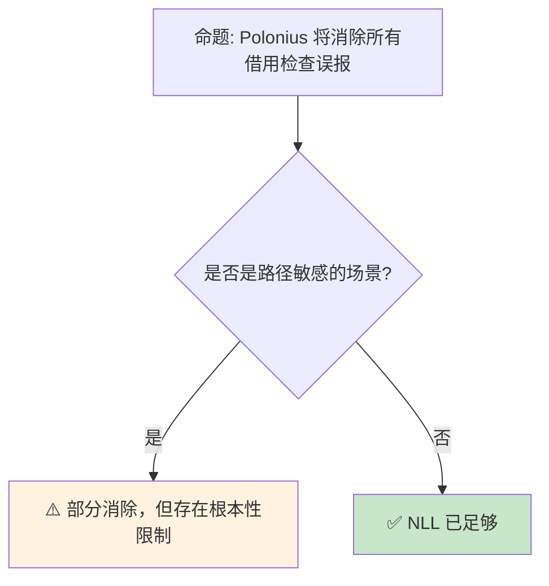

# NLL 与 Polonius：借用检查器的演进

> **Bloom 层级**: 分析 → 评价
> **定位**: 分析 Rust **借用检查器**的两次重大演进——Non-Lexical Lifetimes（NLL，1.31+ stable）如何放宽基于词法的生命周期限制，以及 **Polonius**（下一代借用检查器）如何通过基于数据流的分析进一步消除误报。
> **前置概念**: [Borrowing](../01_foundation/02_borrowing.md) · [Lifetimes](../01_foundation/03_lifetimes.md)
> **后置概念**: [RustBelt](../04_formal/04_rustbelt.md) · [Unsafe](./03_unsafe.md)

---

> **来源**: [Rust RFC 2094 — NLL](https://github.com/rust-lang/rfcs/pull/2094) · [Polonius Repository](https://github.com/rust-lang/polonius) · [Rust Blog — NLL](https://blog.rust-lang.org/2018/12/06/Rust-1.31-and-impl-2018.html) · [Rust Blog — Polonius](https://blog.rust-lang.org/inside-rust/2023/02/15/polonius-update.html) · [Niko Matsakis Blog — Borrow Check](http://smallcultfollowing.com/babysteps/blog/2019/09/21/moving-borrow-check/) · [Rust Reference — Lifetime Elision](https://doc.rust-lang.org/reference/lifetime-elision.html)

## 📑 目录

- [NLL 与 Polonius：借用检查器的演进](#nll-与-polonius借用检查器的演进)
  - [📑 目录](#-目录)
  - [一、核心概念](#一核心概念)
    - [1.1 基于词法的生命周期（Lexical Lifetimes）](#11-基于词法的生命周期lexical-lifetimes)
    - [1.2 NLL：非词法生命周期](#12-nll非词法生命周期)
    - [1.3 Polonius：基于数据流的分析](#13-polonius基于数据流的分析)
  - [二、技术细节](#二技术细节)
    - [2.1 NLL 的实现机制](#21-nll-的实现机制)
    - [2.2 Polonius 的 Origin 模型](#22-polonius-的-origin-模型)
    - [2.3 迁移路径](#23-迁移路径)
  - [三、影响分析](#三影响分析)
  - [四、反命题与边界分析](#四反命题与边界分析)
    - [4.1 反命题树](#41-反命题树)
    - [4.2 边界极限](#42-边界极限)
  - [五、常见陷阱](#五常见陷阱)
  - [六、来源与延伸阅读](#六来源与延伸阅读)
  - [相关概念文件](#相关概念文件)

---

## 一、核心概念

### 1.1 基于词法的生命周期（Lexical Lifetimes）

```text
Rust 2015 的借用检查器:

  核心假设: 引用的生命周期 = 其词法作用域
  ├── let x = &data;  // x 的生命周期 = 当前 {} 块
  └── 即使 x 最后一次使用后不再使用，生命周期仍然延续到块结束

  问题示例:
  let mut data = vec![1, 2, 3];
  let x = &data[0];     // x 借用 data
  println!("{}", x);    // x 最后一次使用
  data.push(4);         // ❌ 编译错误！
  // 错误: 不能可变借用 data，因为 x 仍在作用域内
  // 即使 x 不再使用！

  词法生命周期的保守性:
  ├── 安全: 永远不会允许不安全的借用
  ├── 精确性低: 经常拒绝实际上安全的代码
  └── 程序员 workaround: 缩小作用域（嵌套块）

  let mut data = vec![1, 2, 3];
  {
      let x = &data[0];
      println!("{}", x);
  }  // x 在这里结束
  data.push(4);  // ✅  workaround 成功
```

> **认知功能**: 词法生命周期是 Rust 最初的**保守策略**——确保绝对安全，但牺牲了表达能力。
> **关键洞察**: 这种保守性是 Rust 早期"与借用检查器战斗"体验的主要来源。
> [来源: [Rust RFC 2094 — NLL Motivation](https://github.com/rust-lang/rfcs/pull/2094)]

---

### 1.2 NLL：非词法生命周期

```text
NLL（Non-Lexical Lifetimes）的设计:

  核心洞察: 引用的生命周期应在其**最后一次使用**结束，而非作用域结束

  同样的代码，NLL 后:
  let mut data = vec![1, 2, 3];
  let x = &data[0];
  println!("{}", x);    // x 的最后一次使用
  data.push(4);         // ✅ NLL 允许！
  // x 的生命周期在 println! 后结束

  NLL 的改进:
  ├── 生命周期基于"使用点"而非"作用域"
  ├── 控制流敏感: 不同分支有不同的生命周期结束点
  └── 大量保守的编译错误被消除

  NLL 与 Rust 2018:
  ├── NLL 在 Rust 1.31（Edition 2018）中稳定
  ├── 也部分回溯到 Rust 2015
  └── 是 Rust 可用性提升的里程碑
```

> **NLL 洞察**: NLL 将借用检查从**语法分析**提升为**数据流分析**——引用的有效性追踪到其最后一次使用，而非语法作用域边界。
> [来源: [Rust Blog — NLL Stabilization](https://blog.rust-lang.org/2018/12/06/Rust-1.31-and-impl-2018.html)]

---

### 1.3 Polonius：基于数据流的分析

```text
Polonius 的动机:

  NLL 仍然无法处理的场景:
  let mut data = vec![1, 2, 3];
  let x = &data[0];
  if some_condition {
      println!("{}", x);  // 分支 1 使用 x
  } else {
      data.push(4);       // ❌ NLL 仍拒绝！
      // 错误: x 可能在另一个分支中使用
  }
  // 即使 some_condition 为 false 时，x 根本不会被使用

  Polonius 的解决方案:
  ├── 基于数据流分析（Dataflow Analysis）
  ├── 追踪引用在控制流图中的传播
  └── 区分不同执行路径上的借用关系

  Polonius 的分析:
  ├── 如果 some_condition == false:
  │   └── x 从未被使用 → 允许 data.push
  ├── 如果 some_condition == true:
  │   └── x 被使用 → 拒绝 data.push
  └── 但 Rust 需要在编译期确定（不能运行时判断）

  实际结果:
  └── 上述代码仍然被拒绝（因为存在一条路径 x 被使用）
      // Polonius 的目标不是消除所有保守性
      // 而是消除"明显安全但被拒绝"的情况
```

> **Polonius 洞察**: Polonius 不是让借用检查器"更宽松"，而是让它"**更精确**"——基于数据流的 borrow set 追踪，而非近似的作用域分析。
> [来源: [Polonius README](https://github.com/rust-lang/polonius)] · [来源: [Niko Matsakis — Polonius](http://smallcultfollowing.com/babysteps/blog/2019/01/17/polonius-and-region-errors/)]

---

## 二、技术细节

### 2.1 NLL 的实现机制

```text
NLL 的编译期算法:

  1. 构建 MIR（Mid-level IR）
     ├── 将 Rust 代码转换为基本块（Basic Block）控制流图
     └── 每个语句和终止符都是 MIR 的一部分

  2. 生成 borrow 约束
     ├── 每个借用产生一个"借用区域"（region）
     ├── 约束: 借用区域必须包含所有使用点
     └── 约束求解确定最小生命周期

  3. 数据流分析
     ├── 前向分析: 哪些借用是"活跃的"
     ├── 后向分析: 哪些值是"死亡的"
     └── 结合确定借用的结束点

  4. 错误生成
     ├── 如果可变借用与活跃借用冲突 → 错误
     ├── 错误指向借用的**创建点**和**冲突点**
     └── NLL 的错误信息比词法生命周期更精确

  与词法生命周期的差异:
  ┌─────────────────┬─────────────────┬─────────────────┐
  │ 特性            │ 词法生命周期    │ NLL             │
  ├─────────────────┼─────────────────┼─────────────────┤
  │ 生命周期结束    │ 作用域结束      │ 最后一次使用    │
  │ 错误指向        │ 借用创建点      │ 冲突使用点      │
  │ 分支敏感        │ 否              │ 部分            │
  │ 实现复杂度      │ 低              │ 中              │
  └─────────────────┴─────────────────┴─────────────────┘
```

> **实现洞察**: NLL 的核心是**MIR 上的数据流分析**——它将借用检查从 AST 层下移到 MIR 层，获得更精细的控制流信息。
> [来源: [rustc-dev-guide — NLL](https://rustc-dev-guide.rust-lang.org/borrow_check.html)]

---

### 2.2 Polonius 的 Origin 模型

```text
Polonius 的核心抽象: Origin（起源）

  传统模型: 生命周期是"时间区间"
  ├── 'a = 从第 5 行到第 10 行
  └── 问题: 区间合并导致过度近似

  Polonius 模型: 生命周期是"借用点的集合"
  ├── 'a = {borrow1, borrow2, ...}
  ├── 每个借用点追踪其来源（origin）
  └── 更精确地表达"哪些借用是活跃的"

  数据流方程:
  ├── 每个基本块输入一组活跃的 loan
  ├── 块内语句可能"激活"或"杀死" loan
  └── 输出传播到后继块

  与 NLL 的关系:
  ├── NLL 是 Polonius 的简化版
  ├── Polonius 更精确，但计算更昂贵
  └── 未来可能: Polonius 作为可选的"严格模式"

  当前状态（截至 2026）:
  ├── Polonius 仍在积极开发中
  ├── 部分算法已集成到 rustc
  └── 完全替换 NLL 仍需时间
```

> **Origin 洞察**: Polonius 的"借用点集合"模型是**集合论**在编译器中的优雅应用——它将时间区间的连续近似转化为离散点的精确追踪。
> [来源: [Polonius Paper — OOPSLA 2021](https://github.com/rust-lang/polonius/blob/master/papers/poplar-oopsla-2021.pdf)]

---

### 2.3 迁移路径

```text
Rust 借用检查器的演进时间线:

  2010-2015: 词法生命周期（Rust 1.0）
  ├── 基于 AST 的作用域分析
  ├── 保守但简单
  └── "与借用检查器战斗"的时代

  2018: NLL 稳定（Rust 1.31）
  ├── 基于 MIR 的数据流分析
  ├── 消除大量保守错误
  └── Rust 2018 Edition 的旗舰特性

  2020+: Polonius 开发中
  ├── 更精确的 borrow set 追踪
  ├── 处理更复杂的控制流模式
  └── 目标是进一步消除误报

  未来方向:
  ├── 更精确的路径敏感分析
  ├── 与类型系统更深集成
  └── 可能支持部分"流敏感"借用
```

> **演进洞察**: 借用检查器的演进反映了 Rust 的**长期承诺**——在不牺牲安全的前提下，持续提升表达力和可用性。
> [来源: [Rust Roadmap — Borrow Checker](https://github.com/rust-lang/rust/labels/A-borrow-checker)]

---

## 三、影响分析

```text
NLL 对生态的影响:

  代码简化:
  ├── 大量嵌套作用域的 workaround 被消除
  ├── API 设计更灵活（如 Entry API）
  └── 学习曲线降低

  误报减少:
  ├── 编译器错误信息更准确
  ├── "这代码明明安全为什么编译不过"的抱怨减少
  └── 开发者对借用检查器的信任提升

  Polonius 的预期影响:
  ├── 进一步消除复杂控制流中的误报
  ├── 使某些高级模式（如 self-referential）更容易表达
  └── 可能为某些 unsafe 代码提供安全替代

  形式化验证视角:
  ├── NLL/Polonius 的分析是可形式化的
  ├── RustBelt 已证明 NLL 的安全性
  └── Polonius 的 Origin 模型也有形式化对应
```

> **影响洞察**: NLL 是 Rust 从"研究语言"走向"工业语言"的关键一步——它证明了**安全保证不需要牺牲可用性**。
> [来源: [Rust Survey Results](https://blog.rust-lang.org/2020/12/16/rust-survey-2020.html)]

---

## 四、反命题与边界分析

### 4.1 反命题树



> **认知功能**: 此决策树展示 Polonius 的**能力边界**。它消除的是"明显安全但被保守拒绝"的情况，不是所有编译错误。
> **关键洞察**: 借用检查器的根本限制是**必须在编译期确定安全性**——某些运行时才能确定的模式永远无法被接受。
> [来源: [Rust Reference — Borrowing](https://doc.rust-lang.org/reference/expressions.html#borrow-operators)]

---

### 4.2 边界极限

```text
边界 1: 编译期确定性要求
├── 借用检查器不能依赖运行时信息
├── if condition { use_ref } else { mutate }
├── 即使 condition 在运行时总是 false
└── 编译器仍必须拒绝（存在一条不安全路径）

边界 2: 自引用结构
├── NLL/Polonius 不解决自引用问题
├── Pin 仍然需要
├── 某些自引用模式可能需要 unsafe
└── 这是所有权模型的根本限制

边界 3: 跨函数分析
├── NLL 分析单个函数的 MIR
├── 不追踪跨函数的借用关系
├── 复杂场景需要显式生命周期标注
└── 全局分析计算成本过高

边界 4: 与 unsafe 的交互
├── NLL 不分析 unsafe 块内的裸指针
├── unsafe 代码绕过借用检查器
├── 借用检查器假设 unsafe 代码是"正确"的
└── Miri 等工具补充检测 unsafe 中的问题

边界 5: 编译时间
├── Polonius 的精确分析更耗时
├── 大型 crate 的编译时间可能增加
├── 需要优化算法实现
└── 可能与增量编译产生冲突
```

> **边界要点**: 借用检查器的边界主要与**编译期确定性**、**自引用**、**跨函数分析**、**unsafe 交互**和**编译性能**相关。
> [来源: [Rustonomicon — Borrowing](https://doc.rust-lang.org/nomicon/borrow-splitting.html)]

---

## 五、常见陷阱

```text
陷阱 1: 认为 NLL 后所有代码都能编译
  ❌ 期望 Polonius 能解决所有借用问题
     // 某些模式本质上是 unsafe 的

  ✅ 理解借用检查器的根本限制
     // 必要时使用 Rc/RefCell/unsafe

陷阱 2: 过度依赖 NLL 的灵活性
  ❌ 写依赖 NLL 的复杂控制流
     // 代码难以阅读和维护

  ✅ 优先使用简单的借用模式
     // NLL 是安全网，不是设计目标

陷阱 3: 忽略错误信息的改进
  ❌ 看到借用错误就盲目 clone
     // NLL 的错误信息已大幅改进

  ✅ 仔细阅读编译器建议
     // rustc 经常建议正确的修复方案

陷阱 4: 混淆 NLL 和生命周期省略
  ❌ 认为 NLL 消除了所有生命周期标注需求
     // NLL 只影响函数体内，不影响签名

  ✅ 公共 API 仍需要显式生命周期标注
     // NLL 不替代签名级的设计

陷阱 5: 在 unsafe 中假设 NLL 保护
  ❌ 在 unsafe 块内依赖 NLL 防止数据竞争
     // NLL 不分析 unsafe 代码

  ✅ unsafe 代码需要手动保证安全
     // 使用 Miri 验证
```

> **陷阱总结**: NLL/Polonius 的陷阱主要与**期望管理**、**代码设计**、**错误信息利用**、**签名标注**和**unsafe 边界**相关。
> [来源: [Rust Compiler Error E0502](https://doc.rust-lang.org/error_codes/E0502.html)]

---

## 六、来源与延伸阅读

| 来源 | 可信度 | 说明 |
|:---|:---:|:---|
| [RFC 2094 — NLL](https://github.com/rust-lang/rfcs/pull/2094) | ✅ 一级 | NLL RFC |
| [Polonius Repository](https://github.com/rust-lang/polonius) | ✅ 一级 | Polonius 项目 |
| [Rust Blog — NLL](https://blog.rust-lang.org/2018/12/06/Rust-1.31-and-impl-2018.html) | ✅ 一级 | NLL 稳定公告 |
| [Niko Matsakis — Polonius](http://smallcultfollowing.com/babysteps/blog/2019/01/17/polonius-and-region-errors/) | ✅ 二级 | 设计深度分析 |
| [rustc-dev-guide — Borrow Check](https://rustc-dev-guide.rust-lang.org/borrow_check.html) | ✅ 一级 | 编译器实现 |

---

## 相关概念文件

- [Borrowing](../01_foundation/02_borrowing.md) — 借用规则
- [Lifetimes](../01_foundation/03_lifetimes.md) — 生命周期
- [Pin](./06_pin_unpin.md) — Pin 不动性
- [RustBelt](../04_formal/04_rustbelt.md) — 形式化验证

---

> **权威来源**: [Rust Reference](https://doc.rust-lang.org/reference/), [The Rust Programming Language](https://doc.rust-lang.org/book/)
>
> **权威来源对齐变更日志**: 2026-05-22 创建 [来源: Authority Source Sprint Batch 9]

**文档版本**: 1.0
**对应 Rust 版本**: 1.96.0+ (Edition 2024)
**最后更新**: 2026-05-22
**状态**: ✅ 概念文件创建完成
