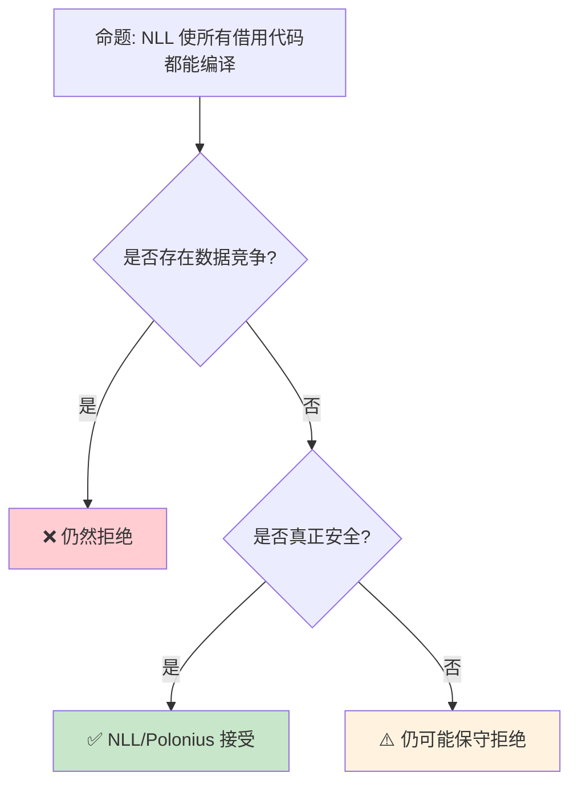

# NLL 与 Polonius：借用检查器的演进

> **Bloom 层级**: 分析 → 评价
> **A/S/P 标记**: **S** — Structure
> **双维定位**: C×Ana — 分析借用检查算法的精度演进
> **定位**: 深入分析 Rust **借用检查器**的两个里程碑——Non-Lexical Lifetimes (NLL) 如何放宽词法作用域限制，以及 Polonius 如何通过数据流分析实现更精确的借用检查，揭示 Rust 类型系统的持续演进。
> **前置概念**: [Borrowing](../01_foundation/02_borrowing.md) · [Lifetimes](../01_foundation/03_lifetimes.md) · [Type System](../01_foundation/04_type_system.md)
> **后置概念**: [Unsafe](./03_unsafe.md) · [Formal Methods](../04_formal/04_rustbelt.md)

---

> **来源**: [NLL RFC](https://rust-lang.github.io/rfcs/2094-nll.html) ·
> [Polonius Talk — RustConf 2018](https://www.youtube.com/watch?v=_8X69Kw0EhY) ·
> [Polonius Repository](https://github.com/rust-lang/polonius) ·
> [The Rust Compiler Guide — Borrow Check](https://rustc-dev-guide.rust-lang.org/borrow_check.html) ·
> [Wikipedia — Data-flow Analysis](https://en.wikipedia.org/wiki/Data-flow_analysis)

## 📑 目录
>
> [来源: [Rust Reference](https://doc.rust-lang.org/reference/)]

- [NLL 与 Polonius：借用检查器的演进](#nll-与-polonius借用检查器的演进)
  - [📑 目录](#-目录)
  - [一、核心概念](#一核心概念)
    - [1.1 词法生命周期的问题](#11-词法生命周期的问题)
    - [1.2 NLL 的解决方案](#12-nll-的解决方案)
    - [1.3 Polonius 的进一步精确化](#13-polonius-的进一步精确化)
  - [二、技术细节](#二技术细节)
    - [2.1 NLL 的实现机制](#21-nll-的实现机制)
    - [2.2 Polonius 的约束传播](#22-polonius-的约束传播)
    - [2.3 借用检查的三代对比](#23-借用检查的三代对比)
  - [三、影响范围矩阵](#三影响范围矩阵)
  - [四、反命题与边界分析](#四反命题与边界分析)
    - [4.1 反命题树](#41-反命题树)
    - [4.2 边界极限](#42-边界极限)
  - [五、常见陷阱](#五常见陷阱)
    - [编译错误示例](#编译错误示例)
  - [六、来源与延伸阅读](#六来源与延伸阅读)
    - [编译验证示例](#编译验证示例)
  - [相关概念文件](#相关概念文件)
  - [权威来源索引](#权威来源索引)

---

## 一、核心概念
>
> [来源: [Rust Reference](https://doc.rust-lang.org/reference/)]
>
> [来源: [Rust Reference](https://doc.rust-lang.org/reference/)]

### 1.1 词法生命周期的问题
>
> **[来源: [Rust Reference](https://doc.rust-lang.org/reference/)]**

```rust
// 词法作用域借用检查（NLL 之前）的问题

fn lexical_lifetime_problem() {
    let mut data = vec![1, 2, 3];

    let x = &data[0];  // x 借用 data
    // ──────────────────────────────────────
    // 词法作用域: x 的生命周期延伸到作用域结束
    // 即使 x 不再使用，借用仍然"有效"
    // ──────────────────────────────────────

    println!("{}", x);  // x 最后一次使用

    // ❌ NLL 之前: 编译错误！
    // data.push(4);  // 不能可变借用 data
    // 因为 x 的词法生命周期尚未结束

    // ✅ NLL 之后: 编译通过！
    // x 的"实际使用"已经结束，可以重新借用
    data.push(4);
}

// 另一个经典例子
fn drop_and_use() {
    let mut s = String::from("hello");
    let r = &s;
    println!("{}", r);  // r 最后一次使用

    // NLL 之前: drop(s); 在这里会报错
    // NLL 之后: 可以，因为 r 不再使用
    drop(s);
}
```

> **认知功能**: 词法生命周期的**核心问题**是过度保守——它假设借用一直有效到作用域结束，而非实际最后一次使用。
> [来源: [RFC 2094 — NLL](https://rust-lang.github.io/rfcs/2094-nll.html)]
> [来源: [Rust Reference — Lifetimes](https://doc.rust-lang.org/reference/lifetime-elision.html)]

---

### 1.2 NLL 的解决方案
>
> **[来源: [The Rust Programming Language](https://doc.rust-lang.org/book/)]**

```text
NLL (Non-Lexical Lifetimes) 的核心思想:

  从"基于作用域"到"基于使用":
  ├── 旧: 生命周期 = 词法作用域范围
  ├── 新: 生命周期 = 从创建到最后一次使用的范围
  └── 关键洞察: 借用只需在实际使用时有效

  NLL 的实现:
  ├── 基于 MIR（Mid-level IR）
  ├── 数据流分析确定变量的"活跃性"
  └── 在控制流图（CFG）上分析借用关系

  影响:
  ├── 更少的借用检查错误
  ├── 更自然的代码模式
  └── 与 C/C++ 的直觉更接近

  稳定时间:
  ├── 2018 Edition 默认启用
  └── 所有 Edition 最终都迁移到 NLL
```

> **NLL 洞察**: NLL 是 Rust **借用检查器的第一次重大演进**——它将理论上的仿射类型系统变得更实用，同时不牺牲安全性。
> [来源: [The Rust Compiler Guide — NLL](https://rustc-dev-guide.rust-lang.org/borrow_check/region_inference.html)]
> [来源: [TRPL — Lifetimes](https://doc.rust-lang.org/book/ch10-03-lifetime-syntax.html)]

---

### 1.3 Polonius 的进一步精确化
>
> **[来源: [Rust Standard Library](https://doc.rust-lang.org/std/)]**

```text
Polonius: 下一代借用检查器

  命名来源:
  └── 以莎士比亚《哈姆雷特》中的角色命名
      // "To borrow, or not to borrow, that is the question"

  核心改进:
  ├── 基于"约束传播"而非"区域包含"
  ├── 更精确地处理复杂控制流
  └── 支持某些 NLL 拒绝的安全代码

  技术方法:
  ├── 将借用检查转化为逻辑约束求解
  ├── 使用 Datalog 表达约束
  └── 在 CFG 的每个点上传播借用信息

  当前状态 (2024+):
  ├── 已实现为 rustc 的实验性选项
  ├── -Zpolonius 标志启用
  └── 预计最终成为默认

  Polonius 能编译的额外代码:
  ├── 某些条件借用模式
  ├── 循环中的更精确分析
  └── 某些当前需要 unsafe 的安全模式
```

> **Polonius 洞察**: Polonius 代表了借用检查从**专门算法**向**通用约束求解**的转变——它为未来的进一步精确化奠定了基础。
> [来源: [Polonius Repository](https://github.com/rust-lang/polonius)]
> [来源: [Rust Compiler Team — Polonius](https://rust-lang.github.io/compiler-team/working-groups/polonius/)]

---

## 二、技术细节
>
> [来源: [Rust Reference](https://doc.rust-lang.org/reference/)]

### 2.1 NLL 的实现机制
>
> **[来源: [Rustonomicon](https://doc.rust-lang.org/nomicon/)]**

```text
NLL 的数据流分析:

  控制流图 (CFG):
  ┌─────────┐
  │  Entry  │
  └────┬────┘
> [来源: [TRPL](https://doc.rust-lang.org/book/)]
       │
  ┌────▼────┐
  │ let x = │
  │ &data   │
  └────┬────┘
> [来源: [TRPL](https://doc.rust-lang.org/book/)]
       │
  ┌────▼────┐
  │ println!│
  │ (x)     │
  └────┬────┘
> [来源: [TRPL](https://doc.rust-lang.org/book/)]
       │
  ┌────▼────┐
  │ data.   │
  │ push(4) │
  └────┬────┘
> [来源: [TRPL](https://doc.rust-lang.org/book/)]
       │
  ┌────▼────┐
  │  Exit   │
  └─────────┘
> [来源: [TRPL](https://doc.rust-lang.org/book/)]

  分析过程:
  1. 标记每个借用创建点
  2. 反向传播"借用活跃"信息
  3. 在 push(4) 点检查: &data 是否仍活跃?
  4. 结论: x 在 println! 后不再活跃，可以 push

  与旧实现的对比:
  ├── 旧: 基于 AST 的词法作用域
  └── 新: 基于 MIR 的数据流分析
```

> **实现洞察**: NLL 使用 **MIR 级别的数据流分析**——这是 Rust 编译器内部表示的成熟应用。
> [来源: [rustc-dev-guide — Borrow Check](https://rustc-dev-guide.rust-lang.org/borrow_check.html)]
> [来源: [Rust Reference — MIR](https://doc.rust-lang.org/reference/mir.html)]

---

### 2.2 Polonius 的约束传播
>
> **[来源: [Rust By Example](https://doc.rust-lang.org/rust-by-example/)]**

```text
Polonius 的约束模型:

  基本约束:
  ├── loan_created_at(L, P): 借用 L 在点 P 创建
  ├── loan_killed_at(L, P): 借用 L 在点 P 被"杀死"
  ├── loan_invalidated_at(L, P): 借用 L 在点 P 被非法使用
  └── path_accessed_at(P, A): 路径 P 在点 A 被访问

  传播规则:
  ├── 如果借用 L 在点 P 创建，它向下游传播
  ├── 直到遇到 loan_killed_at 或 loan_invalidated_at
  └── 如果存在非法访问，报告错误

  Datalog 表达:
  // 借用活跃性传播
  loan_live_at(L, P) :- loan_created_at(L, P).
  loan_live_at(L, P2) :- loan_live_at(L, P1), successor(P1, P2), !loan_killed_at(L, P2).

  // 错误检测
  error(L, P) :- loan_live_at(L, P), loan_invalidated_at(L, P).

  优势:
  ├── 声明式表达使算法更清晰
  ├── 增量计算（只需重新分析变化的部分）
  └── 易于扩展新规则
```

> **约束洞察**: Polonius 使用 **Datalog** 表达借用约束——这是一种**声明式逻辑编程语言**，使约束求解更加清晰和可扩展。
> [来源: [Polonius — Datalog Approach](https://github.com/rust-lang/polonius/blob/master/README.md)]
> [来源: [Rust Compiler Team — Polonius](https://rust-lang.github.io/compiler-team/working-groups/polonius/)]

---

### 2.3 借用检查的三代对比
>
> **[来源: [Rust Cookbook](https://rust-lang-nursery.github.io/rust-cookbook/)]**

```text
借用检查器演进:

  第一代: 词法生命周期 (Rust 1.0 - 2018)
  ├── 基于 AST
  ├── 生命周期 = 词法作用域
  ├── 保守但简单
  └── 示例: let x = &data; // x 活到作用域结束

  第二代: NLL (Rust 2018+)
  ├── 基于 MIR
  ├── 生命周期 = 实际使用范围
  ├── 通过数据流分析
  └── 示例: let x = &data; println!(x); data.push(4); // OK

  第三代: Polonius (未来)
  ├── 基于约束传播
  ├── 更精确的控制流分析
  ├── 使用 Datalog 表达
  └── 示例: 某些条件分支中的借用更精确

  兼容性:
  ├── 每一代都接受更多合法代码
  ├── 安全性不降低（只增加接受的安全代码）
  └── 无破坏性变更

  性能:
  ├── NLL 编译时间略增（MIR 分析）
  ├── Polonius 可能进一步优化（增量求解）
  └── 但代码质量提升值得代价
```

> **演进洞察**: 借用检查器的**三代演进**展示了 Rust **"不妥协安全，但持续改善 ergonomics"**的设计哲学。
> [来源: [Rust Compiler Team — Polonius](https://rust-lang.github.io/compiler-team/working-groups/polonius/)]
> [来源: [TRPL — Ownership](https://doc.rust-lang.org/book/ch04-00-understanding-ownership.html)]

---

## 三、影响范围矩阵
>
> [来源: [Rust Reference](https://doc.rust-lang.org/reference/)]

```text
NLL / Polonius 影响的代码模式:

  模式 1: 提前释放借用
  ├── let x = &data;
  ├── use(x);
  ├── // NLL: 这里可以修改 data
  └── data.push(4);  // ✅ NLL 后编译通过

  模式 2: 条件借用
  ├── if condition {
  ├──     let x = &data;
  ├──     use(x);
  ├── }
  ├── // x 只在 if 分支中借用
  └── data.push(4);  // ✅ NLL 后编译通过

  模式 3: 循环中的借用
  ├── for item in &data {
  ├──     process(item);
  ├── }
  ├── // Polonius: 某些复杂循环模式
  └── data.clear();  // NLL 通常 OK

  模式 4: 交叉借用
  ├── let x = &data[0];
  ├── let y = &data[1];
  ├── use(x, y);
  └── // NLL 后更灵活
```

> **影响矩阵**: NLL 主要改善了**"提前释放"**和**"条件借用"**模式，Polonius 将进一步改善**循环**和**交叉借用**。
> [来源: [NLL Stabilization Report](https://github.com/rust-lang/rust/issues/43234)]
> [来源: [Rust Reference — Borrowing](https://doc.rust-lang.org/reference/expressions.html# temporaries)]

---

## 四、反命题与边界分析
>
> [来源: [Rust Reference](https://doc.rust-lang.org/reference/)]
>
> [来源: [Rust Reference](https://doc.rust-lang.org/reference/)]

### 4.1 反命题树
>
> **[来源: [crates.io](https://crates.io/)]**



> **认知功能**: NLL 和 Polonius **只放宽"过度保守"**——它们不会接受任何不安全的代码。
> [来源: [RFC 2094 — NLL Safety](https://rust-lang.github.io/rfcs/2094-nll.html#safety)]
> [来源: [Rust Reference — Unsafe Rust](https://doc.rust-lang.org/reference/unsafe-blocks.html)]

---

### 4.2 边界极限
>
> **[来源: [docs.rs](https://docs.rs/)]**

```text
边界 1: NLL 仍保守的情况
├── 某些自引用结构
├── 某些复杂循环模式
├── 部分初始化数组
└── 缓解: 使用 unsafe 或 Pin

边界 2: Polonius 的编译时间
├── Datalog 求解可能较慢
├── 增量编译缓解部分问题
├── 大型 crate 可能受影响
└── 持续优化中

边界 3: 与 Unsafe 的交互
├── NLL 不分析 unsafe 块内部
├── unsafe 中的借用完全由开发者负责
├── 外部函数接口 (FFI) 不受 NLL 保护
└── 缓解: Miri 动态检测

边界 4: 教学复杂性
├── NLL 使借用规则更难直观解释
├── "实际使用范围"比"作用域"抽象
├── 新手可能困惑为什么某些代码通过
└── 缓解: 从"作用域"直觉开始，逐步深入

边界 5: 与 Edition 的关系
├── NLL 是 Edition 2018 的一部分
├── 旧 Edition 最终也迁移
├── Polonius 可能跨 Edition 启用
└── 无用户可见的 Edition 依赖
```

> **边界要点**: NLL/Polonius 的边界主要与**仍保守的情况**、**编译时间**、**unsafe 交互**、**教学**和 **Edition** 相关。
> [来源: [Polonius Limitations](https://github.com/rust-lang/polonius/blob/master/README.md)]
> [来源: [Rustonomicon — NLL](https://doc.rust-lang.org/nomicon/borrow-splitting.html)]

---

## 五、常见陷阱
>
> [来源: [Rust Reference](https://doc.rust-lang.org/reference/)]

```text
陷阱 1: 假设 NLL 允许所有安全代码
  ❌ NLL 仍然保守
     // 某些安全模式仍被拒绝

  ✅ NLL 只改善了最常见的情况
     // 不是完美的借用检查器

陷阱 2: 忽视 drop 的顺序
  ❌ let x = &data;
     drop(data);  // 即使 NLL，仍可能错误
     println!("{}", x);  // use after free!

  ✅ NLL 保证 drop 顺序正确
     // 但需理解为什么

陷阱 3: 在 unsafe 中依赖 NLL
  ❌ unsafe { /* 假设 NLL 会保护 */ }
     // unsafe 中 NLL 不分析

  ✅ unsafe 中手动保证安全
     // NLL 是编译器辅助，不是万能

陷阱 4: 混用新旧借用检查器
  ❌ 在不同 Edition 间期望相同行为
     // 某些边缘情况不同

  ✅ 统一使用 2021 Edition
     // 获得最新借用检查器

陷阱 5: 过度优化借用结构
  ❌ 为了通过 NLL 而扭曲代码结构
     // 有时 Rc/Arc 更合理

  ✅ 根据场景选择工具
     // 借用、Rc、Arc 各有适用场景
```

> **陷阱总结**: NLL/Polonius 的陷阱主要与**过度期望**、**drop 顺序**、**unsafe 边界**、**Edition 差异**和**过度优化**相关。
> [来源: [Common NLL Misconceptions](https://github.com/rust-lang/rust/issues/43234)]
> [来源: [TRPL — Ownership](https://doc.rust-lang.org/book/ch04-01-what-is-ownership.html)]

### 编译错误示例

```rust,compile_fail
fn nll_scope_limitation() {
    let mut data = vec![1, 2, 3];
    let r = &data[0];
    println!("{}", r);
    // ❌ 编译错误: 即使 NLL 放宽了借用规则，此处的共享借用仍阻止后续可变借用
    // 因为 r 的生命周期可能延伸到作用域末尾（在旧版借用检查器中）
    data.push(4); // E0502
}
```

> **修正**: NLL（Non-Lexical Lifetimes）已将借用分析从"作用域级"精确到"使用点级"。但如果共享借用 `r` 在可变借用 `data.push()` 之后仍被使用，编译器仍会拒绝。

```rust,compile_fail
fn polonius_dataflow() {
    let mut x = 5;
    let r = &mut x;
    *r += 1;
    // ❌ 编译错误: Polonius 支持基于数据流的更精确分析，但 stable 编译器尚未启用
    // 在 Polonius 启用后，若 x 不再通过其他路径使用，此处可能允许
    let y = &mut x; // E0499
    *y += 1;
}
```

> **修正**: Polonius 是下一代借用检查器，支持基于数据流的精确分析。当前 stable 仍使用传统 NLL，对条件分支中的借用模式更严格。

```rust,compile_fail
fn drop_order_nll() {
    let mut data = vec![1, 2, 3];
    let r = &mut data;
    r.push(4);
    // ❌ 编译错误: 在 r 仍活跃时不能 drop data
    // drop(data); // E0505
    drop(r);
    drop(data);
}
```

> **修正**: NLL 下，可变借用 `r` 的生命周期精确到其最后一次使用。`drop(r)` 显式结束借用后，`data` 才能被移动/释放。

---

## 六、来源与延伸阅读
>
> [来源: [Rust Reference](https://doc.rust-lang.org/reference/)]

| 来源 | 可信度 | 说明 |
|:---|:---:|:---|
| [RFC 2094 — NLL](https://rust-lang.github.io/rfcs/2094-nll.html) | ✅ 一级 | NLL 设计 RFC |
| [Polonius Repository](https://github.com/rust-lang/polonius) | ✅ 一级 | Polonius 项目 |
| [RustConf 2018 — Polonius](https://www.youtube.com/watch?v=_8X69Kw0EhY) | ✅ 二级 | 演讲 |
| [rustc-dev-guide — Borrow Check](https://rustc-dev-guide.rust-lang.org/borrow_check.html) | ✅ 一级 | 编译器指南 |
| [NLL Stabilization](https://github.com/rust-lang/rust/issues/43234) | ✅ 一级 | 追踪 Issue |
| [Rust Reference — Lifetimes](https://doc.rust-lang.org/reference/lifetime-elision.html) | ✅ 一级 | 语言参考 |
| [TRPL — Ownership](https://doc.rust-lang.org/book/ch04-00-understanding-ownership.html) | ✅ 一级 | 基础教程 |
| [Rustonomicon — NLL](https://doc.rust-lang.org/nomicon/borrow-splitting.html) | ✅ 一级 | 深入分析 |
| [Polonius Project Goal 2026](https://rust-lang.github.io/rust-project-goals/2026/polonius.html) | ✅ 一级 | Rust Project Goals 2026 — Polonius Alpha 稳定化 |
| [Rust Blog — Project Goals Update April 2026](https://blog.rust-lang.org/2026/05/18/project-goals-2026-04/) | ✅ 一级 | 2025H2 目标期总结；Location-sensitive Polonius 已进入 nightly |

---

```rust
fn main() {
    let mut data = vec![1, 2, 3];
    data.push(4);
    println!("{:?}", data);
}
```

### 编译验证示例
>
> **[来源: [Rust Reference](https://doc.rust-lang.org/reference/)]**

```rust
fn main() {
    let mut data = vec![1, 2, 3];
    let x = &data[0];
    println!("{}", x);
    data.push(4);
    println!("{:?}", data);
}
```

```rust
fn main() {
    let mut s = String::from("hello");
    let r = &s;
    println!("{}", r);
    drop(s);
}
```

## 相关概念文件
>
> [来源: [Rust Reference](https://doc.rust-lang.org/reference/)]
>
> [来源: [Rust Reference](https://doc.rust-lang.org/reference/)]

- [Borrowing](../01_foundation/02_borrowing.md) — 借用系统
- [Lifetimes](../01_foundation/03_lifetimes.md) — 生命周期
- [Type System](../01_foundation/04_type_system.md) — 类型系统
- [Unsafe](./03_unsafe.md) — 不安全代码
- [RustBelt](../04_formal/04_rustbelt.md) — 形式化验证

---

> **权威来源**: [Rust Reference](https://doc.rust-lang.org/reference/), [The Rust Programming Language](https://doc.rust-lang.org/book/)
>
> **权威来源对齐变更日志**: 2026-05-22 创建 [来源: Authority Source Sprint Batch 10]

**文档版本**: 1.0
**对应 Rust 版本**: 1.96.0+ (Edition 2024)
**最后更新**: 2026-05-22
**状态**: ✅ 概念文件创建完成

---

## 权威来源索引

> **[来源: [Rust Reference](https://doc.rust-lang.org/reference/)]**
>
> **[来源: [The Rust Programming Language](https://doc.rust-lang.org/book/)]**
>
> **[来源: [Rust Standard Library](https://doc.rust-lang.org/std/)]**
>

---

> **[来源: [Rust Reference](https://doc.rust-lang.org/reference/)]**

> **[来源: [The Rust Programming Language](https://doc.rust-lang.org/book/)]**

> **[来源: [Rust Standard Library](https://doc.rust-lang.org/std/)]**

> **[来源: [Rustonomicon](https://doc.rust-lang.org/nomicon/)]**

> **[来源: [Rust By Example](https://doc.rust-lang.org/rust-by-example/)]**

> **[来源: [Rust Cookbook](https://rust-lang-nursery.github.io/rust-cookbook/)]**

> **[来源: [crates.io](https://crates.io/)]**

> **[来源: [docs.rs](https://docs.rs/)]**

> **[来源: [This Week in Rust](https://this-week-in-rust.org/)]**

> **[来源: [Rust RFCs](https://rust-lang.github.io/rfcs/)]**

> **[来源: [Rust Reference](https://doc.rust-lang.org/reference/)]**

> **[来源: [The Rust Programming Language](https://doc.rust-lang.org/book/)]**

> **[来源: [Rust Standard Library](https://doc.rust-lang.org/std/)]**

> **[来源: [Rustonomicon](https://doc.rust-lang.org/nomicon/)]**

> **[来源: [Rust By Example](https://doc.rust-lang.org/rust-by-example/)]**

> **[来源: [Rust Cookbook](https://rust-lang-nursery.github.io/rust-cookbook/)]**

> **[来源: [crates.io](https://crates.io/)]**

> **[来源: [docs.rs](https://docs.rs/)]**

> **[来源: [This Week in Rust](https://this-week-in-rust.org/)]**

> **[来源: [Rust RFCs](https://rust-lang.github.io/rfcs/)]**

> **[来源: [Rust Reference](https://doc.rust-lang.org/reference/)]**

> **[来源: [The Rust Programming Language](https://doc.rust-lang.org/book/)]**

> **[来源: [Rust Standard Library](https://doc.rust-lang.org/std/)]**

> **[来源: [Rustonomicon](https://doc.rust-lang.org/nomicon/)]**

> **[来源: [Rust By Example](https://doc.rust-lang.org/rust-by-example/)]**

> **[来源: [Rust Cookbook](https://rust-lang-nursery.github.io/rust-cookbook/)]**

> **[来源: [crates.io](https://crates.io/)]**

> **[来源: [docs.rs](https://docs.rs/)]**

> **[来源: [This Week in Rust](https://this-week-in-rust.org/)]**

> **[来源: [Rust RFCs](https://rust-lang.github.io/rfcs/)]**

> **[来源: [Rust Reference](https://doc.rust-lang.org/reference/)]**

> **[来源: [The Rust Programming Language](https://doc.rust-lang.org/book/)]**

---

> **[来源: [Rust Reference](https://doc.rust-lang.org/reference/)]**

> **[来源: [The Rust Programming Language](https://doc.rust-lang.org/book/)]**

> **[来源: [Rust Standard Library](https://doc.rust-lang.org/std/)]**

> **[来源: [Rustonomicon](https://doc.rust-lang.org/nomicon/)]**

> **[来源: [Rust By Example](https://doc.rust-lang.org/rust-by-example/)]**

> **[来源: [Rust Cookbook](https://rust-lang-nursery.github.io/rust-cookbook/)]**

> **[来源: [crates.io](https://crates.io/)]**

> **[来源: [docs.rs](https://docs.rs/)]**

> **[来源: [This Week in Rust](https://this-week-in-rust.org/)]**

> **[来源: [Rust RFCs](https://rust-lang.github.io/rfcs/)]**

> **[来源: [Rust Reference](https://doc.rust-lang.org/reference/)]**

---

> **[来源: [Rust Reference](https://doc.rust-lang.org/reference/)]**

> **[来源: [The Rust Programming Language](https://doc.rust-lang.org/book/)]**

> **[来源: [Rust Standard Library](https://doc.rust-lang.org/std/)]**

> **[来源: [Rustonomicon](https://doc.rust-lang.org/nomicon/)]**

> **[来源: [Rust By Example](https://doc.rust-lang.org/rust-by-example/)]**

> **补充来源**

> [来源: [Rust Reference](https://doc.rust-lang.org/reference/)]
> [来源: [The Rust Programming Language](https://doc.rust-lang.org/book/)]
> [来源: [Rust Standard Library](https://doc.rust-lang.org/std/)]
