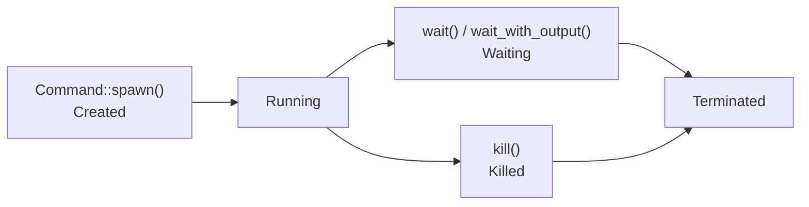

> **EN**: Process Model and Lifecycle in Rust
> **Summary**: A canonical guide to Rust's process abstraction, lifecycle management, resource control, and IPC safety guarantees, grounded in `std::process` and modern async runtimes.
> **Rust 版本**: 1.97.0+
> **受众**: [专家]
> **内容分级**: [专家级]
> **Bloom 层级**: L4-L5
> **权威来源**: 本文件为 `concept/` 权威页。
> **A/S/P 标记**: **S+P** — Structure + Procedure
> **双维定位**: S×Eva — 评价进程抽象与生命周期（Lifetimes）
> **前置依赖**: [Traits](../../02_intermediate/00_traits/01_traits.md) · [Error Handling](../../02_intermediate/03_error_handling/01_error_handling.md) · [Concurrency](../00_concurrency/01_concurrency.md)
> **后置概念**: [Advanced Process Management](02_advanced_process_management.md) · [Async Process Management](03_async_process_management.md) · [IPC Mechanisms](05_ipc_mechanisms.md)
> **定理链**: OS Process ⟹ std::process::Command ⟹ Resource Control

# Rust 进程模型与生命周期

> **权威页地位**：本页为 Rust 进程与 IPC 概念的 canonical 解释来源。
> **对应 crate 示例**：`crates/c07_process/docs/01_process_model_and_lifecycle.md` 现为摘要页，指向此处。

---

## 1. 进程定义与模型

进程是操作系统资源分配与隔离的基本单位，本节从三个层面建立模型：

- **进程理论基础**：进程 = 「地址空间（代码/堆/栈/mmap 区）+ 内核对象表（文件描述符、信号、凭据）+ 至少一个线程」的三元组。与线程的分界是「地址空间共享与否」——进程间默认零共享，一切协作经 IPC（管道/套接字/共享内存/信号）。创建模型分两类：Unix `fork`（写时复制父进程全部状态）+ `exec`（替换映像），Windows `CreateProcess`（一步到位）——Rust `std::process::Command` 抽象了两者的公共子集。
- **Rust 进程抽象**：`Command` 构建器 + `Child` 句柄是核心 API——`Command::new(prog).arg(..).spawn()` 返回 `Child`（拥有型句柄），`child.wait()` 阻塞收尸、`child.kill()` 发终止信号（SIGKILL/TerminateProcess）、`child.stdout.take()` 取管道句柄。`Output`（`output()` 方法）= 「等待 + 收集 stdout/stderr」的便捷组合。类型设计要点：`Child` 是拥有型——`drop(Child)` **不**杀进程也不 wait（僵尸进程风险），生命周期管理是显式契约。
- **内存安全与所有权**：Rust 把进程资源纳入 RAII 的边界是「句柄」而非「进程本身」——管道 fd 随 `ChildStdout` drop 关闭（写端关闭使子进程读 EOF，是「优雅通知子进程退出」的标准手法），但进程实体的回收（`wait`）必须显式。所有权视角：父进程「拥有」子进程句柄，`wait` 是「消费句柄换取退出状态」——`wait` 后 `Child` 不可用（Unix 上 PID 可能被复用，wait 后的 PID 操作是经典竞态）。

判定一个进程管理设计的完备性：spawn 后必有 wait 路径（含错误分支）、管道端点有明确关闭策略、kill 与 wait 的顺序文档化（kill 后仍需 wait 收尸）。

### 1.1 进程理论基础

- **进程**：操作系统分配资源和调度的基本单位，拥有独立的地址空间、代码、数据、堆栈和系统资源。
- **Rust 抽象**：通过 `std::process` 提供跨平台进程管理，封装平台细节，保证内存与资源安全。
- **内存隔离**：Rust 进程模型依赖操作系统的虚拟内存机制，确保进程间内存安全（Memory Safety）隔离。
- **所有权（Ownership）模型**：Rust 类型系统（Type System）和所有权机制防止跨进程悬垂指针和未定义行为。

### 1.2 Rust 进程抽象

Rust 采用 1:1 进程模型映射到操作系统进程，核心类型包括：

- `std::process::Command`：进程构建器，用于配置命令、参数、环境变量、I/O 重定向等。
- `std::process::Child`：子进程句柄，代表已启动的进程。
- `std::process::ExitStatus`：进程退出状态，包含退出码或信号信息。
- `std::process::Stdio`：标准输入输出配置。

### 1.3 内存安全与所有权

- **Drop 语义**：进程相关资源在作用域结束时自动释放，防止资源泄漏。
- **错误处理（Error Handling）**：所有进程操作均返回 `Result`，强制开发者处理失败分支。
- **平台兼容性**：`std::process` 屏蔽平台差异，提供统一 API。

---

## 2. 生命周期管理

进程生命周期的三个管理维度，覆盖「状态、异步、资源」：

- **进程状态机**：`创建(fork/spawn) → 运行 → [僵尸(已退出未收尸)] → 回收(wait)`——僵尸状态是 Unix 特有：子进程退出后内核保留其退出码直到父进程 `wait`，期间占 PID 表项。「孤儿进程」（父先死）被 init/PID1 收养并回收；「僵尸进程」的唯一解药是父进程 `wait`——Rust 中 `Child::wait`/`wait_with_output`，或对「刻意不管」的子进程用双 fork（daemon 化）或 SIGCHLD 处理。
- **异步生命周期管理**：`tokio::process::Command` 把 `wait` 变为 `.await` 点（`child.wait().await`），内部经 SIGCHLD 信号驱动（全局信号处理器——与「多运行时实例」「其他 SIGCHLD 用户」的共存是部署注意点）。异步模式的核心收益：等待子进程不占线程（万级并发子进程场景，如 CI runner）；`Child::kill().await` 与「kill-on-drop」（tokio 的 `kill_on_drop(true)` 选项）把「任务取消 → 子进程清理」自动化。
- **资源自动释放**：RAII 覆盖的范围与边界——管道/文件句柄自动（`ChildStdout`/`ChildStdin` 的 Drop），进程实体不自动（设计决策：drop 时杀进程可能误杀「已 detach 的长期服务」）。正确模式：`scopeguard`/自定义 guard 封装「确保 wait/kill」的清理逻辑，或 tokio `kill_on_drop`。泄漏审计：`ps` 查僵尸（`Z` 状态）与孤儿，归因到「缺 wait」或「缺 kill-on-drop」。

判定生命周期管理的完备性：状态机的每个迁移都有代码路径（特别是错误分支的 wait）、异步取消有 kill 传播、句柄 drop 顺序文档化（先关 stdin 通知退出 → 超时 → kill → wait）。

### 2.1 进程状态机

典型进程生命周期（Lifetimes）：

```text
Created → Running → (Waiting →)* → Terminated
```

- `Command::spawn()`：创建并启动进程（Created → Running）。
- `Child::wait()` / `Child::wait_with_output()`：等待进程终止。
- `Child::try_wait()`：非阻塞检查进程状态。
- `Child::kill()`：终止进程。

### 2.2 异步生命周期管理

现代 Rust 异步（Async）运行时（Runtime）（如 Tokio）提供 `tokio::process::Command`，支持：

- 异步（Async）等待子进程完成。
- 超时控制与自动清理。
- 并发管理多个子进程。

### 2.3 资源自动释放

- `Child` 实现 `Drop` trait，析构时自动释放系统资源（文件描述符、内存等）。
- 即使子进程崩溃，父进程不会受内存安全（Memory Safety）威胁，所有错误通过 `Result` 类型显式处理。

---

## 3. 进程属性与资源控制

`std::process::Command` 的属性配置分三层，跨平台行为差异是生产事故的高发区：

1. **基础属性**（3.1）：工作目录（`current_dir`）、环境变量（`env`/`envs`/`env_remove`/`env_clear`）、标准流重定向（`stdin`/`stdout`/`stderr` 的 `Stdio::piped/null/inherit` 三态）。关键陷阱：`env_clear` 后子进程可能因缺 `PATH`/`SystemRoot`（Windows）无法启动；
2. **高级资源限制**（3.2）：Unix 上 `CommandExt::pre_exec`（`unsafe`——fork 后 exec 前只能调 async-signal-safe 函数）、uid/gid 切换、`setpgid`；Windows 上 `CommandExt::creation_flags`（如 `CREATE_NO_WINDOW`）；
3. **跨平台资源管理**（3.3）：`ulimit` 类限制（内存/CPU/文件数）无跨平台抽象——Unix 用 `pre_exec` + `setrlimit`，Windows 需 Job Object（`windows` crate），容器环境应优先交给 cgroup/容器运行时而非进程内设置。

判定准则：属性只影响**子进程**，父进程状态不变；任何在 `pre_exec` 中的分配或锁操作都是 UB 风险。

### 3.1 基础属性配置

- **环境变量**：通过 `Command::env`、`Command::env_clear` 等管理。
- **工作目录**：通过 `Command::current_dir` 设置。
- **I/O 重定向**：通过 `Command::stdin`、`Command::stdout`、`Command::stderr` 配置。

### 3.2 高级资源限制

在 Unix 平台上，可通过 `nix::sys::resource::setrlimit` 等系统调用设置：

- 内存限制（`RLIMIT_AS`）
- 文件描述符限制（`RLIMIT_NOFILE`）
- CPU 时间限制（`RLIMIT_CPU`）

Windows 平台需使用对应的 Windows API 进行资源限制配置。

### 3.3 跨平台资源管理

- 子进程默认继承父进程资源限制，可显式修改。
- 使用条件编译（`#[cfg(unix)]`、`#[cfg(windows)]`）处理平台特定逻辑。

---

## 4. Rust 的进程安全抽象

> **L2 向下引用（Reference）**: 进程安全抽象建立在 [Trait 系统](../../02_intermediate/00_traits/01_traits.md) 与 [L2 错误处理（Error Handling）](../../02_intermediate/03_error_handling/01_error_handling.md) 之上。

### 4.1 类型安全保证

- 进程 I/O 管道通过 `Option<ChildStdin>`、`Option<ChildStdout>`、`Option<ChildStderr>` 暴露，所有权（Ownership）确保每个管道只被消费一次。
- 所有系统调用错误通过 `Result` 传播。

### 4.2 错误处理机制

建议为进程操作定义专门的错误类型，区分：

- 进程启动失败
- 进程等待失败
- 进程输出失败
- 进程终止失败
- 超时
- 异常退出

### 4.3 平台兼容性

- `std::process` 提供跨平台统一 API。
- 平台特定扩展通过 `std::os::unix::process::CommandExt` 和 `std::os::windows::process::CommandExt` 提供。

---

## 5. 现代库集成

标准库 `process` 是同步、单进程的；现代应用通常需要异步等待、管道组合与更细的系统调用控制，三个主流库恰好补齐这三块：

- **Tokio `tokio::process`**（5.1）：`Command` 的异步镜像，`child.wait().await` 与 `AsyncRead` 化的 stdout/stderr 接入执行器——关键差异是子进程收割依赖执行器驱动，且 pidfd（Linux）后端避免 PID 复用竞态；
- **Duct**（5.2）：进程组合 DSL——`cmd!("a").pipe(cmd!("b"))` 表达 shell 管道，错误统一为 `duct::Error`，适合构建脚本与运维工具；
- **Nix**（5.3）：`fork`/`execve`/`waitpid` 的类型安全封装——当 `Command` 的抽象不够用（如 daemonize、namespace、cgroups）时的下一层，代价是 Unix-only 与更多 `unsafe` 边界。

选型判定：能 `Command` 不 duct，能 duct 不 nix；异步运行时内必须用 `tokio::process`（同步 `wait` 会阻塞执行器线程）。

### 5.1 Tokio 异步进程

`tokio::process::Command` 提供与 Tokio 运行时（Runtime）集成的异步进程管理能力，支持异步读写和超时。

### 5.2 Duct 进程组合

`duct` crate 提供简洁的进程管道组合 API，适合 shell-like 的进程链式调用。

### 5.3 Nix 系统调用封装

`nix` crate 封装 Unix 系统调用，提供更细粒度的进程控制（如资源限制、信号处理等）。

---

## 6. 最佳实践

进程管理的三个最佳实践，直接对应生产事故的三个高频根因：

- **资源管理**：管道是有限内核资源——`Stdio::piped()` 的子进程若写满 stdout 缓冲（Linux 默认 64KB）而父进程不读，子进程**阻塞在 write**（经典死锁：父等 wait、子等管道）——正确模式是「并发读写 stdout/stderr + 最后 wait」（`wait_with_output` 内部即如此实现；手动管理用 `tokio::io::copy` 或独立线程）。大量子进程场景监控 fd 用量（`ulimit -n`）。
- **错误处理**：`spawn` 的失败（ENOENT 程序不存在、EACCES 无执行权）与「子进程退出码非零」是两层错误——前者 `Result<Child>`，后者 `ExitStatus::success()`。常见 bug：只检查 spawn 成功就假设「命令执行成功」。`ExitStatus` 在 Unix 区分「正常退出码」与「被信号杀死」（`status.signal()`），Windows 是统一 code——跨平台日志应同时记录两者。
- **避免僵尸进程**：三条规则——① spawn 必有 wait（含所有错误/超时分支）；② 长期驻留的子进程用 `kill_on_drop`（tokio）或显式 guard；③ 「fire-and-forget」子进程（如拉起系统通知）用双 fork/setsid 完全 detach，或在 Unix 上忽略 SIGCHLD（`SIG_IGN` 使内核自动回收——`nix::sys::signal` 设置，注意此设置全局影响其他 wait 调用）。

三条实践的验证：压力测试「千次子进程创建-退出」后 `ps aux | grep -c defunct` 应为 0；管道死锁用「子进程输出 > 64KB」的用例专门测试。

### 6.1 资源管理

- 总是为进程执行设置超时。
- 使用 RAII 模式，依赖 `Drop` 自动释放资源。
- 异步等待时优先使用 `tokio::time::timeout`。

### 6.2 错误处理

- 根据退出码、stderr 输出、错误类型进行分类处理。
- 区分权限不足、资源不足、命令执行失败等场景。
- 避免在错误路径中忽略子进程句柄，防止僵尸进程。

### 6.3 避免僵尸进程

- 确保对 `Child` 调用 `wait` 或 `wait_with_output`。
- 在异步场景中，使用结构化并发模式管理子进程生命周期。

---

## 7. 关键特性总结

1. **内存安全**：所有权模型确保进程间内存隔离。
2. **资源管理**：自动资源释放，防止泄漏。
3. **错误处理**：强制错误处理，提高健壮性。
4. **跨平台兼容**：统一的 API 接口。
5. **异步支持**：与 Tokio 等现代运行时集成。

---

## 8. 相关概念

- [并发模型](../00_concurrency/01_concurrency.md)
- [异步编程](../01_async/01_async.md)
- [错误处理基础](../../01_foundation/08_error_handling/01_error_handling_basics.md)
- [L2 错误处理](../../02_intermediate/03_error_handling/01_error_handling.md)

---

> **权威来源**: [Rust Reference](https://doc.rust-lang.org/reference/), [The Rust Programming Language](https://doc.rust-lang.org/book/), [Rust Standard Library](https://doc.rust-lang.org/std/)

---

## 10. 进程生命周期状态机（Mermaid）



---

## 补充视角：常见进程管理代码模式

> 本节选编自 `crates/c07_process/docs/20_process_management.md`，
> 作为 canonical 进程模型概念页的工程实践补充。

### 同步命令执行

使用 `Command::output()` 一次性执行并收集标准输出/错误：

```rust
# fn main() -> Result<(), Box<dyn std::error::Error>> {
use std::process::Command;

let output = Command::new("ls").arg("-la").output()?;
if output.status.success() {
    println!("{}", String::from_utf8_lossy(&output.stdout));
}
# Ok(())
# }
```

### 流式读取子进程输出

使用 `BufReader` 逐行读取，避免一次性加载大量数据：

```rust
# fn main() -> Result<(), Box<dyn std::error::Error>> {
use std::io::{BufRead, BufReader};
use std::process::{Command, Stdio};

let mut child = Command::new("ping")
    .arg("example.com").arg("-c").arg("4")
    .stdout(Stdio::piped())
    .spawn()?;

if let Some(stdout) = child.stdout.take() {
    for line in BufReader::new(stdout).lines() {
        println!("{}", line?);
    }
}
let status = child.wait()?;
# Ok(())
# }
```

### 环境变量管理

- `Command::env(key, val)`：设置/覆盖单个环境变量。
- `Command::envs(iter)`：批量设置。
- `Command::env_clear()`：清空继承环境，构建最小环境。

---

## 补充视角：Rust 1.90+ 特性与进程管理

> 本节选编自 `crates/c07_process/docs/03_rust_190_features.md`，
> 作为 canonical 进程模型概念页的工程实践补充。

### 异步闭包与进程管理

Rust 1.90 起异步闭包（Closures）（`async || {}`）可在异步上下文中更自然地封装进程处理逻辑，
避免手动装箱 `Future`，使 `tokio::process` 的回调式代码更简洁。

### 模式匹配与进程状态

`std::process::ExitStatus` 配合守卫条件（guard）可清晰处理：

- 成功退出
- 非零退出码
- 信号终止

### 迭代器与进程输出

`BufReader::lines()` 配合 `filter_map` / `filter` / `take` 可流式处理子进程输出，
避免一次性加载大量数据。

### 错误处理策略

- 使用 `?` 传播 I/O 错误。
- 对 `output()` 结果显式检查 `status.success()`。
- 将 `stderr` 纳入错误信息，便于排查。

---

## 补充视角：高级进程管理企业级模式

> 本节选编自 `crates/c07_process/docs/10_advanced_process_management.md`，
> 作为 canonical 进程模型概念页的工程实践补充。

### 进程池（Process Pool）

在高吞吐场景下，频繁创建/销毁进程代价高昂。进程池通过维护一组可复用的子进程，
降低启动开销并提供：

- 最大并发数限制（semaphore）
- 空闲超时与自动回收
- 健康检查与故障隔离
- 运行统计与可观测性

### 生命周期管理器

将进程状态抽象为状态机：

```text
Created → Running → Waiting → Terminated
            ↓         ↓
          Failed   Stopping
```

通过统一的管理器处理启动、等待、终止、清理，避免资源泄漏。

### 资源监控与故障恢复

- 监控 CPU、内存、运行时长等指标。
- 设置重启策略（固定延迟、指数退避、最大重试次数）。
- 区分可恢复错误与致命错误，避免无限重启循环。

---

## 补充视角：C07 进程管理一页纸总结

> 来源：`crates/c07_process/docs/16_one_page_summary.md`
> 按 AGENTS.md §6.4 迁移至此，作为 canonical 进程模型概念页的速查补充。

### 核心概念

| 概念 | 说明 |
| :--- | :--- |
| **进程创建** | `Command::new()`、`spawn()`、`output()`；环境变量、工作目录 |
| **标准 IO** | `stdin`/`stdout`/`stderr`；管道 `Stdio::piped()` |
| **信号处理** | `signal_hook`；SIGINT、SIGTERM 等 |
| **IPC** | 管道、Unix domain socket；跨进程通信 |

### 常见坑与解决

| 坑 | 解决 |
| :--- | :--- |
| 子进程僵尸 | `wait()` 或 `try_wait()` 回收；或 `kill_on_drop` |
| 管道死锁 | 避免父子同时读写；用 `spawn` + 异步读取 |
| 跨平台差异 | 用 `std::process` 抽象；信号仅 Unix |
| 权限与沙箱 | 注意 `setuid`、chroot；生产用专用运行时 |

### 进程速选

| 场景 | 选型 |
| :--- | :--- |
| 执行命令取输出 | `Command::output()` |
| 流式输出 | `Command::spawn()` + `stdout` 读取 |
| 管道链 | `Command` 链式 `stdin(prev.stdout)` |
| 超时控制 | `wait_timeout` 或 `tokio::process` |

### 学习路径

1. **入门** (1 周): `Command` 基础 → 标准 IO 重定向 → 错误处理
2. **进阶** (2 周): 信号、IPC、与 C10 网络结合
3. **高级** (持续): 异步进程、生产部署

### 速查与练习

- **速查卡**: [process_management_cheatsheet](../../../docs/03_reference/quick_reference/16_process_management_cheatsheet.md)
- **RBE 练习**: [Process](https://doc.rust-lang.org/rust-by-example/std_misc/process.html)
- **Rustlings**: 无进程专题；参考 RBE 与 C07 模块（Module）

---

## 11. 可运行示例：执行命令并收集输出

```rust,editable
use std::process::Command;

fn main() -> std::io::Result<()> {
    let output = Command::new("echo")
        .args(["Rust", "1.97.0+"])
        .output()?;
    assert!(output.status.success());
    println!("{}", String::from_utf8_lossy(&output.stdout));
    Ok(())
}
```

## 认知路径

1. **问题识别**: 识别子进程生命周期中的资源泄漏与僵尸进程风险。
2. **概念建立**: 掌握 `Command`、`Child`、`ExitStatus` 等核心抽象及其所有权语义。
3. **机制推理**: 通过进程模型 ⟹ 生命周期 ⟹ 资源控制的定理链理解 `wait` 与管道关闭顺序。
4. **边界辨析**: 辨析反命题中“进程即线程”的误区，明确地址空间隔离边界。
5. **迁移应用**: 将进程模型与后续 IPC、监控、安全主题链接，形成系统级编程视图。

## 定理链

| 定理 | 前提 | 结论 |
|:---|:---|:---|
| 独立地址空间 ⟹ 内存安全隔离 | OS 为每个进程分配独立虚拟地址空间 | Rust 子进程不会因父进程悬垂指针而暴露未定义行为 |
| 显式等待 ⟹ 避免僵尸进程 | 父进程调用 `wait`/`try_wait` 回收子进程 | 内核进程表项被释放，资源不泄漏 |
| 所有权模型 ⟹ 句柄安全 | `Child` 与 `ChildStdin/Stdout` 实现 Drop | 管道与进程句柄随作用域正确关闭 |

## 反命题

> **反命题 1**: "进程可以像线程一样共享内存" ⟹ 不成立。进程拥有独立地址空间，共享数据必须通过显式 IPC 机制。
>
> **反命题 2**: "子进程退出后父进程无需等待" ⟹ 不成立。未等待的子进程会变成僵尸进程，长期占用内核资源。
>
> **反命题 3**: "Rust 的 `std::process` 完全隐藏了平台差异" ⟹ 不成立。信号、权限、路径等仍需平台特定处理。
>
## 反向推理

> **反向推理 1**: 发现大量 `<defunct>` 进程 ⟸ 说明父进程未正确调用 `wait` 或处理 `Child` 句柄。
>
> **反向推理 2**: 管道写入阻塞但子进程已退出 ⟸ 说明未关闭不再使用的 `ChildStdin`，导致对端读端未收到 EOF。
>
## 过渡段

> **过渡**: 从 OS 进程模型过渡到 Rust 的 `std::process` 抽象，可以理解标准库如何在保持所有权安全的同时封装平台差异。
>
> **过渡**: 从生命周期管理过渡到资源控制，可以建立“创建—使用—等待—回收”的完整责任链。
>
> **过渡**: 从资源控制过渡到后续 IPC 与安全主题，可以理解进程模型是更高阶机制的底座。
>

---

## 国际权威参考 / International Authority References（P1 学术 · P2 生态）

> 依据 `AGENTS.md` §2「对齐网络国际化权威内容」补充：仅追加已验证可达的权威链接，不改动正文事实。

- **P1 学术/形式化**: [Hoare: Communicating Sequential Processes (CACM 1978)](https://dl.acm.org/doi/10.1145/359576.359585)
- **P2 生态/社区**: [docs.rs/ipc-channel — 生态权威 API 文档](https://docs.rs/ipc-channel) · [docs.rs/sysinfo — 生态权威 API 文档](https://docs.rs/sysinfo)

## ⚠️ 反例与陷阱

本节以 `Command` 链式借用与 `spawn` 冲突为反例，展示构建器链的可变借用生命周期。

### 反例：持有 `arg` 的可变借用再 `spawn`（rustc 1.97.0 实测）

```rust,compile_fail,E0499
use std::process::Command;
fn main() {
    let mut c = Command::new("ls");
    let a = c.arg("-l"); // arg 返回 &mut Command
    c.spawn().unwrap();  // ❌ a 仍持有可变借用
    let _ = a;
}
```

**错误**：`E0499 cannot borrow c as mutable more than once at a time`。

### ✅ 修正：链式调用语句化，借用随语句结束

```rust
use std::process::Command;
fn main() {
    let mut c = Command::new("ls");
    c.arg("-l");          // 临时借用在本语句结束
    c.spawn().unwrap();
}
```
