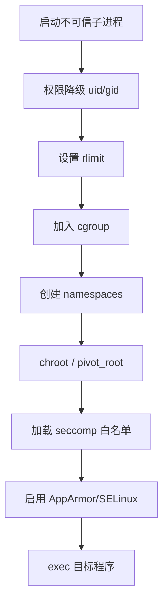
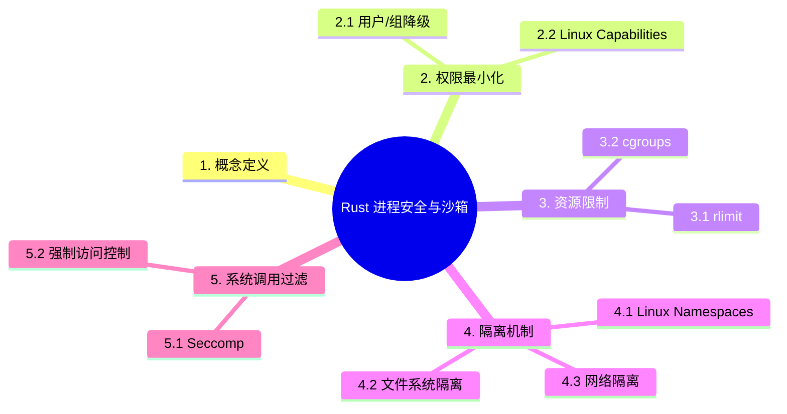

> **EN**: Process Security and Sandboxing in Rust
> **Summary**: Process isolation, privilege dropping, resource limits, namespaces, seccomp, and sandbox design for Rust child processes.
> **Rust 版本**: 1.97.0+
> **受众**: [专家]
> **内容分级**: [专家级]
> **Bloom 层级**: L4-L5
> **权威来源**: 本文件为 `concept/` 权威页。
> **A/S/P 标记**: **S+A** — Structure + Application
> **双维定位**: A×Eva — 评价进程安全与沙箱设计
> **前置依赖**: [Process Model and Lifecycle](01_process_model_and_lifecycle.md) · [IPC Mechanisms](05_ipc_mechanisms.md) · [Unsafe Rust](../02_unsafe/01_unsafe.md)
> **后置概念**: [Process Performance Engineering](08_process_performance_engineering.md) · [Process Testing](09_process_testing_and_benchmarking.md) · [Modern Process Libraries](10_modern_process_libraries.md)
> **定理链**: Least Privilege ⟹ Isolation Boundary ⟹ Attack Surface Reduction

# Rust 进程安全与沙箱

> **权威页地位**：本页为 Rust 进程安全与沙箱概念的 canonical 解释来源。
> **L2 向下引用（Reference）**: 沙箱机制实现建立在 [Trait 系统](../../02_intermediate/00_traits/01_traits.md)、[L2 错误处理（Error Handling）](../../02_intermediate/03_error_handling/01_error_handling.md) 与 [并发模型](../00_concurrency/01_concurrency.md) 之上。

## 1. 概念定义

**进程安全与沙箱 (Process Security and Sandboxing)** 通过最小权限、资源限制、隔离机制等手段，降低不可信或高敏感子进程对主机的影响。

沙箱设计需要在安全性、复杂度和性能之间取得平衡。Rust 的所有权（Ownership）和类型系统（Type System）能够在编译期消除大量内存安全（Memory Safety）类漏洞，而沙箱则主要面向运行时（Runtime）特权与资源边界。

## 2. 权限最小化

权限最小化（least privilege）是沙箱化的第一原则：子进程应只持有完成任务所需的最小权限集。两层机制：

- **用户/组降级（2.1）**：root 启动的守护进程完成绑定端口等特权操作后 `setuid`/`setgid` 降级——`nix::unistd::{setuid, setgid}` 封装，顺序关键（先 setgid 后 setuid，且 setuid 后无法恢复）；补充组（`setgroups`）常被遗忘导致残留权限；
- **Linux Capabilities（2.2）**：把 root 的「全能」拆为细粒度能力（`CAP_NET_BIND_SERVICE`/`CAP_SYS_ADMIN` 等）——`caps` crate 管理 ambient/permitted/effective 三集合，原则是「默认全清空，按需逐加」。

Rust 集成要点：降级操作必须在**单线程**阶段执行（setuid 只影响调用线程，多线程进程降级是安全漏洞）——通常在 `Command::pre_exec`（fork 后 exec 前的单线程窗口）中完成。

### 2.1 用户/组降级

在 Unix 上可以通过 `std::os::unix::process::CommandExt` 以低权限用户启动子进程，避免使用完整 root：

```rust,ignore
#[cfg(unix)]
use std::os::unix::process::CommandExt;
use std::process::Command;

#[cfg(unix)]
fn spawn_as_user(program: &str, uid: u32, gid: u32) -> std::io::Result<std::process::Child> {
    let mut cmd = Command::new(program);
    cmd.uid(uid).gid(gid);
    cmd.spawn()
}
```

### 2.2 Linux Capabilities

使用 `caps` crate 仅保留必要 capability，其余全部清除，实现比完整 root 更细粒度的权限控制：

```rust,ignore
#[cfg(target_os = "linux")]
fn drop_unneeded_caps() -> Result<(), caps::CapsError> {
    use caps::{CapSet, Capability};
    let all = caps::read(None, CapSet::Permitted)?;
    for cap in all {
        if cap != Capability::CAP_NET_BIND_SERVICE {
            caps::drop(None, CapSet::Effective, cap)?;
        }
    }
    Ok(())
}
```

## 3. 资源限制

本节聚焦「资源限制」，覆盖rlimit 与  cgroups。论述顺序由定义到边界：先明确「资源限制」在「Rust 进程安全与沙箱」中的确切含义与适用范围，再给出可核验的例证或数据，最后标注它与相邻主题的分界线。读完后应能用一句话复述「资源限制」的判定标准，并指出它在全页论证链中的位置。

### 3.1 rlimit

通过 `nix::sys::resource::setrlimit` 限制 CPU 时间、虚拟内存、文件描述符、进程数等：

```rust,ignore
#[cfg(unix)]
fn set_child_limits() -> Result<(), Box<dyn std::error::Error>> {
    use nix::sys::resource::{setrlimit, Resource};
    setrlimit(Resource::RLIMIT_NOFILE, 1024, 1024)?;
    setrlimit(Resource::RLIMIT_CPU, 60, 60)?;
    Ok(())
}
```

### 3.2 cgroups

Linux cgroups v2 可限制内存、CPU 权重、I/O 带宽，并将子进程加入指定 cgroup。通常需要外部工具或 root 权限写入 `/sys/fs/cgroup`：

```rust,ignore
#[cfg(target_os = "linux")]
fn move_to_cgroup(pid: u32, cgroup: &str) -> std::io::Result<()> {
    let path = format!("/sys/fs/cgroup/{}/cgroup.procs", cgroup);
    std::fs::write(path, pid.to_string())
}
```

## 4. 隔离机制

隔离机制回答「即使子进程被攻破，损害如何限制」，三层递进：

- **Linux Namespaces（4.1）**：mount（独立挂载视图）、pid（独立进程树，子进程看不到外部进程）、net（独立网络栈）、user（uid 映射，容器内 root ≠ 宿主 root）——`clone`/`unshare` 系统调用创建，`nix::sched` 封装；
- **文件系统隔离（4.2）**：`chroot`（弱隔离，root 可逃逸）→ pivot_root + mount namespace（容器标准做法）→ 只读根 + tmpfs 可写层（最强）；
- **网络隔离（4.3）**：net namespace 的「无网络」配置是最强隔离（连 loopback 都没有）——配合 unix socket pair 保留受控通信通道。

实践路径：手写 namespace 编排复杂易错——生产环境优先用容器运行时（Docker/K8s），Rust 代码通过 `Command` + 容器 API 间接受益；直接隔离场景（沙箱执行不可信代码）参考 `minijail`/`bubblewrap` 的设计。

### 4.1 Linux Namespaces

使用 `nix::sched::unshare` 创建新的 PID、网络、挂载、UTS、IPC、用户命名空间，实现类容器隔离：

```rust,ignore
#[cfg(target_os = "linux")]
fn enter_new_namespace() -> Result<(), Box<dyn std::error::Error>> {
    use nix::sched::{unshare, CloneFlags};
    unshare(CloneFlags::CLONE_NEWUSER | CloneFlags::CLONE_NEWNET | CloneFlags::CLONE_NEWNS)?;
    Ok(())
}
```

### 4.2 文件系统隔离

- **chroot**：切换根目录，限制文件访问范围。
- **pivot_root**：配合 bind mount 实现更完整的根切换。

```rust,ignore
#[cfg(unix)]
fn chroot_to(path: &str) -> std::io::Result<()> {
    std::env::set_current_dir(path)?;
    unsafe {
        libc::chroot(path.as_ptr() as *const i8);
    }
    Ok(())
}
```

### 4.3 网络隔离

通过网络命名空间与 veth 对，将子进程置于独立网络栈。

## 5. 系统调用过滤

本节聚焦「系统调用过滤」，覆盖Seccomp 与 强制访问控制。论述顺序由定义到边界：先明确「系统调用过滤」在「Rust 进程安全与沙箱」中的确切含义与适用范围，再给出可核验的例证或数据，最后标注它与相邻主题的分界线。读完后应能用一句话复述「系统调用过滤」的判定标准，并指出它在全页论证链中的位置。

### 5.1 Seccomp

使用 `seccompiler` 定义允许/禁止的系统调用白名单，阻断危险调用如 `execve`、`ptrace`：

```rust,ignore
use seccompiler::{compile_from_json, BpfProgram};

fn load_seccomp_filter(json_policy: &[u8]) -> Result<BpfProgram, Box<dyn std::error::Error>> {
    let map = compile_from_json(json_policy, seccompiler::TargetArch::x86_64)?;
    Ok(map)
}
```

### 5.2 强制访问控制

- **AppArmor**：基于路径的配置文件控制资源访问。
- **SELinux**：基于安全标签的强制访问控制。

## 6. 沙箱设计模式

| 级别 | 机制 | 复杂度 | 安全性 |
| :--- | :--- | :--- | :--- |
| 基础 | 权限降级 + rlimit | 低 | 中 |
| 进阶 | + namespaces + chroot | 中 | 高 |
| 高安全 | + seccomp + AppArmor/SELinux | 高 | 最高 |

## 7. 威胁模型

常见攻击向量包括：提权、资源耗尽、信息泄露、恶意系统调用、网络横向移动。沙箱设计应结合具体威胁模型选择机制。

| 威胁 | 缓解措施 |
| :--- | :--- |
| 提权 | 以非特权用户运行、最小 capability |
| 资源耗尽 | rlimit、cgroups |
| 信息泄露 | namespaces、chroot、seccomp |
| 恶意 syscall | seccomp 白名单 |
| 横向移动 | 网络命名空间隔离 |

## 8. 沙箱加固流程



## 9. 最佳实践

- 永远以最小权限启动子进程，避免使用 root。
- 将权限降级、资源限制、命名空间、seccomp 组合使用，而非依赖单一机制。
- 对沙箱配置进行回归测试，确保合法系统调用未被误拦截。
- 使用 Rust 的 `Result` 与 `?` 显式处理沙箱初始化失败。
- 将平台相关安全代码隔离在 `#[cfg(target_os = "linux")]` 模块（Module）中。

## 10. 相关概念

- [进程模型与生命周期（Lifetimes）](01_process_model_and_lifecycle.md)
- [跨平台进程管理](04_cross_platform_process_management.md)
- [IPC 机制](05_ipc_mechanisms.md)
- [Rust 安全实践](../../06_ecosystem/07_security_and_cryptography/01_security_practices.md)
- [进程性能工程](08_process_performance_engineering.md)

---

> **权威来源**: [Rust Standard Library — std::process](https://doc.rust-lang.org/std/process/) · [nix crate](https://docs.rs/nix/) · [seccompiler crate](https://docs.rs/seccompiler/) · [Linux kernel — namespaces/cgroups/seccomp](https://www.kernel.org/doc/html/latest/)

## 认知路径

1. **问题识别**: 识别不可信或高敏感子进程对主机安全的威胁。
2. **概念建立**: 掌握权限降级、资源限制、命名空间、seccomp 与沙箱设计原则。
3. **机制推理**: 通过最小权限 ⟹ 隔离边界 ⟹ 攻击面缩减的定理链分析安全方案。
4. **边界辨析**: 辨析“Rust 内存安全（Memory Safety）等于进程安全”等反命题，理解运行时（Runtime）特权边界的重要性。
5. **迁移应用**: 将沙箱与性能、测试、生态库主题链接。

## 定理链

| 定理 | 前提 | 结论 |
|:---|:---|:---|
| 权限降级 ⟹ 减少受损影响 | 以非特权用户启动子进程 | 即使子进程被攻破，主机暴露面有限 |
| 命名空间隔离 ⟹ 资源边界 | PID/network/mount namespace | 子进程无法看到或访问全局资源 |
| seccomp 过滤 ⟹ 系统调用收敛 | 限制可使用的 syscall | 攻击者可利用的内核接口大幅减少 |

## 反命题

> **反命题 1**: "Rust 的内存安全保证已经让沙箱多余" ⟹ 不成立。Rust 无法限制运行时特权、网络访问或文件系统操作。
>
> **反命题 2**: "沙箱越严格越好" ⟹ 不成立。过度严格的沙箱会增加运维复杂度并破坏功能可用性。
>
> **反命题 3**: "只需在容器里运行就足够安全" ⟹ 不成立。容器共享内核，仍需 seccomp、capability 等额外层。
>
## 反向推理

> **反向推理 1**: 发现子进程可访问不应有的文件 ⟸ 说明未正确设置 chroot/mount namespace 或权限。
>
> **反向推理 2**: 发现 syscall 审计中出现异常系统调用 ⟸ 说明 seccomp 策略未覆盖或子进程被注入代码。
>
## 过渡段

> **过渡**: 从权限最小化过渡到资源限制，可以理解安全沙箱的第一层是“能做什么”而非“怎么做”。
>
> **过渡**: 从资源限制过渡到命名空间隔离，可以建立纵深防御的多层边界。
>
> **过渡**: 从隔离边界过渡到攻击面评估，可以理解沙箱设计需要在安全性与可用性之间权衡。
>

---

## 国际权威参考 / International Authority References（P1 学术 · P2 生态）

> 依据 `AGENTS.md` §2「对齐网络国际化权威内容」补充：仅追加已验证可达的权威链接，不改动正文事实。

- **P1 学术/形式化**: [Hoare: Communicating Sequential Processes (CACM 1978)](https://dl.acm.org/doi/10.1145/359576.359585)

## 🧭 思维导图（Mindmap）



---

## ⚠️ 反例与陷阱

> 陷阱：安全沙箱代码中常涉及 `unsafe` 边界（如调用 `libc`、`seccomp` 等），忘记 `unsafe` 块会导致编译失败。
> 下面代码在 rustc 1.97 --edition 2024 下触发 `E0133`。

```rust,compile_fail,E0133
unsafe fn drop_privileges() {}

fn main() {
    drop_privileges();
}
```

**修正对照**：

```rust
unsafe fn drop_privileges() {}

fn main() {
    unsafe { drop_privileges() };
}
```
