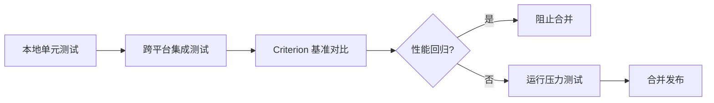

> **EN**: Process Testing and Benchmarking in Rust
> **Summary**: Testing strategies, process-specific test techniques, benchmarking, stress testing, and CI integration for Rust process management.
> **Rust 版本**: 1.97.0+
> **受众**: [专家]
> **内容分级**: [专家级]
> **Bloom 层级**: L4-L5
> **权威来源**: 本文件为 `concept/` 权威页。
> **A/S/P 标记**: **P+A** — Procedure + Application
> **双维定位**: A×Eva — 评价进程测试与基准策略
> **前置依赖**: [Process Model and Lifecycle](01_process_model_and_lifecycle.md) · [Error Handling](../../02_intermediate/03_error_handling/01_error_handling.md) · [Testing Basics](../../01_foundation/10_testing_basics/01_testing_basics.md)
> **后置概念**: [Process Monitoring](06_process_monitoring_and_diagnostics.md) · [Process Performance Engineering](08_process_performance_engineering.md) · [Modern Process Libraries](10_modern_process_libraries.md)
> **定理链**: Unit Test ⟹ Integration Pipeline ⟹ CI Gate

# Rust 进程测试与基准

> **权威页地位**：本页为 Rust 进程测试与基准概念的 canonical 解释来源。
> **L2 向下引用（Reference）**: 进程测试技术建立在 [Trait 系统](../../02_intermediate/00_traits/01_traits.md)、[L2 错误处理（Error Handling）](../../02_intermediate/03_error_handling/01_error_handling.md) 与 [并发模型](../00_concurrency/01_concurrency.md) 之上。
>
> 通用 Rust 测试策略请参见 [Rust 测试策略](../../06_ecosystem/09_testing_and_quality/01_testing_strategies.md)。

## 1. 概念定义

**进程测试与基准 (Process Testing and Benchmarking)** 覆盖验证子进程行为、性能与稳定性的方法：从单元测试单个命令执行，到集成测试管道，再到压力测试与 CI 集成。

## 2. 测试分层

| 层级 | 范围 | 典型方法 |
| :--- | :--- | :--- |
| 单元测试 | 单个 `Command` 调用 | `#[test]` 验证退出码/输出 |
| 集成测试 | 进程通信、管道 | `tokio::test` 异步（Async）管道 |
| 端到端测试 | 完整工作流 | 启动真实进程并验证结果 |

## 3. 进程测试技巧

本节将「进程测试技巧」分解为若干主题：超时保护、错误注入、僵尸进程防护与信号处理测试。

### 3.1 超时保护

所有可能阻塞的进程测试都应使用 `tokio::time::timeout` 或自定义超时包装器。

### 3.2 错误注入

通过 mock 进程或随机失败包装器验证系统对启动失败、非零退出码、stderr 的处理。

### 3.3 僵尸进程防护

使用 `ProcessGuard` 在测试失败或 panic 时自动 `kill` + `wait` 子进程。

```rust,editable
use std::process::{Child, Command};

struct ProcessGuard(Child);

impl ProcessGuard {
    fn spawn(program: &str, args: &[&str]) -> std::io::Result<Self> {
        let child = Command::new(program).args(args).spawn()?;
        Ok(Self(child))
    }
}

impl Drop for ProcessGuard {
    fn drop(&mut self) {
        let _ = self.0.kill();
        let _ = self.0.wait();
    }
}

#[test]
fn test_echo_output() {
    let guard = ProcessGuard::spawn("echo", &["hello"]).unwrap();
    let output = guard.0.wait_with_output().unwrap();
    assert!(output.status.success());
    assert_eq!(String::from_utf8_lossy(&output.stdout).trim(), "hello");
}
```

### 3.4 信号处理测试

Unix 上向子进程发送 SIGTERM/SIGKILL，验证优雅关闭与强制终止行为：

```rust,ignore
#[cfg(unix)]
#[test]
fn test_sigterm_handling() {
    use std::process::Command;
    use nix::sys::signal::{kill, Signal};
    use nix::unistd::Pid;

    let mut child = Command::new("sleep").arg("10").spawn().unwrap();
    kill(Pid::from_raw(child.id() as i32), Signal::SIGTERM).unwrap();
    let status = child.wait().unwrap();
    assert!(!status.success());
}
```

## 4. 异步进程测试

使用 `tokio::test` 与 `tokio::time::timeout` 验证异步（Async）进程生命周期（Lifetimes）：

```rust,ignore
#[tokio::test]
async fn test_async_command_timeout() {
    use tokio::process::Command;
    use tokio::time::{timeout, Duration};

    let result = timeout(
        Duration::from_millis(200),
        Command::new("sleep").arg("5").output(),
    )
    .await;

    assert!(result.is_err(), "expected timeout");
}
```

## 5. 基准测试

使用 Criterion 建立可重复的基准：

- **进程创建基准**：比较 `std::process` 与 `tokio::process`。
- **IPC 基准**：测量管道、Unix socket、共享内存的吞吐与延迟。
- **进程池基准**：不同池大小与任务长度下的吞吐量。

```rust,ignore
use criterion::{criterion_group, criterion_main, Criterion};
use std::process::Command;

fn bench_command_output(c: &mut Criterion) {
    c.bench_function("command_output", |b| {
        b.iter(|| {
            Command::new("echo").arg("benchmark").output().unwrap()
        })
    });
}

criterion_group!(benches, bench_command_output);
criterion_main!(benches);
```

## 6. 压力测试

- **并发 spawn 测试**：同时启动大量进程，验证资源限制。
- **稳定性测试**：长时间运行并监控失败率。
- **内存泄漏测试**：通过 `sysinfo` 监控自身内存增长。
- **资源耗尽测试**：逼近文件描述符上限，验证优雅降级。

```rust,ignore
#[tokio::test]
async fn stress_spawn_limited() {
    use tokio::process::Command;
    use tokio::sync::Semaphore;
    use std::sync::Arc;

    let sem = Arc::new(Semaphore::new(32));
    let mut handles = Vec::new();
    for i in 0..256 {
        let permit = sem.clone();
        handles.push(tokio::spawn(async move {
            let _p = permit.acquire().await.unwrap();
            let output = Command::new("echo").arg(i.to_string()).output().await.unwrap();
            assert!(output.status.success());
        }));
    }
    for h in handles {
        h.await.unwrap();
    }
}
```

## 7. CI 集成

- 在 `ubuntu-latest`、`macos-latest`、`windows-latest` 上运行测试矩阵。
- 将压力测试标记为 `#[ignore]`，通过 `cargo test -- --ignored` 单独触发。
- 使用 `cargo bench` 与 Criterion 基线对比检测性能回归。



## 8. 最佳实践

- 为每个子进程测试配置超时与清理守卫，防止僵尸进程拖慢 CI。
- 优先使用系统内置命令（`echo`、`cmd /C echo`）降低环境依赖。
- 将平台相关测试隔离在 `#[cfg(unix)]` / `#[cfg(windows)]` 中。
- 对不稳定的外部依赖使用 mock 或本地 fixture。

## 9. 相关概念

- [进程模型与生命周期（Lifetimes）](01_process_model_and_lifecycle.md)
- [高级进程管理](02_advanced_process_management.md)
- [异步进程管理](03_async_process_management.md)
- [进程性能工程](08_process_performance_engineering.md)
- [Rust 测试策略](../../06_ecosystem/09_testing_and_quality/01_testing_strategies.md)
- [基准测试](../../06_ecosystem/09_testing_and_quality/04_benchmarking.md)

---

> **权威来源**: [The Rust Programming Language — Testing](https://doc.rust-lang.org/book/ch11-00-testing.html) · [Criterion.rs](https://bheisler.github.io/criterion.rs/book/) · [Rust By Example — Process](https://doc.rust-lang.org/rust-by-example/std_misc/process.html)

## 认知路径

1. **问题识别**: 识别进程相关代码在单元测试、集成测试与 CI 中的特殊挑战。
2. **概念建立**: 掌握命令执行验证、管道测试、超时/取消测试与压力测试技术。
3. **机制推理**: 通过单元测试 ⟹ 集成管道 ⟹ CI 门禁的定理链保证质量。
4. **边界辨析**: 辨析“进程测试只能在集成阶段做”等反命题，理解可测试性设计的重要性。
5. **迁移应用**: 将进程测试与监控、性能、生态库主题链接。

## 定理链

| 定理 | 前提 | 结论 |
|:---|:---|:---|
| 确定性输入 ⟹ 可重复测试 | 固定环境变量、参数与工作目录 |  flaky 测试比例下降 |
| 超时约束 ⟹ 防止挂起 | 为每个外部命令设置时间上限 | CI 不会因为死锁而无限等待 |
| 压力测试 ⟹ 暴露资源竞争 | 高并发创建/通信子进程 | 句柄泄漏与竞态条件可被复现 |

## 反命题

> **反命题 1**: "进程测试只能在集成阶段做" ⟹ 不成立。通过抽象接口与 mock，单元测试同样可以验证进程逻辑。
>
> **反命题 2**: "测试通过一次就代表稳定" ⟹ 不成立。进程状态受环境与调度影响，需要重复与压力测试。
>
> **反命题 3**: "基准测试只需测最优路径" ⟹ 不成立。冷启动、失败路径与并发场景同样影响生产表现。
>
## 反向推理

> **反向推理 1**: 发现 CI 偶发超时 ⟸ 说明缺少确定性超时设置或测试依赖外部环境。
>
> **反向推理 2**: 发现压力测试下句柄泄漏 ⟸ 说明 `wait` 或 Drop 逻辑未覆盖所有分支。
>
## 过渡段

> **过渡**: 从测试分层过渡到具体技巧，可以理解进程代码在不同测试层级需要不同的抽象策略。
>
> **过渡**: 从具体技巧过渡到超时与取消，可以建立防止测试挂起的防御性实践。
>
> **过渡**: 从防御性测试过渡到压力与 CI 集成，可以形成高可信度的进程代码交付流程。
>

---

## 国际权威参考 / International Authority References（P1 学术 · P2 生态）

> 依据 `AGENTS.md` §2「对齐网络国际化权威内容」补充：仅追加已验证可达的权威链接，不改动正文事实。

- **P1 学术/形式化**: [Hoare: Communicating Sequential Processes (CACM 1978)](https://dl.acm.org/doi/10.1145/359576.359585)
- **P2 生态/社区**: [docs.rs/interprocess — 生态权威 API 文档](https://docs.rs/interprocess) · [docs.rs/ipc-channel — 生态权威 API 文档](https://docs.rs/ipc-channel)
