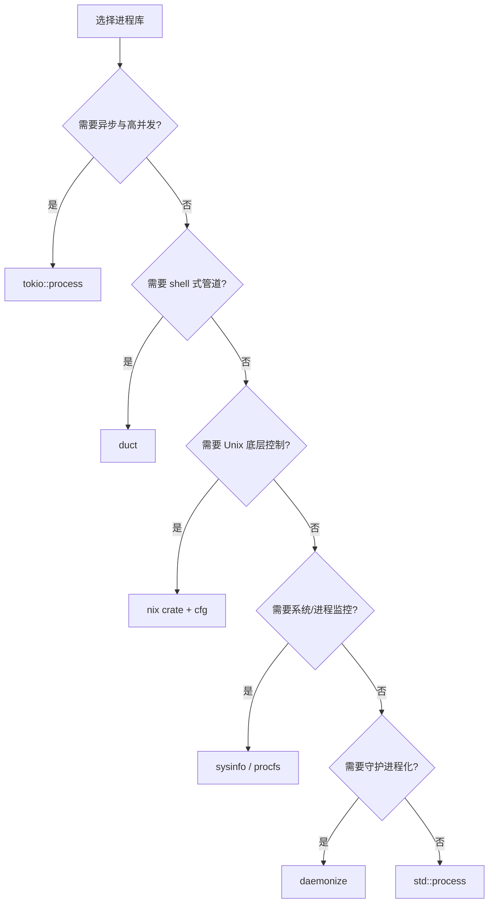
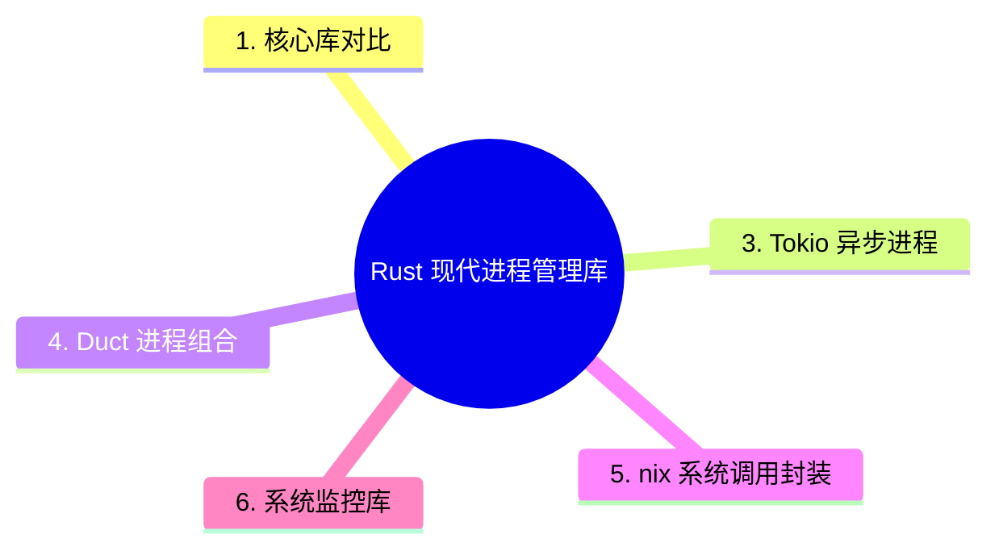

> **EN**: Modern Process Management Libraries in Rust
> **Summary**: Ecosystem survey of Rust process management libraries: std::process, tokio::process, duct, nix, sysinfo, procfs, daemonize, caps, users.
> **Rust 版本**: 1.97.0+
> **受众**: [专家]
> **内容分级**: [专家级]
> **Bloom 层级**: L4-L5
> **权威来源**: 本文件为 `concept/` 权威页。
> **A/S/P 标记**: **S+A** — Structure + Application
> **双维定位**: A×Eva — 评价现代进程管理库选型
> **前置依赖**: [Process Model and Lifecycle](01_process_model_and_lifecycle.md) · [Async Process Management](03_async_process_management.md) · [Error Handling](../../02_intermediate/03_error_handling/01_error_handling.md)
> **后置概念**: [Process Performance Engineering](08_process_performance_engineering.md) · [Process Security](07_process_security_and_sandboxing.md) · [Process Testing](09_process_testing_and_benchmarking.md)
> **定理链**: Requirement ⟹ Library Selection ⟹ Ecosystem Integration

# Rust 现代进程管理库

> **权威页地位**：本页为 Rust 现代进程管理库生态的 canonical 解释来源。
> **L2 向下引用（Reference）**: 进程库的选型与封装建立在 [Trait 系统](../../02_intermediate/00_traits/01_traits.md)、[L2 错误处理（Error Handling）](../../02_intermediate/03_error_handling/01_error_handling.md) 与 [并发模型](../00_concurrency/01_concurrency.md) 之上。

## 1. 核心库对比

| 库 | 定位 | 关键特性 | 适用场景 |
| :--- | :--- | :--- | :--- |
| `std::process` | 标准库 | 同步、跨平台、零依赖 | 简单命令执行 |
| `tokio::process` | 异步（Async）运行时（Runtime） | 与 Tokio 集成、异步 I/O、超时 | 高并发异步场景 |
| `duct` | 进程组合 | 链式管道、易读 API | shell-like 命令链 |
| `nix` | Unix 系统调用 | fork/exec、信号、rlimit、namespace | 需要 Unix 底层控制 |
| `sysinfo` | 系统信息 | 跨平台进程/系统监控 | 监控工具 |
| `procfs` | /proc 解析 | 详细 Linux 进程信息 | Linux 系统工具 |
| `daemonize` | 守护进程化 | 后台运行、PID 文件、权限降级 | Unix 守护进程 |
| `caps` | Linux Capabilities | 细粒度权限控制 | 安全沙箱 |
| `users` | 用户/组查询 | 解析 uid/gid、用户名 | 权限管理 |

> **注意**：`async-std` 已进入维护模式，新项目建议优先评估 Tokio 或 smol。

## 2. 标准库示例

对于跨平台、零依赖的场景，`std::process` 仍然是最稳定的选择：

```rust,editable
use std::process::Command;

fn main() -> std::io::Result<()> {
    let output = Command::new("echo")
        .args(["hello", "from", "std::process"])
        .output()?;
    if output.status.success() {
        println!("{}", String::from_utf8_lossy(&output.stdout));
    }
    Ok(())
}
```

## 3. Tokio 异步进程

在 Tokio 运行时（Runtime）中管理子进程，可避免阻塞工作线程并支持超时与取消：

```rust,ignore
use tokio::process::Command;
use tokio::time::{timeout, Duration};

#[tokio::main]
async fn main() -> std::io::Result<()> {
    let result = timeout(
        Duration::from_secs(5),
        Command::new("sleep").arg("1").output(),
    )
    .await;
    println!("{:?}", result);
    Ok(())
}
```

## 4. Duct 进程组合

`duct` 提供类似 shell 的链式管道 API，适合构建复杂命令链：

```rust,ignore
use duct::cmd;

fn count_rust_files() -> std::io::Result<String> {
    let output = cmd!("find", ".", "-name", "*.rs")
        .pipe(cmd!("wc", "-l"))
        .stdout_capture()
        .run()?;
    Ok(String::from_utf8_lossy(&output.stdout).trim().to_string())
}
```

## 5. nix 系统调用封装

`nix` 适合需要精细 Unix 控制的场景，例如信号、rlimit、命名空间：

```rust,ignore
#[cfg(unix)]
fn set_nofile_limit(soft: u64, hard: u64) -> Result<(), Box<dyn std::error::Error>> {
    use nix::sys::resource::{setrlimit, Resource};
    setrlimit(Resource::RLIMIT_NOFILE, soft, hard)?;
    Ok(())
}
```

## 6. 系统监控库

`sysinfo` 与 `procfs` 用于获取进程与系统状态：

```rust,ignore
use sysinfo::{System, SystemExt, ProcessExt};

fn print_self_memory() {
    let mut sys = System::new_all();
    sys.refresh_all();
    let pid = sysinfo::get_current_pid();
    if let Some(proc) = sys.process(pid) {
        println!("self RSS: {} KB", proc.memory() / 1024);
    }
}
```

## 7. 守护进程化

`daemonize` 帮助将程序转为 Unix 守护进程，处理 PID 文件、工作目录与权限切换：

```rust,ignore
use daemonize::Daemonize;

fn daemonize_with_pid_file() -> std::io::Result<()> {
    let daemonize = Daemonize::new()
        .pid_file("/tmp/myapp.pid")
        .working_directory("/tmp")
        .user("nobody")
        .group("daemon");
    daemonize.start()?;
    Ok(())
}
```

## 8. 库选型决策树



## 9. 集成模式

- **Tokio + nix**：在异步（Async）框架中执行精细的 Unix 控制（信号、namespace）。
- **sysinfo + tokio**：异步（Async）轮询系统与进程指标。
- **duct + 流式处理**：利用 duct 简洁语法构建复杂管道，再用 `BufReader` 流式消费输出。
- **daemonize + caps**：以最小权限启动并守护进程化。

## 10. 版本与平台兼容性

| 库 | Unix | Windows | 最小 Rust 版本 |
| :--- | :--- | :--- | :--- |
| `std::process` | ✅ | ✅ | 1.0 |
| `tokio::process` | ✅ | ✅ | 1.70+ |
| `duct` | ✅ | ✅ | 1.63+ |
| `nix` | ✅ | ❌ | 1.69+ |
| `sysinfo` | ✅ | ✅ | 1.70+ |
| `daemonize` | ✅ | ❌ | 1.60+ |

## 11. 最佳实践

- 优先使用标准库或成熟 crate，避免重复封装。
- 根据平台支持范围选择库：`nix` 仅 Unix，`sysinfo`/`duct`/`tokio` 跨平台。
- 锁定版本，避免使用通配符依赖。
- 将平台相关代码隔离在 `#[cfg]` 模块（Module）中。
- 定期审计依赖的安全公告与维护状态。

## 12. 相关概念

- [进程模型与生命周期（Lifetimes）](01_process_model_and_lifecycle.md)
- [异步（Async）进程管理](03_async_process_management.md)
- [跨平台进程管理](04_cross_platform_process_management.md)
- [进程安全与沙箱](07_process_security_and_sandboxing.md)
- [核心开源库谱系](../../06_ecosystem/02_core_crates/01_core_crates.md)

---

> **权威来源**: [crates.io](https://crates.io/) · [Tokio Process](https://docs.rs/tokio/latest/tokio/process/) · [duct crate](https://docs.rs/duct/) · [nix crate](https://docs.rs/nix/) · [sysinfo crate](https://docs.rs/sysinfo/) · [procfs crate](https://docs.rs/procfs/) · [daemonize crate](https://docs.rs/daemonize/)

## 认知路径

1. **问题识别**: 识别不同场景对同步/异步、易用性、底层控制与跨平台支持的需求差异。
2. **概念建立**: 掌握 std::process、tokio::process、duct、nix、sysinfo、daemonize 等库的适用场景。
3. **机制推理**: 通过需求 ⟹ 库选型 ⟹ 生态集成的定理链做出技术决策。
4. **边界辨析**: 辨析“标准库总是足够”等反命题，理解生态库在复杂场景中的价值。
5. **迁移应用**: 将库选型与性能、安全、测试主题链接。

## 定理链

| 定理 | 前提 | 结论 |
|:---|:---|:---|
| 需求匹配 ⟹ 降低复杂度 | 选择抽象级别与场景相符的库 | 代码更简洁、可维护性更高 |
| tokio::process ⟹ 异步生态集成 | 与 Tokio 运行时（Runtime）无缝协作 | 高并发异步服务中减少阻塞 |
| nix/procfs ⟹ 底层可控性 | 直接操作系统接口与 /proc | 需要精细控制的系统工具首选 |

## 反命题

> **反命题 1**: "标准库总是最好的选择" ⟹ 不成立。复杂管道、异步管理或平台底层控制需要生态库支持。
>
> **反命题 2**: "库越新越好" ⟹ 不成立。维护状态、社区成熟度与兼容性同样关键。
>
> **反命题 3**: "引入多个进程库不会增加复杂度" ⟹ 不成立。库之间可能带来版本冲突与抽象层不一致。
>
## 反向推理

> **反向推理 1**: 发现跨平台代码大量重复 ⟸ 说明应评估更高层抽象库如 `duct`。
>
> **反向推理 2**: 发现需要直接操作 namespace/capability ⟸ 说明需要引入 `nix`/`caps` 等底层库。
>
## 过渡段

> **过渡**: 从核心库对比过渡到选型原则，可以理解没有万能库，只有与需求匹配的库。
>
> **过渡**: 从选型原则过渡到异步与底层库，可以建立“通用场景用 std/tokio，特殊需求用 nix/caps”的决策树。
>
> **过渡**: 从库选型过渡到性能、安全与测试，可以理解生态选择需要与整个工程质量体系协同。
>

---

## 权威来源（References · 国际权威对齐）

- **P0 官方**: [Rust `std::process`](https://doc.rust-lang.org/std/process/) · [The Rustonomicon — FFI / 平台互操作](https://doc.rust-lang.org/nomicon/)
- **P2 生态**: [tokio::process (docs.rs)](https://docs.rs/tokio/latest/tokio/process/) · [duct (docs.rs)](https://docs.rs/duct/) · [nix (docs.rs)](https://docs.rs/nix/) · [crates.io](https://crates.io/)
- **映射维护**: [`concept/00_meta/02_sources/01_authority_source_map.md`](../../00_meta/02_sources/01_authority_source_map.md)

---

## 国际权威参考 / International Authority References（P1 学术 · P2 生态）

> 依据 `AGENTS.md` §2「对齐网络国际化权威内容」补充：仅追加已验证可达的权威链接，不改动正文事实。

- **P1 学术/形式化**: [Hoare: Communicating Sequential Processes (CACM 1978)](https://dl.acm.org/doi/10.1145/359576.359585)

## 🧭 思维导图（Mindmap）



---

## ⚠️ 反例与陷阱

> 陷阱：现代进程库（如 `tokio::process`、`duct`）不是标准库，直接 `use` 或调用但未在 `Cargo.toml` 声明依赖会编译失败。
> 下面代码在 rustc 1.97 --edition 2024 下触发 `E0433`。

```rust,compile_fail,E0433
fn main() {
    let _ = tokio::process::Command::new("echo").arg("hi");
}
```

**修正对照**（标准库跨平台方案）：

```rust
use std::process::Command;

fn main() {
    let _ = Command::new("echo").arg("hi");
}
```
