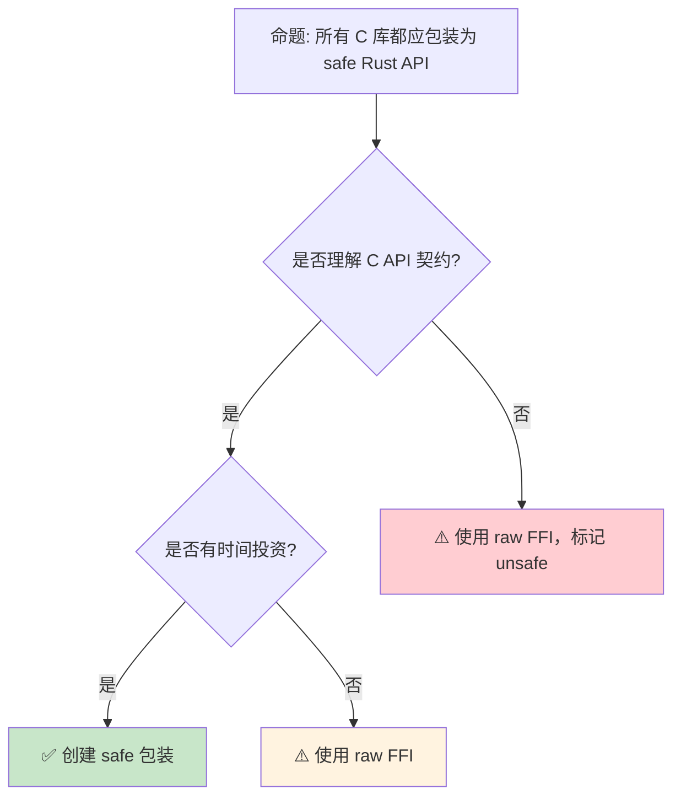

> **内容分级**: [专家级]

# FFI 高级主题：跨语言边界的安全与性能
>
> **EN**: Foreign Function Interface (FFI)
> **Summary**: Foreign Function Interface (FFI). Core Rust concept covering mechanism analysis, in-depth analysis, threading and synchronization.
> **受众**: [专家]
>
> **Bloom 层级**: 分析 → 评价
> **定位**: 深入分析 Rust **FFI（外部函数接口）**的高级主题——从复杂类型映射、回调函数、到线程安全和内存布局控制，揭示如何在不安全边界上维持 Rust 的安全保证。
> **前置概念**: [Unsafe](03_unsafe.md) · [FFI Basics](05_rust_ffi.md) · [Type System](../01_foundation/04_type_system.md)
> **后置概念**: [Cross Compilation](../06_ecosystem/17_cross_compilation.md) · [WASI](../06_ecosystem/08_wasi.md)

---

> **来源**: [Rust Nomicon — FFI](https://doc.rust-lang.org/nomicon/ffi.html) · · [RustBelt — POPL 2018](https://plv.mpi-sws.org/rustbelt/popl18/) · [O'Hearn — Separation Logic and Shared Mutable Data](https://doi.org/10.1017/S0960129501001003) · [Brown University — Interactive Rust Book](https://rust-book.cs.brown.edu/) · [Itanium C++ ABI](https://itanium-cxx-abi.github.io/cxx-abi/abi.html)
> [Rust Reference — FFI](https://doc.rust-lang.org/reference/items/external-blocks.html) ·
> [bindgen Guide](https://rust-lang.github.io/rust-bindgen/) ·
> [cbindgen](https://github.com/mozilla/cbindgen) ·
> [Wikipedia — Foreign Function Interface](https://en.wikipedia.org/wiki/Foreign_function_interface)
> **前置依赖**: [Ownership](../01_foundation/01_ownership.md) · [Borrowing](../01_foundation/02_borrowing.md)
> **前置依赖**: [Traits](../02_intermediate/01_traits.md)

## 📑 目录

- [FFI 高级主题：跨语言边界的安全与性能](#ffi-高级主题跨语言边界的安全与性能)
  - [📑 目录](#-目录)
  - [一、核心概念](#一核心概念)
    - [1.1 FFI 的安全契约](#11-ffi-的安全契约)
    - [1.2 内存布局控制](#12-内存布局控制)
    - [1.3 回调与闭包](#13-回调与闭包)
  - [二、技术细节](#二技术细节)
    - [2.1 复杂类型映射](#21-复杂类型映射)
    - [2.2 线程安全边界](#22-线程安全边界)
    - [2.3 错误处理与 Panic 安全](#23-错误处理与-panic-安全)
  - [三、FFI 模式矩阵](#三ffi-模式矩阵)
  - [四、反命题与边界分析](#四反命题与边界分析)
    - [4.1 反命题树](#41-反命题树)
    - [4.2 边界极限](#42-边界极限)
  - [五、常见陷阱](#五常见陷阱)
  - [六、来源与延伸阅读](#六来源与延伸阅读)
  - [相关概念文件](#相关概念文件)
  - [逆向推理链（Backward Reasoning）](#逆向推理链backward-reasoning)
  - [权威来源索引](#权威来源索引)
  - [十、边界测试：高级 FFI 的编译错误](#十边界测试高级-ffi-的编译错误)
    - [10.1 边界测试：可变静态变量在 FFI 中的线程安全（编译错误）](#101-边界测试可变静态变量在-ffi-中的线程安全编译错误)
    - [10.2 边界测试：`Box::into_raw` 后重复释放（运行时 UB）](#102-边界测试boxinto_raw-后重复释放运行时-ub)
    - [10.3 边界测试：C 变长参数的类型安全（编译错误/运行时 UB）](#103-边界测试c-变长参数的类型安全编译错误运行时-ub)
    - [10.4 边界测试：回调函数的生命周期与 `Box::into_raw` 泄漏（编译错误/运行时 UB）](#104-边界测试回调函数的生命周期与-boxinto_raw-泄漏编译错误运行时-ub)
    - [10.5 边界测试：C 的 `long double` 与 Rust 的类型映射缺失（编译错误）](#105-边界测试c-的-long-double-与-rust-的类型映射缺失编译错误)
    - [10.3 边界测试：C 可变参数函数的不安全绑定（运行时 UB）](#103-边界测试c-可变参数函数的不安全绑定运行时-ub)
    - [10.4 边界测试：C 结构体的内存对齐与 Rust 的 `#[repr(C)]`（运行时 ABI 不匹配）](#104-边界测试c-结构体的内存对齐与-rust-的-reprc运行时-abi-不匹配)
    - [10.7 边界测试：生命周期参数的不匹配返回](#107-边界测试生命周期参数的不匹配返回)
  - [嵌入式测验（Embedded Quiz）](#嵌入式测验embedded-quiz)
    - [测验 1：`extern "C"` 块中声明的函数在调用时为什么通常需要 `unsafe` 块？（理解层）](#测验-1extern-c-块中声明的函数在调用时为什么通常需要-unsafe-块理解层)
    - [测验 2：`#[repr(C)]` 对 struct 的内存布局有什么影响？（理解层）](#测验-2reprc-对-struct-的内存布局有什么影响理解层)
    - [测验 3：`*const T` 与 `&T` 在 Rust 中的主要区别是什么？（理解层）](#测验-3const-t-与-t-在-rust-中的主要区别是什么理解层)
    - [测验 4：向 C 函数传递 Rust `String` 存在什么风险？应该用什么类型替代？（理解层）](#测验-4向-c-函数传递-rust-string-存在什么风险应该用什么类型替代理解层)
    - [测验 5：`bindgen` 工具在 FFI 开发中的主要作用是什么？（理解层）](#测验-5bindgen-工具在-ffi-开发中的主要作用是什么理解层)
  - [认知路径](#认知路径)
    - [核心推理链](#核心推理链)
    - [反命题与边界](#反命题与边界)
  - [实践](#实践)
    - [对应代码示例](#对应代码示例)
    - [建议练习](#建议练习)
  - [导航：下一步去哪？](#导航下一步去哪)

---

## 一、核心概念
>
>

### 1.1 FFI 的安全契约
>

```text
FFI 边界的安全模型:

  Rust 侧保证:
  ├── 传入 C 的指针有效（非悬空、正确对齐）
  ├── 遵守 C API 的前置条件
  ├── 不违反 C 库的不变性
  └── 正确处理 C 返回的错误码

  C 侧保证（需要文档明确）:
  ├── 不修改 Rust 拥有的内存
  ├── 不保留 Rust 传递的临时指针
  ├── 线程安全行为（是否可重入）
  └── 资源释放约定（谁 free？）

  危险区域:
  ├── C 代码可能越界写入
  ├── C 可能返回未初始化内存
  ├── C 可能不是线程安全的
  └── C 可能在任何时刻 longjmp

  Rust 的应对:
  ├── unsafe 块标记不可验证区域
  ├── 安全包装层提供类型安全
  └── Miri / Sanitizers 动态检测
```

> **认知功能**: FFI 的**核心挑战**是**安全契约的隐式性**——C API 通常不形式化其契约，Rust 开发者必须通过文档和测试推断。
> [来源: [Rust Nomicon — FFI](https://doc.rust-lang.org/nomicon/ffi.html)]

---

### 1.2 内存布局控制
>

```rust,ignore
// 内存布局控制

use std::os::raw::{c_int, c_void};

// #[repr(C)]: C 兼容布局
#[repr(C)]
pub struct Point {
    pub x: f64,
    pub y: f64,
}

// #[repr(transparent)]: 单字段透传 ABI
#[repr(transparent)]
pub struct Handle(c_int);

// #[repr(packed)]: 无填充（用于硬件映射）
#[repr(C, packed)]
pub struct PacketHeader {
    pub flags: u8,
    pub len: u16,  // 在 packed 中可能未对齐！
    pub id: u32,
}

// 对齐控制
#[repr(C, align(16))]
pub struct AlignedBuffer {
    pub data: [u8; 64],
}

// 联合体（Union）
#[repr(C)]
pub union Value {
    pub int: c_int,
    pub float: f32,
    pub ptr: *mut c_void,
}

// 不透明类型（Opaque Struct）
#[repr(C)]
pub struct OpaqueContext {
    _private: [u8; 0],  // 大小为 0，但外部不可构造
}

// 使用:
extern "C" {
    pub fn context_new() -> *mut OpaqueContext;
    pub fn context_free(ctx: *mut OpaqueContext);
}
```

> **布局洞察**: `#[repr(C)]` 是 FFI 的**基石**——它保证 Rust 结构体（Struct）的内存布局与 C 完全相同。
> [来源: [Rust Reference — Type Layout](https://doc.rust-lang.org/reference/type-layout.html)]

---

### 1.3 回调与闭包
>

```rust,ignore
// 将 Rust 闭包传递给 C 回调

// C API 签名:
// typedef void (*callback_t)(int value, void *user_data);
// void register_callback(callback_t cb, void *user_data);

use std::ffi::c_void;

// 安全包装: 将 FnMut(i32) 转换为 C 回调
pub fn with_callback<F>(mut f: F)
where
    F: FnMut(i32),
{
    unsafe extern "C" fn trampoline<F>(value: i32, user_data: *mut c_void)
    where
        F: FnMut(i32),
    {
        let closure = &mut *(user_data as *mut F);
        closure(value);
    }

    let mut closure = f;
    unsafe {
        register_callback(
            Some(trampoline::<F>),
            &mut closure as *mut F as *mut c_void,
        );
    }
}

// 但需要考虑:
// ├── 闭包生命周期必须长于 C 回调使用期
// ├── panic 跨越 FFI 边界是 UB
// ├── 多线程场景需要 Send/Sync
// └── C 可能不保证回调只调用一次

// 更好的设计: 使用 Box 管理生命周期
pub struct CallbackHandle {
    ptr: *mut c_void,
}

impl Drop for CallbackHandle {
    fn drop(&mut self) {
        unsafe { unregister_callback(self.ptr) };
    }
}
```

> **回调洞察**: Rust 闭包（Closures） → C 回调的**桥接**是 FFI 中最复杂的模式之一——它涉及生命周期（Lifetimes）、panic 安全和线程安全的多重考量。
> [来源: [Rust FFI — Callbacks](https://doc.rust-lang.org/nomicon/ffi.html#callbacks-from-c-code-to-rust-functions)]

---

## 二、技术细节

### 2.1 复杂类型映射
>

```text
类型映射矩阵:

  基本类型:
  ┌─────────────────┬─────────────────┐
  │ C               │ Rust            │
  ├─────────────────┼─────────────────┤
  │ char            │ c_char (i8/u8)  │
  │ short           │ c_short         │
  │ int             │ c_int           │
  │ long            │ c_long          │
  │ long long       │ c_longlong      │
  │ float           │ f32             │
  │ double          │ f64             │
  │ void*           │ *mut c_void      │
  │ size_t          │ usize            │
  │ ssize_t         │ isize           │
  └─────────────────┴─────────────────┘
> [来源: [TRPL](https://doc.rust-lang.org/book/ch20-01-unsafe-rust.html)]

  字符串:
  ├── C char* → Rust *const c_char 或 CStr
  ├── Rust &str → C 需要转换为 CString
  └── 所有权: C 字符串可能需手动 free

  数组:
  ├── C 数组指针 + 长度
  ├── Rust: 切片 &[T] 或 Vec<T>
  └── 注意: C 不记录长度，需显式传递

  函数指针:
  ├── C: void (*fn)(int)
  ├── Rust: Option<extern "C" fn(c_int)>
  └── Option 用于允许 NULL 函数指针
```

> **映射洞察**: Rust 的 `std::os::raw` 模块（Module）提供**平台无关的 C 类型映射**——但 `c_char` 的符号性（signed/unsigned）因平台而异。
> [来源: [std::os::raw](https://doc.rust-lang.org/std/os/raw/index.html)]

---

### 2.2 线程安全边界
>

```rust,ignore
// FFI 线程安全

// 问题: C 库可能不是线程安全的

// 标记 Send + Sync（需要验证 C 库线程安全）
pub struct ThreadSafeHandle {
    ptr: *mut c_void,
}

// 安全包装: 假设 C 库是线程安全的
unsafe impl Send for ThreadSafeHandle {}
unsafe impl Sync for ThreadSafeHandle {}

// 更好的做法: 明确线程模型
pub struct SendOnlyHandle {
    ptr: *mut c_void,
}
unsafe impl Send for SendOnlyHandle {}
// 不实现 Sync！只能在一个线程使用

// 使用 Mutex 包装非线程安全 C 库
use std::sync::Mutex;

pub struct SyncWrapper {
    inner: Mutex<*mut c_void>,
}

// 或使用 LocalKey 限制为线程本地
use std::thread_local;

thread_local! {
    static LOCAL_CTX: *mut c_void = std::ptr::null_mut();
}

// 关键问题:
// ├── C 库的线程模型是什么？
// ├── 回调发生在哪个线程？
// ├── C 库是否使用 TLS？
// └── Rust 的 Send/Sync 标记是否准确？
```

> **线程安全洞察**: FFI 的**线程安全**不能自动推断——必须查阅 C 库文档或源码，然后显式标记 `Send`/`Sync`。
> [来源: [Rust Nomicon — Send and Sync](https://doc.rust-lang.org/nomicon/send-and-sync.html)]

---

### 2.3 错误处理与 Panic 安全
>

```rust,ignore
// Panic 跨越 FFI 边界 = 未定义行为

// 安全包装: 捕获 panic
pub fn safe_ffi_call() -> Result<(), String> {
    std::panic::catch_unwind(|| {
        // Rust 代码可能 panic
        risky_operation();
    }).map_err(|e| {
        format!("Panic: {:?}", e.downcast_ref::<&str>())
    })?;
    Ok(())
}

// C 错误码映射
#[derive(Debug)]
pub enum FfiError {
    NullPointer,
    InvalidArg,
    OutOfMemory,
    Unknown(i32),
}

impl From<c_int> for FfiError {
    fn from(code: c_int) -> Self {
        match code {
            -1 => FfiError::NullPointer,
            -2 => FfiError::InvalidArg,
            -3 => FfiError::OutOfMemory,
            _ => FfiError::Unknown(code),
        }
    }
}

// 使用 Result:
pub fn open_file(path: &str) -> Result<FileHandle, FfiError> {
    let c_path = std::ffi::CString::new(path)?;
    let handle = unsafe { c_open_file(c_path.as_ptr()) };
    if handle.is_null() {
        Err(FfiError::NullPointer)
    } else {
        Ok(FileHandle { ptr: handle })
    }
}

// 资源清理（即使出错）:
struct CleanupGuard<F: FnOnce()>(Option<F>);

impl<F: FnOnce()> Drop for CleanupGuard<F> {
    fn drop(&mut self) {
        if let Some(f) = self.0.take() {
            f();
        }
    }
}
```

> **Panic 安全洞察**: `catch_unwind` 是 FFI 边界的**安全网**——但不应作为常规错误处理（Error Handling）机制使用，它有性能开销且不能捕获所有 panic。
> [来源: [std::panic::catch_unwind](https://doc.rust-lang.org/std/panic/fn.catch_unwind.html)]

---

## 三、FFI 模式矩阵

```text
场景 → 方案 → 关键考虑

C 库包装:
  → -sys crate 提供底层绑定
  → 高层 crate 提供安全 API
  → 关键: 谁管理内存？

自动绑定生成:
  → bindgen: C → Rust
  → cbindgen: Rust → C
  → 需要手动审查和调整

内存共享:
  → 共享缓冲区（&mut [u8]）
  → 注意: C 可能越界写入
  → 使用长度检查或 Miri 验证

异步集成:
  → C 回调 → Rust Future
  → 需要 Waker 机制桥接
  → 复杂但可行

Opaque 指针:
  → Rust 拥有，C 只使用
  → 或 C 拥有，Rust 使用
  → 明确所有权避免 double free
```

> **模式矩阵**: FFI 的**核心原则**是"在边界处验证"——所有跨边界的假设都必须在 Rust 侧显式检查。
> [来源: [Rust FFI Guidelines](https://rust-lang.github.io/rust-bindgen/)]

---

## 四、反命题与边界分析

### 4.1 反命题树
>



> **认知功能**: **Safe 包装是目标**，但**理解 C API 契约是前提**——不安全的包装比直接的 unsafe 更危险。
> [来源: [Rust API Guidelines — Safety](https://rust-lang.github.io/api-guidelines//documentation.html#function-docs-include-error-conditions-and-panic-conditions-c-failure)]

---

### 4.2 边界极限
>

```text
边界 1: C++ 互操作
├── C++ 的名称修饰、异常、类
├── cxx crate 提供类型安全桥接
├── 但仍有局限性（模板、多重继承）
└── 缓解: C 兼容接口层

边界 2: 长期运行的 C 回调
├── Rust 闭包可能被 C 长期持有
├── 生命周期管理复杂
├── 需要 Pin 保证内存不移动
└── 缓解: Box + Pin + 显式释放

边界 3: 异常模型差异
├── C++ 异常、setjmp/longjmp
├── Rust panic
├── 两者跨越边界都是 UB
└── 缓解: 在边界处转换错误模型

边界 4: 调试困难
├── C 侧调试器看不到 Rust 类型
├── Rust 侧调试器看不到 C 结构
├── 栈跟踪跨越语言边界断裂
└── 缓解: 统一使用 lldb/gdb

边界 5: 构建系统集成
├── Cargo 与 make/cmake/meson
├── 交叉编译工具链
├── 静态链接 vs 动态链接
└── 缓解: build.rs + pkg-config
```

> **边界要点**: FFI 的边界主要与**C++ 互操作**、**回调生命周期**、**异常模型**、**调试**和**构建系统**相关。
> [来源: [Rust FFI — Best Practices](https://doc.rust-lang.org/nomicon/ffi.html#best-practices)]

---

## 五、常见陷阱

```text
陷阱 1: 忽略 C 字符串的 NULL 终止
  ❌ let c_str = my_rust_string.as_ptr();
     // Rust 字符串不是 NULL 终止的！

  ✅ let c_string = CString::new(my_rust_string)?;
     // 确保 NULL 终止

陷阱 2: 返回悬空指针
  ❌ pub fn get_name() -> *const c_char {
         let name = CString::new("temp").unwrap();
         name.as_ptr()  // name 在这里被 drop！
     }

  ✅ pub fn get_name() -> CString {
         CString::new("safe").unwrap()
     }
     // 或泄漏（如果必须返回指针）: into_raw()

陷阱 3: 不匹配调用约定
  ❌ extern fn callback(x: i32) {}
     // 默认是 "Rust" 调用约定

  ✅ unsafe extern "C" fn callback(x: c_int) {}
     // C 调用约定

陷阱 4: 忽略对齐要求
  ❌ 将未对齐指针传递给 C
     // C 可能假设对齐

  ✅ 使用 #[repr(C)] 和正确对齐
     // 或 memcpy 到对齐缓冲区

陷阱 5: Panic 跨越 FFI
  ❌ unsafe extern "C" fn cb() {
         might_panic();  // UB！
     }

  ✅ unsafe extern "C" fn cb() {
         let _ = std::panic::catch_unwind(|| {
             might_panic();
         });
     }
```

> **陷阱总结**: FFI 的陷阱主要与**字符串**、**生命周期（Lifetimes）**、**调用约定**、**对齐**和 **panic** 相关。
> [来源: [Rust FFI — Common Mistakes](https://doc.rust-lang.org/nomicon/ffi.html)]

---

## 六、来源与延伸阅读
>

| 来源 | 可信度 | 说明 |
| [Rust Standard Library](https://doc.rust-lang.org/std/) | ✅ 一级 | 标准库参考 |
| [Rust By Example](https://doc.rust-lang.org/rust-by-example/) | ✅ 一级 | 交互式教程 |
| [This Week in Rust](https://this-week-in-rust.org/) | ✅ 二级 | 社区动态 |

| [Rust Reference](https://doc.rust-lang.org/reference/) | ✅ 一级 | 语言参考 |
|:---|:---:|:---|
| [Rust Nomicon — FFI](https://doc.rust-lang.org/nomicon/ffi.html) | ✅ 一级 | 权威指南 |
| [bindgen Guide](https://rust-lang.github.io/rust-bindgen/) | ✅ 一级 | 绑定生成 |
| [cbindgen](https://github.com/mozilla/cbindgen) | ✅ 一级 | Rust → C 头 |
| [Rust Reference — extern](https://doc.rust-lang.org/reference/items/external-blocks.html) | ✅ 一级 | 语法参考 |
| [cxx crate](https://cxx.rs/) | ✅ 一级 | C++ 互操作 |

---

## 相关概念文件

- [Unsafe](03_unsafe.md) — 不安全代码
- [FFI Basics](05_rust_ffi.md) — FFI 基础
- [Cross Compilation](../06_ecosystem/17_cross_compilation.md) — 交叉编译
- [Type System](../01_foundation/04_type_system.md) — 类型系统（Type System）

---

> **权威来源**: [Rust Reference](https://doc.rust-lang.org/reference/), [The Rust Programming Language](https://doc.rust-lang.org/book/ch20-01-unsafe-rust.html)
>
> **权威来源对齐变更日志**: 2026-05-22 创建 [来源: Authority Source Sprint Batch 10]

**文档版本**: 1.0
**对应 Rust 版本**: 1.96.1+ (Edition 2024)
**最后更新**: 2026-05-22
**状态**: ✅ 概念文件创建完成

---

## 逆向推理链（Backward Reasoning）

> **从编译错误反推**：
>
> ```text
> 高级 FFI 安全 ⟸ 复杂类型布局兼容
> ```
>
## 权威来源索引

>
>
>
>
>

---

---

---

> **补充来源**

## 十、边界测试：高级 FFI 的编译错误

### 10.1 边界测试：可变静态变量在 FFI 中的线程安全（编译错误）

```rust,compile_fail
static mut COUNTER: i32 = 0;

extern "C" fn increment() {
    // ❌ 编译错误: use of mutable static is unsafe and requires unsafe function or block
    // 即使 FFI 函数，访问 mutable static 仍需 unsafe
    COUNTER += 1;
}

// 正确: 使用 Mutex 包装
use std::sync::Mutex;

static COUNTER_SAFE: Mutex<i32> = Mutex::new(0);

extern "C" fn increment_fixed() {
    let mut guard = COUNTER_SAFE.lock().unwrap();
    *guard += 1; // ✅ 无需 unsafe
}
```

> **修正**: `static mut` 在 Rust 中几乎永远不应使用。它绕过所有权（Ownership）和借用（Borrowing）检查，允许数据竞争。FFI 回调若需维护全局状态，应使用 `Mutex<T>`、`RwLock<T>` 或原子类型。`static mut` 的访问需要 `unsafe`，且即使单线程 FFI 调用也可能因信号处理或重入导致未定义行为。[来源: [Rustonomicon](https://doc.rust-lang.org/nomicon/)]

### 10.2 边界测试：`Box::into_raw` 后重复释放（运行时 UB）

```rust
fn main() {
    let b = Box::new(42);
    let ptr = Box::into_raw(b);
    // ⚠️ 运行时 UB: 若调用两次 free
    unsafe {
        drop(Box::from_raw(ptr)); // 第一次释放
        // drop(Box::from_raw(ptr)); // 二次释放 = double free!
    }
}

// 正确: 使用 ManuallyDrop 或明确所有权转移
fn fixed() {
    let b = Box::new(42);
    let ptr = Box::into_raw(b);
    unsafe {
        let _ = Box::from_raw(ptr); // 取回 Box，自动 drop
    } // 不再次访问 ptr
}
```

> **修正**: `Box::into_raw` 将 `Box` 转为裸指针，放弃 Rust 的自动内存管理。
> 调用者必须确保：
>
> 1) 指针最终通过 `Box::from_raw` 或 `drop(Box::from_raw(ptr))` 释放恰好一次；
> 2) 指针在释放后不再使用。双重释放（double free）是严重的内存安全（Memory Safety）漏洞，可能被利用进行代码执行。
> 这与 C 的 `malloc`/`free` 管理相同——Rust 的 unsafe 边界将责任完全转移给程序员。[来源: [Rust Standard Library](https://doc.rust-lang.org/std/)]

### 10.3 边界测试：C 变长参数的类型安全（编译错误/运行时 UB）

```rust,compile_fail
use std::os::raw::{c_char, c_int};

extern "C" {
    // C 的 printf: int printf(const char* fmt, ...);
    fn printf(fmt: *const c_char, ...) -> c_int;
}

fn main() {
    let fmt = b"%d %s\0".as_ptr() as *const c_char;
    unsafe {
        // ❌ 运行时 UB: 变长参数类型不匹配
        printf(fmt, "42" as *const c_char, 42 as c_int);
        // 预期: int, char* — 实际传递: char*, int
    }
}
```

> **修正**: C 的变长参数（variadic functions，`...`）无类型检查，调用者必须确保实参类型与格式字符串一致。
> Rust 的 FFI 声明 `extern "C" { fn printf(fmt: *const c_char, ...) }` 同样无类型保护——`unsafe` 块中的调用完全信任开发者。
> 错误传递参数类型（`char*` vs `int`）导致未定义行为：栈布局错误、格式字符串解析越界、可能的安全漏洞。
> 安全替代：
>
> 1) 在 Rust 中封装为类型安全的 API（`fn rust_print(args: &[Arg])`）；
> 2) 使用 `libffi` crate 动态构造调用；
> 3) 避免使用 C 的变长参数，改用 struct 指针传递参数。
> 这与 Go 的 `cgo`（同样无变长参数类型检查）或 Java 的 JNA（有类型映射，但仍可能出错）类似——FFI 的边界是类型系统（Type System）的极限。
> [来源: [The Rust Programming Language](https://doc.rust-lang.org/book/ch19-01-unsafe-rust.html)] ·
> [来源: [libffi Crate](https://docs.rs/libffi/)]

### 10.4 边界测试：回调函数的生命周期与 `Box::into_raw` 泄漏（编译错误/运行时 UB）

```rust,compile_fail
use std::os::raw::c_void;

extern "C" {
    fn register_callback(cb: extern "C" fn(*mut c_void), ctx: *mut c_void);
}

extern "C" fn callback(ctx: *mut c_void) {
    unsafe {
        let _ = Box::from_raw(ctx as *mut String);
        // 从 raw pointer 恢复 Box，drop 时释放
    }
}

fn main() {
    let ctx = Box::into_raw(Box::new(String::from("data")));
    unsafe {
        register_callback(callback, ctx as *mut c_void);
    }
    // ❌ 运行时 UB: 若 C 代码未调用 callback，ctx 泄漏
    // 若 C 代码多次调用 callback，双重释放
}
```

> **修正**:
> 将 Rust 对象通过 `Box::into_raw` 传递给 C 代码时，
> 所有权（Ownership）语义发生断裂：
> C 代码不理解 Rust 的所有权（Ownership）规则，可能不调用回调、多次调用回调、或在错误线程调用。
> 这是 FFI 的**所有权（Ownership）边界**问题：
> Rust 侧释放（`Box::from_raw`）要求对调用次数和时机的精确控制。
> 安全模式：
>
> 1) 使用 `Arc<Mutex<T>>`（引用（Reference）计数，多线程安全）；
> 2) 在 C API 中明确文档回调调用次数（一次、零次或多次）；
> 3) 使用 `ManuallyDrop` 延迟释放，直到确定安全。
> 这与 C++ 的 `std::shared_ptr` 传递到外代码（同样问题，需要自定义 deleter）或 Swift 的 `Unmanaged<T>`（显式 retain/release）类似——跨语言边界时，自动内存管理让位于显式契约。
> [来源: [The Rust FFI Omnibus](https://jakegoulding.com/rust-ffi-omnibus/)] · [来源: [Rustonomicon](https://doc.rust-lang.org/nomicon/)]

### 10.5 边界测试：C 的 `long double` 与 Rust 的类型映射缺失（编译错误）

```rust,compile_fail
use std::os::raw::{c_double, c_longdouble};

extern "C" {
    // ❌ 编译错误: Rust 标准库无 c_longdouble 类型
    fn compute_long(x: c_longdouble) -> c_longdouble;
}

fn main() {
    // C 的 long double 在 x86 上是 80 位扩展精度，Rust 无直接映射
    // 需使用 libc crate 或手动定义
}
```

> **修正**: C 的 `long double` 是平台相关的浮点类型：x86 上 80 位扩展精度（16 字节对齐），ARM 上 128 位四精度，某些平台上与 `double` 相同。Rust 标准库**无 `c_longdouble` 类型**，`libc` crate 提供平台特定的定义。FFI 中使用 `long double` 需：1) 查询目标平台的 `sizeof(long double)`；2) 使用 `libc::c_longdouble`（若可用）；3) 或避免在 FFI 边界使用 `long double`（改为 `double` 或自定义结构）。这与 C++ 的 `long double`（原生支持）或 Go 的 `C.longdouble`（通过 cgo 支持）不同——Rust 的 FFI 设计优先覆盖常见场景，`long double` 的边缘情况需额外处理。[来源: [libc Crate](https://docs.rs/libc/)] · [来源: [The Rust FFI Omnibus](https://jakegoulding.com/rust-ffi-omnibus/)]

### 10.3 边界测试：C 可变参数函数的不安全绑定（运行时 UB）

```rust,compile_fail
use std::os::raw::{c_char, c_int};
use std::ffi::CString;

extern "C" {
    // C 的 printf 风格可变参数函数
    fn sprintf(buf: *mut c_char, fmt: *const c_char, ...) -> c_int;
}

fn main() {
    let mut buf = [0u8; 256];
    let fmt = CString::new("%s %d").unwrap();
    let msg = CString::new("hello").unwrap();
    unsafe {
        // ❌ 运行时 UB: 可变参数类型不匹配（如传递 i32 期望 i64）
        sprintf(buf.as_mut_ptr() as *mut c_char, fmt.as_ptr(), msg.as_ptr(), 42i32);
    }
}
```

> **修正**: C 的**可变参数函数**（variadic function，如 `printf`、`sprintf`）在 Rust FFI 中绑定是 `unsafe` 的：1) 参数类型不匹配 → UB（如 `i32` 传给期望 `c_int` 的位置，在 LP64 平台上可能正确，但在 ILP32 上可能错误）；2) 格式字符串与参数数量不匹配 → 缓冲区溢出或读取无效内存；3) Rust 字符串（UTF-8）与 C 字符串（null-terminated bytes）的编码差异。安全策略：1) 避免直接绑定 C 可变参数函数；2) 使用 `libc` crate 的标准绑定（已验证）；3) 用 Rust 的 `format!` + `CString::new` 构造参数，再传递。`va_list` 在 Rust 中可通过 `c_variadic` feature（nightly）或 `va_list-rs` crate 处理。这与 Go 的 cgo（CGO 自动处理部分类型转换）或 Java 的 JNI（JVM 管理类型安全）不同——Rust 的 FFI 是零成本但需完全手动验证。[来源: [The Rustonomicon](https://doc.rust-lang.org/nomicon/ffi.html)] · [来源: [libc crate](https://docs.rs/libc/)]

### 10.4 边界测试：C 结构体的内存对齐与 Rust 的 `#[repr(C)]`（运行时 ABI 不匹配）

```rust,ignore
#[repr(C)]
struct RustStruct {
    a: u8,
    b: u32,
    c: u16,
}

// C 结构体:
// struct CStruct {
//     uint8_t a;
//     uint32_t b;
//     uint16_t c;
// };

fn main() {
    println!("Rust size: {}", std::mem::size_of::<RustStruct>());
    // ❌ 运行时 ABI 风险: 若 C 编译器使用不同对齐规则（如 packed）
    // Rust 的 #[repr(C)] 遵循平台 C ABI，但 pragma pack 可能改变对齐
}
```

> **修正**: `#[repr(C)]` 使 Rust struct 遵循**平台 C ABI 的布局规则**：1) 字段按声明顺序排列；2) 对齐要求与 C 相同；3) 大小和对齐是平台相关的（x86_64 上 `u32` 对齐 4 字节）。风险：1) C 代码使用 `#pragma pack(1)` → Rust 需 `#[repr(C, packed)]`；2) C 的位域（bitfields）→ Rust 无直接等价物，需手动掩码；3) C 的 `_Alignas` → Rust 的 `#[repr(align(N))]`。`bindgen` 工具自动从 C 头文件生成 Rust 绑定（含正确的 `repr` 和字段布局）。这与 C++ 的 `extern "C"`（类似 ABI 兼容）或 Go 的 cgo（自动生成，但可能对齐不一致）不同——Rust 的 FFI 要求开发者显式控制内存布局。[来源: [The Rustonomicon](https://doc.rust-lang.org/nomicon/other-reprs.html)] · [来源: [bindgen](https://rust-lang.github.io/rust-bindgen/)]

### 10.7 边界测试：生命周期参数的不匹配返回

```rust,compile_fail
fn longest<'a, 'b>(x: &'a str, y: &'b str) -> &'a str {
    // ❌ 编译错误: 不能返回 y，因为 y 的生命周期 'b 可能短于 'a
    y
}

fn main() {}
```

> **修正**: **生命周期标注**：1) `&'a str` 表示引用（Reference）至少存活 `'a`；2) 返回 `'a` 要求数据存活至少 `'a`；3) `y` 的 lifetime `'b` 可能短于 `'a`，返回会导致悬垂引用。

## 嵌入式测验（Embedded Quiz）

### 测验 1：`extern "C"` 块中声明的函数在调用时为什么通常需要 `unsafe` 块？（理解层）

**题目**: `extern "C"` 块中声明的函数在调用时为什么通常需要 `unsafe` 块？

<details>
<summary>✅ 答案与解析</summary>

因为 FFI 函数来自其他语言，Rust 编译器无法验证其内存安全（Memory Safety）、生命周期和并发正确性，调用方需承担安全责任。
</details>

---

### 测验 2：`#[repr(C)]` 对 struct 的内存布局有什么影响？（理解层）

**题目**: `#[repr(C)]` 对 struct 的内存布局有什么影响？

<details>
<summary>✅ 答案与解析</summary>

使 struct 字段按声明顺序布局，对齐方式遵循平台 C ABI，便于与 C 代码共享结构体定义。
</details>

---

### 测验 3：`*const T` 与 `&T` 在 Rust 中的主要区别是什么？（理解层）

**题目**: `*const T` 与 `&T` 在 Rust 中的主要区别是什么？

<details>
<summary>✅ 答案与解析</summary>

`*const T` 是原始指针（Raw Pointer），允许为空、允许别名、不受借用（Borrowing）检查器管理，解引用（Reference）需 `unsafe`。`&T` 是受借用规则约束的引用。
</details>

---

### 测验 4：向 C 函数传递 Rust `String` 存在什么风险？应该用什么类型替代？（理解层）

**题目**: 向 C 函数传递 Rust `String` 存在什么风险？应该用什么类型替代？

<details>
<summary>✅ 答案与解析</summary>

`String` 不保证以 NUL 结尾且含长度/容量元数据，C 无法理解。应使用 `CString` 或 `c_char` 指针。
</details>

---

### 测验 5：`bindgen` 工具在 FFI 开发中的主要作用是什么？（理解层）

**题目**: `bindgen` 工具在 FFI 开发中的主要作用是什么？

<details>
<summary>✅ 答案与解析</summary>

根据 C/C++ 头文件自动生成 Rust FFI 绑定代码，包括 `extern` 函数声明、`#[repr(C)]` 结构体（Struct）和常量定义。
</details>

## 认知路径

> **认知路径**: 从 L0 基础概念出发，经由本节的 **FFI 高级主题：跨语言边界的安全与性能** 核心原理，通向 L2 进阶模式与 L3 工程实践。

### 核心推理链

| 定理 | 前提 | 结论 | 置信度 |
|:---|:---|:---|:---|
| FFI 高级主题：跨语言边界的安全与性能 基础定义 ⟹ 正确用法 | 理解语法与语义 | 能写出符合惯用法的代码 | 高 |
| FFI 高级主题：跨语言边界的安全与性能 正确用法 ⟹ 常见陷阱 | 忽略边界条件 | 编译错误或运行时（Runtime） bug | 高 |
| FFI 高级主题：跨语言边界的安全与性能 常见陷阱 ⟹ 深度掌握 | 系统学习反模式 | 能进行代码审查与优化 | 高 |

> 复杂类型布局安全 ⟸ repr(C) 兼容 ⟸ 对齐与填充
> 回调安全 ⟸ 函数指针生命周期 ⟸ 线程边界
> **过渡**: 掌握 FFI 高级主题：跨语言边界的安全与性能 的基础语法后，下一步需要理解其在类型系统（Type System）中的位置与与其他概念的交互关系。
> **过渡**: 在实践中应用 FFI 高级主题：跨语言边界的安全与性能 时，务必关注边界条件与异常处理，这是从"能编译"到"能生产"的关键跃迁。
> **过渡**: FFI 高级主题：跨语言边界的安全与性能 的设计理念体现了 Rust 零成本抽象（Zero-Cost Abstraction）与安全保证的核心权衡，理解这一权衡有助于迁移到更高级的并发与形式化验证领域。

### 反命题与边界

> **反命题**: "FFI 高级主题：跨语言边界的安全与性能 在所有场景下都是最佳选择" —— 错误。需要根据具体上下文权衡性能、可读性与安全性，某些场景下显式替代方案可能更优。

---

---

## 实践

> 将本节概念转化为可编译代码。

### 对应代码示例

- **[crates/c13_embedded](../../../crates/c13_embedded/)** — 与本节概念对应的可编译 crate 示例

### 建议练习

1. 阅读 `crates/c13_embedded/` 中与"高级 FFI"相关的源码和示例
2. 运行 `cargo test -p c13_embedded` 验证理解

---

## 导航：下一步去哪？

> **自检**：你当前掌握的核心概念是否已能独立应用？

| 选择 | 条件 | 目标 |
|:---|:---|:---|
| 🔙 巩固基础 | 仍有模糊概念 | 回到 [L2 对应主题](../02_intermediate) 或 [MVP 学习路径](../00_meta/learning_mvp_path.md) |
| 🔜 深入 L3 其他主题 | 想扩展高级技能 | [L3 README](README.md) 选择其他主题 |
| 🎓 进入 L4 形式化 | 想理解"为什么"的数学证明 | [L4 形式化](../04_formal/README.md) |
| 🏗️ 进入 L6 生态 | 想掌握生产工具链 | [L6 生态](../06_ecosystem/README.md) |
