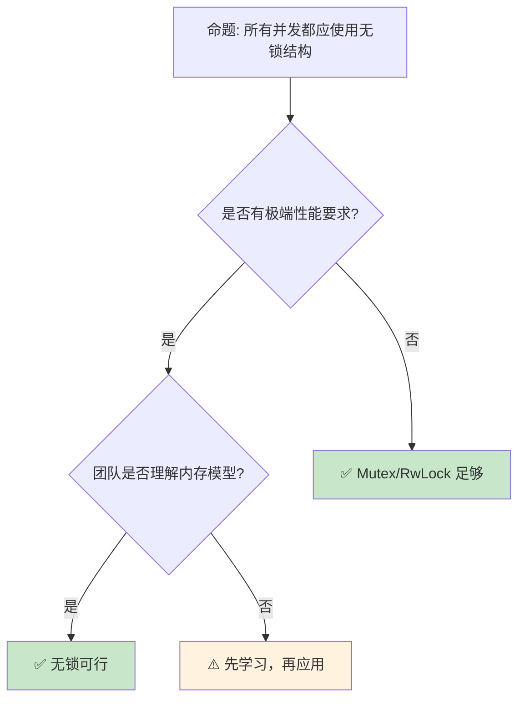

# 并发 [来源: [Rust Concurrency](https://doc.rust-lang.org/book/ch16-00-concurrency.html)]模式：从消息 [来源: [Message Passing](https://doc.rust-lang.org/book/ch16-02-message-passing.html)]传递到锁自由的数据结构

> **Bloom 层级**: 分析 → 评价
> **A/S/P 标记**: **S+P** — Structure + Procedure
> **双维定位**: C×Ana — 分析并发模式的设计意图
> **定位**: 深入分析 Rust **并发编程的高级模式**——从 Actor 模型、通道模式到无锁数据结构和内存序，揭示 Rust 所有权系统如何为并发安全提供编译期保证。
> **前置概念**: [Concurrency](./01_concurrency.md) · [Async](./02_async.md) · [Type System](../01_foundation/04_type_system.md)
> **后置概念**: [Distributed Systems](../06_ecosystem/18_distributed_systems.md) · [Lockfree](../03_advanced/01_concurrency.md)

---

> **来源**: [The Rust Programming Language — Concurrency](https://doc.rust-lang.org/book/ch16-00-concurrency.html) ·
> [Rust Atomics and Locks](https://marabos.nl/atomics/) ·
> [crossbeam crate](https://docs.rs/crossbeam/latest/crossbeam/) ·
> [tokio::sync](https://docs.rs/tokio/latest/tokio/sync/index.html) ·
> [Wikipedia — Non-blocking Algorithm](https://en.wikipedia.org/wiki/Non-blocking_algorithm)

## 📑 目录
>
> [来源: [Rust Reference](https://doc.rust-lang.org/reference/)]
>
> [来源: [TRPL](https://doc.rust-lang.org/book/)]

- [并发 \[来源: Rust Concurrency\]模式：从消息 \[来源: Message Passing\]传递到锁自由的数据结构](#并发-来源-rust-concurrency模式从消息-来源-message-passing传递到锁自由的数据结构)
  - [📑 目录](#-目录)
  - [一、核心概念](#一核心概念)
    - [1.1 所有权与并发的统一](#11-所有权与并发的统一)
    - [1.2 Send 与 Sync：编译期并发安全](#12-send-与-sync编译期并发安全)
    - [1.3 共享状态 vs 消息传递](#13-共享状态-vs-消息传递)
  - [二、技术细节](#二技术细节)
    - [2.1 通道模式](#21-通道模式)
    - [2.2 无锁数据结构](#22-无锁数据结构)
    - [2.3 内存顺序](#23-内存顺序)
  - [三、并发模式矩阵](#三并发模式矩阵)
  - [四、反命题与边界分析](#四反命题与边界分析)
    - [4.1 反命题树](#41-反命题树)
    - [4.2 边界极限](#42-边界极限)
  - [五、常见陷阱](#五常见陷阱)
    - [编译错误示例](#编译错误示例)
    - [4.4 边界测试：`ScopedThread` 中引用逃逸（编译错误）](#44-边界测试scopedthread-中引用逃逸编译错误)
    - [4.5 边界测试：`Condvar` 虚假唤醒未处理（逻辑错误）](#45-边界测试condvar-虚假唤醒未处理逻辑错误)
  - [六、来源与延伸阅读](#六来源与延伸阅读)
  - [相关概念文件](#相关概念文件)
  - [权威来源索引](#权威来源索引)
    - [10.3 边界测试：`crossbeam::channel` 的关闭检测与迭代终止（逻辑错误）](#103-边界测试crossbeamchannel-的关闭检测与迭代终止逻辑错误)
    - [10.4 边界测试：Send/Sync 的 auto trait 边界与线程安全（编译错误）](#104-边界测试sendsync-的-auto-trait-边界与线程安全编译错误)

---

## 一、核心概念
>
> [来源: [Rust Reference](https://doc.rust-lang.org/reference/)]
>
> [来源: [Rust Reference](https://doc.rust-lang.org/reference/)]

### 1.1 所有权与并发的统一
>
> **[来源: [Rust Reference](https://doc.rust-lang.org/reference/)]**

```text
Rust 并发的核心洞察:

  所有权 → 并发安全:
  ├── 一个值只有一个所有者
  ├── 所有者移动到新线程 [来源: [std::thread](https://doc.rust-lang.org/std/thread/index.html)] → 值跟随移动
  ├── 无数据竞争（编译期保证）
  └── 无需 GC 或运行时检查

  借用 → 共享读取:
  ├── 多个不可变引用同时存在
  ├── 不可变引用可以跨线程共享
  ├── 读-读不冲突
  └── 编译期验证无写冲突

  可变借用 → 独占写入:
  ├── 一个可变引用独占访问
  ├── Mutex [来源: [std::sync::Mutex](https://doc.rust-lang.org/std/sync/struct.Mutex.html)] 包装可变引用
  ├── 运行时在锁保护下提供独占性
  └── 编译期验证正确传递

  统一模型:
  ┌─────────────────────────────────────────┐
  │  所有权规则（单线程）                    │
  │  ├─ 一个所有者                           │
  │  ├─ 多个不可变借用                       │
  │  └─ 一个可变借用（独占）                 │
  ├─────────────────────────────────────────┤
  │  并发扩展                                │
  │  ├─ 所有者跨线程移动（Send）            │
  │  ├─ 不可变借用跨线程共享（Sync）        │
  │  └─ 可变借用通过 Mutex/Arc [来源: [std::sync::Arc](https://doc.rust-lang.org/std/sync/struct.Arc.html)]Mutex 保护    │
  └─────────────────────────────────────────┘
```

> **认知功能**: Rust 的**并发安全不是独立的系统**——它是**所有权规则的自然延伸**。
> [来源: [TRPL — Concurrency](https://doc.rust-lang.org/book/ch16-00-concurrency.html)]

---

### 1.2 Send 与 Sync：编译期并发安全
>
> **[来源: [The Rust Programming Language](https://doc.rust-lang.org/book/)]**

```rust,ignore
// Send: 可以跨线程转移所有权
pub unsafe auto trait Send { }

// Sync: 可以跨线程共享引用 (&T is Send)
pub unsafe auto trait Sync { }

// 自动推导规则:
// ├── 原始类型: Send + Sync
// ├── 包含 Send 的类型: Send
// ├── 包含 Sync 的类型: Sync
// ├── 原始指针 (*const T, *mut T): !Send + !Sync
// ├── Rc<T>: !Send + !Sync（非原子引用计数）
// ├── Cell<T>: Send + !Sync（内部可变）
// └── RefCell<T>: !Send（运行时借用检查非线程安全）

// 手动实现（需要 unsafe）:
struct MyType(*mut c_void);

unsafe impl Send for MyType {}  // 我保证可以安全跨线程移动
unsafe impl Sync for MyType {}  // 我保证可以安全跨线程共享

// 使用场景:
// ├── Send: 将数据 move 到新线程
// ├── Sync: 多个线程同时读取共享数据
// └── 两者: Arc<Mutex<T>> 同时满足

// 编译期检查:
fn spawn_thread<T: Send + 'static>(data: T) {
    std::thread::spawn(move || {
        // data 在这里安全可用
    });
}
```

> **Send/Sync 洞察**: `Send` 和 `Sync` 是 Rust **并发安全的类型系统根基**——它们将线程安全从文档约定提升为**编译期可验证的属性**。
> [来源: [std::marker::Send](https://doc.rust-lang.org/std/marker/trait.Send.html)]

---

### 1.3 共享状态 vs 消息传递
>
> **[来源: [Rust Standard Library](https://doc.rust-lang.org/std/)]**

```text
两种并发模型:

  消息传递（Go 风格）:
  ├── 通道（Channel）传输数据
  ├── 所有权随消息转移
  ├── 无共享状态
  ├── 更容易推理
  └── 适合: 任务并行、流水线

  共享状态（传统风格）:
  ├── Mutex/RwLock [来源: [std::sync::RwLock](https://doc.rust-lang.org/std/sync/struct.RwLock.html)] 保护数据
  ├── Arc 共享所有权
  ├── 状态集中管理
  ├── 更细粒度控制
  └── 适合: 高性能缓存、计数器

  Rust 的融合:
  ├── 消息传递: std::sync::mpsc / crossbeam::channel [来源: [std::sync::mpsc](https://doc.rust-lang.org/std/sync/mpsc/index.html)]
  ├── 共享状态: Mutex + Arc
  ├── 混合使用: 通道传递 Arc
  └── 选择取决于场景

  代码对比:

  消息传递:
    let (tx, rx) = mpsc::channel();
    tx.send(data).unwrap();
    let received = rx.recv().unwrap();

  共享状态:
    let counter = Arc::new(Mutex::new(0));
    let counter2 = Arc::clone(&counter);
    thread::spawn(move || {
        *counter2.lock().unwrap() += 1;
    });
```

> **模型洞察**: Rust 的**所有权系统**使两种模型都可以**安全地实现**——消息传递自动转移所有权，共享状态通过类型系统保证互斥。
> [来源: [Rust By Example — Concurrency](https://doc.rust-lang.org/rust-by-example/concurrency.html)]

---

## 二、技术细节
>
> [来源: [Rust Reference](https://doc.rust-lang.org/reference/)]
>
> [来源: [TRPL](https://doc.rust-lang.org/book/)]

### 2.1 通道模式
>
> **[来源: [Rustonomicon](https://doc.rust-lang.org/nomicon/)]**

```rust,ignore
// 通道的类型与选择

use std::sync::mpsc;

// 1. 多生产者单消费者 (MPSC)
let (tx, rx) = mpsc::channel();
let tx2 = tx.clone();  // 多个发送者

// 2. 同步通道（有界容量）
let (tx, rx) = mpsc::sync_channel(100);  // 缓冲 100 个消息

// crossbeam 的无界/有界通道（更优）
use crossbeam::channel;
let (tx, rx) = channel::unbounded();  // 无界
let (tx, rx) = channel::bounded(100);  // 有界

// 通道模式:
// ├── 请求-响应: 两个通道（req, resp）
// ├── 广播: crossbeam::channel 不支持，用 bus crate
// ├── 工作窃取: crossbeam::deque
// └── select: 多路复用接收

// Select（crossbeam）:
use crossbeam::channel::select;

select! {
    recv(rx1) -> msg => println!("从 rx1: {:?}", msg),
    recv(rx2) -> msg => println!("从 rx2: {:?}", msg),
    default => println!("无消息"),
}

// async 通道（tokio）:
use tokio::sync::mpsc;
let (tx, mut rx) = mpsc::channel(100);
// 异步发送/接收
```

> **通道洞察**: **crossbeam 通道**是 Rust **同步并发**的标准选择——它比 std::sync::mpsc 更快且支持 select。
> [来源: [crossbeam::channel](https://docs.rs/crossbeam/latest/crossbeam/channel/index.html)]

---

### 2.2 无锁数据结构
>
> **[来源: [Rust By Example](https://doc.rust-lang.org/rust-by-example/)]**

```text
无锁并发 primitives:

  Atomic 类型:
  ├── AtomicUsize / AtomicIsize
  ├── AtomicBool
  ├── AtomicPtr<T>
  └── 操作: load, store, swap, compare_exchange, fetch_add

  内存顺序:
  ├── Relaxed: 最弱，仅原子性
  ├── Acquire/Release: 同步点
  ├── AcqRel: 同时获取和释放
  └── SeqCst: 最强，顺序一致

  Lock-free 数据结构:
  ├── crossbeam::epoch: 基于epoch的内存回收
  ├── crossbeam::queue: MSQ 无锁队列
  └── 自定义: Atomic + unsafe

  示例（原子计数器）:
  use std::sync::atomic::{AtomicUsize, Ordering};

  let counter = AtomicUsize::new(0);
  counter.fetch_add(1, Ordering::Relaxed);
  let val = counter.load(Ordering::Acquire);

  何时使用无锁:
  ├── 极高并发（锁竞争严重）
  ├── 低延迟要求（无上下文切换）
  ├── 实时系统（避免锁的不可预测性）
  └── 但: 实现复杂，容易出错
```

> **无锁洞察**: Rust 的 **Atomic + unsafe** 使**无锁数据结构**可以安全地实现——但 `unsafe` 代码必须经过严格审查。
> [来源: [Rust Atomics and Locks](https://marabos.nl/atomics/)]

---

### 2.3 内存顺序
>
> **[来源: [Rust Cookbook](https://rust-lang-nursery.github.io/rust-cookbook/)]**

```rust,ignore
// 内存顺序详解

use std::sync::atomic::{AtomicBool, AtomicUsize, Ordering};

// 1. Relaxed: 仅保证原子性，无顺序约束
let x = AtomicUsize::new(0);
x.fetch_add(1, Ordering::Relaxed);

// 2. Acquire/Release: 成对同步
// 线程 A:
let data = vec![1, 2, 3];
let ptr = data.as_ptr();
DATA_PTR.store(ptr as usize, Ordering::Release);  // Release: 之前的写可见

// 线程 B:
let ptr = DATA_PTR.load(Ordering::Acquire) as *const i32;  // Acquire: 之后的读可见
if !ptr.is_null() {
    // 可以安全读取 *ptr（A 中 Release 之前的写已可见）
}

// 3. AcqRel: 同时获取和释放
// 用于 read-modify-write 操作
x.fetch_add(1, Ordering::AcqRel);

// 4. SeqCst: 顺序一致性
// 所有线程看到相同的操作顺序
// 最慢但最容易推理
x.store(1, Ordering::SeqCst);

// 选择指南:
// ├── 独立计数器: Relaxed
// ├── 标志位 + 数据传递: Acquire/Release
// ├── 复杂同步: SeqCst
// └── 不确定时用 SeqCst，确认瓶颈后再优化
```

> **内存序洞察**: **内存顺序是并发编程中最复杂的主题**——Rust 暴露这些细节使开发者可以**精确控制性能**，但也要求深入理解硬件内存模型。
> [source: [std::sync::atomic::Ordering](https://doc.rust-lang.org/std/sync/atomic/enum.Ordering.html)]

---

## 三、并发模式矩阵
>
> [来源: [Rust Reference](https://doc.rust-lang.org/reference/)]
>
> [来源: [Rust Reference](https://doc.rust-lang.org/reference/)]

```text
场景 → 方案 → 工具

任务并行:
  → rayon::join / par_iter
  → 数据并行，自动工作窃取
  → v.par_iter().map(|x| x * 2).sum()

生产者-消费者:
  → crossbeam::channel
  → 有界/无界通道
  → 背压控制

读者-写者:
  → RwLock
  → 多读单写
  → 注意写者饥饿

状态机并发:
  → Actor 模型 (actix)
  → 消息驱动，状态隔离
  → 每个 Actor 单线程

无锁队列:
  → crossbeam::queue::SegQueue
  → 多生产者多消费者
  → 无锁，无阻塞

定时任务:
  → tokio::time::interval
  → 异步超时和间隔
  → 与 async/await 集成
```

> **模式矩阵**: Rust 的**并发生态**覆盖了从**高层数据并行**（rayon）到**底层无锁**（crossbeam）的全谱系。
> [source: [rayon crate](https://docs.rs/rayon/latest/rayon/)]

---

## 四、反命题与边界分析
>
> [来源: [Rust Reference](https://doc.rust-lang.org/reference/)]
>
> [来源: [Rust Reference](https://doc.rust-lang.org/reference/)]

### 4.1 反命题树
>
> **[来源: [crates.io](https://crates.io/)]**



> **认知功能**: **无锁不是默认选择**——只有在**性能测量**证明锁是瓶颈，且团队有能力正确实现时，才使用无锁。
> [来源: [Rust Reference](https://doc.rust-lang.org/reference/)]
> [source: [Rust Atomics and Locks — When to Use](https://marabos.nl/atomics/when-to-use.html)]

---

### 4.2 边界极限
>
> **[来源: [docs.rs](https://docs.rs/)]**

```text
边界 1: 死锁
├── Rust 不能编译期防止死锁
├── 运行时仍可能死锁
├── 需要设计层面的避免策略
└── 缓解: 锁顺序、超时、try_lock

边界 2: 优先级反转
├── 低优先级线程持有锁
├── 高优先级线程等待
├── 实时系统问题
└── 缓解: 优先级继承、无锁结构

边界 3: 伪共享（False Sharing）
├── 不同 CPU 核心访问同一缓存行的不同变量
├── 性能骤降
├── Rust 无自动防护
└── 缓解: cache-padding（crossbeam::util::CachePadded）

边界 4: ABA 问题
├── 无锁算法中的经典问题
├── 指针被释放后重新分配
├── 比较操作误判
└── 缓解: epoch-based GC, tagged pointers

边界 5: 调试困难
├── 并发 bug 难以复现
├── race condition 取决于时序
├── 传统调试器帮助有限
└── 缓解: loom model checker, TSan
```

> **边界要点**: 并发编程的边界主要与**死锁**、**优先级反转**、**伪共享**、**ABA** 和**调试**相关。
> [source: [crossbeam::epoch](https://docs.rs/crossbeam/latest/crossbeam/epoch/index.html)]

---

## 五、常见陷阱
>
> [来源: [Rust Reference](https://doc.rust-lang.org/reference/)]
>
> [来源: [TRPL](https://doc.rust-lang.org/book/)]

```text
陷阱 1: 在持有锁时调用用户代码
  ❌ let data = mutex.lock().unwrap();
     callback(&data);  // 回调可能 panic 或死锁！

  ✅ let data = mutex.lock().unwrap().clone();
     drop(data);  // 先释放锁
     callback(&data);

陷阱 2: 忘记 Arc
  ❌ let data = Mutex::new(vec![]);
     thread::spawn(move || { data.lock(); });
     // Mutex 被 move，主线程无法使用

  ✅ let data = Arc::new(Mutex::new(vec![]));
     let data2 = Arc::clone(&data);
     thread::spawn(move || { data2.lock(); });

陷阱 3: 锁粒度不当
  ❌ 一个大 Mutex 保护所有数据
     // 串行化所有操作

  ✅ 细粒度锁，或按功能分区
     // 或使用 lock-free 结构

陷阱 4: 阻塞在 async 中
  ❌ async fn bad() {
         let data = mutex.lock().unwrap();  // 阻塞线程！
     }

  ✅ async fn good() {
         let data = async_mutex.lock().await;  // tokio::sync::Mutex
     }

陷阱 5: 忽略内存序
  ❌ flag.store(true, Ordering::Relaxed);
     // 其他线程可能看不到更新

  ✅ flag.store(true, Ordering::Release);
     // 配对的 Acquire 保证可见性
```

> **陷阱总结**: 并发陷阱主要与**锁内回调**、**Arc 遗漏**、**锁粒度**、**async 阻塞**和**内存序**相关。
> [source: [Common Rust Concurrency Mistakes](https://rust-unofficial.github.io/too-many-lists/)]

### 编译错误示例

```rust,compile_fail
use std::sync::Mutex;
use std::thread;

fn mutex_guard_lifetime() {
    let data = Mutex::new(0);
    let guard = data.lock().unwrap();
    // ❌ 编译错误: `MutexGuard` 不能跨线程发送
    // 某些平台/实现中 `MutexGuard` 不实现 `Send`
    thread::spawn(move || {
        println!("{}", *guard);
    });
}
```

> **修正**: 避免将 `MutexGuard` 移动到闭包中。若需跨线程共享数据，使用 `Arc<Mutex<T>>` 并在每个线程中独立 `lock()`。

```rust,compile_fail
use std::sync::Arc;
use std::cell::RefCell;

fn arc_refcell_thread() {
    let data = Arc::new(RefCell::new(0));
    let data2 = Arc::clone(&data);
    // ❌ 编译错误: `RefCell<i32>` 未实现 `Sync`
    // Arc<T> 要求 T: Sync 才能安全跨线程共享
    std::thread::spawn(move || {
        *data2.borrow_mut() += 1;
    });
}
```

> **修正**: `RefCell` 提供单线程内部可变性。跨线程场景必须使用 `Mutex<T>`、`RwLock<T>` 或原子类型。

```rust,compile_fail
use std::thread;

fn thread_spawn_lifetime() {
    let data = vec![1, 2, 3];
    // ❌ 编译错误: `data` 的生命周期不够长
    // thread::spawn 要求闭包是 'static
    let handle = thread::spawn(|| {
        println!("{:?}", data);
    });
    drop(data); // data 可能在此 drop
    handle.join().unwrap();
}
```

> **修正**: `thread::spawn` 要求闭包满足 `'static` 生命周期。引用栈数据必须通过 `move` 闭包转移所有权，或使用 `crossbeam::scope` 进行有界线程。

### 4.4 边界测试：`ScopedThread` 中引用逃逸（编译错误）

```rust,compile_fail
use std::thread;

fn scoped_borrow() {
    let mut data = vec![1, 2, 3];
    // ❌ 编译错误: `data` 的生命周期不够长
    // thread::scope 要求闭包在 scope 结束前完成
    let handle = thread::spawn(|| {
        data.push(4); // 闭包捕获 &mut data
    });
    // handle 可能在 scope 外被 join
    // 标准库 thread::spawn 要求 'static
}

// 正确: 使用 crossbeam::scope 或 std::thread::scope (Rust 1.63+)
fn scoped_fixed() {
    let mut data = vec![1, 2, 3];
    std::thread::scope(|s| {
        s.spawn(|| {
            data.push(4); // ✅ scope 保证线程在作用域结束前 join
        });
    }); // 所有子线程在此 join
    println!("{:?}", data);
}
```

> **修正**: `std::thread::scope`（Rust 1.63+）允许创建非 `'static` 线程，保证所有子线程在 scope 结束时 join。这通过编译期生命周期检查实现——闭包借用栈数据的生命周期与 scope 绑定。[来源: [Rust Standard Library](https://doc.rust-lang.org/std/)]

### 4.5 边界测试：`Condvar` 虚假唤醒未处理（逻辑错误）

```rust
use std::sync::{Arc, Mutex, Condvar};
use std::thread;

fn main() {
    let pair = Arc::new((Mutex::new(false), Condvar::new()));
    let pair2 = Arc::clone(&pair);

    thread::spawn(move || {
        let (lock, cvar) = &*pair2;
        let mut started = lock.lock().unwrap();
        *started = true;
        cvar.notify_one();
    });

    let (lock, cvar) = &*pair;
    let mut started = lock.lock().unwrap();
    // ⚠️ 逻辑错误: 直接用 if 检查条件
    if !*started {
        let _ = cvar.wait(started).unwrap(); // 虚假唤醒后不会重新检查
    }
    // 可能因虚假唤醒而提前退出
}

// 正确: 始终使用 while 循环
fn fixed() {
    let pair = Arc::new((Mutex::new(false), Condvar::new()));
    let pair2 = Arc::clone(&pair);

    thread::spawn(move || {
        let (lock, cvar) = &*pair2;
        let mut started = lock.lock().unwrap();
        *started = true;
        cvar.notify_one();
    });

    let (lock, cvar) = &*pair;
    let mut started = lock.lock().unwrap();
    while !*started { // ✅ 虚假唤醒后重新检查条件
        started = cvar.wait(started).unwrap();
    }
}
```

> **修正**: `Condvar::wait` 可能因"虚假唤醒"（spurious wakeup）而在未被 `notify` 时返回。必须始终使用 `while` 循环而非 `if` 检查条件，确保在虚假唤醒后重新验证条件。[来源: [Rust Standard Library](https://doc.rust-lang.org/std/)]

---

## 六、来源与延伸阅读
>
> [来源: [Rust Reference](https://doc.rust-lang.org/reference/)]

| 来源 | 可信度 | 说明 |
| [Rust Standard Library](https://doc.rust-lang.org/std/) | ✅ 一级 | 标准库参考 |
| [Rust By Example](https://doc.rust-lang.org/rust-by-example/) | ✅ 一级 | 交互式教程 |
| [This Week in Rust](https://this-week-in-rust.org/) | ✅ 二级 | 社区动态 |

| [Rust Reference](https://doc.rust-lang.org/reference/) | ✅ 一级 | 语言参考 |
|:---|:---:|:---|
| [Rust Atomics and Locks](https://marabos.nl/atomics/) | ✅ 一级 | 并发权威 |
| [TRPL — Concurrency](https://doc.rust-lang.org/book/ch16-00-concurrency.html) | ✅ 一级 | 基础教程 |
| [crossbeam](https://docs.rs/crossbeam/latest/crossbeam/) | ✅ 一级 | 无锁并发 |
| [rayon](https://docs.rs/rayon/latest/rayon/) | ✅ 一级 | 数据并行 |
| [tokio::sync](https://docs.rs/tokio/latest/tokio/sync/index.html) | ✅ 一级 | 异步同步 |

---

## 相关概念文件
>
> [来源: [Rust Reference](https://doc.rust-lang.org/reference/)]
>
> [来源: [Rust Reference](https://doc.rust-lang.org/reference/)]

- [Concurrency](./01_concurrency.md) — 并发基础
- [Async](./02_async.md) — 异步编程
- [Distributed Systems](../06_ecosystem/18_distributed_systems.md) — 分布式系统

---

> **权威来源**: [Rust Reference](https://doc.rust-lang.org/reference/), [The Rust Programming Language](https://doc.rust-lang.org/book/)
>
> **权威来源对齐变更日志**: 2026-05-22 创建 [来源: Authority Source Sprint Batch 10]

**文档版本**: 1.0
**对应 Rust 版本**: 1.96.0+ (Edition 2024)
**最后更新**: 2026-05-22
**状态**: ✅ 概念文件创建完成

---

## 权威来源索引

> **[来源: [Rustonomicon](https://doc.rust-lang.org/nomicon/)]**
>
> **[来源: [Rayon Documentation](https://docs.rs/rayon/latest/rayon/)]**
>
> **[来源: [Rust Design Patterns](https://rust-unofficial.github.io/patterns/)]**
>
> **[来源: [Rust Reference](https://doc.rust-lang.org/reference/)]**
>
> **[来源: [The Rust Programming Language](https://doc.rust-lang.org/book/)]**
>
> **[来源: [Rust Standard Library](https://doc.rust-lang.org/std/)]**
>

---

> **[来源: [Rust Reference](https://doc.rust-lang.org/reference/)]**

> **[来源: [The Rust Programming Language](https://doc.rust-lang.org/book/)]**

> **[来源: [Rust Standard Library](https://doc.rust-lang.org/std/)]**

> **[来源: [Rustonomicon](https://doc.rust-lang.org/nomicon/)]**

> **[来源: [Rust By Example](https://doc.rust-lang.org/rust-by-example/)]**

> **[来源: [Rust Cookbook](https://rust-lang-nursery.github.io/rust-cookbook/)]**

> **[来源: [crates.io](https://crates.io/)]**

> **[来源: [docs.rs](https://docs.rs/)]**

> **[来源: [This Week in Rust](https://this-week-in-rust.org/)]**

> **[来源: [Rust RFCs](https://rust-lang.github.io/rfcs/)]**

> **[来源: [Rust Reference](https://doc.rust-lang.org/reference/)]**

> **[来源: [The Rust Programming Language](https://doc.rust-lang.org/book/)]**

> **[来源: [Rust Standard Library](https://doc.rust-lang.org/std/)]**

> **[来源: [Rustonomicon](https://doc.rust-lang.org/nomicon/)]**

> **[来源: [Rust By Example](https://doc.rust-lang.org/rust-by-example/)]**

> **[来源: [Rust Cookbook](https://rust-lang-nursery.github.io/rust-cookbook/)]**

> **[来源: [crates.io](https://crates.io/)]**

> **[来源: [docs.rs](https://docs.rs/)]**

> **[来源: [This Week in Rust](https://this-week-in-rust.org/)]**

> **[来源: [Rust RFCs](https://rust-lang.github.io/rfcs/)]**

> **[来源: [Rust Reference](https://doc.rust-lang.org/reference/)]**

> **[来源: [The Rust Programming Language](https://doc.rust-lang.org/book/)]**

> **[来源: [Rust Standard Library](https://doc.rust-lang.org/std/)]**

> **[来源: [Rustonomicon](https://doc.rust-lang.org/nomicon/)]**

> **[来源: [Rust By Example](https://doc.rust-lang.org/rust-by-example/)]**

> **[来源: [Rust Cookbook](https://rust-lang-nursery.github.io/rust-cookbook/)]**

> **[来源: [crates.io](https://crates.io/)]**

> **[来源: [docs.rs](https://docs.rs/)]**

> **[来源: [This Week in Rust](https://this-week-in-rust.org/)]**

> **[来源: [Rust RFCs](https://rust-lang.github.io/rfcs/)]**

> **[来源: [Rust Reference](https://doc.rust-lang.org/reference/)]**

> **[来源: [The Rust Programming Language](https://doc.rust-lang.org/book/)]**

> **[来源: [Rust Standard Library](https://doc.rust-lang.org/std/)]**

> **[来源: [Rustonomicon](https://doc.rust-lang.org/nomicon/)]**

> **[来源: [Rust By Example](https://doc.rust-lang.org/rust-by-example/)]**

> **[来源: [Rust Cookbook](https://rust-lang-nursery.github.io/rust-cookbook/)]**

> **[来源: [crates.io](https://crates.io/)]**

---

> **[来源: [Rust Reference](https://doc.rust-lang.org/reference/)]**

> **[来源: [The Rust Programming Language](https://doc.rust-lang.org/book/)]**

> **[来源: [Rust Standard Library](https://doc.rust-lang.org/std/)]**

> **[来源: [Rustonomicon](https://doc.rust-lang.org/nomicon/)]**

> **[来源: [Rust By Example](https://doc.rust-lang.org/rust-by-example/)]**

> **[来源: [Rust Cookbook](https://rust-lang-nursery.github.io/rust-cookbook/)]**

> **[来源: [crates.io](https://crates.io/)]**

> **[来源: [docs.rs](https://docs.rs/)]**

> **[来源: [This Week in Rust](https://this-week-in-rust.org/)]**

> **[来源: [Rust RFCs](https://rust-lang.github.io/rfcs/)]**

> **[来源: [Rust Reference](https://doc.rust-lang.org/reference/)]**

> **[来源: [The Rust Programming Language](https://doc.rust-lang.org/book/)]**

> **[来源: [Rust Standard Library](https://doc.rust-lang.org/std/)]**

---

> **[来源: [Rust Reference](https://doc.rust-lang.org/reference/)]**

> **[来源: [The Rust Programming Language](https://doc.rust-lang.org/book/)]**

> **[来源: [Rust Standard Library](https://doc.rust-lang.org/std/)]**

> **[来源: [Rustonomicon](https://doc.rust-lang.org/nomicon/)]**

> **[来源: [Rust By Example](https://doc.rust-lang.org/rust-by-example/)]**

### 10.3 边界测试：`crossbeam::channel` 的关闭检测与迭代终止（逻辑错误）

```rust,compile_fail
use crossbeam::channel::bounded;

fn main() {
    let (tx, rx) = bounded::<i32>(10);

    tx.send(1).unwrap();
    tx.send(2).unwrap();
    drop(tx); // 关闭发送端

    // ❌ 逻辑错误: 未检测 channel 关闭，迭代器提前终止不通知
    for msg in rx.iter() {
        println!("{}", msg);
    }
    println!("done"); // 会执行，但无显式关闭通知
}
```

> **修正**: `crossbeam::channel` 的关闭语义：1) 所有 `Sender` drop → `Receiver::recv()` 返回 `Err(RecvError)`（Disconnected）；2) `Receiver::iter()` 在 channel 关闭且所有消息消费完后终止；3) 无显式"关闭信号"——需协议层实现（发送特殊 sentinel 值）。与 `std::sync::mpsc` 的区别：`crossbeam` 支持多生产者/多消费者、无界和有界 channel、选择（`select!`）。有界 channel 的 `send` 在满时阻塞（或超时），防止无限内存增长。这与 Go 的 channel（语言原生，自动处理关闭和 range 迭代）或 Tokio 的 `mpsc`（异步，背压控制）不同——Rust 的 channel 库多样，`crossbeam` 是同步场景的性能最优选择。[来源: [crossbeam-channel](https://docs.rs/crossbeam-channel/)] · [来源: [Rust Atomics and Locks](https://marabos.nl/atomics/)]

### 10.4 边界测试：Send/Sync 的 auto trait 边界与线程安全（编译错误）

```rust,compute_fail
use std::rc::Rc;
use std::thread;

fn main() {
    let data = Rc::new(42);
    // ❌ 编译错误: Rc<i32> 未实现 Send，不能跨线程传递
    thread::spawn(move || {
        println!("{}", data);
    }).join().unwrap();
}
```

> **修正**: **`Send`** 和 **`Sync`** 是 auto trait：1) `Send` — 类型可安全转移到其他线程；2) `Sync` — 类型可安全被多线程共享引用（`&T` 是 `Send`）；3) `Rc<T>` 既不是 `Send` 也不是 `Sync`（引用计数非原子）。线程安全替代：1) `Arc<T>` — 原子引用计数，实现 `Send + Sync`（若 `T: Send + Sync`）；2) `Mutex<T>` / `RwLock<T>` — 互斥访问；3) `mpsc` / `crossbeam` channel — 消息传递。自定义类型的线程安全：1) 包含 `Send` 字段 → 自动 `Send`；2) 包含 `Rc` / `Cell` / `RefCell` → 自动 `!Send`；3) 可 `unsafe impl Send for MyType {}`（需手动保证）。这与 Go 的 goroutine（所有数据可共享，通过 channel 或 mutex 协调）或 Java 的 `synchronized`（所有对象有 monitor，编译器不检查线程安全）不同——Rust 的 `Send`/`Sync` 是编译期线程安全检查。[来源: [The Rust Programming Language](https://doc.rust-lang.org/book/ch16-04-extensible-concurrency-sync-and-send.html)] · [来源: [Rustonomicon — Send and Sync](https://doc.rust-lang.org/nomicon/send-and-sync.html)]
