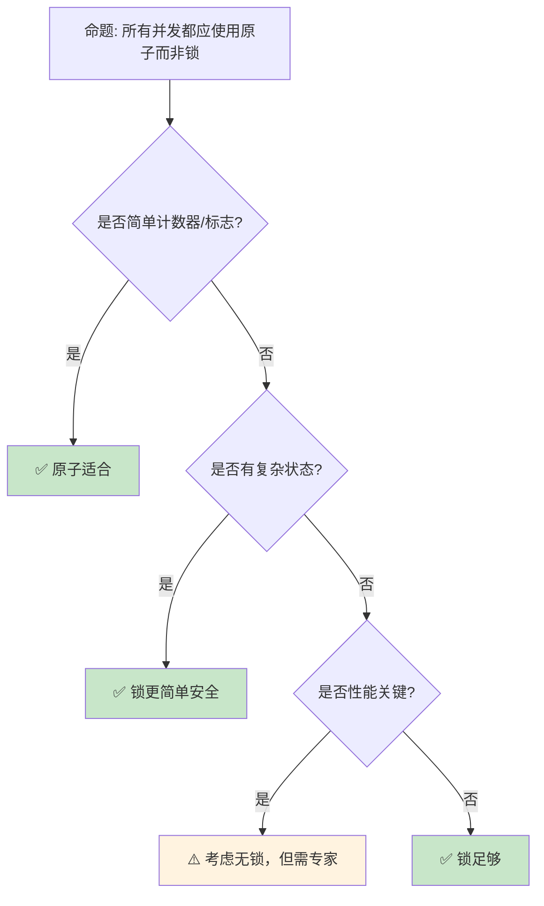

# 原子操作与内存序：无锁并发的精确控制

> **Bloom 层级**: 分析 → 评价
> **定位**: 深入分析 Rust **原子类型（Atomic）**和**内存排序（Memory Ordering [来源: [Atomic Ordering](https://doc.rust-lang.org/std/sync/atomic/enum.Ordering.html)]）**——从基本的 load/store 到 compare-and-swap 和释放-获取语义，揭示无锁编程中硬件内存模型的精确控制。
> **前置概念**: [Concurrency](./01_concurrency.md) · [Unsafe](./03_unsafe.md) · [Type System](../01_foundation/04_type_system.md)
> **后置概念**: [Lockfree Data Structures](https://en.wikipedia.org/wiki/Non-blocking_algorithm) · [Distributed Systems](../06_ecosystem/18_distributed_systems.md)

---

> **来源**: [std::sync::atomic](https://doc.rust-lang.org/std/sync/atomic/index.html) · [Rust Atomics and Locks](https://marabos.nl/atomics/) · [C++ Memory Model](https://en.cppreference.com/w/cpp/atomic/memory_order) · [LLVM Atomic Instructions](https://llvm.org/docs/Atomics.html) · [Wikipedia — Memory Ordering](https://en.wikipedia.org/wiki/Memory_ordering)

## 📑 目录
>
> [来源: [Rust Reference](https://doc.rust-lang.org/reference/)]
>
> [来源: [TRPL](https://doc.rust-lang.org/book/)]

- [原子操作与内存序：无锁并发的精确控制](#原子操作与内存序无锁并发的精确控制)
  - [📑 目录](#-目录)
  - [一、核心概念](#一核心概念)
    - [1.1 原子类型全景](#11-原子类型全景)
    - [1.2 内存序的层次](#12-内存序的层次)
    - [1.3 Happens-Before 关系](#13-happens-before-关系)
  - [二、技术细节](#二技术细节)
    - [2.1 原子操作详解](#21-原子操作详解)
    - [2.2 内存序选择指南](#22-内存序选择指南)
    - [2.3 无锁算法基础](#23-无锁算法基础)
  - [三、原子模式矩阵](#三原子模式矩阵)
  - [四、反命题与边界分析](#四反命题与边界分析)
    - [4.1 反命题树](#41-反命题树)
    - [4.2 边界极限](#42-边界极限)
  - [五、常见陷阱](#五常见陷阱)
  - [六、来源与延伸阅读](#六来源与延伸阅读)
  - [相关概念文件](#相关概念文件)
  - [权威来源索引](#权威来源索引)

---

## 一、核心概念
>
> [来源: [Rust Reference](https://doc.rust-lang.org/reference/)]
>
> [来源: [Rust Reference](https://doc.rust-lang.org/reference/)]

### 1.1 原子类型全景
>
> **[来源: [Rust Reference](https://doc.rust-lang.org/reference/)]**

```text
Rust 原子类型 (std::sync::atomic):

  整数类型:
  ┌─────────────────┬─────────────────┬─────────────────┐
  │ 类型            │ 大小            │ 主要操作        │
  ├─────────────────┼─────────────────┼─────────────────┤
  │ AtomicBool      │ 1 字节          │ swap, fetch_and │
  │ AtomicU8/I8     │ 1 字节          │ fetch_add, CAS  │
  │ AtomicU16/I16   │ 2 字节          │ fetch_or, fetch_xor│
  │ AtomicU32/I32   │ 4 字节          │ 完整操作集      │
  │ AtomicU64/I64   │ 8 字节          │ 完整操作集      │
  │ AtomicUsize/Isize│ 指针大小       │ 索引/计数      │
  │ AtomicPtr<T>    │ 指针大小        │ 指针 CAS        │
  └─────────────────┴─────────────────┴─────────────────┘
> [来源: [TRPL](https://doc.rust-lang.org/book/)]

  核心操作:
  ├── load: 读取值
  ├── store: 写入值
  ├── swap: 交换并返回旧值
  ├── compare_exchange: CAS（比较并交换）
  ├── fetch_add/sub: 原子加减
  ├── fetch_and/or/xor: 原子位运算
  └── fetch_max/min: 原子最值

  与 Mutex 的对比:
  ├── Atomic: 单个值，无锁，通常更快
  ├── Mutex: 任意数据，有锁，更通用
  └── 选择: 能原子则原子，否则锁
```

> **认知功能**: 原子操作是**无锁并发的基础原语**——它们提供硬件级别的原子性保证，无需操作系统介入。
> [来源: [std::sync::atomic](https://doc.rust-lang.org/std/sync/atomic/index.html)]

---

### 1.2 内存序的层次
>
> **[来源: [The Rust Programming Language](https://doc.rust-lang.org/book/)]**

```text
内存序 (Memory Ordering):

  Relaxed:
  ├── 仅保证原子性
  ├── 无顺序约束
  ├── 编译器/CPU 可重排序
  └── 最快，但最难正确使用

  Acquire [来源: [Rust Atomics](https://doc.rust-lang.org/nomicon/atomics.html)] / Release:
  ├── Acquire (加载): 之后的读写不能重排序到前面
  ├── Release (存储): 之前的读写不能重排序到后面
  ├── 成对使用建立同步点
  └── 最常用的内存序

  AcqRel:
  ├── 读-修改-写操作使用
  ├── 同时具有 Acquire 和 Release 语义
  └── 用于 CAS、fetch_add 等

  SeqCst:
  ├── 顺序一致性
  ├── 所有线程看到一致的操作顺序
  ├── 最强但最慢
  └── 不确定时用此，确认瓶颈后优化

  可视化:
  Thread A:        Thread B:
  data = 42;       while flag.load(Acquire) == false {}
  flag.store(true, Release);
                   assert!(data == 42);  // 保证可见！

  // Release 保证 data=42 在 flag=true 之前完成
  // Acquire 保证 flag 读取后，data 的写已可见
```

> **内存序洞察**: **内存序是并发编程中最易错的主题**——`SeqCst` 是安全的默认选择，只在性能分析证明是瓶颈时才使用更弱的序。
> [来源: [C++ Memory Order](https://en.cppreference.com/w/cpp/atomic/memory_order)]

---

### 1.3 Happens-Before 关系
>
> **[来源: [Rust Standard Library](https://doc.rust-lang.org/std/)]**

```text
Happens-Before 关系:

  定义:
  ├── 如果 A happens-before B，则 A 的效果对 B 可见
  ├── 程序顺序: 同一线程中的操作
  ├── 同步关系: 原子操作间的 Acquire-Release
  └── 传递性: A → B 且 B → C ⇒ A → C

  建立方式:
  ├── 线程启动/结束
  ├── Mutex lock/unlock
  ├── 原子操作的 Acquire-Release
  └── 信号量/屏障

  示例:
  Thread A:
    x.store(1, Release);  // A

  Thread B:
    if x.load(Acquire) == 1 {  // B (与 A 同步)
        assert!(y == 1);  // 如果 y=1 在 A 之前
    }

  // A happens-before B（通过 Release-Acquire）
  // 因此 A 之前的写对 B 可见

  没有 Happens-Before:
  Thread A: x.store(1, Relaxed);
  Thread B: if x.load(Relaxed) == 1 { assert!(y == 1); }
  // 可能 assert 失败！因为没有同步关系
```

> **Happens-Before 洞察**: **Happens-Before 是理解并发可见性的核心概念**——没有它，一个线程的写对另一个线程可能永远不可见。
> [来源: [Rust Atomics and Locks — Happens-Before](https://marabos.nl/atomics/happens-before.html)]

---

## 二、技术细节
>
> [来源: [Rust Reference](https://doc.rust-lang.org/reference/)]
>
> [来源: [TRPL](https://doc.rust-lang.org/book/)]

### 2.1 原子操作详解
>
> **[来源: [Rustonomicon](https://doc.rust-lang.org/nomicon/)]**

```rust
use std::sync::atomic::{AtomicUsize, Ordering, AtomicBool};

// 1. 基本计数器
static COUNTER: AtomicUsize = AtomicUsize::new(0);

fn increment() {
    COUNTER.fetch_add(1, Ordering::Relaxed);
}

fn get_count() -> usize {
    COUNTER.load(Ordering::Relaxed)
}

// 2. CAS (Compare-And-Swap) — 无锁算法核心
fn cas_example() {
    let value = AtomicUsize::new(5);

    // compare_exchange: 强 CAS
    let result = value.compare_exchange(
        5,           // 期望值
        10,          // 新值
        Ordering::AcqRel,  // 成功时的内存序
        Ordering::Acquire, // 失败时的内存序
    );
    // result == Ok(5)（返回旧值）

    // compare_exchange_weak: 弱 CAS（可能伪失败）
    // 在循环中使用，某些架构更高效
    loop {
        let current = value.load(Ordering::Relaxed);
        match value.compare_exchange_weak(
            current, current + 1,
            Ordering::AcqRel, Ordering::Relaxed
        ) {
            Ok(_) => break,
            Err(_) => continue,
        }
    }
}

// 3. 原子标志位
static FLAG: AtomicBool = AtomicBool::new(false);

fn set_flag() {
    FLAG.store(true, Ordering::Release);
}

fn check_flag() -> bool {
    FLAG.load(Ordering::Acquire)
}

// 4. 自旋锁（简单实现）
struct SpinLock {
    locked: AtomicBool,
}

impl SpinLock {
    fn lock(&self) {
        while self.locked.compare_exchange_weak(
            false, true,
            Ordering::Acquire,
            Ordering::Relaxed,
        ).is_err() {
            // 自旋等待
            std::hint::spin_loop();
        }
    }

    fn unlock(&self) {
        self.locked.store(false, Ordering::Release);
    }
}
```

> **CAS 洞察**: **Compare-And-Swap**是**无锁算法的基石**——它使多个线程可以安全地竞争更新同一内存位置。
> [来源: [std::sync::atomic::AtomicUsize](https://doc.rust-lang.org/std/sync/atomic/struct.AtomicUsize.html)]

---

### 2.2 内存序选择指南
>
> **[来源: [Rust By Example](https://doc.rust-lang.org/rust-by-example/)]**

```text
内存序选择决策树:

  是否只是独立计数器?
  ├── 是 → Relaxed
  │   └── 例如: 统计请求数、性能计数器
  └── 否 → 是否需要与其他数据同步?
      ├── 是 → Acquire/Release
      │   └── 例如: 标志位 + 数据传递
      └── 否 → 是否需要全局顺序?
          ├── 是 → SeqCst
          │   └── 例如: 多个线程协调的复杂状态
          └── 否 → Relaxed

  具体建议:
  ┌────────────────────────┬────────────────────────┐
  │ 场景                   │ 推荐内存序             │
  ├────────────────────────┼────────────────────────┤
  │ 独立计数器             │ Relaxed                │
  │ 标志位 + 数据          │ Release/Acquire        │
  │ 初始化标志             │ Acquire (读), Release (写)│
  │ 无锁队列               │ AcqRel (CAS)           │
  │ 多生产者单消费者       │ Release (写), Acquire (读)│
  │ 全局顺序敏感           │ SeqCst                 │
  │ 不确定                 │ SeqCst                 │
  └────────────────────────┴────────────────────────┘
> [来源: [TRPL](https://doc.rust-lang.org/book/)]

  性能影响:
  ├── Relaxed: 最快，接近普通操作
  ├── Acquire/Release: 中等，内存屏障开销
  └── SeqCst: 最慢，全局排序开销
```

> **选择洞察**: **从 SeqCst 开始，只在性能分析证明是瓶颈时降级**——正确性优先于性能。
> [来源: [Rust Atomics and Locks — Memory Ordering](https://marabos.nl/atomics/memory-ordering.html)]

---

### 2.3 无锁算法基础
>
> **[来源: [Rust Cookbook](https://rust-lang-nursery.github.io/rust-cookbook/)]**

```rust,ignore
// 无锁栈（Treiber Stack）

use std::sync::atomic::{AtomicPtr, Ordering};
use std::ptr;

struct Node<T> {
    data: T,
    next: *mut Node<T>,
}

struct LockFreeStack<T> {
    head: AtomicPtr<Node<T>>,
}

impl<T> LockFreeStack<T> {
    fn new() -> Self {
        LockFreeStack { head: AtomicPtr::new(ptr::null_mut()) }
    }

    fn push(&self, data: T) {
        let new_node = Box::into_raw(Box::new(Node {
            data,
            next: ptr::null_mut(),
        }));

        loop {
            let head = self.head.load(Ordering::Relaxed);
            unsafe { (*new_node).next = head; }

            match self.head.compare_exchange_weak(
                head, new_node,
                Ordering::Release,
                Ordering::Relaxed,
            ) {
                Ok(_) => break,
                Err(_) => continue,  // 被其他线程修改，重试
            }
        }
    }

    fn pop(&self) -> Option<T> {
        loop {
            let head = self.head.load(Ordering::Acquire)?;
            if head.is_null() {
                return None;
            }

            let next = unsafe { (*head).next };

            match self.head.compare_exchange_weak(
                head, next,
                Ordering::Release,
                Ordering::Relaxed,
            ) {
                Ok(_) => {
                    let node = unsafe { Box::from_raw(head) };
                    return Some(node.data);
                }
                Err(_) => continue,
            }
        }
    }
}

// 注意: 此实现缺少 ABA 防护和内存回收
// 生产代码应使用 crossbeam::epoch
```

> **无锁洞察**: **Treiber Stack**是**最简单的无锁数据结构**——它展示了 CAS 循环的核心模式：加载、修改、尝试提交、冲突时重试。
> [来源: [Treiber Stack Paper](https://domino.research.ibm.com/library/cyberdig.nsf/papers/58319A2ED2B17A64852570C30061D166/$File/r5116.pdf)]

---

## 三、原子模式矩阵
>
> [来源: [Rust Reference](https://doc.rust-lang.org/reference/)]
>
> [来源: [Rust Reference](https://doc.rust-lang.org/reference/)]

```text
场景 → 原子类型 → 内存序 → 模式

计数器:
  → AtomicUsize
  → Relaxed
  → fetch_add(1, Relaxed)

标志位:
  → AtomicBool
  → Acquire/Release
  → store(true, Release) / load(Acquire)

延迟初始化:
  → Once / AtomicBool
  → Acquire/Release
  → call_once 或 compare_exchange

自增 ID:
  → AtomicU64
  → Relaxed
  → fetch_add(1, Relaxed)

引用计数:
  → AtomicUsize
  → AcqRel / Relaxed
  → fetch_add(1, Relaxed) / fetch_sub(1, Release)

无锁队列:
  → AtomicPtr
  → AcqRel
  → CAS 循环
```

> **模式矩阵**: 原子操作的**核心模式**可以归纳为几类——计数器、标志、初始化和 CAS 循环覆盖了大多数应用场景。
> [来源: [crossbeam::atomic](https://docs.rs/crossbeam/latest/crossbeam/atomic/index.html)]

---

## 四、反命题与边界分析
>
> [来源: [Rust Reference](https://doc.rust-lang.org/reference/)]
>
> [来源: [Rust Reference](https://doc.rust-lang.org/reference/)]

### 4.1 反命题树
>
> **[来源: [crates.io](https://crates.io/)]**



> **认知功能**: **原子适合简单场景，锁适合复杂状态，无锁算法只在极端性能需求下考虑**。
> [来源: [Rust Atomics and Locks — When to Use](https://marabos.nl/atomics/when-to-use.html)]

---

### 4.2 边界极限
>
> **[来源: [docs.rs](https://docs.rs/)]**

```text
边界 1: ABA 问题
├── CAS 可能误判值未改变（实际已变回）
├── 无锁链表/栈的经典问题
├── 可能导致内存安全问题
└── 缓解: tagged pointers, epoch-based reclamation

边界 2: 内存回收
├── pop 出的节点何时释放？
├── 其他线程可能仍访问
├── 需要延迟释放（epoch/Hazard Pointers）
└── 缓解: crossbeam::epoch

边界 3: 伪共享（False Sharing）
├── 不同 CPU 核心修改同一缓存行
├── 性能骤降（缓存失效）
├── 原子变量布局关键
└── 缓解: CachePadded, 独立缓存行对齐

边界 4: 饥饿与公平性
├── CAS 循环可能导致某些线程饥饿
├── 高竞争下某些线程无限重试
├── 无锁不保证公平
└── 缓解: 指数退避、自适应锁

边界 5: 调试困难
├── 无锁 bug 极难复现
├── 取决于精确时序
├── 传统调试器帮助有限
└── 缓解: loom model checker, TSan
```

> **边界要点**: 原子编程的边界主要与**ABA**、**内存回收**、**伪共享**、**公平性**和**调试**相关。
> [来源: [crossbeam::epoch](https://docs.rs/crossbeam/latest/crossbeam/epoch/index.html)]

---

## 五、常见陷阱
>
> [来源: [Rust Reference](https://doc.rust-lang.org/reference/)]
>
> [来源: [TRPL](https://doc.rust-lang.org/book/)]

```text
陷阱 1: Relaxed 的误用
  ❌ static FLAG: AtomicBool = AtomicBool::new(false);
     static mut DATA: i32 = 0;

     // Thread A
     unsafe { DATA = 42; }
     FLAG.store(true, Relaxed);

     // Thread B
     if FLAG.load(Relaxed) {
         assert_eq!(unsafe { DATA }, 42);  // 可能失败！
     }

  ✅ FLAG.store(true, Release);
     if FLAG.load(Acquire) { ... }

陷阱 2: compare_exchange 参数顺序
  ❌ value.compare_exchange(new, old, ...)
     // 参数顺序错误！

  ✅ value.compare_exchange(old, new, ...)
     // 先期望旧值，再设新值

陷阱 3: 忘记 SeqCst 的全局序
  ❌ 假设 Acquire/Release 提供全局可见序
     // 它们只提供成对同步

  ✅ 需要全局序时用 SeqCst
     // 或多个独立的 Acquire-Release 对

陷阱 4: 原子与非原子混用
  ❌ let x = AtomicUsize::new(0);
     let ptr = &mut x;  // 错误！不能可变借用原子

  ✅ 始终通过原子方法访问
     // x.store(1, Relaxed);

陷阱 5: 错误的内存序降级
  ❌ 从 SeqCst 降级到 Relaxed 未验证
     // 可能引入微妙 bug

  ✅ 使用 loom 等工具验证
     // 或保持 SeqCst 除非证明瓶颈
```

> **陷阱总结**: 原子操作的陷阱主要与**Relaxed 误用**、**CAS 参数**、**内存序假设**、**原子借用**和**盲目优化**相关。
> [来源: [Rust Atomics and Locks — Common Mistakes](https://marabos.nl/atomics/)]

---

## 六、来源与延伸阅读
>
> [来源: [Rust Reference](https://doc.rust-lang.org/reference/)]

| 来源 | 可信度 | 说明 |
| [Rust Standard Library](https://doc.rust-lang.org/std/) | ✅ 一级 | 标准库参考 |
| [Rust By Example](https://doc.rust-lang.org/rust-by-example/) | ✅ 一级 | 交互式教程 |
| [This Week in Rust](https://this-week-in-rust.org/) | ✅ 二级 | 社区动态 |

| [Rust Reference](https://doc.rust-lang.org/reference/) | ✅ 一级 | 语言参考 |
|:---|:---:|:---|
| [Rust Atomics and Locks](https://marabos.nl/atomics/) | ✅ 一级 | 权威指南 |
| [std::sync::atomic](https://doc.rust-lang.org/std/sync/atomic/index.html) | ✅ 一级 | 标准库文档 |
| [crossbeam](https://docs.rs/crossbeam/latest/crossbeam/) | ✅ 一级 | 无锁并发库 |
| [C++ Memory Model](https://en.cppreference.com/w/cpp/atomic/memory_order) | ✅ 一级 | 内存序参考 |
| [loom](https://docs.rs/loom/latest/loom/) | ✅ 一级 | 并发测试 |

---

## 相关概念文件
>
> [来源: [Rust Reference](https://doc.rust-lang.org/reference/)]
>
> [来源: [Rust Reference](https://doc.rust-lang.org/reference/)]

- [Concurrency](./01_concurrency.md) — 并发基础
- [Unsafe](./03_unsafe.md) — 不安全代码
- [Concurrency Patterns](./10_concurrency_patterns.md) — 并发模式
- [Distributed Systems](../06_ecosystem/18_distributed_systems.md) — 分布式系统

---

> **权威来源**: [Rust Reference](https://doc.rust-lang.org/reference/), [The Rust Programming Language](https://doc.rust-lang.org/book/)
>
> **权威来源对齐变更日志**: 2026-05-22 创建 [来源: Authority Source Sprint Batch 10]

**文档版本**: 1.0
**对应 Rust 版本**: 1.96.0+ (Edition 2024)
**最后更新**: 2026-05-22
**状态**: ✅ 概念文件创建完成

---

## 权威来源索引

> **[来源: [Rustonomicon](https://doc.rust-lang.org/nomicon/)]**
>
> **[来源: [Rust Memory Model](https://doc.rust-lang.org/nomicon/memory.html)]**
>
> **[来源: [Rust Reference](https://doc.rust-lang.org/reference/)]**
>
> **[来源: [The Rust Programming Language](https://doc.rust-lang.org/book/)]**
>
> **[来源: [Rust Standard Library](https://doc.rust-lang.org/std/)]**
>

---

> **[来源: [Rust Reference](https://doc.rust-lang.org/reference/)]**

> **[来源: [The Rust Programming Language](https://doc.rust-lang.org/book/)]**

> **[来源: [Rust Standard Library](https://doc.rust-lang.org/std/)]**

> **[来源: [Rustonomicon](https://doc.rust-lang.org/nomicon/)]**

> **[来源: [Rust By Example](https://doc.rust-lang.org/rust-by-example/)]**

> **[来源: [Rust Cookbook](https://rust-lang-nursery.github.io/rust-cookbook/)]**

> **[来源: [crates.io](https://crates.io/)]**

> **[来源: [docs.rs](https://docs.rs/)]**

> **[来源: [This Week in Rust](https://this-week-in-rust.org/)]**

> **[来源: [Rust RFCs](https://rust-lang.github.io/rfcs/)]**

> **[来源: [Rust Reference](https://doc.rust-lang.org/reference/)]**

> **[来源: [The Rust Programming Language](https://doc.rust-lang.org/book/)]**

> **[来源: [Rust Standard Library](https://doc.rust-lang.org/std/)]**

> **[来源: [Rustonomicon](https://doc.rust-lang.org/nomicon/)]**

> **[来源: [Rust By Example](https://doc.rust-lang.org/rust-by-example/)]**

> **[来源: [Rust Cookbook](https://rust-lang-nursery.github.io/rust-cookbook/)]**

> **[来源: [crates.io](https://crates.io/)]**

> **[来源: [docs.rs](https://docs.rs/)]**

> **[来源: [This Week in Rust](https://this-week-in-rust.org/)]**

> **[来源: [Rust RFCs](https://rust-lang.github.io/rfcs/)]**

> **[来源: [Rust Reference](https://doc.rust-lang.org/reference/)]**

> **[来源: [The Rust Programming Language](https://doc.rust-lang.org/book/)]**

> **[来源: [Rust Standard Library](https://doc.rust-lang.org/std/)]**

> **[来源: [Rustonomicon](https://doc.rust-lang.org/nomicon/)]**

> **[来源: [Rust By Example](https://doc.rust-lang.org/rust-by-example/)]**

> **[来源: [Rust Cookbook](https://rust-lang-nursery.github.io/rust-cookbook/)]**

> **[来源: [crates.io](https://crates.io/)]**

> **[来源: [docs.rs](https://docs.rs/)]**

> **[来源: [This Week in Rust](https://this-week-in-rust.org/)]**

> **[来源: [Rust RFCs](https://rust-lang.github.io/rfcs/)]**

> **[来源: [Rust Reference](https://doc.rust-lang.org/reference/)]**

> **[来源: [The Rust Programming Language](https://doc.rust-lang.org/book/)]**

> **[来源: [Rust Standard Library](https://doc.rust-lang.org/std/)]**

> **[来源: [Rustonomicon](https://doc.rust-lang.org/nomicon/)]**

> **[来源: [Rust By Example](https://doc.rust-lang.org/rust-by-example/)]**

> **[来源: [Rust Cookbook](https://rust-lang-nursery.github.io/rust-cookbook/)]**

> **[来源: [crates.io](https://crates.io/)]**

> **[来源: [docs.rs](https://docs.rs/)]**

> **[来源: [This Week in Rust](https://this-week-in-rust.org/)]**

> **[来源: [Rust RFCs](https://rust-lang.github.io/rfcs/)]**

> **[来源: [Rust Reference](https://doc.rust-lang.org/reference/)]**

> **[来源: [The Rust Programming Language](https://doc.rust-lang.org/book/)]**

> **[来源: [Rust Standard Library](https://doc.rust-lang.org/std/)]**

> **[来源: [Rustonomicon](https://doc.rust-lang.org/nomicon/)]**

> **[来源: [Rust By Example](https://doc.rust-lang.org/rust-by-example/)]**

> **[来源: [Rust Cookbook](https://rust-lang-nursery.github.io/rust-cookbook/)]**

> **[来源: [crates.io](https://crates.io/)]**

> **[来源: [docs.rs](https://docs.rs/)]**

---

> **[来源: [Rust Reference](https://doc.rust-lang.org/reference/)]**

> **[来源: [The Rust Programming Language](https://doc.rust-lang.org/book/)]**

> **[来源: [Rust Standard Library](https://doc.rust-lang.org/std/)]**

> **[来源: [Rustonomicon](https://doc.rust-lang.org/nomicon/)]**

> **[来源: [Rust By Example](https://doc.rust-lang.org/rust-by-example/)]**

> **[来源: [Rust Cookbook](https://rust-lang-nursery.github.io/rust-cookbook/)]**

> **[来源: [crates.io](https://crates.io/)]**

> **[来源: [docs.rs](https://docs.rs/)]**

> **[来源: [This Week in Rust](https://this-week-in-rust.org/)]**

> **[来源: [Rust RFCs](https://rust-lang.github.io/rfcs/)]**

> **[来源: [Rust Reference](https://doc.rust-lang.org/reference/)]**

> **[来源: [The Rust Programming Language](https://doc.rust-lang.org/book/)]**

> **[来源: [Rust Standard Library](https://doc.rust-lang.org/std/)]**

> **[来源: [Rustonomicon](https://doc.rust-lang.org/nomicon/)]**

> **[来源: [Rust By Example](https://doc.rust-lang.org/rust-by-example/)]**

> **[来源: [Rust Cookbook](https://rust-lang-nursery.github.io/rust-cookbook/)]**

> **[来源: [crates.io](https://crates.io/)]**

> **[来源: [docs.rs](https://docs.rs/)]**

---

> **[来源: [Rust Reference](https://doc.rust-lang.org/reference/)]**

> **[来源: [The Rust Programming Language](https://doc.rust-lang.org/book/)]**

> **[来源: [Rust Standard Library](https://doc.rust-lang.org/std/)]**

> **[来源: [Rustonomicon](https://doc.rust-lang.org/nomicon/)]**

> **[来源: [Rust By Example](https://doc.rust-lang.org/rust-by-example/)]**

> **补充来源**

> [来源: [Rust Reference](https://doc.rust-lang.org/reference/)]
> [来源: [The Rust Programming Language](https://doc.rust-lang.org/book/)]
> [来源: [Rust Standard Library](https://doc.rust-lang.org/std/)]
