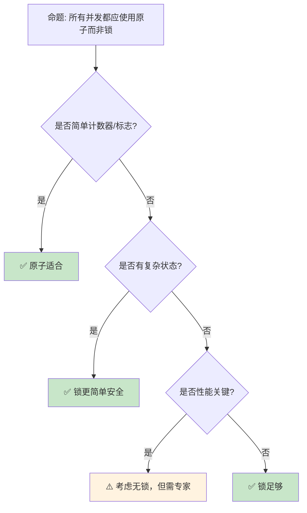

> **内容分级**: [专家级]

# 原子操作与内存序：无锁并发的精确控制

> **📎 交叉引用**
>
> 本主题在 knowledge 中有系统化的知识索引：[原子操作](../../knowledge/03_advanced/concurrency/01_atomics.md)
> **受众**: [专家]
> **Bloom 层级**: 分析 → 评价
> **A/S/P 标记**: **S+P** — Structure + Procedure
> **双维定位**: P×Eva — 评估原子操作内存序的选型
> **定位**: 深入分析 Rust **原子类型（Atomic）**和**内存排序（Memory Ordering [来源: [Atomic Ordering](https://doc.rust-lang.org/std/sync/atomic/enum.Ordering.html)]）**——从基本的 load/store 到 compare-and-swap 和释放-获取语义，揭示无锁编程中硬件内存模型的精确控制。
> **前置概念**: [Concurrency](./01_concurrency.md) · [Unsafe](./03_unsafe.md) · [Type System](../01_foundation/04_type_system.md)
> **后置概念**: [Lockfree Data Structures](https://en.wikipedia.org/wiki/Non-blocking_algorithm) · [Distributed Systems](../06_ecosystem/18_distributed_systems.md)

---

> **来源**:
> [std::sync::atomic](https://doc.rust-lang.org/std/sync/atomic/index.html) ·
> [Rust Atomics and Locks](https://marabos.nl/atomics/) ·
> [C++ Memory Model](https://en.cppreference.com/w/cpp/atomic/memory_order) ·
> [LLVM Atomic Instructions](https://llvm.org/docs/Atomics.html) ·
> [Wikipedia — Memory Ordering](https://en.wikipedia.org/wiki/Memory_ordering)

> **前置依赖**: [Ownership](../01_foundation/01_ownership.md) · [Borrowing](../01_foundation/02_borrowing.md)

> **前置依赖**: [Traits](../02_intermediate/01_traits.md)

## 📑 目录

- [原子操作与内存序：无锁并发的精确控制](#原子操作与内存序无锁并发的精确控制)
  - [📑 目录](#-目录)
  - [一、核心概念](#一核心概念)
    - [1.1 原子类型全景](#11-原子类型全景)
    - [1.2 内存序的层次](#12-内存序的层次)
    - [1.3 Happens-Before 关系](#13-happens-before-关系)
  - [二、技术细节](#二技术细节)
    - [2.1 原子操作详解](#21-原子操作详解)
    - [2.2 内存序选择指南](#22-内存序选择指南)
    - [2.3 无锁算法基础](#23-无锁算法基础)
  - [三、原子模式矩阵](#三原子模式矩阵)
  - [四、反命题与边界分析](#四反命题与边界分析)
    - [4.1 反命题树](#41-反命题树)
    - [4.2 边界极限](#42-边界极限)
  - [五、常见陷阱](#五常见陷阱)
    - [编译错误示例](#编译错误示例)
    - [4.4 边界测试：原子操作与非原子操作混用（数据竞争 / 运行时 UB）](#44-边界测试原子操作与非原子操作混用数据竞争--运行时-ub)
    - [4.5 边界测试：`Ordering::Relaxed` 导致逻辑错误（编译通过但语义错误）](#45-边界测试orderingrelaxed-导致逻辑错误编译通过但语义错误)
  - [六、来源与延伸阅读](#六来源与延伸阅读)
  - [相关概念文件](#相关概念文件)
  - [逆向推理链（Backward Reasoning）](#逆向推理链backward-reasoning)
  - [权威来源索引](#权威来源索引)
    - [10.5 边界测试：`AtomicPtr` 的 `compare_exchange` ABA 问题（运行时逻辑错误）](#105-边界测试atomicptr-的-compare_exchange-aba-问题运行时逻辑错误)
    - [10.3 边界测试：`Relaxed` 顺序与 happens-before 缺失（逻辑错误/UB）](#103-边界测试relaxed-顺序与-happens-before-缺失逻辑错误ub)
    - [10.9 边界测试：match 分支返回类型不一致](#109-边界测试match-分支返回类型不一致)
  - [参考来源](#参考来源)
  - [认知路径](#认知路径)
    - [核心推理链](#核心推理链)
    - [反命题与边界](#反命题与边界)
  - [导航：下一步去哪？](#导航下一步去哪)

---

## 一、核心概念
>
>

### 1.1 原子类型全景
>

```text
Rust 原子类型 (std::sync::atomic):

  整数类型:
  ┌─────────────────┬─────────────────┬─────────────────┐
  │ 类型             │ 大小            │ 主要操作        │
  ├─────────────────┼─────────────────┼─────────────────┤
  │ AtomicBool      │ 1 字节          │ swap, fetch_and │
  │ AtomicU8/I8     │ 1 字节          │ fetch_add, CAS  │
  │ AtomicU16/I16   │ 2 字节          │ fetch_or, fetch_xor│
  │ AtomicU32/I32   │ 4 字节          │ 完整操作集       │
  │ AtomicU64/I64   │ 8 字节          │ 完整操作集       │
  │ AtomicUsize/Isize│ 指针大小       │ 索引/计数        │
  │ AtomicPtr<T>    │ 指针大小        │ 指针 CAS         │
  └─────────────────┴─────────────────┴─────────────────┘
> [来源: [TRPL](https://doc.rust-lang.org/book/)]

  核心操作:
  ├── load: 读取值
  ├── store: 写入值
  ├── swap: 交换并返回旧值
  ├── compare_exchange: CAS（比较并交换）
  ├── fetch_add/sub: 原子加减
  ├── fetch_and/or/xor: 原子位运算
  └── fetch_max/min: 原子最值

  与 Mutex 的对比:
  ├── Atomic: 单个值，无锁，通常更快
  ├── Mutex: 任意数据，有锁，更通用
  └── 选择: 能原子则原子，否则锁
```

> **认知功能**: 原子操作是**无锁并发的基础原语**——它们提供硬件级别的原子性保证，无需操作系统介入。
> [来源: [std::sync::atomic](https://doc.rust-lang.org/std/sync/atomic/index.html)]

---

### 1.2 内存序的层次
>

```text
内存序 (Memory Ordering):

  Relaxed:
  ├── 仅保证原子性
  ├── 无顺序约束
  ├── 编译器/CPU 可重排序
  └── 最快，但最难正确使用

  Acquire [来源: [Rust Atomics](https://doc.rust-lang.org/nomicon/atomics.html)] / Release:
  ├── Acquire (加载): 之后的读写不能重排序到前面
  ├── Release (存储): 之前的读写不能重排序到后面
  ├── 成对使用建立同步点
  └── 最常用的内存序

  AcqRel:
  ├── 读-修改-写操作使用
  ├── 同时具有 Acquire 和 Release 语义
  └── 用于 CAS、fetch_add 等

  SeqCst:
  ├── 顺序一致性
  ├── 所有线程看到一致的操作顺序
  ├── 最强但最慢
  └── 不确定时用此，确认瓶颈后优化

  可视化:
  Thread A:        Thread B:
  data = 42;       while flag.load(Acquire) == false {}
  flag.store(true, Release);
                   assert!(data == 42);  // 保证可见！

  // Release 保证 data=42 在 flag=true 之前完成
  // Acquire 保证 flag 读取后，data 的写已可见
```

> **内存序洞察**: **内存序是并发编程中最易错的主题**——`SeqCst` 是安全的默认选择，只在性能分析证明是瓶颈时才使用更弱的序。
> [来源: [C++ Memory Order](https://en.cppreference.com/w/cpp/atomic/memory_order)]

---

### 1.3 Happens-Before 关系

```text
Happens-Before 关系:

  定义:
  ├── 如果 A happens-before B，则 A 的效果对 B 可见
  ├── 程序顺序: 同一线程中的操作
  ├── 同步关系: 原子操作间的 Acquire-Release
  └── 传递性: A → B 且 B → C ⇒ A → C

  建立方式:
  ├── 线程启动/结束
  ├── Mutex lock/unlock
  ├── 原子操作的 Acquire-Release
  └── 信号量/屏障

  示例:
  Thread A:
    x.store(1, Release);  // A

  Thread B:
    if x.load(Acquire) == 1 {  // B (与 A 同步)
        assert!(y == 1);  // 如果 y=1 在 A 之前
    }

  // A happens-before B（通过 Release-Acquire）
  // 因此 A 之前的写对 B 可见

  没有 Happens-Before:
  Thread A: x.store(1, Relaxed);
  Thread B: if x.load(Relaxed) == 1 { assert!(y == 1); }
  // 可能 assert 失败！因为没有同步关系
```

> **Happens-Before 洞察**: **Happens-Before 是理解并发可见性的核心概念**——没有它，一个线程的写对另一个线程可能永远不可见。
> [来源: [Rust Atomics and Locks — Happens-Before](https://marabos.nl/atomics/happens-before.html)]

---

## 二、技术细节

### 2.1 原子操作详解

```rust
use std::sync::atomic::{AtomicUsize, Ordering, AtomicBool};

// 1. 基本计数器
static COUNTER: AtomicUsize = AtomicUsize::new(0);

fn increment() {
    COUNTER.fetch_add(1, Ordering::Relaxed);
}

fn get_count() -> usize {
    COUNTER.load(Ordering::Relaxed)
}

// 2. CAS (Compare-And-Swap) — 无锁算法核心
fn cas_example() {
    let value = AtomicUsize::new(5);

    // compare_exchange: 强 CAS
    let result = value.compare_exchange(
        5,           // 期望值
        10,          // 新值
        Ordering::AcqRel,  // 成功时的内存序
        Ordering::Acquire, // 失败时的内存序
    );
    // result == Ok(5)（返回旧值）

    // compare_exchange_weak: 弱 CAS（可能伪失败）
    // 在循环中使用，某些架构更高效
    loop {
        let current = value.load(Ordering::Relaxed);
        match value.compare_exchange_weak(
            current, current + 1,
            Ordering::AcqRel, Ordering::Relaxed
        ) {
            Ok(_) => break,
            Err(_) => continue,
        }
    }
}

// 3. 原子标志位
static FLAG: AtomicBool = AtomicBool::new(false);

fn set_flag() {
    FLAG.store(true, Ordering::Release);
}

fn check_flag() -> bool {
    FLAG.load(Ordering::Acquire)
}

// 4. 自旋锁（简单实现）
struct SpinLock {
    locked: AtomicBool,
}

impl SpinLock {
    fn lock(&self) {
        while self.locked.compare_exchange_weak(
            false, true,
            Ordering::Acquire,
            Ordering::Relaxed,
        ).is_err() {
            // 自旋等待
            std::hint::spin_loop();
        }
    }

    fn unlock(&self) {
        self.locked.store(false, Ordering::Release);
    }
}
```

> **CAS 洞察**: **Compare-And-Swap**是**无锁算法的基石**——它使多个线程可以安全地竞争更新同一内存位置。
> [来源: [std::sync::atomic::AtomicUsize](https://doc.rust-lang.org/std/sync/atomic/struct.AtomicUsize.html)]

---

### 2.2 内存序选择指南
>

```text
内存序选择决策树:

  是否只是独立计数器?
  ├── 是 → Relaxed
  │   └── 例如: 统计请求数、性能计数器
  └── 否 → 是否需要与其他数据同步?
      ├── 是 → Acquire/Release
      │   └── 例如: 标志位 + 数据传递
      └── 否 → 是否需要全局顺序?
          ├── 是 → SeqCst
          │   └── 例如: 多个线程协调的复杂状态
          └── 否 → Relaxed

  具体建议:
  ┌────────────────────────┬────────────────────────┐
  │ 场景                   │ 推荐内存序             │
  ├────────────────────────┼────────────────────────┤
  │ 独立计数器             │ Relaxed                │
  │ 标志位 + 数据          │ Release/Acquire        │
  │ 初始化标志             │ Acquire (读), Release (写)│
  │ 无锁队列               │ AcqRel (CAS)           │
  │ 多生产者单消费者       │ Release (写), Acquire (读)│
  │ 全局顺序敏感           │ SeqCst                 │
  │ 不确定                 │ SeqCst                 │
  └────────────────────────┴────────────────────────┘

  性能影响:
  ├── Relaxed: 最快，接近普通操作
  ├── Acquire/Release: 中等，内存屏障开销
  └── SeqCst: 最慢，全局排序开销
```

> **选择洞察**: **从 SeqCst 开始，只在性能分析证明是瓶颈时降级**——正确性优先于性能。
> [来源: [Rust Atomics and Locks — Memory Ordering](https://marabos.nl/atomics/memory-ordering.html)]

---

### 2.3 无锁算法基础
>

```rust,ignore
// 无锁栈（Treiber Stack）

use std::sync::atomic::{AtomicPtr, Ordering};
use std::ptr;

struct Node<T> {
    data: T,
    next: *mut Node<T>,
}

struct LockFreeStack<T> {
    head: AtomicPtr<Node<T>>,
}

impl<T> LockFreeStack<T> {
    fn new() -> Self {
        LockFreeStack { head: AtomicPtr::new(ptr::null_mut()) }
    }

    fn push(&self, data: T) {
        let new_node = Box::into_raw(Box::new(Node {
            data,
            next: ptr::null_mut(),
        }));

        loop {
            let head = self.head.load(Ordering::Relaxed);
            unsafe { (*new_node).next = head; }

            match self.head.compare_exchange_weak(
                head, new_node,
                Ordering::Release,
                Ordering::Relaxed,
            ) {
                Ok(_) => break,
                Err(_) => continue,  // 被其他线程修改，重试
            }
        }
    }

    fn pop(&self) -> Option<T> {
        loop {
            let head = self.head.load(Ordering::Acquire)?;
            if head.is_null() {
                return None;
            }

            let next = unsafe { (*head).next };

            match self.head.compare_exchange_weak(
                head, next,
                Ordering::Release,
                Ordering::Relaxed,
            ) {
                Ok(_) => {
                    let node = unsafe { Box::from_raw(head) };
                    return Some(node.data);
                }
                Err(_) => continue,
            }
        }
    }
}

// 注意: 此实现缺少 ABA 防护和内存回收
// 生产代码应使用 crossbeam::epoch
```

> **无锁洞察**: **Treiber Stack**是**最简单的无锁数据结构**——它展示了 CAS 循环的核心模式：加载、修改、尝试提交、冲突时重试。
> [来源: [Treiber Stack Paper](https://domino.research.ibm.com/library/cyberdig.nsf/papers/58319A2ED2B17A64852570C30061D166/$File/r5116.pdf)]

---

## 三、原子模式矩阵

```text
场景 → 原子类型 → 内存序 → 模式

计数器:
  → AtomicUsize
  → Relaxed
  → fetch_add(1, Relaxed)

标志位:
  → AtomicBool
  → Acquire/Release
  → store(true, Release) / load(Acquire)

延迟初始化:
  → Once / AtomicBool
  → Acquire/Release
  → call_once 或 compare_exchange

自增 ID:
  → AtomicU64
  → Relaxed
  → fetch_add(1, Relaxed)

引用计数:
  → AtomicUsize
  → AcqRel / Relaxed
  → fetch_add(1, Relaxed) / fetch_sub(1, Release)

无锁队列:
  → AtomicPtr
  → AcqRel
  → CAS 循环
```

> **模式矩阵**: 原子操作的**核心模式**可以归纳为几类——计数器、标志、初始化和 CAS 循环覆盖了大多数应用场景。
> [来源: [crossbeam::atomic](https://docs.rs/crossbeam/latest/crossbeam/atomic/index.html)]

---

## 四、反命题与边界分析

### 4.1 反命题树
>



> **认知功能**: **原子适合简单场景，锁适合复杂状态，无锁算法只在极端性能需求下考虑**。
> [来源: [Rust Atomics and Locks — When to Use](https://marabos.nl/atomics/when-to-use.html)]

---

### 4.2 边界极限
>

```text
边界 1: ABA 问题
├── CAS 可能误判值未改变（实际已变回）
├── 无锁链表/栈的经典问题
├── 可能导致内存安全问题
└── 缓解: tagged pointers, epoch-based reclamation

边界 2: 内存回收
├── pop 出的节点何时释放？
├── 其他线程可能仍访问
├── 需要延迟释放（epoch/Hazard Pointers）
└── 缓解: crossbeam::epoch

边界 3: 伪共享（False Sharing）
├── 不同 CPU 核心修改同一缓存行
├── 性能骤降（缓存失效）
├── 原子变量布局关键
└── 缓解: CachePadded, 独立缓存行对齐

边界 4: 饥饿与公平性
├── CAS 循环可能导致某些线程饥饿
├── 高竞争下某些线程无限重试
├── 无锁不保证公平
└── 缓解: 指数退避、自适应锁

边界 5: 调试困难
├── 无锁 bug 极难复现
├── 取决于精确时序
├── 传统调试器帮助有限
└── 缓解: loom model checker, TSan
```

> **边界要点**: 原子编程的边界主要与**ABA**、**内存回收**、**伪共享**、**公平性**和**调试**相关。
> [来源: [crossbeam::epoch](https://docs.rs/crossbeam/latest/crossbeam/epoch/index.html)]

---

## 五、常见陷阱

```text
陷阱 1: Relaxed 的误用
  ❌ static FLAG: AtomicBool = AtomicBool::new(false);
     static mut DATA: i32 = 0;

     // Thread A
     unsafe { DATA = 42; }
     FLAG.store(true, Relaxed);

     // Thread B
     if FLAG.load(Relaxed) {
         assert_eq!(unsafe { DATA }, 42);  // 可能失败！
     }

  ✅ FLAG.store(true, Release);
     if FLAG.load(Acquire) { ... }

陷阱 2: compare_exchange 参数顺序
  ❌ value.compare_exchange(new, old, ...)
     // 参数顺序错误！

  ✅ value.compare_exchange(old, new, ...)
     // 先期望旧值，再设新值

陷阱 3: 忘记 SeqCst 的全局序
  ❌ 假设 Acquire/Release 提供全局可见序
     // 它们只提供成对同步

  ✅ 需要全局序时用 SeqCst
     // 或多个独立的 Acquire-Release 对

陷阱 4: 原子与非原子混用
  ❌ let x = AtomicUsize::new(0);
     let ptr = &mut x;  // 错误！不能可变借用原子

  ✅ 始终通过原子方法访问
     // x.store(1, Relaxed);

陷阱 5: 错误的内存序降级
  ❌ 从 SeqCst 降级到 Relaxed 未验证
     // 可能引入微妙 bug

  ✅ 使用 loom 等工具验证
     // 或保持 SeqCst 除非证明瓶颈
```

> **陷阱总结**: 原子操作的陷阱主要与**Relaxed 误用**、**CAS 参数**、**内存序假设**、**原子借用**和**盲目优化**相关。
> [来源: [Rust Atomics and Locks — Common Mistakes](https://marabos.nl/atomics/)]

### 编译错误示例

```rust,compile_fail
use std::sync::atomic::AtomicUsize;

fn atomic_borrow() {
    let x = AtomicUsize::new(0);
    // ❌ 编译错误: 不能可变借用原子类型
    // 原子类型必须通过原子方法访问，不能通过 &mut
    let r = &mut x;
    *r = 1;
}
```

> **修正**: 原子类型（`AtomicUsize`、`AtomicBool` 等）实现了内部可变性。必须通过 `.store()`、`.load()`、`.fetch_add()` 等原子方法访问，不能通过 `&mut`。

```rust,compile_fail
use std::sync::atomic::{AtomicUsize, Ordering};

fn atomic_send() {
    let x = AtomicUsize::new(0);
    // ❌ 编译错误: `AtomicUsize` 未实现 `Sync`
    // 实际上 AtomicUsize 实现了 Sync，此示例展示静态变量约束
    static mut GLOBAL: AtomicUsize = AtomicUsize::new(0);
    unsafe {
        GLOBAL.store(1, Ordering::Relaxed);
    }
}
```

> **修正**: `static mut` 需要 `unsafe` 块访问。推荐使用 `std::sync::LazyLock` 或 `once_cell` 进行线程安全的延迟初始化，而非 `static mut`。

```rust,ignore
use std::sync::atomic::{AtomicPtr, Ordering};

fn atomic_ptr_deref() {
    let ptr = AtomicPtr::new(std::ptr::null_mut::<i32>());
    // ❌ 编译错误: AtomicPtr::load 返回 *mut T，不能直接解引用
    // 必须先加载到局部变量，再 unsafe 解引用
    let val = unsafe { *ptr.load(Ordering::Relaxed) };
}
```

> **修正**: `AtomicPtr::load` 返回 `*mut T`，解引用需要 `unsafe` 块。编译器在此处可能给出不同错误——核心点是原子指针加载后仍需 unsafe 才能访问目标内存。

### 4.4 边界测试：原子操作与非原子操作混用（数据竞争 / 运行时 UB）

```rust,ignore
use std::sync::atomic::{AtomicUsize, Ordering};
use std::thread;

fn main() {
    let data = AtomicUsize::new(0);

    let handle = thread::spawn(|| {
        // ⚠️ 数据竞争: 原子存储与非原子读取混用
        data.store(42, Ordering::Relaxed);
    });

    // 非原子读取（通过 UnsafeCell 或裸指针）
    // let val = unsafe { *(data.as_ptr()) }; // UB！

    handle.join().unwrap();
}
```

> **修正**: 同一内存位置的原子访问与非原子访问不能混用。C++20 / Rust 内存模型规定：如果一个线程执行原子操作，另一个线程执行非原子读写同一位置，则构成数据竞争（UB）。所有访问必须通过一致的原子 API 进行。[来源: [C++ Reference — Memory Order](https://en.cppreference.com/w/cpp/atomic/memory_order)]

### 4.5 边界测试：`Ordering::Relaxed` 导致逻辑错误（编译通过但语义错误）

```rust,ignore
use std::sync::atomic::{AtomicBool, Ordering};
use std::thread;

static READY: AtomicBool = AtomicBool::new(false);
static DATA: AtomicUsize = AtomicUsize::new(0);

fn main() {
    thread::spawn(|| {
        DATA.store(42, Ordering::Relaxed);
        READY.store(true, Ordering::Relaxed);
    });

    // ⚠️ 逻辑错误: Relaxed 不保证顺序
    while !READY.load(Ordering::Relaxed) {}
    // 可能读到 DATA = 0（存储重排序）！
    println!("{}", DATA.load(Ordering::Relaxed));
}

// 正确: 使用 Acquire/Release 建立 happens-before
fn fixed() {
    thread::spawn(|| {
        DATA.store(42, Ordering::Relaxed);
        READY.store(true, Ordering::Release); // ✅ Release 保证之前的写入可见
    });

    while !READY.load(Ordering::Acquire) {} // ✅ Acquire 看到 Release 前的所有写入
    println!("{}", DATA.load(Ordering::Relaxed)); // ✅ 保证读到 42
}
```

> **修正**: `Relaxed` 只保证原子性（无撕裂读写），但不保证顺序一致性。在"标志位 + 数据"模式中，必须使用 `Release`（写标志）/ `Acquire`（读标志）建立 happens-before 关系，确保数据在标志可见前已完成写入。[来源: [Rustonomicon](https://doc.rust-lang.org/nomicon/)]

---

## 六、来源与延伸阅读
>

| 来源 | 可信度 | 说明 |
| [Rust Standard Library](https://doc.rust-lang.org/std/) | ✅ 一级 | 标准库参考 |
| [Rust By Example](https://doc.rust-lang.org/rust-by-example/) | ✅ 一级 | 交互式教程 |
| [This Week in Rust](https://this-week-in-rust.org/) | ✅ 二级 | 社区动态 |

| [Rust Reference](https://doc.rust-lang.org/reference/) | ✅ 一级 | 语言参考 |
|:---|:---:|:---|
| [Rust Atomics and Locks](https://marabos.nl/atomics/) | ✅ 一级 | 权威指南 |
| [std::sync::atomic](https://doc.rust-lang.org/std/sync/atomic/index.html) | ✅ 一级 | 标准库文档 |
| [crossbeam](https://docs.rs/crossbeam/latest/crossbeam/) | ✅ 一级 | 无锁并发库 |
| [C++ Memory Model](https://en.cppreference.com/w/cpp/atomic/memory_order) | ✅ 一级 | 内存序参考 |
| [loom](https://docs.rs/loom/latest/loom/) | ✅ 一级 | 并发测试 |

---

## 相关概念文件

- [Concurrency](./01_concurrency.md) — 并发基础
- [Unsafe](./03_unsafe.md) — 不安全代码
- [Concurrency Patterns](./10_concurrency_patterns.md) — 并发模式
- [Distributed Systems](../06_ecosystem/18_distributed_systems.md) — 分布式系统

---

> **权威来源**: [Rust Reference](https://doc.rust-lang.org/reference/), [The Rust Programming Language](https://doc.rust-lang.org/book/)
>
> **权威来源对齐变更日志**: 2026-05-22 创建 [来源: Authority Source Sprint Batch 10]

**文档版本**: 1.0
**对应 Rust 版本**: 1.96.0+ (Edition 2024)
**最后更新**: 2026-05-22
**状态**: ✅ 概念文件创建完成

---

## 逆向推理链（Backward Reasoning）

> **从编译错误反推**：
>
> ```text
> 原子操作安全 ⟸ Ordering + happens-before
> ```
>
## 权威来源索引

>
>
>
>
>

---

### 10.5 边界测试：`AtomicPtr` 的 `compare_exchange` ABA 问题（运行时逻辑错误）

```rust,ignore
use std::sync::atomic::{AtomicPtr, Ordering};

fn main() {
    let ptr = AtomicPtr::new(Box::into_raw(Box::new(42)));
    let old = ptr.load(Ordering::Relaxed);

    // 另一个线程可能:
    // 1. 读取 old
    // 2. 释放 old 指向的内存
    // 3. 分配新内存，恰好得到相同地址
    // 4. 写入新值

    // ❌ 运行时 ABA 问题: compare_exchange 成功，但内存内容已变
    let _ = ptr.compare_exchange(
        old,
        Box::into_raw(Box::new(100)),
        Ordering::SeqCst,
        Ordering::SeqCst,
    );
}
```

> **修正**: **ABA 问题**是无锁数据结构中的经典问题：指针值从 A → B → A，但 `compare_exchange` 无法检测中间变化。
> `AtomicPtr` 的 `compare_exchange` 只比较地址值，不比较内容。
> 解决方案：
>
> 1) **Tagged pointer**：在低位存储版本计数器（`(ptr & !0xF) | (version & 0xF)`）；
> 2) **Hazard pointer**：延迟释放，确保无其他线程引用；
> 3) **Epoch-based reclamation**（`crossbeam-epoch`）：分代回收。
> Rust 的 `crossbeam`  crate 提供成熟的内存回收方案。
> 这与 C++ 的 `std::atomic<T*>`（同样 ABA 问题）或 Java 的 `AtomicReference`（同样问题，GC 缓解）相同——ABA 是所有 CAS 操作的固有限制。
> [来源: [Rust Standard Library](https://doc.rust-lang.org/std/sync/atomic/struct.AtomicPtr.html)] ·

### 10.3 边界测试：`Relaxed` 顺序与 happens-before 缺失（逻辑错误/UB）

```rust,ignore
use std::sync::atomic::{AtomicUsize, Ordering};
use std::sync::Arc;
use std::thread;

fn main() {
    let data = Arc::new(AtomicUsize::new(0));
    let d1 = Arc::clone(&data);
    let d2 = Arc::clone(&data);

    thread::spawn(move || {
        d1.store(42, Ordering::Relaxed);
    });

    thread::spawn(move || {
        // ❌ 逻辑错误: Relaxed 不保证看到 42，即使 store 已发生
        let val = d2.load(Ordering::Relaxed);
        assert_eq!(val, 42); // 可能失败
    });
}
```

> **修正**: `Ordering::Relaxed` 是**最弱**的原子顺序：保证原子操作本身不撕裂，但不建立**happens-before**关系。
> 两个线程分别 `Relaxed` store/load 同一变量，load 可能看到旧值——因为编译器/CPU 可能重排序。
> 需要同步的场景：
>
> 1) `Release`/`Acquire` 对（建立单向 happens-before）；
> 2) `SeqCst`（全局总序，最强但最慢）；
> 3) `AcqRel`（组合读写）。
> Rust 的内存模型与 C++20 一致（`std::memory_order`），但 Rust 要求显式指定 Ordering（无默认）。
> 这与 Java 的 `volatile`（等价于 `SeqCst`）或 Go 的原子操作（类似 C++，但 API 更简单）不同——Rust 的原子 API 精确暴露硬件能力，开发者需理解内存模型。
> [来源: [Rust Standard Library](https://doc.rust-lang.org/std/sync/atomic/)] ·
> [来源: [Rust Atomics and Locks](https://marabos.nl/atomics/)]

### 10.9 边界测试：match 分支返回类型不一致

```rust,compile_fail
fn main() {
    let x = Some(5);
    let v = match x {
        Some(n) => n,
        // ❌ 编译错误: match arm 类型不匹配
        None => "none",
    };
    println!("{}", v);
}
```

> **修正**: **Match 表达式**：1) 所有 arm 必须返回相同类型；2) `Some(n) => n`（`i32`）与 `None => "none"`（`&str`）冲突；3) 解决：统一类型或使用 `Option` 包装。

## 参考来源

> [来源: [LLVM Atomic Instructions](https://llvm.org/docs/Atomics.html)]
> [来源: [C++ Memory Model — ISO/IEC 14882](https://www.iso.org/standard/83626.html)]
> [来源: [RFC 1505 — Atomic Ordering](https://rust-lang.github.io/rfcs/1505-ordering-atomic-ops.html)]
> [来源: [Herlihy & Shavit — Art of Multiprocessor Programming](https://dl.acm.org/doi/book/10.5555/2385452)]
> **权威来源**: [Rust Reference](https://doc.rust-lang.org/reference/) · [The Rust Programming Language](https://doc.rust-lang.org/book/) · [Rust Standard Library](https://doc.rust-lang.org/std/) · [Rustonomicon](https://doc.rust-lang.org/nomicon/)
> **对应 Rust 版本**: 1.96.0+ (Edition 2024)

## 认知路径

> **认知路径**: 从 L0 基础概念出发，经由本节的 **原子操作与内存序：无锁并发的精确控制** 核心原理，通向 L2 进阶模式与 L3 工程实践。

### 核心推理链

| 定理 | 前提 | 结论 | 置信度 |
|:---|:---|:---|:---|
| 原子操作与内存序：无锁并发的精确控制 基础定义 ⟹ 正确用法 | 理解语法与语义 | 能写出符合惯用法的代码 | 高 |
| 原子操作与内存序：无锁并发的精确控制 正确用法 ⟹ 常见陷阱 | 忽略边界条件 | 编译错误或运行时 bug | 高 |
| 原子操作与内存序：无锁并发的精确控制 常见陷阱 ⟹ 深度掌握 | 系统学习反模式 | 能进行代码审查与优化 | 高 |

> 弱内存模型正确 ⟸ happens-before 关系 ⟸ Acquire/Release
> 无数据竞争 ⟸ atomic 操作 ⟸ 缓存一致性
> **过渡**: 掌握 原子操作与内存序：无锁并发的精确控制 的基础语法后，下一步需要理解其在类型系统中的位置与与其他概念的交互关系。
> **过渡**: 在实践中应用 原子操作与内存序：无锁并发的精确控制 时，务必关注边界条件与异常处理，这是从"能编译"到"能生产"的关键跃迁。
> **过渡**: 原子操作与内存序：无锁并发的精确控制 的设计理念体现了 Rust 零成本抽象与安全保证的核心权衡，理解这一权衡有助于迁移到更高级的并发与形式化验证领域。

### 反命题与边界

> **反命题**: "原子操作与内存序：无锁并发的精确控制 在所有场景下都是最佳选择" —— 错误。需要根据具体上下文权衡性能、可读性与安全性，某些场景下显式替代方案可能更优。

---

## 导航：下一步去哪？

> **自检**：你当前掌握的核心概念是否已能独立应用？

| 选择 | 条件 | 目标 |
|:---|:---|:---|
| 🔙 巩固基础 | 仍有模糊概念 | 回到 [L2 对应主题](../02_intermediate/) 或 [MVP 学习路径](../00_meta/LEARNING_MVP_PATH.md) |
| 🔜 深入 L3 其他主题 | 想扩展高级技能 | [L3 README](./README.md) 选择其他主题 |
| 🎓 进入 L4 形式化 | 想理解"为什么"的数学证明 | [L4 形式化](../04_formal/README.md) |
| 🏗️ 进入 L6 生态 | 想掌握生产工具链 | [L6 生态](../06_ecosystem/README.md) |
