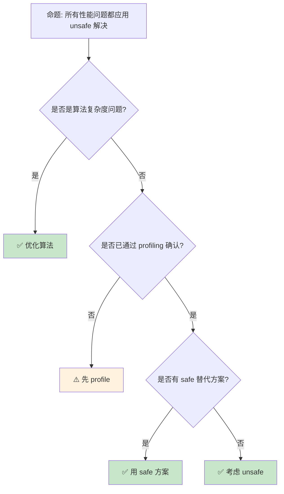

> **内容分级**: [专家级]

# Unsafe Rust 模式：安全抽象的核心技术
>
> **EN**: Unsafe Rust
> **Summary**: Unsafe Rust. Core Rust concept covering practical examples, mechanism analysis, in-depth analysis.
> **受众**: [专家]
> **Bloom 层级**: 分析 → 评价
> **定位**: 深入分析 Rust **unsafe 代码的工程模式**——从原始指针（Raw Pointer）操作、内存布局控制到与 C 的互操作，揭示如何在 unsafe 边界内构建安全抽象。
> **前置概念**: [Unsafe](03_unsafe.md) · [FFI](05_rust_ffi.md) · [Type System](../01_foundation/04_type_system.md)
> **后置概念**: [RustBelt](../04_formal/04_rustbelt.md) · [Concurrency Patterns](10_concurrency_patterns.md)

---

> **来源**: [Rustonomicon](https://doc.rust-lang.org/nomicon/) · [Reference — Unsafe Rust](https://doc.rust-lang.org/reference/unsafe-blocks.html)
> [Rust Reference — Unsafe Rust](https://doc.rust-lang.org/reference/unsafe-keyword.html) ·
> [Rust Unsafe Code Guidelines](https://rust-lang.github.io/unsafe-code-guidelines/) ·
> [The Rust Programming Language](https://doc.rust-lang.org/book/ch19-01-unsafe-rust.html) ·
> [Wikipedia — Memory Safety](https://en.wikipedia.org/wiki/Memory_safety)
> **前置依赖**: [Ownership](../01_foundation/01_ownership.md) · [Borrowing](../01_foundation/02_borrowing.md)
> **前置依赖**: [Traits](../02_intermediate/01_traits.md)
> **对应练习**: [`exercises/src/unsafe_rust/`](../../exercises/src/unsafe_rust)

## 📑 目录

- [Unsafe Rust 模式：安全抽象的核心技术](#unsafe-rust-模式安全抽象的核心技术)
  - [📑 目录](#-目录)
  - [一、核心概念](#一核心概念)
    - [1.1 unsafe 的语义边界](#11-unsafe-的语义边界)
    - [1.2 原始指针操作](#12-原始指针操作)
    - [1.3 未定义行为（UB）清单](#13-未定义行为ub清单)
  - [二、技术细节](#二技术细节)
    - [2.1 安全抽象层设计](#21-安全抽象层设计)
    - [2.2 内存布局与对齐](#22-内存布局与对齐)
    - [2.3 Miri 与动态检测](#23-miri-与动态检测)
  - [三、Unsafe 模式矩阵](#三unsafe-模式矩阵)
  - [四、反命题与边界分析](#四反命题与边界分析)
    - [4.1 反命题树](#41-反命题树)
    - [4.2 边界极限](#42-边界极限)
  - [五、常见陷阱](#五常见陷阱)
  - [六、来源与延伸阅读](#六来源与延伸阅读)
  - [相关概念文件](#相关概念文件)
  - [逆向推理链（Backward Reasoning）](#逆向推理链backward-reasoning)
  - [权威来源索引](#权威来源索引)
  - [十、边界测试：Unsafe Rust 模式的编译错误](#十边界测试unsafe-rust-模式的编译错误)
    - [10.1 边界测试：自定义 `Drop` 中的 `mem::forget` 循环（运行时 UB）](#101-边界测试自定义-drop-中的-memforget-循环运行时-ub)
    - [10.2 边界测试：`unsafe impl` 的 trait 契约违反（编译错误 / 运行时 UB）](#102-边界测试unsafe-impl-的-trait-契约违反编译错误--运行时-ub)
    - [10.3 边界测试：自引用结构的 `Pin` 误用（编译错误/运行时 UB）](#103-边界测试自引用结构的-pin-误用编译错误运行时-ub)
    - [10.4 边界测试：`MaybeUninit` 的数组初始化模式（编译错误）](#104-边界测试maybeuninit-的数组初始化模式编译错误)
    - [10.5 边界测试：`std::ptr::read` 的重复读取（运行时 UB）](#105-边界测试stdptrread-的重复读取运行时-ub)
    - [10.3 边界测试：`MaybeUninit` 的未初始化读取（运行时 UB）](#103-边界测试maybeuninit-的未初始化读取运行时-ub)
    - [10.4 边界测试：MaybeUninit 的未初始化内存读取（运行时 UB）](#104-边界测试maybeuninit-的未初始化内存读取运行时-ub)
    - [10.1 边界测试：const fn 中的非编译期操作](#101-边界测试const-fn-中的非编译期操作)
  - [嵌入式测验（Embedded Quiz）](#嵌入式测验embedded-quiz)
    - [测验 1：unsafe 的语义边界（理解层）](#测验-1unsafe-的语义边界理解层)
    - [测验 2：原始指针 vs 引用（应用层）](#测验-2原始指针-vs-引用应用层)
    - [测验 3：`MaybeUninit<T>` 的用途（应用层）](#测验-3maybeuninitt-的用途应用层)
    - [测验 4：安全抽象层设计（分析层）](#测验-4安全抽象层设计分析层)
    - [测验 5：UB 检测工具（评价层）](#测验-5ub-检测工具评价层)
  - [认知路径](#认知路径)
    - [核心推理链](#核心推理链)
    - [反命题与边界](#反命题与边界)
  - [实践](#实践)
    - [对应代码示例](#对应代码示例)
    - [建议练习](#建议练习)
  - [导航：下一步去哪？](#导航下一步去哪)

---

## 一、核心概念
>
>

### 1.1 unsafe 的语义边界
>

```text
unsafe 的两种含义:

  unsafe 块:
  ├── 标记"我保证这段代码满足 Rust 安全假设"
  ├── 可以执行五项额外操作
  └── 编译器信任开发者，不验证安全性

  unsafe 函数:
  ├── 标记"调用者必须满足特定条件"
  ├── 函数体自动是 unsafe 块
  └── 文档必须明确安全契约

  unsafe 的五大能力:
  1. 解引用原始指针 (*const T, *mut T)
  2. 调用 unsafe 函数
  3. 访问或修改可变静态变量
  4. 实现 unsafe trait
  5. 访问 union 的字段

  不等于:
  ├── 内存泄漏（safe Rust 也可能）
  ├── 死锁（safe Rust 也可能）
  ├── 无限循环（safe Rust 也可能）
  └── 逻辑错误（safe Rust 也可能）

  核心原则:
  ├── unsafe 不绕过借用检查器
  ├── unsafe 不关闭类型系统
  ├── unsafe 只扩展五项额外能力
  └── 其余所有 Rust 规则仍然适用
```

> **认知功能**: **unsafe 是"信任但验证"的机制**——编译器信任 unsafe 块内的代码满足不变性，但借用（Borrowing）检查器仍在工作。
> [来源: [Rust Reference — Unsafe Rust](https://doc.rust-lang.org/reference/unsafe-keyword.html)]

---

### 1.2 原始指针操作
>

```rust,ignore
// 原始指针: *const T（不可变）和 *mut T（可变）

// 创建原始指针（safe）
let x = 5;
let r1 = &x as *const i32;  // 从引用创建
let r2 = Box::into_raw(Box::new(5));  // 从 Box 创建

// 解引用原始指针（unsafe）
unsafe {
    println!("r1 is: {}", *r1);  // 解引用
    *r2 = 10;                      // 可变解引用
    Box::from_raw(r2);             // 重新拥有内存
}

// 原始指针 vs 引用:
┌─────────────────┬─────────────────┬─────────────────┐
│ 特性            │ 引用 (&T)       │ 原始指针 (*const T)│
├─────────────────┼─────────────────┼─────────────────┤
│ 解引用          │ 安全            │ 需要 unsafe     │
│ 可为 null       │ 否              │ 是              │
│ 自动解引用      │ 是              │ 否              │
│ 生命周期检查    │ 是              │ 否              │
│ 别名规则        │ 编译期强制      │ 开发者负责      │
│ 多别名          │ &mut 禁止       │ 允许            │
└─────────────────┴─────────────────┴─────────────────┘
> [来源: [TRPL](https://doc.rust-lang.org/book/ch20-01-unsafe-rust.html)]

// 原始指针的算术:
let arr = [1, 2, 3, 4, 5];
let ptr = arr.as_ptr();
unsafe {
    let third = *ptr.add(2);  // 等价于 arr[2]
    println!("third = {}", third);
}
```

> **原始指针洞察**: 原始指针（Raw Pointer）**剥离了 Rust 的安全保证**——它们可以 null、可以悬空、可以别名，但**借用（Borrowing）检查器不验证这些**。
> [来源: [Rust Nomicon — Raw Pointers](https://doc.rust-lang.org/nomicon/vec-raw.html)]

---

### 1.3 未定义行为（UB）清单
>

```text
Rust 中的未定义行为:

  内存相关:
  ├── 解引用悬空/NULL 指针
  ├── 读取未初始化内存
  ├── 违反对齐要求
  ├── 创建无效的值表示
  │   ├── bool 不是 0 或 1
  │   ├── enum 变体不合法
  │   ├── char 不是有效 Unicode
  │   └── 引用/Box 指向无效地址
  └── 数据竞争

  引用规则:
  ├── &mut T 和 &mut T 同时存在（别名）
  ├── &mut T 和 &T 同时存在（读写竞争）
  ├── &T 指向的数据在 &T 生命周期内被修改
  └── 创建指向未初始化数据的引用

  其他:
  ├── 使用 extern 调用 Rust 的 ABI 不匹配
  ├── 执行由编译器内联汇编生成的无效指令
  ├── double panic（panic 中 panic）
  └── 与 FFI 边界的不当交互

  关键洞察:
  ├── 一旦触发 UB，程序行为完全不可预测
  ├── 编译器基于"无 UB"假设优化
  ├── 有 UB 的代码可能被优化为"错误"结果
  └── 即使"看起来工作"，仍可能隐藏 bug
```

> **UB 洞察**: **未定义行为是 unsafe Rust 的"红线"**——一旦触发，编译器的所有保证失效，程序可能以任何方式失败。
> [来源: [Rust Reference — Behavior Considered Undefined](https://doc.rust-lang.org/reference/behavior-considered-undefined.html)]

---

## 二、技术细节

### 2.1 安全抽象层设计
>

```rust,ignore
// 安全抽象层: unsafe 核心 + safe API

/// # Safety
/// `ptr` must be non-null and properly aligned.
/// `ptr` must point to a valid `T`.
unsafe fn dangerous_op<T>(ptr: *mut T) {
    // 内部 unsafe 操作
    std::ptr::drop_in_place(ptr);
}

// Safe 包装层
pub fn safe_wrapper<T>(value: &mut T) {
    // 验证前置条件
    let ptr = value as *mut T;
    assert!(!ptr.is_null());

    // 安全封装 unsafe 调用
    unsafe { dangerous_op(ptr); }
}

// 抽象层设计原则:
// ├── 最小 unsafe: unsafe 代码量最小化
// ├── 集中管理: 一个模块处理所有 unsafe
// ├── 文档化契约: /// # Safety 说明前置条件
// ├── 不可违反的不变性: safe API 保证
// └── 审查重点: unsafe 代码需要额外审查

// 示例: Vec 的 push（简化）
pub struct MyVec<T> {
    ptr: *mut T,
    len: usize,
    cap: usize,
}

impl<T> MyVec<T> {
    pub fn push(&mut self, value: T) {
        if self.len == self.cap {
            self.grow();  // 可能涉及 unsafe
        }

        unsafe {
            // 我们知道 ptr + len 是有效且未初始化的位置
            std::ptr::write(self.ptr.add(self.len), value);
            self.len += 1;
        }
    }
}
```

> **抽象洞察**: **安全抽象的核心是"验证前置条件，然后调用 unsafe"**——safe 层检查，unsafe 层执行。
> [来源: [Rust API Guidelines — Unsafe Functions](https://rust-lang.github.io/api-guidelines//documentation.html#unsafe-functions-document-conditions-c-unsafe-doc)]

---

### 2.2 内存布局与对齐
>

```rust
// 内存布局控制

// align_of: 类型的对齐要求
assert_eq!(std::mem::align_of::<u8>(), 1);
assert_eq!(std::mem::align_of::<u64>(), 8);
assert_eq!(std::mem::align_of::<Vec<u8>>(), 8);  // 64位平台

// size_of: 类型的大小
assert_eq!(std::mem::size_of::<u8>(), 1);
assert_eq!(std::mem::size_of::<bool>(), 1);
assert_eq!(std::mem::size_of::<Option<&u8>>(), 8);  // niche optimization

// 自定义对齐
#[repr(align(64))]
struct CacheLine([u8; 64]);

// 零大小类型 (ZST)
struct ZeroSized;
assert_eq!(std::mem::size_of::<ZeroSized>(), 0);

// 内存操作
let mut x = 0u32;
unsafe {
    // 读取任意内存为 T
    let val = std::ptr::read(&x);  // 复制值

    // 写入值到内存（不调用 Drop）
    std::ptr::write(&mut x, 42);

    // 替换值，返回旧值
    let old = std::ptr::replace(&mut x, 100);
}

// MaybeUninit: 安全处理未初始化内存
use std::mem::MaybeUninit;

let mut uninit: MaybeUninit<String> = MaybeUninit::uninit();
unsafe {
    // 初始化
    uninit.as_mut_ptr().write(String::from("hello"));

    // 安全读取
    let s = uninit.assume_init();
    println!("{}", s);
} // s 在这里 drop
```

> **布局洞察**: `MaybeUninit` 是 Rust **处理未初始化内存的安全工具**——它避免了 `mem::uninitialized` 的 UB 风险。
> [来源: [std::mem::MaybeUninit](https://doc.rust-lang.org/std/mem/union.MaybeUninit.html)]

---

### 2.3 Miri 与动态检测
>

```text
Miri: Rust 的 undefined behavior 检测器

  功能:
  ├── 解释执行 Rust 中间表示（MIR）
  ├── 检测多种未定义行为
  ├── 验证栈借用规则
  └── 验证内存访问合法性

  使用:
  rustup component add miri
  cargo miri test
  cargo miri run

  检测范围:
  ├── 使用已释放内存
  ├── 数据竞争
  ├── 对齐违规
  ├── 无效 enum 值
  ├── 未初始化内存读取
  └── 违反栈借用规则

  限制:
  ├── 不支持 FFI
  ├── 不支持内联汇编
  ├── 执行很慢（解释执行）
  ├── 某些平台不支持
  └── 只能检测执行到的代码

  其他工具:
  ├── AddressSanitizer (ASan): 内存错误
  ├── ThreadSanitizer (TSan): 数据竞争
  ├── MemorySanitizer (MSan): 未初始化内存
  └── Sanitizers 需要 nightly
```

> **Miri 洞察**: **Miri 是 unsafe Rust 开发的必备工具**——它可以在测试阶段捕获大量 UB，弥补编译期检查的不足。
> [来源: [Miri README](https://github.com/rust-lang/miri)]

---

## 三、Unsafe 模式矩阵

```text
场景 → 技术 → 安全策略

FFI 边界:
  → extern "C" + 原始指针
  → safe 包装层验证前置条件
  → 文档化 C API 契约

原始内存分配:
  → std::alloc::GlobalAlloc
  → 对齐检查 + 大小验证
  → 使用 MaybeUninit 处理未初始化内存

自定义数据结构:
  → Vec/HashMap 风格
  → 集中 unsafe 在内部方法
  → public API 全是 safe

并发原语:
  → Atomic + 原始指针
  → 内存序正确性
  → TSan + loom 验证

类型擦除:
  → *const dyn Trait / vtable
  → 对齐和大小检查
  → 避免类型混淆

零拷贝解析:
  → 从字节切片 reinterpret
  → 对齐和边界检查
  → 使用 repr(C) 保证布局
```

> **模式矩阵**: **unsafe Rust 的核心模式是"unsafe 核心 + safe 包装"**——将所有 unsafe 操作隐藏在不可违反的 safe API 后面。
> [来源: [Rust Unsafe Code Guidelines](https://rust-lang.github.io/unsafe-code-guidelines/)]

---

## 四、反命题与边界分析

### 4.1 反命题树
>



> **认知功能**: **unsafe 是最后手段**——只有在 profiling 证明 safe 代码是瓶颈，且没有 safe 替代方案时才使用。
> [来源: [Rust Performance Book](https://nnethercote.github.io/perf-book/)]

---

### 4.2 边界极限
>

```text
边界 1: Miri 的覆盖限制
├── 只能检测执行到的代码路径
├── 某些并发 bug 难以触发
├── 大项目测试时间很长
└── 缓解: 针对性测试 + 覆盖率检查

边界 2: 形式化验证的局限
├── RustBelt 覆盖核心语言
├── 但不覆盖所有 std API
├── 外部 crate 无验证
└── 缓解: 关键路径用 Kani 等工具

边界 3: FFI 的完全不可验证
├── C 代码的行为 Rust 无法检查
├── 调用约定不匹配导致 UB
├── 内存管理责任划分
└── 缓解: 边界测试 + Valgrind/ASan

边界 4: 优化假设的脆弱性
├── 编译器基于无 UB 假设优化
├── 微小 UB 可能导致严重后果
├── 调试困难（优化后代码难以追踪）
└── 缓解: debug 模式测试 + Miri

边界 5: 团队协作的复杂性
├── unsafe 代码需要所有维护者理解
├── 安全不变性需要文档和培训
├── 代码审查要求更高
└── 缓解: 限制 unsafe 代码作者数量
```

> **边界要点**: unsafe 的边界主要与**验证工具覆盖**、**形式化验证局限**、**FFI 不可验证**、**优化脆弱性**和**团队协作**相关。

---

## 五、常见陷阱

```text
陷阱 1: 不必要的 unsafe
  ❌ unsafe { vec.push(1); }
     // push 已经是 safe API

  ✅ vec.push(1);
     // 不需要 unsafe

陷阱 2: 忽略对齐要求
  ❌ let ptr = 0x1 as *const u32;
     let val = unsafe { *ptr };  // 未对齐！

  ✅ 确保指针对齐
     // assert!(ptr.align_offset(std::mem::align_of::<u32>()) == 0);

陷阱 3: 悬垂指针
  ❌ let ptr = {
         let x = 5;
         &x as *const i32
     };
     let val = unsafe { *ptr };  // x 已被 drop！

  ✅ 确保数据生命周期足够长
     // 或使用 Box/leak 获得 'static

陷阱 4: 忘记 Drop
  ❌ let ptr = Box::into_raw(Box::new(String::from("hello")));
     // 没有 from_raw 回收，内存泄漏！

  ✅ unsafe { Box::from_raw(ptr); }
     // 或让 safe 包装层管理生命周期

陷阱 5: 数据竞争
  ❌ static mut COUNTER: i32 = 0;
     unsafe { COUNTER += 1; }
     // 多线程下数据竞争！

  ✅ 使用 AtomicI32
     // COUNTER.fetch_add(1, Ordering::Relaxed);
```

> **陷阱总结**: unsafe 的陷阱主要与**不必要使用**、**对齐**、**生命周期（Lifetimes）**、**内存泄漏**和**数据竞争**相关。
> [来源: [Rust Nomicon — Common Mistakes](https://doc.rust-lang.org/nomicon/)]

---

## 六、来源与延伸阅读
>

| 来源 | 可信度 | 说明 |
|:---|:---:|:---|
| [Rust Nomicon](https://doc.rust-lang.org/nomicon/) | ✅ 一级 | unsafe 权威指南 |
| [Rust Reference — Unsafe](https://doc.rust-lang.org/reference/unsafe-keyword.html) | ✅ 一级 | 语法参考 |
| [Unsafe Code Guidelines](https://rust-lang.github.io/unsafe-code-guidelines/) | ✅ 一级 | 安全规范 |
| [Miri](https://github.com/rust-lang/miri) | ✅ 一级 | UB 检测器 |
| [TRPL — Unsafe Rust](https://doc.rust-lang.org/book/ch19-01-unsafe-rust.html) | ✅ 一级 | 基础教程 |

---

## 相关概念文件

- [Unsafe](03_unsafe.md) — Unsafe 基础
- [FFI](05_rust_ffi.md) — 外部函数接口
- [RustBelt](../04_formal/04_rustbelt.md) — 形式化验证
- [Concurrency Patterns](10_concurrency_patterns.md) — 并发模式

---

> **权威来源**: [Rust Reference](https://doc.rust-lang.org/reference/), [The Rust Programming Language](https://doc.rust-lang.org/book/ch20-01-unsafe-rust.html)
>
> **权威来源对齐变更日志**: 2026-05-22 创建 [来源: Authority Source Sprint Batch 10]

**文档版本**: 1.0
**对应 Rust 版本**: 1.96.0+ (Edition 2024)
**最后更新**: 2026-05-22
**状态**: ✅ 概念文件创建完成

---

## 逆向推理链（Backward Reasoning）

> **从编译错误反推**：
>
> ```text
> Unsafe 安全抽象 ⟸ 人工证明 + Miri 验证
> ```
>
## 权威来源索引

> **补充来源**

## 十、边界测试：Unsafe Rust 模式的编译错误

### 10.1 边界测试：自定义 `Drop` 中的 `mem::forget` 循环（运行时 UB）

```rust
struct BadDrop {
    ptr: *mut u8,
}

impl Drop for BadDrop {
    fn drop(&mut self) {
        // ⚠️ 运行时 UB: 若 drop 中 panic，且 panic 处理再次访问 self
        unsafe {
            std::alloc::dealloc(self.ptr, std::alloc::Layout::new::<u8>());
        }
    }
}

fn main() {
    let layout = std::alloc::Layout::new::<u8>();
    let ptr = unsafe { std::alloc::alloc(layout) };
    let bad = BadDrop { ptr };
    // bad 离开作用域时 drop → 释放内存
    // 若之后有 use-after-free，Rust 无法检测
}

// 正确: 使用 Option 标记是否已释放
struct SafeDrop {
    ptr: Option<*mut u8>,
    layout: std::alloc::Layout,
}

impl Drop for SafeDrop {
    fn drop(&mut self) {
        if let Some(ptr) = self.ptr.take() {
            unsafe { std::alloc::dealloc(ptr, self.layout); }
        }
    }
}
```

> **修正**:
> 自定义 `Drop` 中的 unsafe 操作必须处理 panic 安全（panic safety）。
> 若 `Drop` 中 panic（如 `dealloc` 失败），栈展开会调用其他值的 `Drop`，可能访问已释放内存。
> 使用 `Option::take` 模式确保内存只释放一次，即使 `Drop` 被重复调用（如 panic 后）。
> 这与 C++ 的异常安全（exception safety）基本保证、强保证、不抛异常分级类似。
> [来源: [Rustonomicon](https://doc.rust-lang.org/nomicon/)]

### 10.2 边界测试：`unsafe impl` 的 trait 契约违反（编译错误 / 运行时 UB）

```rust,compile_fail
use std::sync::Arc;

struct NotThreadSafe {
    data: std::cell::RefCell<i32>, // RefCell 不是 Sync
}

// ❌ 编译错误: `RefCell<i32>` cannot be shared between threads safely
// 即使 unsafe impl，编译器仍可能拒绝明显不安全的实现
unsafe impl Sync for NotThreadSafe {}

fn main() {
    let x = Arc::new(NotThreadSafe { data: RefCell::new(0) });
    let x2 = Arc::clone(&x);
    std::thread::spawn(move || {
        x2.data.borrow_mut().add(1); // 数据竞争！
    });
}

// 正确: 使用 Mutex 实现线程安全
use std::sync::Mutex;

struct ThreadSafe {
    data: Mutex<i32>, // ✅ Mutex 是 Sync
}

unsafe impl Sync for ThreadSafe {} // 安全，因为 Mutex 保证同步
```

> **修正**: `unsafe impl Sync` / `unsafe impl Send` 是 Rust 中最危险的操作之一——它告诉编译器"我保证此类型在多线程环境下是安全的"，但编译器**不验证**此保证。
> `RefCell` 内部使用非原子借用（Borrowing）计数，多线程共享会导致数据竞争。
> 正确的线程安全必须通过 `Mutex`、`RwLock`、原子类型等同步原语实现。
> `unsafe impl Sync` 仅在封装了底层同步机制时使用（如标准库的 `Mutex` 本身）。
> [来源: [Rustonomicon](https://doc.rust-lang.org/nomicon/)]

### 10.3 边界测试：自引用结构的 `Pin` 误用（编译错误/运行时 UB）

```rust,ignore
use std::pin::Pin;

struct SelfRef {
    data: String,
    ptr: *const String, // 指向 data
}

impl SelfRef {
    fn new() -> Self {
        let mut s = SelfRef {
            data: String::from("hello"),
            ptr: std::ptr::null(),
        };
        s.ptr = &s.data;
        // ❌ 运行时 UB: 返回后 s 被移动，ptr 悬垂
        s
    }
}

fn main() {
    let _sr = SelfRef::new();
}
```

> **修正**:
> 自引用（Reference）结构（字段 A 引用字段 B）在 Rust 中无法直接实现，因为 struct 是**可移动的**——赋值、传参、返回都可能改变内存地址，使自引用字段悬垂。
> `Pin<&mut T>` 是解决方案：`T` 被"固定"在内存中，不能移动（除非 `T: Unpin`）。
> 正确实现：
>
> 1) `new` 返回 `Pin<Box<SelfRef>>`；
> 2) 使用 `unsafe` 设置自引用指针；
> 3) 确保 `SelfRef: !Unpin`（通过 `std::marker::PhantomPinned`）。
> 这是 Rust 异步生态的核心模式：async 状态机是自引用的（局部变量引用其他局部变量），`Pin` 保证状态机在 `.await` 点不被移动。
> 与 C++ 的 `std::pin`（C++20，类似概念但无 `Unpin` 区分）或 Swift 的 `inout`（无 Pin 概念）不同——Rust 的 Pin 是类型系统（Type System）的原生组成部分。
> [来源: [The Rust Programming Language](https://doc.rust-lang.org/book/ch17-02-concurrency-with-async.html)] ·
> [来源: [Rustonomicon](https://doc.rust-lang.org/std/pin/index.html)]

### 10.4 边界测试：`MaybeUninit` 的数组初始化模式（编译错误）

```rust,compile_fail
use std::mem::MaybeUninit;

fn main() {
    // ❌ 编译错误/运行时 UB: 错误使用 MaybeUninit 数组
    let mut arr: [MaybeUninit<String>; 3] = [MaybeUninit::uninit(); 3];
    // 初始化第一个元素
    arr[0].write(String::from("hello"));

    // 错误: 直接读取未初始化的 arr[1]
    // let s = unsafe { arr[1].assume_init() }; // UB!

    // 正确: 只读取已初始化的元素
    let s0 = unsafe { arr[0].assume_init() };
    // 但 arr[0] 现在处于"已移动"状态，不能再次 assume_init
}
```

> **修正**: `MaybeUninit<T>` 是 Rust 中处理部分初始化结构的底层原语。
> 数组 `[MaybeUninit<T>; N]` 允许逐个元素初始化，但编译器不追踪哪些元素已初始化——这是开发者的责任。
> 常见错误：
>
> 1) `assume_init` 未初始化元素；
> 2) 对已 `assume_init`（移动）的元素再次读取；
> 3) `drop` 时未区分已初始化和未初始化元素。
> 安全封装：`arrayvec` crate 的 `ArrayVec`（追踪长度），`smallvec` 的 `SmallVec`。
> 对于固定大小数组，手动追踪初始化状态是唯一选择。
> 这与 C 的 `malloc` + 部分初始化（无追踪，完全信任开发者）或 C++ 的 `std::optional<T[]>`（无标准支持）不同
> ——Rust 的 `MaybeUninit` 提供了类型安全的基础，但上层追踪仍需手工实现。
> [来源: [Rust Standard Library](https://doc.rust-lang.org/std/mem/union.MaybeUninit.html)] ·
> [来源: [Rustonomicon](https://doc.rust-lang.org/nomicon/uninitialized.html)]

### 10.5 边界测试：`std::ptr::read` 的重复读取（运行时 UB）

```rust,ignore
fn main() {
    let x = String::from("hello");
    let ptr = &x as *const String;
    unsafe {
        let s1 = std::ptr::read(ptr);
        let s2 = std::ptr::read(ptr);
        // ❌ 运行时 UB: s1 和 s2 都拥有同一堆内存
        // 两次 Drop 导致 double free
    }
}
```

> **修正**:
> `std::ptr::read` 从指针位置按值读取，**复制所有权（Ownership）**（对非 `Copy` 类型）。
> 同一位置的两次 `read` 产生两个拥有相同堆数据的所有者，drop 时双重释放。
> `read` 的使用前提：
>
> 1) 指针有效且对齐；
> 2) 读取后原位置不再使用（除非重新写入）；
> 3) 不重复读取同一非 `Copy` 位置。
> 安全替代：`ptr::copy`（移动，源位置失效）、`ptr::copy_nonoverlapping`（非重叠拷贝）、`Clone::clone_from_ptr`（手动克隆）。
> 这与 C 的 `memcpy`（逐字节复制，无所有权（Ownership）概念）或 C++ 的 `std::uninitialized_copy`（类似 `read`，但范围操作）不同
> ——Rust 的 `ptr::read` 在类型系统（Type System）层面是"按值移动"，需谨慎使用。
> [来源: [Rust Standard Library](https://doc.rust-lang.org/std/ptr/fn.read.html)] ·
> [来源: [The Rustonomicon](https://doc.rust-lang.org/nomicon/)]

### 10.3 边界测试：`MaybeUninit` 的未初始化读取（运行时 UB）

```rust,ignore
use std::mem::MaybeUninit;

fn main() {
    let mut x = MaybeUninit::<i32>::uninit();
    unsafe {
        // ❌ 运行时 UB: 读取未初始化的 MaybeUninit
        let _val = x.assume_init();
    }
}
```

> **修正**: `MaybeUninit<T>` 是 Rust 中处理**未初始化内存**的安全抽象：
>
> 1) `uninit()` 创建未初始化值（不调用 `T::new()`）；
> 2) `write(val)` 安全写入（`&mut` 保证唯一访问）；
> 3) `assume_init()` **unsafe**，要求调用者保证已初始化，否则 UB。
>
> 常见模式：
> 堆栈上分配数组（`let mut buf = [MaybeUninit::<u8>::uninit(); 1024]`），填充后 `transmute` 为初始化数组。
> `MaybeUninit` 替代了已废弃的 `mem::uninitialized()`（后者读取未初始化值是 instant UB）。
> 这与 C 的 `malloc` + `memcpy`（未初始化内存默认合法读取，但值不确定）或 C++ 的 `std::optional`（有状态跟踪）不同
> ——Rust 的 `MaybeUninit` 将未初始化状态编码到类型系统（Type System），强制显式初始化。
> [来源: [Rust Standard Library](https://doc.rust-lang.org/std/mem/union.MaybeUninit.html)] ·
> [来源: [The Rustonomicon](https://doc.rust-lang.org/nomicon/uninitialized.html)]

### 10.4 边界测试：MaybeUninit 的未初始化内存读取（运行时 UB）

```rust,compute_fail
use std::mem::MaybeUninit;

fn main() {
    let mut uninit: MaybeUninit<i32> = MaybeUninit::uninit();
    // ❌ 运行时 UB: 读取未初始化的 MaybeUninit
    let val = unsafe { *uninit.as_ptr() };
    println!("{}", val);
}
```

> **修正**:
> **`MaybeUninit<T>`** 是 Rust 处理未初始化内存的安全抽象：
>
> 1) `MaybeUninit::uninit()` — 分配内存但不初始化；
> 2) `MaybeUninit::write(val)` — 安全写入；
> 3) `unsafe { uninit.assume_init() }` — 假设已初始化，读取值（unsafe！）；
> 4) `unsafe { *uninit.as_ptr() }` — 同样 unsafe，读取可能未初始化的值。
>
> UB 条件：
>
> 1) 在 `write` 前 `assume_init`/`as_ptr` dereference → UB；
> 2) `assume_init_read()` 后再次使用 → double read（可能安全但可能 panic）；
> 3) `drop` 未初始化的 `MaybeUninit<T>`（`T` 未实现 `Drop` 时安全）。
> 与 C 的未初始化变量（UB，编译器优化不可预测）或 C++ 的 `std::optional`（有状态标记，安全）不同
> ——Rust 的 `MaybeUninit` 是显式的、零成本的未初始化抽象，但使用需 unsafe。
> [来源: [MaybeUninit](https://doc.rust-lang.org/std/mem/union.MaybeUninit.html)] ·
> [来源: [The Rustonomicon](https://doc.rust-lang.org/nomicon/unchecked-uninit.html)]

### 10.1 边界测试：const fn 中的非编译期操作

```rust,compile_fail
const fn foo(x: i32) -> i32 {
    // ❌ 编译错误: Vec::new() 不是 const fn（在旧版本中）
    let v = Vec::new();
    x
}

fn main() {}
```

> **修正**:
> **Const fn**：
>
> 1) 函数体必须是编译期可计算的；
> 2) `Vec::new()` 在某些 Rust 版本中不是 `const fn`；
> 3) 编译期限制逐步放宽（`const_mut_refs`、`const_vec_string` 等）。
>
> **权威来源**: [Rust Reference](https://doc.rust-lang.org/reference/) ·
> [The Rust Programming Language](https://doc.rust-lang.org/book/ch20-01-unsafe-rust.html) ·
> [Rust Standard Library](https://doc.rust-lang.org/std/) ·
> [Rustonomicon](https://doc.rust-lang.org/nomicon/)
> **对应 Rust 版本**: 1.96.0+ (Edition 2024)

## 嵌入式测验（Embedded Quiz）

### 测验 1：unsafe 的语义边界（理解层）

`unsafe` 块的作用是什么？

- A. 关闭所有编译器检查
- B. 告诉编译器"程序员保证这段代码满足 Rust 安全契约"
- C. 允许代码运行时（Runtime）更快

<details>
<summary>✅ 答案</summary>

**B. 告诉编译器"程序员保证这段代码满足 Rust 安全契约"**。

`unsafe` 不是"狂野西部"，它有精确的语义边界：

- 允许解引用原始指针
- 允许调用 `unsafe` 函数或访问 `unsafe` trait
- 允许实现 `unsafe trait`
- 允许读写 `static mut` 变量
- 允许使用 `union` 字段

编译器仍然进行类型检查、生命周期（Lifetimes）检查。`unsafe` 只是将某些安全责任从编译器转移到程序员。
</details>

---

### 测验 2：原始指针 vs 引用（应用层）

`*const T` 和 `&T` 的核心区别是什么？

- A. 原始指针不能为 null
- B. 原始指针不受借用检查器管理，可存在多个 `*mut` 指向同一数据
- C. 原始指针自动解引用

<details>
<summary>✅ 答案</summary>

**B. 原始指针不受借用检查器管理，可存在多个 `*mut` 指向同一数据**。

| 特性 | `&T` / `&mut T` | `*const T` / `*mut T` |
|:---|:---|:---|
| 借用检查 | ✅ 受管理 | ❌ 不受管理 |
| 可为 null | ❌ 不可 | ✅ 可以 |
| 多个可变 | ❌ 禁止 | ✅ 允许（但通常 UB）|
| 自动解引用 | ✅ 是 | ❌ 需 `unsafe` 解引用 |

原始指针用于与 C 互操作、实现底层数据结构等场景，但使用时要手动维护安全不变量。
</details>

---

### 测验 3：`MaybeUninit<T>` 的用途（应用层）

`MaybeUninit<T>` 解决了什么问题？

- A. 允许 `T` 为 null
- B. 允许分配未初始化的 `T` 内存，避免先构造再移动的开销
- C. 使 `T` 线程安全

<details>
<summary>✅ 答案</summary>

**B. 允许分配未初始化的 `T` 内存，避免先构造再移动的开销**。

`MaybeUninit<T>` 是 Rust 中处理未初始化内存的安全抽象：

- `MaybeUninit::uninit()` 分配 `T` 大小的内存，但不调用构造函数
- `write(val)` 在内存中构造值
- `assume_init()` 将 `MaybeUninit<T>` 转换为 `T`（unsafe，需确保已初始化）

应用场景：

- 批量分配数组元素后逐个初始化
- 与 C API 交互时接收未初始化的输出缓冲区
- 避免 `T` 的默认构造 + 赋值开销

</details>

---

### 测验 4：安全抽象层设计（分析层）

设计 unsafe 抽象时的核心原则是什么？

- A. 尽可能多用 `unsafe` 以获得灵活性
- B. 将 `unsafe` 封装在最小模块（Module）中，对外暴露 safe API
- C. 只在测试中使用 `unsafe`

<details>
<summary>✅ 答案</summary>

**B. 将 `unsafe` 封装在最小模块（Module）中，对外暴露 safe API**。

Rust unsafe 代码的最佳实践：

1. **最小化 unsafe 范围**：只在必要的地方使用 `unsafe` 块
2. **封装不变量**：模块（Module）内部维护安全契约，对外暴露无法违反契约的 API
3. **文档化契约**：用 `SAFETY:` 注释说明为什么这段代码是安全的
4. **用 Miri 验证**：检测 Stacked Borrows/Tree Borrows 违规

标准库是典范：`Vec`、`HashMap`、`BTreeMap` 内部使用大量 `unsafe`，但对外提供完全 safe 的 API。
</details>

---

### 测验 5：UB 检测工具（评价层）

Miri 能检测哪些 unsafe 代码问题？

- A. 所有逻辑错误
- B. 数据竞争、use-after-free、未初始化内存读取、违反 Stacked Borrows
- C. 性能瓶颈

<details>
<summary>✅ 答案</summary>

**B. 数据竞争、use-after-free、未初始化内存读取、违反 Stacked Borrows**。

Miri 是 Rust 的动态 UB 检测器：

- ✅ 检测 use-after-free
- ✅ 检测数据竞争
- ✅ 检测未初始化内存读取
- ✅ 检测 Stacked Borrows / Tree Borrows 违规
- ✅ 检测对齐违规
- ❌ 不能检测逻辑错误（如算法不正确）
- ❌ 不能检测未触发的 UB（因为是有界执行）

Miri 是 unsafe 代码开发者的必备工具，但不能替代形式化验证或全面测试。
</details>

---

## 认知路径

> **认知路径**: 从 L0 基础概念出发，经由本节的 **Unsafe Rust 模式：安全抽象的核心技术** 核心原理，通向 L2 进阶模式与 L3 工程实践。

### 核心推理链

| 定理 | 前提 | 结论 | 置信度 |
|:---|:---|:---|:---|
| Unsafe Rust 模式：安全抽象的核心技术 基础定义 ⟹ 正确用法 | 理解语法与语义 | 能写出符合惯用法的代码 | 高 |
| Unsafe Rust 模式：安全抽象的核心技术 正确用法 ⟹ 常见陷阱 | 忽略边界条件 | 编译错误或运行时 bug | 高 |
| Unsafe Rust 模式：安全抽象的核心技术 常见陷阱 ⟹ 深度掌握 | 系统学习反模式 | 能进行代码审查与优化 | 高 |

> FFI 边界安全 ⟸ ABI 兼容性 ⟸ extern 调用约定
> 裸指针正确使用 ⟸ 别名规则遵循 ⟸ Miri 验证
> **过渡**: 掌握 Unsafe Rust 模式：安全抽象的核心技术 的基础语法后，下一步需要理解其在类型系统中的位置与与其他概念的交互关系。

> **过渡**: 在实践中应用 Unsafe Rust 模式：安全抽象的核心技术 时，务必关注边界条件与异常处理，这是从"能编译"到"能生产"的关键跃迁。

> **过渡**: Unsafe Rust 模式：安全抽象的核心技术 的设计理念体现了 Rust 零成本抽象（Zero-Cost Abstraction）与安全保证的核心权衡，理解这一权衡有助于迁移到更高级的并发与形式化验证领域。

### 反命题与边界

> **反命题**: "Unsafe Rust 模式：安全抽象的核心技术 在所有场景下都是最佳选择" —— 错误。需要根据具体上下文权衡性能、可读性与安全性，某些场景下显式替代方案可能更优。

---

---

## 实践

> 将本节概念转化为可编译代码。

### 对应代码示例

- **[crates/c01_ownership_borrow_scope](../../../crates/c01_ownership_borrow_scope/)** — 与本节概念对应的可编译 crate 示例
- **[exercises/src/unsafe_rust/](../../../exercises/src/unsafe_rust/)** — 配套练习题

### 建议练习

1. 阅读 `crates/c01_ownership_borrow_scope/` 中与"Unsafe 模式"相关的源码和示例
2. 运行 `cargo test -p c01_ownership_borrow_scope` 验证理解
3. 完成 `exercises/src/unsafe_rust/` 中的练习任务

---

## 导航：下一步去哪？

> **自检**：你当前掌握的核心概念是否已能独立应用？

| 选择 | 条件 | 目标 |
|:---|:---|:---|
| 🔙 巩固基础 | 仍有模糊概念 | 回到 [L2 对应主题](../02_intermediate) 或 [MVP 学习路径](../00_meta/LEARNING_MVP_PATH.md) |
| 🔜 深入 L3 其他主题 | 想扩展高级技能 | [L3 README](README.md) 选择其他主题 |
| 🎓 进入 L4 形式化 | 想理解"为什么"的数学证明 | [L4 形式化](../04_formal/README.md) |
| 🏗️ 进入 L6 生态 | 想掌握生产工具链 | [L6 生态](../06_ecosystem/README.md) |
