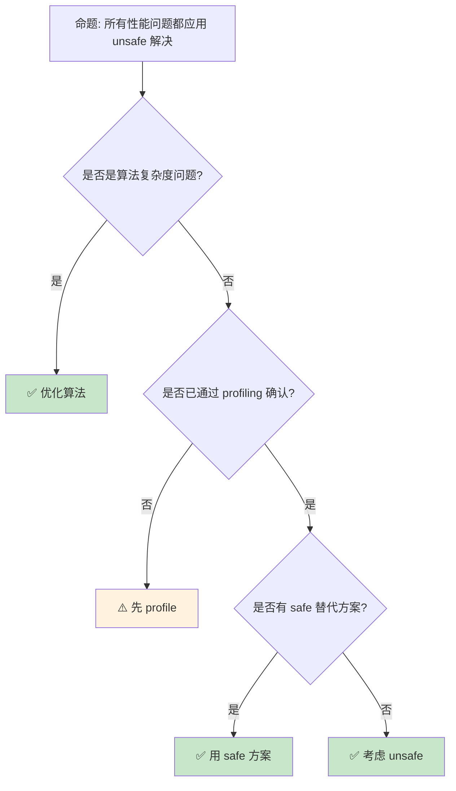

# Unsafe Rust 模式：安全抽象的核心技术

> **Bloom 层级**: 分析 → 评价
> **定位**: 深入分析 Rust **unsafe 代码的工程模式**——从原始指针操作、内存布局控制到与 C 的互操作，揭示如何在 unsafe 边界内构建安全抽象。
> **前置概念**: [Unsafe](./03_unsafe.md) · [FFI](./05_rust_ffi.md) · [Type System](../01_foundation/04_type_system.md)
> **后置概念**: [RustBelt](../04_formal/04_rustbelt.md) · [Concurrency Patterns](./10_concurrency_patterns.md)

---

> **来源**: [Rust Nomicon](https://doc.rust-lang.org/nomicon/) · [Rust Reference — Unsafe Rust](https://doc.rust-lang.org/reference/unsafe-keyword.html) · [Rust Unsafe Code Guidelines](https://rust-lang.github.io/unsafe-code-guidelines/) · [The Rust Programming Language](https://doc.rust-lang.org/book/ch19-01-unsafe-rust.html) · [Wikipedia — Memory Safety](https://en.wikipedia.org/wiki/Memory_safety)

## 📑 目录
> [来源: [TRPL](https://doc.rust-lang.org/book/)]

- [Unsafe Rust 模式：安全抽象的核心技术](#unsafe-rust-模式安全抽象的核心技术)
  - [📑 目录](#-目录)
  - [一、核心概念](#一核心概念)
    - [1.1 unsafe 的语义边界](#11-unsafe-的语义边界)
    - [1.2 原始指针操作](#12-原始指针操作)
    - [1.3 未定义行为（UB）清单](#13-未定义行为ub清单)
  - [二、技术细节](#二技术细节)
    - [2.1 安全抽象层设计](#21-安全抽象层设计)
    - [2.2 内存布局与对齐](#22-内存布局与对齐)
    - [2.3 Miri 与动态检测](#23-miri-与动态检测)
  - [三、Unsafe 模式矩阵](#三unsafe-模式矩阵)
  - [四、反命题与边界分析](#四反命题与边界分析)
    - [4.1 反命题树](#41-反命题树)
    - [4.2 边界极限](#42-边界极限)
  - [五、常见陷阱](#五常见陷阱)
  - [六、来源与延伸阅读](#六来源与延伸阅读)
  - [相关概念文件](#相关概念文件)

---

## 一、核心概念
> [来源: [Rust Reference](https://doc.rust-lang.org/reference/)]

### 1.1 unsafe 的语义边界

```text
unsafe 的两种含义:

  unsafe 块:
  ├── 标记"我保证这段代码满足 Rust 安全假设"
  ├── 可以执行五项额外操作
  └── 编译器信任开发者，不验证安全性

  unsafe 函数:
  ├── 标记"调用者必须满足特定条件"
  ├── 函数体自动是 unsafe 块
  └── 文档必须明确安全契约

  unsafe 的五大能力:
  1. 解引用原始指针 (*const T, *mut T)
  2. 调用 unsafe 函数
  3. 访问或修改可变静态变量
  4. 实现 unsafe trait
  5. 访问 union 的字段

  不等于:
  ├── 内存泄漏（safe Rust 也可能）
  ├── 死锁（safe Rust 也可能）
  ├── 无限循环（safe Rust 也可能）
  └── 逻辑错误（safe Rust 也可能）

  核心原则:
  ├── unsafe 不绕过借用检查器
  ├── unsafe 不关闭类型系统
  ├── unsafe 只扩展五项额外能力
  └── 其余所有 Rust 规则仍然适用
```

> **认知功能**: **unsafe 是"信任但验证"的机制**——编译器信任 unsafe 块内的代码满足不变性，但借用检查器仍在工作。
> [来源: [Rust Reference — Unsafe Rust](https://doc.rust-lang.org/reference/unsafe-keyword.html)]

---

### 1.2 原始指针操作

```rust,ignore
// 原始指针: *const T（不可变）和 *mut T（可变）

// 创建原始指针（safe）
let x = 5;
let r1 = &x as *const i32;  // 从引用创建
let r2 = Box::into_raw(Box::new(5));  // 从 Box 创建

// 解引用原始指针（unsafe）
unsafe {
    println!("r1 is: {}", *r1);  // 解引用
    *r2 = 10;                      // 可变解引用
    Box::from_raw(r2);             // 重新拥有内存
}

// 原始指针 vs 引用:
┌─────────────────┬─────────────────┬─────────────────┐
│ 特性            │ 引用 (&T)       │ 原始指针 (*const T)│
├─────────────────┼─────────────────┼─────────────────┤
│ 解引用          │ 安全            │ 需要 unsafe     │
│ 可为 null       │ 否              │ 是              │
│ 自动解引用      │ 是              │ 否              │
│ 生命周期检查    │ 是              │ 否              │
│ 别名规则        │ 编译期强制      │ 开发者负责      │
│ 多别名          │ &mut 禁止       │ 允许            │
└─────────────────┴─────────────────┴─────────────────┘
> [来源: [TRPL](https://doc.rust-lang.org/book/)]

// 原始指针的算术:
let arr = [1, 2, 3, 4, 5];
let ptr = arr.as_ptr();
unsafe {
    let third = *ptr.add(2);  // 等价于 arr[2]
    println!("third = {}", third);
}
```

> **原始指针洞察**: 原始指针**剥离了 Rust 的安全保证**——它们可以 null、可以悬空、可以别名，但**借用检查器不验证这些**。
> [来源: [Rust Nomicon — Raw Pointers](https://doc.rust-lang.org/nomicon/vec-raw.html)]

---

### 1.3 未定义行为（UB）清单

```text
Rust 中的未定义行为:

  内存相关:
  ├── 解引用悬空/NULL 指针
  ├── 读取未初始化内存
  ├── 违反对齐要求
  ├── 创建无效的值表示
  │   ├── bool 不是 0 或 1
  │   ├── enum 变体不合法
  │   ├── char 不是有效 Unicode
  │   └── 引用/Box 指向无效地址
  └── 数据竞争

  引用规则:
  ├── &mut T 和 &mut T 同时存在（别名）
  ├── &mut T 和 &T 同时存在（读写竞争）
  ├── &T 指向的数据在 &T 生命周期内被修改
  └── 创建指向未初始化数据的引用

  其他:
  ├── 使用 extern 调用 Rust 的 ABI 不匹配
  ├── 执行由编译器内联汇编生成的无效指令
  ├── double panic（panic 中 panic）
  └── 与 FFI 边界的不当交互

  关键洞察:
  ├── 一旦触发 UB，程序行为完全不可预测
  ├── 编译器基于"无 UB"假设优化
  ├── 有 UB 的代码可能被优化为"错误"结果
  └── 即使"看起来工作"，仍可能隐藏 bug
```

> **UB 洞察**: **未定义行为是 unsafe Rust 的"红线"**——一旦触发，编译器的所有保证失效，程序可能以任何方式失败。
> [来源: [Rust Reference — Behavior Considered Undefined](https://doc.rust-lang.org/reference/behavior-considered-undefined.html)]

---

## 二、技术细节
> [来源: [TRPL](https://doc.rust-lang.org/book/)]

### 2.1 安全抽象层设计

```rust,ignore
// 安全抽象层: unsafe 核心 + safe API

/// # Safety
/// `ptr` must be non-null and properly aligned.
/// `ptr` must point to a valid `T`.
unsafe fn dangerous_op<T>(ptr: *mut T) {
    // 内部 unsafe 操作
    std::ptr::drop_in_place(ptr);
}

// Safe 包装层
pub fn safe_wrapper<T>(value: &mut T) {
    // 验证前置条件
    let ptr = value as *mut T;
    assert!(!ptr.is_null());

    // 安全封装 unsafe 调用
    unsafe { dangerous_op(ptr); }
}

// 抽象层设计原则:
// ├── 最小 unsafe: unsafe 代码量最小化
// ├── 集中管理: 一个模块处理所有 unsafe
// ├── 文档化契约: /// # Safety 说明前置条件
// ├── 不可违反的不变性: safe API 保证
// └── 审查重点: unsafe 代码需要额外审查

// 示例: Vec 的 push（简化）
pub struct MyVec<T> {
    ptr: *mut T,
    len: usize,
    cap: usize,
}

impl<T> MyVec<T> {
    pub fn push(&mut self, value: T) {
        if self.len == self.cap {
            self.grow();  // 可能涉及 unsafe
        }

        unsafe {
            // 我们知道 ptr + len 是有效且未初始化的位置
            std::ptr::write(self.ptr.add(self.len), value);
            self.len += 1;
        }
    }
}
```

> **抽象洞察**: **安全抽象的核心是"验证前置条件，然后调用 unsafe"**——safe 层检查，unsafe 层执行。
> [来源: [Rust API Guidelines — Unsafe Functions](https://rust-lang.github.io/api-guidelines/documentation.html#unsafe-functions-document-conditions-c-unsafe-doc)]

---

### 2.2 内存布局与对齐

```rust,ignore
// 内存布局控制

// align_of: 类型的对齐要求
assert_eq!(std::mem::align_of::<u8>(), 1);
assert_eq!(std::mem::align_of::<u64>(), 8);
assert_eq!(std::mem::align_of::<Vec<u8>>(), 8);  // 64位平台

// size_of: 类型的大小
assert_eq!(std::mem::size_of::<u8>(), 1);
assert_eq!(std::mem::size_of::<bool>(), 1);
assert_eq!(std::mem::size_of::<Option<&u8>>(), 8);  // niche optimization

// 自定义对齐
#[repr(align(64))]
struct CacheLine([u8; 64]);

// 零大小类型 (ZST)
struct ZeroSized;
assert_eq!(std::mem::size_of::<ZeroSized>(), 0);

// 内存操作
let mut x = 0u32;
unsafe {
    // 读取任意内存为 T
    let val = std::ptr::read(&x);  // 复制值

    // 写入值到内存（不调用 Drop）
    std::ptr::write(&mut x, 42);

    // 替换值，返回旧值
    let old = std::ptr::replace(&mut x, 100);
}

// MaybeUninit: 安全处理未初始化内存
use std::mem::MaybeUninit;

let mut uninit: MaybeUninit<String> = MaybeUninit::uninit();
unsafe {
    // 初始化
    uninit.as_mut_ptr().write(String::from("hello"));

    // 安全读取
    let s = uninit.assume_init();
    println!("{}", s);
} // s 在这里 drop
```

> **布局洞察**: `MaybeUninit` 是 Rust **处理未初始化内存的安全工具**——它避免了 `mem::uninitialized` 的 UB 风险。
> [来源: [std::mem::MaybeUninit](https://doc.rust-lang.org/std/mem/union.MaybeUninit.html)]

---

### 2.3 Miri 与动态检测

```text
Miri: Rust 的 undefined behavior 检测器

  功能:
  ├── 解释执行 Rust 中间表示（MIR）
  ├── 检测多种未定义行为
  ├── 验证栈借用规则
  └── 验证内存访问合法性

  使用:
  rustup component add miri
  cargo miri test
  cargo miri run

  检测范围:
  ├── 使用已释放内存
  ├── 数据竞争
  ├── 对齐违规
  ├── 无效 enum 值
  ├── 未初始化内存读取
  └── 违反栈借用规则

  限制:
  ├── 不支持 FFI
  ├── 不支持内联汇编
  ├── 执行很慢（解释执行）
  ├── 某些平台不支持
  └── 只能检测执行到的代码

  其他工具:
  ├── AddressSanitizer (ASan): 内存错误
  ├── ThreadSanitizer (TSan): 数据竞争
  ├── MemorySanitizer (MSan): 未初始化内存
  └── Sanitizers 需要 nightly
```

> **Miri 洞察**: **Miri 是 unsafe Rust 开发的必备工具**——它可以在测试阶段捕获大量 UB，弥补编译期检查的不足。
> [来源: [Miri README](https://github.com/rust-lang/miri)]

---

## 三、Unsafe 模式矩阵
> [来源: [Rust Reference](https://doc.rust-lang.org/reference/)]

```text
场景 → 技术 → 安全策略

FFI 边界:
  → extern "C" + 原始指针
  → safe 包装层验证前置条件
  → 文档化 C API 契约

原始内存分配:
  → std::alloc::GlobalAlloc
  → 对齐检查 + 大小验证
  → 使用 MaybeUninit 处理未初始化内存

自定义数据结构:
  → Vec/HashMap 风格
  → 集中 unsafe 在内部方法
  → public API 全是 safe

并发原语:
  → Atomic + 原始指针
  → 内存序正确性
  → TSan + loom 验证

类型擦除:
  → *const dyn Trait / vtable
  → 对齐和大小检查
  → 避免类型混淆

零拷贝解析:
  → 从字节切片 reinterpret
  → 对齐和边界检查
  → 使用 repr(C) 保证布局
```

> **模式矩阵**: **unsafe Rust 的核心模式是"unsafe 核心 + safe 包装"**——将所有 unsafe 操作隐藏在不可违反的 safe API 后面。
> [来源: [Rust Unsafe Code Guidelines](https://rust-lang.github.io/unsafe-code-guidelines/)]

---

## 四、反命题与边界分析
> [来源: [Rust Reference](https://doc.rust-lang.org/reference/)]

### 4.1 反命题树



> **认知功能**: **unsafe 是最后手段**——只有在 profiling 证明 safe 代码是瓶颈，且没有 safe 替代方案时才使用。
> [来源: [Rust Performance Book](https://nnethercote.github.io/perf-book/)]

---

### 4.2 边界极限

```text
边界 1: Miri 的覆盖限制
├── 只能检测执行到的代码路径
├── 某些并发 bug 难以触发
├── 大项目测试时间很长
└── 缓解: 针对性测试 + 覆盖率检查

边界 2: 形式化验证的局限
├── RustBelt 覆盖核心语言
├── 但不覆盖所有 std API
├── 外部 crate 无验证
└── 缓解: 关键路径用 Kani 等工具

边界 3: FFI 的完全不可验证
├── C 代码的行为 Rust 无法检查
├── 调用约定不匹配导致 UB
├── 内存管理责任划分
└── 缓解: 边界测试 + Valgrind/ASan

边界 4: 优化假设的脆弱性
├── 编译器基于无 UB 假设优化
├── 微小 UB 可能导致严重后果
├── 调试困难（优化后代码难以追踪）
└── 缓解: debug 模式测试 + Miri

边界 5: 团队协作的复杂性
├── unsafe 代码需要所有维护者理解
├── 安全不变性需要文档和培训
├── 代码审查要求更高
└── 缓解: 限制 unsafe 代码作者数量
```

> **边界要点**: unsafe 的边界主要与**验证工具覆盖**、**形式化验证局限**、**FFI 不可验证**、**优化脆弱性**和**团队协作**相关。
> [来源: [Rust Unsafe Code Guidelines](https://rust-lang.github.io/unsafe-code-guidelines/)]

---

## 五、常见陷阱
> [来源: [TRPL](https://doc.rust-lang.org/book/)]

```text
陷阱 1: 不必要的 unsafe
  ❌ unsafe { vec.push(1); }
     // push 已经是 safe API

  ✅ vec.push(1);
     // 不需要 unsafe

陷阱 2: 忽略对齐要求
  ❌ let ptr = 0x1 as *const u32;
     let val = unsafe { *ptr };  // 未对齐！

  ✅ 确保指针对齐
     // assert!(ptr.align_offset(std::mem::align_of::<u32>()) == 0);

陷阱 3: 悬垂指针
  ❌ let ptr = {
         let x = 5;
         &x as *const i32
     };
     let val = unsafe { *ptr };  // x 已被 drop！

  ✅ 确保数据生命周期足够长
     // 或使用 Box/leak 获得 'static

陷阱 4: 忘记 Drop
  ❌ let ptr = Box::into_raw(Box::new(String::from("hello")));
     // 没有 from_raw 回收，内存泄漏！

  ✅ unsafe { Box::from_raw(ptr); }
     // 或让 safe 包装层管理生命周期

陷阱 5: 数据竞争
  ❌ static mut COUNTER: i32 = 0;
     unsafe { COUNTER += 1; }
     // 多线程下数据竞争！

  ✅ 使用 AtomicI32
     // COUNTER.fetch_add(1, Ordering::Relaxed);
```

> **陷阱总结**: unsafe 的陷阱主要与**不必要使用**、**对齐**、**生命周期**、**内存泄漏**和**数据竞争**相关。
> [来源: [Rust Nomicon — Common Mistakes](https://doc.rust-lang.org/nomicon/)]

---

## 六、来源与延伸阅读

| 来源 | 可信度 | 说明 |
|:---|:---:|:---|
| [Rust Nomicon](https://doc.rust-lang.org/nomicon/) | ✅ 一级 | unsafe 权威指南 |
| [Rust Reference — Unsafe](https://doc.rust-lang.org/reference/unsafe-keyword.html) | ✅ 一级 | 语法参考 |
| [Unsafe Code Guidelines](https://rust-lang.github.io/unsafe-code-guidelines/) | ✅ 一级 | 安全规范 |
| [Miri](https://github.com/rust-lang/miri) | ✅ 一级 | UB 检测器 |
| [TRPL — Unsafe Rust](https://doc.rust-lang.org/book/ch19-01-unsafe-rust.html) | ✅ 一级 | 基础教程 |

---

## 相关概念文件
> [来源: [Rust Reference](https://doc.rust-lang.org/reference/)]

- [Unsafe](./03_unsafe.md) — Unsafe 基础
- [FFI](./05_rust_ffi.md) — 外部函数接口
- [RustBelt](../04_formal/04_rustbelt.md) — 形式化验证
- [Concurrency Patterns](./10_concurrency_patterns.md) — 并发模式

---

> **权威来源**: [Rust Reference](https://doc.rust-lang.org/reference/), [The Rust Programming Language](https://doc.rust-lang.org/book/)
>
> **权威来源对齐变更日志**: 2026-05-22 创建 [来源: Authority Source Sprint Batch 10]

**文档版本**: 1.0
**对应 Rust 版本**: 1.96.0+ (Edition 2024)
**最后更新**: 2026-05-22
**状态**: ✅ 概念文件创建完成
