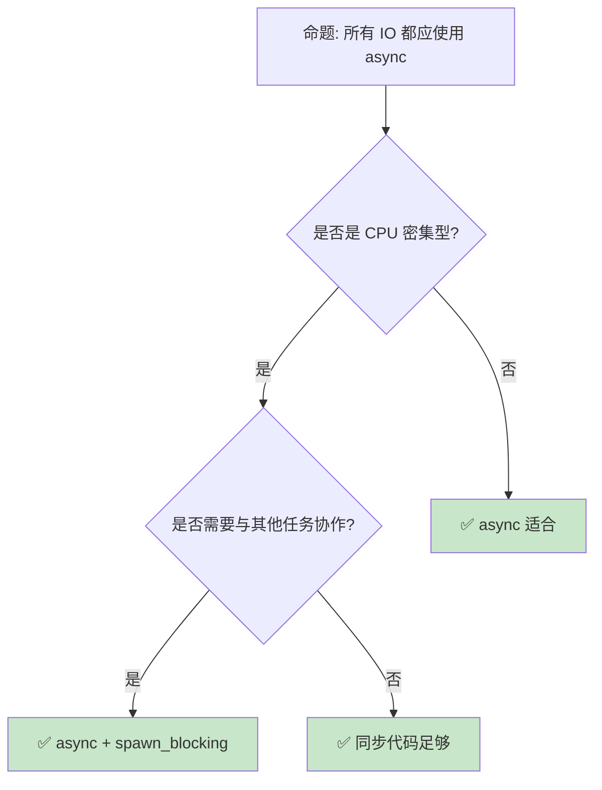

# 异步模式：从 Future 到生产级并发

> **Bloom 层级**: 分析 → 评价
> **定位**: 深入分析 Rust **异步编程的高级模式**——从 Future 状态机、Pin 保证到并发执行和取消传播，揭示 Rust async/await 如何在零运行时开销下实现高效并发。
> **前置概念**: [Async](./02_async.md) · [Pin](./06_pin_unpin.md) · [Concurrency](./01_concurrency.md)
> **后置概念**: [Distributed Systems](../06_ecosystem/18_distributed_systems.md) · [Tokio](https://tokio.rs/)

---

> **来源**: [TRPL — Async/Await](https://doc.rust-lang.org/book/ch17-00-async-await.html) · [Async Rust Book](https://rust-lang.github.io/async-book/) · [tokio.rs](https://tokio.rs/) · [RFC 2394 — Async/Await](https://rust-lang.github.io/rfcs/2394-async_await.html) · [Wikipedia — Futures and Promises](https://en.wikipedia.org/wiki/Futures_and_promises)

## 📑 目录

- [异步模式：从 Future 到生产级并发](#异步模式从-future-到生产级并发)
  - [📑 目录](#-目录)
  - [一、核心概念](#一核心概念)
    - [1.1 Future 与状态机](#11-future-与状态机)
    - [1.2 Pin 与自引用](#12-pin-与自引用)
    - [1.3 Waker 与执行器](#13-waker-与执行器)
  - [二、技术细节](#二技术细节)
    - [2.1 并发执行模式](#21-并发执行模式)
    - [2.2 取消与超时](#22-取消与超时)
    - [2.3 背压与流控制](#23-背压与流控制)
  - [三、异步模式矩阵](#三异步模式矩阵)
  - [四、反命题与边界分析](#四反命题与边界分析)
    - [4.1 反命题树](#41-反命题树)
    - [4.2 边界极限](#42-边界极限)
  - [五、常见陷阱](#五常见陷阱)
  - [六、来源与延伸阅读](#六来源与延伸阅读)
  - [相关概念文件](#相关概念文件)

---

## 一、核心概念

### 1.1 Future 与状态机

```text
Future 的本质:

  定义:
  ├── Future 是" eventually 产生值的计算"
  ├── 惰性: 创建时不执行
  ├── 轮询驱动: 执行器 poll 时才推进
  └── 状态机: async fn 编译为状态机

  async fn 的脱糖:
  async fn foo() -> i32 { 42 }

  // 等价于:
  fn foo() -> impl Future<Output = i32> {
      async { 42 }
  }

  状态机结构:
  enum FooFuture {
      Start,
      Waiting1(/* 捕获的局部变量 */),
      Waiting2(/* 捕获的局部变量 */),
      Done,
  }

  执行流程:
  1. 调用 async fn，返回 Future（未启动）
  2. 执行器 poll Future
  3. Future 执行到第一个 .await，返回 Pending
  4. 当等待的任务完成，Waker 唤醒执行器
  5. 执行器再次 poll，从上次暂停点继续
  6. 重复直到 Future 返回 Ready

  零成本特性:
  ├── 编译后状态机与手写等价
  ├── 无运行时分配（除非 Box::pin）
  ├── 与同步代码相同的性能
  └── 只需执行器提供调度
```

> **认知功能**: **Future 是"可暂停的函数"**——编译器将 async/await 转换为状态机，使代码看起来像同步但执行是异步的。
> [来源: [Async Rust Book — Future](https://rust-lang.github.io/async-book/02_execution/02_future.html)]

---

### 1.2 Pin 与自引用

```rust,ignore
// Pin: 保证 Future 的内存位置不变

use std::pin::Pin;
use std::future::Future;
use std::task::{Context, Poll};

// async fn 内部可能有自引用:
async fn example() {
    let s = String::from("hello");
    let r = &s;  // r 引用 s
    some_async_op().await;  // 可能暂停，但 r 必须继续有效
    println!("{}", r);
}

// 编译后的状态机:
struct ExampleFuture {
    s: String,
    r: *const String,  // 自引用指针！
    state: u8,
}

// Pin 保证:
// ├── Pin<&mut T> 阻止 T 被移动
// ├── 自引用指针保持有效
// ├── 内存位置不变
// └── 但允许通过 &mut T 修改内容

// 使用 Pin:
fn poll_future(future: Pin<&mut dyn Future<Output = ()>>) {
    let mut cx = Context::from_waker(...);
    let _ = future.poll(&mut cx);
}

// Box::pin: 将 Future Pin 到堆上
let future = Box::pin(async { /* ... */ });
```

> **Pin 洞察**: **Pin 是 Rust async 的基石**——它解决了状态机自引用问题，使编译器生成的状态机可以安全地跨越 await 点。
> [来源: [std::pin::Pin](https://doc.rust-lang.org/std/pin/struct.Pin.html)]

---

### 1.3 Waker 与执行器

```text
Waker: 异步通知机制

  角色:
  ├── Future 返回 Pending 时，注册 Waker
  ├── 当资源就绪（IO 完成、定时器到期），调用 Waker
  ├── Waker 通知执行器重新 poll Future
  └── 避免忙等待

  执行器（Executor）:
  ├── Tokio: 生产级执行器（多线程）
  ├── async-std: 标准库风格的执行器
  ├── smol: 小型执行器
  └── 自定义: 可针对特定场景优化

  Tokio 执行器:
  ├── 多线程工作窃取调度
  ├── 任务队列: run queue + LIFO slot
  ├── IO 驱动: epoll/kqueue/IOCP
  ├── 定时器: 时间轮
  └── 阻塞任务: spawn_blocking

  执行模型:
  1. 任务提交到执行器
  2. 工作线程从队列获取任务
  3. poll Future 直到 Pending
  4. 注册 Waker（关联到 IO/定时器）
  5. IO 就绪 → Waker 唤醒 → 重新调度
  6. Future 完成 → 输出结果
```

> **Waker 洞察**: **Waker 是"按需唤醒"的优化**——没有它，执行器需要不断轮询所有任务（忙等待）。
> [来源: [tokio.rs — Runtime](https://tokio.rs/tokio/topics/runtime)]

---

## 二、技术细节

### 2.1 并发执行模式

```rust,ignore
// 异步并发模式

use tokio::task;

// 1. join: 等待所有完成
async fn fetch_all() -> (String, String) {
    let a = fetch_url("url1");
    let b = fetch_url("url2");
    tokio::join!(a, b)  // 同时执行，等待两者
}

// 2. select: 等待任一完成
async fn race() -> String {
    let a = fetch_url("url1");
    let b = fetch_url("url2");
    tokio::select! {
        result = a => result,
        result = b => result,
    }
}

// 3. spawn: 创建独立任务
async fn spawn_tasks() {
    let handle1 = task::spawn(async {
        // 在后台执行
        do_work().await
    });

    let handle2 = task::spawn(async {
        do_other_work().await
    });

    let result1 = handle1.await.unwrap();
    let result2 = handle2.await.unwrap();
}

// 4. 并发限制 (Semaphore)
use tokio::sync::Semaphore;

async fn limited_concurrency(urls: Vec<String>) {
    let sem = Arc::new(Semaphore::new(10));  // 最多 10 并发

    let futures = urls.into_iter().map(|url| {
        let sem = sem.clone();
        async move {
            let _permit = sem.acquire().await.unwrap();
            fetch_url(&url).await
        }
    });

    let results: Vec<_> = futures::future::join_all(futures).await;
}

// 5. 流式处理 (Streams)
use tokio_stream::StreamExt;

async fn process_stream() {
    let mut stream = tokio_stream::iter(0..100);

    while let Some(item) = stream.next().await {
        println!("{}", item);
    }
}
```

> **并发洞察**: **tokio::join! 和 tokio::select! 是异步并发的核心原语**——它们对应同步并发中的 join 和 select 系统调用。
> [来源: [tokio::select!](https://docs.rs/tokio/latest/tokio/macro.select.html)]

---

### 2.2 取消与超时

```rust,ignore
// 取消和超时控制

use tokio::time::{timeout, Duration};

// 1. 超时
async fn fetch_with_timeout() -> Result<String, &'static str> {
    match timeout(Duration::from_secs(5), fetch_url("slow")).await {
        Ok(result) => Ok(result),
        Err(_) => Err("timeout"),
    }
}

// 2. 结构化取消: CancellationToken
use tokio_util::sync::CancellationToken;

async fn cancellable_task(token: CancellationToken) {
    loop {
        tokio::select! {
            _ = token.cancelled() => {
                println!("Cancelled!");
                break;
            }
            _ = do_work() => {}
        }
    }
}

// 3. 优雅关闭
async fn graceful_shutdown() {
    let token = CancellationToken::new();
    let child_token = token.child_token();

    let handle = tokio::spawn(cancellable_task(child_token));

    // 触发取消
    token.cancel();

    // 等待任务完成清理
    handle.await.unwrap();
}

// 4. Drop 取消: 当 Future 被 drop，async 块中的资源被清理
async fn auto_cancel() {
    let guard = scopeguard::guard((), |_| {
        println!("Cleanup on cancel");
    });

    long_operation().await;

    scopeguard::ScopeGuard::into_inner(guard);
}
```

> **取消洞察**: **Rust 的取消通过 Drop 传播**——当 Future 被 drop，所有已获取的资源自动清理，无需显式取消回调。
> [来源: [Async Cancellation](https://rust-lang.github.io/async-book/08_workarounds/03_cancel_safe.html)]

---

### 2.3 背压与流控制

```rust,ignore
// 背压: 防止生产者压倒消费者

use tokio::sync::mpsc;

// 1. 有界通道（内置背压）
async fn bounded_channel_example() {
    let (tx, mut rx) = mpsc::channel(100);  // 缓冲 100 个消息

    // 生产者: 当通道满时，send().await 阻塞
    tokio::spawn(async move {
        for i in 0..1000 {
            tx.send(i).await.unwrap();  // 背压在这里！
        }
    });

    // 消费者: 按自己的节奏处理
    while let Some(msg) = rx.recv().await {
        process(msg).await;
    }
}

// 2. 限流 (Rate Limiting)
use tokio::time::{interval, Duration};

async fn rate_limited() {
    let mut interval = interval(Duration::from_millis(100));

    loop {
        interval.tick().await;  // 每 100ms 允许一次
        make_request().await;
    }
}

// 3. 批量处理
use tokio::time::timeout;

async fn batch_processing(mut rx: mpsc::Receiver<i32>) {
    let mut batch = Vec::new();

    loop {
        match timeout(Duration::from_millis(50), rx.recv()).await {
            Ok(Some(item)) => {
                batch.push(item);
                if batch.len() >= 100 {
                    process_batch(std::mem::take(&mut batch)).await;
                }
            }
            _ => {
                if !batch.is_empty() {
                    process_batch(std::mem::take(&mut batch)).await;
                }
            }
        }
    }
}
```

> **背压洞察**: **有界通道是异步背压的核心机制**——它使系统在生产者和消费者之间自动平衡负载。
> [来源: [tokio::sync::mpsc](https://docs.rs/tokio/latest/tokio/sync/mpsc/index.html)]

---

## 三、异步模式矩阵

```text
场景 → 模式 → 工具

并发请求:
  → tokio::join!
  → 等待多个 Future 完成
  → let (a, b) = tokio::join!(fa, fb);

竞争/超时:
  → tokio::select! + timeout
  → 取最先完成的
  → select! { r = fa => ..., _ = sleep(5s) => ... }

后台任务:
  → tokio::spawn
  → 独立生命周期
  → let handle = spawn(async { ... });

限流:
  → Semaphore
  → 控制并发数
  → Semaphore::new(10)

背压:
  → 有界 channel
  → 防止内存爆炸
  → mpsc::channel(100)

流处理:
  → Stream
  → 异步迭代
  → stream.next().await
```

> **模式矩阵**: Rust 异步的**核心模式可以归纳为 6 类**——覆盖从简单并发到复杂流处理的大部分场景。
> [来源: [Async Patterns](https://rust-lang.github.io/async-book/09_workarounds/00_intro.html)]

---

## 四、反命题与边界分析

### 4.1 反命题树



> **认知功能**: **async 适合 IO 密集型，CPU 密集型需要 spawn_blocking 或 rayon**——混合使用是关键。
> [来源: [Async Rust Book — CPU Bound](https://rust-lang.github.io/async-book/09_workarounds/03_cancel_safe.html)]

---

### 4.2 边界极限

```text
边界 1: 异步递归
├── async fn 递归需要 Box::pin
├── 每次递归产生类型爆炸
├── 编译错误难以诊断
└── 缓解: 使用 Box<dyn Future> 或迭代替代

边界 2: 调用栈深度
├── async fn 状态机在堆上分配
├── 但执行栈仍有限
├── 深层递归可能导致栈溢出
└── 缓解: 限制递归深度，使用循环

边界 3: 取消安全
├── 某些操作在取消点可能处于不一致状态
├── select! 可能取消未完成分支
├── 需要显式处理清理
└── 缓解: 使用 scopeguard，避免在 select! 中做非原子操作

边界 4: 调试困难
├── 异步堆栈跟踪复杂
├── 跨越 await 点的调试信息丢失
├── 并发 bug 难以复现
└── 缓解: tokio-console, tracing

边界 5: 生态碎片化
├── Tokio vs async-std vs smol
├── 不同运行时互不兼容
├── 库选择受运行时约束
└── 缓解: Tokio 是事实标准
```

> **边界要点**: 异步的边界主要与**递归**、**调用栈**、**取消安全**、**调试**和**生态**相关。
> [来源: [Async Rust Book — Workarounds](https://rust-lang.github.io/async-book/09_workarounds/00_intro.html)]

---

## 五、常见陷阱

```text
陷阱 1: 在 async 中阻塞
  ❌ async fn bad() {
         std::thread::sleep(Duration::from_secs(10));  // 阻塞线程！
     }

  ✅ async fn good() {
         tokio::time::sleep(Duration::from_secs(10)).await;  // 非阻塞
     }

陷阱 2: 忘记 await
  ❌ async fn bad() {
         do_something();  // 返回 Future 但未 await！
     }

  ✅ async fn good() {
         do_something().await;
     }

陷阱 3: select! 中的资源泄漏
  ❌ select! {
         _ = read_file() => {},
         _ = timeout => {},
     }
     // read_file 可能正在读取，但结果丢失

  ✅ 使用 CancellationToken 或结构化并发

陷阱 4: 在 async 中使用非 Send 类型
  ❌ async fn bad() {
         let rc = Rc::new(5);
         spawn(async move { *rc }).await;  // Rc 不是 Send！
     }

  ✅ 使用 Arc 替代 Rc
     // 或使用 tokio::task::LocalSet

陷阱 5: 无界通道导致内存泄漏
  ❌ let (tx, rx) = mpsc::unbounded_channel();
     // 生产者快于消费者时内存无限增长

  ✅ let (tx, rx) = mpsc::channel(100);
     // 有界通道提供背压
```

> **陷阱总结**: 异步陷阱主要与**阻塞**、**await 遗漏**、**取消安全**、**Send 约束**和**背压**相关。
> [来源: [Common Async Mistakes](https://rust-lang.github.io/async-book/09_workarounds/03_cancel_safe.html)]

---

## 六、来源与延伸阅读

| 来源 | 可信度 | 说明 |
|:---|:---:|:---|
| [Async Rust Book](https://rust-lang.github.io/async-book/) | ✅ 一级 | 异步权威 |
| [tokio.rs](https://tokio.rs/) | ✅ 一级 | Tokio 文档 |
| [RFC 2394 — Async/Await](https://rust-lang.github.io/rfcs/2394-async_await.html) | ✅ 一级 | 设计 RFC |
| [TRPL — Async](https://doc.rust-lang.org/book/ch17-00-async-await.html) | ✅ 一级 | 基础教程 |
| [tokio::select!](https://docs.rs/tokio/latest/tokio/macro.select.html) | ✅ 一级 | 并发原语 |

---

## 相关概念文件

- [Async](./02_async.md) — 异步基础
- [Pin](./06_pin_unpin.md) — Pin 与 Unpin
- [Concurrency](./01_concurrency.md) — 并发基础
- [Distributed Systems](../06_ecosystem/18_distributed_systems.md) — 分布式系统

---

> **权威来源**: [Rust Reference](https://doc.rust-lang.org/reference/), [The Rust Programming Language](https://doc.rust-lang.org/book/)
>
> **权威来源对齐变更日志**: 2026-05-22 创建 [来源: Authority Source Sprint Batch 10]

**文档版本**: 1.0
**对应 Rust 版本**: 1.96.0+ (Edition 2024)
**最后更新**: 2026-05-22
**状态**: ✅ 概念文件创建完成
