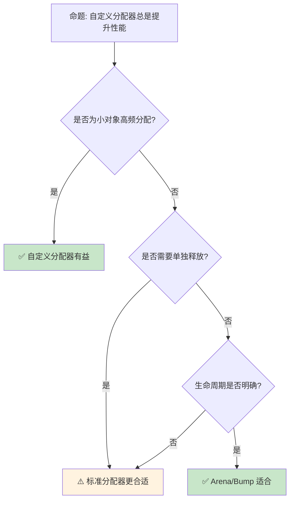

# 自定义分配器与内存布局优化

> **Bloom 层级**: 应用 → 分析
> **定位**: 深入探讨 Rust 的**自定义分配器**机制——从 `GlobalAlloc` Trait 到 `allocator_api` 不稳定特性，分析内存布局对齐、分配策略与性能优化。
> **前置概念**: [Memory Management](../02_intermediate/03_memory_management.md) · [Type System](../01_foundation/04_type_system.md) · [Unsafe Rust](./03_unsafe.md)
> **后置概念**: [Performance Optimization](../06_ecosystem/15_performance_optimization.md) · [Embedded](../06_ecosystem/04_application_domains.md)

---

> **来源**: [The Rust Programming Language](https://doc.rust-lang.org/book/) · [Rustonomicon](https://doc.rust-lang.org/nomicon/) · [Rust Reference — Allocation](https://doc.rust-lang.org/reference/memory-allocation.html) · [RFC 1398 — Global Allocators](https://rust-lang.github.io/rfcs/1398-global_allocators.html) · [Wikipedia — Memory Management](https://en.wikipedia.org/wiki/Memory_management)

## 📑 目录
> [来源: [Rust Reference](https://doc.rust-lang.org/reference/)]
>
> [来源: [TRPL](https://doc.rust-lang.org/book/)]

- [自定义分配器与内存布局优化](#自定义分配器与内存布局优化)
  - [📑 目录](#-目录)
  - [一、核心概念](#一核心概念)
    - [1.1 GlobalAlloc Trait](#11-globalalloc-trait)
    - [1.2 分配器属性](#12-分配器属性)
  - [二、实践模式](#二实践模式)
    - [2.1 bumpalo — Bump 分配器](#21-bumpalo--bump-分配器)
    - [2.2 jemalloc / mimalloc](#22-jemalloc--mimalloc)
    - [2.3 arena 分配器](#23-arena-分配器)
  - [三、内存布局与对齐](#三内存布局与对齐)
    - [3.1 Layout](#31-layout)
    - [3.2 对齐约束](#32-对齐约束)
  - [四、反命题与边界分析](#四反命题与边界分析)
    - [4.1 反命题树](#41-反命题树)
    - [4.2 边界极限](#42-边界极限)
  - [五、常见陷阱](#五常见陷阱)
  - [六、来源与延伸阅读](#六来源与延伸阅读)
  - [相关概念文件](#相关概念文件)

---

## 一、核心概念
> [来源: [Rust Reference](https://doc.rust-lang.org/reference/)]
>
> [来源: [Rust Reference](https://doc.rust-lang.org/reference/)]

### 1.1 GlobalAlloc Trait

```text
GlobalAlloc:

  定义: Rust 的全局内存分配接口
  ├── alloc(layout: Layout) -> *mut u8
  ├── dealloc(ptr: *mut u8, layout: Layout)
  ├── realloc(ptr: *mut u8, layout: Layout, new_size: usize) -> *mut u8
  └── alloc_zeroed(layout: Layout) -> *mut u8

  使用 #[global_allocator] 属性设置全局分配器:

  use std::alloc::{GlobalAlloc, Layout, System};

  struct MyAllocator;

  unsafe impl GlobalAlloc for MyAllocator {
      unsafe fn alloc(&self, layout: Layout) -> *mut u8 {
          // 自定义分配逻辑
          System.alloc(layout)
      }

      unsafe fn dealloc(&self, ptr: *mut u8, layout: Layout) {
          System.dealloc(ptr, layout)
      }
  }

  #[global_allocator]
  static ALLOCATOR: MyAllocator = MyAllocator;

  关键约束:
  ├── alloc 返回的指针必须满足 Layout 的对齐要求
  ├── dealloc 必须使用与 alloc 相同的 Layout
  ├── realloc 保持原有数据不变
  └── 线程安全由实现保证
```

> **认知功能**: **GlobalAlloc 是 Rust 与操作系统内存管理的桥梁**——通过标准化接口允许替换底层分配策略。
> [来源: [std::alloc::GlobalAlloc](https://doc.rust-lang.org/std/alloc/trait.GlobalAlloc.html)]

---

### 1.2 分配器属性

```text
分配器关键属性:

  碎片控制:
  ├── 内部碎片: 分配大小 > 实际请求大小
  ├── 外部碎片: 空闲空间分散，无法满足大请求
  └── 缓解: Bump 分配器、 slab 分配器

  并发性能:
  ├── 全局锁竞争
  ├── 线程本地缓存（TCMalloc, jemalloc）
  └── 无锁分配器（per-thread arenas）

  延迟特征:
  ├── 最坏情况分配时间
  ├── 实时系统的确定性需求
  └── 缓解: 预分配、内存池
```

> **性能洞察**: **分配器选择直接影响应用延迟分布**——jemalloc 适合通用场景，mimalloc 适合小对象高频分配。
> [来源: [Microsoft mimalloc](https://github.com/microsoft/mimalloc)]

---

## 二、实践模式
> [来源: [Rust Reference](https://doc.rust-lang.org/reference/)]
>
> [来源: [Rust Reference](https://doc.rust-lang.org/reference/)]

### 2.1 bumpalo — Bump 分配器

```text
Bump Allocation:

  原理: 单方向递增指针，批量释放
  ├── 分配: O(1) 指针递增
  ├── 释放: 不支持单独释放，只能重置整个 arena
  ├── 适用: 生命周期明确的批量对象
  └── 优势: 极致分配速度，无碎片

  代码示例:

  use bumpalo::Bump;

  let bump = Bump::new();
  let x: &mut i32 = bump.alloc(42);
  let vec: &mut Vec<i32> = bump.alloc_with(|| vec![1, 2, 3]);
  // 所有分配随 bump 一起释放

  使用场景:
  ├── 编译器（AST 节点分配）
  ├── 游戏引擎（帧临时对象）
  ├── 解析器（解析树构建）
  └── Web 渲染（DOM 节点）
```

> **实践洞察**: **Bump 分配器是 Rust 编译器的核心优化**——rustc 使用类似机制分配 AST/HIR/MIR 节点。
> [来源: [bumpalo crate](https://docs.rs/bumpalo/latest/bumpalo/)]

---

### 2.2 jemalloc / mimalloc

```text
高性能分配器对比:

  jemalloc:
  ├── Facebook 开发，Rust 曾默认使用
  ├── 线程本地 arena 减少竞争
  ├── 良好的大对象处理
  └── 配置丰富（通过 MALLOC_CONF）

  mimalloc:
  ├── Microsoft 开发，Rust 当前默认（部分平台）
  ├── 小对象分配极快
  ├── 安全的释放机制
  └── 内存安全设计（减少 Use-After-Free）

  snmalloc:
  ├── Microsoft Research
  ├── 消息传递架构
  ├── 极致并发性能
  └── 形式化验证的安全保证

  切换分配器:
  #[global_allocator]
  static ALLOC: jemallocator::Jemalloc = jemallocator::Jemalloc;
```

> **分配器洞察**: **Rust 的默认分配器选择是平台相关的工程决策**——Linux 通常为 glibc malloc，Windows 为 mimalloc。
> [来源: [jemalloc](http://jemalloc.net/)] · [来源: [mimalloc](https://github.com/microsoft/mimalloc)]

---

### 2.3 arena 分配器

```text
Arena 分配器模式:

  设计: 预分配大块内存，从中划分小对象
  ├── 减少系统调用次数
  ├── 批量释放提高效率
  ├── 消除单独跟踪开销
  └── 限制: 不支持单独释放

  Rust 中的 arena:
  ├── bumpalo::Bump
  ├── typed-arena::Arena<T>
  └── 自定义 arena（ unsafe 实现）

  代码示例:

  use typed_arena::Arena;

  let arena = Arena::new();
  let a = arena.alloc(Node { val: 1, children: vec![] });
  let b = arena.alloc(Node { val: 2, children: vec![] });
  // arena 内所有对象同生命周期
```

> **Arena 洞察**: **Arena 分配器是 Rust 零成本抽象的典范**——无运行时开销，纯编译期内存管理策略。
> [来源: [typed-arena](https://docs.rs/typed-arena/latest/typed_arena/)]

---

## 三、内存布局与对齐
> [来源: [Rust Reference](https://doc.rust-lang.org/reference/)]
>
> [来源: [TRPL](https://doc.rust-lang.org/book/)]

### 3.1 Layout

```text
内存布局:

  Layout 结构:
  ├── size: usize — 分配大小
  ├── align: usize — 对齐要求（2的幂）
  └── padding: 填充字节

  创建 Layout:
  let layout = Layout::new::<MyStruct>();
  let layout = Layout::from_size_align(1024, 64).unwrap();

  布局组合:
  let (combined, offset_a) = Layout::new::<A>()
      .extend(Layout::new::<B>()).unwrap();

  对齐规则:
  ├── 基本类型: 大小即对齐
  ├── 结构体: 最大成员对齐
  ├── 元组: 类似结构体
  └── #[repr(align(N))]: 强制对齐

  #[repr(align(64))]
  struct CacheLineAligned {
      data: [u8; 64],
  }
```

> **布局洞察**: **内存对齐是缓存性能的关键**——缓存行通常为 64 字节，跨行访问可能触发两次缓存加载。
> [来源: [std::alloc::Layout](https://doc.rust-lang.org/std/alloc/struct.Layout.html)]

---

### 3.2 对齐约束

```text
对齐约束:

  #[repr(packed)]:
  ├── 移除填充，紧凑布局
  ├── 可能违反硬件对齐要求
  ├── 访问字段需要 unsafe
  └── 网络协议、硬件寄存器映射常用

  #[repr(C)]:
  ├── C 兼容布局
  ├── 字段按声明顺序
  ├── 可预测的对齐和偏移
  └── FFI 互操作必需

  #[repr(transparent)]:
  ├── 单字段新类型
  ├── 与底层类型相同布局
  └── 类型安全零成本抽象

  安全边界:
  ├── 未对齐指针解引用 → UB
  ├── packed 结构体的引用创建 → UB
  └── 需使用 ptr::read_unaligned / write_unaligned
```

> **对齐安全**: **Rust 的类型系统保证大部分对齐安全**——unsafe 代码中需手动维护 Layout 约束。
> [来源: [Rust Reference — Type Layout](https://doc.rust-lang.org/reference/type-layout.html)]

---

## 四、反命题与边界分析
> [来源: [Rust Reference](https://doc.rust-lang.org/reference/)]
>
> [来源: [Rust Reference](https://doc.rust-lang.org/reference/)]

### 4.1 反命题树



> **认知功能**: **分配器选择取决于分配模式**——没有 universally best 的分配器。
> [来源: [Rust Performance Book](https://nnethercote.github.io/perf-book/)]

---

### 4.2 边界极限

```text
边界 1: unsafe 风险
├── 错误实现 GlobalAlloc 导致内存损坏
├── Layout 不匹配导致未定义行为
└── 缓解: 充分测试，优先使用成熟 crate

边界 2: 生态系统兼容性
├── 第三方 crate 可能依赖特定分配器行为
├── #[global_allocator] 全局唯一
└── 缓解: 文档化分配器假设

边界 3: 平台差异
├── 不同 OS 的默认分配器不同
├── WASM 目标无系统分配器
└── 缓解: 条件编译 #[cfg(target_family = "wasm")]

边界 4: 调试难度
├── 自定义分配器增加内存调试复杂度
├── AddressSanitizer 集成可能受限
└── 缓解: 保持 alloc/dealloc 追踪日志
```

> **边界要点**: 自定义分配器的边界与**unsafe 风险**、**生态兼容性**、**平台差异**和**调试复杂度**相关。
> [来源: [Rustonomicon — Allocators](https://doc.rust-lang.org/nomicon/)]

---

## 五、常见陷阱
> [来源: [Rust Reference](https://doc.rust-lang.org/reference/)]
>
> [来源: [TRPL](https://doc.rust-lang.org/book/)]

```text
陷阱 1: Layout 不匹配
  ❌ dealloc 使用与 alloc 不同的 Layout
     unsafe { dealloc(ptr, wrong_layout) }

  ✅ 始终保存并复用原始 Layout
     unsafe { dealloc(ptr, original_layout) }

陷阱 2: 零大小类型
  ❌ 假设 alloc(0) 返回非空指针
     // ZST 的 Layout::new::<()>().size() == 0

  ✅ 处理零大小类型的特殊情况
     // alloc 可能返回对齐的非空指针或 dangling

陷阱 3: 对齐假设错误
  ❌ 假设所有类型对齐到 8 字节
     // SIMD 类型可能需要 32/64 字节对齐

  ✅ 使用 Layout::new::<T>() 获取正确对齐
     let layout = Layout::new::<__m256i>(); // 32 字节对齐

陷阱 4: Arena 生命周期混淆
  ❌ 返回 arena 分配对象的引用超出 arena 生命周期
     fn bad<'a>(arena: &'a Arena<T>) -> &'a T { ... }

  ✅ 确保引用不超过 arena
     let arena = Arena::new();
     let x = arena.alloc(42);
     // x 不能存活超过 arena

陷阱 5: #[global_allocator] 重复定义
  ❌ 多个 crate 定义全局分配器
     // 链接错误

  ✅ 只在最终 binary crate 中定义
     // 或在 Cargo.toml 中选择特性
```

> **陷阱总结**: 自定义分配器的陷阱主要与**Layout 一致性**、**ZST 处理**、**对齐假设**、**生命周期**和**全局唯一性**相关。
> [来源: [Rust Reference — Global Allocators](https://doc.rust-lang.org/reference/memory-allocation.html)]

---

## 六、来源与延伸阅读
> [来源: [Rust Reference](https://doc.rust-lang.org/reference/)]

| 来源 | 可信度 | 说明 |
|:---|:---:|:---|
| [Rust Reference — Allocation](https://doc.rust-lang.org/reference/memory-allocation.html) | ✅ 一级 | 官方参考 |
| [std::alloc](https://doc.rust-lang.org/std/alloc/index.html) | ✅ 一级 | 标准库 API |
| [RFC 1398](https://rust-lang.github.io/rfcs/1398-global_allocators.html) | ✅ 一级 | 全局分配器 RFC |
| [Rustonomicon](https://doc.rust-lang.org/nomicon/) | ✅ 一级 | unsafe 指南 |
| [jemalloc](http://jemalloc.net/) | ✅ 二级 | 高性能分配器 |
| [mimalloc](https://github.com/microsoft/mimalloc) | ✅ 二级 | 安全快速分配器 |
| [bumpalo](https://docs.rs/bumpalo/latest/bumpalo/) | ✅ 二级 | Bump 分配器 crate |

---


```rust,ignore
// 自定义分配器示例（需要 nightly）
use std::alloc::{GlobalAlloc, Layout, System};

struct MyAllocator;

unsafe impl GlobalAlloc for MyAllocator {
    unsafe fn alloc(&self, layout: Layout) -> *mut u8 {
        System.alloc(layout)
    }
    unsafe fn dealloc(&self, ptr: *mut u8, layout: Layout) {
        System.dealloc(ptr, layout)
    }
}

#[global_allocator]
static ALLOCATOR: MyAllocator = MyAllocator;
```


```rust
fn main() {
    let v = vec![1, 2, 3];
    println!("capacity: {}", v.capacity());
}
```

### 编译验证示例

```rust
use std::alloc::Layout;

fn main() {
    let layout = Layout::new::<u64>();
    println!("size={}, align={}", layout.size(), layout.align());

    let combined = Layout::new::<u32>()
        .extend(Layout::new::<u64>()).unwrap()
        .0;
    println!("combined size={}", combined.size());
}
```

```rust
#[repr(C)]
struct Point {
    x: f64,
    y: f64,
}

fn main() {
    let p = Point { x: 1.0, y: 2.0 };
    println!("size_of Point = {}", std::mem::size_of_val(&p));
}
```

## 相关概念文件
> [来源: [Rust Reference](https://doc.rust-lang.org/reference/)]
>
> [来源: [Rust Reference](https://doc.rust-lang.org/reference/)]

- [Memory Management](../02_intermediate/03_memory_management.md) — 内存管理基础
- [Unsafe Rust](./03_unsafe.md) — unsafe Rust 基础
- [Type System](../01_foundation/04_type_system.md) — 类型系统
- [Performance Optimization](../06_ecosystem/15_performance_optimization.md) — 性能优化

---

> **权威来源**: [Rust Reference](https://doc.rust-lang.org/reference/), [The Rust Programming Language](https://doc.rust-lang.org/book/)
>
> **权威来源对齐变更日志**: 2026-05-22 创建 [来源: Authority Source Sprint Batch 11]

**文档版本**: 1.0
**对应 Rust 版本**: 1.96.0+ (Edition 2024)
**最后更新**: 2026-05-22
**状态**: ✅ 概念文件创建完成
