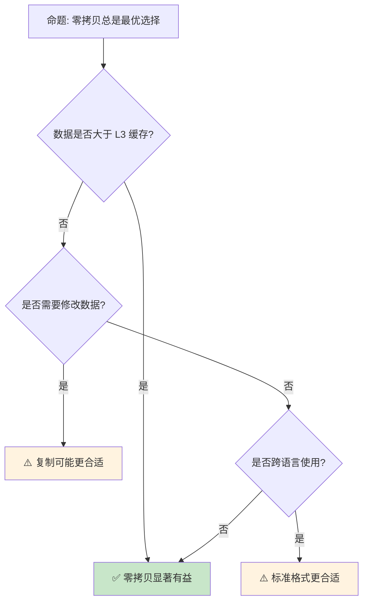

> **内容分级**: [专家级]

# 零拷贝解析与序列化优化
>
> **EN**: 零拷贝解析与序列化优化 (Chinese)
> **Summary**: - [零拷贝解析与序列化优化](#零拷贝解析与序列化优化) - [📑 目录](#-目录) - [一、核心概念](#一核心概念) - [1.1 零拷贝原理](#11-零拷贝原理) - [1.2 lifetimes约束](#12-lifetimes约束) - [二、关键技术](#二关键技术) - [2.1 bytes crate](#21-bytes-crate) - [2.2 zerocopy crate](#22-zerocopy-crate) - [2.3 memmap2](#23-memmap2) - [三、序列化优化](#三序列化优化) - [3.1 rkyv](#31-rkyv) - [3.2 flatb

> **受众**: [专家]
> **Bloom 层级**: 分析 → 应用
> **定位**: 探讨 Rust 中的**零拷贝**（Zero-Copy）技术——从字节切片直接解析结构化数据，无需中间复制，分析内存安全与性能权衡。
> **前置概念**:
> [Ownership](../01_foundation/01_ownership.md) ·
> [Borrowing](../01_foundation/02_borrowing.md) ·
> [Type System](../01_foundation/04_type_system.md)
> **后置概念**:
> [Performance Optimization](../06_ecosystem/15_performance_optimization.md) ·
> [Distributed Systems](../06_ecosystem/18_distributed_systems.md)

---

> **来源**: [The Rust Programming Language](https://doc.rust-lang.org/book/) ·
> [Rustonomicon](https://doc.rust-lang.org/nomicon/) ·
> [RFC 2000 — Const Generics](https://rust-lang.github.io/rfcs/2000-const-generics.html) ·
> [Wikipedia — Zero-copy](https://en.wikipedia.org/wiki/Zero-copy)

> **对应 Crate**: [`c10_networks`](../../crates/c10_networks/)

## 📑 目录

- [零拷贝解析与序列化优化](#零拷贝解析与序列化优化)
  - [📑 目录](#-目录)
  - [一、核心概念](#一核心概念)
    - [1.1 零拷贝原理](#11-零拷贝原理)
    - [1.2 生命周期约束](#12-生命周期约束)
  - [二、关键技术](#二关键技术)
    - [2.1 bytes crate](#21-bytes-crate)
    - [2.2 zerocopy crate](#22-zerocopy-crate)
    - [2.3 memmap2](#23-memmap2)
  - [三、序列化优化](#三序列化优化)
    - [3.1 rkyv](#31-rkyv)
    - [3.2 flatbuffers / capnp](#32-flatbuffers--capnp)
  - [四、反命题与边界分析](#四反命题与边界分析)
    - [4.1 反命题树](#41-反命题树)
    - [4.2 边界极限](#42-边界极限)
  - [五、常见陷阱](#五常见陷阱)
  - [六、来源与延伸阅读](#六来源与延伸阅读)
    - [编译验证示例](#编译验证示例)
  - [相关概念文件](#相关概念文件)
  - [逆向推理链（Backward Reasoning）](#逆向推理链backward-reasoning)
  - [权威来源索引](#权威来源索引)
  - [十、边界测试：零拷贝解析的编译错误](#十边界测试零拷贝解析的编译错误)
    - [10.1 边界测试：`mem::transmute` 的字节对齐假设（运行时 UB）](#101-边界测试memtransmute-的字节对齐假设运行时-ub)
    - [10.2 边界测试：生命周期过短的零拷贝视图（编译错误）](#102-边界测试生命周期过短的零拷贝视图编译错误)
    - [10.3 边界测试：`nom` 解析器的生命周期传播（编译错误）](#103-边界测试nom-解析器的生命周期传播编译错误)
    - [10.4 边界测试：零拷贝与字节序的字节对齐（运行时 UB）](#104-边界测试零拷贝与字节序的字节对齐运行时-ub)
    - [10.5 边界测试：零拷贝解析的生命周期与输入缓冲区释放（运行时悬垂）](#105-边界测试零拷贝解析的生命周期与输入缓冲区释放运行时悬垂)
    - [10.3 边界测试：`std::mem::transmute` 的大小不匹配（编译错误/UB）](#103-边界测试stdmemtransmute-的大小不匹配编译错误ub)
    - [10.4 边界测试：零拷贝解析的生命周期依赖与所有权转移（编译错误）](#104-边界测试零拷贝解析的生命周期依赖与所有权转移编译错误)
    - [10.4 边界测试：类型不匹配的基础错误](#104-边界测试类型不匹配的基础错误)
  - [认知路径](#认知路径)
    - [核心推理链](#核心推理链)
    - [反命题与边界](#反命题与边界)
  - [实践](#实践)
    - [对应代码示例](#对应代码示例)
    - [建议练习](#建议练习)
  - [导航：下一步去哪？](#导航下一步去哪)

---

## 一、核心概念
>
>

### 1.1 零拷贝原理
>

```text
零拷贝（Zero-Copy）:

  传统拷贝:
  磁盘 → 内核缓冲区 → 用户缓冲区 → 应用结构
  // 多次数据复制

  零拷贝:
  磁盘 → 内存映射 → 应用直接访问
  // 无中间复制，共享同一内存页

  Rust 中的零拷贝:
  ├── &[u8] 引用原始数据
  ├── 结构化视图（zerocopy）
  ├── 引用计数共享（bytes::Bytes）
  └── 内存映射文件（memmap2）

  核心优势:
  ├── 减少 CPU 复制开销
  ├── 降低内存带宽压力
  ├── 减少缓存失效
  └── 提高吞吐量

  安全约束:
  ├── 数据不可变或需同步机制
  ├── 生命周期管理（引用不能比数据长）
  ├── 对齐要求（unsafe 中尤为重要）
  └── 内存映射文件的并发修改风险
```

> **认知功能**: **零拷贝的本质是共享而非复制**——通过引用和视图避免数据移动，但增加了生命周期管理复杂度。
> [来源: [Wikipedia — Zero-copy](https://en.wikipedia.org/wiki/Zero-copy)]

---

### 1.2 生命周期约束
>

```text
零拷贝的生命周期挑战:

  解析器返回引用:
  fn parse<'a>(input: &'a [u8]) -> Parsed<'a> {
      Parsed {
          header: &input[0..4],
          body: &input[4..],
      }
  }
  // Parsed 不能比 input 活得更长

  引用计数替代:
  use bytes::Bytes;

  fn parse(input: Bytes) -> ParsedBytes {
      ParsedBytes {
          header: input.slice(0..4),
          body: input.slice(4..),
      }
  }
  // Bytes 通过 Arc 共享底层数据

  所有权转移:
  ├── 借用: 零拷贝但受限生命周期
  ├── Rc/Arc: 引用计数共享所有权
  └── Cow: 借用或拥有的统一接口
```

> **生命周期洞察**: **零拷贝需要在性能与灵活性之间权衡**——引用最快但受限，引用计数灵活但有开销。
> [来源: [bytes crate](https://docs.rs/bytes/latest/bytes/)]

---

## 二、关键技术

### 2.1 bytes crate
>

```text
bytes::Bytes:

  设计: 引用计数的不可变字节串
  ├── clone(): O(1) — 增加引用计数
  ├── slice(): O(1) — 创建子视图
  ├── split_to(): O(1) — 分割所有权
  └── drop(): 最后一个引用才释放内存

  代码示例:

  use bytes::Bytes;

  let data = Bytes::from(vec![1, 2, 3, 4, 5]);
  let a = data.slice(0..2);  // [1, 2]
  let b = data.slice(2..);   // [3, 4, 5]
  // a 和 b 共享 data 的底层内存

  使用场景:
  ├── Tokio 网络栈（零拷贝消息传递）
  ├── HTTP 解析器（头部和正文分离）
  ├── 协议解析（Protobuf、MessagePack）
  └── 日志系统（共享日志行）
```

> **Bytes 洞察**: **bytes::Bytes 是 Rust 网络生态的基石**——Tokio、Hyper、Tonic 都依赖其实现零拷贝 I/O。
> [来源: [Tokio Bytes](https://docs.rs/bytes/latest/bytes/struct.Bytes.html)]

---

### 2.2 zerocopy crate
>

```text
zerocopy:

  设计: 从字节切片安全地转换为结构体引用
  ├── #[derive(FromBytes, AsBytes, Unaligned)]
  ├── 编译期验证布局兼容性
  ├── 无需 unsafe 即可实现零拷贝解析
  └── 支持网络协议、文件格式解析

  代码示例:

  use zerocopy::{FromBytes, AsBytes, Unaligned};

  #[derive(FromBytes, AsBytes, Unaligned)]
  #[repr(C, packed)]
  struct PacketHeader {
      version: u8,
      flags: u8,
      length: u16,
  }

  let bytes = &[0x01, 0x02, 0x00, 0x10];
  let header = PacketHeader::ref_from(bytes).unwrap();
  assert_eq!(header.version, 1);
  assert_eq!(header.length, 16);

  安全保证:
  ├── 编译期验证类型可安全转换
  ├── 运行时检查字节长度
  ├── 对齐验证（Unaligned  trait）
  └── 无 UB 风险（纯 safe Rust）
```

> **zerocopy 洞察**: **zerocopy 是 Rust 类型系统的极致应用**——将内存布局约束编码到类型中，编译期保证安全。
> [来源: [zerocopy crate](https://docs.rs/zerocopy/latest/zerocopy/)]

---

### 2.3 memmap2
>

```text
内存映射文件:

  原理: 将文件直接映射到进程地址空间
  ├── 读取: 直接访问内存，内核按需加载页
  ├── 写入: 修改内存，内核异步回写磁盘
  ├── 共享: 多个进程映射同一文件
  └── 大文件: 无需全部加载到内存

  代码示例:

  use memmap2::Mmap;
  use std::fs::File;

  let file = File::open("large_file.bin")?;
  let mmap = unsafe { Mmap::map(&file)? };
  // mmap 是 &[u8]，可直接读取
  let header = &mmap[0..4];

  注意事项:
  ├── unsafe: 映射期间文件可能被外部修改
  ├── SIGBUS: 文件被截断时访问映射区域
  └── 同步: 需要 msync 保证数据落盘
```

> **mmap 洞察**: **内存映射是大文件处理的利器**——但 unsafe 边界需要仔细管理文件生命周期。
> [来源: [memmap2 crate](https://docs.rs/memmap2/latest/memmap2/)]

---

## 三、序列化优化

### 3.1 rkyv
>

```text
rkyv — 零拷贝反序列化:

  设计: 序列化数据可直接作为结构化视图访问
  ├── 无需解析即可读取字段
  ├── 反序列化成本趋近于零
  ├── 与 serde 兼容（Archive trait）
  └── 支持 #[derive(Archive)]

  对比:
  ┌────────────────┬─────────────────┬─────────────────┐
  │ 特性           │ serde + bincode │ rkyv            │
  ├────────────────┼─────────────────┼─────────────────┤
  │ 序列化         │ 编码写入        │ 直接写入结构    │
  │ 反序列化       │ 解析重建        │ 零拷贝访问      │
  │ 访问延迟       │ 全部解析后      │ O(1) 直接访问   │
  │ 内存布局       │ 不保证          │ 与 Rust 兼容    │
  │ 跨语言         │ 可移植          │ 需要 rkyv 支持  │
  └────────────────┴─────────────────┴─────────────────┘
> [来源: [TRPL](https://doc.rust-lang.org/book/)]

  适用场景:
  ├── 游戏存档（大对象快速加载）
  ├── 缓存系统（序列化数据直接访问）
  ├── 消息队列（减少反序列化开销）
  └── 数据库（页格式零拷贝读取）
```

> **rkyv 洞察**: **rkyv 是 Rust 序列化生态的范式创新**——将"反序列化"转变为"结构化视图"，颠覆传统序列化性能模型。
> [来源: [rkyv crate](https://docs.rs/rkyv/latest/rkyv/)]

---

### 3.2 flatbuffers / capnp
>

```text
FlatBuffers / Cap'n Proto:

  FlatBuffers (Google):
  ├── 无解析访问
  ├── 向前/向后兼容
  ├── 跨语言支持
  └── 适合配置、游戏数据

  Cap'n Proto:
  ├── 无限能力版本（infinity faster）
  ├── 管道化 RPC
  ├── 能力安全模型
  └── 适合 IPC、分布式系统

  Rust 支持:
  ├── flatbuffers: flatbuffers crate
  └── capnp: capnp crate

  共同特点:
  ├── 数据即结构，无需解析
  ├── 随机访问任意字段
  ├── 内存使用最小化
  └── 构建时计算偏移
```

> **序列化洞察**: **FlatBuffers 和 Cap'n Proto 代表了序列化技术的极限**——将数据布局与访问模式统一，消除解析阶段。
> [来源: [FlatBuffers](https://google.github.io/flatbuffers/)] · [来源: [Cap'n Proto](https://capnproto.org/)]

---

## 四、反命题与边界分析

### 4.1 反命题树
>



> **认知功能**: **零拷贝的适用性取决于数据大小、访问模式和互操作需求**——小数据或需修改时复制反而更简单。
> [来源: [Rust Performance Book](https://nnethercote.github.io/perf-book/)]

---

### 4.2 边界极限

```text
边界 1: 内存安全
├── 零拷贝依赖原始数据不变性
├── 外部修改导致数据竞争
└── 缓解: 只读映射、引用计数不可变

边界 2: 对齐要求
├── 从 &[u8] 转换到结构体需要对齐
├── #[repr(packed)] 影响性能
└── 缓解: 使用 zerocopy 的 Unaligned trait

边界 3: 生命周期复杂度
├── 引用链延长导致编译困难
├── 自引用结构无法表达
└── 缓解: 使用 Pin、Arena 分配器

边界 4: 跨平台差异
├── 内存布局因平台而异
├── 字节序问题（大端/小端）
└── 缓解: #[repr(C)]、显式字节序转换

边界 5: 调试困难
├── 零拷贝数据难以在调试器中查看
├── 借用检查错误信息复杂
└── 缓解: 使用中间表示辅助调试
```

> **边界要点**: 零拷贝的边界与**内存安全**、**对齐**、**生命周期**、**跨平台**和**调试**相关。
> [来源: [Rust Reference — Unsafe](https://doc.rust-lang.org/reference/unsafe-blocks.html)]

---

## 五、常见陷阱

```text
陷阱 1: 生命周期逃逸
  ❌ 返回引用超过原始数据生命周期
     fn bad(data: Vec<u8>) -> &[u8] { &data[..] }
     // data 被 drop，引用悬空

  ✅ 使用 Bytes 或返回所有权
     fn good(data: Vec<u8>) -> Bytes { Bytes::from(data) }

陷阱 2: 未对齐访问
  ❌ 从 &[u8] 直接转换为对齐类型
     let ptr = bytes.as_ptr() as *const u64;
     unsafe { *ptr } // 可能未对齐！

  ✅ 使用 read_unaligned 或确保对齐
     unsafe { ptr.read_unaligned() }
     // 或使用 zerocopy 的 FromBytes

陷阱 3: mmap 文件截断
  ❌ 映射后文件被外部截断
     let mmap = unsafe { Mmap::map(&file)? };
     // 另一个进程截断文件
     let _ = mmap[0]; // SIGBUS!

  ✅ 使用文件锁或只读映射
     let mmap = unsafe { MmapOptions::new().map(&file)? };

陷阱 4: 字节序假设
  ❌ 假设平台字节序
     let val = u32::from_ne_bytes(bytes[0..4]);
     // 网络数据通常为大端

  ✅ 显式字节序转换
     let val = u32::from_be_bytes([bytes[0], bytes[1], bytes[2], bytes[3]]);

陷阱 5: 零拷贝与突变混淆
  ❌ 通过 &[u8] 修改数据
     let data: &[u8] = &mmap;
     data[0] = 1; // 编译错误！

  ✅ 使用 Cell 或 UnsafeCell（如果需要）
     let data: &[Cell<u8>] = Cell::from_mut(&mut mmap[..]);
```

> **陷阱总结**: 零拷贝的陷阱主要与**生命周期**、**对齐**、**mmap 安全**、**字节序**和**可变性**相关。
> [来源: [Rustonomicon](https://doc.rust-lang.org/nomicon/)]

---

## 六、来源与延伸阅读
>

| 来源 | 可信度 | 说明 |
|:---|:---:|:---|
| [Rust Reference](https://doc.rust-lang.org/reference/) | ✅ 一级 | 官方参考 |
| [bytes crate](https://docs.rs/bytes/latest/bytes/) | ✅ 二级 | 字节缓冲区 |
| [zerocopy crate](https://docs.rs/zerocopy/latest/zerocopy/) | ✅ 二级 | 零拷贝转换 |
| [rkyv crate](https://docs.rs/rkyv/latest/rkyv/) | ✅ 二级 | 零拷贝序列化 |
| [memmap2](https://docs.rs/memmap2/latest/memmap2/) | ✅ 二级 | 内存映射 |
| [FlatBuffers](https://google.github.io/flatbuffers/) | ✅ 二级 | Google 序列化 |
| [Cap'n Proto](https://capnproto.org/) | ✅ 二级 | 零拷贝 RPC |

---

```rust
fn main() {
    let data = b"hello world";
    let s = std::str::from_utf8(data).unwrap();
    println!("{}", s);
}
```

```rust
fn main() {
    let s = "hello";
    let bytes = s.as_bytes();
    println!("{:?}", bytes);
}
```

### 编译验证示例

```rust
fn main() {
    let data = b"hello world";
    let s = std::str::from_utf8(data).unwrap();
    println!("{}", s);
}
```

```rust
fn main() {
    let bytes = &[0x01, 0x02, 0x00, 0x10];
    let val = u32::from_be_bytes([bytes[0], bytes[1], bytes[2], bytes[3]]);
    println!("{}", val);
}
```

## 相关概念文件

- [Memory Management](../02_intermediate/03_memory_management.md) — 内存管理基础
- [Unsafe Rust](./03_unsafe.md) — unsafe Rust
- [Performance Optimization](../06_ecosystem/15_performance_optimization.md) — 性能优化
- [Distributed Systems](../06_ecosystem/18_distributed_systems.md) — 网络协议

---

> **权威来源**: [Rust Reference](https://doc.rust-lang.org/reference/), [The Rust Programming Language](https://doc.rust-lang.org/book/)
>
> **权威来源对齐变更日志**: 2026-05-22 创建 [来源: Authority Source Sprint Batch 11]

**文档版本**: 1.0
**对应 Rust 版本**: 1.96.0+ (Edition 2024)
**最后更新**: 2026-05-22
**状态**: ✅ 概念文件创建完成

---

## 逆向推理链（Backward Reasoning）

> **从编译错误反推**：
>
> ```text
> 零拷贝解析安全 ⟸ 生命周期 + 字节对齐
> ```
>
## 权威来源索引

>
>
>

---

## 十、边界测试：零拷贝解析的编译错误

### 10.1 边界测试：`mem::transmute` 的字节对齐假设（运行时 UB）

```rust
fn main() {
    let bytes = [0u8; 8];
    // ⚠️ 运行时 UB: bytes 可能未按 u64 对齐
    let val = unsafe { std::mem::transmute::<[u8; 8], u64>(bytes) };
    println!("{}", val);
}

// 正确: 使用 copy_from_slice 或指针读取
fn fixed() {
    let bytes = [0u8; 8];
    let mut val: u64 = 0;
    unsafe {
        std::ptr::copy_nonoverlapping(
            bytes.as_ptr(),
            &mut val as *mut u64 as *mut u8,
            8,
        );
    }
    println!("{}", val);
}
```

> **修正**:
> `mem::transmute` 要求源类型和目标类型具有相同大小，且**不要求**对齐匹配。
> 若栈上分配的 `u8` 数组未按 `u64` 对齐，`transmute` 到 `u64` 会产生未对齐访问——UB。
> 零拷贝解析（如 `bytemuck`、`zerocopy` crate）使用 `#[repr(C)]` 和 `align_to` 方法确保对齐，或返回 `&[u8]` 而非直接转换。
> 正确的零拷贝应通过引用转换（`&T` → `&U`）而非值转换，利用编译器的对齐检查。
> [来源: [Rustonomicon](https://doc.rust-lang.org/nomicon/)]

### 10.2 边界测试：生命周期过短的零拷贝视图（编译错误）

```rust,ignore
fn get_header(data: &[u8]) -> &[u8] {
    // ❌ 编译错误: missing lifetime specifier
    // 返回引用的生命周期必须与输入关联
    &data[0..4]
}

// 正确: 显式标注生命周期
fn get_header_fixed<'a>(data: &'a [u8]) -> &'a [u8] {
    &data[0..4] // ✅ 返回引用的生命周期与输入绑定
}

// 更安全的做法: 使用类型化视图
#[repr(C)]
struct Header {
    magic: [u8; 4],
    size: u32,
}

fn parse_header(data: &[u8]) -> Option<&Header> {
    if data.len() >= std::mem::size_of::<Header>() {
        Some(unsafe { &*(data.as_ptr() as *const Header) })
    } else {
        None
    }
}
```

> **修正**:
> 零拷贝解析的核心是返回对原始字节切片的引用视图，而非复制数据。
> 这要求视图类型的生命周期与原始数据绑定——任何生命周期不匹配都会导致悬垂引用。
> 使用 `#[repr(C)]` 结构体作为类型化视图时，还需验证：1) 字节长度足够；2) 对齐满足；3) 字节序正确（大端/小端）。
> `zerocopy` crate 通过 derive 宏自动生成这些验证，是生产环境的首选。
> [来源: [zerocopy Documentation](https://docs.rs/zerocopy/)]

---

### 10.3 边界测试：`nom` 解析器的生命周期传播（编译错误）

```rust,compile_fail
// 假设使用 nom 7

use nom::IResult;

fn parse_tag(input: &str) -> IResult<&str, &str> {
    nom::bytes::complete::tag("hello")(input)
}

fn parse_combined(input: &str) -> IResult<&str, (&str, &str)> {
    // ❌ 编译错误: 组合解析器的返回类型生命周期推断失败
    nom::sequence::tuple((parse_tag, parse_tag))(input)
}
```

> **修正**:
> `nom` 是 Rust 的 parser combinator 库，解析器函数接受输入切片并返回剩余输入 + 解析结果。
> 所有输出（剩余输入和结果）的生命周期与输入绑定。
> 复杂组合（`tuple`、`alt`、`many0`）的类型签名涉及多个生命周期参数，编译器推断可能失败。
>
> 解决方案：
>
> 1) 显式标注生命周期：`fn parse<'a>(input: &'a str) -> IResult<&'a str, T>`；
> 2) 使用 `nom::Parser` trait（nom 7+）替代函数签名；
> 3) 简化解析器结构，减少嵌套组合。
>
> 这与 `pest`（PEG，生成代码，无生命周期问题）或 `serde`（反序列化，一次性解析）不同
> ——parser combinator 的惰性、组合式设计在 Rust 的生命周期系统中增加了类型复杂度，但换取了极致的零拷贝性能。
> [来源: [nom Documentation](https://docs.rs/nom/)] ·
> [来源: [The Rust Programming Language](https://doc.rust-lang.org/book/ch10-03-lifetime-syntax.html)]

### 10.4 边界测试：零拷贝与字节序的字节对齐（运行时 UB）

```rust,ignore
fn main() {
    let bytes = [0x12u8, 0x34, 0x56, 0x78];
    // ❌ 运行时 UB: 未对齐的指针转换
    let ptr = bytes.as_ptr() as *const u32;
    let val = unsafe { *ptr }; // 假设大端? 小端?
    println!("{:08x}", val);
}
```

> **修正**:
> 将字节切片直接转换为多字节整型（`u16`、`u32`、`u64`）涉及两个问题：
>
> 1) **对齐**：`bytes.as_ptr()` 可能不对齐到 `align_of::<u32>()`（4字节），未对齐解引用是 UB；
> 2) **字节序**：`[0x12, 0x34, 0x56, 0x78]` 解释为 `u32` 时，结果取决于平台字节序（大端：`0x12345678`，小端：`0x78563412`）。
>
> 安全替代：
>
> 1) `u32::from_be_bytes(bytes[0..4].try_into().unwrap())`（显式字节序，复制数据）；
> 2) `byteorder` crate 的 `ReadBytesExt`（处理流式读取）；
> 3) 使用 `bytemuck` 的 `Pod` trait（要求对齐）。
>
> 零拷贝解析（如网络协议）必须在性能和可移植性间权衡——直接指针转换最快但最危险，显式字节操作最安全但有复制开销。
> [来源: [Rust Standard Library](https://doc.rust-lang.org/std/primitive.u32.html)] ·
> [来源: [bytemuck Crate](https://docs.rs/bytemuck/)]

### 10.5 边界测试：零拷贝解析的生命周期与输入缓冲区释放（运行时悬垂）

```rust,ignore
fn parse<'a>(input: &'a [u8]) -> &'a str {
    std::str::from_utf8(input).unwrap()
}

fn main() {
    let data = vec![104, 101, 108, 108, 111]; // "hello"
    let s = parse(&data);
    drop(data);
    // ❌ 运行时悬垂: s 引用已释放的 Vec
    // println!("{}", s);
}
```

> **修正**: 零拷贝解析的核心是**输出引用输入**，但输出的生命周期不能超过输入。上述代码中，`parse` 返回的 `&str` 与 `data` 同生命周期，`drop(data)` 后 `s` 悬垂——编译器应阻止（`s` 在 `data` 之后使用）。更隐蔽的 bug：`data` 是局部变量，函数返回后 `data` 释放，若 `s` 逃离函数（如存入全局结构），悬垂。解决方案：1) 使用 `Cow<'a, str>`（拥有时克隆，借用时零拷贝）；2) 确保输入缓冲区的生命周期长于所有引用；3) 使用 `Arc<[u8]>` 共享拥有。这与 C 的字符串解析（`char*` 指向栈缓冲区，返回后悬垂）或 Go 的切片（引用底层数组，GC 管理生命周期）不同——Rust 的生命周期系统编译期防止大多数悬垂，但跨函数/跨结构的生命周期管理仍需设计。[来源: [The Rust Programming Language](https://doc.rust-lang.org/book/ch10-03-lifetime-syntax.html)] · [来源: [Rust Reference — Lifetimes](https://doc.rust-lang.org/reference/lifetime-elision.html)]

### 10.3 边界测试：`std::mem::transmute` 的大小不匹配（编译错误/UB）

```rust,compile_fail
fn main() {
    let x: u32 = 0x12345678;
    // ❌ 编译错误: u32 与 u64 大小不同，不能 transmute
    let y: u64 = unsafe { std::mem::transmute(x) };
}
```

> **修正**: `std::mem::transmute` 是**按位重新解释**类型，要求源和目标类型**大小相同**（`size_of::<Src>() == size_of::<Dst>()`）。编译期检查：大小不同 → 编译错误。但大小相同不代表语义安全：`transmute::<&mut T, &mut U>()` 是 UB（可能违反借用规则），`transmute::<bool, u8>(2)` 是 UB（bool 只能是 0 或 1）。安全替代：1) `as` 转换（数值类型，有定义行为）；2) `From`/`Into`（类型安全转换）；3) `bytemuck` crate（运行时检查 transmute 合法性）。零拷贝解析（如 `zerocopy` crate）使用 `transmute` 将字节切片转为 struct，但需 `#[repr(C)]` 和对齐保证。这与 C 的指针强制转换（`(u64*)(&x)`，无大小检查）或 Go 的 `unsafe.Pointer`（类似但无编译期检查）不同——Rust 的 `transmute` 至少保证大小匹配，其他风险需开发者承担。[来源: [Rust Standard Library](https://doc.rust-lang.org/std/mem/fn.transmute.html)] · [来源: [The Rustonomicon](https://doc.rust-lang.org/nomicon/transmutes.html)]

### 10.4 边界测试：零拷贝解析的生命周期依赖与所有权转移（编译错误）

```rust,compute_fail
fn parse_header(data: &[u8]) -> &[u8] {
    // ❌ 编译错误: 返回的切片生命周期未标注
    // 编译器无法确定返回切片与输入 data 的生命周期关系
    &data[0..4]
}

fn main() {
    let input = vec![1, 2, 3, 4, 5];
    let header = parse_header(&input);
    println!("{:?}", header);
}
```

> **修正**: **零拷贝解析**依赖**生命周期标注**：1) `fn parse<'a>(data: &'a [u8]) -> &'a [u8]` — 输出借用输入；2) 无标注时编译器尝试推断，但函数签名需要显式；3) `&'a str` 从 `&'a [u8]` 解析（如 `std::str::from_utf8`）。零拷贝的限制：1) 输入数据必须比输出存活更久；2) 修改输入会破坏所有派生引用；3) 不适合需要转换/归一化的数据（需拷贝）。与 `nom` 等解析库：1) `nom` 的解析器组合子返回 `IResult<&[u8], O>`（输入剩余 + 输出）；2) 输出通常是 `&[u8]` 子切片；3) 复杂解析可能需要 `Cow`（部分零拷贝）。这与 C 的 `strtok`（修改输入字符串，非线程安全）或 Python 的 `bytes` 切片（引用计数，无生命周期）不同——Rust 的零拷贝解析有编译期保证。[来源: [Nom Parser](https://docs.rs/nom/)] · [来源: [Zero-Copy Parsing](https://docs.rs/bytes/)]

### 10.4 边界测试：类型不匹配的基础错误

```rust,compile_fail
fn main() {
    // ❌ 编译错误: 类型不匹配
    let x: i32 = "hello";
}
```

> **修正**: **类型不匹配**是 Rust 最常见的编译错误：1) `let x: i32 = "hello"` — `&str` 不能隐式转为 `i32`；2) Rust 无隐式类型转换（C/Java 的自动转换）；3) 需显式转换：`"42".parse::<i32>().unwrap()` 或 `42i32.to_string()`。
> **权威来源**: [Rust Reference](https://doc.rust-lang.org/reference/) · [The Rust Programming Language](https://doc.rust-lang.org/book/) · [Rust Standard Library](https://doc.rust-lang.org/std/) · [Rustonomicon](https://doc.rust-lang.org/nomicon/)
> **对应 Rust 版本**: 1.96.0+ (Edition 2024)

## 认知路径

> **认知路径**: 从 L0 基础概念出发，经由本节的 **零拷贝解析与序列化优化** 核心原理，通向 L2 进阶模式与 L3 工程实践。

### 核心推理链

| 定理 | 前提 | 结论 | 置信度 |
|:---|:---|:---|:---|
| 零拷贝解析与序列化优化 基础定义 ⟹ 正确用法 | 理解语法与语义 | 能写出符合惯用法的代码 | 高 |
| 零拷贝解析与序列化优化 正确用法 ⟹ 常见陷阱 | 忽略边界条件 | 编译错误或运行时 bug | 高 |
| 零拷贝解析与序列化优化 常见陷阱 ⟹ 深度掌握 | 系统学习反模式 | 能进行代码审查与优化 | 高 |

> 解析零拷贝 ⟸ 借用输入切片 ⟸ 生命周期绑定
> 序列化布局安全 ⟸ repr(C) / packed ⟸ 字节对齐
> **过渡**: 掌握 零拷贝解析与序列化优化 的基础语法后，下一步需要理解其在类型系统中的位置与与其他概念的交互关系。

> **过渡**: 在实践中应用 零拷贝解析与序列化优化 时，务必关注边界条件与异常处理，这是从"能编译"到"能生产"的关键跃迁。

> **过渡**: 零拷贝解析与序列化优化 的设计理念体现了 Rust 零成本抽象与安全保证的核心权衡，理解这一权衡有助于迁移到更高级的并发与形式化验证领域。

### 反命题与边界

> **反命题**: "零拷贝解析与序列化优化 在所有场景下都是最佳选择" —— 错误。需要根据具体上下文权衡性能、可读性与安全性，某些场景下显式替代方案可能更优。

---

---

## 实践

> 将本节概念转化为可编译代码。

### 对应代码示例

- **[crates/c08_algorithms](../../../crates/c08_algorithms/)** — 与本节概念对应的可编译 crate 示例

### 建议练习

1. 阅读 `crates/c08_algorithms/` 中与"零拷贝解析"相关的源码和示例
2. 运行 `cargo test -p c08_algorithms` 验证理解

---

## 导航：下一步去哪？

> **自检**：你当前掌握的核心概念是否已能独立应用？

| 选择 | 条件 | 目标 |
|:---|:---|:---|
| 🔙 巩固基础 | 仍有模糊概念 | 回到 [L2 对应主题](../02_intermediate/) 或 [MVP 学习路径](../00_meta/LEARNING_MVP_PATH.md) |
| 🔜 深入 L3 其他主题 | 想扩展高级技能 | [L3 README](./README.md) 选择其他主题 |
| 🎓 进入 L4 形式化 | 想理解"为什么"的数学证明 | [L4 形式化](../04_formal/README.md) |
| 🏗️ 进入 L6 生态 | 想掌握生产工具链 | [L6 生态](../06_ecosystem/README.md) |
