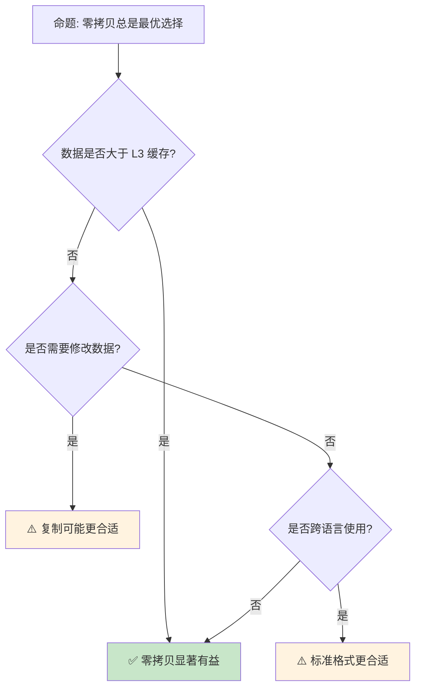

# 零拷贝解析与序列化优化

> **Bloom 层级**: 分析 → 应用
> **定位**: 探讨 Rust 中的**零拷贝**（Zero-Copy）技术——从字节切片直接解析结构化数据，无需中间复制，分析内存安全与性能权衡。
> **前置概念**: [Ownership](../01_foundation/01_ownership.md) · [Borrowing](../01_foundation/02_borrowing.md) · [Type System](../01_foundation/04_type_system.md)
> **后置概念**: [Performance Optimization](../06_ecosystem/15_performance_optimization.md) · [Distributed Systems](../06_ecosystem/18_distributed_systems.md)

---

> **来源**: [The Rust Programming Language](https://doc.rust-lang.org/book/) · [Rustonomicon](https://doc.rust-lang.org/nomicon/) · [RFC 2000 — Const Generics](https://rust-lang.github.io/rfcs/2000-const-generics.html) · [Wikipedia — Zero-copy](https://en.wikipedia.org/wiki/Zero-copy)

## 📑 目录

- [零拷贝解析与序列化优化](#零拷贝解析与序列化优化)
  - [📑 目录](#-目录)
  - [一、核心概念](#一核心概念)
    - [1.1 零拷贝原理](#11-零拷贝原理)
    - [1.2 生命周期约束](#12-生命周期约束)
  - [二、关键技术](#二关键技术)
    - [2.1 bytes crate](#21-bytes-crate)
    - [2.2 zerocopy crate](#22-zerocopy-crate)
    - [2.3 memmap2](#23-memmap2)
  - [三、序列化优化](#三序列化优化)
    - [3.1 rkyv](#31-rkyv)
    - [3.2 flatbuffers / capnp](#32-flatbuffers--capnp)
  - [四、反命题与边界分析](#四反命题与边界分析)
    - [4.1 反命题树](#41-反命题树)
    - [4.2 边界极限](#42-边界极限)
  - [五、常见陷阱](#五常见陷阱)
  - [六、来源与延伸阅读](#六来源与延伸阅读)
  - [相关概念文件](#相关概念文件)

---

## 一、核心概念

### 1.1 零拷贝原理

```text
零拷贝（Zero-Copy）:

  传统拷贝:
  磁盘 → 内核缓冲区 → 用户缓冲区 → 应用结构
  // 多次数据复制

  零拷贝:
  磁盘 → 内存映射 → 应用直接访问
  // 无中间复制，共享同一内存页

  Rust 中的零拷贝:
  ├── &[u8] 引用原始数据
  ├── 结构化视图（zerocopy）
  ├── 引用计数共享（bytes::Bytes）
  └── 内存映射文件（memmap2）

  核心优势:
  ├── 减少 CPU 复制开销
  ├── 降低内存带宽压力
  ├── 减少缓存失效
  └── 提高吞吐量

  安全约束:
  ├── 数据不可变或需同步机制
  ├── 生命周期管理（引用不能比数据长）
  ├── 对齐要求（unsafe 中尤为重要）
  └── 内存映射文件的并发修改风险
```

> **认知功能**: **零拷贝的本质是共享而非复制**——通过引用和视图避免数据移动，但增加了生命周期管理复杂度。
> [来源: [Wikipedia — Zero-copy](https://en.wikipedia.org/wiki/Zero-copy)]

---

### 1.2 生命周期约束

```text
零拷贝的生命周期挑战:

  解析器返回引用:
  fn parse<'a>(input: &'a [u8]) -> Parsed<'a> {
      Parsed {
          header: &input[0..4],
          body: &input[4..],
      }
  }
  // Parsed 不能比 input 活得更长

  引用计数替代:
  use bytes::Bytes;

  fn parse(input: Bytes) -> ParsedBytes {
      ParsedBytes {
          header: input.slice(0..4),
          body: input.slice(4..),
      }
  }
  // Bytes 通过 Arc 共享底层数据

  所有权转移:
  ├── 借用: 零拷贝但受限生命周期
  ├── Rc/Arc: 引用计数共享所有权
  └── Cow: 借用或拥有的统一接口
```

> **生命周期洞察**: **零拷贝需要在性能与灵活性之间权衡**——引用最快但受限，引用计数灵活但有开销。
> [来源: [bytes crate](https://docs.rs/bytes/latest/bytes/)]

---

## 二、关键技术

### 2.1 bytes crate

```text
bytes::Bytes:

  设计: 引用计数的不可变字节串
  ├── clone(): O(1) — 增加引用计数
  ├── slice(): O(1) — 创建子视图
  ├── split_to(): O(1) — 分割所有权
  └── drop(): 最后一个引用才释放内存

  代码示例:

  use bytes::Bytes;

  let data = Bytes::from(vec![1, 2, 3, 4, 5]);
  let a = data.slice(0..2);  // [1, 2]
  let b = data.slice(2..);   // [3, 4, 5]
  // a 和 b 共享 data 的底层内存

  使用场景:
  ├── Tokio 网络栈（零拷贝消息传递）
  ├── HTTP 解析器（头部和正文分离）
  ├── 协议解析（Protobuf、MessagePack）
  └── 日志系统（共享日志行）
```

> **Bytes 洞察**: **bytes::Bytes 是 Rust 网络生态的基石**——Tokio、Hyper、Tonic 都依赖其实现零拷贝 I/O。
> [来源: [Tokio Bytes](https://docs.rs/bytes/latest/bytes/struct.Bytes.html)]

---

### 2.2 zerocopy crate

```text
zerocopy:

  设计: 从字节切片安全地转换为结构体引用
  ├── #[derive(FromBytes, AsBytes, Unaligned)]
  ├── 编译期验证布局兼容性
  ├── 无需 unsafe 即可实现零拷贝解析
  └── 支持网络协议、文件格式解析

  代码示例:

  use zerocopy::{FromBytes, AsBytes, Unaligned};

  #[derive(FromBytes, AsBytes, Unaligned)]
  #[repr(C, packed)]
  struct PacketHeader {
      version: u8,
      flags: u8,
      length: u16,
  }

  let bytes = &[0x01, 0x02, 0x00, 0x10];
  let header = PacketHeader::ref_from(bytes).unwrap();
  assert_eq!(header.version, 1);
  assert_eq!(header.length, 16);

  安全保证:
  ├── 编译期验证类型可安全转换
  ├── 运行时检查字节长度
  ├── 对齐验证（Unaligned  trait）
  └── 无 UB 风险（纯 safe Rust）
```

> **zerocopy 洞察**: **zerocopy 是 Rust 类型系统的极致应用**——将内存布局约束编码到类型中，编译期保证安全。
> [来源: [zerocopy crate](https://docs.rs/zerocopy/latest/zerocopy/)]

---

### 2.3 memmap2

```text
内存映射文件:

  原理: 将文件直接映射到进程地址空间
  ├── 读取: 直接访问内存，内核按需加载页
  ├── 写入: 修改内存，内核异步回写磁盘
  ├── 共享: 多个进程映射同一文件
  └── 大文件: 无需全部加载到内存

  代码示例:

  use memmap2::Mmap;
  use std::fs::File;

  let file = File::open("large_file.bin")?;
  let mmap = unsafe { Mmap::map(&file)? };
  // mmap 是 &[u8]，可直接读取
  let header = &mmap[0..4];

  注意事项:
  ├── unsafe: 映射期间文件可能被外部修改
  ├── SIGBUS: 文件被截断时访问映射区域
  └── 同步: 需要 msync 保证数据落盘
```

> **mmap 洞察**: **内存映射是大文件处理的利器**——但 unsafe 边界需要仔细管理文件生命周期。
> [来源: [memmap2 crate](https://docs.rs/memmap2/latest/memmap2/)]

---

## 三、序列化优化

### 3.1 rkyv

```text
rkyv — 零拷贝反序列化:

  设计: 序列化数据可直接作为结构化视图访问
  ├── 无需解析即可读取字段
  ├── 反序列化成本趋近于零
  ├── 与 serde 兼容（Archive trait）
  └── 支持 #[derive(Archive)]

  对比:
  ┌────────────────┬─────────────────┬─────────────────┐
  │ 特性           │ serde + bincode │ rkyv            │
  ├────────────────┼─────────────────┼─────────────────┤
  │ 序列化         │ 编码写入        │ 直接写入结构    │
  │ 反序列化       │ 解析重建        │ 零拷贝访问      │
  │ 访问延迟       │ 全部解析后      │ O(1) 直接访问   │
  │ 内存布局       │ 不保证          │ 与 Rust 兼容    │
  │ 跨语言         │ 可移植          │ 需要 rkyv 支持  │
  └────────────────┴─────────────────┴─────────────────┘

  适用场景:
  ├── 游戏存档（大对象快速加载）
  ├── 缓存系统（序列化数据直接访问）
  ├── 消息队列（减少反序列化开销）
  └── 数据库（页格式零拷贝读取）
```

> **rkyv 洞察**: **rkyv 是 Rust 序列化生态的范式创新**——将"反序列化"转变为"结构化视图"，颠覆传统序列化性能模型。
> [来源: [rkyv crate](https://docs.rs/rkyv/latest/rkyv/)]

---

### 3.2 flatbuffers / capnp

```text
FlatBuffers / Cap'n Proto:

  FlatBuffers (Google):
  ├── 无解析访问
  ├── 向前/向后兼容
  ├── 跨语言支持
  └── 适合配置、游戏数据

  Cap'n Proto:
  ├── 无限能力版本（infinity faster）
  ├── 管道化 RPC
  ├── 能力安全模型
  └── 适合 IPC、分布式系统

  Rust 支持:
  ├── flatbuffers: flatbuffers crate
  └── capnp: capnp crate

  共同特点:
  ├── 数据即结构，无需解析
  ├── 随机访问任意字段
  ├── 内存使用最小化
  └── 构建时计算偏移
```

> **序列化洞察**: **FlatBuffers 和 Cap'n Proto 代表了序列化技术的极限**——将数据布局与访问模式统一，消除解析阶段。
> [来源: [FlatBuffers](https://google.github.io/flatbuffers/)] · [来源: [Cap'n Proto](https://capnproto.org/)]

---

## 四、反命题与边界分析

### 4.1 反命题树



> **认知功能**: **零拷贝的适用性取决于数据大小、访问模式和互操作需求**——小数据或需修改时复制反而更简单。
> [来源: [Rust Performance Book](https://nnethercote.github.io/perf-book/)]

---

### 4.2 边界极限

```text
边界 1: 内存安全
├── 零拷贝依赖原始数据不变性
├── 外部修改导致数据竞争
└── 缓解: 只读映射、引用计数不可变

边界 2: 对齐要求
├── 从 &[u8] 转换到结构体需要对齐
├── #[repr(packed)] 影响性能
└── 缓解: 使用 zerocopy 的 Unaligned trait

边界 3: 生命周期复杂度
├── 引用链延长导致编译困难
├── 自引用结构无法表达
└── 缓解: 使用 Pin、Arena 分配器

边界 4: 跨平台差异
├── 内存布局因平台而异
├── 字节序问题（大端/小端）
└── 缓解: #[repr(C)]、显式字节序转换

边界 5: 调试困难
├── 零拷贝数据难以在调试器中查看
├── 借用检查错误信息复杂
└── 缓解: 使用中间表示辅助调试
```

> **边界要点**: 零拷贝的边界与**内存安全**、**对齐**、**生命周期**、**跨平台**和**调试**相关。
> [来源: [Rust Reference — Unsafe](https://doc.rust-lang.org/reference/unsafe-blocks.html)]

---

## 五、常见陷阱

```text
陷阱 1: 生命周期逃逸
  ❌ 返回引用超过原始数据生命周期
     fn bad(data: Vec<u8>) -> &[u8] { &data[..] }
     // data 被 drop，引用悬空

  ✅ 使用 Bytes 或返回所有权
     fn good(data: Vec<u8>) -> Bytes { Bytes::from(data) }

陷阱 2: 未对齐访问
  ❌ 从 &[u8] 直接转换为对齐类型
     let ptr = bytes.as_ptr() as *const u64;
     unsafe { *ptr } // 可能未对齐！

  ✅ 使用 read_unaligned 或确保对齐
     unsafe { ptr.read_unaligned() }
     // 或使用 zerocopy 的 FromBytes

陷阱 3: mmap 文件截断
  ❌ 映射后文件被外部截断
     let mmap = unsafe { Mmap::map(&file)? };
     // 另一个进程截断文件
     let _ = mmap[0]; // SIGBUS!

  ✅ 使用文件锁或只读映射
     let mmap = unsafe { MmapOptions::new().map(&file)? };

陷阱 4: 字节序假设
  ❌ 假设平台字节序
     let val = u32::from_ne_bytes(bytes[0..4]);
     // 网络数据通常为大端

  ✅ 显式字节序转换
     let val = u32::from_be_bytes([bytes[0], bytes[1], bytes[2], bytes[3]]);

陷阱 5: 零拷贝与突变混淆
  ❌ 通过 &[u8] 修改数据
     let data: &[u8] = &mmap;
     data[0] = 1; // 编译错误！

  ✅ 使用 Cell 或 UnsafeCell（如果需要）
     let data: &[Cell<u8>] = Cell::from_mut(&mut mmap[..]);
```

> **陷阱总结**: 零拷贝的陷阱主要与**生命周期**、**对齐**、**mmap 安全**、**字节序**和**可变性**相关。
> [来源: [Rustonomicon](https://doc.rust-lang.org/nomicon/)]

---

## 六、来源与延伸阅读

| 来源 | 可信度 | 说明 |
|:---|:---:|:---|
| [Rust Reference](https://doc.rust-lang.org/reference/) | ✅ 一级 | 官方参考 |
| [bytes crate](https://docs.rs/bytes/latest/bytes/) | ✅ 二级 | 字节缓冲区 |
| [zerocopy crate](https://docs.rs/zerocopy/latest/zerocopy/) | ✅ 二级 | 零拷贝转换 |
| [rkyv crate](https://docs.rs/rkyv/latest/rkyv/) | ✅ 二级 | 零拷贝序列化 |
| [memmap2](https://docs.rs/memmap2/latest/memmap2/) | ✅ 二级 | 内存映射 |
| [FlatBuffers](https://google.github.io/flatbuffers/) | ✅ 二级 | Google 序列化 |
| [Cap'n Proto](https://capnproto.org/) | ✅ 二级 | 零拷贝 RPC |

---

## 相关概念文件

- [Memory Management](../02_intermediate/03_memory_management.md) — 内存管理基础
- [Unsafe Rust](./03_unsafe.md) — unsafe Rust
- [Performance Optimization](../06_ecosystem/15_performance_optimization.md) — 性能优化
- [Distributed Systems](../06_ecosystem/18_distributed_systems.md) — 网络协议

---

> **权威来源**: [Rust Reference](https://doc.rust-lang.org/reference/), [The Rust Programming Language](https://doc.rust-lang.org/book/)
>
> **权威来源对齐变更日志**: 2026-05-22 创建 [来源: Authority Source Sprint Batch 11]

**文档版本**: 1.0
**对应 Rust 版本**: 1.96.0+ (Edition 2024)
**最后更新**: 2026-05-22
**状态**: ✅ 概念文件创建完成
