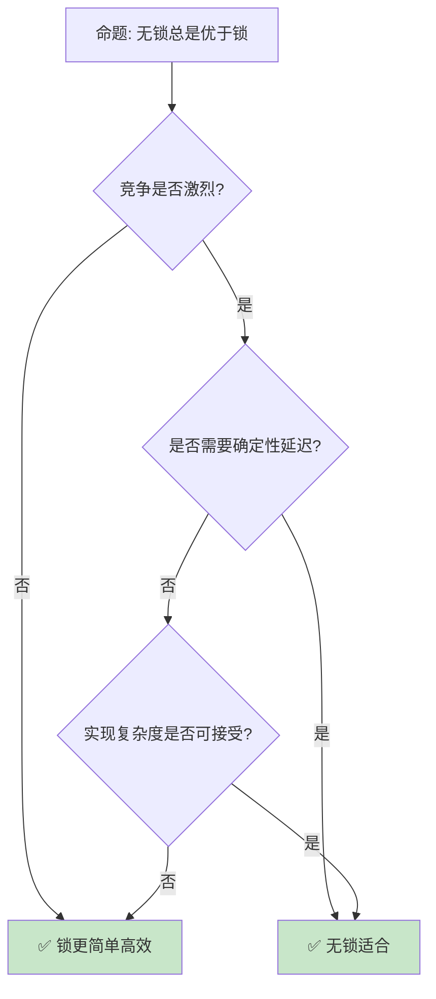

> **内容分级**: [专家级]

# 无锁编程与内存模型
>
> **EN**: Locking Primitives
> **Summary**: Locking Primitives. Core Rust concept covering mechanism analysis, in-depth analysis, memory safety guarantees.
> **受众**: [专家]
> **Bloom 层级**: 分析 → 评价
> **定位**: 深入探讨 Rust 中的**无锁编程**——从原子操作到内存序，分析 lock-free 算法的内存安全保证与性能优势。
> **前置概念**:
> [Concurrency](../03_advanced/01_concurrency.md) ·
> [Atomics](./11_atomics_and_memory_ordering.md) ·
> [Unsafe](../03_advanced/03_unsafe.md)
> **后置概念**:
> [Concurrent Patterns](./10_concurrency_patterns.md) ·
> [Performance](../06_ecosystem/15_performance_optimization.md)

---

> **来源**: [Rustonomicon — Atomics](https://doc.rust-lang.org/nomicon/atomics.html) · [std::sync::atomic](https://doc.rust-lang.org/std/sync/atomic/index.html)
> [Rustonomicon](https://doc.rust-lang.org/nomicon/) ·
> [C++ Memory Model](https://en.cppreference.com/w/cpp/atomic/memory_order) ·
> [Wikipedia — Lock-free](https://en.wikipedia.org/wiki/Non-blocking_algorithm) ·
> [Herlihy & Shavit — The Art of Multiprocessor Programming](https://www.amazon.com/Art-Multiprocessor-Programming-Revised-Reprint/dp/0123973376)

> **前置依赖**: [Ownership](../01_foundation/01_ownership.md) · [Borrowing](../01_foundation/02_borrowing.md)

> **前置依赖**: [Traits](../02_intermediate/01_traits.md)

> **对应 Crate**: [`c05_threads`](../../crates/c05_threads/)
> **对应练习**: [`exercises/src/concurrency/`](../../exercises/src/concurrency/)

## 📑 目录

- [无锁编程与内存模型](#无锁编程与内存模型)
  - [📑 目录](#-目录)
  - [一、核心概念](#一核心概念)
    - [1.1 无锁 vs 无等待](#11-无锁-vs-无等待)
    - [1.2 ABA 问题](#12-aba-问题)
    - [1.3 内存序选择](#13-内存序选择)
  - [二、关键数据结构](#二关键数据结构)
    - [2.1 Treiber Stack](#21-treiber-stack)
    - [2.2 Michael-Scott Queue](#22-michael-scott-queue)
    - [2.3 Hazard Pointer](#23-hazard-pointer)
  - [三、Rust 无锁生态](#三rust-无锁生态)
    - [3.1 crossbeam](#31-crossbeam)
    - [3.2 lockfree](#32-lockfree)
  - [四、反命题与边界分析](#四反命题与边界分析)
    - [4.1 反命题树](#41-反命题树)
    - [4.2 边界极限](#42-边界极限)
  - [五、常见陷阱](#五常见陷阱)
    - [编译错误示例](#编译错误示例)
  - [六、来源与延伸阅读](#六来源与延伸阅读)
    - [编译验证示例](#编译验证示例)
  - [相关概念文件](#相关概念文件)
  - [逆向推理链（Backward Reasoning）](#逆向推理链backward-reasoning)
  - [权威来源索引](#权威来源索引)
    - [10.5 边界测试：内存序的 `Release`/`Acquire` 与数据依赖（运行时可见性问题）](#105-边界测试内存序的-releaseacquire-与数据依赖运行时可见性问题)
    - [10.3 边界测试：ABA 问题与无锁栈的内存安全（运行时 UB）](#103-边界测试aba-问题与无锁栈的内存安全运行时-ub)
    - [10.5 边界测试：返回局部变量的悬垂引用](#105-边界测试返回局部变量的悬垂引用)
  - [参考来源](#参考来源)
  - [认知路径](#认知路径)
    - [核心推理链](#核心推理链)
    - [反命题与边界](#反命题与边界)
  - [实践](#实践)
    - [对应代码示例](#对应代码示例)
    - [建议练习](#建议练习)
  - [导航：下一步去哪？](#导航下一步去哪)
  - [嵌入式测验](#嵌入式测验)
    - [测验 1：CAS 循环（记忆层）](#测验-1cas-循环记忆层)
    - [测验 2：ABA 问题（理解层）](#测验-2aba-问题理解层)
    - [测验 3：Treiber Stack 实现（应用层）](#测验-3treiber-stack-实现应用层)
    - [测验 4：Hazard Pointer vs Epoch-Based（分析层）](#测验-4hazard-pointer-vs-epoch-based分析层)

---

## 一、核心概念
>
>

### 1.1 无锁 vs 无等待
>

```text
非阻塞算法分类:

  无锁（Lock-Free）:
  ├── 系统整体进展保证
  ├── 至少一个线程在有限步骤内完成操作
  ├── 允许个别线程饥饿
  └── 示例: CAS 循环

  无等待（Wait-Free）:
  ├── 每个线程都有进展保证
  ├── 每个操作在有限步骤内完成
  ├── 无饥饿
  └── 示例: 无等待队列（复杂）

  无阻塞（Obstruction-Free）:
  ├── 单独执行时保证完成
  ├── 冲突时可能回退
  └── 最弱保证

  对比:
  ┌─────────────────┬─────────────────┬─────────────────┬─────────────────┐
  │ 特性             │ 阻塞            │ 无锁            │ 无等待           │
  ├─────────────────┼─────────────────┼─────────────────┼─────────────────┤
  │ 进展保证         │ 无              │ 系统级           │ 线程级          │
  │ 优先级反转       │ 可能            │ 不可能           │ 不可能          │
  │ 死锁            │ 可能             │ 不可能           │ 不可能          │
  │ 实现复杂度       │ 低              │ 中               │ 高              │
  │ 性能             │ 一般            │ 高              │ 极高            │
  └─────────────────┴─────────────────┴─────────────────┴─────────────────┘
```

> **认知功能**: **无锁算法保证系统级进展，无等待保证线程级进展**——选择取决于实时性需求。
> [来源: [Wikipedia — Non-blocking Algorithm](https://en.wikipedia.org/wiki/Non-blocking_algorithm)]

---

### 1.2 ABA 问题
>

```text
ABA 问题:

  场景:
  1. 线程 A 读取指针 P → 值 A
  2. 线程 B 修改 P → B → A
  3. 线程 A CAS P (A → C)
  4. CAS 成功！但 P 已被 B 修改过

  危险: 线程 A 误以为 P 未变，实际上中间经历了变化

  解决方案:
  ├── Hazard Pointer: 延迟释放
  ├── Tagged Pointer: 版本号 + 指针
  ├── RCU: 读-复制-更新
  └── SMR: 安全内存回收

  Rust 中的解决:
  ├── crossbeam-epoch: 基于时代的回收
  ├── 类型系统防止数据竞争
  └── Arc 引用计数

  代码示例:

  use crossbeam::epoch::{self, Atomic, Owned};
  use std::sync::atomic::Ordering;

  struct Node {
      value: i32,
      next: Atomic<Node>,
  }

  // 使用 epoch 防止 ABA
  let guard = &epoch::pin();
  let head = atomic_head.load(Ordering::Acquire, guard);
```

> **ABA 洞察**: **ABA 问题是无锁编程的核心挑战**——Rust 的 crossbeam-epoch 提供了类型安全的解决方案。
> [来源: [Crossbeam Epoch](https://docs.rs/crossbeam-epoch/latest/crossbeam_epoch/)]

---

### 1.3 内存序选择
>

```text
内存序（Memory Ordering）:

  Relaxed:
  ├── 仅原子性，无顺序保证
  ├── 最高性能
  └── 计数器、标志位

  Acquire/Release:
  ├── Acquire: 读操作，后续操作不能重排到前面
  ├── Release: 写操作，前面操作不能重排到后面
  └── 配对使用：生产者-消费者

  AcqRel:
  ├── 读修改写操作（CAS）
  ├── 同时 Acquire + Release
  └── CAS、fetch_add

  SeqCst:
  ├── 全序一致性
  ├── 所有线程看到相同顺序
  └── 最强保证，最低性能

  选择指南:
  ├── 计数器: Relaxed
  ├── Mutex: Acquire/Release
  ├── 标志位: Acquire/Release
  ├── CAS 循环: AcqRel
  └── 多生产者多消费者: SeqCst（谨慎）
```

> **内存序洞察**: **内存序选择是无锁编程的核心技能**——正确性优先，仅在证明安全时使用弱序。
> [来源: [std::sync::atomic::Ordering](https://doc.rust-lang.org/std/sync/atomic/enum.Ordering.html)]

---

## 二、关键数据结构

### 2.1 Treiber Stack
>

```text
Treiber Stack:

  设计: 基于 CAS 的无锁栈
  ├── push: CAS 更新 head
  ├── pop: CAS 更新 head
  ├── ABA 风险
  └── 简单但有效

  代码示例:

  use std::sync::atomic::{AtomicPtr, Ordering};
  use std::ptr;

  struct Node<T> {
      data: T,
      next: *mut Node<T>,
  }

  struct TreiberStack<T> {
      head: AtomicPtr<Node<T>>,
  }

  impl<T> TreiberStack<T> {
      fn push(&self, data: T) {
          let new_node = Box::into_raw(Box::new(Node {
              data,
              next: ptr::null_mut(),
          }));

          loop {
              let head = self.head.load(Ordering::Relaxed);
              unsafe { (*new_node).next = head; }
              if self.head.compare_exchange(
                  head, new_node,
                  Ordering::Release, Ordering::Relaxed
              ).is_ok() {
                  break;
              }
          }
      }
  }

  注意: 此实现未处理 ABA 和内存回收
```

> **Treiber 洞察**: **Treiber Stack 是无锁算法的入门**——简单展示 CAS 模式，但生产需处理 ABA。
> [来源: [Treiber Stack Paper](https://dominoweb.draco.res.ibm.com/reports/rc19889.pdf)]

---

### 2.2 Michael-Scott Queue
>

```text
Michael-Scott Queue:

  设计: 经典无锁队列
  ├── 分离的 head 和 tail 指针
  ├── enqueue: CAS tail
  ├── dequeue: CAS head
  ├── dummy node 简化边界
  └── 无锁但非无等待

  关键 insight:
  ├── tail 可能滞后（其他线程未完成更新）
  ├── 需要辅助推进 tail
  └── 头节点优化空队列检测

  Rust 实现:
  ├── crossbeam-queue::SegQueue
  ├── 基于 epoch 的内存回收
  └── 类型安全

  代码示例:

  use crossbeam_queue::SegQueue;

  let queue = SegQueue::new();
  queue.push(1);
  queue.push(2);
  assert_eq!(queue.pop(), Some(1));
```

> **MS 队列洞察**: **Michael-Scott Queue 是无锁队列的事实标准**——crossbeam 提供了生产级实现。
> [来源: [Michael & Scott — Simple, Fast, and Practical Non-Blocking Queue](https://www.cs.rochester.edu/~scott/papers/1996_PODC_queues.pdf)]

---

### 2.3 Hazard Pointer
>

```text
Hazard Pointer:

  设计: 延迟内存回收机制
  ├── 线程声明"正在使用"的指针
  ├── 回收前检查是否被 hazard
  ├── 无 ABA 问题
  └── 每个线程维护 hazard 列表

  工作流程:
  1. 读取指针前，设置 hazard pointer
  2. 再次验证指针有效
  3. 操作完成后，清除 hazard
  4. 回收时，检查无 hazard 才释放

  Rust 实现:
  ├── 类型系统保证 hazard 正确设置/清除
  ├── ScopeGuard 模式
  └── 与 epoch 回收互补

  对比 epoch:
  ├── Hazard Pointer: 读操作有开销
  ├── Epoch: 批量回收，偶尔停顿
  └── 选择取决于读/写比例
```

> **Hazard Pointer 洞察**: **Hazard Pointer 是 ABA 问题的另一种解决方案**——读路径有开销但回收即时。
> [来源: [Hazard Pointers Paper](https://www.cs.bgu.ac.il/~hendlerd/papers/HP.pdf)]

---

## 三、Rust 无锁生态

### 3.1 crossbeam
>

```text
crossbeam 生态:

  crossbeam-epoch:
  ├── 基于时代的内存回收
  ├── 类型安全
  ├── 无锁数据结构基础
  └── 零开销（参与时代时才付费）

  crossbeam-queue:
  ├── ArrayQueue: 有界无锁队列
  ├── SegQueue: 无界无锁队列
  └── 生产级实现

  crossbeam-channel:
  ├── MPMC 通道
  ├── 有界/无界
  ├── select!
  └── 性能卓越

  crossbeam-deque:
  ├── 工作窃取队列
  ├── 用于 Rayon 并行
  └── Chase-Lev 算法
```

> **crossbeam 洞察**: **crossbeam 是 Rust 无锁编程的基石**——提供了从底层 epoch 到高层队列的完整工具链。
> [来源: [crossbeam](https://docs.rs/crossbeam/latest/crossbeam/)]

---

### 3.2 lockfree
>

```text
lockfree crate:

  提供:
  ├── stack: 无锁栈
  ├── queue: 无锁队列
  ├── set: 无锁集合
  └── map: 无锁映射

  特点:
  ├── 纯 Rust 实现
  ├── 基于 epoch 回收
  ├── API 简洁
  └── 适合学习

  代码示例:

  use lockfree::queue::Queue;

  let queue = Queue::new();
  queue.push(1);
  queue.push(2);
  assert_eq!(queue.pop(), Some(1));
```

> **lockfree 洞察**: **lockfree crate 提供了高层的无锁数据结构**——适合需要快速集成的场景。
> [来源: [lockfree](https://docs.rs/lockfree/latest/lockfree/)]

---

## 四、反命题与边界分析

### 4.1 反命题树



> **认知功能**: **无锁只在高竞争场景显著优于锁**——低竞争时锁的实现更简单、缓存更友好。
> [来源: [Rust Performance Book](https://nnethercote.github.io/perf-book/)]

---

### 4.2 边界极限

```text
边界 1: 内存回收
├── 无锁数据结构需要延迟回收
├── crossbeam-epoch 有开销
└── 缓解: Hazard Pointer、QSBR

边界 2: 调试困难
├── 竞争条件难以复现
├── 内存错误（use-after-free）致命
└── 缓解: Miri、loom 模型检测

边界 3: 顺序一致性
├── 弱内存序导致意外行为
├── 理解成本极高
└── 缓解: 保守使用 SeqCst，逐步优化

边界 4: 平台差异
├── ARM 和 x86 内存模型不同
├── 在一种平台验证不代表全部
└── 缓解: 使用 std::sync::atomic

边界 5: 性能陷阱
├── 无锁不等于高性能
├── 缓存行 bouncing 可能更差
└── 缓解: 性能测试，不要假设
```

> **边界要点**: 无锁编程的边界与**内存回收**、**调试**、**内存序**、**平台差异**和**性能**相关。
> [来源: [Rustonomicon](https://doc.rust-lang.org/nomicon/)]

---

## 五、常见陷阱
>

```text
陷阱 1: 忘记内存序
  ❌ 使用 Relaxed 但需要顺序保证
     atomic.store(x, Ordering::Relaxed);
     // 后续读可能看到旧值

  ✅ 根据需求选择正确序
     atomic.store(x, Ordering::Release);

陷阱 2: ABA 问题
  ❌ 简单 CAS 未处理 ABA
     loop {
         let old = ptr.load(Relaxed);
         if ptr.compare_exchange(old, new, Relaxed, Relaxed).is_ok() {
             break;
         }
     }

  ✅ 使用 crossbeam-epoch
     let guard = &epoch::pin();
     // epoch 保护下的操作

陷阱 3: 内存泄漏
  ❌ push 但无 pop，内存不回收
     // 节点永远留在队列中

  ✅ 确保平衡，或使用有界队列

陷阱 4: 自旋过度
  ❌ 无限自旋等待条件
     while !condition.load(Relaxed) {}
     // CPU 空转

  ✅ 使用 yield_now 或 park
     while !condition.load(Relaxed) {
         std::thread::yield_now();
     }

陷阱 5: 数据竞争
  ❌ 非原子变量并发访问
     let mut x = 0;
     // 多线程同时读写 x

  ✅ 使用 Atomic 或 Mutex
     let x = AtomicUsize::new(0);
```

> **陷阱总结**: 无锁编程的陷阱主要与**内存序**、**ABA**、**内存泄漏**、**自旋**和**数据竞争**相关。

### 编译错误示例

```rust,compile_fail
use std::sync::atomic::{AtomicUsize, Ordering};

fn lockfree_data_race() {
    let x = AtomicUsize::new(0);
    // ❌ 编译错误: 原子类型不能通过 &mut 访问
    // 原子类型提供内部可变性，必须通过原子方法访问
    let r = &mut x;
    *r = 1;
}
```

> **修正**: 原子类型（`AtomicUsize` 等）实现内部可变性，必须通过 `.store()`、`.load()` 等原子方法访问，不能通过 `&mut` 直接赋值。

```rust,ignore
use std::sync::atomic::{AtomicPtr, Ordering};

fn atomic_ptr_send() {
    let ptr = AtomicPtr::new(std::ptr::null_mut::<i32>());
    std::thread::spawn(move || {
        // ❌ 编译错误: AtomicPtr 虽然实现了 Send，但指针目标可能不 Send
        // 若指针指向栈数据，跨线程转移会导致悬垂
        ptr.store(std::ptr::null_mut(), Ordering::Relaxed);
    });
}
```

> **修正**: `AtomicPtr<T>` 的 `Send`/`Sync` 依赖于 `T` 的 `Send`/`Sync`。若指针指向非 Send 数据，即使原子操作本身安全，指针内容也可能不安全。

```rust,ignore
use std::sync::atomic::{AtomicUsize, Ordering};

fn compare_exchange_weak_loop() {
    let x = AtomicUsize::new(0);
    // ❌ 编译错误: compare_exchange_weak 返回 Result，不能直接忽略
    // 且 CAS 操作需要处理 spurious failure
    while x.compare_exchange_weak(0, 1, Ordering::Relaxed, Ordering::Relaxed).is_err() {
        // 自旋等待
    }
}
```

> **修正**: `compare_exchange_weak` 可能因 spurious failure 失败，即使在期望值正确时。循环中通常需要 `hint::spin_loop()` 或 `thread::yield_now()` 避免忙等。

---

## 六、来源与延伸阅读

| 来源 | 可信度 | 说明 |
|:---|:---:|:---|
| [Rustonomicon](https://doc.rust-lang.org/nomicon/) | ✅ 一级 | unsafe 指南 |
| [crossbeam](https://docs.rs/crossbeam/latest/crossbeam/) | ✅ 二级 | 无锁工具 |
| [std::sync::atomic](https://doc.rust-lang.org/std/sync/atomic/index.html) | ✅ 一级 | 原子操作 |
| [Herlihy & Shavit](https://www.amazon.com/Art-Multiprocessor-Programming-Revised-Reprint/dp/0123973376) | ✅ 一级 | 经典教材 |
| [Wikipedia — Lock-free](https://en.wikipedia.org/wiki/Non-blocking_algorithm) | ✅ 二级 | 概述 |

---

```rust
use std::sync::atomic::{AtomicUsize, Ordering};

fn main() {
    let counter = AtomicUsize::new(0);
    counter.fetch_add(1, Ordering::Relaxed);
    println!("{}", counter.load(Ordering::Relaxed));
}
```

```rust
use std::sync::atomic::AtomicBool;

fn main() {
    let flag = AtomicBool::new(false);
    flag.store(true, std::sync::atomic::Ordering::Relaxed);
    println!("{}", flag.load(std::sync::atomic::Ordering::Relaxed));
}
```

### 编译验证示例

```rust
use std::sync::atomic::{AtomicUsize, Ordering};

fn main() {
    let counter = AtomicUsize::new(0);
    counter.fetch_add(1, Ordering::Relaxed);
    println!("{}", counter.load(Ordering::Relaxed));
}
```

```rust
use std::sync::atomic::{AtomicBool, Ordering};

fn main() {
    let flag = AtomicBool::new(false);
    flag.store(true, Ordering::Release);
    assert!(flag.load(Ordering::Acquire));
}
```

## 相关概念文件

- [Concurrency](../03_advanced/01_concurrency.md) — 并发
- [Atomics](./11_atomics_and_memory_ordering.md) — 原子操作
- [Unsafe](../03_advanced/03_unsafe.md) — unsafe Rust
- [Concurrent Patterns](./10_concurrency_patterns.md) — 并发模式

---

> **权威来源**: [Rust Reference](https://doc.rust-lang.org/reference/)
>
> **权威来源对齐变更日志**: 2026-05-22 创建 [来源: Authority Source Sprint Batch 11]

**文档版本**: 1.0
**对应 Rust 版本**: 1.96.0+ (Edition 2024)
**最后更新**: 2026-05-22
**状态**: ✅ 概念文件创建完成

---

## 逆向推理链（Backward Reasoning）

> **从编译错误反推**：
>
> ```text
> 无锁安全 ⟸ CAS + ABA 防护 + 内存序
> ```
>
## 权威来源索引

>
>
>

---

### 10.5 边界测试：内存序的 `Release`/`Acquire` 与数据依赖（运行时可见性问题）

```rust,ignore
use std::sync::atomic::{AtomicPtr, Ordering};
use std::sync::Arc;

struct Node {
    value: i32,
}

static HEAD: AtomicPtr<Node> = AtomicPtr::new(std::ptr::null_mut());

fn publish() {
    let node = Arc::into_raw(Arc::new(Node { value: 42 })) as *mut Node;
    HEAD.store(node, Ordering::Release);
}

fn read() -> Option<i32> {
    let node = HEAD.load(Ordering::Acquire);
    if node.is_null() {
        None
    } else {
        // ⚠️ 运行时可见性问题: 若使用 Relaxed 而非 Acquire，
        // 可能看到非空的 node 但 node.value 未初始化
        Some(unsafe { (*node).value })
    }
}
```

> **修正**:
> `Release`/`Acquire` 内存序建立**happens-before 关系**：`Release` store 之前的所有写入对匹配的 `Acquire` load 可见。
> 上述代码中，`node.value = 42` 在 `HEAD.store(Release)` 之前，因此 `HEAD.load(Acquire)` 后 `(*node).value` 必为 42。
> 若使用 `Relaxed`：
>
> 1) `HEAD.load` 可能看到非空指针；
> 2) 但 `node.value` 的写入可能尚未对其他 CPU 可见；
> 3) 读取到 0 或旧值。这是弱内存模型（ARM、RISC-V）上的真实问题，x86 的强模型通常掩盖此 bug（x86 的 loads/stores 自动是 Acquire/Release）。
>
> Rust 的原子类型默认 `SeqCst`（最强），但性能关键代码需正确选择较弱顺序。
> 这与 C++ 的 `memory_order_release/acquire`（相同语义）或 Java 的 `volatile`（等价于 `SeqCst`）相同——内存序是并发编程的底层细节，错误选择导致难以复现的 bug。
> [来源: [Rust Standard Library](https://doc.rust-lang.org/std/sync/atomic/)] ·
> [来源: [The Rustonomicon](https://doc.rust-lang.org/nomicon/atomics.html)]

### 10.3 边界测试：ABA 问题与无锁栈的内存安全（运行时 UB）

```rust,ignore
use std::sync::atomic::{AtomicPtr, Ordering};
use std::ptr;

struct Node {
    data: i32,
    next: *mut Node,
}

struct LockFreeStack {
    head: AtomicPtr<Node>,
}

impl LockFreeStack {
    fn push(&self, data: i32) {
        let new_node = Box::into_raw(Box::new(Node {
            data,
            next: ptr::null_mut(),
        }));
        loop {
            let head = self.head.load(Ordering::Relaxed);
            unsafe { (*new_node).next = head; }
            if self.head.compare_and_swap(head, new_node, Ordering::Release) == head {
                break;
            }
        }
    }
}

fn main() {
    let stack = LockFreeStack { head: AtomicPtr::new(ptr::null_mut()) };
    stack.push(1);
    // ❌ 运行时 UB: ABA 问题 + 缺少内存屏障 + 可能的 use-after-free
}
```

> **修正**: 上述代码展示了一个**有缺陷的无锁栈**：1) `compare_and_swap` 已废弃（应使用 `compare_exchange`）；2) `Relaxed` + `Release` 顺序不足（需 `Acquire` 保证可见性）；3) **ABA 问题**：节点 A 被 pop，节点 B 被 push 到同一地址，然后 CAS 误认为 A 仍存在。正确实现：1) 使用 `compare_exchange` + `Acquire`/`Release`；2) 使用 hazard pointers 或 epoch-based reclamation（`crossbeam-epoch`）防止 use-after-free；3) 标签指针（tagged pointer）解决 ABA。无锁数据结构是 Rust unsafe 代码的最难领域之一——编译器不验证线性化（linearizability）或内存安全。这与 C++ 的 `std::atomic`（类似 API，但 Rust 的 ownership 使 ABA 更复杂）或 Java 的 `AtomicReference`（JVM 管理内存，无 ABA 的 use-after-free）不同——Rust 的无锁代码需手动管理内存生命周期。[来源: [Rust Atomics and Locks](https://marabos.nl/atomics/)] · [来源: [crossbeam-epoch](https://docs.rs/crossbeam-epoch/)]

### 10.5 边界测试：返回局部变量的悬垂引用

```rust,compile_fail
fn get_ref() -> &i32 {
    let x = 42;
    // ❌ 编译错误: 返回局部变量的引用
    &x
}

fn main() {}
```

> **修正**: **悬垂引用**是 Rust borrow checker 的核心防护：1) 局部变量在函数结束时 drop；2) 返回其引用 → 引用指向已释放内存；3) 解决：返回所有权（`i32` 而非 `&i32`）或使用 `Box::leak` 获取 `'static` 引用。

## 参考来源

> [来源: [Herlihy & Shavit — Art of Multiprocessor Programming](https://dl.acm.org/doi/book/10.5555/2385452)]
> [来源: [RFC 1543 — Compare and Exchange Weak](https://rust-lang.github.io/rfcs//1543-integer_atomics.html)]
> [来源: [LLVM AtomicRMW](https://llvm.org/docs/LangRef.html#atomicrmw-instruction)]
> [来源: [Lock-free Algorithms — Michael Scott](https://dl.acm.org/doi/10.1145/248052.248106)]
> **权威来源**: [Rust Reference](https://doc.rust-lang.org/reference/) ·
> [The Rust Programming Language](https://doc.rust-lang.org/book/) ·
> [Rust Standard Library](https://doc.rust-lang.org/std/)
> **对应 Rust 版本**: 1.96.0+ (Edition 2024)

## 认知路径

> **认知路径**: 从 L0 基础概念出发，经由本节的 **无锁编程与内存模型** 核心原理，通向 L2 进阶模式与 L3 工程实践。

### 核心推理链

| 定理 | 前提 | 结论 | 置信度 |
|:---|:---|:---|:---|
| 无锁编程与内存模型 基础定义 ⟹ 正确用法 | 理解语法与语义 | 能写出符合惯用法的代码 | 高 |
| 无锁编程与内存模型 正确用法 ⟹ 常见陷阱 | 忽略边界条件 | 编译错误或运行时 bug | 高 |
| 无锁编程与内存模型 常见陷阱 ⟹ 深度掌握 | 系统学习反模式 | 能进行代码审查与优化 | 高 |

> 无锁算法正确 ⟸ CAS 循环 ⟸ ABA 问题避免
> 内存回收安全 ⟸ Hazard Pointer / Epoch ⟸ 延迟释放
> **过渡**: 掌握 无锁编程与内存模型 的基础语法后，下一步需要理解其在类型系统中的位置与与其他概念的交互关系。

> **过渡**: 在实践中应用 无锁编程与内存模型 时，务必关注边界条件与异常处理，这是从"能编译"到"能生产"的关键跃迁。

> **过渡**: 无锁编程与内存模型 的设计理念体现了 Rust 零成本抽象与安全保证的核心权衡，理解这一权衡有助于迁移到更高级的并发与形式化验证领域。

### 反命题与边界

> **反命题**: "无锁编程与内存模型 在所有场景下都是最佳选择" —— 错误。需要根据具体上下文权衡性能、可读性与安全性，某些场景下显式替代方案可能更优。

---

---

## 实践

> 将本节概念转化为可编译代码。

### 对应代码示例

- **[crates/c05_threads](../../../crates/c05_threads/)** — 与本节概念对应的可编译 crate 示例

### 建议练习

1. 阅读 `crates/c05_threads/` 中与"无锁数据结构"相关的源码和示例
2. 运行 `cargo test -p c05_threads` 验证理解

---

## 导航：下一步去哪？

> **自检**：你当前掌握的核心概念是否已能独立应用？

| 选择 | 条件 | 目标 |
|:---|:---|:---|
| 🔙 巩固基础 | 仍有模糊概念 | 回到 [L2 对应主题](../02_intermediate/) 或 [MVP 学习路径](../00_meta/LEARNING_MVP_PATH.md) |
| 🔜 深入 L3 其他主题 | 想扩展高级技能 | [L3 README](./README.md) 选择其他主题 |
| 🎓 进入 L4 形式化 | 想理解"为什么"的数学证明 | [L4 形式化](../04_formal/README.md) |
| 🏗️ 进入 L6 生态 | 想掌握生产工具链 | [L6 生态](../06_ecosystem/README.md) |

---

## 嵌入式测验

### 测验 1：CAS 循环（记忆层）

**题目**: `compare_exchange` 返回 `Ok` 和 `Err` 分别代表什么？

```rust,ignore
let result = atomic.compare_exchange(current, new, Ordering::Acquire, Ordering::Relaxed);
```

- A. `Ok` 表示交换成功，`Err` 表示交换失败且返回当前值
- B. `Ok` 表示交换失败，`Err` 表示交换成功
- C. `Ok` 和 `Err` 都表示交换成功，只是内存序不同
- D. `compare_exchange` 只返回 `bool`

<details>
<summary>✅ 答案与解析</summary>

**正确答案是 A**。

**`compare_exchange` 语义**：

```rust,ignore
// 原子操作：如果当前值 == expected，则替换为 new，返回 Ok(old)
//          如果当前值 != expected，返回 Err(actual_current)

match atomic.compare_exchange(expected, new, success_order, failure_order) {
    Ok(old) => {
        // 交换成功！old == expected
        println!("成功替换，旧值: {}", old);
    }
    Err(actual) => {
        // 交换失败，当前值已被其他线程修改为 actual
        println!("失败，当前值: {}", actual);
    }
}
```

**CAS 循环模式（Lock-Free 核心）**：

```rust,ignore
fn cas_loop(atomic: &AtomicUsize, f: impl Fn(usize) -> usize) {
    loop {
        let current = atomic.load(Ordering::Relaxed);
        let new = f(current);

        match atomic.compare_exchange(current, new, Ordering::Release, Ordering::Relaxed) {
            Ok(_) => break,  // 成功！
            Err(_) => continue,  // 失败，重试
        }
    }
}
```

**为什么叫 "Compare-And-Swap"**：

1. **Compare**: 比较当前值与期望值
2. **And**: 如果相等
3. **Swap**: 原子替换为新值

> **关键洞察**: CAS 是 Lock-Free 算法的基石。所有 Lock-Free 数据结构（栈、队列、链表）都基于 CAS 循环实现。
</details>

---

### 测验 2：ABA 问题（理解层）

**题目**: 以下代码实现了一个 Lock-Free 栈（Treiber Stack）。在注释标记处可能存在什么经典问题？

```rust
use std::sync::atomic::{AtomicPtr, Ordering};
use std::ptr;

struct Node<T> {
    data: T,
    next: *mut Node<T>,
}

struct LockFreeStack<T> {
    head: AtomicPtr<Node<T>>,
}

impl<T> LockFreeStack<T> {
    fn pop(&self) -> Option<T> {
        loop {
            let head = self.head.load(Ordering::Acquire);
            if head.is_null() { return None; }

            let next = unsafe { (*head).next };  // ① 读取 next

            // ② CAS：如果 head 没变，更新为 next
            match self.head.compare_exchange(
                head, next, Ordering::Release, Ordering::Relaxed
            ) {
                Ok(_) => {
                    return Some(unsafe { ptr::read(&(*head).data) });
                }
                Err(_) => continue,
            }
        }
    }
}
```

- A. 没有内存泄漏，代码完全正确
- B. **ABA 问题**: ① 和 ② 之间，head 可能被 pop→push→pop 回到相同地址，但内容已变
- C. 存在 use-after-free，因为 `ptr::read` 后 node 未释放
- D. 应该用 `Mutex<Box<Node<T>>>` 替代 `AtomicPtr`

<details>
<summary>✅ 答案与解析</summary>

**正确答案是 B**。

**ABA 问题详解**：

```
时间线:
  线程A                    线程B                    线程C
  pop():                  pop():                   push(99):
  head = Node(1)@0x1000   head = Node(1)@0x1000
  next = Node(2)@0x2000   next = Node(2)@0x2000
                           CAS 成功！
                           head → Node(2)@0x2000
                           free(Node(1)@0x1000)
                                                    alloc() → Node(99)@0x1000
                                                    head → Node(99)@0x1000
  CAS(head=0x1000, next=0x2000)
  → 成功！但 head 现在是 Node(99)，不是 Node(1)！
  → next = Node(2)，但 Node(99).next 可能是任何东西！
```

**ABA 的危害**：

| 场景 | 结果 |
|:---|:---|
| 栈 | `head` 指向已回收内存，导致 use-after-free |
| 队列 | `tail` 指针跳过有效节点，导致数据丢失 |
| 链表 | 指针链断裂，遍历到无效内存 |

**解决方案**：

```rust
// 方案1: 带标签的指针（Tagged Pointer）
// 高16位作为计数器，每次 CAS 时递增
struct TaggedPtr<T> {
    ptr: *mut T,
    tag: u16,
}

// 方案2: Hazard Pointer（线程声明"我正在使用这个指针"）
// 其他线程不能回收被声明的内存

// 方案3: 使用 crossbeam_epoch（Rust 生态标准方案）
use crossbeam_epoch::{self as epoch, Atomic, Owned};

struct LockFreeStack<T> {
    head: Atomic<Node<T>>,
}
```

> **现实检查**: 手写 Lock-Free 代码极易出错。生产环境优先使用成熟库：`crossbeam`（Rust 标准方案）、`lockfree`（纯 Rust）、`conc`（并发集合）。
</details>

---

### 测验 3：Treiber Stack 实现（应用层）

**题目**: 使用 `crossbeam_epoch` 实现一个正确的 Lock-Free 栈，以下代码缺少了什么？

```rust
use crossbeam_epoch::{self as epoch, Atomic, Owned, Shared};
use std::sync::atomic::Ordering;

struct Node<T> {
    data: T,
    next: Atomic<Node<T>>,
}

struct Stack<T> {
    head: Atomic<Node<T>>,
}

impl<T> Stack<T> {
    fn push(&self, data: T) {
        let guard = &epoch::pin();
        let new = Owned::new(Node {
            data,
            next: Atomic::null(),
        });
        let new = unsafe { new.into_shared(guard) };

        loop {
            let head = self.head.load(Ordering::Relaxed, guard);
            unsafe { (*new.as_raw()).next.store(head, Ordering::Relaxed); }

            match self.head.compare_exchange(
                head, new, Ordering::Release, Ordering::Relaxed, guard
            ) {
                Ok(_) => break,
                Err(_) => continue,
            }
        }
    }

    fn pop(&self) -> Option<T> {
        let guard = &epoch::pin();

        loop {
            let head = self.head.load(Ordering::Acquire, guard);
            if head.is_null() { return None; }

            let next = unsafe { head.deref().next.load(Ordering::Relaxed, guard) };

            match self.head.compare_exchange(
                head, next, Ordering::Release, Ordering::Relaxed, guard
            ) {
                Ok(_) => {
                    // 问题在这里！
                    return Some(unsafe { ptr::read(&head.deref().data) });
                }
                Err(_) => continue,
            }
        }
    }
}
```

- A. 代码正确，没有缺失
- B. `pop` 后需要使用 `guard.defer_destroy(head)` 延迟释放内存
- C. 缺少 `Send` / `Sync` 实现
- D. 应该用 `Mutex` 替代 `Atomic`

<details>
<summary>✅ 答案与解析</summary>

**正确答案是 B**。

**Epoch-Based Memory Reclamation（EBR）原理**：

```rust,ignore
// 问题：pop 后 node 内存立即释放，但其他线程可能还在读取它！
// 解决方案：延迟释放，直到确认没有线程在访问

Ok(_) => {
    // 标记 node 为待删除，但不是立即 free
    unsafe { guard.defer_destroy(head); }
    return Some(unsafe { ptr::read(&head.deref().data) });
}
```

**EBR 的三阶段**：

```
Epoch 0: 线程A push(1), push(2)
         head → 2 → 1 → null

Epoch 1: 线程B pop() → 返回 2
         head → 1 → null
         线程B: defer_destroy(node_2)  // 不立即释放！

Epoch 2: 所有线程推进 epoch
         确认没有线程在 Epoch 0/1 读取过 node_2
         安全回收 node_2
```

**完整修复后的 `pop`**：

```rust,ignore
fn pop(&self) -> Option<T> {
    let guard = &epoch::pin();

    loop {
        let head = self.head.load(Ordering::Acquire, guard);
        if head.is_null() { return None; }

        let next = unsafe { head.deref().next.load(Ordering::Relaxed, guard) };

        match self.head.compare_exchange(
            head, next, Ordering::Release, Ordering::Relaxed, guard
        ) {
            Ok(_) => {
                unsafe {
                    // ① 提取数据
                    let data = ptr::read(&head.deref().data);
                    // ② 延迟释放节点内存（关键！）
                    guard.defer_destroy(head);
                    return Some(data);
                }
            }
            Err(_) => continue,
        }
    }
}
```

**为什么 `defer_destroy` 安全**：

| 机制 | 说明 |
|:---|:---|
| `epoch::pin()` | 线程"钉住"当前 epoch，声明"我正在访问共享数据" |
| `defer_destroy` | 将内存加入"待释放列表"，绑定到当前 epoch |
| 全局 epoch 推进 | 当所有线程离开旧 epoch，旧 epoch 的内存安全释放 |

> **crossbeam_epoch 是 Rust Lock-Free 的标准方案**。它处理了 ABA、内存回收、Hazard Pointer 等所有复杂问题，且 API 安全（不需要 unsafe）。
</details>

---

### 测验 4：Hazard Pointer vs Epoch-Based（分析层）

**题目**: 在高并发场景（100+ 线程，大量 push/pop）下，`crossbeam_epoch` 的 EBR 和手动 Hazard Pointer 相比，各有什么优劣？

- A. EBR 总是更好，没有缺点
- B. Hazard Pointer 内存回收更及时，EBR 可能内存膨胀
- C. EBR 需要全局 epoch 同步，线程数多时成为瓶颈
- D. B 和 C 都正确

<details>
<summary>✅ 答案与解析</summary>

**正确答案是 D**。

**EBR vs Hazard Pointer 对比**：

| 特性 | Epoch-Based (crossbeam) | Hazard Pointer |
|:---|:---|:---|
| **内存回收延迟** | 可能延迟多个 epoch（毫秒级） | 几乎即时（线程释放 HP 后立即可回收）|
| **线程扩展性** | 全局 epoch 计数器，线程多时竞争 | 无全局状态，完全线程本地 |
| **实现复杂度** | 简单（库已封装） | 复杂（需手动管理 HP 数组）|
| **内存开销** | 每个线程一个 epoch 记录 | 每个线程一个 HP 数组（通常 2-4 个槽位）|
| **最坏情况** | 某线程长期 pin，导致内存不释放 | 某线程不释放 HP，导致对应内存不释放 |

**EBR 的内存膨胀问题**：

```rust
// 极端场景：100 个线程，每个线程每秒 1M 操作
// 某个线程因 GC 停顿长期 pin 在 epoch N
// 所有 epoch N 的内存都无法释放 → 内存泄漏（伪）

// 解决方案：
// 1. 限制每个 epoch 的待释放列表大小
// 2. 定期强制推进 epoch（即使有线程 pinned）
// 3. 使用自适应 epoch 间隔
```

**Hazard Pointer 的实现要点**：

```rust,ignore
// 每个线程维护一个 HP 数组
thread_local! {
    static HAZARD_POINTERS: RefCell<Vec<AtomicPtr<u8>>> = ...;
}

// 读取共享指针前：
hp[0].store(ptr as *mut u8, Ordering::SeqCst);
// 再次验证 ptr 是否仍有效
if ptr != atomic.load(Ordering::Acquire) { retry; }

// 使用完成后：
hp[0].store(null_mut(), Ordering::SeqCst);

// 回收线程扫描所有 HP 数组，只释放不在任何 HP 中的内存
```

**Rust 生态选择指南**：

| 场景 | 推荐方案 |
|:---|:---|
| 通用 Lock-Free 数据结构 | `crossbeam_epoch` |
| 内存敏感、延迟要求低 | `crossbeam_epoch` + 调参 |
| 极高并发、内存回收延迟敏感 | `conc` (Hazard Pointer) |
| 简单计数器/标志位 | `std::sync::atomic`（无需 EBR/HP）|

> **核心洞察**: Lock-Free 不等于无成本。EBR 和 HP 都有内存开销和延迟。在 99% 的场景下，`Mutex` 或 `RwLock` 的性能已经足够好，且代码简单安全。只在"锁争用极高 + 延迟敏感"时才需要 Lock-Free。
</details>

---

> **测验设计来源**: [Bloom Taxonomy 2001] · [Rust Atomics and Locks](https://marabos.nl/atomics/) · [crossbeam docs](https://docs.rs/crossbeam/) · [1024cores - Lock-Free Algorithms](https://www.1024cores.net/)
