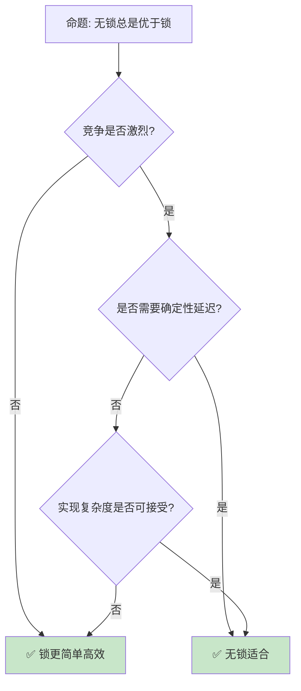

# 无锁编程与内存模型

> **Bloom 层级**: 分析 → 评价
> **定位**: 深入探讨 Rust 中的**无锁编程**——从原子操作到内存序，分析 lock-free 算法的内存安全保证与性能优势。
> **前置概念**: [Concurrency](../03_advanced/01_concurrency.md) · [Atomics](./11_atomics_and_memory_ordering.md) · [Unsafe](../03_advanced/03_unsafe.md)
> **后置概念**: [Concurrent Patterns](./10_concurrency_patterns.md) · [Performance](../06_ecosystem/15_performance_optimization.md)

---

> **来源**: [The Rust Programming Language](https://doc.rust-lang.org/book/) · [Rustonomicon](https://doc.rust-lang.org/nomicon/) · [C++ Memory Model](https://en.cppreference.com/w/cpp/atomic/memory_order) · [Wikipedia — Lock-free](https://en.wikipedia.org/wiki/Non-blocking_algorithm) · [Herlihy & Shavit — The Art of Multiprocessor Programming](https://www.amazon.com/Art-Multiprocessor-Programming-Revised-Reprint/dp/0123973376)

## 📑 目录
> [来源: [Rust Reference](https://doc.rust-lang.org/reference/)]
>
> [来源: [TRPL](https://doc.rust-lang.org/book/)]

- [无锁编程与内存模型](#无锁编程与内存模型)
  - [📑 目录](#-目录)
  - [一、核心概念](#一核心概念)
    - [1.1 无锁 vs 无等待](#11-无锁-vs-无等待)
    - [1.2 ABA 问题](#12-aba-问题)
    - [1.3 内存序选择](#13-内存序选择)
  - [二、关键数据结构](#二关键数据结构)
    - [2.1 Treiber Stack](#21-treiber-stack)
    - [2.2 Michael-Scott Queue](#22-michael-scott-queue)
    - [2.3 Hazard Pointer](#23-hazard-pointer)
  - [三、Rust 无锁生态](#三rust-无锁生态)
    - [3.1 crossbeam](#31-crossbeam)
    - [3.2 lockfree](#32-lockfree)
  - [四、反命题与边界分析](#四反命题与边界分析)
    - [4.1 反命题树](#41-反命题树)
    - [4.2 边界极限](#42-边界极限)
  - [五、常见陷阱](#五常见陷阱)
  - [六、来源与延伸阅读](#六来源与延伸阅读)
  - [相关概念文件](#相关概念文件)

---

## 一、核心概念
> [来源: [Rust Reference](https://doc.rust-lang.org/reference/)]
>
> [来源: [Rust Reference](https://doc.rust-lang.org/reference/)]

### 1.1 无锁 vs 无等待

```text
非阻塞算法分类:

  无锁（Lock-Free）:
  ├── 系统整体进展保证
  ├── 至少一个线程在有限步骤内完成操作
  ├── 允许个别线程饥饿
  └── 示例: CAS 循环

  无等待（Wait-Free）:
  ├── 每个线程都有进展保证
  ├── 每个操作在有限步骤内完成
  ├── 无饥饿
  └── 示例: 无等待队列（复杂）

  无阻塞（Obstruction-Free）:
  ├── 单独执行时保证完成
  ├── 冲突时可能回退
  └── 最弱保证

  对比:
  ┌─────────────────┬─────────────────┬─────────────────┬─────────────────┐
  │ 特性             │ 阻塞            │ 无锁            │ 无等待           │
  ├─────────────────┼─────────────────┼─────────────────┼─────────────────┤
  │ 进展保证         │ 无              │ 系统级           │ 线程级          │
  │ 优先级反转       │ 可能            │ 不可能           │ 不可能          │
  │ 死锁            │ 可能             │ 不可能           │ 不可能          │
  │ 实现复杂度       │ 低              │ 中               │ 高              │
  │ 性能             │ 一般            │ 高              │ 极高            │
  └─────────────────┴─────────────────┴─────────────────┴─────────────────┘
```

> **认知功能**: **无锁算法保证系统级进展，无等待保证线程级进展**——选择取决于实时性需求。
> [来源: [Wikipedia — Non-blocking Algorithm](https://en.wikipedia.org/wiki/Non-blocking_algorithm)]

---

### 1.2 ABA 问题

```text
ABA 问题:

  场景:
  1. 线程 A 读取指针 P → 值 A
  2. 线程 B 修改 P → B → A
  3. 线程 A CAS P (A → C)
  4. CAS 成功！但 P 已被 B 修改过

  危险: 线程 A 误以为 P 未变，实际上中间经历了变化

  解决方案:
  ├── Hazard Pointer: 延迟释放
  ├── Tagged Pointer: 版本号 + 指针
  ├── RCU: 读-复制-更新
  └── SMR: 安全内存回收

  Rust 中的解决:
  ├── crossbeam-epoch: 基于时代的回收
  ├── 类型系统防止数据竞争
  └── Arc 引用计数

  代码示例:

  use crossbeam::epoch::{self, Atomic, Owned};
  use std::sync::atomic::Ordering;

  struct Node {
      value: i32,
      next: Atomic<Node>,
  }

  // 使用 epoch 防止 ABA
  let guard = &epoch::pin();
  let head = atomic_head.load(Ordering::Acquire, guard);
```

> **ABA 洞察**: **ABA 问题是无锁编程的核心挑战**——Rust 的 crossbeam-epoch 提供了类型安全的解决方案。
> [来源: [Crossbeam Epoch](https://docs.rs/crossbeam-epoch/latest/crossbeam_epoch/)]

---

### 1.3 内存序选择

```text
内存序（Memory Ordering）:

  Relaxed:
  ├── 仅原子性，无顺序保证
  ├── 最高性能
  └── 计数器、标志位

  Acquire/Release:
  ├── Acquire: 读操作，后续操作不能重排到前面
  ├── Release: 写操作，前面操作不能重排到后面
  └── 配对使用：生产者-消费者

  AcqRel:
  ├── 读修改写操作（CAS）
  ├── 同时 Acquire + Release
  └── CAS、fetch_add

  SeqCst:
  ├── 全序一致性
  ├── 所有线程看到相同顺序
  └── 最强保证，最低性能

  选择指南:
  ├── 计数器: Relaxed
  ├── Mutex: Acquire/Release
  ├── 标志位: Acquire/Release
  ├── CAS 循环: AcqRel
  └── 多生产者多消费者: SeqCst（谨慎）
```

> **内存序洞察**: **内存序选择是无锁编程的核心技能**——正确性优先，仅在证明安全时使用弱序。
> [来源: [std::sync::atomic::Ordering](https://doc.rust-lang.org/std/sync/atomic/enum.Ordering.html)]

---

## 二、关键数据结构
> [来源: [Rust Reference](https://doc.rust-lang.org/reference/)]
>
> [来源: [TRPL](https://doc.rust-lang.org/book/)]

### 2.1 Treiber Stack

```text
Treiber Stack:

  设计: 基于 CAS 的无锁栈
  ├── push: CAS 更新 head
  ├── pop: CAS 更新 head
  ├── ABA 风险
  └── 简单但有效

  代码示例:

  use std::sync::atomic::{AtomicPtr, Ordering};
  use std::ptr;

  struct Node<T> {
      data: T,
      next: *mut Node<T>,
  }

  struct TreiberStack<T> {
      head: AtomicPtr<Node<T>>,
  }

  impl<T> TreiberStack<T> {
      fn push(&self, data: T) {
          let new_node = Box::into_raw(Box::new(Node {
              data,
              next: ptr::null_mut(),
          }));

          loop {
              let head = self.head.load(Ordering::Relaxed);
              unsafe { (*new_node).next = head; }
              if self.head.compare_exchange(
                  head, new_node,
                  Ordering::Release, Ordering::Relaxed
              ).is_ok() {
                  break;
              }
          }
      }
  }

  注意: 此实现未处理 ABA 和内存回收
```

> **Treiber 洞察**: **Treiber Stack 是无锁算法的入门**——简单展示 CAS 模式，但生产需处理 ABA。
> [来源: [Treiber Stack Paper](https://dominoweb.draco.res.ibm.com/reports/rc19889.pdf)]

---

### 2.2 Michael-Scott Queue

```text
Michael-Scott Queue:

  设计: 经典无锁队列
  ├── 分离的 head 和 tail 指针
  ├── enqueue: CAS tail
  ├── dequeue: CAS head
  ├── dummy node 简化边界
  └── 无锁但非无等待

  关键 insight:
  ├── tail 可能滞后（其他线程未完成更新）
  ├── 需要辅助推进 tail
  └── 头节点优化空队列检测

  Rust 实现:
  ├── crossbeam-queue::SegQueue
  ├── 基于 epoch 的内存回收
  └── 类型安全

  代码示例:

  use crossbeam_queue::SegQueue;

  let queue = SegQueue::new();
  queue.push(1);
  queue.push(2);
  assert_eq!(queue.pop(), Some(1));
```

> **MS 队列洞察**: **Michael-Scott Queue 是无锁队列的事实标准**——crossbeam 提供了生产级实现。
> [来源: [Michael & Scott — Simple, Fast, and Practical Non-Blocking Queue](https://www.cs.rochester.edu/~scott/papers/1996_PODC_queues.pdf)]

---

### 2.3 Hazard Pointer

```text
Hazard Pointer:

  设计: 延迟内存回收机制
  ├── 线程声明"正在使用"的指针
  ├── 回收前检查是否被 hazard
  ├── 无 ABA 问题
  └── 每个线程维护 hazard 列表

  工作流程:
  1. 读取指针前，设置 hazard pointer
  2. 再次验证指针有效
  3. 操作完成后，清除 hazard
  4. 回收时，检查无 hazard 才释放

  Rust 实现:
  ├── 类型系统保证 hazard 正确设置/清除
  ├── ScopeGuard 模式
  └── 与 epoch 回收互补

  对比 epoch:
  ├── Hazard Pointer: 读操作有开销
  ├── Epoch: 批量回收，偶尔停顿
  └── 选择取决于读/写比例
```

> **Hazard Pointer 洞察**: **Hazard Pointer 是 ABA 问题的另一种解决方案**——读路径有开销但回收即时。
> [来源: [Hazard Pointers Paper](https://www.cs.bgu.ac.il/~hendlerd/papers/HP.pdf)]

---

## 三、Rust 无锁生态
> [来源: [Rust Reference](https://doc.rust-lang.org/reference/)]
>
> [来源: [TRPL](https://doc.rust-lang.org/book/)]

### 3.1 crossbeam

```text
crossbeam 生态:

  crossbeam-epoch:
  ├── 基于时代的内存回收
  ├── 类型安全
  ├── 无锁数据结构基础
  └── 零开销（参与时代时才付费）

  crossbeam-queue:
  ├── ArrayQueue: 有界无锁队列
  ├── SegQueue: 无界无锁队列
  └── 生产级实现

  crossbeam-channel:
  ├── MPMC 通道
  ├── 有界/无界
  ├── select!
  └── 性能卓越

  crossbeam-deque:
  ├── 工作窃取队列
  ├── 用于 Rayon 并行
  └── Chase-Lev 算法
```

> **crossbeam 洞察**: **crossbeam 是 Rust 无锁编程的基石**——提供了从底层 epoch 到高层队列的完整工具链。
> [来源: [crossbeam](https://docs.rs/crossbeam/latest/crossbeam/)]

---

### 3.2 lockfree

```text
lockfree crate:

  提供:
  ├── stack: 无锁栈
  ├── queue: 无锁队列
  ├── set: 无锁集合
  └── map: 无锁映射

  特点:
  ├── 纯 Rust 实现
  ├── 基于 epoch 回收
  ├── API 简洁
  └── 适合学习

  代码示例:

  use lockfree::queue::Queue;

  let queue = Queue::new();
  queue.push(1);
  queue.push(2);
  assert_eq!(queue.pop(), Some(1));
```

> **lockfree 洞察**: **lockfree crate 提供了高层的无锁数据结构**——适合需要快速集成的场景。
> [来源: [lockfree](https://docs.rs/lockfree/latest/lockfree/)]

---

## 四、反命题与边界分析
> [来源: [Rust Reference](https://doc.rust-lang.org/reference/)]
>
> [来源: [Rust Reference](https://doc.rust-lang.org/reference/)]

### 4.1 反命题树



> **认知功能**: **无锁只在高竞争场景显著优于锁**——低竞争时锁的实现更简单、缓存更友好。
> [来源: [Rust Performance Book](https://nnethercote.github.io/perf-book/)]

---

### 4.2 边界极限

```text
边界 1: 内存回收
├── 无锁数据结构需要延迟回收
├── crossbeam-epoch 有开销
└── 缓解: Hazard Pointer、QSBR

边界 2: 调试困难
├── 竞争条件难以复现
├── 内存错误（use-after-free）致命
└── 缓解: Miri、loom 模型检测

边界 3: 顺序一致性
├── 弱内存序导致意外行为
├── 理解成本极高
└── 缓解: 保守使用 SeqCst，逐步优化

边界 4: 平台差异
├── ARM 和 x86 内存模型不同
├── 在一种平台验证不代表全部
└── 缓解: 使用 std::sync::atomic

边界 5: 性能陷阱
├── 无锁不等于高性能
├── 缓存行 bouncing 可能更差
└── 缓解: 性能测试，不要假设
```

> **边界要点**: 无锁编程的边界与**内存回收**、**调试**、**内存序**、**平台差异**和**性能**相关。
> [来源: [Rustonomicon](https://doc.rust-lang.org/nomicon/)]

---

## 五、常见陷阱
> [来源: [Rust Reference](https://doc.rust-lang.org/reference/)]

```text
陷阱 1: 忘记内存序
  ❌ 使用 Relaxed 但需要顺序保证
     atomic.store(x, Ordering::Relaxed);
     // 后续读可能看到旧值

  ✅ 根据需求选择正确序
     atomic.store(x, Ordering::Release);

陷阱 2: ABA 问题
  ❌ 简单 CAS 未处理 ABA
     loop {
         let old = ptr.load(Relaxed);
         if ptr.compare_exchange(old, new, Relaxed, Relaxed).is_ok() {
             break;
         }
     }

  ✅ 使用 crossbeam-epoch
     let guard = &epoch::pin();
     // epoch 保护下的操作

陷阱 3: 内存泄漏
  ❌ push 但无 pop，内存不回收
     // 节点永远留在队列中

  ✅ 确保平衡，或使用有界队列

陷阱 4: 自旋过度
  ❌ 无限自旋等待条件
     while !condition.load(Relaxed) {}
     // CPU 空转

  ✅ 使用 yield_now 或 park
     while !condition.load(Relaxed) {
         std::thread::yield_now();
     }

陷阱 5: 数据竞争
  ❌ 非原子变量并发访问
     let mut x = 0;
     // 多线程同时读写 x

  ✅ 使用 Atomic 或 Mutex
     let x = AtomicUsize::new(0);
```

> **陷阱总结**: 无锁编程的陷阱主要与**内存序**、**ABA**、**内存泄漏**、**自旋**和**数据竞争**相关。
> [来源: [Rustonomicon](https://doc.rust-lang.org/nomicon/)]

---

## 六、来源与延伸阅读
> [来源: [Rust Reference](https://doc.rust-lang.org/reference/)]

| 来源 | 可信度 | 说明 |
|:---|:---:|:---|
| [Rustonomicon](https://doc.rust-lang.org/nomicon/) | ✅ 一级 | unsafe 指南 |
| [crossbeam](https://docs.rs/crossbeam/latest/crossbeam/) | ✅ 二级 | 无锁工具 |
| [std::sync::atomic](https://doc.rust-lang.org/std/sync/atomic/index.html) | ✅ 一级 | 原子操作 |
| [Herlihy & Shavit](https://www.amazon.com/Art-Multiprocessor-Programming-Revised-Reprint/dp/0123973376) | ✅ 一级 | 经典教材 |
| [Wikipedia — Lock-free](https://en.wikipedia.org/wiki/Non-blocking_algorithm) | ✅ 二级 | 概述 |

---


```rust
use std::sync::atomic::{AtomicUsize, Ordering};

fn main() {
    let counter = AtomicUsize::new(0);
    counter.fetch_add(1, Ordering::Relaxed);
    println!("{}", counter.load(Ordering::Relaxed));
}
```


```rust
use std::sync::atomic::AtomicBool;

fn main() {
    let flag = AtomicBool::new(false);
    flag.store(true, std::sync::atomic::Ordering::Relaxed);
    println!("{}", flag.load(std::sync::atomic::Ordering::Relaxed));
}
```

### 编译验证示例

```rust
use std::sync::atomic::{AtomicUsize, Ordering};

fn main() {
    let counter = AtomicUsize::new(0);
    counter.fetch_add(1, Ordering::Relaxed);
    println!("{}", counter.load(Ordering::Relaxed));
}
```

```rust
use std::sync::atomic::{AtomicBool, Ordering};

fn main() {
    let flag = AtomicBool::new(false);
    flag.store(true, Ordering::Release);
    assert!(flag.load(Ordering::Acquire));
}
```

## 相关概念文件
> [来源: [Rust Reference](https://doc.rust-lang.org/reference/)]
>
> [来源: [Rust Reference](https://doc.rust-lang.org/reference/)]

- [Concurrency](../03_advanced/01_concurrency.md) — 并发
- [Atomics](./11_atomics_and_memory_ordering.md) — 原子操作
- [Unsafe](../03_advanced/03_unsafe.md) — unsafe Rust
- [Concurrent Patterns](./10_concurrency_patterns.md) — 并发模式

---

> **权威来源**: [Rust Reference](https://doc.rust-lang.org/reference/)
>
> **权威来源对齐变更日志**: 2026-05-22 创建 [来源: Authority Source Sprint Batch 11]

**文档版本**: 1.0
**对应 Rust 版本**: 1.96.0+ (Edition 2024)
**最后更新**: 2026-05-22
**状态**: ✅ 概念文件创建完成
