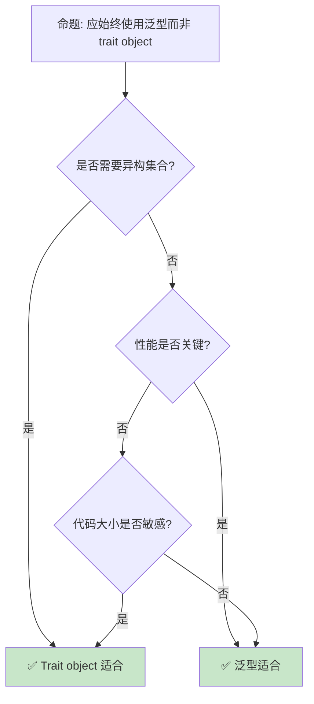

> **内容分级**: [专家级]

# 类型擦除与动态分发
>
> **EN**: Type Erasure
> **Summary**: Type Erasure: advanced Rust topics, performance/runtime considerations, and ecosystem patterns.
> **受众**: [专家]
> **Bloom 层级**: 分析 → 应用
> **定位**: 深入探讨 Rust 中的**类型擦除**技术——从 trait object 到 vtable，分析动态分发如何在保持类型安全的同时实现运行时多态。
> **前置概念**:
> [Trait](../02_intermediate/01_traits.md) ·
> [Type System](../01_foundation/04_type_system.md) ·
> [Generics](../02_intermediate/02_generics.md)
> **后置概念**:
> [Performance](../06_ecosystem/15_performance_optimization.md) ·
> [Object Safety](../02_intermediate/01_traits.md)

---

> **来源**: [TRPL — Trait Objects](https://doc.rust-lang.org/book/ch17-02-trait-objects.html) · [Reference — Dynamically Sized Types](https://doc.rust-lang.org/reference/dynamically-sized-types.html)
> [Rust Reference — Trait Objects](https://doc.rust-lang.org/reference/types/trait-object.html) ·
> [Wikipedia — Type Erasure](https://en.wikipedia.org/wiki/Type_erasure) ·
> [Rustonomicon](https://doc.rust-lang.org/nomicon/) ·
> [TRPL — Trait Objects](https://doc.rust-lang.org/book/ch17-02-trait-objects.html)

> **对应 Crate**: [`c04_generic`](../../crates/c04_generic/)

## 📑 目录

- [类型擦除与动态分发](#类型擦除与动态分发)
  - [📑 目录](#-目录)
  - [一、核心概念](#一核心概念)
    - [1.1 Trait Object](#11-trait-object)
    - [1.2 VTable](#12-vtable)
    - [1.3 对象安全](#13-对象安全)
    - [1.4 Trait Object Upcasting（1.86 stable）](#14-trait-object-upcasting186-stable)
  - [二、类型擦除模式](#二类型擦除模式)
    - [2.1 Box](#21-box)
    - [2.2 自定义类型擦除](#22-自定义类型擦除)
  - [三、性能权衡](#三性能权衡)
    - [3.1 静态 vs 动态分发](#31-静态-vs-动态分发)
  - [四、反命题与边界分析](#四反命题与边界分析)
    - [4.1 反命题树](#41-反命题树)
    - [4.2 边界极限](#42-边界极限)
  - [五、常见陷阱](#五常见陷阱)
  - [六、来源与延伸阅读](#六来源与延伸阅读)
  - [相关概念文件](#相关概念文件)
  - [逆向推理链（Backward Reasoning）](#逆向推理链backward-reasoning)
  - [权威来源索引](#权威来源索引)
  - [十、边界测试：类型擦除的编译错误](#十边界测试类型擦除的编译错误)
    - [10.1 边界测试：`dyn Trait` 的大小未知（编译错误）](#101-边界测试dyn-trait-的大小未知编译错误)
    - [10.2 边界测试：trait object 的方法返回 `Self`（编译错误）](#102-边界测试trait-object-的方法返回-self编译错误)
    - [10.3 边界测试：`Any` 的 `downcast_ref` 与生命周期（编译错误）](#103-边界测试any-的-downcast_ref-与生命周期编译错误)
    - [10.4 边界测试：vtable 与对象安全的隐性约束（编译错误）](#104-边界测试vtable-与对象安全的隐性约束编译错误)
    - [10.3 边界测试：`dyn Trait` 与 `Sized` 边界的冲突（编译错误）](#103-边界测试dyn-trait-与-sized-边界的冲突编译错误)
    - [10.4 边界测试：dyn Trait 的 Sized 要求与泛型约束（编译错误）](#104-边界测试dyn-trait-的-sized-要求与泛型约束编译错误)
    - [10.6 边界测试：所有权移动后的再次使用](#106-边界测试所有权移动后的再次使用)
  - [嵌入式测验（Embedded Quiz）](#嵌入式测验embedded-quiz)
    - [测验 1：`dyn Trait` 的大小为什么在编译时未知？它如何被实际使用？（理解层）](#测验-1dyn-trait-的大小为什么在编译时未知它如何被实际使用理解层)
    - [测验 2：`&dyn Trait` 在内存中的布局是什么？（理解层）](#测验-2dyn-trait-在内存中的布局是什么理解层)
    - [测验 3：一个 trait 要成为"对象安全"（object-safe）需要避免哪些特征？（理解层）](#测验-3一个-trait-要成为对象安全object-safe需要避免哪些特征理解层)
    - [测验 4：`Box<dyn Any>` 如何安全地向下转换回原始类型？（理解层）](#测验-4boxdyn-any-如何安全地向下转换回原始类型理解层)
    - [测验 5：类型擦除的主要优势是什么？代价又是什么？（理解层）](#测验-5类型擦除的主要优势是什么代价又是什么理解层)
  - [认知路径](#认知路径)
    - [核心推理链](#核心推理链)
    - [反命题与边界](#反命题与边界)
  - [实践](#实践)
    - [对应代码示例](#对应代码示例)
    - [建议练习](#建议练习)
  - [导航：下一步去哪？](#导航下一步去哪)

---

## 一、核心概念
>
>

### 1.1 Trait Object
>

```text
Trait Object:

  定义: 指向实现了某 trait 的具体类型的动态类型
  ├── 胖指针: (数据指针, vtable 指针)
  ├── 运行时确定具体类型
  └── 通过 dyn Trait 语法

  代码示例:

  trait Draw {
      fn draw(&self);
  }

  struct Button;
  impl Draw for Button { fn draw(&self) { println!("Button"); } }

  struct Select;
  impl Draw for Select { fn draw(&self) { println!("Select"); } }

  // 异构集合
  let components: Vec<Box<dyn Draw>> = vec![
      Box::new(Button),
      Box::new(Select),
  ];

  for c in components {
      c.draw(); // 动态分发
  }

  对比泛型:
  ┌─────────────────┬─────────────────┬─────────────────┐
  │ 方面            │ 泛型            │ Trait Object    │
  ├─────────────────┼─────────────────┼─────────────────┤
  │ 分发            │ 静态（单态化）  │ 动态（vtable）  │
  │ 性能            │ 内联优化        │ 间接调用        │
  │ 代码大小        │ 膨胀            │ 紧凑            │
  │ 异构集合        │ 不支持          │ 支持            │
  │ 编译期已知类型  │ 是              │ 否              │
  └─────────────────┴─────────────────┴─────────────────┘
> [来源: [Rust Reference — Trait Objects](https://doc.rust-lang.org/reference/types/trait-object.html)]
```

```rust
trait Greet {
    fn greet(&self);
}

struct Person;
impl Greet for Person {
    fn greet(&self) { println!("Hello from Person"); }
}

struct Robot;
impl Greet for Robot {
    fn greet(&self) { println!("Hello from Robot"); }
}

fn main() {
    let greeters: Vec<Box<dyn Greet>> = vec![
        Box::new(Person),
        Box::new(Robot),
    ];
    for g in greeters {
        g.greet();
    }
}
```

> **认知功能**: **Trait object 是 Rust 的运行时多态机制**——在需要异构集合或编译期未知类型时使用。
> [来源: [TRPL — Trait Objects](https://doc.rust-lang.org/book/ch17-02-trait-objects.html)]

---

### 1.2 VTable
>

```text
VTable (虚函数表):

  结构:
  ├── 指向 drop 函数的指针
  ├── 指向每个 trait 方法的指针
  ├── 指向类型大小和对齐的指针
  └── 运行时查找方法地址

  内存布局:
  Box<dyn Draw>
  ├── 指针 1: 指向数据（Button 或 Select）
  └── 指针 2: 指向 vtable

  vtable for Button:
  ├── drop_in_place: Button::drop
  ├── size: size_of::<Button>()
  ├── align: align_of::<Button>()
  └── draw: Button::draw

  注意:
  ├── 双重间接（指针 + vtable 查找）
  ├── 禁用内联优化
  └── 缓存不友好
```

> **VTable 洞察**: **VTable 是动态分发的运行时成本来源**——方法调用需要两次内存访问。
> [来源: [Rust Reference — Trait Objects](https://doc.rust-lang.org/reference/types/trait-object.html)]

---

### 1.3 对象安全
>

```text
对象安全 (Object Safety):

  定义: trait 可作为 dyn Trait 使用的条件
  ├── 方法返回类型不包含 Self（除非 Box<Self>）
  ├── 方法没有泛型参数
  └── 所有方法需满足以上条件

  对象安全示例:

  trait Safe {
      fn method(&self);           // ✅ 安全
      fn returns_box() -> Box<Self>; // ✅ 安全（特殊例外）
  }

  trait Unsafe {
      fn method(self) -> Self;    // ❌ 返回 Self
      fn generic<T>(&self, t: T); // ❌ 泛型方法
  }

  对象安全 trait 可转换为 trait object:
  let obj: Box<dyn Safe> = Box::new(MyType);

  非对象安全 trait 不能:
  // let obj: Box<dyn Unsafe> = ...; // 编译错误！
```

> **对象安全洞察**: **对象安全限制了 trait object 的能力**——泛型和 Self 返回需要静态分发。
> [来源: [Rust Reference — Object Safety](https://doc.rust-lang.org/reference/items/traits.html#object-safety)]

---

### 1.4 Trait Object Upcasting（1.86 stable）
>

Rust 1.86.0 稳定了 **trait object upcasting**：如果 `SubTrait: SuperTrait`，则 `dyn SubTrait` 可以安全地转换为 `dyn SuperTrait`。

```rust
use std::fmt::Debug;

trait Animal: Debug {}
trait Dog: Animal {}

fn upcast(dog: &dyn Dog) -> &dyn Animal {
    dog as &dyn Animal  // ✅ 1.86.0+ 无需额外 trait bound
}
```

**此前（1.85 及之前）**: 需要手动引入 `std::ops::Upcast` 相关 workaround，或定义辅助 trait。

> **权威来源**: [Rust 1.86.0 Release Notes](https://blog.rust-lang.org/2025/04/03/Rust-1.86.0.html) · [Rust Reference — Upcasting](https://doc.rust-lang.org/reference/types/trait-object.html#trait-object-upcasting)

---

## 二、类型擦除模式

### 2.1 Box<dyn Trait>
>

```text
Box<dyn Trait>:

  用途: 堆分配的类型擦除
  ├── 所有权转移
  ├── 已知大小（Box 是指针）
  └── 自动 drop

  其他智能指针:
  ├── Rc<dyn Trait>: 共享所有权
  ├── Arc<dyn Trait>: 线程安全共享
  └── &dyn Trait: 借用引用

  生命周期:
  ├── &dyn Trait + 'a: 限定生命周期
  ├── Box<dyn Trait + Send>: 限定 Send
  └── Box<dyn Trait + Send + Sync>: 线程安全

  代码示例:

  fn process(items: Vec<Box<dyn Draw + Send>>) {
      for item in items {
          item.draw();
      }
  }
```

```rust
trait Process {
    fn run(&self);
}

struct TaskA;
impl Process for TaskA {
    fn run(&self) { println!("Task A"); }
}

struct TaskB;
impl Process for TaskB {
    fn run(&self) { println!("Task B"); }
}

fn execute(items: Vec<Box<dyn Process + Send>>) {
    for item in items {
        item.run();
    }
}

fn main() {
    let tasks: Vec<Box<dyn Process + Send>> = vec![
        Box::new(TaskA),
        Box::new(TaskB),
    ];
    execute(tasks);
}
```

> **Box 洞察**: **Box<dyn Trait> 是最常用的类型擦除**——简单、安全、灵活。
> [来源: [std::boxed::Box](https://doc.rust-lang.org/std/boxed/struct.Box.html)]

---

### 2.2 自定义类型擦除
>

```text
自定义类型擦除:

  动机:
  ├── 避免 vtable 开销
  ├── 控制内存布局
  ├── 支持非对象安全 trait
  └── 特殊优化需求

  手动实现:

  struct MyAny {
      data: Box<dyn Any>,
      // 自定义 vtable
      drop_fn: unsafe fn(*mut ()),
      draw_fn: unsafe fn(*const ()),
  }

  更实用的模式:
  ├── enum 封装已知变体
  ├── 函数指针表
  └── 闭包捕获

  代码示例 (enum 擦除):

  enum DrawEnum {
      Button(Button),
      Select(Select),
  }

  impl Draw for DrawEnum {
      fn draw(&self) {
          match self {
              DrawEnum::Button(b) => b.draw(),
              DrawEnum::Select(s) => s.draw(),
          }
      }
  }

  // 比 dyn Draw 更快（静态分发）
  // 但只能处理已知类型
```

```rust
trait Drawable {
    fn draw(&self);
}

struct Circle;
impl Drawable for Circle {
    fn draw(&self) { println!("Circle"); }
}

struct Square;
impl Drawable for Square {
    fn draw(&self) { println!("Square"); }
}

enum Shape {
    Circle(Circle),
    Square(Square),
}

impl Drawable for Shape {
    fn draw(&self) {
        match self {
            Shape::Circle(c) => c.draw(),
            Shape::Square(s) => s.draw(),
        }
    }
}

fn main() {
    let shapes: Vec<Shape> = vec![
        Shape::Circle(Circle),
        Shape::Square(Square),
    ];
    for s in shapes {
        s.draw();
    }
}
```

> **自定义洞察**: **Enum 类型擦除比 trait object 更快**——但限制了可扩展性。
> [来源: [Rust Design Patterns — Type Erasure](https://rust-unofficial.github.io/patterns/)]

---

## 三、性能权衡

### 3.1 静态 vs 动态分发
>

```text
分发对比:

  静态分发（单态化）:
  ├── 编译期确定调用目标
  ├── 内联优化
  ├── 无间接开销
  └── 代码膨胀

  动态分发（trait object）:
  ├── 运行时查找方法
  ├── 无法内联
  ├── vtable 间接开销
  └── 代码紧凑

  性能差异:
  ┌─────────────────┬─────────────────┬─────────────────┐
  │ 操作            │ 静态            │ 动态            │
  ├─────────────────┼─────────────────┼─────────────────┤
  │ 方法调用        │ 直接跳转        │ vtable 查找     │
  │ 缓存友好        │ 高              │ 低              │
  │ 内联            │ 可以            │ 不能            │
  │ 分支预测        │ 准确            │ 可能失败        │
  │ 代码大小        │ 大              │ 小              │
  └─────────────────┴─────────────────┴─────────────────┘
> [来源: [TRPL](https://doc.rust-lang.org/book/title-page.html)]

  选择指南:
  ├── 性能关键路径: 静态
  ├── 代码大小敏感: 动态
  ├── 异构集合: 动态
  ├── 编译时间敏感: 动态
  └── 默认: 泛型（静态）
```

> **性能洞察**: **静态分发默认优先，动态分发在需要异构或代码大小时使用**。
> [来源: [Rust Performance Book](https://nnethercote.github.io/perf-book/)]

---

## 四、反命题与边界分析

### 4.1 反命题树
>



> **认知功能**: **异构集合和代码大小敏感选 trait object，性能关键选泛型**。

---

### 4.2 边界极限
>

```text
边界 1: 对象安全限制
├── 泛型方法不能是 trait object
├── Self 返回类型受限
└── 缓解: 辅助 trait、类型参数

边界 2: 生命周期复杂
├── dyn Trait + 'a 语法复杂
├── 借用 trait object 易出错
└── 缓解: 优先使用 Box<dyn>

边界 3: Downcast 困难
├── trait object 向下转型需 Any
├── 运行时类型检查
└── 缓解: 使用 enum 替代

边界 4: 调试困难
├── dyn Trait 的类型信息丢失
├── 调试器中难识别具体类型
└── 缓解: 实现 Debug trait

边界 5: FFI
├── C 不直接支持 vtable
├── 需要 C ABI 包装
└── 缓解: extern "C" 函数指针
```

> **边界要点**: 类型擦除的边界与**对象安全**、**生命周期（Lifetimes）**、**Downcast**、**调试**和**FFI**相关。
> [来源: [Rustonomicon](https://doc.rust-lang.org/nomicon/)]

---

## 五、常见陷阱

```text
陷阱 1: 混淆 dyn Trait 和 impl Trait
  ❌ 将 dyn Trait 当作 impl Trait 使用
     fn foo() -> dyn Draw { ... } // 编译错误！

  ✅ dyn Trait 只能通过指针使用
     fn foo() -> Box<dyn Draw> { ... }

陷阱 2: 忽略对象安全
  ❌ 对非对象安全 trait 使用 dyn
     trait Factory { fn create() -> Self; }
     // Box<dyn Factory> // 编译错误！

  ✅ 修改 trait 使其对象安全
     trait Factory { fn create_box() -> Box<dyn Product>; }

陷阱 3: 生命周期省略错误
  ❌ 借用 trait object 生命周期不匹配
     fn process(x: &dyn Draw) { ... }
     // 可能生命周期不足

  ✅ 显式标注生命周期
     fn process<'a>(x: &'a dyn Draw) { ... }

陷阱 4: 过度使用类型擦除
  ❌ 对所有 trait 使用 dyn
     // 损失了静态优化

  ✅ 仅在需要异构时使用
     // 其他情况用泛型

陷阱 5: 忘记 Send/Sync
  ❌ trait object 跨线程传递失败
     let obj: Box<dyn Draw> = ...;
     std::thread::spawn(move || obj.draw()); // 编译错误！

  ✅ 添加 Send bound
     let obj: Box<dyn Draw + Send> = ...;
```

> **陷阱总结**: 类型擦除的陷阱主要与**dyn 语法**、**对象安全**、**生命周期**、**过度使用**和**Send**相关。

---

## 六、来源与延伸阅读
>

| 来源 | 可信度 | 说明 |
|:---|:---:|:---|
| [TRPL — Trait Objects](https://doc.rust-lang.org/book/ch17-02-trait-objects.html) | ✅ 一级 | 官方书 |
| [Rust Reference — Trait Objects](https://doc.rust-lang.org/reference/types/trait-object.html) | ✅ 一级 | 参考 |
| [Rustonomicon](https://doc.rust-lang.org/nomicon/) | ✅ 一级 | unsafe 指南 |
| [Rust Performance Book](https://nnethercote.github.io/perf-book/) | ✅ 二级 | 性能 |
| [Rust Design Patterns](https://rust-unofficial.github.io/patterns/) | ✅ 二级 | 设计模式 |

---

## 相关概念文件

- [Trait](../02_intermediate/01_traits.md) — Trait
- [Generics](../02_intermediate/02_generics.md) — 泛型（Generics）
- [Performance](../06_ecosystem/15_performance_optimization.md) — 性能优化
- [Type System](../01_foundation/04_type_system.md) — 类型系统

---

> **权威来源**: [Rust Reference](https://doc.rust-lang.org/reference/)
>
> **权威来源对齐变更日志**: 2026-05-22 创建 [来源: Authority Source Sprint Batch 12]

**文档版本**: 1.0
**对应 Rust 版本**: 1.96.0+ (Edition 2024)
**最后更新**: 2026-05-22
**状态**: ✅ 概念文件创建完成

---

## 逆向推理链（Backward Reasoning）

> **从编译错误反推**：
>
> ```text
> 类型擦除安全 ⟸ vtable + 生命周期擦除
> ```
>
## 权威来源索引

>
>
>
>

---

---

---

> **补充来源**

## 十、边界测试：类型擦除的编译错误

### 10.1 边界测试：`dyn Trait` 的大小未知（编译错误）

```rust,compile_fail
trait Drawable {
    fn draw(&self);
}

struct Canvas;

impl Canvas {
    // ❌ 编译错误: `dyn Drawable` 的大小在编译期未知
    // trait object 是 DST（动态大小类型），不能直接作为值类型
    fn add(&mut self, item: dyn Drawable) {}
}

// 正确: 使用 Box 或引用
impl Canvas {
    fn add_boxed(&mut self, item: Box<dyn Drawable>) {} // ✅ Box 大小固定
    fn add_ref(&mut self, item: &dyn Drawable) {}       // ✅ 引用大小固定
}
```

> **修正**: `dyn Trait` 是动态大小类型（DST），编译器无法在编译期确定其大小（不同实现类型大小不同）。DST 不能直接作为函数参数、返回值或变量类型，必须放在指针后面：`Box<dyn Trait>`（拥有）、`&dyn Trait`（借用）、`&mut dyn Trait`（可变借用）。这与 C++ 的虚函数表指针类似，但 Rust 的 `dyn` 是显式语法，编译器拒绝隐式类型擦除。[来源: [Rust Reference](https://doc.rust-lang.org/reference/)]

### 10.2 边界测试：trait object 的方法返回 `Self`（编译错误）

```rust,compile_fail
trait Cloneable {
    fn clone(&self) -> Self; // 返回 Self
}

struct Button;
impl Cloneable for Button {
    fn clone(&self) -> Self { Button }
}

fn make_clone(obj: &dyn Cloneable) -> Box<dyn Cloneable> {
    // ❌ 编译错误: `Self` 在 trait object 中不允许
    // trait object 在运行时才知具体类型，无法确定 Self 的大小
    Box::new(obj.clone())
}

// 正确: 使用 dyn_clone crate 或修改 trait 设计
// trait Cloneable {
//     fn clone_box(&self) -> Box<dyn Cloneable>; // 返回固定大小类型
// }
```

> **修正**: Trait object 在运行时通过 vtable 动态分发，vtable 中的方法签名必须是"对象安全"（object-safe）的。返回 `Self` 的方法不是对象安全的，因为编译器无法在编译期确定 `Self` 的具体类型和大小。类似地，泛型方法（`fn method<T>(&self, t: T)`）也不是对象安全的——vtable 无法存储无限多单态化版本。Rust 编译器在 trait 定义时检查对象安全性，拒绝将非对象安全 trait 转为 `dyn Trait`。[来源: [Rust Reference](https://doc.rust-lang.org/reference/)]

### 10.3 边界测试：`Any` 的 `downcast_ref` 与生命周期（编译错误）

```rust,ignore
use std::any::Any;

fn main() {
    let s = String::from("hello");
    let any: &dyn Any = &s;
    // ❌ 编译错误: Any 要求 'static，&String 不是 'static
    // let s2 = any.downcast_ref::<String>().unwrap();
}
```

> **修正**: `dyn Any` 要求底层类型是 `'static`，因为 `Any` trait 的 `type_id` 方法在运行时识别类型，而运行时需要类型在程序生命周期内稳定。带生命引用的类型（`&'a String`）不能转为 `dyn Any`，因为 `'a` 可能短于 `'static`。解决方案：1) 使用 `Any` 时只处理 `'static` 类型（`String`、`Vec<T>`、`i32`）；2) 对非 `'static` 类型使用自定义 trait object 或 enum；3) 使用 `unsafe` 和裸指针绕过（不推荐）。这与 Java 的 `instanceof`（无生命周期限制）或 C++ 的 `dynamic_cast`（无生命周期限制）不同——Rust 的生命周期系统渗透到运行时类型擦除，确保即使动态分派也不违反内存安全。[来源: [Rust Standard Library](https://doc.rust-lang.org/std/any/trait.Any.html)] · [来源: [The Rust Programming Language](https://doc.rust-lang.org/book/ch17-02-trait-objects.html)]

### 10.4 边界测试：vtable 与对象安全的隐性约束（编译错误）

```rust,ignore
trait Processor {
    fn process<T: Default>(&self) -> T;
}

struct MyProcessor;

impl Processor for MyProcessor {
    fn process<T: Default>(&self) -> T {
        T::default()
    }
}

fn main() {
    // ❌ 编译错误: Processor 不是对象安全的，因为有泛型方法
    // let p: Box<dyn Processor> = Box::new(MyProcessor);
}
```

> **修正**: Trait 对象（`dyn Trait`）通过 vtable 实现动态分发，vtable 在编译期生成，包含所有方法的函数指针。泛型方法（`fn process<T>`）无法在 vtable 中表示，因为 `T` 的可能实例无限——编译器不能为所有类型生成函数指针。因此含泛型方法的 trait 不是**对象安全**的（object-safe），不能作为 `dyn Trait` 使用。这与 C++ 的虚函数（无泛型虚函数，模板方法不能是虚的）或 Java 的泛型接口（类型擦除，泛型信息在运行时不可用）不同——Rust 在编译期拒绝非对象安全的 trait 对象，防止运行时类型错误。替代方案：将泛型方法改为关联函数或非泛型方法，或使用静态分发（`impl Trait`）。[来源: [Rust Reference — Object Safety](https://doc.rust-lang.org/reference/items/traits.html#object-safety)] · [来源: [The Rust Programming Language](https://doc.rust-lang.org/book/ch17-02-trait-objects.html)]

### 10.3 边界测试：`dyn Trait` 与 `Sized` 边界的冲突（编译错误）

```rust,compile_fail
trait Processor {
    fn process(&self);
}

fn make_processor() -> Box<dyn Processor> {
    struct MyProc;
    impl Processor for MyProc {
        fn process(&self) { println!("processing"); }
    }
    Box::new(MyProc)
}

// ❌ 编译错误: dyn Trait 是 !Sized，不能作为泛型参数传递给要求 Sized 的函数
fn use_processor<P: Processor>(p: P) {
    p.process();
}

fn main() {
    let proc = make_processor();
    use_processor(*proc); // dyn Processor 不满足 Sized
}
```

> **修正**: `dyn Trait` 是**动态分发**类型，大小不固定（`!Sized`），因为不同实现的大小不同。`Box<dyn Trait>` 和 `&dyn Trait` 是**胖指针**（数据指针 + vtable 指针），本身是 `Sized` 的。若函数要求 `P: Processor`（隐式 `P: Sized`），不能传入 `dyn Processor`。修复：1) `fn use_processor(p: &dyn Processor)`（接受引用）；2) `fn use_processor(p: Box<dyn Processor>)`（接受 Box）；3) `fn use_processor<P: Processor + ?Sized>(p: &P)`（放宽 Sized 约束）。类型擦除与单态化的权衡：`dyn Trait` 减少代码膨胀（一个函数处理所有类型），但有虚函数调用开销。这与 C++ 的虚函数（类似机制，但无显式 `dyn` 标记）或 Go 的 interface（类似 fat pointer，但隐式实现）不同——Rust 的 `dyn` 显式标记动态分发，编译器在类型层面区分静态和动态多态。[来源: [Rust Reference — Trait Objects](https://doc.rust-lang.org/reference/types/trait-object.html)] · [来源: [The Rust Programming Language](https://doc.rust-lang.org/book/ch17-02-trait-objects.html)]

### 10.4 边界测试：dyn Trait 的 Sized 要求与泛型约束（编译错误）

```rust,compile_fail,compute_fail
trait Process {
    fn run(&self);
}

fn generic<T: Process>(item: T) {
    item.run();
}

fn erased(item: dyn Process) {
    // ❌ 编译错误: dyn Trait 是 DST，不能直接按值传递
    item.run();
}

fn main() {}
```

> **修正**: **`dyn Trait`** 是 **DST**（Dynamically Sized Type）：1) 编译时大小未知（vtable 指针 + 数据指针）；2) 必须 behind 指针：`&dyn Trait`、`Box<dyn Trait>`、`Arc<dyn Trait>`；3) 不能直接按值传递、不能作为泛型参数（除非 `T: ?Sized`）。`dyn Trait` 的限制：1) 只能 object-safe trait（方法无泛型、返回类型非 `Self`）；2) 方法调用有 vtable 间接开销；3) 不能从 `dyn Trait` 反向转为具体类型（除非 `Any` downcast）。零大小类型：`dyn Trait` 的 vtable 可能有零大小数据（`()`），但指针仍有 2 个 usize。这与 C++ 的虚函数（对象内含 vptr，大小固定）或 Java 的接口引用（始终是引用，类似 `&dyn`）不同——Rust 的 `dyn` 是显式的 DST，有明确的 object safety 规则。[来源: [Trait Objects](https://doc.rust-lang.org/book/ch17-02-trait-objects.html)] · [来源: [Object Safety](https://doc.rust-lang.org/reference/items/traits.html#object-safety)]

### 10.6 边界测试：所有权移动后的再次使用

```rust,compile_fail
fn main() {
    let s = String::from("hello");
    let s2 = s;
    // ❌ 编译错误: s 已被 move 到 s2
    println!("{}", s);
}
```

> **修正**: **Move 语义**：1) `String` 非 `Copy`，赋值时 move 所有权（Ownership）；2) move 后原变量无效；3) 解决：使用 `.clone()` 或引用 `&s`。

> **权威来源**: [Rust Reference](https://doc.rust-lang.org/reference/) · [The Rust Programming Language](https://doc.rust-lang.org/book/title-page.html) · [Rust Standard Library](https://doc.rust-lang.org/std/)
> **对应 Rust 版本**: 1.96.0+ (Edition 2024)

> **权威来源**: [Rust Reference](https://doc.rust-lang.org/reference/) · [The Rust Programming Language](https://doc.rust-lang.org/book/title-page.html) · [Rust Standard Library](https://doc.rust-lang.org/std/)
> **对应 Rust 版本**: 1.96.0+ (Edition 2024)

## 嵌入式测验（Embedded Quiz）

### 测验 1：`dyn Trait` 的大小为什么在编译时未知？它如何被实际使用？（理解层）

**题目**: `dyn Trait` 的大小为什么在编译时未知？它如何被实际使用？

<details>
<summary>✅ 答案与解析</summary>

因为实现了 Trait 的具体类型大小各异。使用时通常放在指针后面：`Box<dyn Trait>`、`&dyn Trait` 或 `Arc<dyn Trait>`。
</details>

---

### 测验 2：`&dyn Trait` 在内存中的布局是什么？（理解层）

**题目**: `&dyn Trait` 在内存中的布局是什么？

<details>
<summary>✅ 答案与解析</summary>

胖指针：一个指向数据的指针和一个指向 vtable 的指针。vtable 包含 trait 方法的实现和类型元数据。
</details>

---

### 测验 3：一个 trait 要成为"对象安全"（object-safe）需要避免哪些特征？（理解层）

**题目**: 一个 trait 要成为"对象安全"（object-safe）需要避免哪些特征？

<details>
<summary>✅ 答案与解析</summary>

通常不能有泛型方法（含 `<T>` 的方法）、关联常量、返回 `Self` 的方法，除非使用 `where Self: Sized` 排除。
</details>

---

### 测验 4：`Box<dyn Any>` 如何安全地向下转换回原始类型？（理解层）

**题目**: `Box<dyn Any>` 如何安全地向下转换回原始类型？

<details>
<summary>✅ 答案与解析</summary>

使用 `downcast_ref::<T>()` 或 `downcast::<T>()`，它们依赖 `TypeId` 在运行时检查类型是否匹配，失败返回 `None` 或 `Err`。
</details>

---

### 测验 5：类型擦除的主要优势是什么？代价又是什么？（理解层）

**题目**: 类型擦除的主要优势是什么？代价又是什么？

<details>
<summary>✅ 答案与解析</summary>

优势是统一接口、解耦代码、支持运行时多态。代价是动态分发开销和失去静态类型信息，可能降低内联优化机会。
</details>

## 认知路径

> **认知路径**: 从 L0 基础概念出发，经由本节的 **类型擦除与动态分发** 核心原理，通向 L2 进阶模式与 L3 工程实践。

### 核心推理链

| 定理 | 前提 | 结论 | 置信度 |
|:---|:---|:---|:---|
| 类型擦除与动态分发 基础定义 ⟹ 正确用法 | 理解语法与语义 | 能写出符合惯用法的代码 | 高 |
| 类型擦除与动态分发 正确用法 ⟹ 常见陷阱 | 忽略边界条件 | 编译错误或运行时 bug | 高 |
| 类型擦除与动态分发 常见陷阱 ⟹ 深度掌握 | 系统学习反模式 | 能进行代码审查与优化 | 高 |

> 动态分发安全 ⟸ Any/TypeId 反射 ⟸ 向下转换
> vtable 布局正确 ⟸ dyn Trait ⟸ 对象安全条件
> **过渡**: 掌握 类型擦除与动态分发 的基础语法后，下一步需要理解其在类型系统中的位置与与其他概念的交互关系。

> **过渡**: 在实践中应用 类型擦除与动态分发 时，务必关注边界条件与异常处理，这是从"能编译"到"能生产"的关键跃迁。

> **过渡**: 类型擦除与动态分发 的设计理念体现了 Rust 零成本抽象与安全保证的核心权衡，理解这一权衡有助于迁移到更高级的并发与形式化验证领域。

### 反命题与边界

> **反命题**: "类型擦除与动态分发 在所有场景下都是最佳选择" —— 错误。需要根据具体上下文权衡性能、可读性与安全性，某些场景下显式替代方案可能更优。

---

---

## 实践

> 将本节概念转化为可编译代码。

### 对应代码示例

- **[crates/c09_design_pattern](../../../crates/c09_design_pattern/)** — 与本节概念对应的可编译 crate 示例

### 建议练习

1. 阅读 `crates/c09_design_pattern/` 中与"类型擦除"相关的源码和示例
2. 运行 `cargo test -p c09_design_pattern` 验证理解

---

## 导航：下一步去哪？

> **自检**：你当前掌握的核心概念是否已能独立应用？

| 选择 | 条件 | 目标 |
|:---|:---|:---|
| 🔙 巩固基础 | 仍有模糊概念 | 回到 [L2 对应主题](../02_intermediate/) 或 [MVP 学习路径](../00_meta/LEARNING_MVP_PATH.md) |
| 🔜 深入 L3 其他主题 | 想扩展高级技能 | [L3 README](./README.md) 选择其他主题 |
| 🎓 进入 L4 形式化 | 想理解"为什么"的数学证明 | [L4 形式化](../04_formal/README.md) |
| 🏗️ 进入 L6 生态 | 想掌握生产工具链 | [L6 生态](../06_ecosystem/README.md) |
