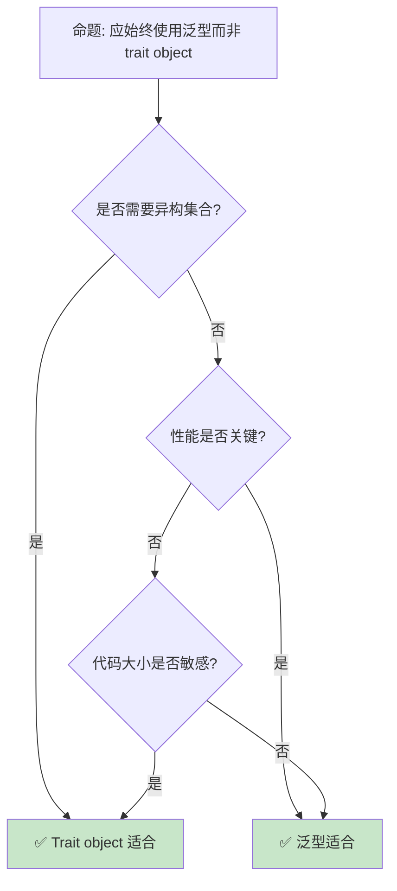

# 类型擦除与动态分发

> **Bloom 层级**: 分析 → 应用
> **定位**: 深入探讨 Rust 中的**类型擦除**技术——从 trait object 到 vtable，分析动态分发如何在保持类型安全的同时实现运行时多态。
> **前置概念**: [Trait](../02_intermediate/01_traits.md) · [Type System](../01_foundation/04_type_system.md) · [Generics](../02_intermediate/02_generics.md)
> **后置概念**: [Performance](../06_ecosystem/15_performance_optimization.md) · [Object Safety](../02_intermediate/01_traits.md)

---

> **来源**: [The Rust Programming Language](https://doc.rust-lang.org/book/) · [Rust Reference — Trait Objects](https://doc.rust-lang.org/reference/types/trait-object.html) · [Wikipedia — Type Erasure](https://en.wikipedia.org/wiki/Type_erasure) · [Rustonomicon](https://doc.rust-lang.org/nomicon/) · [TRPL — Trait Objects](https://doc.rust-lang.org/book/ch17-02-trait-objects.html)

## 📑 目录
> [来源: [TRPL](https://doc.rust-lang.org/book/)]

- [类型擦除与动态分发](#类型擦除与动态分发)
  - [📑 目录](#-目录)
  - [一、核心概念](#一核心概念)
    - [1.1 Trait Object](#11-trait-object)
    - [1.2 VTable](#12-vtable)
    - [1.3 对象安全](#13-对象安全)
  - [二、类型擦除模式](#二类型擦除模式)
    - [2.1 Box](#21-box)
    - [2.2 自定义类型擦除](#22-自定义类型擦除)
  - [三、性能权衡](#三性能权衡)
    - [3.1 静态 vs 动态分发](#31-静态-vs-动态分发)
  - [四、反命题与边界分析](#四反命题与边界分析)
    - [4.1 反命题树](#41-反命题树)
    - [4.2 边界极限](#42-边界极限)
  - [五、常见陷阱](#五常见陷阱)
  - [六、来源与延伸阅读](#六来源与延伸阅读)
  - [相关概念文件](#相关概念文件)

---

## 一、核心概念
> [来源: [Rust Reference](https://doc.rust-lang.org/reference/)]

### 1.1 Trait Object

```text
Trait Object:

  定义: 指向实现了某 trait 的具体类型的动态类型
  ├── 胖指针: (数据指针, vtable 指针)
  ├── 运行时确定具体类型
  └── 通过 dyn Trait 语法

  代码示例:

  trait Draw {
      fn draw(&self);
  }

  struct Button;
  impl Draw for Button { fn draw(&self) { println!("Button"); } }

  struct Select;
  impl Draw for Select { fn draw(&self) { println!("Select"); } }

  // 异构集合
  let components: Vec<Box<dyn Draw>> = vec![
      Box::new(Button),
      Box::new(Select),
  ];

  for c in components {
      c.draw(); // 动态分发
  }

  对比泛型:
  ┌─────────────────┬─────────────────┬─────────────────┐
  │ 方面            │ 泛型            │ Trait Object    │
  ├─────────────────┼─────────────────┼─────────────────┤
  │ 分发            │ 静态（单态化）  │ 动态（vtable）  │
  │ 性能            │ 内联优化        │ 间接调用        │
  │ 代码大小        │ 膨胀            │ 紧凑            │
  │ 异构集合        │ 不支持          │ 支持            │
  │ 编译期已知类型  │ 是              │ 否              │
  └─────────────────┴─────────────────┴─────────────────┘
> [来源: [Rust Reference — Trait Objects]]
```

```rust
trait Greet {
    fn greet(&self);
}

struct Person;
impl Greet for Person {
    fn greet(&self) { println!("Hello from Person"); }
}

struct Robot;
impl Greet for Robot {
    fn greet(&self) { println!("Hello from Robot"); }
}

fn main() {
    let greeters: Vec<Box<dyn Greet>> = vec![
        Box::new(Person),
        Box::new(Robot),
    ];
    for g in greeters {
        g.greet();
    }
}
```

> **认知功能**: **Trait object 是 Rust 的运行时多态机制**——在需要异构集合或编译期未知类型时使用。
> [来源: [TRPL — Trait Objects](https://doc.rust-lang.org/book/ch17-02-trait-objects.html)]

---

### 1.2 VTable

```text
VTable (虚函数表):

  结构:
  ├── 指向 drop 函数的指针
  ├── 指向每个 trait 方法的指针
  ├── 指向类型大小和对齐的指针
  └── 运行时查找方法地址

  内存布局:
  Box<dyn Draw>
  ├── 指针 1: 指向数据（Button 或 Select）
  └── 指针 2: 指向 vtable

  vtable for Button:
  ├── drop_in_place: Button::drop
  ├── size: size_of::<Button>()
  ├── align: align_of::<Button>()
  └── draw: Button::draw

  注意:
  ├── 双重间接（指针 + vtable 查找）
  ├── 禁用内联优化
  └── 缓存不友好
```

> **VTable 洞察**: **VTable 是动态分发的运行时成本来源**——方法调用需要两次内存访问。
> [来源: [Rust Reference — Trait Objects](https://doc.rust-lang.org/reference/types/trait-object.html)]

---

### 1.3 对象安全

```text
对象安全 (Object Safety):

  定义: trait 可作为 dyn Trait 使用的条件
  ├── 方法返回类型不包含 Self（除非 Box<Self>）
  ├── 方法没有泛型参数
  └── 所有方法需满足以上条件

  对象安全示例:

  trait Safe {
      fn method(&self);           // ✅ 安全
      fn returns_box() -> Box<Self>; // ✅ 安全（特殊例外）
  }

  trait Unsafe {
      fn method(self) -> Self;    // ❌ 返回 Self
      fn generic<T>(&self, t: T); // ❌ 泛型方法
  }

  对象安全 trait 可转换为 trait object:
  let obj: Box<dyn Safe> = Box::new(MyType);

  非对象安全 trait 不能:
  // let obj: Box<dyn Unsafe> = ...; // 编译错误！
```

> **对象安全洞察**: **对象安全限制了 trait object 的能力**——泛型和 Self 返回需要静态分发。
> [来源: [Rust Reference — Object Safety](https://doc.rust-lang.org/reference/items/traits.html#object-safety)]

---

## 二、类型擦除模式
> [来源: [Rust Reference](https://doc.rust-lang.org/reference/)]

### 2.1 Box<dyn Trait>

```text
Box<dyn Trait>:

  用途: 堆分配的类型擦除
  ├── 所有权转移
  ├── 已知大小（Box 是指针）
  └── 自动 drop

  其他智能指针:
  ├── Rc<dyn Trait>: 共享所有权
  ├── Arc<dyn Trait>: 线程安全共享
  └── &dyn Trait: 借用引用

  生命周期:
  ├── &dyn Trait + 'a: 限定生命周期
  ├── Box<dyn Trait + Send>: 限定 Send
  └── Box<dyn Trait + Send + Sync>: 线程安全

  代码示例:

  fn process(items: Vec<Box<dyn Draw + Send>>) {
      for item in items {
          item.draw();
      }
  }
```

```rust
trait Process {
    fn run(&self);
}

struct TaskA;
impl Process for TaskA {
    fn run(&self) { println!("Task A"); }
}

struct TaskB;
impl Process for TaskB {
    fn run(&self) { println!("Task B"); }
}

fn execute(items: Vec<Box<dyn Process + Send>>) {
    for item in items {
        item.run();
    }
}

fn main() {
    let tasks: Vec<Box<dyn Process + Send>> = vec![
        Box::new(TaskA),
        Box::new(TaskB),
    ];
    execute(tasks);
}
```

> **Box 洞察**: **Box<dyn Trait> 是最常用的类型擦除**——简单、安全、灵活。
> [来源: [std::boxed::Box](https://doc.rust-lang.org/std/boxed/struct.Box.html)]

---

### 2.2 自定义类型擦除

```text
自定义类型擦除:

  动机:
  ├── 避免 vtable 开销
  ├── 控制内存布局
  ├── 支持非对象安全 trait
  └── 特殊优化需求

  手动实现:

  struct MyAny {
      data: Box<dyn Any>,
      // 自定义 vtable
      drop_fn: unsafe fn(*mut ()),
      draw_fn: unsafe fn(*const ()),
  }

  更实用的模式:
  ├── enum 封装已知变体
  ├── 函数指针表
  └── 闭包捕获

  代码示例 (enum 擦除):

  enum DrawEnum {
      Button(Button),
      Select(Select),
  }

  impl Draw for DrawEnum {
      fn draw(&self) {
          match self {
              DrawEnum::Button(b) => b.draw(),
              DrawEnum::Select(s) => s.draw(),
          }
      }
  }

  // 比 dyn Draw 更快（静态分发）
  // 但只能处理已知类型
```

```rust
trait Drawable {
    fn draw(&self);
}

struct Circle;
impl Drawable for Circle {
    fn draw(&self) { println!("Circle"); }
}

struct Square;
impl Drawable for Square {
    fn draw(&self) { println!("Square"); }
}

enum Shape {
    Circle(Circle),
    Square(Square),
}

impl Drawable for Shape {
    fn draw(&self) {
        match self {
            Shape::Circle(c) => c.draw(),
            Shape::Square(s) => s.draw(),
        }
    }
}

fn main() {
    let shapes: Vec<Shape> = vec![
        Shape::Circle(Circle),
        Shape::Square(Square),
    ];
    for s in shapes {
        s.draw();
    }
}
```

> **自定义洞察**: **Enum 类型擦除比 trait object 更快**——但限制了可扩展性。
> [来源: [Rust Design Patterns — Type Erasure](https://rust-unofficial.github.io/patterns/patterns/behavioural/type-erasure.html)]

---

## 三、性能权衡
> [来源: [TRPL](https://doc.rust-lang.org/book/)]

### 3.1 静态 vs 动态分发

```text
分发对比:

  静态分发（单态化）:
  ├── 编译期确定调用目标
  ├── 内联优化
  ├── 无间接开销
  └── 代码膨胀

  动态分发（trait object）:
  ├── 运行时查找方法
  ├── 无法内联
  ├── vtable 间接开销
  └── 代码紧凑

  性能差异:
  ┌─────────────────┬─────────────────┬─────────────────┐
  │ 操作            │ 静态            │ 动态            │
  ├─────────────────┼─────────────────┼─────────────────┤
  │ 方法调用        │ 直接跳转        │ vtable 查找     │
  │ 缓存友好        │ 高              │ 低              │
  │ 内联            │ 可以            │ 不能            │
  │ 分支预测        │ 准确            │ 可能失败        │
  │ 代码大小        │ 大              │ 小              │
  └─────────────────┴─────────────────┴─────────────────┘
> [来源: [TRPL](https://doc.rust-lang.org/book/)]

  选择指南:
  ├── 性能关键路径: 静态
  ├── 代码大小敏感: 动态
  ├── 异构集合: 动态
  ├── 编译时间敏感: 动态
  └── 默认: 泛型（静态）
```

> **性能洞察**: **静态分发默认优先，动态分发在需要异构或代码大小时使用**。
> [来源: [Rust Performance Book](https://nnethercote.github.io/perf-book/)]

---

## 四、反命题与边界分析
> [来源: [Rust Reference](https://doc.rust-lang.org/reference/)]

### 4.1 反命题树



> **认知功能**: **异构集合和代码大小敏感选 trait object，性能关键选泛型**。
> [来源: [Rust Performance Book](https://nnethercote.github.io/perf-book/)]

---

### 4.2 边界极限

```text
边界 1: 对象安全限制
├── 泛型方法不能是 trait object
├── Self 返回类型受限
└── 缓解: 辅助 trait、类型参数

边界 2: 生命周期复杂
├── dyn Trait + 'a 语法复杂
├── 借用 trait object 易出错
└── 缓解: 优先使用 Box<dyn>

边界 3: Downcast 困难
├── trait object 向下转型需 Any
├── 运行时类型检查
└── 缓解: 使用 enum 替代

边界 4: 调试困难
├── dyn Trait 的类型信息丢失
├── 调试器中难识别具体类型
└── 缓解: 实现 Debug trait

边界 5: FFI
├── C 不直接支持 vtable
├── 需要 C ABI 包装
└── 缓解: extern "C" 函数指针
```

> **边界要点**: 类型擦除的边界与**对象安全**、**生命周期**、**Downcast**、**调试**和**FFI**相关。
> [来源: [Rustonomicon](https://doc.rust-lang.org/nomicon/)]

---

## 五、常见陷阱
> [来源: [TRPL](https://doc.rust-lang.org/book/)]

```text
陷阱 1: 混淆 dyn Trait 和 impl Trait
  ❌ 将 dyn Trait 当作 impl Trait 使用
     fn foo() -> dyn Draw { ... } // 编译错误！

  ✅ dyn Trait 只能通过指针使用
     fn foo() -> Box<dyn Draw> { ... }

陷阱 2: 忽略对象安全
  ❌ 对非对象安全 trait 使用 dyn
     trait Factory { fn create() -> Self; }
     // Box<dyn Factory> // 编译错误！

  ✅ 修改 trait 使其对象安全
     trait Factory { fn create_box() -> Box<dyn Product>; }

陷阱 3: 生命周期省略错误
  ❌ 借用 trait object 生命周期不匹配
     fn process(x: &dyn Draw) { ... }
     // 可能生命周期不足

  ✅ 显式标注生命周期
     fn process<'a>(x: &'a dyn Draw) { ... }

陷阱 4: 过度使用类型擦除
  ❌ 对所有 trait 使用 dyn
     // 损失了静态优化

  ✅ 仅在需要异构时使用
     // 其他情况用泛型

陷阱 5: 忘记 Send/Sync
  ❌ trait object 跨线程传递失败
     let obj: Box<dyn Draw> = ...;
     std::thread::spawn(move || obj.draw()); // 编译错误！

  ✅ 添加 Send bound
     let obj: Box<dyn Draw + Send> = ...;
```

> **陷阱总结**: 类型擦除的陷阱主要与**dyn 语法**、**对象安全**、**生命周期**、**过度使用**和**Send**相关。
> [来源: [Rust Reference — Trait Objects](https://doc.rust-lang.org/reference/types/trait-object.html)]

---

## 六、来源与延伸阅读

| 来源 | 可信度 | 说明 |
|:---|:---:|:---|
| [TRPL — Trait Objects](https://doc.rust-lang.org/book/ch17-02-trait-objects.html) | ✅ 一级 | 官方书 |
| [Rust Reference — Trait Objects](https://doc.rust-lang.org/reference/types/trait-object.html) | ✅ 一级 | 参考 |
| [Rustonomicon](https://doc.rust-lang.org/nomicon/) | ✅ 一级 | unsafe 指南 |
| [Rust Performance Book](https://nnethercote.github.io/perf-book/) | ✅ 二级 | 性能 |
| [Rust Design Patterns](https://rust-unofficial.github.io/patterns/) | ✅ 二级 | 设计模式 |

---

## 相关概念文件
> [来源: [Rust Reference](https://doc.rust-lang.org/reference/)]

- [Trait](../02_intermediate/01_traits.md) — Trait
- [Generics](../02_intermediate/02_generics.md) — 泛型
- [Performance](15_performance_optimization.md) — 性能优化
- [Type System](../01_foundation/04_type_system.md) — 类型系统

---

> **权威来源**: [Rust Reference](https://doc.rust-lang.org/reference/)
>
> **权威来源对齐变更日志**: 2026-05-22 创建 [来源: Authority Source Sprint Batch 12]

**文档版本**: 1.0
**对应 Rust 版本**: 1.96.0+ (Edition 2024)
**最后更新**: 2026-05-22
**状态**: ✅ 概念文件创建完成
