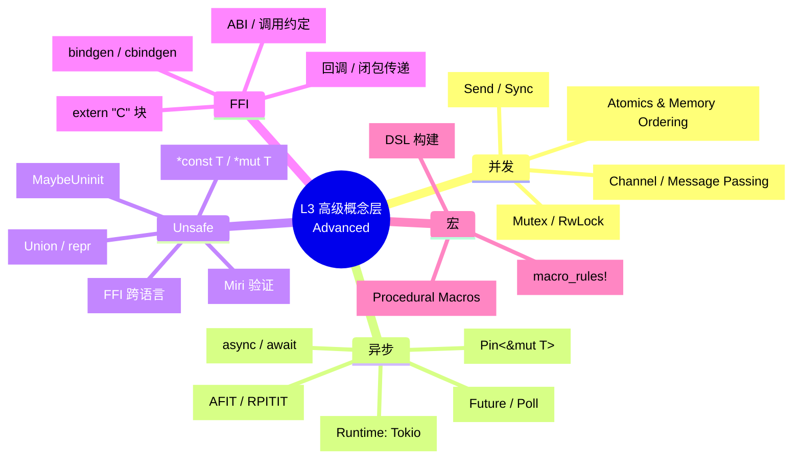
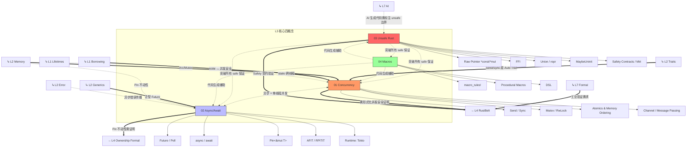

> **生态状态提示**：本文档提及 `async-std` 与/或 `wasm32-wasi`。请注意：
>
> - `async-std` 项目已进入维护模式，2024 年后不再活跃开发；新项目建议优先评估 **Tokio** 或 **smol**。
> - `wasm32-wasi` 旧目标名已重命名为 **`wasm32-wasip1`**；WASI Preview 2 对应目标为 **`wasm32-wasip2`**。
>
> **来源**: [Rust Reference](https://doc.rust-lang.org/reference/) · [Rustonomicon](https://doc.rust-lang.org/nomicon/) · [Async Book](https://rust-lang.github.io/async-book/)
---

# L3 高级概念层（Advanced）
>
> **EN**: Readme
> **Summary**: Readme. Core Rust concept.
> **受众**: [专家]
> **定位**：Rust 的高级特性，涉及并发、异步（Async）、Unsafe 和元编程。本层是 L1-L2 概念在**复杂场景**中的组合应用与边界突破。
> **Bloom 层级**: 应用 → 分析 → 评价
> **对应 L4 形式化**: 并发分离逻辑 · 线性时序逻辑 · 效果系统 · 元类型论
> **来源: [Rust Reference - Concurrency](https://doc.rust-lang.org/reference/)** · **来源: [Rustonomicon - docs.rust-lang.org/nomicon](https://doc.rust-lang.org/nomicon/)** · **来源: [Wikipedia - Asynchronous I/O](https://en.wikipedia.org/wiki/Asynchronous_I/O)** · **来源: [Wikipedia - Metaprogramming](https://en.wikipedia.org/wiki/Metaprogramming)**

---

## 〇、L3 认知入口



> **认知功能**: 全局概念导航图——在学习具体子主题前建立"并发-异步-Unsafe-宏（Macro）"四域心智框架。
> 使用建议：将本图作为目录锚点，定位感兴趣的概念后再深入对应文件阅读。
> 关键洞察：L3 并非新增孤立语法，而是 L1 所有权与 L2 Trait 在复杂场景中的组合应用与边界突破。[来源: 💡 原创分析]
> **认知路径**: 本 mindmap 展示 L3 层的**复杂场景组合**。
> 并发将 L1 借用规则扩展到多线程，异步将所有权扩展到状态机，Unsafe 是安全边界的逃逸舱口，宏是元编程工具。
> 核心洞察：**并发和异步都是所有权系统在不同执行模型下的应用**——线程是抢占式并行，Future 是协作式串行。

## 一、本层概念关系图（完整版）



> **认知功能**: 跨层依赖拓扑图——揭示 L3 核心四概念与 L1/L2 输入、L4/L7 输出之间的完整关系网络。
> 使用建议：阅读本层任何文件前查看此图，理解该概念在知识体系中的上下游位置与依赖路径。
> 关键洞察：Unsafe 处于中心辐射位——它是突破 safe 边界的唯一通道，也是所有 L3 概念通向形式化验证的必经枢纽。[来源: 💡 原创分析]

### 1.1 概念间语义链接

| 关系 | 从 | 到 | 语义类型 | 说明 |
|:---|:---|:---|:---|:---|
| 1 | **Concurrency** | **Async** | `<-.->` 等价/特化 | 异步编程是**单线程并发**的一种形式。`Future` 的执行模型本质上是协作式多任务，与线程抢占式并发形成对照。 |
| 2 | **Unsafe** | **所有 safe 概念** | `-.->` 边界/突破 | `unsafe` 是 Rust 安全保证的**边界**。在 unsafe 块内，L1 的所有权规则、L2 的 Trait 规则均可能被手动突破。 |
| 3 | **L2 Send/Sync** | **Concurrency** | `==>` 充分条件 | `Send + Sync` 是编译期对并发安全的**充分条件**（非必要：可通过 unsafe 手动实现）。 |
| 4 | **L2 Pin** | **Async** | `-.->` 前置 | 自引用结构（如 async 状态机）需要 `Pin` 保证内存位置不动，否则引用失效。 |
| 5 | **Async** | **L4 形式化** | `==>` 需求 | `Pin` 的形式化语义是目前理论研究的活跃领域，async 的正确性需要更强的形式化支撑。 |

### 1.2 Unsafe 的中心地位

```text
                    L1 所有权
                   L2 Trait/泛型
                        │
                        │ safe 保证
                        ▼
    ┌─────────────────────────────────────┐
    │           Unsafe 边界                │
    │  ┌─────────────────────────────┐    │
    │  │  * 裸指针操作               │    │
    │  │  * FFI 调用                │    │
    │  │  * 手动内存管理            │    │
    │  │  * unsafe impl Send/Sync   │    │
    │  │  * Union 类型访问          │    │
    │  └─────────────────────────────┘    │
    │           ↑ 安全契约                 │
    │    程序员手动保证不变性              │
    └─────────────────────────────────────┘
                        │
                        ▼
                 L4 RustBelt 验证
            （unsafe 代码不在自动证明范围内）
```

---

## 二、文件索引与关系

| 文件 | 概念 | 核心内容 | 状态 | 前置（L1-L2） | 后置（L4-L7） |
|:---|:---|:---|:---|:---|:---|
| [01_concurrency.md](./01_concurrency.md) | 并发模型 | `Send`/`Sync`、fearless concurrency、同步原语、原子操作（Atomic Operations） | ✅ v1.0 | Ownership + Borrowing + Trait (Auto) | RustBelt (并发验证), AI (并发代码生成) |
| [02_async.md](./02_async.md) | 异步编程 | `Future`、`async/await`、`Pin`、AFIT/RPITIT、运行时（Runtime） | ✅ v1.0 | Generics + Trait + Pin (L2) | 形式化 (Pin 语义), 生态 (Tokio) |
| [03_unsafe.md](./03_unsafe.md) | Unsafe Rust | 裸指针、FFI、UB 边界、Safety 契约、Miri | ✅ v1.0 | 所有 L1-L2 概念 | RustBelt (unsafe 验证), C++ 对比 |
| [04_macros.md](./04_macros.md) | 宏系统 | `macro_rules!`、过程宏（Procedural Macro）、DSL、卫生宏 | ✅ v1.0 | Type System + Trait | 生态 (代码生成), AI (模板生成) |
| [05_rust_ffi.md](./05_rust_ffi.md) | FFI 跨语言 | extern 块、ABI 兼容、类型映射、bindgen、回调封装 | ✅ v1.0 | Type System + Unsafe | 生态 (跨语言), C++ 对比 |
| [06_pin_unpin.md](./06_pin_unpin.md) | Pin 与 Unpin | 自引用类型、PhantomPinned、async 状态机、Pin API 契约 | ✅ v1.0 | Ownership + Generics | Async, Gen Blocks |
| [07_proc_macro.md](./07_proc_macro.md) | 过程宏 | Derive/Attribute/Function-like、TokenStream、syn/quote | ✅ v1.0 | Trait + Type System | 生态 (代码生成), DSL |
| [08_nll_and_polonius.md](./08_nll_and_polonius.md) | NLL 与 Polonius | 非词法生命周期、数据流分析、Origin 模型、借用检查演进 | ✅ v1.0 | Borrowing, Lifetimes | RustBelt, Pin |
| [19_parallel_distributed_pattern_spectrum.md](./19_parallel_distributed_pattern_spectrum.md) | 并行-分布式谱系 | 线程池→工作窃取→Actor→CSP→数据流→共识的连续体 | ✅ v1.0 | Concurrency, Async | Distributed Systems |
| [20_stream_processing_semantics.md](./20_stream_processing_semantics.md) | 流处理语义 | Dataflow Model、Watermark、Exactly-Once、Differential Dataflow | ✅ v1.0 | Concurrency, Async | Stream Processing Ecosystem |

---

### 补充文件索引

- [Async/Await 高级主题](./02_async_advanced.md)
- [异步模式：从 Future 到生产级并发](./02_async_patterns.md)
- [Async Closures（异步闭包）](./24_async_closures.md)
- [FFI 高级主题：跨语言边界的安全与性能](./09_ffi_advanced.md)
- [并发 模式：从消息 传递到锁自由的数据结构](./10_concurrency_patterns.md)
- [原子操作与内存序：无锁并发的精确控制](./11_atomics_and_memory_ordering.md)
- [Unsafe Rust 模式：安全抽象的核心技术](./12_unsafe_rust_patterns.md)
- [内联汇编：`asm!` 宏与跨平台 SIMD](./13_inline_assembly.md)
- [自定义分配器与内存布局优化](./14_custom_allocators.md)
- [零拷贝解析与序列化优化](./15_zero_copy_parsing.md)
- [无锁编程与内存模型](./16_lock_free.md)
- [类型擦除与动态分发](./17_type_erasure.md)
- [测验：并发与异步（嵌入式互动试点）](./21_quiz_concurrency_async.md)
- [测验：Unsafe Rust（嵌入式互动试点）](./22_quiz_unsafe.md)
- [测验：宏系统（嵌入式互动试点）](./23_quiz_macros.md)

## 三、学习路径建议

```text
L2 Intermediate
    │
    ├──→ Concurrency ←──────→ Async/Await
    │       │                      │
    │       │                      │
    │       └──────────┬───────────┘
    │                  │
    │                  ▼
    │    ┌─────────────────────────┐
    │    │   Unsafe Rust ←→ Macros │
    │    └─────────────────────────┘
    │                  │
    ▼                  ▼
L4 Formal / L5 Comparative / L7 Future
```

### 3.1 严格依赖路径

```text
Concurrency
    │ 必须先掌握: L1 Borrowing (AXM), L2 Trait (Send/Sync Auto Trait)
    │ 后置: Async (Future 跨线程), RustBelt (并发验证)
    │ 反事实: 若无 Send/Sync，则跨线程传递需 unsafe 手动保证
    ↓
Async/Await
    │ 必须先掌握: L2 Generics (Future trait), L2 Memory (Pin)
    │ 后置: 生态 (Tokio), 形式化 (Pin 不动性证明)
    │ 反事实: 若无 Pin，则自引用结构在 await 点后引用失效
    ↓
Unsafe Rust
    │ 必须先掌握: 所有 L1-L2 概念（知道规则才能突破）
    │ 后置: FFI (C 互操作), RustBelt (unsafe 契约验证)
    │ 反事实: 若滥用 unsafe，则所有编译期安全保证失效
    ↓
Macros
    │ 必须先掌握: L1 Type System (语法树), L2 Trait (派生宏)
    │ 后置: 生态 (DSL 设计), AI (代码模板生成)
    │ 反事实: 若宏不规范，则编译错误信息难以调试
```

---

## 四、形式化层级定位

| 概念 | 理论层 (Why) | 模型层 (What) | 实践层 (How) | L4 形式化对应 |
|:---|:---|:---|:---|:---|
| **Concurrency** | 并发分离逻辑 (CSL) | Send/Sync 规则、 happens-before | `thread::spawn`、`Arc`、`Mutex` | CSL · Iris Protocols · happens-before 图 |
| **Async** | 效果系统 / 续体 (Continuation) | 状态机转换、Pin 约束 | `async {}`、`await`、`Future::poll` | Effect Systems · LTL (线性时序逻辑) |
| **Unsafe** | —（证明范围外） | 安全契约、UB 列表 | `unsafe {}`、裸指针、FFI | 手动验证 · 公理化语义 |
| **Macros** | 元类型论 / 准引用 (Quasiquote) | 语法树变换 (Token → AST) | `macro_rules!`、`proc_macro` | 元编程理论 · Hygienic Macros |

---

## 五、本层定理一致性概览

| 定理 | 前提 | 结论 | 依赖的 L4 理论 | 失效条件 | 边界 |
|:---|:---|:---|:---|:---|:---|
| Fearless Concurrency | `T: Send + Sync` | 跨线程共享无数据竞争 | CSL + Iris | `unsafe impl`、裸指针别名 | UnsafeCell |
| Future 轮询安全 | `Pin<&mut Self>` | 自引用在 poll 中有效 | —（部分形式化） | poll 中手动移动 | `!Unpin` 标记 |
| async 状态机安全 | 编译器生成 + Pin | await 点状态转换合法 | —（待形式化） | 跨越 await 持有非 Send 变量 | `Send` 自动推导 |
| unsafe 契约充分性 | 程序员手动保证 | safe API 封装后内部 unsafe 不泄漏 | —（手动证明） | 契约不完整、前置条件遗漏 | Miri 动态检测 |
| 宏卫生性 | 规则遵循 | 宏变量不污染外部作用域 | Hygienic Macros | 过程宏可绕过卫生性 | 命名冲突 |

---

## 六、认知路径

```text
直觉困惑                    具体场景                  模式抽象               形式规则              代码验证              边界测试
    │                         │                       │                     │                    │                    │
    ▼                         ▼                       ▼                     ▼                    ▼                    ▼
"多线程怎么安全？"           "两个线程同时            "Send/Sync =          "并发分离            "编译器检查           "unsafe impl
                             读写一个变量"            类型级并发证明"        逻辑 (CSL)"         Send/Sync 约束"      Send/Sync"

"异步代码怎么工作？"         "await 后变量            "Future = 状态机       "效果系统/           "Pin 保证              "跨越 await
                             还能用吗？"             + Pin 不动性"          续体转换"            自引用有效"           持有非 Send"

"unsafe 到底多危险？"        "FFI 调用 C 函数        "unsafe = 程序员        "手动证明            "Miri 检测            "所有 safe
                             怎么保证安全？"         承担证明责任"          义务"               UB"                定理失效"

"宏怎么写？"                 "重复代码怎么            "宏 = 语法树           "准引用/             "proc_macro           "编译错误
                             自动生成？"             代码生成"             元类型论"            调试"               信息晦涩"
```

---

## 七、是否继续？导航分岔口

> **受众**: [专家]

L3 是 Rust 工程能力的**顶峰**。在继续之前，请自检以下能力：

| 检查项 | 自检标准 | 若未达标 |
|:---|:---|:---|
| 并发 | 能独立编写含 `Mutex`/`Arc`/`Channel` 的多线程程序，并解释死锁原因 | 回到 [L3 并发](./01_concurrency.md) |
| 异步 | 能用 `tokio::spawn` + `async/await` 实现并发 HTTP 请求，理解 `Future` 轮询 | 回到 [L3 异步](./02_async.md) |
| Unsafe | 能写出 `unsafe` 块并说明为什么这是安全的（Safety Contract） | 回到 [L3 Unsafe](./03_unsafe.md) |
| 生命周期（Lifetimes） | 能标注含多个引用的函数签名，理解 HRTB | 回到 [L2 生命周期](../02_intermediate/18_lifetimes_advanced.md) |

**分岔口选择**：

- ✅ **进入 L4 形式化**：如果你希望理解"为什么 Rust 能编译通过"的数学证明 → [L4 形式化](../04_formal/README.md)
- ✅ **进入 L5 对比**：如果你希望对比 Rust 与其他语言的差异 → [L5 对比](../05_comparative/README.md)
- ✅ **进入 L6 生态**：如果你希望掌握生产环境工具链 → [L6 生态](../06_ecosystem/README.md)
- ⏸️ **留在 L3 巩固**：如果你仍有上述检查项未达标，建议先完成 [MVP 学习路径](../00_meta/LEARNING_MVP_PATH.md) 的 Week 2

---

## 八、跨层出口

掌握 L3 后可进入：

- **L4 形式化**: RustBelt（并发安全验证）、Pin 不动性形式化、unsafe 语义
- **L5 对比**: Rust vs C++（unsafe vs 无约束）、Rust vs Go（async vs goroutine）
- **L6 生态**: Tokio/Async-std 运行时、unsafe 代码审查规范
- **L7 前沿**: AI 生成 Rust 代码的 unsafe 边界标注、形式化方法工业化

---

> **权威来源**: [Rust Reference](https://doc.rust-lang.org/reference/), [The Rust Programming Language](https://doc.rust-lang.org/book/title-page.html), [Rustonomicon](https://doc.rust-lang.org/nomicon/)
>
> **权威来源对齐变更日志**: 2026-05-19 补全权威来源标注（Rust Reference、TRPL、Rustonomicon、RFCs、学术论文） [来源: Authority Source Sprint Batch 8]
> **内容分级**: [专家级]

**文档版本**: 1.1
**对应 Rust 版本**: 1.96.0+ (Edition 2024)
**最后更新: 2026-05-21
**状态**: ✅ 权威来源对齐完成 (Batch 8)

## 嵌入式测验（Embedded Quiz）

### 测验 1：《L3 高级概念层（Advanced）》在本知识体系中扮演什么角色？（理解层）

**题目**: 《L3 高级概念层（Advanced）》在本知识体系中扮演什么角色？

<details>
<summary>✅ 答案与解析</summary>

作为导航和索引文档，帮助学习者快速定位内容、理解知识结构关系，是进入各层内容的入口和路线图。
</details>

---

### 测验 2：使用本索引文件时，最有效的学习策略是什么？（理解层）

**题目**: 使用本索引文件时，最有效的学习策略是什么？

<details>
<summary>✅ 答案与解析</summary>

先浏览整体结构建立全局视野，然后根据自身水平选择对应层级，遇到模糊概念时利用交叉引用跳转复习。
</details>

---

### 测验 3：索引文档能否替代具体概念文件的学习？（理解层）

**题目**: 索引文档能否替代具体概念文件的学习？

<details>
<summary>✅ 答案与解析</summary>

不能。索引提供的是结构框架和导航，深入理解需要通过阅读具体概念文件、完成测验和实践练习来实现。
</details>
