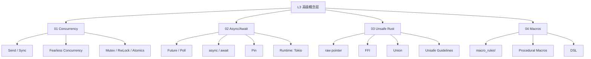

# L3 高级概念层（Advanced）

> **定位**：Rust 的高级特性，涉及并发、异步、Unsafe 和元编程。本层内容对齐 TRPL 第 16-20 章、Stanford CS340R 研究论文、Rust RFCs。

---

## 一、本层概念图谱



---

## 二、文件索引

| 文件 | 概念 | 核心内容 | 状态 |
|:---|:---|:---|:---|
| `01_concurrency.md` | 并发模型 | `Send`/`Sync`、 fearless concurrency、同步原语 | ✅ v1.0 |
| `02_async.md` | 异步编程 | `Future`、`async/await`、`Pin`、运行时 | ✅ v1.0 |
| `03_unsafe.md` | Unsafe Rust | 裸指针、FFI、UB 边界、Safety 契约 | ✅ v1.0 |
| `04_macros.md` | 宏系统 | `macro_rules!`、过程宏、DSL | ✅ v1.0 |

---

## 三、学习路径建议

```
L2 Intermediate
    ↓
Concurrency ←────→ Async/Await
    ↓                  ↓
Unsafe Rust ←────→ Macros
    ↓
L4 Formal / L5 Comparative
```

---

## 四、待创建内容（按 Phase 2 计划）

详见 [PLAN.md](../PLAN.md) Phase 2 部分。
