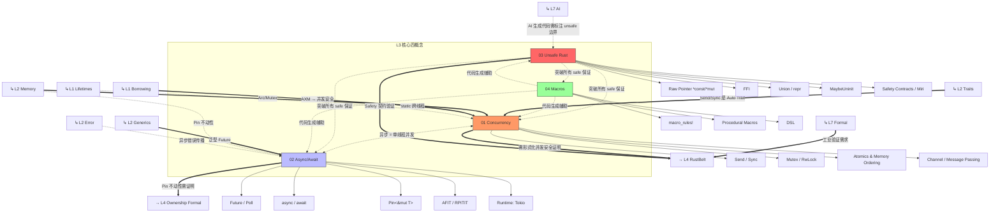

# L3 高级概念层（Advanced）

> **定位**：Rust 的高级特性，涉及并发、异步、Unsafe 和元编程。本层是 L1-L2 概念在**复杂场景**中的组合应用与边界突破。
> **Bloom 层级**: 应用 → 分析 → 评价
> **对应 L4 形式化**: 并发分离逻辑 · 线性时序逻辑 · 效果系统 · 元类型论
> **[来源: Rust Reference - Concurrency]** · **[来源: Rustonomicon - docs.rust-lang.org/nomicon]** · **[来源: Wikipedia - Asynchronous I/O]** · **[来源: Wikipedia - Metaprogramming]**

---

## 一、本层概念关系图（完整版）



### 1.1 概念间语义链接

| 关系 | 从 | 到 | 语义类型 | 说明 |
|:---|:---|:---|:---|:---|
| 1 | **Concurrency** | **Async** | `<-.->` 等价/特化 | 异步编程是**单线程并发**的一种形式。`Future` 的执行模型本质上是协作式多任务，与线程抢占式并发形成对照。 |
| 2 | **Unsafe** | **所有 safe 概念** | `-.->` 边界/突破 | `unsafe` 是 Rust 安全保证的**边界**。在 unsafe 块内，L1 的所有权规则、L2 的 Trait 规则均可能被手动突破。 |
| 3 | **L2 Send/Sync** | **Concurrency** | `==>` 充分条件 | `Send + Sync` 是编译期对并发安全的**充分条件**（非必要：可通过 unsafe 手动实现）。 |
| 4 | **L2 Pin** | **Async** | `-.->` 前置 | 自引用结构（如 async 状态机）需要 `Pin` 保证内存位置不动，否则引用失效。 |
| 5 | **Async** | **L4 形式化** | `==>` 需求 | `Pin` 的形式化语义是目前理论研究的活跃领域，async 的正确性需要更强的形式化支撑。 |

### 1.2 Unsafe 的中心地位

```text
                    L1 所有权
                   L2 Trait/泛型
                        │
                        │ safe 保证
                        ▼
    ┌─────────────────────────────────────┐
    │           Unsafe 边界                │
    │  ┌─────────────────────────────┐    │
    │  │  * 裸指针操作               │    │
    │  │  * FFI 调用                │    │
    │  │  * 手动内存管理            │    │
    │  │  * unsafe impl Send/Sync   │    │
    │  │  * Union 类型访问          │    │
    │  └─────────────────────────────┘    │
    │           ↑ 安全契约                 │
    │    程序员手动保证不变性              │
    └─────────────────────────────────────┘
                        │
                        ▼
                 L4 RustBelt 验证
            （unsafe 代码不在自动证明范围内）
```

---

## 二、文件索引与关系

| 文件 | 概念 | 核心内容 | 状态 | 前置（L1-L2） | 后置（L4-L7） |
|:---|:---|:---|:---|:---|:---|
| [01_concurrency.md](./01_concurrency.md) | 并发模型 | `Send`/`Sync`、fearless concurrency、同步原语、原子操作 | ✅ v1.0 | Ownership + Borrowing + Trait (Auto) | RustBelt (并发验证), AI (并发代码生成) |
| [02_async.md](./02_async.md) | 异步编程 | `Future`、`async/await`、`Pin`、AFIT/RPITIT、运行时 | ✅ v1.0 | Generics + Trait + Pin (L2) | 形式化 (Pin 语义), 生态 (Tokio) |
| [03_unsafe.md](./03_unsafe.md) | Unsafe Rust | 裸指针、FFI、UB 边界、Safety 契约、Miri | ✅ v1.0 | 所有 L1-L2 概念 | RustBelt (unsafe 验证), C++ 对比 |
| [04_macros.md](./04_macros.md) | 宏系统 | `macro_rules!`、过程宏、DSL、卫生宏 | ✅ v1.0 | Type System + Trait | 生态 (代码生成), AI (模板生成) |

---

## 三、学习路径建议

```text
L2 Intermediate
    │
    ├──→ Concurrency ←──────→ Async/Await
    │       │                      │
    │       │                      │
    │       └──────────┬───────────┘
    │                  │
    │                  ▼
    │    ┌─────────────────────────┐
    │    │   Unsafe Rust ←→ Macros │
    │    └─────────────────────────┘
    │                  │
    ▼                  ▼
L4 Formal / L5 Comparative / L7 Future
```

### 3.1 严格依赖路径

```text
Concurrency
    │ 必须先掌握: L1 Borrowing (AXM), L2 Trait (Send/Sync Auto Trait)
    │ 后置: Async (Future 跨线程), RustBelt (并发验证)
    │ 反事实: 若无 Send/Sync，则跨线程传递需 unsafe 手动保证
    ↓
Async/Await
    │ 必须先掌握: L2 Generics (Future trait), L2 Memory (Pin)
    │ 后置: 生态 (Tokio), 形式化 (Pin 不动性证明)
    │ 反事实: 若无 Pin，则自引用结构在 await 点后引用失效
    ↓
Unsafe Rust
    │ 必须先掌握: 所有 L1-L2 概念（知道规则才能突破）
    │ 后置: FFI (C 互操作), RustBelt (unsafe 契约验证)
    │ 反事实: 若滥用 unsafe，则所有编译期安全保证失效
    ↓
Macros
    │ 必须先掌握: L1 Type System (语法树), L2 Trait (派生宏)
    │ 后置: 生态 (DSL 设计), AI (代码模板生成)
    │ 反事实: 若宏不规范，则编译错误信息难以调试
```

---

## 四、形式化层级定位

| 概念 | 理论层 (Why) | 模型层 (What) | 实践层 (How) | L4 形式化对应 |
|:---|:---|:---|:---|:---|
| **Concurrency** | 并发分离逻辑 (CSL) | Send/Sync 规则、 happens-before | `thread::spawn`、`Arc`、`Mutex` | CSL · Iris Protocols · happens-before 图 |
| **Async** | 效果系统 / 续体 (Continuation) | 状态机转换、Pin 约束 | `async {}`、`await`、`Future::poll` | Effect Systems · LTL (线性时序逻辑) |
| **Unsafe** | —（证明范围外） | 安全契约、UB 列表 | `unsafe {}`、裸指针、FFI | 手动验证 · 公理化语义 |
| **Macros** | 元类型论 / 准引用 (Quasiquote) | 语法树变换 (Token → AST) | `macro_rules!`、`proc_macro` | 元编程理论 · Hygienic Macros |

---

## 五、本层定理一致性概览

| 定理 | 前提 | 结论 | 依赖的 L4 理论 | 失效条件 | 边界 |
|:---|:---|:---|:---|:---|:---|
| Fearless Concurrency | `T: Send + Sync` | 跨线程共享无数据竞争 | CSL + Iris | `unsafe impl`、裸指针别名 | UnsafeCell |
| Future 轮询安全 | `Pin<&mut Self>` | 自引用在 poll 中有效 | —（部分形式化） | poll 中手动移动 | `!Unpin` 标记 |
| async 状态机安全 | 编译器生成 + Pin | await 点状态转换合法 | —（待形式化） | 跨越 await 持有非 Send 变量 | `Send` 自动推导 |
| unsafe 契约充分性 | 程序员手动保证 | safe API 封装后内部 unsafe 不泄漏 | —（手动证明） | 契约不完整、前置条件遗漏 | Miri 动态检测 |
| 宏卫生性 | 规则遵循 | 宏变量不污染外部作用域 | Hygienic Macros | 过程宏可绕过卫生性 | 命名冲突 |

---

## 六、认知路径

```text
直觉困惑                    具体场景                  模式抽象               形式规则              代码验证              边界测试
    │                         │                       │                     │                    │                    │
    ▼                         ▼                       ▼                     ▼                    ▼                    ▼
"多线程怎么安全？"           "两个线程同时            "Send/Sync =          "并发分离            "编译器检查           "unsafe impl
                             读写一个变量"            类型级并发证明"        逻辑 (CSL)"         Send/Sync 约束"      Send/Sync"

"异步代码怎么工作？"         "await 后变量            "Future = 状态机       "效果系统/           "Pin 保证              "跨越 await
                             还能用吗？"             + Pin 不动性"          续体转换"            自引用有效"           持有非 Send"

"unsafe 到底多危险？"        "FFI 调用 C 函数        "unsafe = 程序员        "手动证明            "Miri 检测            "所有 safe
                             怎么保证安全？"         承担证明责任"          义务"               UB"                定理失效"

"宏怎么写？"                 "重复代码怎么            "宏 = 语法树           "准引用/             "proc_macro           "编译错误
                             自动生成？"             代码生成"             元类型论"            调试"               信息晦涩"
```

---

## 七、跨层出口

掌握 L3 后可进入：

- **L4 形式化**: RustBelt（并发安全验证）、Pin 不动性形式化、unsafe 语义
- **L5 对比**: Rust vs C++（unsafe vs 无约束）、Rust vs Go（async vs goroutine）
- **L6 生态**: Tokio/Async-std 运行时、unsafe 代码审查规范
- **L7 前沿**: AI 生成 Rust 代码的 unsafe 边界标注、形式化方法工业化

---

> **权威来源**: [Rust Reference](https://doc.rust-lang.org/reference/), [The Rust Programming Language](https://doc.rust-lang.org/book/), [Rustonomicon](https://doc.rust-lang.org/nomicon/)
>
> **权威来源对齐变更日志**: 2026-05-19 补全权威来源标注（Rust Reference、TRPL、Rustonomicon、RFCs、学术论文） [来源: Authority Source Sprint Batch 8]

**文档版本**: 1.1
**对应 Rust 版本**: 1.95.0+ (Edition 2024)
**最后更新**: 2026-05-19
**状态**: ✅ 权威来源对齐完成 (Batch 8)
