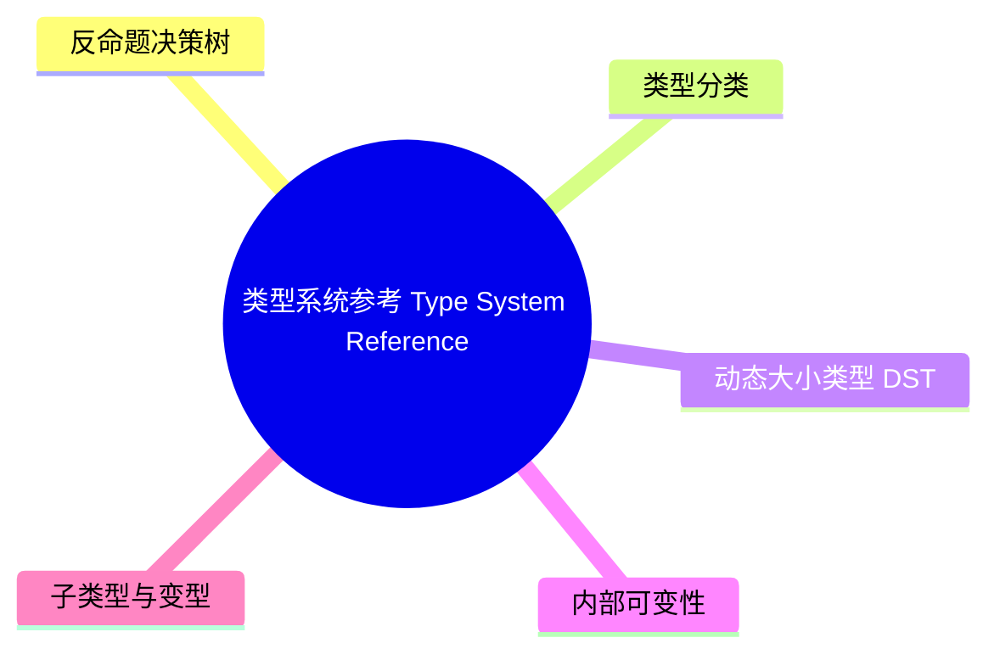

# 类型系统参考（Type System Reference）

> **EN**: Type System Reference
> **Summary**: Rust Reference 对类型系统的完整规范：各类型子类、动态大小类型、内部可变性、子类型与变型、trait/lifetime 约束、类型强制转换、发散类型、生命周期（Lifetimes）省略。 Complete Rust Reference specification of the type system: subtypes, variances, trait/lifetime bounds, coercions, diverging types, and lifetime elision.
> **Rust 版本**: 1.97.0+ (Edition 2024)
>
> **受众**: [研究者]
> **内容分级**: [研究级]
> **Bloom 层级**: L2-L4
> **权威来源**: 本文件为 `concept/` 权威页。
> **A/S/P 标记**: **S** — Specification
> **双维定位**: S×Ana — 规范分析
> **前置依赖**: [Type System](../../01_foundation/02_type_system/01_type_system.md) · [Type Layout](../05_rustc_internals/08_type_layout.md) · [Variables](../../03_advanced/06_low_level_patterns/09_variables.md)
> **后置概念**: [Subtyping and Variance](02_subtype_variance.md) · [Behavior Considered Undefined](../01_ownership_logic/06_behavior_considered_undefined.md) · [Application Binary Interface](../05_rustc_internals/05_application_binary_interface.md)
> **定理链**: Type → Kind → Size/Align → Lifetime → Trait Bounds
>
> **来源**: [Rust Reference — Type System](https://doc.rust-lang.org/reference/types.html) · [Pierce — Types and Programming Languages](https://www.cis.upenn.edu/~bcpierce/tapl/) · [Cardelli & Wegner — On Understanding Types](https://doi.org/10.1145/6041.6042) · [Jung et al. — RustBelt: Securing the Foundations of Rust](https://plv.mpi-sws.org/rustbelt/popl18/) · [TRPL](https://doc.rust-lang.org/book/title-page.html) · [Itanium C++ ABI](https://itanium-cxx-abi.github.io/cxx-abi/abi.html)

---

## 反命题决策树

(Source: [Rust Reference — Type System](https://doc.rust-lang.org/reference/types.html))

## 一、类型分类

Rust 类型可分为 (Source: [Rust Reference — Type System](https://doc.rust-lang.org/reference/types.html))：

| 类别 | 示例 | 说明 |
|:---|:---|:---|
| 原始类型 | `bool`, `i32`, `u64`, `f64`, `char` | 标量，大小固定 |
| 复合类型 | tuple、array、struct、enum、union | 由多个值组合 |
| 函数类型 | `fn(i32) -> i32` | 函数指针 |
| 指针类型 | `&T`, `&mut T`, `*const T`, `*mut T`, `Box<T>` | 引用（Reference）与裸指针 |
| Trait 对象 | `dyn Trait` | 动态分发 |
| `impl Trait` | `impl Iterator` | 抽象具体类型 |
| 类型参数 | `T`, `'a`, `const N: usize` | 泛型（Generics）参数 |
| Never 类型 | `!` | 发散类型 |
| Inferred 类型 | `_` | 类型推断（Type Inference）占位 |

## 二、动态大小类型（DST）

DST 在编译期大小未知，必须置于指针之后 (Source: [Rust Reference — Dynamically Sized Types](https://doc.rust-lang.org/reference/dynamically-sized-types.html))：

- `dyn Trait`
- `[T]`
- `str`

通过 `&dyn Trait`、`&[T]`、`&str`、`Box<dyn Trait>` 等 fat pointer 使用。

详见 [Type System Advanced](../../02_intermediate/04_types_and_conversions/04_type_system_advanced.md)。

## 三、内部可变性

内部可变性允许在不可变引用（Immutable Reference）后修改数据：

| 类型 | 适用场景 |
|:---|:---|
| `Cell<T>` | 单线程，只要求 `Copy` |
| `RefCell<T>` | 单线程，运行时（Runtime）借用（Borrowing）检查 |
| `Mutex<T>` | 多线程，互斥 |
| `RwLock<T>` | 多线程，读写锁 |
| `Atomic*` | 多线程，原子操作（Atomic Operations） |
(Source: [Rust Reference — Type System](https://doc.rust-lang.org/reference/types.html))

## 四、子类型与变型

- 生命周期（Lifetimes）具有子类型关系：`'static: 'a`。
- 变型描述类型构造器对子类型的保留方式：协变、逆变、不变。

详见 [Subtyping and Variance](02_subtype_variance.md)。
(Source: [Rust Reference — Type System](https://doc.rust-lang.org/reference/types.html))

## 五、Trait 与 Lifetime Bounds

类型参数可受约束：

```rust
fn foo<'a, T: Clone + Send + 'a>(x: T) {}
```

- Trait bound：`T: Trait`
- Lifetime bound：`T: 'a`
- Higher-ranked trait bound (HRTB)：`for<'a> T: Trait<'a>`
(Source: [Rust Reference — Type System](https://doc.rust-lang.org/reference/types.html))

## 六、类型强制转换

Rust 在特定位置自动执行类型强制（coercion）：

| 强制 | 示例 |
|:---|:---|
| 解引用（Reference） | `&String` → `&str` |
| 数组转切片（Slice） | `[T; N]` → `[T]` |
| 子类型 | `&'static str` → `&'a str` |
| Trait 对象 | `&T` → `&dyn Trait` |
| 函数项转指针 | `fn item` → `fn pointer` |
(Source: [Rust Reference — Type System](https://doc.rust-lang.org/reference/types.html))

## 七、生命周期省略

函数签名中生命周期（Lifetimes）可省略，编译器按三条规则推导 (Source: [Rust Reference — Lifetime Elision](https://doc.rust-lang.org/reference/items/generics.html#lifetime-elision))：

1. 每个 elided 输入参数获得独立生命周期（Lifetimes）。
2. 若只有一个输入生命周期（Lifetimes），所有输出生命周期与之相同。
3. 若 `&self` 或 `&mut self` 存在，其生命周期（Lifetimes）赋给所有输出生命周期。

---

## 从 `crates\c02_type_system\docs\tier_04_advanced\03_formalizing_type_systems.md` 迁移的补充视角

> **来源**: 本小节内容从 `crates/` 下的学习指南迁移而来，用于在单一权威页中保留该学习材料的宏（Macro）观视角与知识组织方式。完整代码示例与练习仍可在原 crates 文档的替代页面中查看。

# 4.3 Rust 类型系统 - 类型系统形式化

> **文档类型**: Tier 4 - 高级层
> **文档定位**: 类型系统（Type System）的形式化描述
> **适用对象**: 高级开发者 + 研究者
> **前置知识**: [4.1 类型理论深度](../../../crates/c02_type_system/docs/tier_04_advanced/01_type_theory_in_depth.md), 形式化方法基础
> **最后更新**: 2025-12-11

---

## 📋 目录

- [4.3 Rust 类型系统（Type System） - 类型系统形式化](#43-rust-类型系统---类型系统形式化)
  - [📋 目录](#-目录)
  - [📐 知识结构](#-知识结构)
    - [概念定义](#概念定义)
    - [属性特征](#属性特征)
    - [关系连接](#关系连接)
    - [思维导图](#思维导图)
    - [多维概念对比矩阵](#多维概念对比矩阵)
    - [决策树图](#决策树图)
    - [证明树图](#证明树图)
  - [🎯 概述](#-概述)
  - [1. 语法定义](#1-语法定义)
    - [1.1 核心语法](#11-核心语法)
    - [1.2 扩展语法](#11-核心语法)
    - [1.3 语法糖](#11-核心语法)
  - 1. 类型规则
    - 2.1 基础类型规则
    - 2.2 引用（Reference）类型规则
    - 2.3 高级类型规则
  - 1. 操作语义
    - 3.1 小步语义
    - 3.2 大步语义
    - 3.3 堆模型
  - 1. 所有权（Ownership）规则
    - 4.1 所有权（Ownership）转移
    - 4.2 Copy vs Move 语义
    - 4.3 Drop 语义
  - 1. 借用（Borrowing）检查
    - 5.1 借用（Borrowing）规则形式化
    - 5.2 Polonius 借用（Borrowing）检查器
    - 5.3 NLL (Non-Lexical Lifetimes)
  - [6. 生命周期（Lifetimes）推断](#七生命周期省略)
    - 6.1 生命周期约束系统
    - 6.2 区域类型系统（Type System）
    - 6.3 生命周期省略（Lifetime Elision）规则
  - 1. 类型健全性
    - 7.1 类型保全性证明
    - 7.2 进展性证明
    - 7.3 内存安全（Memory Safety）证明
  - 1. 分离逻辑与 RustBelt
    - 8.1 分离逻辑基础
    - 8.2 Iris 框架
    - 8.3 RustBelt 模型
  - 1. Oxide: Rust 的核心演算
    - 9.1 Oxide 语法
    - 9.2 Oxide 类型系统
    - 9.3 Oxide 证明
  - 1. 高级主题
    - 10.1 型变与子类型
    - 10.2 Higher-Ranked Types
    - 10.3 效应系统
    - 10.4 类型演算的元理论性质
    - 10.5 并发与同步的形式化
    - 10.6 异步（Async）的形式化
    - 10.7 Unsafe 代码的形式化
    - 10.8 常量泛型（Generics）的形式化
  - 1. 实践：形式化验证工具
    - 11.1 Prusti
    - 11.2 Creusot
    - 11.3 Verus
    - 11.4 Kani: 模型检查器
    - 11.5 形式化验证实战案例
    - 11.6 形式化方法的比较
    - 11.7 形式化验证的未来方向
  - 1. 总结
  - 1. 参考资源

---

## 📐 知识结构

本节把「类型系统参考（Type System Reference）」的知识结构收敛为四个视角：概念定义、属性特征、关系连接、思维导图等方面。概念定义回答「是什么」，属性特征回答「有哪些不变量」，关系连接回答「与相邻概念如何互相推导」，思维导图给出可视化索引。四个视角对照阅读，可以检验对同一概念的理解是否自洽——任何一处对不上，都说明该环节需要回到正文复核。

### 概念定义

**类型系统形式化 (Type System Formalization)**:

- **定义**: Rust 1.92.0 类型系统的形式化描述，包括语法定义、类型规则、操作语义、所有权（Ownership）规则、借用检查、生命周期推断、类型健全性、分离逻辑与 RustBelt、Oxide 演算等
- **类型**: 高级层文档
- **范畴**: 类型系统、形式化方法
- **版本**: Rust 1.97.0+ (Edition 2024)
- **相关概念**: 形式化方法、λ-演算、线性类型系统、区域类型系统、HM 类型推断（Type Inference）、RustBelt、Oxide

### 属性特征

**核心属性**:

- **语法定义**: 核心语法、扩展语法、语法糖
- **类型规则**: 基础类型规则、引用（Reference）类型规则、高级类型规则
- **操作语义**: 小步语义、大步语义、堆模型
- **所有权规则**: 所有权转移、Copy vs Move 语义、Drop 语义
- **借用检查**: 借用规则形式化、Polonius 借用检查器、NLL

**Rust 1.92.0 新特性**:

- **改进的 Polonius**: 更精确的借用检查算法
- **增强的类型规则**: 更完善的类型规则系统
- **优化的形式化验证**: 更好的形式化验证支持

**性能特征**:

- **形式化保证**: 形式化方法保证类型安全
- **零运行时（Runtime）开销**: 形式化系统零运行时开销
- **适用场景**: 形式化验证、类型安全证明、学术研究

### 关系连接

**组合关系**:

- 类型系统形式化 --[covers]--> 形式化完整内容
- 形式化验证 --[uses]--> 类型系统形式化

**依赖关系**:

- 类型系统形式化 --[depends-on]--> 类型理论
- 形式化证明 --[depends-on]--> 类型系统形式化

### 思维导图

```text
类型系统形式化
│
├── 语法定义
│   └── BNF 语法
├── 类型规则
│   └── 类型规则系统
├── 操作语义
│   ├── 小步语义
│   └── 大步语义
├── 所有权规则
│   └── 所有权转移
├── 借用检查
│   └── Polonius
└── 类型健全性
    └── 形式化证明
```

### 多维概念对比矩阵

| 形式化方法       | 理论基础       | Rust 应用  | 验证能力     | Rust 1.92.0 |
| :--- | :--- | :--- | :--- | :--- |
| **λ-演算**       | Lambda 演算    | 函数式编程 | 函数正确性   | ✅          |
| **线性类型系统** | 线性逻辑       | 所有权系统 | 资源安全     | ✅          |
| **区域类型系统** | 区域逻辑       | 生命周期   | 引用（Reference）安全     | ✅          |
| **HM 类型推断（Type Inference）**  | Hindley-Milner | 类型推断   | 类型正确性   | ✅          |
| **RustBelt**     | 分离逻辑       | 内存安全（Memory Safety）   | 内存安全证明 | ✅          |
| **Oxide**        | 核心演算       | Rust 核心  | 语言正确性   | ✅          |

### 决策树图

```text
选择形式化方法
│
├── 需要证明什么？
│   ├── 内存安全 → RustBelt
│   ├── 类型正确性 → HM 类型推断
│   ├── 引用安全 → 区域类型系统
│   └── 资源安全 → 线性类型系统
```

### 证明树图

```text
类型系统健全性证明
│
├── 类型保全性证明
│   ├── 类型检查正确性
│   └── 类型推断正确性
├── 进展性证明
│   ├── 程序不会卡住
│   └── 程序可以执行
└── 内存安全证明
    ├── 无悬垂引用
    └── 无数据竞争
```

---
(Source: [Rust Reference — Type System](https://doc.rust-lang.org/reference/types.html))

## 🎯 概述

Rust 类型系统的形式化基于：

- λ-演算
- 线性/仿射类型系统
- 区域类型系统
- Hindley-Milner 类型推断（Type Inference）

---
(Source: [Rust Reference — Type System](https://doc.rust-lang.org/reference/types.html))

## 1. 语法定义

本节聚焦「语法定义」，覆盖核心语法。论述顺序由定义到边界：先明确「语法定义」在「类型系统参考（Type System Reference）」中的确切含义与适用范围，再给出可核验的例证或数据，最后标注它与相邻主题的分界线。读完后应能用一句话复述「语法定义」的判定标准，并指出它在全页论证链中的位置。

### 1.1 核心语法

**抽象语法（BNF范式）**:

```text
类型 T ::=
    | bool                    布尔类型
    | i32, i64, u32, u64      整数类型族
    | f32, f64                浮点类型
    | ()                      单元类型
    | &'a T                   不可变引用
    | &'a mut T               可变引用
    | (T1, T2, ..., Tn)       元组类型
    | fn(T1, ..., Tn) -> T    函数类型
    | Box<T>                  所有权指针
    | [T; n]                  数组类型
    | [T]                     切片类型
    | struct { f1: T1, ... }  结构体类型
    | enum { C1(T1), ... }    枚举类型
    | impl Trait              Trait对象
    | dyn Trait               动态Trait
    | 'a                      生命周期参数

表达式 e ::=
    | x                       变量
    | true | false            布尔值
    | n                       整数字面量
    | f                       浮点字面量
    | ()                      单元值
    | (e1, e2, ..., en)       元组构造
    | e.i                     元组投影 (i ∈ ℕ)
    | e.f                     字段访问
    | &e | &mut e             引用构造
    | *e                      解引用
    | let x = e1 in e2        let绑定
    | let mut x = e1 in e2    可变绑定
    | fn(x: T) e              函数抽象
    | e1(e2, ..., en)         函数应用
    | if e1 { e2 } else { e3 } 条件表达式
    | match e { p1 => e1, ... } 模式匹配
    | loop { e }              无限循环
    | break e                 循环跳出
    | continue                循环继续
    | { e1; e2; ...; en }     块表达式
    | e1 = e2                 赋值
    | drop(e)                 显式释放
    | Box::new(e)             堆分配
    | e as T                  类型转换

模式 p ::=
    | _                       通配符
    | x                       变量绑定
    | true | false | n        字面量
    | (p1, ..., pn)           元组模式
    | C(p1, ..., pn)          构造器模式
    | p @ p'                  绑定模式
    | ref p | ref mut p       引用模式

值 v ::=
    | true | false            布尔值
    | n                       整数值
    | ()                      单元值
    | (v1, v2, ..., vn)       元组值
    | fn(x: T) e              闭包值
    | &l | &mut l             引用值
    | Box(l)                  堆指针值

位置 l ∈ Loc                  堆地址（抽象）
生命周期 'a, 'b, ...          生命周期变量
```

(Source: [Rust Reference — Type System](https://doc.rust-lang.org/reference/types.html))

## 过渡段

> **过渡**: 从基础类型分类过渡到动态大小类型与内部可变性，可以理解 Rust 如何在静态类型系统中表达运行时（Runtime）变化。
>
> **过渡**: 从子类型变型与生命周期省略（Lifetime Elision）过渡到 trait bound 与强制转换，可以建立“类型即约束、约束即能力”的规范视角。
>
> **过渡**: 从类型规范过渡到 ABI 与未定义行为，可以理解类型系统不仅是语法规则，也是内存安全（Memory Safety）与跨语言互操作的边界。
>
---

> **权威来源**: [Rust Reference — Type System](https://doc.rust-lang.org/reference/types.html) · [Rust Reference — Dynamically Sized Types](https://doc.rust-lang.org/reference/dynamically-sized-types.html) · [Pierce 2002 — Types and Programming Languages](https://www.cis.upenn.edu/~bcpierce/tapl/) · [Cardelli & Wegner 1985 — On Understanding Types, Data Abstraction, and Polymorphism](https://dl.acm.org/doi/10.1145/6041.6042) · [RustBelt — Jung et al. 2018](https://plv.mpi-sws.org/rustbelt/popl18/) · [The Rust Programming Language](https://doc.rust-lang.org/book/title-page.html) · [Rustonomicon](https://doc.rust-lang.org/nomicon/index.html)
> **权威来源对齐变更日志**: 2026-07-10 补全权威来源标注（Rust Reference、TRPL、Rustonomicon、RFCs、学术论文） [Authority Source Sprint Batch L4](../../00_meta/02_sources/05_international_authority_index.md)

**文档版本**: 1.0
**最后更新**: 2026-07-10
**状态**: ✅ 权威来源对齐完成 (Batch L4)

---

## ⚠️ 反例与陷阱

**反例：把静态类型当作「值合法」保证** —— 类型检查通过只证明形状兼容，不证明取值合理。

```rust,compile_fail
// rustc 1.97.0 实测：error[E0308]: mismatched types
fn main() {
    let x: i32 = "hello";
}
```

**修正对照**：类型层面显式标注，值层面另行校验。

```rust
fn main() {
    let x: i32 = 5;
    assert!(x > 0); // 取值约束需断言/新类型另行表达
}
```

**陷阱要点**：`E0308` 是类型系统 soundness 的日常体现——拒绝在编译期发生；但「`i32` 内的合法值是否业务合法」超出类型系统默认表达力，需新类型模式（newtype）或断言补充。

---

## 国际权威参考 / International Authority References（P1 学术 · P2 生态）

> 依据 `AGENTS.md` §2「对齐网络国际化权威内容」补充：仅追加已验证可达的权威链接，不改动正文事实。

- **P2 生态/社区**: [verus-lang/verus — SMT 验证器](https://github.com/verus-lang/verus) · [creusot-rs/creusot — Rust 演绎验证](https://github.com/creusot-rs/creusot)

## 🧭 思维导图（Mindmap）



> **认知功能**: 本 mindmap 从本页章节结构提炼，一级分支对应核心主题，叶子节点为关键子概念，可作为本页的快速导航与复习索引。
