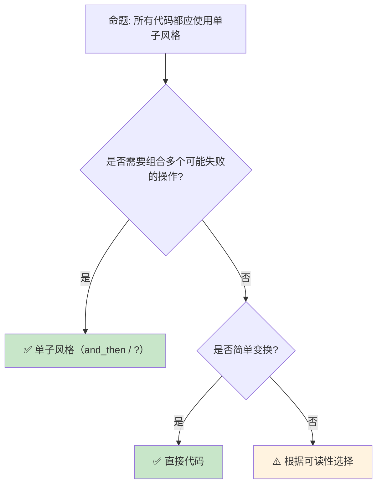

> **内容分级**: [专家级]

# 范畴论与 Rust：从函子到单子
>
> **EN**: Category Theory
> **Summary**: Category Theory: formal methods foundations, semantics, and verification techniques relevant to Rust.
> **受众**: [研究者]
> ⚠️ **声明**: 本文件使用形式化符号辅助直觉理解，所呈现的"定理/引理/推论"为**教学类比**，非经机器验证的严格数学证明。如需严格形式化验证，请参考 [Verus](https://github.com/verus-lang/verus)、[Kani](https://model-checking.github.io/kani/)、[Coq](https://coq.inria.fr/)。
>
> **Bloom 层级**: 分析 → 评价
> **定位**: 从**范畴论**视角分析 Rust 的类型系统（Type System）——从函子（Functor）、应用函子（Applicative）到单子（Monad），揭示 Rust 的类型构造器如何隐式实现这些抽象代数结构。
> **前置概念**: [Type Theory](02_type_theory.md) · [Generics](../../02_intermediate/01_generics/02_generics.md) · [Traits](../../02_intermediate/00_traits/01_traits.md)
> **后置概念**: [Linear Logic](../01_ownership_logic/01_linear_logic.md) · [RustBelt](../02_separation_logic/04_rustbelt.md)

---

> **来源**: [Category Theory for Programmers](https://bartoszmilewski.com/2014/10/28/category-theory-for-programmers-the-preface/) · · [Milewski — Category Theory for Programmers](https://bartoszmilewski.com/2014/10/28/category-theory-for-programmers-the-preface/) · [Awodey — Category Theory](https://doi.org/10.1093/acprof:oso/9780198568612.001.0001) · [Pierce — Types and Programming Languages](https://www.cis.upenn.edu/~bcpierce/tapl/) · [Jung et al. — RustBelt: Securing the Foundations of Rust](https://plv.mpi-sws.org/rustbelt/popl18/) · [Itanium C++ ABI](https://itanium-cxx-abi.github.io/cxx-abi/abi.html)
> [Wikipedia — Monad (functional programming)](https://en.wikipedia.org/wiki/Monad_(functional_programming)) ·
> [Rust RFC — Monad](https://github.com/rust-lang/rfcs/issues/1815) ·
> [Haskell Wiki — Typeclassopedia](https://wiki.haskell.org/Typeclassopedia) ·
> [The Rust Programming Language](https://doc.rust-lang.org/book/title-page.html)
> **前置依赖**: [Traits](../../02_intermediate/00_traits/01_traits.md) · [Generics](../../02_intermediate/01_generics/02_generics.md)
> **前置依赖**: [Concurrency](../../03_advanced/00_concurrency/01_concurrency.md)
> 🚨 **纯数学内容警告**
>
> 本文档包含大量形式化符号（⊗, ⊸, λ, ∀, ∃ 等）和纯数学推导，属于 **[研究者级]** 内容。
> **99.9% 的 Rust 开发者不需要理解这些内容即可编写生产级代码。**
> 如果你只想学习 Rust 工程实践，请直接跳过本文，前往 [L5 生态层](../06_ecosystem) 或 [L3 高级层](../03_advanced)。
> 本文的数学内容仅服务于：PL 研究者、编译器开发者、形式化验证工程师。

## 📑 目录

- [范畴论与 Rust：从函子到单子](#范畴论与-rust从函子到单子)
  - [📑 目录](#-目录)
  - [一、核心概念](#一核心概念)
    - [1.1 范畴的基本直觉](#11-范畴的基本直觉)
    - [1.2 函子（Functor）](#12-函子functor)
    - [1.3 单子（Monad）](#13-单子monad)
  - [二、技术细节](#二技术细节)
    - [2.1 Option 作为单子](#21-option-作为单子)
    - [2.2 Result 与错误处理](#22-result-与错误处理)
  - [十、边界测试：范畴论视角的编译错误](#十边界测试范畴论视角的编译错误)
    - [10.1 边界测试：`Option` 与 `Result` 的 monad 定律违反（编译错误）](#101-边界测试option-与-result-的-monad-定律违反编译错误)
    - [10.2 边界测试：`Iterator` 的 functor 映射与所有权（编译错误）](#102-边界测试iterator-的-functor-映射与所有权编译错误)
    - [2.3 Iterator 作为函子](#23-iterator-作为函子)
  - [三、范畴模式矩阵](#三范畴模式矩阵)
  - [四、反命题与边界分析](#四反命题与边界分析)
    - [4.1 反命题树](#41-反命题树)
    - [4.2 边界极限](#42-边界极限)
  - [五、常见陷阱](#五常见陷阱)
  - [六、来源与延伸阅读](#六来源与延伸阅读)
  - [相关概念文件](#相关概念文件)
  - [权威来源索引](#权威来源索引)
    - [10.3 边界测试：`Functor` 与 Rust 迭代器的映射（编译错误）](#103-边界测试functor-与-rust-迭代器的映射编译错误)
    - [10.4 边界测试：`Monad` 与 Rust 的 `?` 运算符（编译错误）](#104-边界测试monad-与-rust-的--运算符编译错误)
    - [10.7 边界测试：所有权移动后的再次使用](#107-边界测试所有权移动后的再次使用)
  - [嵌入式测验（Embedded Quiz）](#嵌入式测验embedded-quiz)
    - [测验 1：范畴论的基本直觉（理解层）](#测验-1范畴论的基本直觉理解层)
    - [测验 2：函子（Functor）（应用层）](#测验-2函子functor应用层)
    - [测验 3：单子（Monad）的核心操作（应用层）](#测验-3单子monad的核心操作应用层)
    - [测验 4：Rust 中的 Monad 替代（分析层）](#测验-4rust-中的-monad-替代分析层)
    - [测验 5：`?` 运算符与单子（评价层）](#测验-5-运算符与单子评价层)
  - [认知路径](#认知路径)
    - [核心推理链](#核心推理链)
    - [反命题与边界](#反命题与边界)

---

## 一、核心概念

### 1.1 范畴的基本直觉

```text
范畴 (Category) 的直觉:

  定义（简化）:
  ├── 对象（Objects）: 类型（Type）
  ├── 态射（Morphisms）: 函数（A → B）
  ├── 组合（Composition）: g ∘ f
  └── 恒等（Identity）: id_A: A → A

  Rust 中的对应:
  对象: i32, String, Vec<T>, ...
  态射: fn foo(x: i32) -> String
  组合: |x| bar(foo(x))
  恒等: |x| x

  范畴 laws:
  ├── 结合律: h ∘ (g ∘ f) = (h ∘ g) ∘ f
  └── 恒等: f ∘ id = f = id ∘ f

  Rust 验证:
  let f = |x| x + 1;
  let g = |x| x * 2;
  let h = |x| x.to_string();

  // 结合律
  let left = |x| h(g(f(x)));
  let right = |x| { let gf = |y| g(f(y)); h(gf(x)) };
  // left(5) == right(5) == "12"

  为什么重要:
  ├── 提供统一的数学框架
  ├── 揭示不同结构间的深层联系
  └── 指导 API 设计（可组合性）
```

> **认知功能**: 范畴论不是**抽象 nonsense**——它是**组合性的数学语言**，揭示了 Rust 类型系统（Type System）的设计原则。
> [来源: [Category Theory for Programmers](https://bartoszmilewski.com/2014/10/28/category-theory-for-programmers-the-preface/)]

---

### 1.2 函子（Functor）
>

```text
函子的直觉:

  定义:
  ├── 类型构造器 F（如 Option, Vec, Result）
  ├── map 操作: F<A> → (A → B) → F<B>
  └── 保持结构: map(id) = id, map(g ∘ f) = map(g) ∘ map(f)

  Rust 中的函子:
  ┌─────────────────┬─────────────────┐
  │ 函子            │ map 方法         │
  ├─────────────────┼─────────────────┤
  │ Option<T>       │ .map(f)         │
  │ Result<T, E>    │ .map(f)         │
  │ Vec<T>          │ .into_iter().map(f).collect() │
  │ Iterator        │ .map(f)         │
  │ Box<T>          │ 无直接 map（Deref 替代） │
  │ Cow<'a, T>      │ 无（但可手动实现） │
  └─────────────────┴─────────────────┘
> [来源: [TRPL](https://doc.rust-lang.org/book/title-page.html)]

  Option 的函子 laws:
  let x = Some(5);

  // law 1: map(id) = id
  assert_eq!(x.map(|v| v), x);

  // law 2: map(g ∘ f) = map(g) ∘ map(f)
  let f = |x| x + 1;
  let g = |x| x * 2;
  assert_eq!(
      x.map(|v| g(f(v))),
      x.map(f).map(g)
  );

  函子的意义:
  ├── 在"容器"内变换值，不改变容器结构
  ├── Some(5).map(|x| x + 1) = Some(6)
  ├── None.map(|x| x + 1) = None
  └── "提升"普通函数到函子上下文
```

> **函子洞察**: **map 是函子的核心操作**——它将普通函数"提升"到容器/上下文中，保持结构不变。
> [来源: [Functor — Haskell Wiki](https://wiki.haskell.org/Functor) <!-- link: known-broken -->]

---

### 1.3 单子（Monad）
>

```text
单子的直觉:

  定义:
  ├── 函子 + 两个额外操作
  ├── return/pure: A → M<A>（包装值）
  ├── bind/flat_map: M<A> → (A → M<B>) → M<B>
  └── 三个 laws（结合律、左右恒等）

  Rust 中的单子（隐式）:
  ┌─────────────────┬─────────────────┬─────────────────┐
  │ 单子            │ pure (wrap)     │ bind (>>=)      │
  ├─────────────────┼─────────────────┼─────────────────┤
  │ Option          │ Some(x)         │ and_then(f)     │
  │ Result          │ Ok(x)           │ and_then(f)     │
  │ Vec             │ vec![x]         │ flat_map(f)     │
  │ Iterator        │ once(x)         │ flat_map(f)     │
  │ Future          │ async { x }     │ .await + ?      │
  └─────────────────┴─────────────────┴─────────────────┘

  Option 作为单子:
  let x = Some(5);

  // pure: 5 → Some(5)
  let pure = Some(5);

  // bind: Some(5) → (|x| Some(x + 1)) → Some(6)
  let bound = x.and_then(|x| Some(x + 1));

  // 与 map 的区别:
  // map:    F<A> → (A → B) → F<B>
  // bind:   M<A> → (A → M<B>) → M<B>
  // bind 的函数本身返回"包装"值

  为什么 Rust 不直接叫 Monad:
  ├── 历史原因（避免 Haskell  baggage）
  ├── 不同命名更直观（and_then vs >>=）
  └── 但结构完全相同
```

> **单子洞察**: **Rust 的 `?` 运算符是单子的语法糖**——它在 Result/Option 间传播错误，本质上是 bind 操作的链式调用。
> [来源: [Wikipedia — Monad](https://en.wikipedia.org/wiki/Monad_(functional_programming))]

---

## 二、技术细节

### 2.1 Option 作为单子
>

```rust
// Option 的单子操作

// pure: A → Option<A>
let some: Option<i32> = Some(42);
let none: Option<i32> = None;

// map (函子): Option<A> → (A → B) → Option<B>
let mapped = some.map(|x| x + 1);  // Some(43)
let mapped_none = none.map(|x| x + 1);  // None

// and_then (bind): Option<A> → (A → Option<B>) → Option<B>
let bound = some.and_then(|x| {
    if x > 0 { Some(x * 2) } else { None }
});  // Some(84)

// 单子组合:
fn parse_number(s: &str) -> Option<i32> {
    s.parse().ok()
}

fn reciprocal(n: i32) -> Option<f64> {
    if n != 0 { Some(1.0 / n as f64) } else { None }
}

let result = parse_number("5")
    .and_then(reciprocal)
    .map(|x| x * 2.0);
// Some(0.4)

// 等价于:
// let n = parse_number("5")?;
// let r = reciprocal(n)?;
// Some(r * 2.0)
```

> **Option 洞察**: **Option 是 Maybe 单子**——它编码了"可能不存在"的计算，通过单子操作优雅地组合。
> [来源: [std::option::Option](https://doc.rust-lang.org/std/option/enum.Option.html)]

---

### 2.2 Result 与错误处理
>

## 十、边界测试：范畴论视角的编译错误

### 10.1 边界测试：`Option` 与 `Result` 的 monad 定律违反（编译错误）

```rust,compile_fail
fn main() {
    let x: Option<i32> = Some(5);
    // ❌ 编译错误: Option<Option<i32>> 不能自动扁平化
    // 与 Haskell 的 `join` 不同，Rust 需要显式扁平化
    let y: Option<i32> = x.map(|v| Some(v * 2)); // 类型是 Option<Option<i32>>
}

// 正确: 使用 and_then（范畴论中的 bind/>>=）
fn fixed() {
    let x: Option<i32> = Some(5);
    let y = x.and_then(|v| Some(v * 2)); // ✅ 扁平化: Option<i32>
    println!("{:?}", y);
}
```

> **修正**:
>
> `Option` 和 `Result` 在范畴论中是 **monad**，满足三个定律：左单位元（left identity）、右单位元（right identity）和结合律（associativity）。
> Rust 的 `and_then` 对应 monad 的 `bind`（`>>=`）操作，`Some`/`Ok` 对应 `return`（unit）。
> `map` 对应 functor 的 `fmap`，不扁平化嵌套结构。Rust 的显式扁平化（`and_then` 而非自动 `join`）保持了类型系统（Type System）的显式性，但增加了与 Haskell 等语言的认知差异。
> [来源: [Category Theory for Programmers](https://bartoszmilewski.com/2014/10/28/category-theory-for-programmers-the-preface/)]

### 10.2 边界测试：`Iterator` 的 functor 映射与所有权（编译错误）

```rust,ignore
fn main() {
    let v = vec![String::from("a"), String::from("b")];
    let iter = v.into_iter();
    // ❌ 编译错误: `into_iter` 消耗 v，后续不能使用 v
    // let first = v[0]; // v 已被 move
    let mapped = iter.map(|s| s.len());
    let total: usize = mapped.sum();
    println!("{}", total);
}

// 正确: 使用 iter() 借用
fn fixed() {
    let v = vec![String::from("a"), String::from("b")];
    let total: usize = v.iter().map(|s| s.len()).sum(); // ✅ 不消耗 v
    println!("{} {:?}", total, v);
}
```

> **修正**: 迭代器（Iterator）在范畴论中是 **functor**——通过 `map` 将函数 `A → B` 提升为 `Iterator<A> → Iterator<B>`。Rust 的 `Iterator` trait 还体现了 **applicative**（`zip` + `map`）和 **monad**（`flat_map`/`and_then` 的迭代器版本 `flatten`）结构。所有权（Ownership）系统确保映射操作不会创建悬垂引用（Reference）：`v.into_iter()` 消耗集合，`v.iter()` 借用（Borrowing）集合。这是 Rust 将范畴论抽象与资源管理结合的典范。[来源: [Rust Standard Library](https://doc.rust-lang.org/std/index.html)]

```rust
// Result 作为单子（Either monad）

// pure: A → Result<A, E>
let ok: Result<i32, &str> = Ok(42);
let err: Result<i32, &str> = Err("error");

// map: Result<T, E> → (T → U) → Result<U, E>
let mapped = ok.map(|x| x + 1);  // Ok(43)

// map_err: 只变换错误类型
let mapped_err = err.map_err(|e| e.to_uppercase());

// and_then (bind): Result<T, E> → (T → Result<U, E>) → Result<U, E>
fn validate_age(age: i32) -> Result<i32, &'static str> {
    if age >= 0 { Ok(age) } else { Err("invalid age") }
}

fn can_vote(age: i32) -> Result<bool, &'static str> {
    if age >= 18 { Ok(true) } else { Ok(false) }
}

let result = Ok(20)
    .and_then(validate_age)
    .and_then(can_vote);
// Ok(true)

// ? 运算符 = 语法糖化的 bind:
fn check_voting(age_str: &str) -> Result<bool, Box<dyn std::error::Error>> {
    let age: i32 = age_str.parse()?;  // bind
    if age < 0 { return Err("invalid".into()); }
    Ok(age >= 18)
}
```

> **Result 洞察**: **Result 是 Either 单子**——`?` 运算符将 `and_then` 的嵌套扁平化为线性代码流。
> [来源: [std::result::Result](https://doc.rust-lang.org/std/result/enum.Result.html)]

---

### 2.3 Iterator 作为函子
>

```rust
// Iterator 作为函子 + 更多结构

let nums = vec![1, 2, 3, 4, 5];

// map (函子): Iterator<A> → (A → B) → Iterator<B>
let doubled = nums.iter().map(|x| x * 2);

// filter: 不是函子操作，但常用
let evens = nums.iter().filter(|x| *x % 2 == 0);

// flat_map (单子 bind): Iterator<A> → (A → Iterator<B>) → Iterator<B>
let flattened = nums.iter().flat_map(|x| vec![*x, *x * 10]);
// [1, 10, 2, 20, 3, 30, 4, 40, 5, 50]

// fold (幺半群): Iterator<A> → B → (B, A → B) → B
let sum = nums.iter().fold(0, |acc, x| acc + x);

// collect: 从 Iterator 到具体集合（"lower" 操作）
let vec: Vec<i32> = doubled.collect();

// Iterator 的范畴论结构:
// ├── Functor: map
// ├── Monad: flat_map (bind)
// ├── Monoid: fold (reduce)
// └── 这是函数式编程的核心
```

> **Iterator 洞察**: **Iterator 是 Rust 函数式编程的核心**——map、flat_map、filter、fold 覆盖了数据处理的大部分需求。
> [来源: [std::iter::Iterator](https://doc.rust-lang.org/std/iter/trait.Iterator.html)]

---

## 三、范畴模式矩阵

```text
结构 → 范畴概念 → Rust 对应

Option:
  → Maybe Monad
  → Some(x), None, map, and_then
  → 可空值的计算组合

Result:
  → Either Monad
  → Ok(x), Err(e), map, and_then
  → 错误传播

Iterator:
  → List Monad / Stream
  → map, flat_map, filter, fold
  → 惰性序列处理

Future:
  → Promise Monad
  → async/await, then
  → 异步计算组合

Vec:
  → List Monoid
  → vec![], concat, flat_map
  → 集合操作

Function:
  → Arrow / Exponential
  → fn(A) -> B, compose
  → 函数组合
```

> **模式矩阵**: Rust 的**标准库隐式实现了范畴论的主要结构**——这并非巧合，而是类型系统（Type System）设计的自然结果。
> [来源: [Haskell Typeclassopedia](https://wiki.haskell.org/Typeclassopedia)]

---

## 四、反命题与边界分析

### 4.1 反命题树
>



> **认知功能**: **单子风格在组合多步操作时最有价值**——简单场景直接代码更清晰。
> [来源: [Rust Error Handling](https://doc.rust-lang.org/book/ch09-02-recoverable-errors-with-result.html)]

---

### 4.2 边界极限
>

```text
边界 1: Rust 没有 Haskell 的 do notation
├── ? 运算符部分替代
├── 但不如 do notation 通用
├── async/await 类似 monadic 语法
└── 缓解: 使用 ? 和组合子

边界 2: 类型系统限制
├── Rust 没有高阶类型（HKT）
├── 无法抽象"所有单子"的通用代码
├── 每个单子类型有自己的方法
└── 缓解: 宏或泛型特化

边界 3: 性能考虑
├── 函子/单子操作可能有开销
├── Option/Result 的 map 是零成本
├── Iterator 链是惰性的
└── 但嵌套结构体可能有分配开销

边界 4: 学习曲线
├── 范畴论术语对新手不友好
├── "单子"一词引起恐惧
├── Rust 避免使用这些术语
└── 缓解: 从具体类型（Option/Result）开始

边界 5: 与命令式风格的冲突
├── 某些场景命令式代码更清晰
├── 过度函数式可能降低可读性
├── Rust 支持两种风格
└── 缓解: 根据场景选择
```

> **边界要点**: 范畴论在 Rust 中的边界主要与**语法糖**、**类型系统（Type System）限制**、**性能**、**学习曲线**和**风格选择**相关。
> [来源: [Rust RFC — Monad](https://github.com/rust-lang/rfcs/issues/1815)]

---

## 五、常见陷阱

```text
陷阱 1: 嵌套 map 而非 flat_map
  ❌ Some(5).map(|x| Some(x + 1))
     // 结果: Some(Some(6))

  ✅ Some(5).and_then(|x| Some(x + 1))
     // 结果: Some(6)

陷阱 2: 在 Result 中混用 map 和 and_then
  ❌ result.map(|x| parse(x)?)
     // 编译错误！map 闭包返回 Result

  ✅ result.and_then(|x| parse(x))
     // 正确：and_then 期望返回 Result

陷阱 3: 过度使用函数式链
  ❌ 10 层嵌套的 map/filter/flat_map
     // 难以阅读

  ✅ 提取中间变量
     // 或分拆为多个步骤

陷阱 4: 忽略惰性求值
  ❌ iterator.map(|x| expensive(x));
     // 没有 collect/for_each，不执行！

  ✅ iterator.map(|x| expensive(x)).collect::<Vec<_>>();
     // 或使用 for_each 消费

陷阱 5: 忘记 ? 在闭包中的限制
  ❌ vec.iter().map(|x| parse(x)?)
     // 闭包内使用 ? 需要返回 Result

  ✅ vec.iter().map(|x| parse(x)).collect::<Result<Vec<_>, _>>()?;
     // collect 将 Vec<Result> 转为 Result<Vec>
```

> **陷阱总结**: 范畴论风格的陷阱主要与**map vs flat_map**、**嵌套深度**、**惰性求值**和**错误传播**相关。
> [source: [Common Functional Mistakes](https://doc.rust-lang.org/rust-by-example/error.html)]

---

## 六、来源与延伸阅读
>

| 来源 | 可信度 | 说明 |
|:---|:---:|:---|
| [Category Theory for Programmers](https://bartoszmilewski.com/2014/10/28/category-theory-for-programmers-the-preface/) | ✅ 一级 | 经典教程 |
| [Haskell Typeclassopedia](https://wiki.haskell.org/Typeclassopedia) | ✅ 一级 | 类型类百科 |
| [Wikipedia — Monad](https://en.wikipedia.org/wiki/Monad_(functional_programming)) | ✅ 一级 | 概念解释 |
| [Rust RFC — Monad Discussion](https://github.com/rust-lang/rfcs/issues/1815) | ✅ 一级 | Rust 社区讨论 |
| [Functor, Applicative, Monad](http://www.adit.io/posts/2013-04-17-functors,_applicatives,_and_monads_in_pictures.html) | ✅ 二级 | 图解教程 |

---
(Source: [Category Theory for Programmers](https://bartoszmilewski.com/2014/10/28/category-theory-for-programmers-the-preface/))

## 相关概念文件

- [Type Theory](02_type_theory.md) — 类型论
- [Generics](../../02_intermediate/01_generics/02_generics.md) — 泛型（Generics）
- [Traits](../../02_intermediate/00_traits/01_traits.md) — Trait 系统
- [Iterator](../../02_intermediate/07_iterators_and_closures/15_iterator_patterns.md) — 迭代器（Iterator）

---

> **权威来源**: [Category Theory for Programmers](https://bartoszmilewski.com/2014/10/28/category-theory-for-programmers-the-preface/) · [Haskell Typeclassopedia](https://wiki.haskell.org/Typeclassopedia) · [Wikipedia — Monad (functional programming)](https://en.wikipedia.org/wiki/Monad_(functional_programming)) · [The Rust Programming Language](https://doc.rust-lang.org/book/title-page.html)
>
> **权威来源对齐变更日志**: 2026-05-22 创建 [Authority Source Sprint Batch 10](../../00_meta/02_sources/international_authority_index.md)
> [Authority Source Sprint Batch L4](../../00_meta/02_sources/international_authority_index.md)

**文档版本**: 1.0
**对应 Rust 版本**: 1.97.0+ (Edition 2024)
**最后更新**: 2026-05-22
**状态**: ✅ 权威来源对齐完成 (Batch L4)

---

## 权威来源索引

>
>
>
>
>
>

---

---

---

### 10.3 边界测试：`Functor` 与 Rust 迭代器的映射（编译错误）

```rust,ignore
fn map_both<A, B, F>(a: Option<A>, b: Option<B>, f: F) -> Option<(A, B)>
where
    F: Fn(A, B) -> (A, B),
{
    // ❌ 编译错误: Option 不是 Rust 中的高阶类型，不能直接用 Functor 的 fmap
    // 在 Haskell 中: fmap f (a, b) — 但 Option 的 Functor 是单参数
    // 需要 applicative: (,) <$> a <*> b

    // Rust 的显式展开:
    match (a, b) {
        (Some(x), Some(y)) => Some(f(x, y)),
        _ => None,
    }
}
```

> **修正**: 范畴论中的 **Functor** 是保持结构的映射：`F: C → D`，对任意 `f: A → B`，有 `F(f): F(A) → F(B)`。Haskell 的 `Functor` typeclass 将这一概念编码为 `fmap :: (a -> b) -> f a -> f b`。Rust 中没有高阶类型（HKT），因此没有直接的 `Functor` trait——`Option` 的 `map`、`Result` 的 `map`、`Iterator` 的 `map` 是每个类型独立实现的方法，而非统一的 `fmap`。这是 Rust 与 Haskell 的核心差异：Haskell 通过 HKT 实现统一的抽象，Rust 通过宏（Macro）和 trait 实现类似的 ergonomics，但无理论统一性。`fmap` 的缺失不影响表达能力（每个类型有自己的 `map`），但影响了代码复用（不能写跨类型的 `map` 泛型（Generics）函数）。这与 Scala 的 `Functor`（通过 higher-kinded types 实现）或 C++ 的模板（无 HKT，但 `std::transform` 可跨容器）类似。[Category Theory](https://en.wikipedia.org/wiki/Category_theory)] · [The Rust Programming Language](https://doc.rust-lang.org/book/title-page.html)]

### 10.4 边界测试：`Monad` 与 Rust 的 `?` 运算符（编译错误）

```rust,ignore
fn monadic_bind() -> Result<i32, String> {
    let x = Some(5);
    let y = Some(10);
    // ❌ 编译错误: Rust 无统一的 Monad trait，不能跨 Option/Result 链式绑定
    // Haskell 中: x >>= (\a -> y >>= (\b -> return (a + b)))

    // Rust 的显式展开:
    match x {
        Some(a) => match y {
            Some(b) => Ok(a + b),
            None => Err("missing y".to_string()),
        },
        None => Err("missing x".to_string()),
    }
}
```

> **修正**: **Monad** 是范畴论中描述"可序列化计算"的结构，Haskell 的 `Monad` typeclass 统一了 `Maybe`、`Either`、`IO`、`List` 的绑定语义。Rust 中没有 `Monad` trait，但 `?` 运算符提供了**特定于 `Result` 和 `Option`** 的 monadic 绑定：`?` 在 `Err`/`None` 时提前返回，在 `Ok`/`Some` 时解包值。这限制了 `?` 只能在返回 `Result`/`Option` 的函数中使用，不能用于自定义 monad（如 `List`、`State`、`Reader`）。`?` 的设计是务实的：覆盖 95% 的使用场景（错误处理），牺牲理论统一性换取编译器优化的简洁性。这与 Haskell 的 `do` 语法（通用 monad）、Scala 的 `for` 推导（通用 monad）或 JavaScript 的 `async/await`（特定于 Promise）类似——Rust 的 `?` 是"特化 monad"。[Monad (functional programming)](https://en.wikipedia.org/wiki/Monad_(functional_programming))] · [The Rust Programming Language](https://doc.rust-lang.org/book/ch13-03-improving-our-io-project.html)]

### 10.7 边界测试：所有权移动后的再次使用

```rust,compile_fail
fn main() {
    let s = String::from("hello");
    let s2 = s;
    // ❌ 编译错误: s 已被 move 到 s2
    println!("{}", s);
}
```

> **修正**: **Move 语义**：1) `String` 非 `Copy`，赋值时 move 所有权（Ownership）；2) move 后原变量无效；3) 解决：使用 `.clone()` 或引用（Reference） `&s`。

## 嵌入式测验（Embedded Quiz）

### 测验 1：范畴论的基本直觉（理解层）

范畴论中"范畴"的基本组成是什么？

- A. 仅对象（Objects）
- B. 对象 + 对象之间的态射（Morphisms/Arrows）
- C. 仅函数

<details>
<summary>✅ 答案</summary>

**B. 对象 + 对象之间的态射（Morphisms/Arrows）**。

一个范畴由以下部分组成：

- **对象**（Objects）：如类型、集合、程序状态
- **态射**（Morphisms）：对象之间的箭头，如函数、类型转换
- **复合规则**：态射可组合（`g ∘ f`）
- **单位态射**：每个对象有恒等箭头

在编程中，类型可视为对象，函数可视为态射。Rust 的类型系统（Type System）（尤其是 trait system）可部分用范畴论建模。
</details>

---

### 测验 2：函子（Functor）（应用层）

在 Rust 中，哪个类型构造器最符合函子的直觉？

- A. `Box<T>`
- B. `Option<T>`（`map` 方法）
- C. `Rc<T>`

<details>
<summary>✅ 答案</summary>

**B. `Option<T>`（`map` 方法）**。

函子（Functor）的核心操作是 `map`：

- 将范畴中的一个态射（函数 `A -> B`）提升为另一个范畴中的态射（`F<A> -> F<B>`）
- `Option::map(f)`：`Option<A> -> Option<B>`
- `Iterator::map(f)`：`Iterator<A> -> Iterator<B>`
- `Result::map(f)`：`Result<A, E> -> Result<B, E>`

函子定律：

1. `map(id) == id`
2. `map(g ∘ f) == map(g) ∘ map(f)`

Rust 的 `Option`、`Result`、`Iterator`、`Vec` 都满足函子定律。
</details>

---

### 测验 3：单子（Monad）的核心操作（应用层）

单子的两个核心操作是什么？

- A. `map` 和 `filter`
- B. `return`（pure/单位）和 `bind`（`>>=` / flat_map）
- C. `clone` 和 `drop`

<details>
<summary>✅ 答案</summary>

**B. `return`（pure/单位）和 `bind`（`>>=` / flat_map）**。

单子（Monad）是函子的扩展，增加两个操作：

- **`return` / `pure`**：将普通值包装进单子上下文（`A -> M<A>`）
  - Rust 对应：`Some(x)`、`Ok(x)`、`vec![x]`
- **`bind` / `>>=` / `flat_map`**：序列化两个单子计算
  - Rust 对应：`Option::and_then`、`Result::and_then`、`Iterator::flat_map`

单子定律保证了这些操作可以安全组合，是函数式编程错误处理、异步（Async）、列表推导的基础。
</details>

---

### 测验 4：Rust 中的 Monad 替代（分析层）

Rust 为什么不提供原生的 `Monad` trait？

- A. Rust 不支持泛型（Generics）
- B. Monad 的 `bind` 需要高阶类型，而 Rust 类型系统（Type System）有限制
- C. Rust 社区反对函数式编程

<details>
<summary>✅ 答案</summary>

**B. Monad 的 `bind` 需要高阶类型，而 Rust 类型系统（Type System）有限制**。

定义通用 `Monad` trait 需要：

```rust,ignore
trait Monad<M<A>> {  // Rust 不支持 M<A> 这种高阶类型参数
    fn bind<B, F>(self, f: F) -> M<B> where F: Fn(A) -> M<B>;
}
```

Rust 不支持"类型构造器作为类型参数"（Higher-Kinded Types, HKT），因此无法直接定义跨 `Option`、`Result`、`Vec` 等类型的通用 `Monad` trait。

实际中：

- 每个类型单独实现 `and_then`/`flat_map`
- 使用 `?` 运算符作为特殊的单子绑定语法
- nightly 的 `generic_associated_types` 可部分缓解，但 HKT 仍未完全支持

</details>

---

### 测验 5：`?` 运算符与单子（评价层）

`?` 运算符与单子的 `bind` 操作有何关系？

- A. 完全无关
- B. `?` 是 Rust 中对 `Result`/`Option` 的专用语法糖，等价于 monadic bind
- C. `?` 只能用于 `Option`

<details>
<summary>✅ 答案</summary>

**B. `?` 是 Rust 中对 `Result`/`Option` 的专用语法糖，等价于 monadic bind**。

```rust,ignore
let x = some_operation()?;
```

等价于（概念上）：

```rust,ignore
let x = match some_operation() {
    Ok(v) => v,
    Err(e) => return Err(e.into()),
};
```

这正是 monadic bind 的语义：

- 若成功，解包值并继续
- 若失败，将错误"提升"到当前计算上下文

`?` 不支持任意 monad（如 `Vec` 或自定义 monad），只支持 `Result`、`Option` 和 `Poll<Result/Option>`。这是 Rust 在实用主义和函数式纯度之间的折中。
</details>

---

## 认知路径

> **认知路径**: 从 L0 基础概念出发，经由本节的 **范畴论与 Rust：从函子到单子** 核心原理，通向 L2 进阶模式与 L3 工程实践。

### 核心推理链

| 定理 | 前提 | 结论 | 置信度 |
|:---|:---|:---|:---|
| 范畴论与 Rust：从函子到单子 基础定义 ⟹ 正确用法 | 理解语法与语义 | 能写出符合惯用法的代码 | 高 |
| 范畴论与 Rust：从函子到单子 正确用法 ⟹ 常见陷阱 | 忽略边界条件 | 编译错误或运行时（Runtime） bug | 高 |
| 范畴论与 Rust：从函子到单子 常见陷阱 ⟹ 深度掌握 | 系统学习反模式 | 能进行代码审查与优化 | 高 |

> **过渡**: 掌握 范畴论与 Rust：从函子到单子 的基础语法后，下一步需要理解其在类型系统中的位置与与其他概念的交互关系。
> **过渡**: 在实践中应用 范畴论与 Rust：从函子到单子 时，务必关注边界条件与异常处理，这是从"能编译"到"能生产"的关键跃迁。
> **过渡**: 范畴论与 Rust：从函子到单子 的设计理念体现了 Rust 零成本抽象（Zero-Cost Abstraction）与安全保证的核心权衡，理解这一权衡有助于迁移到更高级的并发与形式化验证领域。

### 反命题与边界

> **反命题**: "范畴论与 Rust：从函子到单子 在所有场景下都是最佳选择" —— 错误。需要根据具体上下文权衡性能、可读性与安全性，某些场景下显式替代方案可能更优。
