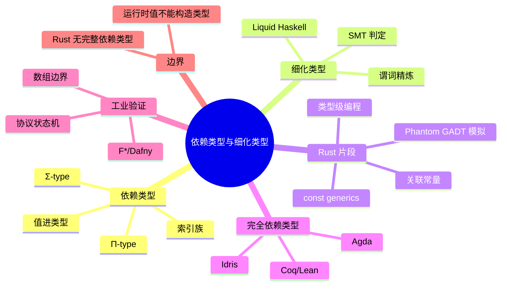

# 依赖类型与细化类型（Dependent Types and Refinement Types）

> **EN**: Dependent Types and Refinement Types
> **Summary**: A comparative treatment of full dependent types (Π/Σ/indexed families), refinement types, and the fragment Rust actually supports via const generics, associated consts, and type-level programming, with industrial examples in Idris, Agda, Liquid Haskell, F*, and Dafny.
> **Rust 版本**: 1.97.0+ (Edition 2024)
> **Bloom 层级**: L4
> **权威来源**: 本文件为 `concept/` 权威页。
> **受众**: [专家]
> **内容分级**: [综述级]
> **前置概念**: [Type Theory](01_type_theory.md) · [Const Generics](../../02_intermediate/01_generics/02_const_generics.md) · [Generics](../../02_intermediate/01_generics/01_generics.md)
> **后置概念**: [Formal Ecosystem Tower](../../06_ecosystem/08_formal_verification/01_formal_ecosystem_tower.md)
> **主要来源**: [Rust Reference — Generic Parameters](https://doc.rust-lang.org/reference/items/generics.html) · [RFC 2000 — Const Generics](https://rust-lang.github.io/rfcs/2000-const-generics.html) · [Idris 2 Language Reference](https://idris2.readthedocs.io/en/latest/) · [Agda Language Reference](https://agda.readthedocs.io/en/latest/) · [Liquid Haskell Blog](https://ucsd-progsys.github.io/liquidhaskell-blog/) · [Vazou et al. 2014 — Refinement Types for Haskell](https://ucsd-progsys.github.io/liquidhaskell/) · [F* Tutorial](https://www.fstar-lang.org/tutorial/) · [Dafny Docs](https://dafny.org/) · [Pierce 2002, *Types and Programming Languages*](https://www.cis.upenn.edu/~bcpierce/tapl/)

---

> **声明**: 本页使用形式化符号辅助直觉理解，所呈现的“定理/规则/推论”为**教学类比**，非经机器验证的严格数学证明。如需严格形式化验证，请参考 [Idris 2](https://idris2.readthedocs.io/)、[Agda](https://agda.readthedocs.io/)、[Coq](https://coq.inria.fr/)、[Lean](https://leanprover.github.io/)、[Liquid Haskell](https://ucsd-progsys.github.io/liquidhaskell-blog/)、[F*](https://www.fstar-lang.org/) 或 [Dafny](https://dafny.org/)。

---

## 🧠 知识结构图



## 📑 目录

- [依赖类型与细化类型（Dependent Types and Refinement Types）](#依赖类型与细化类型dependent-types-and-refinement-types)
  - [🧠 知识结构图](#-知识结构图)
  - [📑 目录](#-目录)
  - [一、核心概念](#一核心概念)
    - [1.1 依赖类型：值进入类型](#11-依赖类型值进入类型)
    - [1.2 Π-types（依赖函数类型）](#12-π-types依赖函数类型)
    - [1.3 Σ-types（依赖对类型）](#13-σ-types依赖对类型)
    - [1.4 索引类型与索引族](#14-索引类型与索引族)
    - [1.5 细化类型（Refinement Types）](#15-细化类型refinement-types)
  - [二、技术细节](#二技术细节)
    - [2.1 依赖类型的类型规则草图](#21-依赖类型的类型规则草图)
    - [2.2 细化类型与 SMT 后端](#22-细化类型与-smt-后端)
    - [2.3 Liquid Haskell 风格的细化类型](#23-liquid-haskell-风格的细化类型)
    - [2.4 Curry-Howard 视角](#24-curry-howard-视角)
  - [三、Rust 的依赖类型片段](#三rust-的依赖类型片段)
    - [3.1 const generics：值参数化的类型](#31-const-generics值参数化的类型)
    - [3.2 关联常量与 const 参数的互补](#32-关联常量与-const-参数的互补)
    - [3.3 类型级编程：Peano 编码与 typenum](#33-类型级编程peano-编码与-typenum)
    - [3.4 用 Phantom 类型模拟 GADT](#34-用-phantom-类型模拟-gadt)
    - [3.5 Rust 不能表达什么](#35-rust-不能表达什么)
  - [四、跨语言对比](#四跨语言对比)
    - [4.1 Idris 与 Agda：完整的依赖类型](#41-idris-与-agda完整的依赖类型)
    - [4.2 Liquid Haskell：轻量细化类型](#42-liquid-haskell轻量细化类型)
    - [4.3 F\* 与 Dafny：验证感知类型](#43-f-与-dafny验证感知类型)
    - [4.4 能力矩阵](#44-能力矩阵)
  - [五、反命题与边界分析](#五反命题与边界分析)
    - [5.1 反例：运行时值不能进入 Rust 类型](#51-反例运行时值不能进入-rust-类型)
    - [5.2 反例：const 参数不能参与泛型常量表达式](#52-反例const-参数不能参与泛型常量表达式)
    - [5.3 反例：Rust 编译器不验证任意谓词](#53-反例rust-编译器不验证任意谓词)
    - [5.4 反例：Phantom GADT 模拟的覆盖缺口](#54-反例phantom-gadt-模拟的覆盖缺口)
    - [5.5 为什么 Rust 不太可能拥有完整依赖类型](#55-为什么-rust-不太可能拥有完整依赖类型)
  - [六、工业应用](#六工业应用)
    - [6.1 安全关键验证](#61-安全关键验证)
    - [6.2 数组边界与向量长度](#62-数组边界与向量长度)
    - [6.3 协议状态机](#63-协议状态机)
  - [七、来源与延伸阅读](#七来源与延伸阅读)
    - [权威来源](#权威来源)
    - [Rust 生态形式化工具](#rust-生态形式化工具)
    - [相关概念页](#相关概念页)
    - [关键论文](#关键论文)
  - [对应测验](#对应测验)

---

## 一、核心概念

### 1.1 依赖类型：值进入类型

**依赖类型（dependent types）**是指类型的定义依赖于值的类型系统。在简单类型 λ 演算中，类型与值严格分层：`Vec<i32>` 是一个类型，但其长度 `3` 是值，长度信息不进入类型。依赖类型打破这一分层，允许出现 `Vec Int 3` 这样的类型——“长度为 3 的整数向量”本身是一个类型，且与 `Vec Int 4` 不同。

> **[Wikipedia: Dependent type](https://en.wikipedia.org/wiki/Dependent_type)** In computer science and logic, a dependent type is a type whose definition depends on a value. It is an overlapping feature of type theory and type systems.

形式化地说，若类型 `T` 的良构性依赖于项 `t`，则记为 `T(t)`。例如：

```text
Vec A : ℕ → Type       -- Vec A n 是“长度为 n 的 A 向量”这一类型族
Vec A 0                -- 空向量类型
Vec A 3                -- 长度为 3 的向量类型，与 Vec A 4 不等
```

依赖类型的表达能力极强：类型检查器在检查程序时，需要求解项之间的等式（如 `n + 0 = n`），因此依赖类型系统通常将类型检查与某种形式的定理证明交织在一起。这与 Rust 的设计哲学形成鲜明对比——Rust 刻意将类型检查保持在可判定、可单态化、编译迅速的范围内。Rust 的 `const N: usize` 只是依赖类型的**受限片段**：值可以进入类型，但这些值必须是**编译期常量**，且类型系统不处理任意项等式证明。

### 1.2 Π-types（依赖函数类型）

**Π-type**（读作“pi-type”或“依赖函数类型”）是依赖类型中最基本的构造，对应“对所有 x，返回一个依赖 x 的类型”。在数学上它类似笛卡尔积的推广（因而用 Π），在程序中它类似“返回值类型依赖参数值的函数类型”。

非依赖函数类型 `A → B` 可以看作 Π-type 的特例：当返回值类型不依赖参数值时，`Π(x : A). B` 退化为 `A → B`。

```text
普通函数:  (n : ℕ) → Bool          -- 输入 n，输出 Bool，与 n 无关
依赖函数:  (n : ℕ) → Vec ℕ n       -- 输入 n，输出长度为 n 的向量
```

在 Idris/Agda 中，上述类型可写作：

```idris
-- Idris: replicate 返回长度为 n 的向量
replicate : (n : Nat) -> (x : a) -> Vect n a
replicate 0     x = []
replicate (S k) x = x :: replicate k x
```

这里 `Vect n a` 的类型依赖 `n`：调用 `replicate 3 'x'` 得到 `Vect 3 Char`，调用 `replicate 5 'x'` 得到 `Vect 5 Char`，二者类型不同。类型检查器会验证递归定义是否确实返回长度为 `n` 的向量：基例返回 `[]`（长度 0），递归步假设 `replicate k x` 长度为 `k`，前置 `x` 后长度为 `S k`。

Rust 中不存在 Π-type 的通用形式。最接近的模拟是：

```rust
// Rust 的受限模拟：返回类型长度由 const 参数决定
fn replicate<T: Copy, const N: usize>(x: T) -> [T; N] {
    [x; N]
}
```

但这个模拟有两个根本限制：

1. `N` 必须是编译期常量，不能是运行时值；
2. `[T; N]` 只是数组，没有依赖类型语言中向量类型的归纳结构，因此无法表达“长度由某个运行时计算结果决定”的类型。

### 1.3 Σ-types（依赖对类型）

**Σ-type**（读作“sigma-type”或“依赖和类型”）是 Π-type 的对偶：它表示“存在一个值，使得……”的配对类型。一个 Σ-type 的值包含一对 `(x, y)`，其中 `y` 的类型依赖于 `x` 的值。

```text
Σ(x : A). B(x)        -- 第一分量是 A 中的 x，第二分量的类型是 B(x)
```

经典例子是“定长列表与其长度的配对”，其中长度已经由类型携带，但也可以显式构造：

```idris
-- Idris: 携带长度的向量与其长度的显式配对
vecAndLen : (n : Nat ** Vect n a)  -- Σ-type 语法: (x : A ** B x)
vecAndLen = (3 ** [1, 2, 3])
```

在逻辑中，Σ-type 对应存在量词 `∃`；在程序中，它允许把“ witnesses（证据）”携带在类型里。Rust 没有原生 Σ-type，但可以用泛型结构体做**受限**模拟：

```rust
// Rust 模拟：长度作为 const 参数进入类型
struct VecWithLen<T, const N: usize> {
    data: [T; N],
}

fn sigma_demo() {
    let v = VecWithLen::<i32, 3> { data: [1, 2, 3] };
    // 类型 VecWithLen<i32, 3> 已经编码了长度信息
    assert_eq!(v.data.len(), 3);
}
```

这种模拟仍受限于 `N` 必须是编译期常量。如果长度来自运行时输入，则无法构造 `VecWithLen<T, runtime_n>`。

### 1.4 索引类型与索引族

**索引类型（indexed types）**或**索引族（indexed families of types）**是指由某个索引参数化的类型族。依赖类型语言中，索引通常是值（如自然数）；在 Rust 中，最接近的索引是类型参数和 const 参数。

```idris
-- Idris: Fin n 表示“小于 n 的有限自然数”——安全的数组下标类型
Fin : Nat -> Type
Fin 0   = Void          -- 没有小于 0 的自然数
Fin (S n) = Either () (Fin n)   -- 0 或 1..n
```

`Fin n` 作为下标类型，可保证对长度为 `n` 的向量的任何索引都在范围内。Rust 没有 `Fin` 类型，但 `std::ops::Range` 的运行时边界检查承担了部分安全职责；const generics 可以在编译期表达某些索引约束，例如方阵方法仅对 `Matrix<N, N>` 可用。

### 1.5 细化类型（Refinement Types）

**细化类型（refinement types）**是在现有类型上附加逻辑谓词形成的子类型。它不要求“值进入类型”那样彻底的依赖类型，而是说：`{ v : T | P(v) }` 表示“满足谓词 P 的所有 T 值”。

```text
{ v : Int | v > 0 }           -- 正整数
{ v : Int | v >= 0 && v < n } -- 范围 [0, n) 内的整数
{ v : Vec a n | len v == n }  -- 长度恰好为 n 的向量（依赖+细化结合）
```

细化类型的关键特征是：

1. **不改变底层类型系统**：`{ v : Int | v > 0 }` 本质上仍是 `Int`，只是增加了谓词约束；
2. **自动化验证**：类型检查器通常使用 SMT 求解器（如 Z3）自动证明或反驳谓词；
3. **轻量可扩展**：相比完整依赖类型，细化类型更容易嫁接到 Haskell、Scala、Rust 等现有语言上。

> **[Vazou et al. 2014, *Liquid Types*](https://ucsd-progsys.github.io/liquidhaskell/)** Liquid types are a form of refinement types where refinements are restricted to a decidable logic fragment, enabling automatic verification via SMT solvers.

Rust 本身没有细化类型，但可以通过以下方式**近似**：

- 运行时断言（`assert!`）
- `NonZeroU32`、`NonNull<T>` 等库类型
- `const generics` 把某些常量值编码进类型
- 外部验证工具（Kani、Verus、Creusot）证明运行时谓词

---

## 二、技术细节

### 2.1 依赖类型的类型规则草图

依赖类型系统的核心规则可非形式地写作：

```text
Π-FORM:  Γ, x : A ⊢ B : Type          Γ ⊢ A : Type
        ─────────────────────────────────────────
                Γ ⊢ Π(x : A). B : Type

Π-INTRO:  Γ, x : A ⊢ e : B
        ─────────────────────────────
          Γ ⊢ λx.e : Π(x : A). B

Π-ELIM:  Γ ⊢ f : Π(x : A). B    Γ ⊢ a : A
        ─────────────────────────────────
                Γ ⊢ f a : B[x := a]

Σ-FORM:  Γ ⊢ A : Type    Γ, x : A ⊢ B : Type
        ───────────────────────────────────
                Γ ⊢ Σ(x : A). B : Type

Σ-INTRO:  Γ ⊢ a : A    Γ ⊢ b : B[x := a]
        ─────────────────────────────────
              Γ ⊢ (a, b) : Σ(x : A). B
```

关键在 `Π-ELIM` 的替换 `B[x := a]`：函数返回值的类型可以把实参 `a` 代入。例如 `replicate` 的类型是 `Π(n : Nat). Π(x : a). Vect n a`，应用 `replicate 3` 后得到 `Π(x : a). Vect 3 a`。

Rust 的类型规则不包含这种替换。Rust 的函数返回类型可以是 `[_; N]`，其中 `N` 是 const 参数，但 `N` 必须是**抽象的常量参数**，不能在函数类型内部对某个具体值做替换；更一般地，Rust 无法在返回类型中引用函数参数的运行时值。

### 2.2 细化类型与 SMT 后端

细化类型检查通常分为三步：

1. **生成 verification conditions（VCs）**：把类型规则中的谓词转化为逻辑公式；
2. **调用 SMT 求解器**：如 Z3、CVC5，判断 VCs 是否永真；
3. **反馈结果**：若 SMT 证明失败，则报告可能的违反位置。

例如，对 `div : Int -> { v : Int | v != 0 } -> Int`，调用 `div x 0` 会产生 VC `0 != 0`，SMT 立即反驳，类型检查失败。

Liquid Haskell  further restricts refinements to a **decidable logic fragment**（量词受限的线性算术、未解释函数、集合/映射操作等），以保证 SMT 求解可在合理时间内终止。这与完整依赖类型形成对比：Coq/Agda 允许任意归纳证明，但需要更多的人工交互。

### 2.3 Liquid Haskell 风格的细化类型

Liquid Haskell 通过注释把细化类型嫁接到 Haskell 上，不改变 GHC 的核心类型系统。典型写法是在普通 Haskell 类型前加 refinement 注释：

```haskell
{-@ type Pos = {v:Int | 0 < v} @-}
{-@ type Nat = {v:Int | 0 <= v} @-}

{-@ abs :: Int -> Nat @-}
abs :: Int -> Int
abs x | x < 0     = -x
      | otherwise = x
```

Liquid Haskell 会把这些注释翻译成 verification conditions，交给 SMT 求解器。如果实现 `abs x = x`（当 x 为负时返回负数），SMT 会反驳“返回值 ≥ 0”的 refine 约束，检查失败。

数组边界是 Liquid Haskell 的经典用例：

```haskell
{-@ type VectorN a N = {v:Vector a | vlen v == N} @-}

{-@ safeIndex :: VectorN a N -> {v:Int | 0 <= v && v < N} -> a @-}
safeIndex :: Vector a -> Int -> a
safeIndex v i = v ! i   -- Liquid Haskell 保证 i 在范围内
```

这里 `{v:Int | 0 <= v && v < N}` 就是 `Fin N` 的细化类型表达：下标类型依赖向量长度 `N`。

### 2.4 Curry-Howard 视角

Curry-Howard 同构指出：**类型 = 命题，程序 = 证明**。依赖类型把这个同构推向极致：

| 逻辑 | 类型 | 程序 |
|:---|:---|:---|
| 蕴含 `A ⇒ B` | 函数 `A → B` | 函数 `λx.e` |
| 合取 `A ∧ B` | 积类型 `A × B` | 配对 `(a, b)` |
| 析取 `A ∨ B` | 和类型 `A + B` | `Left a` / `Right b` |
| 全称量词 `∀x:A. P(x)` | Π-type `Π(x:A). P(x)` | 依赖函数 |
| 存在量词 `∃x:A. P(x)` | Σ-type `Σ(x:A). P(x)` | 带证据的配对 |

在依赖类型语言中，写一个类型正确的程序就是写出一个证明。例如，写一个 `plusCommutes : (n m : Nat) -> n + m = m + n` 的函数，就是证明自然数加法的交换律。Rust 的类型系统只覆盖 Curry-Howard 同构的前三行（函数、积、和），以及非常受限的“编译期常量作为类型索引”，不能表达全称/存在量词对应的依赖类型。

---

## 三、Rust 的依赖类型片段

Rust 没有完整依赖类型，但提供了多个**受限片段**，足以表达部分“值进类型”的用例。本节说明这些片段的能力与边界，并链接到已有的权威页——const generics 的语法细节见 [Const Generics](../../02_intermediate/01_generics/02_const_generics.md)，泛型系统总览见 [Generics](../../02_intermediate/01_generics/01_generics.md)，类型论背景见 [Type Theory](01_type_theory.md)。

### 3.1 const generics：值参数化的类型

`const generics` 是 Rust 中值进入类型的主要机制：

```rust
fn array_len<T, const N: usize>(_arr: &[T; N]) -> usize {
    N
}

fn const_generic_demo() {
    let a = [1, 2, 3];
    assert_eq!(array_len(&a), 3);

    let b = [0u8; 64];
    assert_eq!(array_len(&b), 64);
}
```

`[T; N]` 的类型依赖 `N`，且 `Foo<T, 3>` 与 `Foo<T, 4>` 是不同的类型。这与依赖类型语言中的“值索引类型”有表面相似，但本质差异在于：**`N` 必须是编译期可求值的常量**，不能来自运行时计算。

维度泛型矩阵是 const generics 的工业级用例：

```rust
use std::ops::Mul;

struct Matrix<const R: usize, const C: usize> {
    data: [[f64; C]; R],
}

impl<const R: usize, const C: usize> Matrix<R, C> {
    fn zeros() -> Self {
        Self { data: [[0.0; C]; R] }
    }
}

impl<const N: usize> Matrix<N, N> {
    fn identity() -> Self {
        let mut m = Self::zeros();
        for i in 0..N {
            m.data[i][i] = 1.0;
        }
        m
    }
}

impl<const R: usize, const C: usize, const K: usize> Mul<Matrix<C, K>> for Matrix<R, C> {
    type Output = Matrix<R, K>;

    fn mul(self, rhs: Matrix<C, K>) -> Matrix<R, K> {
        let mut out = Matrix::<R, K>::zeros();
        for r in 0..R {
            for k in 0..K {
                for c in 0..C {
                    out.data[r][k] += self.data[r][c] * rhs.data[c][k];
                }
            }
        }
        out
    }
}

fn matrix_demo() {
    let a = Matrix::<2, 3> { data: [[1.0, 2.0, 3.0], [4.0, 5.0, 6.0]] };
    let i3 = Matrix::<3, 3>::identity();
    let r = a * i3;
    assert!((r.data[1][2] - 6.0).abs() < 1e-12);
}
```

这里 `Matrix<R, C> * Matrix<C, K> -> Matrix<R, K>` 用 const 参数在类型层面编码矩阵维度，使维度错配成为编译错误。这与依赖类型语言中“形状索引的张量”目标一致，但 Rust 只能在编译期常量上操作。

### 3.2 关联常量与 const 参数的互补

**关联常量（associated const）**从 trait/impl 内部暴露常量值，与从调用点注入的 const 参数形成互补：

```rust
trait Header {
    const SIZE: usize;
}

struct Ipv4Header;
impl Header for Ipv4Header {
    const SIZE: usize = 20;
}

// 在调用点把关联常量作为 const 实参传入
fn zero_buf<T: Header, const N: usize>() -> [u8; N] {
    [0; N]
}

fn assoc_const_demo() {
    let buf: [u8; 20] = zero_buf::<Ipv4Header, { Ipv4Header::SIZE }>();
    assert_eq!(buf.len(), Ipv4Header::SIZE);
}
```

> **边界**：截至 Rust 1.97.0，不能直接在 trait 签名或泛型函数返回类型中使用关联常量投影作为数组长度，例如 `fn as_bytes(&self) -> [u8; Self::SIZE]` 需要 nightly 的 `generic_const_exprs`。详见 [Const Generics §4](../../02_intermediate/01_generics/02_const_generics.md)。

### 3.3 类型级编程：Peano 编码与 typenum

在 const generics 稳定之前，Rust 社区用**类型级自然数**（Peano 编码）或 `typenum` crate 来模拟依赖类型。其基本思想是把自然数编码为类型：

```rust
// 零成本抽象之前的类型级 Peano 编码
struct Z;
struct S<N>(std::marker::PhantomData<N>);

trait Nat {
    const VALUE: usize;
}
impl Nat for Z {
    const VALUE: usize = 0;
}
impl<N: Nat> Nat for S<N> {
    const VALUE: usize = 1 + N::VALUE;
}

type One = S<Z>;
type Two = S<One>;

fn peano_demo() {
    assert_eq!(<One as Nat>::VALUE, 1);
    assert_eq!(<Two as Nat>::VALUE, 2);
}
```

这种编码的计算发生在类型层面，完全在编译期完成，但语法噪音大、错误信息难读。const generics 稳定后，绝大多数历史用例已迁移到 `<const N: usize>`，因为后者更直接、编译更快、错误信息更友好。类型级 Peano 编码如今主要保留在需要**类型级条件分支**或**递归类型构造**的元编程场景中，例如某些类型映射库或历史遗留代码。

### 3.4 用 Phantom 类型模拟 GADT

Rust 不原生支持 **GADT（Generalized Algebraic Data Type）**，但可以用 **Phantom 类型** 做部分模拟。GADT 允许类型参数在不同构造子中变化，从而把“表达式的结果类型”编码进值构造子：

```haskell
-- Haskell GADT
data Expr a where
  Lit  :: Int  -> Expr Int
  Bool :: Bool -> Expr Bool
  Add  :: Expr Int -> Expr Int -> Expr Int
  If   :: Expr Bool -> Expr a -> Expr a -> Expr a

eval :: Expr a -> a
eval (Lit n)   = n
eval (Bool b)  = b
eval (Add l r) = eval l + eval r
eval (If c t e) = if eval c then eval t else eval e
```

Rust 中的 Phantom 模拟：

```rust
use std::marker::PhantomData;

// 用类型参数 A 表示 Expr 的求值结果类型
struct Expr<A> {
    _marker: PhantomData<A>,
}

struct Lit<A> {
    value: i32,
    _marker: PhantomData<A>,
}

fn lit_int(n: i32) -> Expr<i32> {
    Expr { _marker: PhantomData }
}

fn lit_bool(b: bool) -> Expr<bool> {
    Expr { _marker: PhantomData }
}

fn add(_l: Expr<i32>, _r: Expr<i32>) -> Expr<i32> {
    Expr { _marker: PhantomData }
}

fn if_expr<A>(_c: Expr<bool>, _t: Expr<A>, _e: Expr<A>) -> Expr<A> {
    Expr { _marker: PhantomData }
}

fn eval_i32(_e: Expr<i32>) -> i32 { 0 }  // 示意
fn eval_bool(_e: Expr<bool>) -> bool { false } // 示意

fn gadt_sim_demo() {
    let a = lit_int(1);
    let b = lit_int(2);
    let sum = add(a, b);
    let cond = lit_bool(true);
    let result = if_expr(cond, sum, lit_int(0));
    let _: Expr<i32> = result; // 类型系统保证 If 的两个分支类型一致
}
```

这个模拟只保留类型约束，不保留数据结构；更完整的模拟需要把表达式 AST 实际存储下来，并通过 trait 把 `eval` 与类型参数关联：

```rust
use std::marker::PhantomData;

enum Expr<A> {
    LitI32(i32, PhantomData<A>),
    LitBool(bool, PhantomData<A>),
    Add(Box<Expr<i32>>, Box<Expr<i32>>, PhantomData<A>),
    If(Box<Expr<bool>>, Box<Expr<A>>, Box<Expr<A>>),
}

trait Eval {
    type Output;
    fn eval(&self) -> Self::Output;
}

impl Eval for Expr<i32> {
    type Output = i32;
    fn eval(&self) -> i32 {
        match self {
            Expr::LitI32(n, _) => *n,
            Expr::Add(l, r, _) => l.eval() + r.eval(),
            Expr::If(c, t, e) => if c.eval() { t.eval() } else { e.eval() },
            _ => unreachable!("well-typed Expr<i32> cannot be LitBool"),
        }
    }
}

impl Eval for Expr<bool> {
    type Output = bool;
    fn eval(&self) -> bool {
        match self {
            Expr::LitBool(b, _) => *b,
            Expr::If(c, t, e) => if c.eval() { t.eval() } else { e.eval() },
            _ => unreachable!("well-typed Expr<bool> cannot contain i32"),
        }
    }
}

fn gadt_eval_demo() {
    let e: Expr<i32> = Expr::Add(
        Box::new(Expr::LitI32(1, PhantomData)),
        Box::new(Expr::LitI32(2, PhantomData)),
        PhantomData,
    );
    assert_eq!(e.eval(), 3);
}
```

注意 `unreachable!` 分支：Rust 编译器无法像 GADT 语言那样静态排除这些分支，因为 `Expr<A>` 的构造子没有被约束到 `A` 的具体值。这是 Phantom 模拟与真 GADT 的核心差距。

### 3.5 Rust 不能表达什么

Rust 的依赖类型片段明确不能表达以下概念：

1. **运行时值进入类型**：无法根据 `let n = args().len()` 构造 `[T; n]`；
2. **依赖函数类型**：无法写出 `fn(n: usize) -> [T; n]` 使返回类型依赖参数值；
3. **任意项等式证明**：无法让类型检查器证明 `N + 0 == N` 并在类型相等性判断中使用；
4. **细化类型**：无法写出 `{ v: u32 | v > 0 }` 并让 rustc 自动证明；
5. **Σ-types**：无法表达“存在某个运行时 witness”的类型；
6. **完整 Π-types**：const generics 只支持常量参数，不支持值依赖的类型级函数。

> **定理 T-163**: `const generics` + `associated consts` + 类型级编程构成完整依赖类型的真子集，运行时值不能进入 Rust 类型。

这些限制是设计上的：完整依赖类型会把类型检查变成半可判定或不可判定问题，并与 Rust 的零成本抽象、快速编译、清晰错误信息等目标冲突。

---

## 四、跨语言对比

### 4.1 Idris 与 Agda：完整的依赖类型

Idris 和 Agda 是专为依赖类型设计的语言。它们的类型系统允许任意值进入类型，并把类型检查与定理证明统一。

Idris 2 示例——向量与下标安全：

```idris
-- Idris 2
module VectDemo

data Vect : Nat -> Type -> Type where
  Nil  : Vect 0 a
  (::) : a -> Vect n a -> Vect (S n) a

-- 依赖函数：结果类型依赖参数 n
replicate : (n : Nat) -> a -> Vect n a
replicate 0     _ = []
replicate (S k) x = x :: replicate k x

-- 安全下标：Fin n 保证不越界
index : Fin n -> Vect n a -> a
index FZ     (x :: _)  = x
index (FS k) (_ :: xs) = index k xs
```

这里 `Vect n a` 是依赖类型，`Fin n` 是依赖类型，`index` 的类型系统保证了任何调用都不会越界。编译器在类型检查时验证 `FZ`（0）和 `FS k`（k+1）确实小于 `n`。

Agda 的写法类似，但更接近数学证明脚本：

```agda
-- Agda
open import Data.Nat

data Vec (A : Set) : ℕ → Set where
  []  : Vec A 0
  _∷_ : {n : ℕ} → A → Vec A n → Vec A (suc n)

replicate : {A : Set} (n : ℕ) → A → Vec A n
replicate zero     x = []
replicate (suc n)  x = x ∷ replicate n x
```

Idris/Agda 的设计目标是**可编程的证明助手**。它们允许程序员在类型中陈述规格，并通过实现来满足规格。这与 Rust 的目标——工业系统编程——形成鲜明对比。

### 4.2 Liquid Haskell：轻量细化类型

Liquid Haskell 不把 Haskell 改造成依赖类型语言，而是通过注释添加细化类型，用 SMT 自动验证。它的学习曲线比 Idris/Agda 平缓得多，但表达能力也受限：细化类型不能表达需要归纳证明的任意性质。

```haskell
{-@ safeDiv :: Int -> {v:Int | v /= 0} -> Int @-}
safeDiv :: Int -> Int -> Int
safeDiv x y = x `div` y

-- 调用 safeDiv x 0 会被 Liquid Haskell 拒绝
```

Liquid Haskell 的工业价值在于：它可以在不修改 GHC 核心语义的前提下，为现有 Haskell 代码添加轻量验证。Rust 生态中的类似工具是 [Flux](https://flux-rs.github.io/)（Rust 的细化类型研究项目，目前仍是实验性质）。

### 4.3 F* 与 Dafny：验证感知类型

F* 和 Dafny 是面向验证的语言，广泛应用于安全关键系统（如 TLS 实现、操作系统微内核、智能合约）。它们结合了依赖类型、细化类型和 SMT 验证：

**F* 示例**：

```fstar
// F*
let rec factorial (n:nat) : nat =
  if n = 0 then 1 else n * factorial (n - 1)

val factorial_pos : n:nat -> Lemma (factorial n > 0)
let rec factorial_pos n =
  if n = 0 then () else factorial_pos (n - 1)
```

F* 的 `val ... Lemma` 允许在类型中陈述引理，并通过 SMT 或手动证明验证。

**Dafny 示例**：

```dafny
// Dafny
method SafeDivide(x: int, y: int) returns (r: int)
  requires y != 0
  ensures r == x / y
{
  r := x / y;
}
```

Dafny 的 `requires`/`ensures` 是契约，Dafny 编译器将其翻译成验证条件交给 Z3。与 Liquid Haskell 不同，Dafny 是完整的程序验证语言，支持循环不变量、归纳证明、幽灵状态（ghost state）等。

### 4.4 能力矩阵

下表对比各语言/系统在依赖类型与细化类型光谱上的位置：

| 系统 | 类型 | 值进类型 | 自动验证 | 工业采用 | Rust 可类比处 |
|:---|:---|:---|:---|:---|:---|
| **Idris/Agda** | 完整依赖类型 | ✅ 任意值 | 部分（类型检查即证明） | 低（研究/教学） | 无直接对应 |
| **Coq/Lean** | 依赖类型 + 证明助手 | ✅ 任意值 | 交互式 | 中（数学证明、形式化验证） | 无直接对应 |
| **Liquid Haskell** | 细化类型 | ⚠️ 仅谓词约束 | ✅ SMT 自动 | 低-中 | Flux（实验） |
| **F*/Dafny** | 依赖/细化混合 | ✅ 值+谓词 | ✅ SMT + 手动 | 中（安全关键） | Verus、Kani、Creusot |
| **Rust + const generics** | 受限依赖片段 | ⚠️ 仅编译期常量 | ❌ 无谓词证明 | 高 | `[T; N]`、`Matrix<R, C>` |
| **Rust + Verus/Kani** | 外部验证 | ⚠️ 通过注释/规约 | ✅ SMT/模型检查 | 增长中 | unsafe/并发契约验证 |

关键结论：Rust 本身的类型系统位于“强类型但非依赖”区域；要获得依赖类型或细化类型的保证，需要借助外部工具（Verus、Kani、Creusot、Flux）或运行时断言。

---

## 五、反命题与边界分析

### 5.1 反例：运行时值不能进入 Rust 类型

```rust,ignore
fn runtime_value_into_type() {
    let n = std::env::args().len();
    // ❌ 编译错误：n 不是 const，不能作为数组长度
    // let arr: [i32; n] = [0; n];
}
```

> **修正**：Rust 的 `const generics` 要求数组长度 `N` 是编译期常量。运行时值（如命令行参数个数、用户输入、运行时计算结果）不能用于构造 `[T; N]`。这是 Rust 与完整依赖类型语言的根本差距：在 Idris/Agda 中，`n` 可以作为值索引构造 `Vect n a`；在 Rust 中，必须使用 `Vec<T>` 并把长度检查推迟到运行时。

### 5.2 反例：const 参数不能参与泛型常量表达式

```rust,ignore
// ❌ 编译错误：generic parameters may not be used in const operations
fn grow<T, const N: usize>(a: [T; N]) -> [T; N + 1] {
    todo!()
}
```

> **修正**：在 Rust 1.97.0 stable 上，`N + 1` 这种含 const 参数的表达式不能出现在类型位置。该能力属于 nightly 的 `generic_const_exprs` 特性门。RFC 2000 把 MVP 限制为“独立参数”，因为含泛型参数的常量表达式的相等性判定（`N + 1 == M + 1 ⟺ N == M`）会冲击类型检查的可判定性。详见 [Const Generics §3](../../02_intermediate/01_generics/02_const_generics.md)。

### 5.3 反例：Rust 编译器不验证任意谓词

```rust,ignore
// 概念代码：Rust 不支持这种细化类型
fn positive_only(x: { v: u32 | v > 0 }) -> u32 {
    x
}

fn caller() {
    // 即使 y 来自某个保证其为正的上下文，rustc 也无法自动证明
    let y: u32 = 1;
    // positive_only(y)  // 若 Rust 支持细化类型，这里应自动通过
}
```

> **修正**：Rust 的类型系统不内建细化类型。`NonZeroU32` 等类型通过构造函数在运行时检查值不为零，而不是由编译器证明所有使用点都满足谓词。要获得类似保证，需使用 Verus（`requires`/`ensures`）、Kani（有界模型检查）或 Creusot（Why3 证明）。

### 5.4 反例：Phantom GADT 模拟的覆盖缺口

```rust,ignore
use std::marker::PhantomData;

enum Expr<A> {
    LitI32(i32, PhantomData<A>),
    LitBool(bool, PhantomData<A>),
    Add(Box<Expr<i32>>, Box<Expr<i32>>, PhantomData<A>),
}

impl Expr<i32> {
    fn eval(&self) -> i32 {
        match self {
            Expr::LitI32(n, _) => *n,
            Expr::Add(l, r, _) => l.eval() + r.eval(),
            // 必须写 unreachable!，因为 rustc 不知道 LitBool 不可能出现在 Expr<i32> 中
            Expr::LitBool(_, _) => unreachable!(),
        }
    }
}
```

> **修正**：Phantom 类型可以把类型参数当作“标签”使用，但 Rust 编译器不会在模式匹配 exhaustiveness 检查中利用这些标签排除不可能的分支。真正的 GADT 语言（Haskell、OCaml、Idris、Agda）可以在类型检查阶段静态证明 `Expr<i32>` 不会出现 `LitBool` 构造子，从而不需要 `unreachable!` 分支。

### 5.5 为什么 Rust 不太可能拥有完整依赖类型

完整依赖类型与 Rust 的核心设计目标存在结构性张力：

1. **类型检查可判定性**：依赖类型的类型检查通常需要求解项等式，甚至需要定理证明，这会使类型检查变成半可判定或不可判定问题。Rust 的类型检查必须是确定且快速的。
2. **单态化与代码生成**：Rust 通过单态化实现零成本抽象。如果类型依赖运行时值，就无法在编译期确定需要生成多少份代码。
3. **错误信息可用性**：依赖类型语言中的类型错误常常以复杂证明义务的形式出现。Rust 以清晰、可操作的错误信息著称，完整依赖类型会严重削弱这一点。
4. **编译速度**：工业 Rust 项目已经面临编译时间压力。依赖类型会进一步增加类型检查阶段的计算量。
5. **零成本抽象**：依赖类型语言常需要运行时携带证明项（proof terms）或索引值。Rust 追求无运行时开销的保证。

> **定理 T-160**: 在 safe Rust 中，所有权-借用-生命周期三元组在编译期排除 use-after-free、double-free 和数据竞争。

因此，Rust 更可能沿着以下方向演进，而不是直接引入完整依赖类型：

- 扩展 const generics 的表达式能力（`generic_const_exprs` 稳定化）；
- 改进类型级编程的 ergonomics；
- 通过外部验证工具（Verus、Kani、Creusot）满足安全关键需求；
- 实验性细化类型项目（如 Flux）探索语法层面的支持。

---

## 六、工业应用

### 6.1 安全关键验证

在航空航天、汽车、医疗设备等领域，软件缺陷可能导致生命损失。依赖类型和细化类型可以帮助在编译期消除整类错误：

- **数组越界**：通过 `Vect n a` 或 `{ i : Int | 0 <= i && i < n }` 保证下标安全；
- **除零错误**：通过 `{ v : Int | v != 0 }` 保证除数非零；
- **状态机合规**：通过 GADT 或依赖类型把协议状态编码进类型，确保“未认证状态不能调用敏感操作”。

Rust 在该领域的生态正在快速发展：

- **Verus**：Microsoft 开发的 Rust 验证工具，支持 `requires`/`ensures`/`invariant`，用于验证 [Unsafe Rust](../../03_advanced/02_unsafe/01_unsafe.md) 和并发代码；
- **Kani**：AWS 开发的 Rust 有界模型检查器，可验证 unsafe 代码的内存安全；
- **Creusot**：基于 Why3 的 Rust 验证工具，支持函数契约和循环不变量；
- **Aeneas**：将 Rust 翻译成纯函数式语义进行形式化验证。

这些工具的共同策略是：**不改造 Rust 核心类型系统，而是在其之上添加验证层**。这与 Liquid Haskell 的策略一致，也符合 Rust 保持类型检查简单快速的设计哲学。

### 6.2 数组边界与向量长度

数组边界错误是 C/C++ 中常见的安全漏洞来源。依赖类型语言可以在类型层面消除这类错误：

```idris
-- Idris: 下标类型 Fin n 保证安全
lookup : Fin n -> Vect n a -> a
lookup FZ     (x :: _)  = x
lookup (FS k) (_ :: xs) = lookup k xs
```

Rust 通过两种方式处理：

1. **编译期**：const generics 把固定长度编码进类型，`[T; N]` 的索引在可证明范围内时无需运行时检查；
2. **运行时**：`Vec<T>` 和切片索引执行边界检查，越界触发 panic（安全）而非未定义行为。

```rust
fn array_bounds_demo() {
    let arr = [10, 20, 30];
    // arr[3] 会在运行时 panic，但编译期不会报错
    // 因为 arr 的长度信息是类型的一部分，但索引 3 是常量表达式，
    // rustc 仅在 const 上下文中检查越界
    let _ = arr[2];
}
```

Rust 1.97.0 中，const 索引在 const 上下文中会触发编译期越界检查，但普通函数中的索引仍依赖运行时检查。要获得依赖类型那样的“所有下标都安全”保证，需要外部工具或更严格的编码规范。

### 6.3 协议状态机

协议状态机是依赖类型和细化类型的经典应用场景。例如，一个 TCP 连接在 `CLOSED` 状态下不能调用 `send`，在 `ESTABLISHED` 状态下不能调用 `listen`。依赖类型可以把状态编码进类型：

```idris
-- Idris 概念：状态编码进类型
data State = Closed | SynSent | Established | ClosedWait

data Connection : State -> Type where
  MkClosed       : Connection Closed
  MkSynSent      : Connection SynSent
  MkEstablished  : Connection Established

send : Connection Established -> String -> IO ()
listen : Connection Closed -> IO (Connection SynSent)
```

Rust 中可以用**类型状态模式**做部分模拟：

```rust
struct Closed;
struct Established;

struct Connection<S> {
    _state: std::marker::PhantomData<S>,
}

impl Connection<Closed> {
    fn connect() -> Connection<Established> {
        Connection { _state: std::marker::PhantomData }
    }
}

impl Connection<Established> {
    fn send(&self, _msg: &str) {
        // 只有 Established 状态可以 send
    }

    fn close(self) -> Connection<Closed> {
        Connection { _state: std::marker::PhantomData }
    }
}

fn state_machine_demo() {
    let conn = Connection::<Closed>::connect();
    conn.send("hello");
    let _closed = conn.close();
    // _closed.send("world"); // 编译错误：Closed 状态没有 send 方法
}
```

这个模拟在编译期排除了状态错误，但有两个限制：

1. 它无法表达依赖运行时输入的状态转换条件（如“只有收到 SYN-ACK 才能进入 Established”）；
2. 状态信息在运行时被擦除（PhantomData 大小为 0），无法用于运行时决策。

对于需要运行时状态又需要形式化保证的场景，Rust 项目通常结合 Verus/Kani 等工具，把状态不变量写成契约进行验证。

---

## 七、来源与延伸阅读

### 权威来源

- [Rust Reference — Generic Parameters](https://doc.rust-lang.org/reference/items/generics.html)
- [RFC 2000 — Const Generics](https://rust-lang.github.io/rfcs/2000-const-generics.html)
- [Idris 2 Language Reference](https://idris2.readthedocs.io/en/latest/)
- [Agda Language Reference](https://agda.readthedocs.io/en/latest/)
- [Liquid Haskell Blog](https://ucsd-progsys.github.io/liquidhaskell-blog/)
- [F* Tutorial](https://www.fstar-lang.org/tutorial/)
- [Dafny Docs](https://dafny.org/)
- [Pierce 2002, *Types and Programming Languages*](https://www.cis.upenn.edu/~bcpierce/tapl/)
- [Wikipedia — Dependent type](https://en.wikipedia.org/wiki/Dependent_type)
- [Wikipedia — Refinement type](https://en.wikipedia.org/wiki/Refinement_type)

### Rust 生态形式化工具

- [Verus](https://github.com/verus-lang/verus)
- [Kani](https://model-checking.github.io/kani/)
- [Creusot](https://creusot-rs.github.io/)
- [Aeneas](https://github.com/AeneasVerif/aeneas)
- [Flux](https://flux-rs.github.io/)（Rust 细化类型研究项目）

### 相关概念页

- [Type Theory](01_type_theory.md)
- [Const Generics](../../02_intermediate/01_generics/02_const_generics.md)
- [Generics](../../02_intermediate/01_generics/01_generics.md)
- [Formal Ecosystem Tower](../../06_ecosystem/08_formal_verification/01_formal_ecosystem_tower.md)

### 关键论文

- Vazou, N., et al. (2014). *Refinement Types for Haskell*. ACM SIGPLAN Notices.
- Brady, E. (2013). *Idris, a general-purpose dependently typed programming language: Design and implementation*. Journal of Functional Programming.
- Norell, U. (2007). *Towards a practical programming language based on dependent type theory*. PhD thesis, Chalmers.
- Swamy, N., et al. (2016). *Dependent Types and Multi-Monadic Effects in F*. ACM POPL.
- Leino, K. R. M. (2010). *Dafny: An Automatic Program Verifier for Functional Correctness*. LPAR.

---

> **最后更新**: 2026-07-16
> **维护者注意**: 本页涉及 nightly 特性（`generic_const_exprs`、`adt_const_params`）的描述应以 [Rust 官方 nightly 文档](https://doc.rust-lang.org/nightly/unstable-book/index.html) 为准；const generics 的 stable 边界以 [Rust Reference](https://doc.rust-lang.org/reference/items/generics.html) 为唯一事实源。

---

## 对应测验

完成 [L3 语义模型与跨语言对比测验](../../03_advanced/00_concurrency/10_quiz_semantic_models.md) 验证对依赖/细化类型、代数效应、STM、分布式共识与语言语义模型矩阵的掌握程度（15 题：🟢3 / 🟡10 / 🔴2）。
