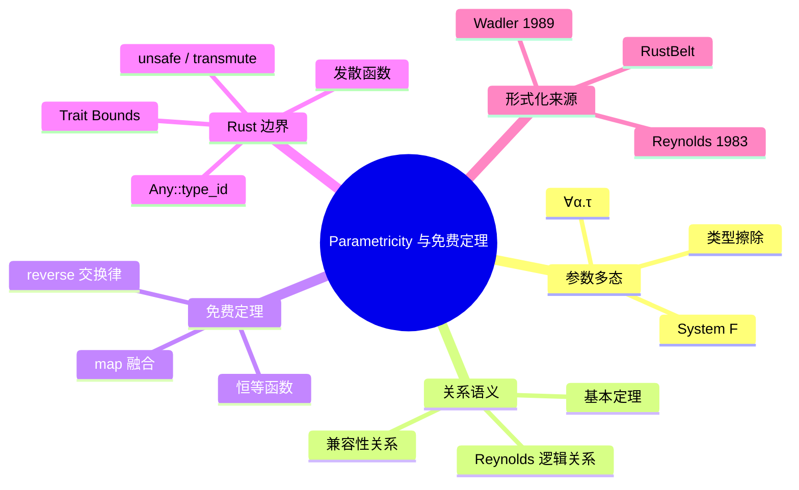

# Parametricity 与免费定理（Parametricity and Theorems for Free）

> **EN**: Parametricity and Theorems for Free
> **Summary**: A self-contained treatment of Reynolds' abstraction theorem and Wadler's "theorems for free", showing how universal polymorphism constrains the behavior of Rust generic functions and where trait bounds, nontermination, unsafe code, and reflection break those guarantees.
> **Rust 版本**: 1.97.0+ (Edition 2024)
> **Bloom 层级**: L4
> **权威来源**: 本文件为 `concept/` 权威页。
> **来源**: [Rust Reference — Generic Parameters](https://doc.rust-lang.org/reference/items/generics.html) · [Wadler 1989, *Theorems for Free!* (arXiv)](https://arxiv.org/abs/cs/9201102) · [Wadler 1989, *Theorems for Free!* (ACM DL)](https://dl.acm.org/doi/10.1145/99370.99404) · [Wadler 1989, *Theorems for Free!* (Semantic Scholar)](https://www.semanticscholar.org/paper/89b50039c6d22cb82abc387d91145195ae822d29) · [Reynolds 1983, *Types, Abstraction and Parametric Polymorphism*](https://doi.org/10.1007/BFb0035118) · [Reynolds 1983, *Types, Abstraction and Parametric Polymorphism* (Semantic Scholar)](https://www.semanticscholar.org/paper/5f322ce92cd22cb4ffcdf45cbbe1e23d5febc007) · [RustBelt](https://plv.mpi-sws.org/rustbelt/popl18/) · [Springer — Ahmed et al. 2008, *Parametric Polymorphism through Run-Time Sealing*](https://link.springer.com/chapter/10.1007/978-3-540-78739-6_2) · [Rustc Dev Guide — Monomorphization](https://rustc-dev-guide.rust-lang.org/backend/monomorph.html)
> **前置概念**: [Type Theory](01_type_theory.md) · [Generics](../../02_intermediate/01_generics/01_generics.md) · [Traits](../../02_intermediate/00_traits/01_traits.md)
> **后置概念**: [Subtyping and Variance](02_subtype_variance.md) · [Category Theory](04_category_theory.md) · [RustBelt](../02_separation_logic/01_rustbelt.md) · [Unsafe Rust](../../03_advanced/02_unsafe/01_unsafe.md)

---

> **声明**: 本页使用形式化符号辅助直觉理解，所呈现的“定理/引理/推论”为**教学类比**，非经机器验证的严格数学证明。如需严格形式化验证，请参考 [Coq](https://coq.inria.fr/)、[Agda](https://agda.readthedocs.io/) 或 [Lean](https://leanprover.github.io/)。

---

## 🧠 知识结构图



---

## 一、权威定义（Definition）

**Parametricity**（参数化/参数无关性）是类型论与程序语言理论中的一个元定理：如果一个多态函数对*所有*类型都以相同方式工作，那么它的行为必然受到其类型的强烈约束——类型本身就是最精炼的规范。

- **Reynolds 1983 的抽象定理（Abstraction Theorem）**：在 System F 等具有参数多态（parametric polymorphism）的语言中，每个良类型的项都保持所有类型上的（可容许）关系。这意味着程序员可以把类型参数 `α` 真正当作“抽象的”：函数体不能依赖 `α` 的具体表示。
- **Wadler 1989 的“免费定理”**：从多态类型中可以直接读出程序满足的性质，无需查看函数体。例如，类型 `∀α. α → α` 的任意*全*函数（total function）必等价于恒等函数 `id`。

> **[Reynolds 1983]** *Types, Abstraction and Parametric Polymorphism*: Parametric polymorphism guarantees that polymorphic programs behave uniformly with respect to all instantiations of their type parameters.
> **[Wadler 1989]** *Theorems for Free!*: From the type of a polymorphic function we can derive a theorem that it satisfies. Every time you write a polymorphic function, you get a theorem for free.

在 Rust 语境下，parametricity 可以粗略表述为：

```text
若  Γ ⊢ f : ∀T. T → T   且 f 是全的、无 side-channel、无类型内省的，
则  对任意类型 A 与任意 x : A，有  f_A(x) ≈ x 。
```

这里的 `≈` 通常指观察等价（observational equivalence）。

---

## 二、核心直觉：为什么类型能约束行为？

参数多态函数在定义时不知道类型参数 `T` 到底是什么。由于 Rust 的泛型在编译期被单态化（monomorphization），代码生成时虽然知道了 `T`，但源代码层面不能：

- 调用 `T` 的特定方法（除非通过 trait bound）；
- 假设 `T` 的大小（`T: ?Sized` 时连 `Sized` 都不假设）；
- 用 `match` 拆解 `T` 的变体；
- 构造 `T` 的具体值（除非通过 trait bound 如 `Default`）。

因此，唯一能把输入 `T` 变成输出 `T` 的方式，就是原样返回它。

### 2.1 免费定理实例

| 多态类型 | 免费定理（直觉） | Rust 对应 |
|:---|:---|:---|
| `∀α. α → α` | 必为恒等函数（在全函数假设下） | `fn id<T>(x: T) -> T` |
| `∀α β. [α] → [β]` | 输出长度仅依赖于输入长度，不依赖元素值 | 某些列表转换 |
| `∀α β. (α → β) → [α] → [β]` | 若 `map f` 后再 `map g`，可融合为 `map (g ∘ f)` | `Iterator::map` / `Vec::map` |
| `∀α. [α] → [α]` | 与任意 `f` 可交换：`reverse(map f xs) = map f (reverse xs)` | `Vec::reverse` |

> 上表 `[α]` 表示元素类型为 `α` 的列表/向量。严格地说，免费定理描述的是关系上的交换图，而非具体算法。

---

## 三、Rust 示例

### 3.1 恒等函数：类型即规范

```rust
fn id<T>(x: T) -> T {
    x
}

fn main() {
    assert_eq!(id(42), 42);
    assert_eq!(id("hello"), "hello");
}
```

在“无发散、无 unsafe、无 trait bound”的假设下，`id` 只能返回它的参数；任何其他实现都会因为“不知道 `T` 是什么”而被编译器拒绝。

### 3.2 `reverse` 的免费定理

```rust
fn reverse<T>(mut v: Vec<T>) -> Vec<T> {
    v.reverse();
    v
}

fn main() {
    let v: Vec<i32> = vec![1, 2, 3];
    let f = |x: &i32| x * 2;

    let left: Vec<i32> = reverse(v.clone()).iter().map(f).collect();
    let right: Vec<i32> = reverse(v.iter().map(f).collect());

    assert_eq!(left, right);
}
```

`reverse` 的类型是 `Vec<T> -> Vec<T>`。参数化告诉我们：对任意纯函数 `f: A -> B`，先 `reverse` 再 `map f` 与先 `map f` 再 `reverse` 结果相同。关键原因是 `reverse` 不查看元素本身，只重排位置。

### 3.3 `map` 融合

```rust
fn double(x: i32) -> i32 { x * 2 }
fn add_one(x: i32) -> i32 { x + 1 }

fn main() {
    let v = vec![1, 2, 3];

    let fused: Vec<i32> = v.iter().copied().map(|x| add_one(double(x))).collect();
    let stepped: Vec<i32> = v.iter().copied().map(double).map(add_one).collect();

    assert_eq!(fused, stepped);
}
```

`Iterator::map` 的类型满足 `∀α β. (α → β) → Iterator<α> → Iterator<β>`。免费定理保证两次 `map` 可融合为一次复合函数调用，这在 Haskell 中被称为“map fusion”。

---

## 四、技术细节：关系语义草图

Reynolds 证明参数化所用的核心工具是**逻辑关系（logical relations）**：为每个类型 `τ` 赋予一个关系 `R_τ`，使得良类型项把相关输入映射为相关输出。

```text
对类型 τ，定义关系 R_τ ⊆ ⟦τ⟧_A × ⟦τ⟧_B
  R_α          由类型解释给出（任意可容许关系）
  R_{τ1 → τ2}  f ∼ g  当且仅当  ∀x∼y, f(x) ∼ g(y)
  R_{∀α.τ}     F ∼ G  当且仅当  对任意关系 R_A ⊆ A × B，F[A] ∼_{τ[α:=A]} G[B]

基本定理（Fundamental Theorem）:
  若 Γ ⊢ e : τ，则 e 在 R_τ 下把相关环境映射为相关结果。
```

从这一基本定理出发，把 `R_α` 取为某个具体函数 `f: A → B` 的图关系，就能导出 `map` 与 `reverse` 的交换律、融合律等“免费定理”。

> Rust 的类型系统不是纯粹的 System F：它有子类型、生命周期、trait 约束和所有权。因此 Rust 的 parametricity 结论需要在 [RustBelt](https://plv.mpi-sws.org/rustbelt/popl18/) 这类分离逻辑框架下重新审视，尤其是涉及 `unsafe`、裸指针和共享可变状态时。

---

## 五、反命题与边界分析

免费定理成立需要若干前提。Rust 作为系统语言，经常在边界上打破这些前提。

### 5.1 反例：发散函数不是恒等

```rust
fn not_id<T>(x: T) -> T {
    loop {} // 永不完结，类型仍是 T -> T，但语义不是 id
}
```

在全函数（totality）假设下，`∀α. α → α` 必为 `id`；一旦允许发散（divergence）或 `panic!`，该定理不再成立。

### 5.2 反例：Trait bound 让类型“不抽象”

```rust
fn default_or<T: Default>(x: T) -> T {
    if std::mem::size_of::<T>() == 1 {
        T::default()
    } else {
        x
    }
}
```

这里 `T: Default` 给了我们构造 `T` 值的能力；`size_of::<T>()` 甚至允许按类型大小分支。这两个都破坏了经典 parametricity。

更简单的例子：

```rust
fn zero<T: Default + PartialOrd>(x: T) -> T {
    let d = T::default();
    if x < d { d } else { x }
}
```

`PartialOrd` 让函数能“看见”元素值的大小关系，免费定理中的 `reverse(map f xs) = map f (reverse xs)` 等结论不再成立。

反过来，如果去掉 trait bound，编译器会拒绝任何依赖 `T` 具体能力（如 `Clone`）的调用——这正是 parametricity 在 Rust 类型检查层面的体现：

```rust,compile_fail,E0599
fn clone_any<T>(x: T) -> T {
    // 没有 T: Clone bound，编译器找不到 clone 方法
    x.clone()
}
```

### 5.3 反例：`unsafe` 与类型内省

```rust
use std::any::{Any, TypeId};

fn suspicious<T: 'static>(x: T) -> T {
    if TypeId::of::<T>() == TypeId::of::<String>() {
        // 假设我们知道 T 是 String，可以 unsafe 转换
        let s = unsafe { std::mem::transmute::<T, String>(x) };
        unsafe { std::mem::transmute::<String, T>(s + "!") }
    } else {
        x
    }
}
```

`TypeId` 和 `transmute` 让泛型函数能根据具体类型改变行为，直接违反参数化。这是 Rust 为系统编程能力付出的形式化代价。

### 5.4 反例：`Drop` 与副作用

即使函数签名是 `T -> T`，实现中也可以触发副作用：

```rust
struct Loud<T>(T);
impl<T> Drop for Loud<T> {
    fn drop(&mut self) { println!("dropped"); }
}

fn wrap<T>(x: T) -> T {
    let _ = Loud(x);
    // Loud 在此处 drop，产生副作用
    panic!("never returns")
}
```

副作用、panic 与 `Drop` 让“函数只返回输入”的语义断言变得脆弱。

### 5.5 边界总结

| 前提 | 允许时 | Rust 中破坏方式 |
|:---|:---|:---|
| **全函数** | `T -> T` 必为 `id` | `loop {}`、`panic!`、`std::process::abort` |
| **抽象类型** | 不能按 `T` 分支 | `Any::type_id`、`std::any::type_name`、`transmute` |
| **无额外能力** | 不能构造或比较 `T` | `T: Default`、`T: PartialOrd`、`T: Clone` 等 bound |
| **纯函数** | `map` 融合等成立 | `Drop`、I/O、可变全局状态 |

---

## 六、与其他语言对比

| 语言/系统 | Parametricity 强度 | 说明 |
|:---|:---|:---|
| **System F / ML** | 强 | 无子类型、无反射、无发散时，免费定理最干净 |
| **Haskell** | 强（带 caveats） | `unsafeCoerce`、`seq`、`_|_`（bottom）会破坏；日常纯代码基本成立 |
| **Rust** | 中等 | `unsafe`、`Any`、`Drop`、trait bound、非全函数共同削弱；但“无 bound 的泛型函数仍高度受限”是真实工程保证 |
| **Java/C# 泛型** | 弱 | 类型擦除保留字节码签名，但反射/RTTI/类型转换可随意突破 |

Rust 的 trait bound 是显式的“能力授权”：每加一个 bound，函数就多一种合法行为，同时也多一份需要验证的义务。

---

## 七、来源与延伸阅读

### 权威来源

- [Rust Reference — Generic Parameters](https://doc.rust-lang.org/reference/items/generics.html)（P0 官方文档）
- [Rust Reference — Traits](https://doc.rust-lang.org/reference/items/traits.html)（P0 官方文档）
- [Rustc Dev Guide — Monomorphization](https://rustc-dev-guide.rust-lang.org/backend/monomorph.html)（P2 编译器实现）
- [Wadler 1989, *Theorems for Free!* (arXiv)](https://arxiv.org/abs/cs/9201102)（P1 学术经典）
- [Wadler 1989, *Theorems for Free!* (ACM DL)](https://dl.acm.org/doi/10.1145/99370.99404)（P1 学术经典）
- [Wadler 1989, *Theorems for Free!* (Semantic Scholar)](https://www.semanticscholar.org/paper/89b50039c6d22cb82abc387d91145195ae822d29)（P1 学术经典）
- [Reynolds 1983, *Types, Abstraction and Parametric Polymorphism*](https://doi.org/10.1007/BFb0035118)（P1 形式化奠基）
- [Reynolds 1983, *Types, Abstraction and Parametric Polymorphism* (Semantic Scholar)](https://www.semanticscholar.org/paper/5f322ce92cd22cb4ffcdf45cbbe1e23d5febc007)（P1 形式化奠基）
- [Springer — Ahmed et al. 2008, *Parametric Polymorphism through Run-Time Sealing*](https://link.springer.com/chapter/10.1007/978-3-540-78739-6_2)（P1 参数化多态扩展）
- [RustBelt: Securing the Foundations of Rust](https://plv.mpi-sws.org/rustbelt/popl18/)（P1 Rust 形式化）

### 相关概念页

- [Type Theory](01_type_theory.md)
- [Subtyping and Variance](02_subtype_variance.md)
- [Category Theory](04_category_theory.md)
- [Generics](../../02_intermediate/01_generics/01_generics.md)
- [Traits](../../02_intermediate/00_traits/01_traits.md)
- [RustBelt](../02_separation_logic/01_rustbelt.md)

---

## 对应测验

### 测验 1：Parametricity 的核心直觉（理解层）

在 System F 中，类型为 `∀α. α → α` 的全函数最可能等价于哪个函数？

- A. 恒等函数 `λx. x`
- B. 零常值函数 `λx. 0`
- C. 取反函数 `λx. -x`
- D. 以上皆有可能

<details>
<summary>✅ 答案</summary>

**A. 恒等函数 `λx. x`**。

参数化定理指出：如果一个函数对*所有*类型 `α` 都接受一个 `α` 并返回一个 `α`，且它是全的、不内省类型的，那么它无法构造或识别 `α` 的具体值，只能把输入原样返回。这就是 Wadler 著名的“免费定理”。
</details>

----

### 测验 2：Rust 中破坏免费定理的常见方式（应用层）

以下哪种写法会最直接地破坏 `fn f<T>(x: T) -> T` 的“必为恒等函数”结论？

- A. 添加 `T: Clone` bound 并在函数内克隆
- B. 使用 `std::any::TypeId::of::<T>()` 分支
- C. 把 `T` 放入 `Box` 再返回
- D. 把函数标记为 `pub`

<details>
<summary>✅ 答案</summary>

**B. 使用 `std::any::TypeId::of::<T>()` 分支**。

`TypeId` 让泛型函数能根据具体类型做不同的事，直接违反了“类型参数必须抽象”这一 parametricity 前提。A 选项虽然加了能力，但仍可能返回原值；C 只是改变存储位置；D 与语义无关。
</details>

----

### 测验 3：从类型读出的免费定理（分析层）

对于纯函数 `fn reverse<T>(v: Vec<T>) -> Vec<T>`，参数化暗示以下哪个性质成立？

- A. `reverse(v).len() == v.len() + 1`
- B. 对任意纯函数 `f: A -> B`，有 `reverse(v.map(f)) == v.map(f).reverse()`
- C. `reverse` 会把所有元素重置为 `T::default()`
- D. `reverse` 返回的向量元素顺序与输入相同

<details>
<summary>✅ 答案</summary>

**B. 对任意纯函数 `f: A -> B`，有 `reverse(v.map(f)) == v.map(f).reverse()`**。

`reverse` 的类型只说明它重排元素位置；参数化保证它不能以元素的具体内容做条件分支（无 trait bound、无反射时），因此先映射 `f` 再反转，与先反转再映射 `f`，结果相同。A、C、D 都与类型能推导出的性质矛盾。
</details>


## 补充国际权威来源（P1/P2 覆盖）

- [Aeneas](https://github.com/AeneasVerif/aeneas)
- [Verus](https://github.com/verus-lang/verus)
