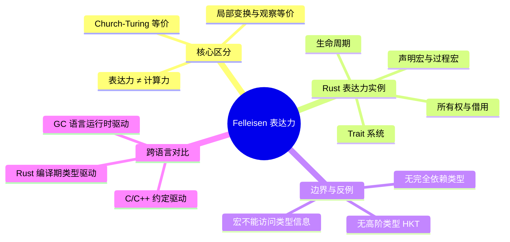

> **EN**: Felleisen Expressive Power
> **Summary**: A treatment of Matthias Felleisen's notion of programming-language expressiveness—distinguishing it from raw computational power—and how Rust's ownership, lifetimes, traits, and macro systems exemplify the ability to encode programming concepts as local, observation-preserving abstractions rather than external transformations.
>
> **Rust 版本**: 1.97.0+ (Edition 2024)
> **Bloom 层级**: L4
> **权威来源**: 本文件为 `concept/` 权威页。
> **来源**: [Felleisen — On the Expressive Power of Programming Languages (1991, Springer LNCS)](https://doi.org/10.1007/3-540-54444-5_141) · [arXiv:1808.09490 — A Practical Analysis of Rust's Concurrency Story](https://arxiv.org/abs/1808.09490) · [Rust Reference — Macros](https://doc.rust-lang.org/reference/macros.html) · [Rust Reference — Traits](https://doc.rust-lang.org/reference/items/traits.html) · [Pierce — Types and Programming Languages](https://www.cis.upenn.edu/~bcpierce/tapl/)

# Felleisen 表达力（Felleisen Expressive Power）

---

## 📑 目录

- [Felleisen 表达力（Felleisen Expressive Power）](#felleisen-表达力felleisen-expressive-power)
  - [📑 目录](#-目录)
  - [一、核心概念：表达力不等于计算力](#一核心概念表达力不等于计算力)
  - [二、Felleisen 表达力框架](#二felleisen-表达力框架)
    - [2.1 语言扩充与局部变换](#21-语言扩充与局部变换)
    - [2.2 观察等价性](#22-观察等价性)
    - [2.3 表达力比较的形式化直觉](#23-表达力比较的形式化直觉)
  - [三、Rust 中的表达力实例](#三rust-中的表达力实例)
    - [3.1 所有权与借用：从运行时约定到编译期局部检查](#31-所有权与借用从运行时约定到编译期局部检查)
    - [3.2 生命周期：将时间约束编码到类型](#32-生命周期将时间约束编码到类型)
    - [3.3 Trait 系统：零成本抽象与行为复用](#33-trait-系统零成本抽象与行为复用)
    - [3.4 声明宏与过程宏：库作者的语言扩展](#34-声明宏与过程宏库作者的语言扩展)
  - [四、跨语言对比矩阵](#四跨语言对比矩阵)
  - [五、反命题与边界分析](#五反命题与边界分析)
    - [5.1 反例：Rust 无法在类型系统内表达更高阶类型（HKT）](#51-反例rust-无法在类型系统内表达更高阶类型hkt)
    - [5.2 反例：完全依赖类型需要外部工具](#52-反例完全依赖类型需要外部工具)
    - [5.3 反例：宏不能访问类型信息](#53-反例宏不能访问类型信息)
  - [六、国际权威参考](#六国际权威参考)
  - [七、思维导图（Mindmap）](#七思维导图mindmap)
  - [嵌入式测验](#嵌入式测验)
    - [测验 1：表达力与计算力的区别](#测验-1表达力与计算力的区别)
    - [测验 2：Rust 所有权在 Felleisen 框架中的角色](#测验-2rust-所有权在-felleisen-框架中的角色)
    - [测验 3：宏为什么不是“无限表达力”](#测验-3宏为什么不是无限表达力)

---

## 一、核心概念：表达力不等于计算力

在编程语言理论中，**表达力（expressive power）**与**计算力（computational power）**是两个常被混淆的概念。

- **计算力**回答“这个语言能计算哪些函数”。按 Church-Turing 论题，几乎所有主流通用语言（Rust、C、JavaScript、Haskell、Python）在计算力上等价：它们都能计算同样的可计算函数类。
- **表达力**回答“这个语言能以多么自然、局部、可组合的方式表达某种编程概念或编程习惯用法，而不破坏程序其余部分的语义”。

Matthias Felleisen 在 1991 年的经典论文 *On the Expressive Power of Programming Languages* 中提出了一个操作性定义：

> 如果语言 **L'** 可以通过一种**局部变换（local transformation）**——通常表现为宏或语法扩展——引入某个新概念，并且所有不使用该概念的程序在观察意义上与在 **L** 中行为一致，那么 **L'** 不比 **L** 表达力更强。只有当 **L'** 中的某个概念**无法**被还原为 **L** 中的局部、语义保持的编码时，我们才说 **L'** 严格比 **L** 更具表达力。

简言之，Felleisen 的表达力衡量的是**语言自身对抽象的支持能力**，而不是它能否在原则上完成某项计算。

Rust 的设计哲学正是围绕“把尽可能多的不变量从运行时迁移到编译期”展开的：所有权、生命周期、借用检查、Trait 系统、模式匹配、宏等机制共同提升了 Rust 在**系统编程概念**上的表达力，使得许多在 C/C++ 中只能通过约定、注释或外部静态分析工具表达的性质，可以在 Rust 中以本地、可组合、可重用的方式表达。

---

## 二、Felleisen 表达力框架

### 2.1 语言扩充与局部变换

Felleisen 将一种编程语言 **L** 视为一个形式系统，包含语法、类型（如有）和操作语义。一个**语言扩充（language extension）** **L' = L ⊕ F** 向 **L** 中加入了一组新的语言构造 **F**。

关键问题在于：**F 是否真正增加了表达力？**

如果存在一个**局部变换（local transformation）**——通常称为**宏（macro）**或**脱糖（desugaring）**——能把任何使用 **F** 的程序翻译成仅使用 **L** 的程序，并且这个翻译是**模块化的**（只作用于使用 **F** 的代码片段，不影响全局程序结构），那么 **F** 并没有增加表达力，它只是**语法糖**。

例如，在 Rust 中：

```rust
// `vec!` 是一个声明宏；它局部展开为 Vec 的构造代码。
let v = vec![1, 2, 3];
```

`vec!` 并没有增加 Rust 的表达力，因为它完全可以被局部地脱糖为：

```rust
let v = {
    let mut __v = Vec::new();
    __v.push(1);
    __v.push(2);
    __v.push(3);
    __v
};
```

因此，`vec!` 是表达力上的**语法糖**，不是真正的表达力扩展。

### 2.2 观察等价性

Felleisen 框架的第二条腿是**观察等价性（observational equivalence）**。当我们把 **L'** 程序翻译回 **L** 时，必须保证：

> 对于任何不包含新构造 **F** 的上下文 **C[·]**，以及任何使用 **F** 的程序片段 **M**，若 **M** 在 **L'** 中被翻译为 **M'**，则 **C[M]** 与 **C[M']** 在所有可观察行为上不可区分。

在 Rust 的语境下，这意味着：如果一个宏展开后的代码在运行时产生不同的 panic 消息、不同的内存布局或不同的外部可见副作用，那么该宏可能不是一个纯粹的语法糖，而是改变了可观察语义。

### 2.3 表达力比较的形式化直觉

给定两种语言 **L₁** 和 **L₂**：

- **L₂ 至少与 L₁ 一样有表达力**：任何 **L₁** 程序都可以被忠实地翻译到 **L₂**，且翻译保持观察行为。
- **L₂ 严格比 L₁ 更有表达力**：**L₂** 至少与 **L₁** 一样有表达力，并且存在一个 **L₂** 中的构造 **F**，无法通过局部、观察保持的翻译还原为 **L₁**。

> **教学提示**：本节中的“定理/推论”均为帮助直觉的**教学类比**，并非机器验证的形式化证明。严格证明需要借助操作语义、上下文等价和逻辑关系等工具。

---

## 三、Rust 中的表达力实例

### 3.1 所有权与借用：从运行时约定到编译期局部检查

在 C/C++ 中，内存所有权通常是一种**编码约定**：程序员通过注释、命名规范（如 `owning_ptr<T>`）或外部静态分析工具来表达“谁拥有这块内存、何时释放、谁能借用”。这些约定不是语言的一部分，因此无法在上下文中被局部检查；违反约定通常导致运行时错误（use-after-free、double-free、data race）。

Rust 把所有权和借用提升为**语言核心构造**：

```rust
/// 所有权转移：返回值的所有权从函数内部转移到调用者。
pub fn make_string() -> String {
    String::from("owned")
}

/// 不可变借用：调用者保留所有权，函数只获得只读视图。
pub fn inspect(s: &str) -> usize {
    s.len()
}

/// 可变借用：调用者保留所有权，函数获得独占写权限。
pub fn append(s: &mut String) {
    s.push_str("!");
}

fn main() {
    let mut s = make_string();
    let n = inspect(&s);
    append(&mut s);
    assert_eq!(n, 5);
    assert_eq!(s, "owned!");
}
```

在 Felleisen 的视角下，Rust 的所有权系统**不是** C 的语法糖：你无法仅通过局部变换把上述 Rust 程序翻译成等价的 C 程序，同时保持相同的编译期错误检测能力。你需要一个全局的借用检查器，这正是 Rust 表达力的来源之一。

### 3.2 生命周期：将时间约束编码到类型

生命周期 `'a` 把“引用在何时有效”这一**时间维度**的信息编码进类型系统：

```rust
/// 返回两个字符串切片中较长者的引用。
/// 生命周期标注 'a 说明：返回值的生命周期不超过 x 或 y 中较短者。
pub fn longest<'a>(x: &'a str, y: &'a str) -> &'a str {
    if x.len() >= y.len() { x } else { y }
}
```

在没有生命周期标注的语言中，这种时间约束通常需要：

1. 运行时垃圾回收（GC）来延迟释放；
2. 或外部工具（如 Valgrind、AddressSanitizer）在测试阶段捕获错误；
3. 或完全依赖程序员遵守约定。

Rust 的生命周期使得时间约束成为**类型系统可检查的局部性质**，从而提升了表达力。

### 3.3 Trait 系统：零成本抽象与行为复用

Trait 允许 Rust 把行为抽象为类型类（type class），并在编译期通过单态化（monomorphization）实现零成本特化：

```rust
pub trait Area {
    fn area(&self) -> f64;
}

pub struct Circle { pub radius: f64 }

impl Area for Circle {
    fn area(&self) -> f64 {
        std::f64::consts::PI * self.radius * self.radius
    }
}

pub fn print_area<T: Area>(shape: &T) {
    println!("area = {}", shape.area());
}
```

在 C 中，类似的抽象通常通过函数指针或宏实现，但函数指针带来间接调用开销，宏则缺乏类型检查。Rust 的 Trait 系统在保持类型安全的同时实现了零成本抽象，这是表达力的提升。

### 3.4 声明宏与过程宏：库作者的语言扩展

Rust 的宏系统允许库作者定义局部语法扩展：

```rust
// 声明宏示例：简化重复的错误处理模式。
macro_rules! bail {
    ($($arg:tt)*) => {
        return Err(format!($($arg)*))
    };
}

pub fn parse_even(s: &str) -> Result<i32, String> {
    let n: i32 = s.parse().map_err(|e| format!("parse error: {e}"))?;
    if n % 2 != 0 {
        bail!("expected even number, got {}", n);
    }
    Ok(n)
}
```

声明宏 `macro_rules!` 是局部的、可展开的语法糖；过程宏（proc-macro）则可以在编译期操作 Token 流，实现自定义 `derive` 属性等。它们都扩展了“程序员能说什么”，但**不扩展 Rust 的计算力**——所有宏展开后的代码仍然是普通 Rust。

---

## 四、跨语言对比矩阵

| 语言/机制 | 内存安全表达 | 并发安全表达 | 泛型/多态 | 类型级时间约束 | 元编程扩展 |
|:---|:---|:---|:---|:---|:---|
| **C** | 约定 + 外部工具 | 约定 + 外部工具 | 宏 + `void*` | 无 | 预处理器 |
| **C++** | RAII + 智能指针（约定驱动） | `mutex` + 约定 | 模板 | 无 | 模板元编程 |
| **Rust** | 所有权/借用（编译期检查） | `Send`/`Sync` + 借用检查 | Trait + 单态化 | 生命周期 | 声明宏/过程宏 |
| **Haskell** | GC（运行时） | STM / `IO` monad | Type class + HKT | 无（GC 处理） | 模板 Haskell |
| **Java** | GC（运行时） | `synchronized` | 泛型（擦除） | 无（GC 处理） | 注解处理器 |

> **说明**：GC 语言通过运行时机制保证内存安全，Rust 通过类型系统将其前移到编译期。两者在**计算力**上等价，但在**表达力**上体现了不同的设计权衡。

---

## 五、反命题与边界分析

### 5.1 反例：Rust 无法在类型系统内表达更高阶类型（HKT）

Rust 没有**高阶类型（Higher-Kinded Types, HKT）**。例如，无法抽象地写一个参数为“某种类型构造器 `F<_>`”的函数，使其同时适用于 `Vec<T>`、`Option<T>`、`Result<T, E>`：

```rust,compile_fail
// 这段代码不能编译：Rust 不支持 `F<_>` 形式的类型构造器参数。
trait Mappable<F<_>, A, B> {
    fn map(f: F<A>, g: impl Fn(A) -> B) -> F<B>;
}
```

作为对比，Haskell 支持 HKT，因此可以定义 `Functor` type class 一次性抽象 `Maybe`、`[]`、`IO` 等构造器。Rust 只能通过**泛型关联类型（GAT）**、宏或代码生成部分模拟这一能力，说明在 HKT 这一维度上 Rust 的表达力弱于 Haskell。

### 5.2 反例：完全依赖类型需要外部工具

Rust 支持 `const generics` 和类型级编程的片段，但不支持**完全依赖类型**——即运行时值可以构造新类型：

```rust,compile_fail
// 非法：Rust 不能根据运行时值 n 构造类型 Vector<n>。
fn make_vector<const N: usize>(n: usize) -> [i32; n] {
    [0; n]
}
```

要表达向量长度由运行时值决定的类型，需要外部工具如 [Flux](14_flux.md) 或 [Verus](https://github.com/verus-lang/verus)。

### 5.3 反例：宏不能访问类型信息

Rust 的宏在 Token 层面工作，**不能访问类型检查器的信息**：

```rust
// 过程宏不能根据 `x` 的类型生成不同代码；它只能看到 Token 树。
#[derive(Debug)]
struct Point { x: i32, y: i32 }
```

`derive(Debug)` 之所以能够工作，是因为编译器在宏展开后会对生成代码进行类型检查；宏本身并不知道 `i32` 是什么，它只是按照固定模式生成代码。这与依赖类型语言或 Lisp 的宏系统不同，后者可以在宏展开时访问类型或运行时信息。

---

## 六、国际权威参考

> 依据 `AGENTS.md` §2「单一权威来源」与国际化权威对齐要求，本节列出可复核的 P0/P1/P2 来源。

- **P1 学术/形式化**
  - [Felleisen, M. — On the Expressive Power of Programming Languages (1991, Springer LNCS 526)](https://doi.org/10.1007/3-540-54444-5_141)
  - [Pierce, B. C. — Types and Programming Languages (MIT Press, 2002)](https://www.cis.upenn.edu/~bcpierce/tapl/)
  - [Jung et al. — RustBelt: Securing the Foundations of Rust (POPL 2018, MPI-SWS)](https://plv.mpi-sws.org/rustbelt/popl18/)
  - [Reed — Patina: A Formalization of Rust (2015)](https://arxiv.org/abs/1510.05208)
  - [Vytiniotis et al. — Haskell Type Classes with No Language Extensions (ICFP 2021)](https://doi.org/10.1145/3473579)

- **P0 官方**
  - [The Rust Programming Language — Macros](https://doc.rust-lang.org/book/ch19-06-macros.html)
  - [Rust Reference — Macros](https://doc.rust-lang.org/reference/macros.html)
  - [Rust Reference — Traits](https://doc.rust-lang.org/reference/items/traits.html)
  - [The Rustonomicon — Ownership](https://doc.rust-lang.org/nomicon/ownership.html)

- **P2 生态/社区**
  - [This Week in Rust — Expressiveness and Safety](https://this-week-in-rust.org/)
  - [Rust Internals Forum — Language Design](https://internals.rust-lang.org/)

---

## 七、思维导图（Mindmap）



---

## 嵌入式测验

### 测验 1：表达力与计算力的区别

**题目**: 按照 Felleisen 的定义，Rust 与 C 在计算力上大致等价，但 Rust 通常被认为比 C 更具“表达力”。请解释这两个概念的区别，并举一个 Rust 中体现更强表达力的具体机制。

<details>
<summary>✅ 答案与解析</summary>

**计算力**指语言能计算哪些函数；按 Church-Turing 论题，Rust 与 C 都能计算所有可计算函数。**表达力**指语言能否以局部、观察保持的方式表达某种编程概念。Rust 的**所有权与借用系统**是一个典型例子：它把内存安全从 C 中的“程序员约定”提升为编译期可检查的语言构造，无法仅通过局部宏或语法糖在 C 中复现。
</details>

----

### 测验 2：Rust 所有权在 Felleisen 框架中的角色

**题目**: `vec!` 宏被视为语法糖，没有增加 Rust 的表达力。那么 Rust 的所有权/借用检查是否也是“语法糖”？用 Felleisen 的局部变换与观察等价标准说明理由。

<details>
<summary>✅ 答案与解析</summary>

所有权/借用**不是**语法糖。`vec!` 可以局部展开为普通 Rust 代码，且不改变程序观察行为；但所有权检查需要一个**全局的借用检查器**，它分析整个程序的引用关系、生命周期和别名模式。你无法通过局部脱糖把一个违反借用规则的 Rust 程序转换成等价的、不带借用检查的 C 程序而保持相同的编译期安全保证。因此它属于表达力扩展。
</details>

----

### 测验 3：宏为什么不是“无限表达力”

**题目**: Rust 宏看起来非常强大，可以定义新的语法。为什么它们没有赋予 Rust“无限表达力”？请结合 Felleisen 框架和 Rust 宏的两个限制说明。

<details>
<summary>✅ 答案与解析</summary>

宏不改变语言的**计算力**，因为所有宏展开后仍是普通 Rust 代码，最终由同样的操作语义解释。Felleisen 框架下，宏只是**局部语法变换**（脱糖）。Rust 宏还有两个关键限制：1) 过程宏只能操作 Token 流，**不能访问类型信息**；2) 宏无法引入新的类型系统规则。因此它们无法表达需要类型系统扩展（如高阶类型、完全依赖类型）才能表达的概念。
</details>

----

> **来源**: [Felleisen — On the Expressive Power of Programming Languages](https://doi.org/10.1007/3-540-54444-5_141) · [Pierce — Types and Programming Languages](https://www.cis.upenn.edu/~bcpierce/tapl/) · [Rust Reference](https://doc.rust-lang.org/reference/) · [RustBelt](https://plv.mpi-sws.org/rustbelt/popl18/)
>
> **状态**: ✅ 权威页（canonical）

---

**相关概念**: [类型理论](01_type_theory.md) · [Lambda 演算](05_lambda_calculus.md) · [类型语义](06_type_semantics.md) · [依赖类型与细化类型](10_dependent_refinement_types.md) · [形式化算法理论](13_formal_algorithm_theory.md) · [Rust 宏](../../03_advanced/03_proc_macros/01_macros.md)
