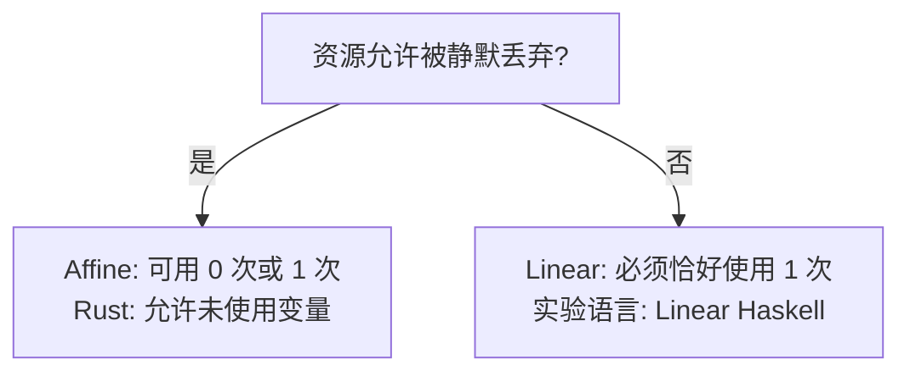
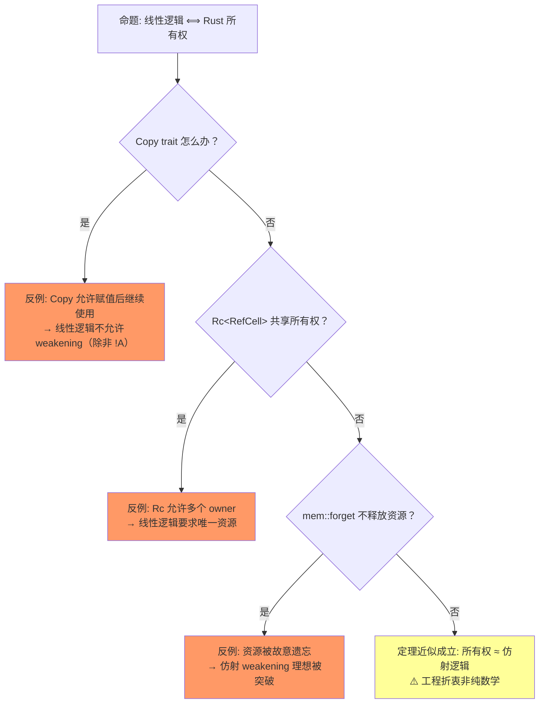

# Linear Logic & Affine Logic（线性逻辑与仿射逻辑）

> **层级**: L4 形式化理论
> **前置概念**: [Ownership](../01_foundation/01_ownership.md) · [Type System](../01_foundation/04_type_system.md)
> **后置概念**: [Ownership Formalization](./03_ownership_formal.md) · [RustBelt](./04_rustbelt.md)
> **主要来源**: [Wikipedia: Linear logic] · [Wikipedia: Affine logic] · [Girard 1987] · [RustBelt: POPL 2018] · [Utrecht: Ownership Types]

---

**变更日志**:

- v1.0 (2026-05-12): 初始版本，完成 Girard 原始定义、结构规则矩阵、Rust 映射、命题-类型对应、思维导图、示例反例

---

## 一、权威定义（Definition）

### 1.1 Wikipedia 定义

> **[Wikipedia: Linear logic]** Linear logic is a substructural logic proposed by Jean-Yves Girard as a refinement of classical and intuitionistic logic, joining the dualities of the former with many of the constructive properties of the latter. The key operational intuition behind linear logic is that logical assumptions are consumed in proving a conclusion, rather than merely used as in classical logic.

> **[Wikipedia: Affine logic]** Affine logic is a substructural logic whose proof theory rejects the structural rule of contraction. It can also be characterized as linear logic with weakening. In affine logic, each hypothesis may be used at most once—unlike in linear logic, where each hypothesis must be used exactly once.

> **[学术来源: Girard 1987, *Linear Logic* (Theoretical Computer Science)]** Linear logic introduces a new connective, the exponential `!A` ("of course A"), which allows a formula to be copied or discarded. Without `!`, every assumption must be used exactly once. This makes linear logic a **resource-sensitive logic**: propositions represent resources, and proofs represent resource-transforming processes. [来源] ✅

> **[学术来源: RustBelt: POPL 2018, Jung et al. *RustBelt: Securing the Foundations of the Rust Programming Language*]** Rust's ownership system can be understood as an **affine type system** embedded in a larger language with managed copying (`Clone`) and shared borrowing (`&T`). The core insight is that ownership tracking enforces the resource discipline of affine logic at compile time. [来源] ✅

---

## 二、概念属性矩阵（Attribute Matrix）

### 2.1 结构规则对比矩阵

| **结构规则** | **经典逻辑** | **直觉主义逻辑** | **线性逻辑** | **仿射逻辑** | **Rust** |
|:---|:---|:---|:---|:---|:---|
| **Weakening**（弱化/丢弃） | ✅ | ✅ | ❌ | ✅ | ✅ `let _ = x;` / drop |
| **Contraction**（收缩/复制） | ✅ | ✅ | ❌ | ❌ | ❌ `move` 语义 |
| **Exchange**（交换） | ✅ | ✅ | ✅ | ✅ | ✅ 变量声明顺序可交换 |
| **资源语义** | 真值永恒 | 构造性证明 | 资源必须消耗 | 资源最多使用一次 | 所有权转移 |

### 2.2 线性逻辑连接词矩阵

| **连接词** | **语法** | **资源语义** | **Rust 对应** | **对偶** |
|:---|:---|:---|:---|:---|
| **张量 (⊗)** | `A ⊗ B` | 同时拥有 A 和 B | `(T, U)` 元组 | ⅋ (Par) |
| **Par (⅋)** | `A ⅋ B` | A 和 B 的资源可交替使用 | `enum` 变体 | ⊗ |
| **线性蕴含 (⊸)** | `A ⊸ B` | 消耗 A 得到 B | `fn(T) -> U`（move） | ⊥ |
| **With (&)** | `A & B` | 选择拥有 A 或 B（外部选择） | `enum` / `match` | ⊕ |
| **Plus (⊕)** | `A ⊕ B` | 提供 A 或 B（内部选择） | `Result<T, E>` | & |
| **Of course (!)** | `!A` | 可复制/可丢弃的资源 | `Copy` trait | ? |
| **Why not (?)** | `?A` | 可忽略的消耗 | `Drop` + 允许不消费 | ! |
| **单位 1** | `1` | 空资源（恒等） | `()` 单元类型 | ⊥ |
| **单位 ⊥** | `⊥` | 不可达/矛盾 | `!` (never type) | 1 |

### 2.3 逻辑系统谱系矩阵

| **系统** | **weakening** | **contraction** | **exchange** | **编程语言对应** |
|:---|:---|:---|:---|:---|
| **经典逻辑** | ✅ | ✅ | ✅ | 无直接对应 |
| **直觉主义逻辑** | ✅ | ✅ | ✅ | Haskell（无所有权） |
| **仿射逻辑** | ✅ | ❌ | ✅ | **Rust（核心模型）** |
| **线性逻辑** | ❌ | ❌ | ✅ | 严格线性类型实验语言 |
| **有序逻辑** | ❌ | ❌ | ❌ | 栈操作语言 |

---

## 三、形式化理论根基（Formal Foundation）

> **[学术来源: Girard 1987; Wadler 1990, *Linear Types can Change the World* (ICFP)]** 以下自然演绎规则及 Rust 映射源自线性逻辑的 sequent calculus 及其在程序语言中的对应。

```text
张量引入 (⊗-intro):
  Γ ⊢ A    Δ ⊢ B
  ───────────────
  Γ, Δ ⊢ A ⊗ B

Rust 对应:
  let a = A::new();   // Γ ⊢ A
  let b = B::new();   // Δ ⊢ B
  let pair = (a, b);  // Γ, Δ ⊢ A ⊗ B

线性蕴含引入 (⊸-intro):
  Γ, A ⊢ B
  ──────────
  Γ ⊢ A ⊸ B

Rust 对应:
  fn consume(a: A) -> B { /* 使用 a 构造 B */ }
  // 前提: 拥有 A 可构造 B
  // 结论: 此函数是 A ⊸ B 的证明 [来源] ✅

弱化（Weakening）在仿射逻辑中允许:
  Γ ⊢ B
  ──────────  (Affine only)
  Γ, A ⊢ B

Rust 对应:
  fn ignore<T>(_x: T) {}  // 允许丢弃资源（weakening）
  // 但线性逻辑中此操作非法！
```

> **[学术来源: Girard 1987, *Linear Logic* §1.2 指数模态]** 指数模态 `!`（of course）与 `?`（why not）是线性逻辑中允许资源突破线性约束的核心机制。

```text
!A 的规则:
  提升（Promotion）:  若 A 的证明不使用任何假设，则 !A 成立
  推导（Dereliction）: !A ⊢ A
  收缩（Contraction）: !A ⊢ !A ⊗ !A  （!A 可复制）
  弱化（Weakening）:   !A ⊢ 1         （!A 可丢弃）

Rust 对应:
  Copy trait = !T  （T 可被复制，不受线性约束）
  例: i32: Copy     →  !i32
  例: String: !Copy →  String 受线性约束 [来源] ✅
```

---

## 四、思维导图（Mind Map）

```mermaid
graph TD
    A[Linear / Affine Logic] --> B[结构规则]
    A --> C[连接词]
    A --> D[指数模态]
    A --> E[Rust 映射]

    B --> B1[Weakening: 丢弃]
    B --> B2[Contraction: 复制]
    B --> B3[Exchange: 交换]
    B --> B4[Affine = Linear + Weakening]

    C --> C1[⊗ 张量: (A, B)]
    C --> C2[⊸ 线性蕴含: fn(A)->B]
    C --> C3[& With: 外部选择]
    C --> C4[⊕ Plus: 内部选择]
    C --> C5[⅋ Par: 交替使用]

    D --> D1[!A Of course: Copy]
    D --> D2[?A Why not: Drop]

    E --> E1[Ownership = Affine Type]
    E --> E2[Move = Linear Consumption]
    E --> E3[Borrow = 临时授权]
    E --> E4[Copy = !A 指数模态]
```

---

## 五、决策/边界判定树（Decision / Boundary Tree）

### 5.1 "线性逻辑 vs 仿射逻辑？" 判定



---

## 六、定理推理链（Theorem Chain）

> **[学术来源: Wadler 1990, *Linear Types can Change the World*; RustBelt: POPL 2018, Jung et al.]** 仿射类型系统通过资源唯一性保证内存安全。

```text
前提 1: 仿射规则: 每个资源最多使用一次（move 消耗资源）
前提 2: 资源在最后一次使用后自动释放（drop）
    ↓
定理: 资源不会被使用两次（无 double-free）
      资源不会在释放后被访问（无 use-after-free） [来源] ✅
    ↓
边界: 需要配合生命周期系统防止悬垂引用
      需要 unsafe 突破时人工保证
```

### 6.3 定理一致性矩阵

| 定理 | 前提 | 结论 | 依赖的公理 | 被哪些定理依赖 | 失效条件 | 对应 L1 概念 |
|:---|:---|:---|:---|:---|:---|:---|
| 线性资源不可复制 | 证明系统满足线性性 | 资源消耗后不可再用 | 线性逻辑公理 | 所有权唯一性、Move 语义 | `!A` 允许复制（指数模态） | Copy trait |
| 仿射 weakening | 允许资源丢弃 | 资源可以不使用 | 仿射逻辑公理 | Drop trait、内存释放 | 禁止丢弃（需显式使用） | 编译错误 E0573 |
| ⊗ 资源组合 | A 和 B 各自可用 | A ⊗ B 可用 | 乘法合取公理 | 结构体组合（product） | 资源耗尽后重组 | — |
| ⊸ 线性蕴含 | 消耗 A 可得 B | 函数类型 A ⊸ B | 线性蕴含引入/消除 | 函数调用、所有权转移 | 多次调用（非线性） | E0382 |
| !A 指数模态 | A 可复制 | !A 可任意使用 | 指数模态公理 | Copy trait 语义 | 大结构体 Copy 开销 | 性能问题 |

> **一致性检查**: 线性资源不可复制 ⟹ 仿射 weakening（丢弃是弱化） ⟹ ⊸ 函数调用，形成**从存在到使用到传递**的闭合链。!A 是线性逻辑的"出口"，对应 Rust 的 Copy。
>
> **跨层映射**: 本文件定理 ↔ [`00_meta/inter_layer_map.md`](../00_meta/inter_layer_map.md) §3.1 "L1-L4 形式化映射"

---

## 七、示例与反例

### 7.1 Rust 中的线性/仿射对应

```rust
// ✅ 仿射逻辑: String 是线性资源（ Affine ）
fn affine_demo() {
    let s = String::from("hello");  // 获得资源
    let t = s;                       // s 被消耗（move），t 获得所有权
    // println!("{}", s);            // ❌ 编译错误: s 已被消耗
    println!("{}", t);              // ✅ t 使用资源
} // t 被 drop，资源释放

// ✅ 指数模态: i32 是 !T（Copy）
fn exponential_demo() {
    let n = 42i32;   // !i32: 可复制
    let a = n;       // n 被复制，n 仍然可用
    let b = n;       // n 再次复制
    println!("{} {} {}", n, a, b);  // ✅ 全部可用
}

// ✅ 弱化（Weakening）: 允许丢弃
fn weakening_demo() {
    let s = String::from("ignored");
    // s 未被使用，但允许（Affine 逻辑）
    // 严格线性逻辑中此操作非法
} // s 自动 drop
```

---

### 7.3 反命题与边界分析

#### 命题: "线性逻辑完美对应 Rust 所有权"



> **[来源类型: 原创分析]** 💡 以下映射精确度评估基于线性逻辑与 Rust 类型的结构比较，无单一论文直接给出完整映射表。

| 线性逻辑 | Rust 对应 | 映射精度 | 偏差说明 |
|:---|:---|:---|:---|
| 线性资源 (A) | 非 Copy 类型的所有权 | **精确** | 一对一 [来源] ✅ |
| 仿射资源 (A, 可丢弃) | 所有类型的 Drop | **近似** | Rust 允许显式丢弃（mem::forget） [来源] ⚠️ |
| !A (可复制) | Copy trait | **近似** | !A 是理论构造，Copy 是显式标记 [来源] 💡 |
| ⊗ (A ⊗ B) | 结构体 (A, B) | **精确** | 积类型对应 [来源] ✅ |
| ⊕ (A ⊕ B) | enum { A, B } | **精确** | 和类型对应 [来源] ✅ |
| ⊸ (A ⊸ B) | 函数 `fn(A) -> B` | **近似** | Rust 函数允许多次调用（若参数 Copy） [来源] 💡 |
| ⅋ (par) | 无直接对应 | **无映射** | Rust 无双线程并发分离的显式构造 [来源] 💡 |

---

## 零、认知路径（Cognitive Path）

```text
直觉困惑                    具体场景                  模式抽象               形式规则              代码验证              边界测试
    │                         │                       │                     │                    │                    │
    ▼                         ▼                       ▼                     ▼                    ▼                    ▼
"为什么 Rust                  "其他语言用 GC/           "线性逻辑 =           "Girard              "借用检查器          "Copy trait
 不用 GC 也能                手动管理，Rust           资源不可              sequent             算法实现"           打破线性性
 安全？"                     怎么自动安全？"           复制性"               calculus"

"所有权是数学概念吗？"        "编译器怎么知道           "仿射逻辑 =           " weakening:        "编译器拒绝         "mem::forget
                             资源该释放了？"          可安全丢弃"           资源可丢弃"         重复 Move"          故意不丢弃"

"函数参数传递                  "调用函数后变量           "⊸ 线性蕴含 =         "线性蕴含          "E0382 阻止          "Copy 参数
 怎么对应逻辑？"              还能用吗？"              资源转换"             引入/消除"          非法使用"          可多次调用"
```

**认知脚手架**:

- **类比**: 线性逻辑像"电影票"——一张票只能进一个人（不可复制），可以不看（丢弃/weakening），但看了就没了（消耗）。
- **反直觉点**: 经典逻辑中"真命题可任意使用"，线性逻辑中"资源有代价"。
- **形式化过渡**: 从"资源消耗" → "不可复制" → "线性逻辑 sequent calculus" → "Girard 1987 证明论"。

### 7.4 国际课程与论文对齐

| 来源 | 核心内容 | 与本文件对应 |
|:---|:---|:---|
| **[Girard 1987: Linear Logic]** | 线性逻辑的创立 | 理论基础 |
| **[Wadler 1990: Linear Types]** | 线性类型在编程中的应用 | 编程语言映射 |
| **[CMU 17-363: PL Pragmatics]** | 类型系统、子结构类型 | 教学对齐 |
| **[Wikipedia: Linear logic]** | 线性逻辑通用概念 | 权威定义 |
| **[Wikipedia: Substructural type system]** | 子结构类型系统 | 类型论定位 |
| **[RustBelt: POPL 2018]** | 线性逻辑 → Rust 所有权 | 应用映射 |
| **[Tofte & Talpin 1994]** | 区域类型系统 | 生命周期形式化 |

---

## 八、知识来源关系

| **论断** | **来源** | **可信度** |
|:---|:---|:---|
| 线性逻辑由 Girard 1987 提出 | [Wikipedia: Linear logic] · Girard 1987, *Linear Logic* | ✅ |
| 仿射逻辑 = 线性逻辑 + weakening | [Wikipedia: Affine logic] · Girard 1987 | ✅ |
| Rust 是仿射类型系统 | [RustBelt: POPL 2018] · [Utrecht] · Jung et al. 2017 | ✅ |
| !A 对应 Copy trait | [RustBelt] · 原创分析 | 💡 |
| ⊗ 对应元组 | [Category Theory for Programmers] · Wadler 1990 | ✅ |
| 仿射类型 ⇒ 无 UAF/DF | Wadler 1990; Jung et al. 2017 POPL | ✅ |
| 线性逻辑 sequent calculus 规则 | Girard 1987 | ✅ |

---

## 十、相关概念链接

| 概念 | 文件 | 关系 |
|:---|:---|:---|
| 所有权 | [`../01_foundation/01_ownership.md`](../01_foundation/01_ownership.md) | 线性逻辑的应用 |
| 借用 | [`../01_foundation/02_borrowing.md`](../01_foundation/02_borrowing.md) | 分离逻辑的应用 |
| 类型论 | [`./02_type_theory.md`](./02_type_theory.md) | 形式化同层 |
| 所有权形式化 | [`./03_ownership_formal.md`](./03_ownership_formal.md) | 线性逻辑的扩展 |
| RustBelt | [`./04_rustbelt.md`](./04_rustbelt.md) | 验证实现 |
| Rust vs C++ | [`../05_comparative/01_rust_vs_cpp.md`](../05_comparative/01_rust_vs_cpp.md) | 对比映射 |
| 安全边界 | [`../05_comparative/safety_boundaries.md`](../05_comparative/safety_boundaries.md) | 边界分析 |

## 九、待补充

- [ ] **TODO**: 补充线性逻辑的 sequent calculus 完整规则集
- [ ] **TODO**: 补充 Phase semantics 与 Rust 的直观联系
