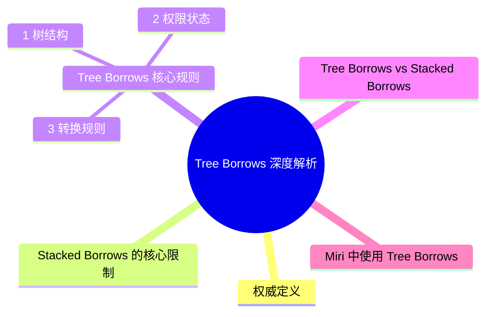

> **内容分级**: [专家级]
> **代码状态**: 📋 综述/研究
> **定理链**: N/A — 操作语义研究
>
# Tree Borrows 深度解析
>
> **EN**: Tree Borrows Deep Dive
> **Summary**: 深入解析 Rust 别名模型的演进：从 Stacked Borrows 到 Tree Borrows，理解其设计动机、核心规则、与 Miri 的关系及生产实践影响。
> **Rust 版本**: 1.97.0+ (Edition 2024)
> **受众**: [进阶] Unsafe Rust、形式化方法、运行时（Runtime）工具开发者
> **Bloom 层级**: L4-L5
> **权威来源**: 本文件为 `concept/` 权威页。
> **A/S/P 标记**: **S** — Structure
> **双维定位**: C×Str
> **前置依赖**: [Unsafe Rust](../../03_advanced/02_unsafe/01_unsafe.md) · [所有权（Ownership）形式化](02_ownership_formal.md) · [Miri](../04_model_checking/08_miri.md)
> **后置延伸**: [BorrowSanitizer](../02_separation_logic/04_borrow_sanitizer_in_formal.md) · [BorrowSanitizer 预览/活跃跟踪](../../07_future/02_preview_features/24_borrow_sanitizer.md) · [Safety Tags](../../07_future/02_preview_features/03_safety_tags_preview.md) · [AutoVerus / Verus](../../07_future/02_preview_features/33_autoverus_preview.md) · [Miri](../04_model_checking/08_miri.md)
>
> **来源**: [Villani et al. — Tree Borrows (PLDI 2025)](https://perso.crans.org/vanile/treebor/) · [Tree Borrows — DOI 10.1145/3735592](https://doi.org/10.1145/3735592) · [Miri 文档 — Tree Borrows](https://github.com/rust-lang/miri/blob/master/src/borrow_tracker/mod.rs) · [Unsafe Code Guidelines](https://rust-lang.github.io/unsafe-code-guidelines/) · [Rust Reference — Behavior Considered Undefined](https://doc.rust-lang.org/reference/behavior-considered-undefined.html) · [Brown University — Interactive Rust Book](https://rust-book.cs.brown.edu/) · [TRPL](https://doc.rust-lang.org/book/title-page.html)
> **内容重叠提示**: 本文与 [`archive/docs/content/academic/10_tree_borrows_guide.md`](../../../archive/docs/content/academic/10_tree_borrows_guide.md)（归档只读） 内容高度重叠。`docs/` 版本提供专项深入；`concept/` 版本为项目权威主轨。
> **内容重叠提示**: 本文与 [`knowledge/04_expert/miri/01_tree_borrows.md`](../../../knowledge/04_expert/miri/01_tree_borrows.md) 内容高度重叠。`knowledge/` 版本提供专项深入；`concept/` 版本为项目权威主轨。
> **前置概念**: N/A
> **后置概念**: N/A
---

## 一、权威定义

> Tree Borrows is a new aliasing model for Rust that generalizes Stacked Borrows to support more flexible borrowing patterns.
> —— Tree Borrows 论文核心思想 (Source: [Villani et al. — Tree Borrows](https://perso.crans.org/vanile/treebor/))

**Stacked Borrows** 是 Rust 第一个广泛使用的别名模型，将每次借用（Borrowing）视为栈中的 tag。它精确但严格，某些合法模式被误判为 UB。 (Source: [Stacked Borrows — Jung et al.](https://plv.mpi-sws.org/rustbelt/stacked-borrows/))

**Tree Borrows** 将借用（Borrowing）组织为**树结构**，允许同一内存位置存在多个并行的借用分支，从而接受更多实际代码中常见但 Stacked Borrows 禁止的模式。 (Source: [Villani et al. — Tree Borrows](https://perso.crans.org/vanile/treebor/))

---

## 二、Stacked Borrows 的核心限制

Stacked Borrows 要求借用（Borrowing）按严格的 LIFO 顺序失效。这导致以下问题：

```rust,ignore
// Stacked Borrows 下可能报 UB，但 Tree Borrows 允许
let mut x = 0;
let r1 = &mut x;
let r2 = &mut x; // 重新借用
*r1 = 1; // Stacked Borrows 可能认为 r1 已失效
```

虽然安全 Rust 不会出现这种模式，但在 unsafe 代码、自引用（Reference）结构、某些 FFI 场景中，开发者需要更灵活的别名规则。

---

## 三、Tree Borrows 核心规则

本节聚焦「Tree Borrows 核心规则」，覆盖树结构、权限状态与转换规则。论述顺序由定义到边界：先明确「Tree Borrows 核心规则」在「Tree Borrows 深度解析」中的确切含义与适用范围，再给出可核验的例证或数据，最后标注它与相邻主题的分界线。读完后应能用一句话复述「Tree Borrows 核心规则」的判定标准，并指出它在全页论证链中的位置。

### 3.1 树结构

- 每次借用（Borrowing）创建一个节点。
- 子节点代表从父节点派生出的新借用（Borrowing）。
- 节点可以独立失效，不一定要遵循 LIFO。

### 3.2 权限状态

每个 tag 可以处于以下状态之一：

| 状态 | 含义 |
|:---|:---|
| **Active** | 可读可写 |
| **Frozen** | 只读 |
| **Disabled** | 不可访问 |

### 3.3 转换规则

- 写访问会禁用所有不兼容的兄弟 tag（而非整个栈）。
- 读访问会将相关 tag 转为 Frozen。
- 子节点的访问不会随意使父节点失效。

---

## 四、Tree Borrows vs Stacked Borrows

| 维度 | Stacked Borrows | Tree Borrows |
|:---|:---|:---|
| 结构 | 栈 | 树 |
| 严格程度 | 更严格 | 更灵活 |
| Miri 默认 | 曾是默认 | 自某版本起成为默认 |
| 误报 | 较多 | 较少 |
| 漏报 | 较少 | 理论上可能略多（但仍在安全边界内） |
| 教学难度 | 较直观 | 需要理解树与权限状态 |

---

## 五、Miri 中使用 Tree Borrows

```bash
MIRIFLAGS="-Zmiri-tree-borrows" cargo miri test
```

自 Miri 某版本起，Tree Borrows 已成为默认模型。Stacked Borrows 仍可通过 `-Zmiri-stacked-borrows` 启用。 (Source: [Miri 文档 — Tree Borrows](https://github.com/rust-lang/miri/blob/master/src/borrow_tracker/mod.rs))

---

## 六、对 BorrowSanitizer 的影响

BorrowSanitizer 的目标是运行时（Runtime）检测 Tree Borrows 违规。与 Miri 相比：

- **速度**：原生执行，显著快于 Miri 的解释执行。
- **覆盖**：目前主要针对单线程别名违规，多线程和原子内存仍在完善。
- **精度**：需要与 Miri 的 Tree Borrows 实现持续对齐。

---

## 七、反命题与边界

- **不是许可证**：Tree Borrows 是操作语义模型，用于检测 UB，不是编写 unsafe 代码的许可。
- **仍在演进**：Rust 的正式别名模型尚未最终确定，Stacked/Tree Borrows 都是候选解释。
- **不能替代测试**：动态工具只能检测执行路径，不能证明所有路径安全。

---

## 八、嵌入式测验

**测验 1**: Tree Borrows 相比 Stacked Borrows 的主要优势是什么？

- A. 更快的编译速度
- B. 允许更多合法的别名模式
- C. 自动修复 unsafe 代码
- D. 替代借用（Borrowing）检查器

<details>
<summary>答案</summary>
B
</details>

**测验 2**: 在 Miri 中如何显式启用 Tree Borrows？

<details>
<summary>答案</summary>
<code>MIRIFLAGS="-Zmiri-tree-borrows" cargo miri test</code>（现代 Miri 已默认启用）
</details>

---

## 相关概念

- [BorrowSanitizer](../02_separation_logic/04_borrow_sanitizer_in_formal.md)
- [BorrowSanitizer 预览/活跃跟踪](../../07_future/02_preview_features/24_borrow_sanitizer.md)
- [Safety Tags](../../07_future/02_preview_features/03_safety_tags_preview.md) · [深度形式化](../../07_future/02_preview_features/03_safety_tags_preview.md)
- [AutoVerus / Verus](../../07_future/02_preview_features/33_autoverus_preview.md) · [深度](../04_model_checking/07_autoverus.md)
- [Miri](../04_model_checking/08_miri.md)
- [Unsafe Rust](../../03_advanced/02_unsafe/01_unsafe.md)
- [形式化验证工具生态](../../06_ecosystem/08_formal_verification/02_formal_verification_tools.md)
- [Rust 1.98+ 预览](../../07_future/00_version_tracking/rust_1_98_preview.md)

---

> **权威来源**: [Villani et al. — Tree Borrows (PLDI 2025)](https://perso.crans.org/vanile/treebor/) · [Tree Borrows — DOI 10.1145/3735592](https://doi.org/10.1145/3735592) · [Stacked Borrows](https://plv.mpi-sws.org/rustbelt/stacked-borrows/) · [Miri 文档 — Tree Borrows](https://github.com/rust-lang/miri/blob/master/src/borrow_tracker/mod.rs) · [Unsafe Code Guidelines](https://rust-lang.github.io/unsafe-code-guidelines/) · [Rust Reference — Behavior Considered Undefined](https://doc.rust-lang.org/reference/behavior-considered-undefined.html) · [TRPL](https://doc.rust-lang.org/book/title-page.html) · [Rustonomicon](https://doc.rust-lang.org/nomicon/index.html)
> **权威来源对齐变更日志**: 2026-07-10 补全权威来源标注（Rust Reference、TRPL、Rustonomicon、RFCs、学术论文） [Authority Source Sprint Batch L4](../../00_meta/02_sources/05_international_authority_index.md)

**文档版本**: 1.0
**最后更新**: 2026-07-10
**状态**: ✅ 权威来源对齐完成 (Batch L4)

---

## ⚠️ 反例与陷阱

**反例：别名 × 可变违反** —— Tree Borrows 的形式化对象正是这类别名冲突。

```rust,compile_fail
// rustc 1.97.0 实测：error[E0502]: cannot borrow `v` as mutable
// because it is also borrowed as immutable
fn main() {
    let mut v = vec![1, 2, 3];
    let r = &v[0];
    v.push(4); // 可变借用与存活中的不可变借用冲突
    println!("{r}");
}
```

**修正对照**：收缩不可变借用（Immutable Borrow）的存活区间（NLL 下借用随最后使用结束）。

```rust
fn main() {
    let mut v = vec![1, 2, 3];
    {
        let r = &v[0];
        println!("{r}");
    } // 不可变借用在此结束
    v.push(4);
}
```

**陷阱要点**：借用（Borrowing）检查拒绝是 Tree/Stacked Borrows 在 safe 层的投影；`unsafe` 中同样的别名模式不会报错但构成 UB，需 Miri 检测。

---

## 国际权威参考 / International Authority References（P1 学术 · P2 生态）

> 依据 `AGENTS.md` §2「对齐网络国际化权威内容」补充：仅追加已验证可达的权威链接，不改动正文事实。

- **P2 生态/社区**: [formal-land/coq-of-rust](https://github.com/formal-land/coq-of-rust) · [AeneasVerif/aeneas](https://github.com/AeneasVerif/aeneas)

## 🧭 思维导图（Mindmap）



> **认知功能**: 本 mindmap 从本页章节结构提炼，一级分支对应核心主题，叶子节点为关键子概念，可作为本页的快速导航与复习索引。
