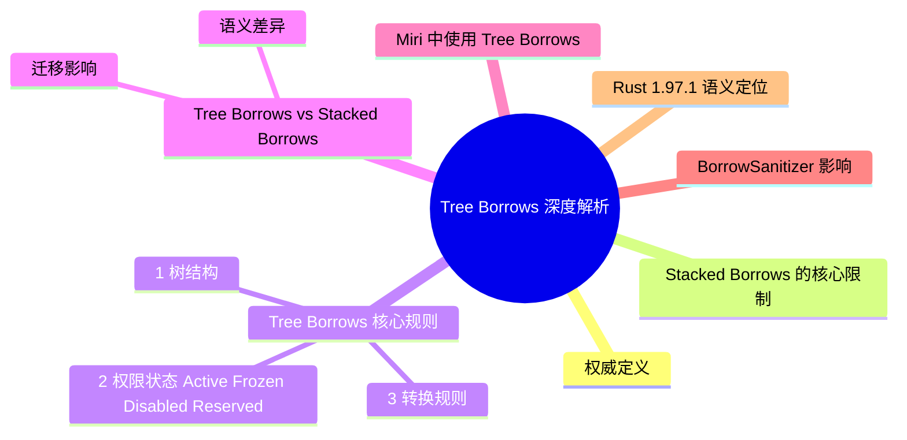

> **内容分级**: [专家级]
> **代码状态**: 📋 综述/研究
> **定理链**: N/A — 操作语义研究
>
# Tree Borrows 深度解析
>
> **EN**: Tree Borrows Deep Dive
> **Summary**: 深入解析 Rust 别名模型的演进：从 Stacked Borrows 到 Tree Borrows，理解其设计动机、权限状态机、与 Miri 的关系、语义差异、迁移影响及生产实践。
> **Rust 版本**: 1.97.0+ (Edition 2024)
> **受众**: [进阶] Unsafe Rust、形式化方法、运行时（Runtime）工具开发者
> **Bloom 层级**: L4-L5
> **权威来源**: 本文件为 `concept/` 权威页。
> **A/S/P 标记**: **S** — Structure
> **双维定位**: C×Str
> **前置依赖**: [Unsafe Rust](../../03_advanced/02_unsafe/01_unsafe.md) · [所有权（Ownership）形式化](02_ownership_formal.md) · [Miri](../04_model_checking/08_miri.md) · [MiniRust](../03_operational_semantics/10_minirust.md)
> **后置延伸**: [BorrowSanitizer](../02_separation_logic/04_borrow_sanitizer_in_formal.md) · [BorrowSanitizer 预览/活跃跟踪](../../07_future/02_preview_features/24_borrow_sanitizer.md) · [Safety Tags](../../07_future/02_preview_features/03_safety_tags_preview.md) · [AutoVerus / Verus](../../07_future/02_preview_features/33_autoverus_preview.md) · [Miri](../04_model_checking/08_miri.md) · [形式化 unsafe 契约](07_unsafe_contracts_formal.md)
>
> **来源**: [Villani et al. — Tree Borrows (PLDI 2025)](https://perso.crans.org/vanile/treebor/) · [Tree Borrows — DOI 10.1145/3735592](https://doi.org/10.1145/3735592) · [Miri 文档 — Tree Borrows](https://github.com/rust-lang/miri/blob/master/src/borrow_tracker/mod.rs) · [Unsafe Code Guidelines](https://rust-lang.github.io/unsafe-code-guidelines/) · [Rust Reference — Behavior Considered Undefined](https://doc.rust-lang.org/reference/behavior-considered-undefined.html) · [Brown University — Interactive Rust Book](https://rust-book.cs.brown.edu/) · [TRPL](https://doc.rust-lang.org/book/title-page.html)
> **内容重叠提示**: 本文与 [`archive/docs/content/academic/10_tree_borrows_guide.md`](../../../archive/05_formal_methods/02_academic_tools/10_tree_borrows_guide.md)（归档只读） 内容高度重叠。`docs/` 版本提供专项深入；`concept/` 版本为项目权威主轨。
> **内容重叠提示**: 本文与 [`knowledge/04_expert/miri/01_tree_borrows.md`](../../../knowledge/04_expert/miri/01_tree_borrows.md) 内容高度重叠。`knowledge/` 版本提供专项深入；`concept/` 版本为项目权威主轨。
> **跨层映射**: L3 [Unsafe Rust](../../03_advanced/02_unsafe/01_unsafe.md) §5.5/§5.6 与 L3 [Rust 内存模型](../../03_advanced/02_unsafe/06_memory_model.md) §六保留别名模型摘要与 Miri 使用入口；完整规则、权限状态机、代码模式覆盖与本 L4 页保持同步。
> **前置概念**: N/A
> **后置概念**: N/A
---

## 权威来源 / Provenance

本页关于 Stacked Borrows / Tree Borrows 别名模型的事实与比较，直接引用以下权威来源：

- **Stacked Borrows** — Jung et al., *Stacked Borrows: An Aliasing Model for Rust*, POPL 2020 · [项目主页](https://plv.mpi-sws.org/rustbelt/stacked-borrows/)
- **Tree Borrows** — Villani et al., *Tree Borrows*, PLDI 2025 · [预印本 PDF](https://perso.crans.org/vanille/treebor/aux/preprint.pdf) · [Ralf Jung 博客讲解](https://www.ralfj.de/blog/2023/06/02/tree-borrows.html)

关键论断：Tree Borrows 用树形权限状态机替代 Stacked Borrows 的线性栈，使“通过裸指针重新借用后复用原引用”等合法 unsafe 模式不再被误报为 UB，同时保持对真 UB 的检测能力。

```rust,ignore
// Tree Borrows 允许、Stacked Borrows 拒绝的别名模式
// 验证：MIRIFLAGS=-Zmiri-tree-borrows cargo miri test 通过；
//       MIRIFLAGS=-Zmiri-stacked-borrows cargo miri test 报 UB。
fn main() {
    let mut x = 0;
    let r1 = &mut x;                  // 父可变引用
    let raw = r1 as *mut i32;         // 派生裸指针
    let r2 = unsafe { &mut *raw };    // 通过裸指针重新借用
    unsafe { *r2 = 1; }               // 子引用写
    drop(r2);                         // 子引用结束
    assert_eq!(*r1, 1);               // Tree Borrows：父引用仍可读；Stacked Borrows 会判为 UB
}
```

---

## 一、权威定义

> Tree Borrows is a new aliasing model for Rust that generalizes Stacked Borrows to support more flexible borrowing patterns.
> —— Tree Borrows 论文核心思想 (Source: [Villani et al. — Tree Borrows](https://perso.crans.org/vanile/treebor/))

**Stacked Borrows** 是 Rust 第一个广泛使用的别名模型，将每次借用（Borrowing）视为栈中的 tag。它精确但严格，某些合法模式被误判为 UB。 (Source: [Stacked Borrows — Jung et al.](https://plv.mpi-sws.org/rustbelt/stacked-borrows/))

**Tree Borrows** 将借用（Borrowing）组织为**树结构**，允许同一内存位置存在多个并行的借用分支，从而接受更多实际代码中常见但 Stacked Borrows 禁止的模式。 (Source: [Villani et al. — Tree Borrows](https://perso.crans.org/vanile/treebor/))

---

## 二、Stacked Borrows 的核心限制

Stacked Borrows 要求借用（Borrowing）按严格的 LIFO 顺序失效。这导致以下问题：

```rust,ignore
// Stacked Borrows 下可能报 UB，但 Tree Borrows 允许
let mut x = 0;
let r1 = &mut x;
let r2 = &mut x; // 重新借用
*r1 = 1; // Stacked Borrows 可能认为 r1 已失效
```

虽然安全 Rust 不会出现这种模式，但在 unsafe 代码、自引用（Reference）结构、某些 FFI 场景中，开发者需要更灵活的别名规则。

---

## 三、Tree Borrows 核心规则

本节聚焦「Tree Borrows 核心规则」，覆盖树结构、权限状态与转换规则。

### 3.1 树结构

- 每次借用（Borrowing）创建一个节点。
- 子节点代表从父节点派生出的新借用（Borrowing）。
- 节点可以独立失效，不一定要遵循 LIFO。
- 同一父节点下可存在多个并行的子节点（例如两阶段借用中的 reserved mutable 与多个 shared 引用）。

### 3.2 权限状态

每个 tag 可以处于以下状态之一：

| 状态 | 含义 |
|:---|:---|
| **Active** | 可读可写 |
| **Frozen** | 只读 |
| **Disabled** | 不可访问 |
| **Reserved** | 两阶段可变借用的预备态：允许与共享引用共存，一旦被写则升级为 Active 并冻结兄弟 |

### 3.3 转换规则

- 写访问会禁用所有不兼容的兄弟 tag（而非整个栈）。
- 读访问会将相关 tag 转为 Frozen。
- 子节点的访问不会随意使父节点失效；父节点在子树结束后可恢复。
- 两阶段借用（`&mut` 在创建后先读再写）通过 Reserved 状态得到原生支持。

---

## 四、Tree Borrows vs Stacked Borrows：语义差异与迁移影响

### 4.1 结构差异

| 维度 | Stacked Borrows | Tree Borrows |
|:---|:---|:---|
| 结构 | 栈 | 树 |
| 严格程度 | 更严格 | 更灵活 |
| Miri 默认 | Rust 1.71 之前的默认 | 自 Rust 1.72 起成为 Miri 默认 |
| 误报 | 较多 | 较少 |
| 漏报 | 较少 | 理论上可能略多（但仍在安全边界内） |
| 教学难度 | 较直观 | 需要理解树与权限状态 |
| 两阶段借用 | 需额外规则 | 原生支持 Reserved 态 |

### 4.2 典型代码差异

**场景 A：父引用在子借用后复用**

```rust,ignore
let mut x = 0;
let r1 = &mut x;
let r2 = unsafe { &mut *(r1 as *mut i32) };
unsafe { *r2 = 1; }
assert_eq!(*r1, 1); // Stacked: UB；Tree: OK
```

**场景 B：通过裸指针派生多个兄弟引用**

```rust,ignore
let mut x = 0;
let raw = &mut x as *mut i32;
let r1 = unsafe { &mut *raw };
let r2 = unsafe { &mut *raw }; // 与 r1 同层兄弟
unsafe { *r1 = 1; }            // Tree：使 r2 Disabled，r1 仍 Active
// *r2 = 2;                    // Tree：UB（Disabled）
```

### 4.3 迁移影响

- **对 safe Rust 用户**：无直接影响；借用检查器不变。
- **对 unsafe 代码维护者**：Miri 默认 Tree Borrows 后，一些原本需要 `#[allow(invalid_reference_casting)]` 或额外裸指针技巧的代码可以更自然地编写；但仍需以 UCG/Reference 为准。
- **对标准库验证**：RustBelt/RefinedRust 等基础证明正在向 Tree Borrows 迁移（研究进行中）。
- **对 Miri CI**：建议同时跑 `-Zmiri-tree-borrows` 与 `-Zmiri-stacked-borrows`，确保代码不依赖某一模型的宽松角落。

---

## 五、Miri 中使用 Tree Borrows

```bash
MIRIFLAGS="-Zmiri-tree-borrows" cargo miri test
```

自 Rust 1.72 起，Tree Borrows 已成为 Miri 默认模型。Stacked Borrows 仍可通过 `MIRIFLAGS="-Zmiri-stacked-borrows"` 启用。 (Source: [Miri 文档 — Tree Borrows](https://github.com/rust-lang/miri/blob/master/src/borrow_tracker/mod.rs))

### 选择建议

```bash
# 默认推荐：Tree Borrows
MIRIFLAGS="-Zmiri-tree-borrows" cargo miri test

# 若 Tree Borrows 通过但代码在 Stacked Borrows 下失败，
# 说明代码依赖了更宽松的别名规则；优先修复代码，
# 除非能证明该模式在官方内存模型中会被接受。
```

---

## 六、对 BorrowSanitizer 的影响

BorrowSanitizer 的目标是运行时（Runtime）检测 Tree Borrows 违规。与 Miri 相比：

- **速度**：原生执行，显著快于 Miri 的解释执行。
- **覆盖**：目前主要针对单线程别名违规，多线程和原子内存仍在完善。
- **精度**：需要与 Miri 的 Tree Borrows 实现持续对齐。

---

## 七、Rust 1.97.1 语义定位

截至 Rust 1.97.1：

- **rustc 未将 Tree Borrows 作为正式 UB 规范**：Rust Reference 的 [Behavior Considered Undefined](https://doc.rust-lang.org/reference/behavior-considered-undefined.html) 章节仍在持续细化，Stacked Borrows 与 Tree Borrows 都是学术界/工业界提出的**操作语义候选模型**。
- **Miri 默认使用 Tree Borrows**：自 Rust 1.72 起，Miri 默认启用 Tree Borrows（`-Zmiri-tree-borrows`），以接受更多在 Stacked Borrows 下被误报的合法 unsafe 模式。仍可通过 `MIRIFLAGS="-Zmiri-stacked-borrows"` 切回旧模型。
- **生产代码建议**：编写 unsafe 代码时，应以 Rust Reference / UCG 的明文规则为首要依据；Tree Borrows 提供的是“代码在 Miri 下是否被接受”的额外信号，而非编写新 unsafe 模式的许可证。

## 八、反命题与边界

- **不是许可证**：Tree Borrows 是操作语义模型，用于检测 UB，不是编写 unsafe 代码的许可。
- **仍在演进**：Rust 的正式别名模型尚未最终确定，Stacked/Tree Borrows 都是候选解释。
- **不能替代测试**：动态工具只能检测执行路径，不能证明所有路径安全。

---

## 九、嵌入式测验

**测验 1**: Tree Borrows 相比 Stacked Borrows 的主要优势是什么？

- A. 更快的编译速度
- B. 允许更多合法的别名模式
- C. 自动修复 unsafe 代码
- D. 替代借用（Borrowing）检查器

<details>
<summary>答案</summary>
B
</details>

**测验 2**: 在 Miri 中如何显式启用 Tree Borrows？

<details>
<summary>答案</summary>
<code>MIRIFLAGS="-Zmiri-tree-borrows" cargo miri test</code>（现代 Miri 已默认启用）
</details>

---

## 相关概念

- [BorrowSanitizer](../02_separation_logic/04_borrow_sanitizer_in_formal.md)
- [BorrowSanitizer 预览/活跃跟踪](../../07_future/02_preview_features/24_borrow_sanitizer.md)
- [Safety Tags](../../07_future/02_preview_features/03_safety_tags_preview.md) · [深度形式化](../../07_future/02_preview_features/03_safety_tags_preview.md)
- [AutoVerus / Verus](../../07_future/02_preview_features/33_autoverus_preview.md) · [深度](../04_model_checking/07_autoverus.md)
- [Miri](../04_model_checking/08_miri.md)
- [MiniRust：Rust 操作语义的可执行模型](../03_operational_semantics/10_minirust.md)
- [形式化视角下的 unsafe 契约](07_unsafe_contracts_formal.md)
- [Unsafe Rust](../../03_advanced/02_unsafe/01_unsafe.md)
- [形式化验证工具生态](../../06_ecosystem/08_formal_verification/02_formal_verification_tools.md)
- [Rust 1.98+ 预览](../../07_future/00_version_tracking/rust_1_98_preview.md)

---

> **权威来源**: [Villani et al. — Tree Borrows (PLDI 2025)](https://perso.crans.org/vanile/treebor/) · [Tree Borrows — DOI 10.1145/3735592](https://doi.org/10.1145/3735592) · [Stacked Borrows](https://plv.mpi-sws.org/rustbelt/stacked-borrows/) · [Miri 文档 — Tree Borrows](https://github.com/rust-lang/miri/blob/master/src/borrow_tracker/mod.rs) · [Unsafe Code Guidelines](https://rust-lang.github.io/unsafe-code-guidelines/) · [Rust Reference — Behavior Considered Undefined](https://doc.rust-lang.org/reference/behavior-considered-undefined.html) · [TRPL](https://doc.rust-lang.org/book/title-page.html) · [Rustonomicon](https://doc.rust-lang.org/nomicon/index.html)
> **权威来源对齐变更日志**: 2026-07-10 补全权威来源标注（Rust Reference、TRPL、Rustonomicon、RFCs、学术论文）；2026-07-31 新增语义差异与迁移影响小节 [Authority Source Sprint Batch L4](../../00_meta/02_sources/05_international_authority_index.md)

**文档版本**: 1.1
**最后更新**: 2026-07-31
**状态**: ✅ 权威来源对齐完成 (Batch L4)

---

## ⚠️ 反例与陷阱

**反例：别名 × 可变违反** —— Tree Borrows 的形式化对象正是这类别名冲突。

```rust,compile_fail
// rustc 1.97.0 实测：error[E0502]: cannot borrow `v` as mutable
// because it is also borrowed as immutable
fn main() {
    let mut v = vec![1, 2, 3];
    let r = &v[0];
    v.push(4); // 可变借用与存活中的不可变借用冲突
    println!("{r}");
}
```

**修正对照**：收缩不可变借用（Immutable Borrow）的存活区间（NLL 下借用随最后使用结束）。

```rust
fn main() {
    let mut v = vec![1, 2, 3];
    {
        let r = &v[0];
        println!("{r}");
    } // 不可变借用在此结束
    v.push(4);
}
```

**陷阱要点**：借用（Borrowing）检查拒绝是 Tree/Stacked Borrows 在 safe 层的投影；`unsafe` 中同样的别名模式不会报错但构成 UB，需 Miri 检测。

---

## 国际权威参考 / International Authority References（P1 学术 · P2 生态）

> 依据 `AGENTS.md` §2「对齐网络国际化权威内容」补充：仅追加已验证可达的权威链接，不改动正文事实。

- **P1 学术**: [Villani et al. — *Tree Borrows*, PLDI 2025](https://perso.crans.org/vanile/treebor/) · [Jung et al. — *Stacked Borrows*, POPL 2020](https://plv.mpi-sws.org/rustbelt/stacked-borrows/)
- **P2 生态/社区**: [formal-land/coq-of-rust](https://github.com/formal-land/coq-of-rust) · [AeneasVerif/aeneas](https://github.com/AeneasVerif/aeneas)

## 🧭 思维导图（Mindmap）


```mermaid
mindmap
  root((Tree Borrows 深度解析))
    权威定义
    Stacked Borrows 的核心限制
    Tree Borrows 核心规则
      1 树结构
      2 权限状态 Active Frozen Disabled Reserved
      3 转换规则
    Tree Borrows vs Stacked Borrows
      语义差异
      迁移影响
    Miri 中使用 Tree Borrows
    BorrowSanitizer 影响
    Rust 1.97.1 语义定位
```

> **认知功能**: 本 mindmap 从本页章节结构提炼，一级分支对应核心主题，叶子节点为关键子概念，可作为本页的快速导航与复习索引。
