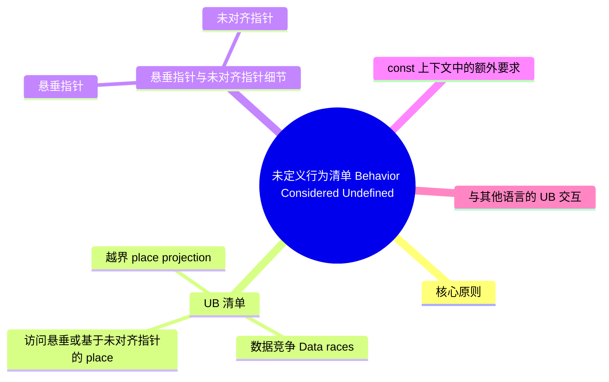

> **内容分级**: [研究者级]
>
# 未定义行为清单（Behavior Considered Undefined）

> **EN**: Behavior Considered Undefined
> **Summary**: Rust Reference 明确列出的未定义行为（UB）清单，覆盖数据竞争、指针别名、无效值、运行时假设等核心安全契约边界。 Rust Reference list of undefined behaviors, covering data races, pointer aliasing, invalid values, and runtime assumptions.
> **Rust 版本**: 1.97.1+ (Edition 2024)
>
> **受众**: [专家]
> **Bloom 层级**: L2-L4
> **权威来源**: 本文件为 `concept/` 权威页。
>
> **变更日志**:
>
> - v1.0 (2026-07-10): 初始版本，覆盖 Rust Reference UB 清单核心条目
> - v1.1 (2026-07-28): P1 语义补齐——扩展悬垂/未对齐指针细节（`isize::MAX` span 边界、`size_of_val`、引用/`Box` 显式存活期、misaligned place projection）、无效值边界（union/padding 读取例外）；更新 Rust 版本至 1.97.1+
> **A/S/P 标记**: **S** — Specification
> **双维定位**: S×Ana — 规范分析
> **前置依赖**: [Unsafe Rust](../../03_advanced/02_unsafe/01_unsafe.md) · [Atomics and Memory Ordering](../../03_advanced/00_concurrency/06_atomics_and_memory_ordering.md) · [Pointer Aliasing](02_ownership_formal.md)
> **后置概念**: [Miri](../04_model_checking/08_miri.md) · [Tree Borrows](05_tree_borrows_deep_dive.md) · [Inline Assembly](../../03_advanced/05_inline_assembly/01_inline_assembly.md)
> **定理链**: Unsafe Contract → UB 清单 → Soundness
> **主要来源**: [Rust Reference — Behavior Considered Undefined](https://doc.rust-lang.org/reference/behavior-considered-undefined.html) · [Jung et al. — RustBelt: Securing the Foundations of Rust](https://plv.mpi-sws.org/rustbelt/popl18/) · [LLVM — Undefined Behavior](https://llvm.org/docs/UndefinedBehavior.html) · [Brown University — Interactive Rust Book](https://rust-book.cs.brown.edu/) · [TRPL](https://doc.rust-lang.org/book/title-page.html) · [Itanium C++ ABI](https://itanium-cxx-abi.github.io/cxx-abi/abi.html)

>
> **来源**: [Rust Reference — Behavior Considered Undefined](https://doc.rust-lang.org/reference/behavior-considered-undefined.html) · [Rust Reference — The unsafe keyword](https://doc.rust-lang.org/reference/unsafe-keyword.html) · [Rustonomicon](https://doc.rust-lang.org/nomicon/index.html)

---

## 一、核心原则

`unsafe` 关键字**不**改变“Rust 程序永远不得导致未定义行为”这一事实。它只是将避免 UB 的责任从编译器转移到了程序员。 (Source: [Rust Reference — Behavior Considered Undefined](https://doc.rust-lang.org/reference/behavior-considered-undefined.html))

- **Sound（健全）**: 任何 safe 代码与某段 unsafe 代码交互时都不会触发 UB。
- **Unsound（不健全）**: safe 代码可以错误使用该 unsafe 代码并触发 UB。

(Soundness 定义见 [Rustonomicon — Soundness](https://doc.rust-lang.org/nomicon/safe-unsafe-meaning.html))

> **警告**: 下列清单**非穷尽**，未来可能增减。目前 Rust 尚未对 unsafe 代码建立完整的形式化语义模型。

---

## 二、UB 清单

本节聚焦「UB 清单」，覆盖数据竞争（Data races）、访问悬垂或基于未对齐指针的 place、越界 place projection、破坏指针别名规则等方面。论述顺序由定义到边界：先明确「UB 清单」在「未定义行为清单（Behavior Considered Undefined）」中的确切含义与适用范围，再给出可核验的例证或数据，最后标注它与相邻主题的分界线。读完后应能用一句话复述「UB 清单」的判定标准，并指出它在全页论证链中的位置。

### 1. 数据竞争（Data races）

多个线程同时访问同一内存位置，且至少一个是写操作，没有同步。 (Source: [Rust Reference — Behavior Considered Undefined](https://doc.rust-lang.org/reference/behavior-considered-undefined.html))

### 2. 访问悬垂或基于未对齐指针的 place

- **悬垂指针（dangling pointer）**: 指针指向的内存已不属于同一生存期内的分配。
- **未对齐指针（misaligned pointer）**: 解引用（Reference）时指针未满足类型的对齐要求。
- **指针 span 边界**: Rust 要求指针及其所访问类型的 `size_of_val` 不会使地址计算超出 `isize::MAX` 范围；超出该范围的 place 访问属于 UB。

> 零大小类型（ZST）的指针永远不会悬垂，即使它是空指针。
> **[Rust Reference — Behavior Considered Undefined](https://doc.rust-lang.org/reference/behavior-considered-undefined.html)** 对“访问悬垂或基于未对齐指针的 place”给出了上述边界条件。

### 3. 越界或 misaligned place projection

- **越界 projection**: 字段访问、元组索引、数组/切片（Slice）索引运算导致指针算术越界。
- **misaligned projection**: 通过 `*const T` / `*mut T` 构造的 place 若未满足目标类型对齐要求，在 load/store 时构成 UB。使用 `&raw const` / `&raw mut` 创建未对齐裸指针本身是允许的，但后续解引用需保证对齐。

> **[Rust Reference — Behavior Considered Undefined](https://doc.rust-lang.org/reference/behavior-considered-undefined.html)** 将越界与未对齐的 place projection 列为 UB。

### 4. 破坏指针别名规则

- `&T` 指向的内存在其存活期间不可被修改（`UnsafeCell<U>` 内部除外）。
- `&mut T` 指向的内存不可被任何非派生自该引用（Reference）的指针读写，且同一时间内不可存在其他引用。
- `Box<T>` 在别名规则中等价于 `&'static mut T`。

### 5. 修改不可变字节

- `const` 提升表达式可达的字节。
- `static` / `const` 初始化器中生命周期（Lifetimes）被延长到 `'static` 的借用（Borrowing）可达的字节。
- 不可变绑定或不可变 `static` 拥有的字节（`UnsafeCell<U>` 内部除外）。
- 共享引用（Reference）（以及通过 `Box`、复合类型字段传递的引用）可达的字节。

### 6. 调用编译器内建产生 UB

例如错误使用 `std::intrinsics` 中的某些内建函数。

### 7. 在当前平台不支持的特性上执行代码

使用 `target_feature` 启用当前 CPU 不支持的指令集，除非平台文档明确说明安全。

### 8. 错误调用约定或错误展开

- 调用函数的 ABI 不匹配。
- 跨过一个不允许展开的栈帧进行 unwind（例如将 `"C-unwind"` 函数当作 `"C"` 调用或转换函数指针）。

### 9. 产生无效值（Invalid values）

只要值被赋值、读取、传递、返回，即视为“产生”该值。以下值为无效：

| 类型 | 有效值要求 |
|:---|:---|
| `bool` | 只能是 `0` (`false`) 或 `1` (`true`) |
| `fn` 指针 | 必须非空 |
| `char` | 不能是 surrogate (`0xD800..=0xDFFF`)，且 ≤ `char::MAX` |
| `!` | 永远不存在 |
| 整数/浮点/原始指针（Raw Pointer） | 必须已初始化 |
| `str` | 与 `[u8]` 相同，必须已初始化 |
| `enum` | 必须有合法 discriminant，且对应变体字段有效 |
| `struct` / tuple / array | 所有字段/元素有效 |
| `union` | 通常读取未初始化内存为 UB；例外：从 `union` 的某个字段读取该字段当前活跃值时，其 padding 字节是否有效由具体场景决定，safe 代码可构造的值一定有效 |
| 引用（Reference） / `Box<T>` | 对齐、非空、不悬垂、指向有效值；且引用/`Box` 的活跃期（liveness duration）必须覆盖其被使用期间 |
| 宽引用（Reference）/Box/裸指针 metadata | 必须与 unsized tail 类型匹配（vtable 或有效 slice 长度） |
| 自定义有效范围类型 | 如 `NonNull<T>`、`NonZero<T>`，必须落在允许范围内 |

> **Union / Padding 读取例外**（来源: [Rust Reference — Behavior Considered Undefined](https://doc.rust-lang.org/reference/behavior-considered-undefined.html)）：
>
> - 读取 `union` 的非活跃字段（inactive field）**本身**不自动构成 UB；但若读取出的值被当作某具体类型“产生”（赋值、传递、返回、用于运算），则该值必须对该类型有效。
> - 读取结构体/元组/数组的 padding 字节**本身**不自动构成 UB；但将从 padding 中读取的字节解释为某个具体类型的值并“产生”该值时，则属于无效值 UB。
> - 简言之：**读 padding/union 非活跃字段 ≠ 必然 UB；把读到的无效位模式当正常值用 = UB**。

### 10. 错误使用内联汇编

参见 [Inline Assembly](../../03_advanced/05_inline_assembly/01_inline_assembly.md) 的安全规则。

### 11. 违反 Rust 运行时假设

- 当前大多数运行时（Runtime）假设未显式文档化。
- unwind 相关假设参见 panic 文档。
- 运行时（Runtime）期望 Rust 栈帧在局部变量析构完成前不会被释放；`longjmp` 等 C 函数可能违反该假设。

---

## 三、悬垂指针与未对齐指针细节

本节聚焦「悬垂指针与未对齐指针细节」，覆盖悬垂指针 与 未对齐指针。论述顺序由定义到边界：先明确「悬垂指针与未对齐指针细节」在「未定义行为清单（Behavior Considered Undefined）」中的确切含义与适用范围，再给出可核验的例证或数据，最后标注它与相邻主题的分界线。读完后应能用一句话复述「悬垂指针与未对齐指针细节」的判定标准，并指出它在全页论证链中的位置。

### 悬垂指针

引用（Reference）或指针若指向的字节不全部属于同一生存期内的分配，则为悬垂。ZST 指针例外。

**Pointer span 与 `isize::MAX` 边界**（来源: [Rust Reference — Behavior Considered Undefined](https://doc.rust-lang.org/reference/behavior-considered-undefined.html)）:

- 通过指针算术产生的地址与原始指针之间的字节偏移不得超过 `isize::MAX`（正向或负向）。
- 该限制适用于 `ptr::offset`、slice 索引、place projection 等所有基于指针的地址计算。
- 溢出 `isize::MAX` 的偏移即使未实际解引用，也构成 UB——编译器可据此假设所有有效指针都在 `isize::MAX` 范围内。

**`size_of_val` 与动态大小类型（DST）边界**:

- 对 DST（如 `[T]`、`dyn Trait`、`str`）的引用/指针必须携带合法的 metadata：slice 长度、trait object vtable、或 `str` 字节长度。
- 若通过 unsafe 构造出长度超过 `isize::MAX` 的 slice metadata，或使用不匹配类型的 vtable，则 `size_of_val` 及后续投影会触发 UB。

**引用与 `Box` 的显式存活期（liveness duration）边界**:

- `&T`、`&mut T`、`Box<T>` 所指向的内存必须在引用的整个存活期内保持有效且未被释放。
- 该存活期由借用检查器静态推断；在 unsafe 中，程序员必须手动保证：任何通过引用访问的内存不会在引用失效前被释放或重新分配。
- 例如：将局部变量的引用返回给调用方、在 `Box::into_raw` 后继续使用原 `Box`、或在 `Vec::set_len` 后读取未初始化元素，均可能违反 liveness duration。

### 未对齐指针

place 基于未对齐指针，当且仅当对该 place 进行 load/store 时构成 UB。使用 `&raw const` / `&raw mut` 创建裸指针是允许的，但 `&` / `&mut` 要求字段类型对齐。

**Misaligned place projection 细节**:

- 未对齐不仅发生在顶层解引用，也发生在字段投影、元组/数组索引、以及 `repr(packed)` 结构体的内部字段访问。
- `#[repr(packed)]` 可能使字段处于非自然对齐位置；直接对该字段取 `&` / `&mut` 是 unsafe 的，因为引用必须对齐。
- 安全做法：先通过 `&raw const` / `&raw mut` 获取未对齐字段的裸指针，再使用 `ptr::read_unaligned` / `ptr::write_unaligned` 访问。
- 计数规则：一次 place expression 可能涉及多个 projection（解引用、字段、索引），每个 projection 都必须满足其对齐/边界要求。

---

## 四、const 上下文中的额外要求

在 const 求值中，纯整数数据不能携带 provenance；持有指针数据的值必须要么无 provenance，要么所有字节是同一原始指针（Raw Pointer）的正确顺序片段。

因此，在 const 上下文中将带 provenance 的指针转译为整数是 UB。

---

## 五、与其他语言的 UB 交互

未定义行为影响**整个程序**。调用 C 代码产生 UB 意味着整个 Rust 程序包含 UB；反之亦然。

---

## 六、相关概念

| 概念 | 关系 |
|:---|:---|
| [Unsafe Rust](../../03_advanced/02_unsafe/01_unsafe.md) | UB 清单是 unsafe 契约的反向边界 |
| [Miri](../04_model_checking/08_miri.md) | Miri 用于在运行时（Runtime）检测部分 UB |
| [Tree Borrows](05_tree_borrows_deep_dive.md) | 指针别名规则的形式化模型 |
| [Inline Assembly](../../03_advanced/05_inline_assembly/01_inline_assembly.md) | 内联汇编有独立的正确性规则 |
| [Application Binary Interface](../05_rustc_internals/05_application_binary_interface.md) | ABI 错误调用可触发 UB |

---

> **权威来源**: [Rust Reference — Behavior Considered Undefined](https://doc.rust-lang.org/reference/behavior-considered-undefined.html) · [Jung et al. — RustBelt: Securing the Foundations of Rust](https://plv.mpi-sws.org/rustbelt/popl18/) · [Brown University — Interactive Rust Book](https://rust-book.cs.brown.edu/) · [TRPL](https://doc.rust-lang.org/book/title-page.html) · [Rust Reference — The unsafe keyword](https://doc.rust-lang.org/reference/unsafe-keyword.html) · [Rustonomicon](https://doc.rust-lang.org/nomicon/index.html) · [Stacked Borrows](https://plv.mpi-sws.org/rustbelt/stacked-borrows/)
> **权威来源对齐变更日志**: 2026-07-10 补全权威来源标注（Rust Reference、TRPL、Rustonomicon、RFCs、学术论文）；2026-07-28 P1 语义补齐——扩展指针 span/`isize::MAX`、liveness duration、misaligned projection、union/padding 例外等边界细节 [Authority Source Sprint Batch L4](../../00_meta/02_sources/05_international_authority_index.md)

**文档版本**: 1.1
**最后更新**: 2026-07-28
**状态**: ✅ 权威来源对齐完成 (Batch L4) + P1 语义补齐

---

## ⚠️ 反例与陷阱

**反例：读取未初始化内存** —— safe Rust 在编译期拦截，unsafe 中则落入 UB 清单。

```rust,compile_fail
// rustc 1.97.0 实测：error[E0381]: used binding `x` isn't initialized
fn main() {
    let x: i32;
    println!("{x}");
}
```

**修正对照**：确定性初始化；若确需延迟初始化（unsafe 场景），用 `MaybeUninit`。

```rust
fn main() {
    let x: i32 = 0; // 显式初始化
    println!("{x}");
}
```

**陷阱要点**：`E0381` 是「读取未初始化内存属 UB」这一规则的 safe 层编译期化身；在 `unsafe` 里绕过该检查（如 `MaybeUninit::uninit().assume_init()`）直接命中 UB 列表，Miri 可检测。

---

## 国际权威参考 / International Authority References（P1 学术 · P2 生态）

> 依据 `AGENTS.md` §2「对齐网络国际化权威内容」补充：仅追加已验证可达的权威链接，不改动正文事实。

- **P2 生态/社区**: [AeneasVerif/aeneas](https://github.com/AeneasVerif/aeneas) · [model-checking/kani — 模型检查器](https://github.com/model-checking/kani)

## 🧭 思维导图（Mindmap）



> **认知功能**: 本 mindmap 从本页章节结构提炼，一级分支对应核心主题，叶子节点为关键子概念，可作为本页的快速导航与复习索引。
