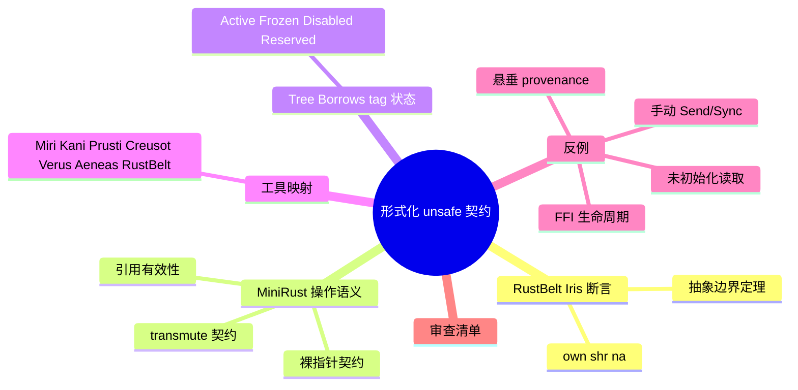

# 形式化视角下的 Unsafe 契约

**EN**: Formalizing Unsafe Contracts in Rust
**Summary**: 从 RustBelt/Iris 分离逻辑、MiniRust 操作语义与 Tree Borrows 别名模型三个视角，形式化 unsafe 代码必须遵守的契约边界，并提供可操作的审查清单与工具映射。

> **Rust 版本**: 1.97.0+ (Edition 2024)
> **Bloom 层级**: L4-L5
> **A/S/P 标记**: **S+P** — Structure + Procedure
> **权威来源**: 本文件为 `concept/` 权威页（unsafe 契约在形式化层的 canonical 入口）。
> **最后更新**: 2026-07-31
>
> **前置概念**: [Unsafe Rust](../../03_advanced/02_unsafe/01_unsafe.md) · [RustBelt 与验证工具链](../02_separation_logic/01_rustbelt.md) · [Tree Borrows 深度解析](05_tree_borrows_deep_dive.md) · [MiniRust](../03_operational_semantics/10_minirust.md) · [内存模型](../../03_advanced/02_unsafe/06_memory_model.md)
> **后置概念**: [形式化验证工具生态](../../06_ecosystem/08_formal_verification/02_formal_verification_tools.md) · [Miri](../04_model_checking/08_miri.md) · [Kani](../04_model_checking/09_kani.md) · [Send/Sync 并发语义边界](../07_concurrency_semantics/08_send_sync_semantics.md)
>
> **国际权威来源**:
> [RustBelt — POPL 2018](https://plv.mpi-sws.org/rustbelt/popl18/) ·
> [Iris Project](https://iris-project.org/) ·
> [MiniRust](https://github.com/minirust/minirust) ·
> [Tree Borrows (PLDI 2025)](https://perso.crans.org/vanile/treebor/) ·
> [Stacked Borrows (POPL 2020)](https://plv.mpi-sws.org/rustbelt/stacked-borrows/) ·
> [Rust Reference — Behavior Considered Undefined](https://doc.rust-lang.org/reference/behavior-considered-undefined.html) ·
> [Unsafe Code Guidelines](https://rust-lang.github.io/unsafe-code-guidelines/)

---

## 0. 为什么需要形式化 unsafe 契约？

Rust 的安全保证建立在两条线之上：

1. **编译期**：借用检查器、auto trait、`Send`/`Sync` 推导等静态规则。
2. **运行期/形式化期**：unsafe 代码必须手工满足一组**语义契约**，使得 safe 代码调用它时不会触发 UB。

形式化契约把「不要破坏安全抽象边界」这句口号变成可验证的数学命题：在 Iris 中是 `own(τ, ℓ)` / `shr(κ, ℓ)` / `na(τ, ℓ)`；在 MiniRust 中是内存接口与别名模型状态；在 Tree/Stacked Borrows 中是 tag 的 Active/Frozen/Disabled 状态。

---

## 1. RustBelt/Iris 视角：契约即逻辑断言

RustBelt 把每个 Rust 类型解释成 Iris 分离逻辑中的**语义模型**。unsafe 代码的正确性等价于：其实现前后保持这些断言不变。

| 断言 | 直觉含义 | 违反后果 |
|---|---|---|
| `own(τ, ℓ)` | 位置 `ℓ` 独占拥有类型 `τ` 的值 | use-after-move、double-free |
| `shr(κ, ℓ)` | 在生命周期 `κ` 内共享只读访问 `ℓ` | 数据竞争、通过 `&T` 写 |
| `na(τ, ℓ)` | `UnsafeCell` 的非原子独占权限 | 内部可变性绕过同步 |

### 1.1 典型 unsafe 契约：Cell::get

```text
{ own(Cell<T>, ℓ) }  Cell::get(&ℓ)  { ret == ℓ.value * own(Cell<T>, ℓ) }
```

`Cell::get` 接收共享引用 `&Cell<T>`，但在 Iris 中对应的是 `na` 非原子权限：调用者仍然独占该 `Cell` 的访问权，因此共享引用不会导致数据竞争。

### 1.2 抽象边界定理

RustBelt 的核心定理可概括为：

```text
若所有 unsafe 库实现都满足其 Iris 协议，
则任意良类型的 safe Rust 程序 ⟹ 无 use-after-free、无数据竞争、无未定义行为。
```

这意味着 **unsafe 不是关闭检查器，而是把证明责任从编译器转移到程序员**。

---

## 2. MiniRust 视角：契约即操作语义规则

MiniRust 把 unsafe 契约表达为抽象机的一步转移条件。常见契约包括：

| 操作 | 契约条件 | 违反即 UB |
|---|---|---|
| 解引用裸指针 | 指针 provenance 有效、对齐、指向已初始化内存 | 悬垂/未对齐/未初始化读取 |
| 创建 `&mut T` | 保证 `T` 在引用生命周期内独占可变 | 别名可变访问 |
| 创建 `&T` | 保证 `T` 在生命周期内只读有效 | 中间被可变破坏 |
| `transmute` | 源与目标类型大小相同、目标解释合法 | 类型混淆 |
| `Box::from_raw` | 指针来自同一次 `Box::into_raw` | double-free |

---

## 3. Tree Borrows 视角：契约即 tag 权限状态

Tree Borrows 给每个引用/裸指针分配一个 tag，unsafe 代码必须保证：

- 读写时使用的 tag 处于 **Active**（写）或 **Active/Frozen**（读）。
- 不通过 **Disabled** tag 访问内存。
- 父子关系清晰：子借用存活期间，父指针的写会触发冲突。

```rust,ignore
// 违反 Tree Borrows 的 unsafe 模式
let mut x = 0;
let r1 = &mut x;          // tag t0
let raw = r1 as *mut i32;
let r2 = unsafe { &mut *raw }; // tag t1，t0 的子
unsafe {
    *raw = 1;             // 通过父指针 t0 写，但子 t1 仍存活 ⟹ UB
    let _ = *r2;
}
```

---

## 4. 形式化工具如何检查 unsafe 契约

| 工具 | 方法 | 覆盖的契约类型 | 局限 |
|---|---|---|---|
| **Miri** | 解释执行 + Tree Borrows | 别名、初始化、对齐、provenance | 路径覆盖有限 |
| **Kani** | 有界模型检查 | 无 panic、断言、部分并发属性 | 不直接建模 Tree Borrows |
| **Prusti** | 分离逻辑 + Viper | 前置/后置条件、循环不变式 | 主要覆盖 safe Rust |
| **Creusot** | Why3 + 预言变量 | 功能正确性、可变借用 | 需手工写契约 |
| **Verus** | SMT + 线性幽灵类型 | 系统代码、并发 | 学习曲线陡峭 |
| **Aeneas** | LLBC 翻译到 Coq/Lean | 函数式等价 | 不支持内部可变性/unsafe |
| **RustBelt/RefinedRust** | Coq/Rocq 机械证明 | 完整语义安全 | 专家级工作量 |

> **Patina**（Reed 2015）是 Rust 早期（pre-1.0）的形式语义尝试，聚焦所有权与唯一指针；虽然语言已大幅演进，但它奠定了后续 RustBelt、Oxide、MiniRust 等工作的基础。 (Source: [Patina: A Formalization of the Rust Programming Language](https://dada.cs.washington.edu/research/tr/2015/03/UW-CSE-15-03-02.pdf))

---

## 5. 反例：常见 unsafe 契约违反

### 5.1 错误的手动 `Send`/`Sync` impl

```rust,ignore
use std::rc::Rc;
use std::thread;

struct Bad(Rc<i32>);
unsafe impl Send for Bad {}

fn main() {
    let b = Bad(Rc::new(0));
    thread::spawn(move || { let _ = b.0; });
}
```

`Rc` 使用非原子引用计数；手动 `impl Send` 把证明责任从编译器夺走，但实际仍会造成数据竞争。

### 5.2 `MaybeUninit` 过早 `assume_init`

```rust,ignore
use std::mem::MaybeUninit;

fn main() {
    let x: MaybeUninit<i32> = MaybeUninit::uninit();
    let _ = unsafe { x.assume_init() }; // 读取未初始化内存：UB
}
```

### 5.3 通过整数重建悬垂指针

```rust,ignore
fn main() {
    let v = vec![1, 2, 3];
    let addr = v.as_ptr() as usize;
    drop(v);
    let ptr = addr as *const i32;
    unsafe { let _ = *ptr; } // provenance 失效：UB
}
```

### 5.4 FFI 调用违反生命周期假设

```rust,ignore
use std::ffi::CString;

unsafe fn bad_ffi() -> *const i8 {
    let s = CString::new("tmp").unwrap();
    s.as_ptr() // 返回局部变量指针：悬垂
}
```

---

## 6. 审查清单

对任何包含 unsafe 的模块，按以下清单逐项确认：

1. **所有权**：每次 `Box::into_raw`/`from_raw`、`ManuallyDrop`、`mem::forget` 是否配平？
2. **别名**：是否存在 `&mut` 与裸指针/共享引用同时可变访问同一块内存？在 Miri 下是否通过？
3. **初始化**：所有通过 `assume_init`/`as_mut_ptr` 读取的值是否已完整写入？
4. **对齐与 provenance**：裸指针是否来自有效分配？转换到整数后是否尝试恢复？
5. **并发边界**：手动 `Send`/`Sync` impl 是否真的没有共享可变状态？
6. **FFI**：外部函数是否遵守 Rust 的调用约定与生命周期？
7. **工具验证**：至少运行一次 `cargo miri test`；关键不变量可补充 Kani/Creusot/Verus 证明。

---

## 7. 国际权威来源

- **RustBelt**: Jung et al., *RustBelt: Securing the Foundations of the Rust Programming Language*, POPL 2018 · [项目页](https://plv.mpi-sws.org/rustbelt/popl18/) · [DOI](https://doi.org/10.1145/3158154)
- **Iris**: Jung et al., *Iris from the Ground Up*, JFP 2018 · [iris-project.org](https://iris-project.org/)
- **MiniRust**: [github.com/minirust/minirust](https://github.com/minirust/minirust)
- **Tree Borrows**: Villani et al., *Tree Borrows*, PLDI 2025 · [项目页](https://perso.crans.org/vanile/treebor/)
- **Stacked Borrows**: Jung et al., *Stacked Borrows: An Aliasing Model for Rust*, POPL 2020 · [项目页](https://plv.mpi-sws.org/rustbelt/stacked-borrows/)
- **Patina**: Reed, *Patina: A Formalization of the Rust Programming Language*, UW-CSE 2015 · [PDF](https://dada.cs.washington.edu/research/tr/2015/03/UW-CSE-15-03-02.pdf)
- **Rust Reference — UB**: [Behavior Considered Undefined](https://doc.rust-lang.org/reference/behavior-considered-undefined.html)
- **Unsafe Code Guidelines**: [rust-lang.github.io/unsafe-code-guidelines](https://rust-lang.github.io/unsafe-code-guidelines/)
- **Kani**: [model-checking.github.io/kani](https://model-checking.github.io/kani/)
- **Creusot**: [creusot.rs](https://creusot.rs/)
- **Prusti**: [ETH Zurich Prusti](https://www.pm.inf.ethz.ch/research/prusti.html) · [GitHub](https://github.com/viperproject/prusti-dev)
- **Verus**: [verus-lang/verus](https://github.com/verus-lang/verus) · [SOSP 2024 paper](https://www.chajed.io/papers/verus:sosp2024.pdf)
- **Aeneas**: [AeneasVerif/aeneas](https://github.com/AeneasVerif/aeneas) · [ICFP 2022](https://www.sonho.fr/assets/documents/aeneas.html)

---

## 8. 思维导图


