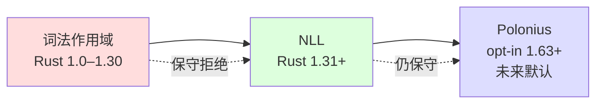

> **内容分级**: [专家级]

# Borrow Checking Decidability（借用检查可判定性）

> **EN**: Borrow Checking Decidability
> **Summary**: 将 Rust 借用（Borrowing）检查器判定的问题、三代演进（词法作用域 → NLL → Polonius）、核心形式化模型以及可判定性/复杂性直觉，提炼为面向研究者的教学类比。
> **受众**: [研究者]
> ⚠️ **声明**: 本文件使用形式化符号辅助直觉理解，所呈现的“定理/算法/规则”为**教学类比**，非经机器验证的严格数学证明。如需严格形式化验证，请参考 [RustBelt](https://plv.mpi-sws.org/rustbelt/)、[Polonius](https://github.com/rust-lang/polonius)、[RFC 2094](https://rust-lang.github.io/rfcs/2094-nll.html)。
> **Bloom 层级**: 分析 → 评价
> **A/S/P 标记**: **F+P** — Formal + Procedure
> **双维定位**: F×Algo — 形式化方法与算法可判定性
> **前置依赖**: [L1 借用（Borrowing）](../../01_foundation/01_ownership_borrow_lifetime/02_borrowing.md) · L3 NLL 与 Polonius · [L4 所有权（Ownership）形式化](03_ownership_formal.md)
> **后置延伸**: [L4 RustBelt](../02_separation_logic/04_rustbelt.md) · [L4 类型检查与推断](../00_type_theory/27_type_checking_and_inference.md) · [L4 树借用（Borrowing）](36_tree_borrows_deep_dive.md)
> 本文内容来自已归档的 `docs/rust-ownership-decidability/04-decidability-analysis/04-02-borrow-checking.md`，经提炼后迁移。
> **来源**: [RFC 2094 — NLL](https://rust-lang.github.io/rfcs/2094-nll.html) · [Polonius Repository](https://github.com/rust-lang/polonius) · [Rustc Dev Guide — Borrow Check](https://rustc-dev-guide.rust-lang.org/borrow_check.html) · [The Rust Programming Language](https://doc.rust-lang.org/book/ch04-00-understanding-ownership.html) · [Brown University — Interactive Rust Book](https://rust-book.cs.brown.edu/) · [Itanium C++ ABI](https://itanium-cxx-abi.github.io/cxx-abi/abi.html)
> **前置概念**: N/A
> **后置概念**: N/A
---

---

> **过渡**: 从 Borrow Checking Decidability（借 的直观描述转向其形式化定义，需要先把日常经验中的模糊直觉转化为可验证的术语。

> **过渡**: 在建立 Borrow Checking Decidability（借 的核心命题之后，下一步是审视这些命题在边界条件下的稳定性——这正是反命题与反例的价值所在。

> **过渡**: 最后，将 Borrow Checking Decidability（借 与相邻概念连接，形成从 L1 到 L7 的纵向认知路径，避免孤立记忆。

---

> **定理 1** [Tier 2]: Borrow Checking Decidability（借 的核心约束 ⟹ 编译器可以在编译期排除一整类运行时（Runtime）错误。
>
> **定理 2** [Tier 2]: 正确理解 Borrow Checking Decidability（借 的语义 ⟹ 开发者能够写出既安全又零成本抽象（Zero-Cost Abstraction）的代码。
>
> **定理 3** [Tier 3]: 将 Borrow Checking Decidability（借 与 Rust 的所有权（Ownership）/生命周期（Lifetimes）模型结合 ⟹ 可以在更大系统中进行可扩展的推理。

---

## 反命题决策树

> **反命题 1**: "Borrow Checking Decidability（借 在所有场景下都适用" ⟹ 不成立。存在特定的边界条件（如 `unsafe`、FFI、递归类型）会使常规推理失效。

> **反命题 2**: "忽略 Borrow Checking Decidability（借 的细节也能写出正确代码" ⟹ 不成立。编译错误通常是 Borrow Checking Decidability（借 规则被违反的直接信号。

> **反命题 3**: "其他语言对 Borrow Checking Decidability（借 的处理方式可以直接迁移到 Rust" ⟹ 不成立。Rust 的所有权（Ownership）和借用（Borrowing）约束使 Borrow Checking Decidability（借 具有语言特有的形态。

## 零、认知路径（Cognitive Path）

```text
借用检查器在判定什么？
        ↓
三代演进如何改变可接受程序的边界？
        ↓
如何用区域约束 + 路径状态形式化借用规则？
        ↓
NLL 的数据流分析与 Polonius 的 Datalog 视角如何统一？
        ↓
为什么借用检查是“可判定的”，但“P-完全”？
        ↓
这些抽象如何落到 rustc 的 rustc_borrowck / Polonius crate？
```

1. **判定目标**：拒绝可变/共享冲突、悬垂引用（Reference）、数据竞争。
2. **演进主线**：词法作用域 → NLL（基于使用点） → Polonius（基于约束传播），可接受程序集合单调扩大。
3. **形式化直觉**：生命周期（Lifetimes） `'a` 是 CFG 上的路径集合；约束可满足 ↔ 引用（Reference）使用点位于被引用值存活区域内。
4. **算法可判定性**：有限状态 + 单调闭包（Closures） → NLL/Polonius/区域求解均收敛。
5. **复杂性边界**：借用（Borrowing）检查是 P-完全的——多项式时间，但难以高效并行化到 NC。

---

## 一、借用检查器判定什么（What Borrow Checking Decides）

Rust 借用（Borrowing）检查器在编译期回答一个**安全判定问题** (Source: [Rustc Dev Guide — Borrow Check](https://rustc-dev-guide.rust-lang.org/borrow_check.html))：

> 给定 Safe Rust 程序，是否存在执行路径使得引用（Reference）在使用时指向已释放或非法改写的内存？

它维护三条不变式：

| 不变式 | 直觉 | 典型错误 |
|:---|:---|:---|
| **唯一可变 / 任意共享** | 同一路径上，要么一个 `&mut`，要么任意多个 `&` | E0502 |
| **无悬垂引用（Reference）** | 引用生命周期（Lifetimes） ≤ 被引用值存活区域 | E0597 |
| **无数据竞争** | 并发访问受 `Send`/`Sync` + 借用（Borrowing）规则约束 | E0626 |

> **教学类比**：借用（Borrowing）检查器是保守的静态过滤器——sound but incomplete：会误判一些安全程序，但不会放过不安全程序。

---

## 二、历史演进：三代借用检查器



### 2.1 词法作用域（Lexical Scopes）

借用（Borrowing）生命周期（Lifetimes）绑定到词法块边界，线性扫描 $O(n)$，但过度保守。

```rust
fn lexical_problem() {
    let mut data = vec![1, 2, 3];
    let x = &data[0];
    println!("{}", x);   // x 最后一次使用
    data.push(4);        // ✅ NLL 之后可编译
}
```

### 2.2 NLL（Non-Lexical Lifetimes）

生命周期（Lifetimes）由“创建点 → 最后一次使用点”定义，基于 MIR 与 CFG 数据流分析。 (Source: [RFC 2094 — NLL](https://rust-lang.github.io/rfcs/2094-nll.html))

```rust
fn nll_allows() {
    let mut s = String::from("hello");
    let r = &s;
    println!("{}", r);   // r 实际生命结束
    drop(s);             // ✅ NLL：s 可被 move
}
```

### 2.3 Polonius

以 Datalog 风格将借用检查表达为约束传播，可处理 NLL 拒绝的部分安全模式（条件借用、循环内精确分析）。`-Zpolonius` 在 nightly 可用，被视为未来默认路线。 (Source: [Polonius Repository](https://github.com/rust-lang/polonius))

```rust
fn polonius_friendly(flag: bool, data: &mut [i32]) -> &mut i32 {
    if flag { &mut data[0] } else { &mut data[1] }
}
```

---

## 三、形式化模型（Teaching Analogies）

### 3.1 区域约束系统（Region Constraints）

把生命周期（Lifetimes） `'a` 形式化为 CFG 上的**路径集合** $\rho$：

```text
区域变量 : ρ, ρ₁, ρ₂ ∈ Region
区域约束 : C ::= ρ₁ ⊆ ρ₂  |  ρ = ρ₂  |  ρ: liveness(p)  |  C₁ ∧ C₂
```

$$
\rho_1 \subseteq \rho_2 \iff \forall \pi \in \rho_1.\ \pi \in \rho_2
$$

> **直觉**：`ρ_ref ⊆ ρ_own` 表示引用（Reference）所有可能执行路径都在被引用值存活路径之内。

### 3.2 路径与借用状态（Paths & Borrow States）

**路径**：$\pi ::= x \mid \pi.f \mid \pi[i] \mid *\pi$

在某个程序点 $p$，路径 $\pi$ 的借用状态属于有限格：

$$
\text{State}(\pi, p) \in \{\text{Free},\ \text{Shared},\ \text{Mut}(\rho),\ \text{Reserved}\}
$$

| 状态 | 含义 |
|:---|:---|
| **Free** | 无借用，可读写 |
| **Shared** | 共享借用 `&`，只读，可再共享 |
| **Mut($\rho$)** | 可变借用（Mutable Borrow） `&mut`，在区域 $\rho$ 内独占 |
| **Reserved** | 两阶段借用的预留态 |

### 3.3 借用规则（Borrow Rules）

对任意程序点 $p$ 与路径 $\pi$：

1. **共享借用规则**：
   $$
   \text{State}(\pi, p) = \text{Shared} \Rightarrow \forall \pi' \sqsubseteq \pi.\ \text{State}(\pi', p) \neq \text{Mut}
   $$
2. **可变借用（Mutable Borrow）规则**：
   $$
   \text{State}(\pi, p) = \text{Mut}(\rho) \Rightarrow \forall \pi' \sqsubseteq \pi.\ \text{State}(\pi', p) = \text{Free}
   $$
3. **两阶段借用规则**：`Reserved` 后续可能升级为 `Mut`，期间禁止新冲突借用。

> **教学类比**：这些公式是“`&mut` 独占、`&` 可多但只读”的数学速写，非 rustc 源码。

---

## 四、NLL：数据流分析 + 约束求解

### 4.1 数据流方程

对 MIR 每个基本块 $B$：

$$
\begin{aligned}
\text{OUT}[B] &= (\text{IN}[B] \setminus \text{KILL}[B]) \cup \text{GEN}[B] \\
\text{IN}[B] &= \bigcap_{P \in \text{pred}(B)} \text{OUT}[P]
\end{aligned}
$$

借用状态是**有限格**，转换函数单调，迭代必收敛到不动点。

### 4.2 区域约束求解

区域约束 $\rho_i \subseteq \rho_j$ 编码为有向图：

```text
顶点 V = {所有区域} ∪ {'static'}
边   E = {(ρᵢ, ρⱼ) | ρᵢ ⊆ ρⱼ ∈ C}
```

约束可满足 ⟺ 图中不存在非 `'static` 的矛盾环。

```rust,ignore
// 概念示意
fn solve_region_constraints(cs: &[Constraint]) -> Result<Solution, RegionError> {
    let g = build_graph(cs);
    check_contradictory_cycles(&transitive_closure(&g))
}
```

> **复杂度直觉**：传递闭包（Closures） $O(n^3)$，矩阵乘法可优化至 $O(n^\omega)$，$\omega < 2.373$。

---

## 五、Polonius：Datalog 视角

Polonius 把借用检查重述为**事实 + 规则 + 不动点查询**。

### 5.1 核心事实与规则

```prolog
% 事实
borrow_region(B, R).      % 借用 B 的区域是 R
region_live_at(R, P).     % 区域 R 在程序点 P 活跃
borrow_live_at(B, P).     % 借用 B 在程序点 P 活跃
paths_overlap(P1, P2).    % 两路径可能重叠

% 规则：借用在其区域活跃时活跃
borrow_live_at(B, P) :- borrow_region(B, R), region_live_at(R, P).

% 规则：区域包含传递闭包
region_contains(R1, R2) :- base_constraint(R1, R2).
region_contains(R1, R2) :- region_contains(R1, R3), region_contains(R3, R2).

% 错误：对活跃共享借用做可变访问
error(P, B) :-
    access_mutable(P, Path),
    borrow_live_at(B, P),
    borrow_kind(B, shared),
    paths_overlap(Path, borrow_path(B)).

% 错误：对活跃可变借用做任何访问
error(P, B) :-
    access_any(P, Path),
    borrow_live_at(B, P),
    borrow_kind(B, mut),
    paths_overlap(Path, borrow_path(B)).
```

### 5.2 与 NLL 的关系

```mermaid
flowchart TB
    subgraph NLL_Phase["NLL"]
        mir[MIR] --> df[数据流分析] --> rs[区域约束求解]
    end
    subgraph Polonius_Phase["Polonius"]
        facts[提取事实] --> engine[Datalog 引擎] --> fp[不动点] --> query[查询 error(P,B)]
    end
    NLL_Phase -.->|扩展| Polonius_Phase
```

> **核心洞察**：NLL 的区域活跃性与借用冲突检测可统一编码为 Polonius 事实；Polonius 约束传播更细粒度，能识别 NLL 误判的安全程序。

---

## 六、可判定性与复杂性

### 6.1 终止性（Termination）

| 算法 | 终止依据 |
|:---|:---|
| **NLL** | 借用状态为有限格 + 单调数据流 → Knaster-Tarski 不动点 |
| **Polonius** | 有限事实集 + 单调增长 → Datalog 半朴素求值收敛 |
| **区域求解** | 图传递闭包（Closures）在有限顶点上终止 |

> **教学类比**：可判定性来自“状态空间有限 + 每步只增不减”。借用检查不会发明新区域或新借用，只在已有集合上做闭包（Closures）。

### 6.2 正确性直觉（Correctness Intuition）

- **Soundness**：检查通过 ⟹ 无 UAF、double-free、数据竞争。
- **Completeness**：不成立；Rust 保守，会拒绝部分安全程序。
- **结构归纳**：对 MIR 各语句保持借用不变式，数据流交汇取保守交集。

### 6.3 P-完全性（P-Completeness）

> **教学类比定理**：借用检查（区域约束满足）是 **P-完全**的。

- **P 成员性**：区域约束可规约为图可达性，多项式时间可解。
- **P-困难性**：可从 AND-OR 图可达性（P-完全）归约。

| 维度 | 含义 |
|:---|:---|
| 好消息 | 借用检查不是 NP-hard，编译器可在合理时间内完成 |
| 坏消息 | P-完全意味着难以被高效并行化到 NC 类，复杂签名可能显著增加编译耗时 |

---

## 七、与 rustc 的对应

| 抽象概念 | rustc 组件 / Crate |
|:---|:---|
| MIR 生成 | `rustc_middle::mir` |
| 借用检查主入口 | `rustc_borrowck` |
| 数据流分析框架 | `rustc_mir_dataflow` |
| 区域约束 / 推断 | `rustc_infer::infer::region_constraints` |
| Polonius 引擎 | [`polonius`](https://github.com/rust-lang/polonius) crate |
| 事实提取 | `rustc_borrowck::consumers` |

```text
源代码 → AST → HIR → typeck → MIR → borrow_check(NLL/Polonius) → codegen
                              ↑
                              └── 区域约束、借用状态、数据流结果在此统一求解
```

> **实践提示**：通过 `RUSTFLAGS=-Zpolonius cargo +nightly build` 体验 Polonius；阅读源码可从 `rustc_borrowck::do_mir_borrowck` 入手。

---

## 八、可运行示例

### 8.1 NLL：最后一次使用点后重新借用

```rust
fn nll_example() {
    let mut data = vec![1, 2, 3];
    let x = &data[0];
    println!("shared: {}", x);   // x 最后一次使用
    data.push(4);                 // ✅ NLL：可变借用合法
    println!("{:?}", data);
}
```

### 8.2 可变借用的独占性

```rust
fn mut_exclusive() {
    let mut x = 42;
    let r1 = &mut x;
    // let r2 = &mut x; // ❌ E0499：不能同时存在两个可变借用
    *r1 += 1;
    println!("{}", r1);          // r1 最后一次使用
    let r2 = &mut x;              // ✅ r1 实际结束
    *r2 += 1;
    println!("{}", r2);
}
```

### 8.3 共享与可变不能共存

```rust
fn shared_vs_mut() {
    let mut v = vec![1, 2, 3];
    let r = &v[0];
    println!("{}", r);            // r 最后一次使用
    v.push(4);                    // ✅ r 已不使用
    println!("{:?}", v);
}
```

### 8.4 两阶段借用

```rust
fn two_phase_borrow() {
    let mut v = vec![1, 2, 3];
    v.push(v.len());              // ✅ 先预留 &mut v，再读取 v.len()
    println!("{:?}", v);
}
```

---

## 九、要点回顾

| 要点 | 一句话总结 |
|:---|:---|
| 判定目标 | 拒绝可变/共享冲突、悬垂引用（Reference）、数据竞争 |
| 演进 | 词法作用域 → NLL（基于使用点） → Polonius（基于约束传播） |
| 形式化 | 区域 = CFG 路径集合；借用状态 = 路径上的有限格 |
| NLL | 数据流分析 + 区域约束图求解 |
| Polonius | 事实/规则/不动点的 Datalog 视角，扩展 NLL |
| 可判定性 | 有限状态 + 单调闭包（Closures） → 必然终止 |
| 复杂性 | P-完全：多项式时间，但难以高效并行 |
| rustc 落地 | `rustc_borrowck` / `rustc_mir_dataflow` / Polonius crate |

---

> **权威来源**: [RFC 2094 — NLL](https://rust-lang.github.io/rfcs/2094-nll.html) · [Polonius](https://github.com/rust-lang/polonius) · [RustBelt — POPL 2018](https://plv.mpi-sws.org/rustbelt/popl18/) · [The Rust Programming Language](https://doc.rust-lang.org/book/ch04-00-understanding-ownership.html) · [Rust Reference — Lifetimes](https://doc.rust-lang.org/reference/items/generics.html) · [Rustonomicon](https://doc.rust-lang.org/nomicon/index.html)
> **权威来源对齐变更日志**: 2026-07-10 补全权威来源标注（Rust Reference、TRPL、Rustonomicon、RFCs、学术论文） [Authority Source Sprint Batch L4](../../00_meta/02_sources/international_authority_index.md)

**文档版本**: 1.0
**对应 Rust 版本**: 1.97.0+ (Edition 2024)
**最后更新**: 2026-07-10
**状态**: ✅ 权威来源对齐完成 (Batch L4)
