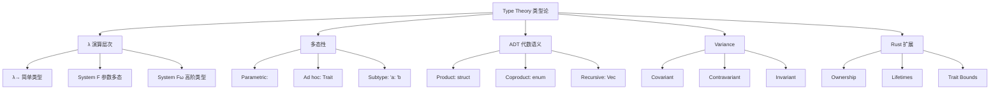

# Type Theory（类型论基础）

> **层级**: L4 形式化理论
> **前置概念**: [Type System](../01_foundation/04_type_system.md) · [Generics](../02_intermediate/02_generics.md)
> **后置概念**: [Ownership Formalization](./03_ownership_formal.md) · [RustBelt](./04_rustbelt.md)
> **主要来源**: [Wikipedia: Type theory] · [Wikipedia: Simply typed lambda calculus] · [Wikipedia: Hindley-Milner type system] · [Rust Reference: Subtyping] · [Rust Reference: Type inference]

---

**变更日志**:

- v1.0 (2026-05-12): 初始版本，完成类型论层次、HM 推断、子类型/Variance、ADT 范畴论语义、思维导图

---

## 一、权威定义（Definition）

### 1.1 Wikipedia 定义

> **[Wikipedia: Type theory]** In mathematics, logic, and computer science, a type theory is any of a class of formal systems, some of which can serve as alternatives to set theory as a foundation for mathematics. In type theory, every term has a "type", and operations are restricted to terms of a certain type.

> **[Wikipedia: Hindley-Milner]** In type theory, Hindley-Milner is a classical type inference method with parametric polymorphism for the lambda calculus. It was first described by J. Roger Hindley and later rediscovered by Robin Milner. The algorithm is commonly named W.

### 1.2 Rust 类型系统定位

Rust 的类型系统是 **Hindley-Milner + 所有权约束 + 子类型（生命周期）** 的扩展：

```text
HM 核心:          Γ ⊢ e : τ  （上下文 Γ 下表达式 e 具有类型 τ）
Rust 扩展:
  Γ; Σ ⊢ e : τ {Σ'}    （Σ = 所有权/借用状态）
  Γ ⊢ 'a <: 'b          （生命周期子类型）
  Γ ⊢ T: Trait          （Trait 约束）
```

---

## 二、概念属性矩阵（Attribute Matrix）

### 2.1 类型论层次矩阵

| **层次** | **系统** | **多态性** | **类型推断** | **Rust 对应** |
|:---|:---|:---|:---|:---|
| **简单类型 λ 演算** | λ→ | 无 | 无 | 无泛型的函数 |
| **参数多态（System F）** | λ2 | ∀α.τ | 无（需显式标注） | `identity::<T>` |
| **HM 类型系统** | ML | let-多态 | ✅ 完备 | 大多数局部推断 |
| **约束类型** | λc | 类型约束 | 部分 | `T: Trait` |
| **依赖类型** | λΠ | 类型依赖值 | 部分 | `const N: usize` |
| **子类型** | λ<: | 子类型关系 | 部分 | `'a: 'b` |
| **线性/仿射** | 线性 λ | 资源敏感 | 部分 | 所有权系统 |

### 2.2 Variance 矩阵

| **Variance** | **语法** | **含义** | **Rust 示例** |
|:---|:---|:---|:---|
| **协变（Covariant）** | `C<T>`: T 向上则 C<T> 向上 | 子类型方向相同 | `&'a T` 对 `'a` 协变 |
| **逆变（Contravariant）** | `C<T>`: T 向上则 C<T> 向下 | 子类型方向相反 | `fn(T)` 的参数 T 逆变 |
| **不变（Invariant）** | `C<T>`: 无子类型关系 | 必须完全匹配 | `&mut T`、`Cell<T>` |
| **双变（Bivariant）** | 任意方向 | 无实际约束 | （Rust 中无） |

### 2.3 Rust 类型的 Variance

| **类型构造器** | **对生命周期** | **对类型参数** |
|:---|:---|:---|
| `&'a T` | `'a`: 协变 | `T`: 协变 |
| `&'a mut T` | `'a`: 协变 | `T`: 不变 |
| `Box<T>` | — | `T`: 协变 |
| `Vec<T>` | — | `T`: 协变 |
| `Cell<T>` | — | `T`: 不变 |
| `fn(T) -> U` | — | `T`: 逆变, `U`: 协变 |
| `*const T` | — | `T`: 协变 |
| `*mut T` | — | `T`: 不变 |

---

## 三、形式化理论根基

### 3.1 ADT 的范畴论语义

```text
Rust 的 enum 对应余积（Coproduct），struct 对应积（Product）:

积类型:
  struct Pair<A, B> { first: A, second: B }
  Pair<A, B> ≅ A × B
  构造: (a, b) : A × B
  消除: fst, snd

余积类型:
  enum Either<A, B> { Left(A), Right(B) }
  Either<A, B> ≅ A + B
  构造: Left(a) : A + B, Right(b) : A + B
  消除: match（case analysis）

单位类型:
  () : 1       （单元素类型）
  ! : 0        （空类型，never）

代数等式:
  Option<A> ≅ 1 + A
  Result<A, E> ≅ A + E
  Vec<A> ≅ μX. 1 + (A × X)   （递归类型: Nil 或 Cons）
```

### 3.2 类型推断算法 W（Hindley-Milner）

```text
算法 W 核心规则:

  [Var]   x:σ ∈ Γ
          ─────────────
          Γ ⊢ x : σ

  [App]   Γ ⊢ e₁ : τ → τ'    Γ ⊢ e₂ : τ
          ───────────────────────────
          Γ ⊢ e₁ e₂ : τ'

  [Abs]   Γ, x:τ ⊢ e : τ'
          ─────────────────
          Γ ⊢ λx.e : τ → τ'

  [Let]   Γ ⊢ e₁ : τ    Γ, x:gen(Γ,τ) ⊢ e₂ : τ'
          ─────────────────────────────────
          Γ ⊢ let x = e₁ in e₂ : τ'

Rust 扩展: 在 [Var] 和 [App] 之间插入所有权检查
```

---

## 四、思维导图



---

## 五、定理推理链

### 5.1 类型安全定理（Type Safety / Progress + Preservation）

```text
Progress:  若 ⊢ e : τ，则 e 是值，或存在 e' 使 e → e'
Preservation: 若 ⊢ e : τ 且 e → e'，则 ⊢ e' : τ

合起来 = "类型良好的程序不会卡住（除非已终止）且保持类型"
Rust 的扩展:
  Ownership-Preservation: 归约保持所有权约束
  Lifetime-Preservation:  归约保持生命周期有效性
```

---

## 六、示例与反例

### 6.1 Variance 示例

```rust
// ✅ 协变: &'static str 可转为 &'a str
fn covariant<'a>(s: &'static str) -> &'a str { s }

// ✅ 逆变: 接受 Animal 的函数可传给需要 Dog 的位置
fn takes_animal(f: fn(Animal)) {}
fn dog_handler(d: Dog) {}
// takes_animal(dog_handler); // ✅ fn(Dog) 是 fn(Animal) 的子类型

// ❌ 不变: &mut T 不能协变
fn invariant<'a, 'b: 'a>(r: &'b mut &'static str) -> &'b mut &'a str {
    r  // ❌ 编译错误: &mut 对生命周期不变
}
```

---

## 七、知识来源关系

| **论断** | **来源** | **可信度** |
|:---|:---|:---|
| HM 类型推断 | [Wikipedia: Hindley-Milner] | ✅ |
| System F 对应泛型 | [Wikipedia: System F] | ✅ |
| ADT 对应积与余积 | [Category Theory for Programmers] | ✅ |
| Variance 规则 | [Rust Reference: Subtyping] | ✅ |
| 类型安全定理 | [Wright-Felleisen 1994] | ✅ |

---

## 八、待补充

- [ ] **TODO**: 补充 Dependent type 与 Const Generics 的关系
- [ ] **TODO**: 补充 Higher-Kinded Types 的缺失与 workaround
