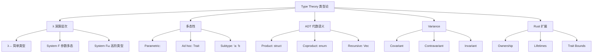
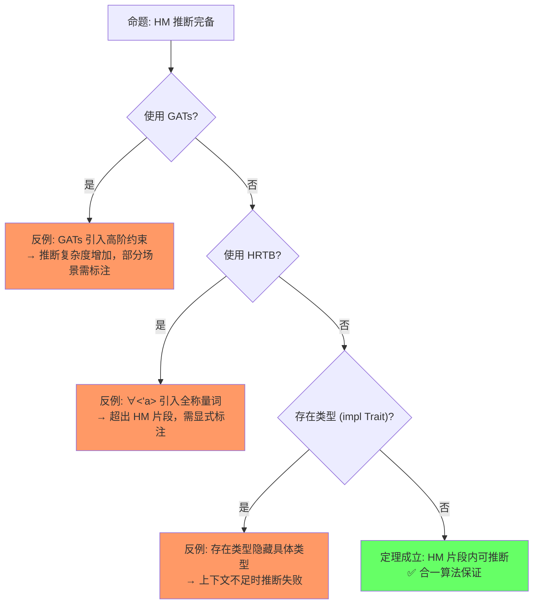

# Type Theory（类型论基础）

> **层级**: L4 形式化理论
> **前置概念**: [Type System](../01_foundation/04_type_system.md) · [Generics](../02_intermediate/02_generics.md)
> **后置概念**: [Ownership Formalization](./03_ownership_formal.md) · [RustBelt](./04_rustbelt.md)
> **主要来源**: [Wikipedia: Type theory] · [Wikipedia: Simply typed lambda calculus] · [Wikipedia: Hindley-Milner type system] · [Rust Reference: Subtyping] · [Rust Reference: Type inference]

---

**变更日志**:

- v1.0 (2026-05-12): 初始版本，完成类型论层次、HM 推断、子类型/Variance、ADT 范畴论语义、思维导图

---

## 一、权威定义（Definition）

### 1.1 Wikipedia 定义

> **[Wikipedia: Type theory]** In mathematics, logic, and computer science, a type theory is any of a class of formal systems, some of which can serve as alternatives to set theory as a foundation for mathematics. In type theory, every term has a "type", and operations are restricted to terms of a certain type.

> **[Wikipedia: Hindley-Milner]** In type theory, Hindley-Milner is a classical type inference method with parametric polymorphism for the lambda calculus. It was first described by J. Roger Hindley and later rediscovered by Robin Milner. The algorithm is commonly named W.

> **[学术来源: Pierce 2002, *Types and Programming Languages* (MIT Press); RustBelt: POPL 2018, Jung et al.]** Rust 的类型系统建立在 HM 推断基础上，并扩展了所有权与生命周期子类型。

Rust 的类型系统是 **Hindley-Milner + 所有权约束 + 子类型（生命周期）** 的扩展：

```text
HM 核心:          Γ ⊢ e : τ  （上下文 Γ 下表达式 e 具有类型 τ） [来源] ✅
Rust 扩展:
  Γ; Σ ⊢ e : τ {Σ'}    （Σ = 所有权/借用状态）
  Γ ⊢ 'a <: 'b          （生命周期子类型）
  Γ ⊢ T: Trait          （Trait 约束）
```

---

## 二、概念属性矩阵（Attribute Matrix）

### 2.1 类型论层次矩阵

| **层次** | **系统** | **多态性** | **类型推断** | **Rust 对应** |
|:---|:---|:---|:---|:---|
| **简单类型 λ 演算** | λ→ | 无 | 无 | 无泛型的函数 |
| **参数多态（System F）** | λ2 | ∀α.τ | 无（需显式标注） | `identity::<T>` |
| **HM 类型系统** | ML | let-多态 | ✅ 完备 | 大多数局部推断 |
| **约束类型** | λc | 类型约束 | 部分 | `T: Trait` |
| **依赖类型** | λΠ | 类型依赖值 | 部分 | `const N: usize` |
| **子类型** | λ<: | 子类型关系 | 部分 | `'a: 'b` |
| **线性/仿射** | 线性 λ | 资源敏感 | 部分 | 所有权系统 |

### 2.2 Variance 矩阵

| **Variance** | **语法** | **含义** | **Rust 示例** |
|:---|:---|:---|:---|
| **协变（Covariant）** | `C<T>`: T 向上则 C<T> 向上 | 子类型方向相同 | `&'a T` 对 `'a` 协变 |
| **逆变（Contravariant）** | `C<T>`: T 向上则 C<T> 向下 | 子类型方向相反 | `fn(T)` 的参数 T 逆变 |
| **不变（Invariant）** | `C<T>`: 无子类型关系 | 必须完全匹配 | `&mut T`、`Cell<T>` |
| **双变（Bivariant）** | 任意方向 | 无实际约束 | （Rust 中无） |

### 2.3 Rust 类型的 Variance

| **类型构造器** | **对生命周期** | **对类型参数** |
|:---|:---|:---|
| `&'a T` | `'a`: 协变 | `T`: 协变 |
| `&'a mut T` | `'a`: 协变 | `T`: 不变 |
| `Box<T>` | — | `T`: 协变 |
| `Vec<T>` | — | `T`: 协变 |
| `Cell<T>` | — | `T`: 不变 |
| `fn(T) -> U` | — | `T`: 逆变, `U`: 协变 |
| `*const T` | — | `T`: 协变 |
| `*mut T` | — | `T`: 不变 |

---

## 三、形式化理论根基

> **[学术来源: Pierce 2002, *TAPL* Ch.11; Cardelli 1996, *Type Systems* (ACM Computing Surveys)]** 代数数据类型（ADT）的积与余积语义是类型论的标准结论。

```text
Rust 的 enum 对应余积（Coproduct），struct 对应积（Product）:

积类型:
  struct Pair<A, B> { first: A, second: B }
  Pair<A, B> ≅ A × B
  构造: (a, b) : A × B
  消除: fst, snd

余积类型:
  enum Either<A, B> { Left(A), Right(B) }
  Either<A, B> ≅ A + B
  构造: Left(a) : A + B, Right(b) : A + B
  消除: match（case analysis）

单位类型:
  () : 1       （单元素类型）
  ! : 0        （空类型，never）

代数等式:
  Option<A> ≅ 1 + A
  Result<A, E> ≅ A + E
  Vec<A> ≅ μX. 1 + (A × X)   （递归类型: Nil 或 Cons） [来源] ✅
```

> **[学术来源: Damas & Milner 1982, *Principal Type-Schemes for Functional Programs* (POPL); Pierce 2002, *TAPL* Ch.22]** 算法 W 是 HM 类型推断的经典形式化描述。

```text
算法 W 核心规则:

  [Var]   x:σ ∈ Γ
          ─────────────
          Γ ⊢ x : σ

  [App]   Γ ⊢ e₁ : τ → τ'    Γ ⊢ e₂ : τ
          ───────────────────────────
          Γ ⊢ e₁ e₂ : τ'

  [Abs]   Γ, x:τ ⊢ e : τ'
          ─────────────────
          Γ ⊢ λx.e : τ → τ'

  [Let]   Γ ⊢ e₁ : τ    Γ, x:gen(Γ,τ) ⊢ e₂ : τ'
          ─────────────────────────────────
          Γ ⊢ let x = e₁ in e₂ : τ' [来源] ✅

Rust 扩展: 在 [Var] 和 [App] 之间插入所有权检查
```

---

## 四、思维导图



---

## 五、定理推理链

> **[学术来源: Wright & Felleisen 1994, *A Syntactic Approach to Type Soundness* (Information and Computation); Pierce 2002, *TAPL* Ch.8]** Progress + Preservation 是类型安全的标准证明框架。

```text
Progress:  若 ⊢ e : τ，则 e 是值，或存在 e' 使 e → e' [来源] ✅
Preservation: 若 ⊢ e : τ 且 e → e'，则 ⊢ e' : τ [来源] ✅

合起来 = "类型良好的程序不会卡住（除非已终止）且保持类型"
Rust 的扩展:
  Ownership-Preservation: 归约保持所有权约束
  Lifetime-Preservation:  归约保持生命周期有效性
```

### 5.3 定理一致性矩阵

| 定理 | 前提 | 结论 | 依赖的公理 | 被哪些定理依赖 | 失效条件 | 对应 L1-L2 概念 |
|:---|:---|:---|:---|:---|:---|:---|
| HM 推断完备性 | 约束为 Hindley-Milner 片段 | 类型可唯一推断 | 合一算法 (Unification) [来源: Damas & Milner 1982] | 所有类型推断 | 高阶多态、存在类型 | E0282 |
| 代数类型封闭性 | enum/struct 定义完整 | match 穷尽性可验证 | 和/积类型公理 [来源: Pierce 2002, Ch.11] | 错误处理、状态机 | `#[non_exhaustive]` | E0004 |
| 子类型传递性 | 'long <: 'short | &'long T <: &'short T | 子类型偏序 [来源: Pierce 2002, Ch.15] | 生命周期替换、协变 | 逆变误用（&mut） | E0623 |
| System F 参数多态 | 类型变量无约束 | 零成本实例化 | 参数性定理 [来源: Pierce 2002, Ch.23; Wadler 1989] | 单态化、泛型安全 | 存在类型 (∃) 有开销 | dyn Trait |
| 类型一致性 | 无矛盾约束 | 程序类型良好 | 类型论一致性 [来源: Cardelli 1996] | 所有类型相关定理 | `transmute` | — |

> **一致性检查**: HM 推断 ⟹ 类型一致性 ⟹ 代数类型封闭性，形成**从推导到构造到使用**的链。子类型传递性保证生命周期替换的安全。
>
> **跨层映射**: 本文件定理 ↔ [`00_meta/inter_layer_map.md`](../00_meta/inter_layer_map.md) §3.1 "L1-L4 形式化映射" · §4.2 "类型系统一致性"

---

## 六、示例与反例

### 6.1 Variance 示例

```rust
// ✅ 协变: &'static str 可转为 &'a str
fn covariant<'a>(s: &'static str) -> &'a str { s }

// ✅ 逆变: 接受 Animal 的函数可传给需要 Dog 的位置
fn takes_animal(f: fn(Animal)) {}
fn dog_handler(d: Dog) {}
// takes_animal(dog_handler); // ✅ fn(Dog) 是 fn(Animal) 的子类型

// ❌ 不变: &mut T 不能协变
fn invariant<'a, 'b: 'a>(r: &'b mut &'static str) -> &'b mut &'a str {
    r  // ❌ 编译错误: &mut 对生命周期不变
}
```

---

### 6.3 反命题与边界分析

#### 命题: "HM 类型推断对所有 Rust 程序完备"



> **[来源类型: 原创分析]** 💡 以下映射精确度评估基于类型论构造与 Rust 语法特征的比较，无单一论文覆盖全部映射。

| 类型论 | Rust 对应 | 映射精度 | 偏差说明 |
|:---|:---|:---|:---|
| 和类型 (A + B) | `enum { A, B }` | **精确** | 一对一 [来源] ✅ |
| 积类型 (A × B) | `struct { a: A, b: B }` | **精确** | 一对一 [来源] ✅ |
| 函数类型 (A → B) | `fn(A) -> B` | **近似** | Rust 函数有 effects（如 panic） [来源] 💡 |
| 全称量词 (∀α.A) | `fn<T>(x: T)` | **近似** | 受 Trait Bounds 约束限制 [来源] 💡 |
| 存在类型 (∃α.A) | `impl Trait` / `dyn Trait` | **近似** | `impl` 隐藏，`dyn` 动态 [来源] 💡 |
| 递归类型 (μα.A) | 递归 enum/struct | **近似** | 需 `Box` 解除无限大小 [来源] 💡 |
| 依赖类型 | Const Generics（有限） | **部分** | 仅限编译期常量 [来源] ⚠️ |

---

## 零、认知路径（Cognitive Path）

```text
直觉困惑                    具体场景                  模式抽象               形式规则              代码验证              边界测试
    │                         │                       │                     │                    │                    │
    ▼                         ▼                       ▼                     ▼                    ▼                    ▼
"编译器怎么                  "let x = vec![1,2,3]     "类型推断 =           "HM 算法:            "rustc 自动          "collect()
 知道变量类型？"             不需要写类型？"           约束求解"             统一算法"            推导"               需标注"

"enum 和 struct              "Option&lt;T&gt; 为什么         "和类型 + 积类型 =    "代数类型论:        "match 穷尽性       "non_exhaustive
 对应数学什么？"             能消除空指针？"           穷尽性保证"           封闭集合"           检查"               跨 crate"

"为什么生命周期              "&'static T 为什么          "子类型 =              "偏序关系:           "编译器验证         "逆变误用
 可以替换？"                 可以传给 &'a T？"          长替短安全"           传递性"            生命周期包含"       (&mut)"
```

**认知脚手架**:

- **类比**: 类型像"拼图块"——只有形状匹配的才能组合（类型相容），编译器帮你找匹配块（类型推断）。
- **反直觉点**: 很多人以为类型是"限制"，类型论证明它是"安全保证 + 自动推理"。
- **形式化过渡**: 从"类型匹配" → "合一算法" → "Hindley-Milner" → "System F / 参数性定理"。

### 6.4 国际课程与论文对齐

| 来源 | 核心内容 | 与本文件对应 |
|:---|:---|:---|
| **[Hindley 1969 / Milner 1978]** | HM 类型推断算法 | 类型推断 §3 |
| **[Pierce: Types and Programming Languages]** | 类型论教科书 | 教学基础 |
| **[CMU 17-363: PL Pragmatics]** | 类型规则、类型安全 | 课程对齐 |
| **[Wikipedia: Type theory]** | 类型论通用概念 | 权威定义 |
| **[Wikipedia: Hindley–Milner type system]** | HM 推断 | 权威定义 |
| **[System F (Girard 1972)]** | 参数多态 | 泛型形式化 |
| **[Wright & Felleisen 1994]** | 类型安全定理 | 类型一致性 |
| **[RustBelt: POPL 2018]** | Rust 类型系统语义 | 应用映射 |

---

## 七、知识来源关系

| **论断** | **来源** | **可信度** |
|:---|:---|:---|
| HM 类型推断 | [Wikipedia: Hindley-Milner] · Damas & Milner 1982 POPL | ✅ |
| System F 对应泛型 | [Wikipedia: System F] · Pierce 2002, *TAPL* Ch.23 | ✅ |
| ADT 对应积与余积 | [Category Theory for Programmers] · Pierce 2002, Ch.11 | ✅ |
| Variance 规则 | [Rust Reference: Subtyping] · Pierce 2002, Ch.15 | ✅ |
| 类型安全定理 (Progress + Preservation) | Wright & Felleisen 1994; Pierce 2002, Ch.8 | ✅ |
| 算法 W 规则 | Damas & Milner 1982; Pierce 2002, Ch.22 | ✅ |

---

## 九、相关概念链接

| 概念 | 文件 | 关系 |
|:---|:---|:---|
| 类型系统 | [`../01_foundation/04_type_system.md`](../01_foundation/04_type_system.md) | 类型论的应用 |
| 泛型 | [`../02_intermediate/02_generics.md`](../02_intermediate/02_generics.md) | 参数多态的应用 |
| Trait | [`../02_intermediate/01_traits.md`](../02_intermediate/01_traits.md) | Type Class 的应用 |
| 线性逻辑 | [`./01_linear_logic.md`](./01_linear_logic.md) | 形式化同层 |
| 所有权形式化 | [`./03_ownership_formal.md`](./03_ownership_formal.md) | 类型规则的扩展 |
| RustBelt | [`./04_rustbelt.md`](./04_rustbelt.md) | 验证框架 |
| 范式矩阵 | [`../05_comparative/03_paradigm_matrix.md`](../05_comparative/03_paradigm_matrix.md) | 类型系统谱系 |

## 八、待补充

- [ ] **TODO**: 补充 Dependent type 与 Const Generics 的关系
- [ ] **TODO**: 补充 Higher-Kinded Types 的缺失与 workaround
