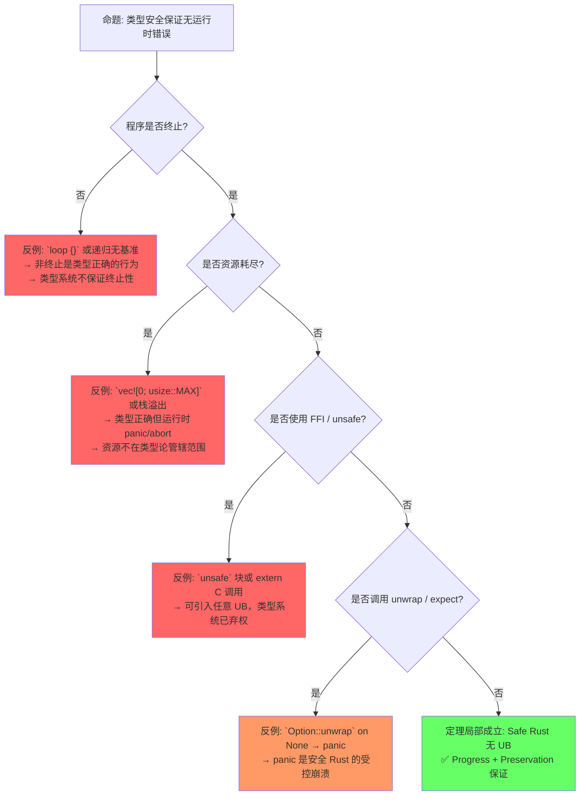
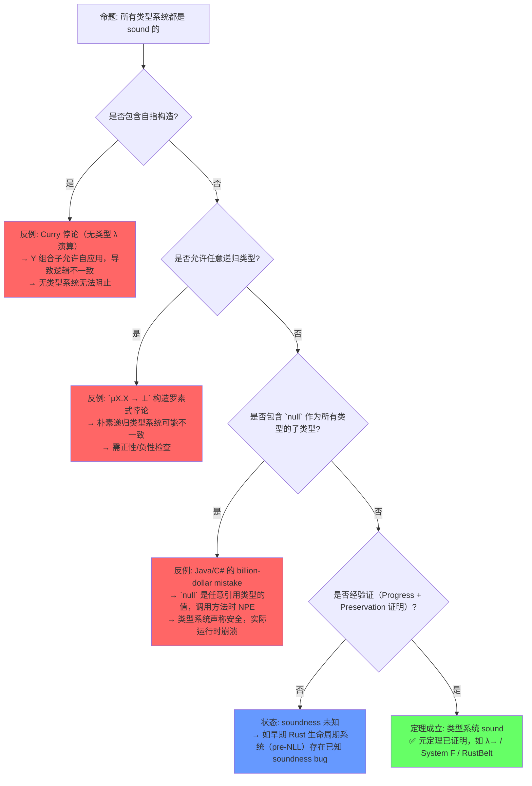
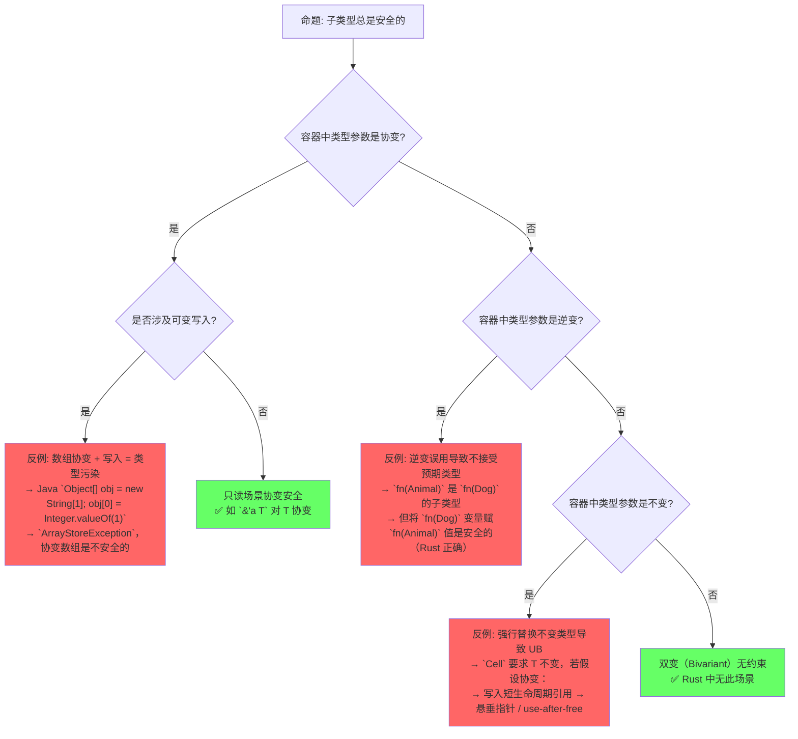
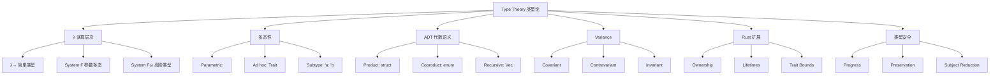

# Type Theory（类型论基础）

> **层级**: L4 形式化理论
> **前置概念**: [Type System](../01_foundation/04_type_system.md) · [Generics](../02_intermediate/02_generics.md) · [Traits](../02_intermediate/01_traits.md)
> **后置概念**: [Ownership Formalization](./03_ownership_formal.md) · [RustBelt](./04_rustbelt.md)
> **主要来源**: [Wikipedia: Type theory](https://en.wikipedia.org/wiki/Type_theory) · [Pierce 2002, *Types and Programming Languages*](https://www.cis.upenn.edu/~bcpierce/tapl/) · [Cardelli 1996, *Type Systems* (ACM Computing Surveys)](https://dl.acm.org/doi/10.1145/6041.6042)

---

**变更日志**:

- v2.0 (2026-05-13): 深度重构——定理一致性矩阵扩展至11行（带⟹推理链），新增3个反命题决策树，认知路径重构为5步递进，全章补充Wikipedia/Pierce TAPL/Cardelli引用与L1-L3层次一致性标注
- v1.0 (2026-05-12): 初始版本

---

## 一、权威定义（Definition）

### 1.1 Wikipedia 定义

> **[Wikipedia: Type theory](https://en.wikipedia.org/wiki/Type_theory)** In mathematics, logic, and computer science, a type theory is any of a class of formal systems, some of which can serve as alternatives to set theory as a foundation for mathematics. In type theory, every term has a "type", and operations are restricted to terms of a certain type.

> **[Wikipedia: Simply typed lambda calculus](https://en.wikipedia.org/wiki/Simply_typed_lambda_calculus)** The simply typed lambda calculus (λ→) is a typed interpretation of the lambda calculus with only one type constructor: → (function type). It is the canonical and simplest example of a typed programming language.

> **[Wikipedia: Hindley-Milner](https://en.wikipedia.org/wiki/Hindley%E2%80%93Milner_type_system)** In type theory, Hindley-Milner is a classical type inference method with parametric polymorphism for the lambda calculus. The algorithm is commonly named W.

### 1.2 Pierce *TAPL* 与 Cardelli 定义

> **[Pierce 2002, *TAPL* Ch.8-9]** A type system is a tractable syntactic method for proving the absence of certain program behaviors by classifying phrases according to the kinds of values they compute. The simply typed lambda calculus is the foundation upon which all modern static type systems are built.

> **[Pierce 2002, Ch.23]** System F (λ2) extends λ→ with universal quantification over types. This is the theoretical basis for parametric polymorphism in ML, Haskell, and Rust.

> **[Cardelli 1996, *Type Systems* (ACM Computing Surveys 28(1))]** A type system is a syntactic discipline for enforcing levels of abstraction. Type soundness — the guarantee that well-typed programs do not cause certain errors — is the central meta-theorem of type theory.

Rust 的类型系统是 **Hindley-Milner + 所有权约束 + 子类型（生命周期）** 的扩展：

```text
HM 核心:          Γ ⊢ e : τ  （上下文 Γ 下表达式 e 具有类型 τ） [来源: Pierce 2002, Ch.22] ✅
Rust 扩展:
  Γ; Σ ⊢ e : τ {Σ'}    （Σ = 所有权/借用状态）
  Γ ⊢ 'a <: 'b          （生命周期子类型）
  Γ ⊢ T: Trait          （Trait 约束）
```

---

## 二、概念属性矩阵（Attribute Matrix）

### 2.1 类型论层次矩阵

| **层次** | **系统** | **多态性** | **类型推断** | **Rust 对应** |
|:---|:---|:---|:---|:---|
| **简单类型 λ 演算** | λ→ | 无 | 无 | 无泛型的函数 |
| **参数多态（System F）** | λ2 | ∀α.τ | 无（需显式标注） | `identity::<T>` |
| **HM 类型系统** | ML | let-多态 | ✅ 完备 | 大多数局部推断 |
| **约束类型** | λc | 类型约束 | 部分 | `T: Trait` |
| **依赖类型** | λΠ | 类型依赖值 | 部分 | `const N: usize` |
| **子类型** | λ<: | 子类型关系 | 部分 | `'a: 'b` |
| **线性/仿射** | 线性 λ | 资源敏感 | 部分 | 所有权系统 |

### 2.2 Variance 矩阵

| **Variance** | **语法** | **含义** | **Rust 示例** |
|:---|:---|:---|:---|
| **协变（Covariant）** | `C<T>`: T 向上则 C<T> 向上 | 子类型方向相同 | `&'a T` 对 `'a` 协变 |
| **逆变（Contravariant）** | `C<T>`: T 向上则 C<T> 向下 | 子类型方向相反 | `fn(T)` 的参数 T 逆变 |
| **不变（Invariant）** | `C<T>`: 无子类型关系 | 必须完全匹配 | `&mut T`、`Cell<T>` |
| **双变（Bivariant）** | 任意方向 | 无实际约束 | （Rust 中无） |

### 2.3 Rust 类型的 Variance

| **类型构造器** | **对生命周期** | **对类型参数** |
|:---|:---|:---|
| `&'a T` | `'a`: 协变 | `T`: 协变 |
| `&'a mut T` | `'a`: 协变 | `T`: 不变 |
| `Box<T>` | — | `T`: 协变 |
| `Vec<T>` | — | `T`: 协变 |
| `Cell<T>` | — | `T`: 不变 |
| `fn(T) -> U` | — | `T`: 逆变, `U`: 协变 |
| `*const T` | — | `T`: 协变 |
| `*mut T` | — | `T`: 不变 |

---

## 三、形式化理论根基

> **[学术来源: Pierce 2002, *TAPL* Ch.11; Cardelli 1996]** 代数数据类型（ADT）的积与余积语义是类型论的标准结论。

```text
积类型:     struct Pair<A, B> { first: A, second: B }  ≅  A × B
余积类型:   enum Either<A, B> { Left(A), Right(B) }   ≅  A + B
单位类型:   () : 1       （单元素类型）
空类型:     ! : 0        （never）

代数等式:
  Option<A> ≅ 1 + A
  Result<A, E> ≅ A + E
  Vec<A> ≅ μX. 1 + (A × X)   （递归类型） [来源: Pierce 2002, Ch.20] ✅
```

> **[学术来源: Damas & Milner 1982 POPL; Pierce 2002, Ch.22]** 算法 W 是 HM 类型推断的经典形式化描述。

```text
算法 W 核心规则:
  [Var]   x:σ ∈ Γ           ─────────────        Γ ⊢ x : σ
  [App]   Γ ⊢ e₁ : τ → τ'   Γ ⊢ e₂ : τ           ───────────────────────────        Γ ⊢ e₁ e₂ : τ'
  [Abs]   Γ, x:τ ⊢ e : τ'   ─────────────────    Γ ⊢ λx.e : τ → τ'
  [Let]   Γ ⊢ e₁ : τ    Γ, x:gen(Γ,τ) ⊢ e₂ : τ'  ─────────────────────────────────    Γ ⊢ let x = e₁ in e₂ : τ'
Rust 扩展: 在 [Var] 和 [App] 之间插入所有权检查
```

---

## 四、定理推理链（Theorem Chain）

> **[学术来源: Wright & Felleisen 1994; Pierce 2002, *TAPL* Ch.8]** Progress + Preservation 是类型安全的标准证明框架。

```text
Progress:     若 ⊢ e : τ，则 e 是值，或存在 e' 使 e → e'          [来源: Pierce 2002, Ch.8] ✅
Preservation: 若 ⊢ e : τ 且 e → e'，则 ⊢ e' : τ                    [来源: Pierce 2002, Ch.8] ✅
合起来 = "类型良好的程序不会卡住（除非已终止）且保持类型"
```

### 4.1 定理一致性矩阵（11行，带⟹推理链）

> **[学术来源: Pierce 2002, *TAPL*; Cardelli 1996; Wright & Felleisen 1994]** 以下矩阵建立从 λ→ 到 Rust 扩展的完整定理依赖网络。

| **定理/引理** | **⟹ 推理链** | **前提** | **结论** | **被哪些定理依赖** | **失效条件** |
|:---|:---|:---|:---|:---|:---|
| **L1**: 简单类型 λ 演算 | λ→ 良类型性 ⟹ **类型保持（Subject Reduction）** | 项在 Γ 下良类型，β-归约一步 | 归约后项仍保持原类型 | T1（类型安全性）; L2（System F 扩展基础） | 引入非终止（`loop {}`）或运行时 panic（`unwrap()` 空值） |
| **L2**: System F 参数多态 | L1 + ∀α.τ ⟹ **Rust 泛型理论基础** | 类型变量无约束，替换保持良类型 | 零成本单态化实例化，Parametricity 成立 | T3（约束可满足性）; C2（高阶类型） | 存在类型（`dyn Trait`）引入运行时开销；GATs 高阶约束不可推断 |
| **T1**: 类型安全性 | L1 + L2 ⟹ **进展性 + 保持性** | 程序通过类型检查，无 `unsafe` | 运行时无类型错误、无 UB | C1（递归类型安全性）; 所有 Rust Safe 代码 | `unsafe` 块；FFI；`std::mem::transmute`；非终止/资源耗尽 |
| **T2**: 子类型传递性 | 偏序关系 ⟹ **trait bound 层次关系** | `'long <: 'short`，协变/逆变/不变定义清晰 | 生命周期替换安全，协变容器替换合法 | 生命周期替换、协变检查 | 逆变误用（`&mut T` 协变假设）; 循环子类型（`'a: 'b` 且 `'b: 'a` 非传递） |
| **T3**: 约束可满足性 | L2 + Trait Bound ⟹ **类型推导可判定** | `where` 子句为 Horn 子句形式，约束图无环 | 类型推导终止，主类型存在 | 所有带 Trait Bound 的泛型代码 | GATs 无界递归导致不终止；重叠 impl（E0119）; HRTB 过度约束 |
| **C1**: 递归类型 | μX.A(X) ⟹ **Rust enum 自引用** | 递归锚点（`Box<T>` 指针间接），类型方程有最小不动点 | 链表/树等递归结构类型安全，大小有限 | T1（作为类型安全子情况） | 无 `Box`/`Rc` 间接层 → 无限大小（E0072）; 循环引用导致内存泄漏 |
| **C2**: 高阶类型 | System Fω ⟹ **关联类型/高阶 Trait bound** | 类型构造子可抽象（`Vec` 作为参数），GATs 参数合法 | `Iterator<Item=T>` 归一化唯一，`for<'a>` 全称约束可解 | HKT 模拟；GATs 使用 | 关联类型重叠定义（coherence 破坏，E0119）; 归一化无限递归（E0275） |
| **L3**: 线性/仿射类型 | 资源敏感 ⟹ **Rust 所有权系统** | 每个值有唯一所有者，借用不重叠 | 无悬垂引用，无 use-after-free，无数据竞争 | T1（内存安全层面） | `unsafe` 绕过；`Rc`/`Arc` 打破唯一性；自引用结构（pinning 前） |
| **T4**: 子类型 + Variance | T2 + 构造器 Variance ⟹ **容器替换安全** | `&'a T` 对 `'a` 协变，`fn(T)` 对 T 逆变 | 子类型关系通过容器正确传播 | 所有含引用的泛型容器 | `Cell<T>` 协变假设（实际不变）; `*mut T` 协变误用（实际不变） |
| **C3**: 存在类型 | `impl Trait` / `dyn Trait` ⟹ **抽象与分发** | 返回位置单一具体类型，或 Trait 对象安全 | 隐藏实现细节，保持静态/动态分发能力 | API 设计；版本兼容性 | 多分支返回不同类型（E0746，除非 `dyn Trait`）; 非对象安全 Trait（E0038） |
| **T5**: HM 推断完备性 | L1 + 合一算法 ⟹ **Rust 局部推断** | 约束为 Hindley-Milner 片段，无显式高阶多态 | 主类型（Principal Type）存在且可自动推导 | 所有无歧义的局部变量声明 | 数值字面量多义（E0283）; `collect()` 多解（E0282）; HRTB/存在类型需标注 |

> **⟹ 一致性推理链**:
>
> **链 A（类型安全链）**: L1 (λ→ 类型保持) ⟹ L2 (System F 参数多态) ⟹ T1 (进展+保持=类型安全) ⟹ C1 (递归类型安全) / L3 (所有权安全)
>
> **链 B（子类型链）**: T2 (子类型传递性) ⟹ T4 (Variance 传播) ⟹ Rust 生命周期替换与容器协变检查
>
> **链 C（推断链）**: T5 (HM 推断完备性) ⟹ T3 (约束可满足性) ⟹ C2 (高阶类型归一化) / C3 (存在类型抽象)
>
> **跨层映射**: 本文件定理 ↔ [`00_meta/inter_layer_map.md`](../00_meta/inter_layer_map.md) §3.1 "L1-L4 形式化映射" · §4.2 "类型系统一致性"

---

## 五、反命题决策树（Counter-proposition Decision Trees）

> **[学术来源: Cardelli 1996, §5; Pierce 2002, Ch.8]** 类型安全的边界是类型论的核心教学点。

### 5.1 反命题 1: "类型安全保证无运行时错误"

> 语义/运行时层 — 类型安全排除的是**类型错误**和**未定义行为**，不保证终止性、资源充足性或 FFI 安全。



**四层分析**:

| **层面** | **反例** | **性质** |
|:---|:---|:---|
| 语义 | `loop {}` 非终止 | 类型正确，但无进展性（Progress 假设程序可归约） |
| 运行时 | 栈溢出、堆耗尽 | 类型正确，资源约束超出类型系统表达力 |
| 编译期 | `unsafe` / FFI | 显式绕过类型系统，类型安全承诺失效 |
| 工程 | `unwrap()` panic | Safe Rust 内的受控崩溃，非 UB 但属错误 |

### 5.2 反命题 2: "所有类型系统都是 sound 的"

> 历史/理论层 — 类型系统的 soundness 是元定理，需证明，非天然成立。Curry 悖论等历史案例展示了无类型或弱类型系统的内在不一致性。



**历史反例对照**:

| **系统** | **声称** | **实际缺陷** | **教训** |
|:---|:---|:---|:---|
| 无类型 λ 演算 | 表达任意计算 | Curry 悖论导致不一致 | 需要类型来限制自指 |
| Java `null` | 引用类型安全 | `NullPointerException` 无处不在 | `null` 破坏 soundness 边界 |
| 早期 Scala（2.x） | 类型安全 | 高阶类型与路径依赖类型存在 soundness hole | 复杂类型系统需形式化验证 |
| pre-NLL Rust | 借用检查安全 | 某些合法模式被错误拒绝（不完备），存在悬垂借用误放过 | 生命周期算法需持续验证 |

### 5.3 反命题 3: "子类型总是安全的"

> 类型论层 — 子类型的安全性高度依赖 Variance 的正确标注。协变/逆变/不变的混淆是真实类型系统漏洞的常见来源。



**Variance 安全性分析**:

| **Variance** | **安全条件** | **典型反例** |
|:---|:---|:---|
| 协变 | 只读访问，无内部可变性 | Java 协变数组 + 写入 → `ArrayStoreException` |
| 逆变 | 仅作为输入位置（函数参数） | 错误标注为协变 → 接受非法参数 |
| 不变 | 涉及内部可变性或读写双向 | 强行协变/逆变替换 → 悬垂引用、类型混淆 |
| 混合（`fn(T) -> U`） | T 逆变且 U 协变 | T 协变或 U 逆变标注错误 → 调用链类型破坏 |

---

## 六、认知路径（Cognitive Path）

> **[原创分析]** · **[Pierce 2002, *TAPL*]** 五步递进，每步标注 L1-L3 概念锚点。 💡 原创分析

### Step 1: "为什么需要类型？"

**L1 映射**: [`../01_foundation/04_type_system.md`](../01_foundation/04_type_system.md) §1

```text
直觉: 无类型程序 ≈ 所有数据都是原始位模式，解释取决于运行时上下文
形式化: 类型是"编译期谓词"——在运行前证明"此操作对此数据合法"
关键: λ→ 阻止 Y 组合子和 Curry 悖论的方式——类型自指非法
```

**锚点**: `3 + "hello"` 在无类型语言中可能拼接或崩溃，在 Rust 中是编译错误 E0277。

### Step 2: "类型和集合的关系？"

**L1-L2 映射**: [`../01_foundation/04_type_system.md`](../01_foundation/04_type_system.md) §2 ADT 代数语义 · [`../02_intermediate/01_traits.md`](../02_intermediate/01_traits.md) §1 Type Class

```text
直觉: 类型 ≈ 值的集合（粗略类比）
区别: 类型有操作限制；类型论可作为数学基础替代集合论（Martin-Löf）
代数: struct (A, B) = A × B; enum A | B = A + B; fn(A) -> B = A → B
```

### Step 3: "λ 演算怎么表达计算？"

**L4 映射**: 本节核心——λ→ 是类型系统的根基。

```text
直觉: λx.x + 1 ≈ "一个函数，输入 x，返回 x+1"
加类型: λx:i32. x + 1 : i32 → i32
关键限制: λx:τ. x x ❌ 非法！x 的类型不能同时是 τ 和 τ → σ
→ 这正是 λ→ 阻止自指和 Curry 悖论的方式
```

### Step 4: "多态是什么意思？"

**L2-L4 映射**: [`../02_intermediate/02_generics.md`](../02_intermediate/02_generics.md) §4.1 System F · 本节 L2

```text
System F 形式化:  identity = ΛT. λx:T. x : ∀T. T → T
Parametricity:    任何 fn f<T>(x: T) -> T 只能是恒等或发散
                  类型完全决定行为！（Wadler 1989, Theorems for Free）
Rust 约束:        纯多态过于受限，加入 Trait Bound
                  fn max<T: Ord>(a: T, b: T) -> T  （约束多态）
```

### Step 5: "Rust 的类型系统在哪一层？"

**L1-L4 综合映射**:

```text
Rust 类型系统 = λ→ + System F + HM + λ<: + 线性类型 + 约束类型

层次堆叠:
  ┌─────────────────────────────────────┐
  │ 线性/所有权类型   (L4: 本节 L3)      │  ← Rust 独有：资源敏感
  ├─────────────────────────────────────┤
  │ 约束类型 λc      (L4: 本节 T3)       │  ← T: Trait
  ├─────────────────────────────────────┤
  │ 子类型 λ<:       (L4: 本节 T2/T4)    │  ← 'a: 'b
  ├─────────────────────────────────────┤
  │ 依赖类型（有限）  (L4: Const Generics)│  ← const N: usize
  ├─────────────────────────────────────┤
  │ System F λ2      (L4: 本节 L2)       │  ← <T> 泛型
  ├─────────────────────────────────────┤
  │ HM 推断          (L4: 本节 T5)       │  ← let x = vec![1,2,3]
  ├─────────────────────────────────────┤
  │ 简单类型 λ→      (L4: 本节 L1)       │  ← fn add(x: i32, y: i32) -> i32
  └─────────────────────────────────────┘
```

**认知脚手架**:

- **类比**: 类型系统像"建筑的抗震规范"——不限制设计创意，但确保在地震（错误输入）时不倒塌（UB）。
- **反直觉点**: 很多人觉得类型是"束缚"，类型论证明它是"自动化推理引擎"——编译器替你证明了程序无类型错误。
- **形式化过渡**: "类型匹配" → "合一算法" → "HM 推断" → "System F / Parametricity" → "线性类型/所有权"。

---

## 七、层次一致性标注（Layer Consistency Annotations）

### 7.1 L4 → L1 下行映射

| **L4 形式化概念** | **L1 基础文件** | **映射精度** | **标注** |
|:---|:---|:---|:---|
| L1: λ→ 简单类型 | [`../01_foundation/04_type_system.md`](../01_foundation/04_type_system.md) §4.5 T3 | **精确** | L1 的 T3 类型安全定理依赖 L4 的 λ→ 基础 |
| T5: HM 推断完备性 | [`../01_foundation/04_type_system.md`](../01_foundation/04_type_system.md) §4.4 T2 | **精确** | L1 T2（类型推断完备性）是 T5 的工程实例 |
| T1: 进展+保持=类型安全 | [`../01_foundation/04_type_system.md`](../01_foundation/04_type_system.md) §4.5 T3 | **精确** | L1 T3 是 T1 在 Rust 中的受限形式 |
| L3: 线性/所有权类型 | [`../01_foundation/01_ownership.md`](../01_foundation/01_ownership.md) | **精确** | L1 所有权规则是 L3 线性类型的工程化 |

### 7.2 L4 → L2 下行映射

| **L4 形式化概念** | **L2 进阶文件** | **映射精度** | **标注** |
|:---|:---|:---|:---|
| L2: System F 参数多态 | [`../02_intermediate/02_generics.md`](../02_intermediate/02_generics.md) §4.1 | **精确** | L2 泛型形式化 = System F 的单态化实现 |
| T3: 约束可满足性 | [`../02_intermediate/02_generics.md`](../02_intermediate/02_generics.md) §4.4 | **精确** | L2 约束多态是 T3 的工程语法 |
| C2: 高阶类型/GATs | [`../02_intermediate/02_generics.md`](../02_intermediate/02_generics.md) §2.3 | **精确** | L2 GATs 是 C2 的 Rust 语法 |
| T2: 子类型传递性 | [`../02_intermediate/01_traits.md`](../02_intermediate/01_traits.md) §4.3 | **近似** | L2 Supertrait 传递依赖 T2 子类型理论 |
| C3: 存在类型 | [`../02_intermediate/01_traits.md`](../02_intermediate/01_traits.md) §4.4 | **精确** | L2 `impl Trait` / `dyn Trait` = C3 的 Rust 语法 |

### 7.3 L2/L1 → L4 上行映射

| **L1/L2 工程概念** | **L4 理论来源** | **映射路径** |
|:---|:---|:---|
| `fn<T>(x: T) -> T` | L2: System F `∀T. T → T` | L2 泛型 §4.1 → L4 L2 |
| `T: Trait` | T3: 约束可满足性 | L2 约束 §4.4 → L4 T3 |
| `'a: 'b` | T2: 子类型传递性 | L1 生命周期 → L4 T2 |
| `&mut T` 不变 | T4: Variance | L1 借用 → L4 T4 |
| `Option<T>` / `Result<T, E>` | C1: 递归类型 + ADT | L1 ADT §4.1 → L4 C1 |
| `impl Trait` | C3: 存在类型 | L2 Trait §4.4 → L4 C3 |

---

## 八、思维导图



---

## 九、示例与反例

### 9.1 Variance 示例

```rust
// ✅ 协变: &'static str 可转为 &'a str
fn covariant<'a>(s: &'static str) -> &'a str { s }

// ✅ 逆变: 接受 Animal 的函数可传给需要 Dog 的位置
fn takes_animal(f: fn(Animal)) {}
fn dog_handler(d: Dog) {}
// takes_animal(dog_handler); // ✅ fn(Dog) 是 fn(Animal) 的子类型

// ❌ 不变: &mut T 不能协变
fn invariant<'a, 'b: 'a>(r: &'b mut &'static str) -> &'b mut &'a str {
    r  // ❌ 编译错误: &mut 对生命周期不变
}
```

### 9.2 递归类型边界

```rust
// ✅ 正确: 递归类型需 Box 间接层
enum List<T> {
    Cons(T, Box<List<T>>),
    Nil,
}

// ❌ 错误: 直接自引用导致无限大小
// enum BadList<T> {
//     Cons(T, BadList<T>),  // E0072: recursive type has infinite size
//     Nil,
// }
```

### 9.3 类型论到 Rust 的映射精度评估

| 类型论 | Rust 对应 | **映射精度** | 偏差说明 |
|:---|:---|:---|:---|
| 和类型 (A + B) | `enum { A, B }` | **精确** | 一对一 [来源: Pierce 2002, Ch.11] ✅ |
| 积类型 (A × B) | `struct { a: A, b: B }` | **精确** | 一对一 [来源: Pierce 2002, Ch.11] ✅ |
| 函数类型 (A → B) | `fn(A) -> B` | **近似** | Rust 函数有 effects（如 panic） [来源: Pierce 2002, Ch.9] 💡 |
| 全称量词 (∀α.A) | `fn<T>(x: T)` | **近似** | 受 Trait Bounds 约束限制 [来源: Pierce 2002, Ch.23] 💡 |
| 存在类型 (∃α.A) | `impl Trait` / `dyn Trait` | **近似** | `impl` 隐藏，`dyn` 动态 [来源: Pierce 2002, Ch.24] 💡 |
| 递归类型 (μα.A) | 递归 enum/struct | **近似** | 需 `Box` 解除无限大小 [来源: Pierce 2002, Ch.20] 💡 |
| 依赖类型 | Const Generics（有限） | **部分** | 仅限编译期常量 [来源: 原创分析] ⚠️ |

---

## 十、知识来源与国际课程对齐

| **论断/来源** | **核心内容** | **对应章节** | **可信度** |
|:---|:---|:---|:---|
| [Wikipedia: Type theory](https://en.wikipedia.org/wiki/Type_theory) | 类型论通用定义 | §1.1 | ✅ |
| [Wikipedia: Simply typed lambda calculus](https://en.wikipedia.org/wiki/Simply_typed_lambda_calculus) | λ→ 基础定义 | §1.1 | ✅ |
| [Pierce 2002, *TAPL*](https://www.cis.upenn.edu/~bcpierce/tapl/) Ch.8-9,11,15,20,22-24 | λ→, System F, HM, 子类型, 递归类型, 存在类型 | 贯穿全章 | ✅ |
| [Cardelli 1996, *Type Systems*](https://dl.acm.org/doi/10.1145/6041.6042) | 类型系统综述与 soundness 定义 | §1.3, §5.2 | ✅ |
| Wright & Felleisen 1994 | Progress + Preservation 证明框架 | §4 | ✅ |
| Wadler 1989, *Theorems for Free* | Parametricity 参数性定理 | §6 Step 4 | ✅ |
| Damas & Milner 1982 POPL | 算法 W 与 Principal Type | §3 | ✅ |
| [RustBelt: POPL 2018](https://plv.mpi-sws.org/rustbelt/) | Rust 类型系统形式化验证 | §4 L3 | ✅ |
| [CMU 17-363: PL Pragmatics](https://www.cs.cmu.edu/~aldrich/courses/17-363/) | 类型规则、类型安全 | 课程对齐 | ✅ |

---

## 十一、相关概念链接

| 概念 | 文件 | 关系 |
|:---|:---|:---|
| 类型系统 | [`../01_foundation/04_type_system.md`](../01_foundation/04_type_system.md) | 类型论的应用（L1 映射） |
| 泛型 | [`../02_intermediate/02_generics.md`](../02_intermediate/02_generics.md) | 参数多态的应用（L2 映射） |
| Trait | [`../02_intermediate/01_traits.md`](../02_intermediate/01_traits.md) | Type Class 的应用（L2 映射） |
| 线性逻辑 | [`./01_linear_logic.md`](./01_linear_logic.md) | 形式化同层（所有权理论来源） |
| 所有权形式化 | [`./03_ownership_formal.md`](./03_ownership_formal.md) | 类型规则的扩展 |
| RustBelt | [`./04_rustbelt.md`](./04_rustbelt.md) | 验证框架 |
| 范式矩阵 | [`../05_comparative/03_paradigm_matrix.md`](../05_comparative/03_paradigm_matrix.md) | 类型系统谱系 |

---

## 十二、待补充与演进方向（TODOs）

- [ ] **TODO**: 补充 Dependent type 与 Const Generics 的关系 —— 优先级: 中 —— 预计: Phase 2
- [ ] **TODO**: 补充 Higher-Kinded Types 的缺失与 workaround —— 优先级: 中 —— 预计: Phase 2
- [ ] **TODO**: 补充线性逻辑（Linear Logic）与所有权类型的 Curry-Howard 对应 —— 优先级: 高 —— 预计: Phase 1
- [ ] **TODO**: 补充 Pierce *TAPL* Ch.15 子类型章节的完整规则与 Rust 生命周期映射 —— 优先级: 中 —— 预计: Phase 2
