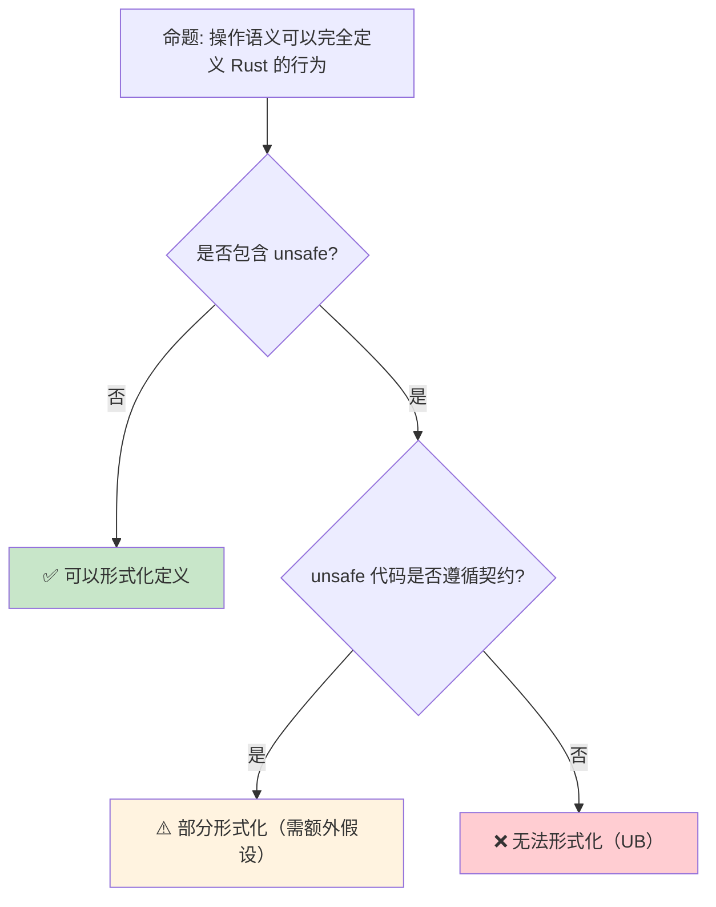

> **内容分级**: [专家级]

# 操作语义：程序行为的形式化定义
>
> **EN**: Formal Methods
> **Summary**: Formal Methods — Operational semantics: small-step versus big-step rules, and formal modeling of ownership, borrowing, and concurrency.
> **Rust 版本**: 1.97.0+ (Edition 2024)
> **受众**: [研究者]
> ⚠️ **声明**: 本文件使用形式化符号辅助直觉理解，所呈现的"定理/引理/推论"为**教学类比**，非经机器验证的严格数学证明。如需严格形式化验证，请参考 [Verus](https://github.com/verus-lang/verus)、[Kani](https://model-checking.github.io/kani/)、[Coq](https://coq.inria.fr/)。
>
> **Bloom 层级**: L4-L5
> **权威来源**: 本文件为 `concept/` 权威页。
> **定位**: 介绍 **操作语义（Operational Semantics）**——通过形式化规则定义程序的执行步骤，分析小步语义（Small-Step）与大步语义（Big-Step）的对比，以及 Rust 的所有权（Ownership）、借用（Borrowing）和并发操作的形式化建模方法。
> **前置概念**: [Type Theory](../00_type_theory/01_type_theory.md) · [Ownership Formal](../01_ownership_logic/02_ownership_formal.md) · [Linear Logic](../01_ownership_logic/01_linear_logic.md) · [Unsafe Rust](../../03_advanced/02_unsafe/01_unsafe.md)
> **后置概念**: [RustBelt](../02_separation_logic/01_rustbelt.md) · [Separation Logic](../02_separation_logic/02_separation_logic.md)
>
> **来源**: [Rust Reference](https://doc.rust-lang.org/reference/introduction.html) · [RustBelt](https://plv.mpi-sws.org/rustbelt/) · [Itanium C++ ABI](https://itanium-cxx-abi.github.io/cxx-abi/abi.html)
---

> **来源**:
> [Winskel 1993 — The Formal Semantics of Programming Languages](https://mitpress.mit.edu/9780262731034) ·
> [Pierce 2002 — Types and Programming Languages](https://www.cis.upenn.edu/~bcpierce/tapl/) ·
> [Plotkin 1981 — A Structural Approach to Operational Semantics](https://homepages.inf.ed.ac.uk/gdp/publications/sos_jlap.pdf) ·
> [Felleisen & Flatt — Modular Semantics](https://doi.org/10.1145/263690.263803) ·
> [Felleisen & Hieb 1992 — The Revised Report on the Syntactic Theories of Sequential Control and State](https://doi.org/10.1017/S0956796800001368) ·
> [RustBelt Paper](https://doi.org/10.1145/3158154) ·
> [Stacked Borrows Paper](https://doi.org/10.1145/3371106)

## 📑 目录

- [操作语义：程序行为的形式化定义](#操作语义程序行为的形式化定义)
  - [📑 目录](#-目录)
  - [一、核心概念](#一核心概念)
    - [1.1 为什么需要操作语义](#11-为什么需要操作语义)
    - [1.2 小步语义 vs 大步语义](#12-小步语义-vs-大步语义)
    - [1.3 求值上下文（Evaluation Contexts）](#13-求值上下文evaluation-contexts)
  - [二、技术细节](#二技术细节)
    - [2.1 配置与转换规则](#21-配置与转换规则)
    - [2.2 环境与存储](#22-环境与存储)
    - [2.3 Rust 操作语义的特殊性](#23-rust-操作语义的特殊性)
  - [三、应用映射](#三应用映射)
  - [四、反命题与边界分析](#四反命题与边界分析)
    - [4.1 反命题树](#41-反命题树)
    - [4.2 边界极限](#42-边界极限)
  - [五、常见陷阱](#五常见陷阱)
  - [六、来源与延伸阅读](#六来源与延伸阅读)
    - [编译验证示例](#编译验证示例)
  - [相关概念](#相关概念)
  - [五、Rust 语义项目比较矩阵（RustSEM Comparison Matrix）](#五rust-语义项目比较矩阵rustsem-comparison-matrix)
    - [5.1 引言：为什么没有单一形式化覆盖全部 Rust](#51-引言为什么没有单一形式化覆盖全部-rust)
    - [5.2 完整比较矩阵](#52-完整比较矩阵)
      - [矩阵解读要点](#矩阵解读要点)
      - [各项目技术深度补充](#各项目技术深度补充)
      - [项目活跃度与社区维护状态详析](#项目活跃度与社区维护状态详析)
    - [5.3 关键发现](#53-关键发现)
      - [发现 1：Trait 系统在所有当前形式化模型中均为「未形式化」状态](#发现-1trait-系统在所有当前形式化模型中均为未形式化状态)
      - [发现 2：仅 RustSEM 与 KRust 直接形式化 Rust 源语言语法；其余项目形式化 MIR 层 IR 或子集](#发现-2仅-rustsem-与-krust-直接形式化-rust-源语言语法其余项目形式化-mir-层-ir-或子集)
      - [发现 3：RustBelt 通过 Iris ghost state 提供最完整的 unsafe 支持](#发现-3rustbelt-通过-iris-ghost-state-提供最完整的-unsafe-支持)
      - [发现 4：没有任何形式化覆盖过程宏（proc macros）或编译期执行（CTFE）](#发现-4没有任何形式化覆盖过程宏proc-macros或编译期执行ctfe)
    - [5.4 Trait 系统的形式化缺口](#54-trait-系统的形式化缺口)
    - [5.5 未来方向：从碎片化到统一规格](#55-未来方向从碎片化到统一规格)
    - [5.6 形式化方法的技术对比与选型指南](#56-形式化方法的技术对比与选型指南)
    - [5.7 从比较矩阵到实践：形式化验证的落地路径](#57-从比较矩阵到实践形式化验证的落地路径)
      - [路径 A：动态验证先行（Miri → Kani 梯度）](#路径-a动态验证先行miri--kani-梯度)
      - [路径 B：核心抽象形式化（a-mir-formality → rustc 规格）](#路径-b核心抽象形式化a-mir-formality--rustc-规格)
      - [路径 C：unsafe 协议验证（RustBelt → RefinedRust 自动化）](#路径-cunsafe-协议验证rustbelt--refinedrust-自动化)
      - [三条路径的交集与协同](#三条路径的交集与协同)
  - [理想状态下，三条路径将在 2030 年前后汇聚：a-mir-formality 提供类型系统的「根信任」，RustBelt/RefinedRust 提供 unsafe 协议的「叶子信任」，Miri/Kani 提供动态/有界验证的「快速反馈」。届时，Rust 将成为首个拥有「分层形式化保证」的主流系统编程语言——从核心类型规则到生产代码模块（Module），每一层都有可验证的数学根基](#理想状态下三条路径将在-2030-年前后汇聚a-mir-formality-提供类型系统的根信任rustbeltrefinedrust-提供-unsafe-协议的叶子信任mirikani-提供动态有界验证的快速反馈届时rust-将成为首个拥有分层形式化保证的主流系统编程语言从核心类型规则到生产代码模块module每一层都有可验证的数学根基)
  - [权威来源索引](#权威来源索引)
  - [十、边界测试：操作语义的编译错误](#十边界测试操作语义的编译错误)
    - [10.1 边界测试：求值顺序的未定义行为（运行时 UB）](#101-边界测试求值顺序的未定义行为运行时-ub)
    - [10.2 边界测试：panic 的栈展开语义（运行时行为）](#102-边界测试panic-的栈展开语义运行时行为)
    - [10.3 边界测试：形式化规则违反导致的编译错误（编译错误）](#103-边界测试形式化规则违反导致的编译错误编译错误)
    - [10.4 边界测试：悬垂引用的形式化禁止（编译错误）](#104-边界测试悬垂引用的形式化禁止编译错误)
    - [10.5 边界测试：形式化语义中的非确定性选择（运行时行为差异）](#105-边界测试形式化语义中的非确定性选择运行时行为差异)
    - [10.6 边界测试：堆叠借用（Stacked Borrows）与原始指针的别名（运行时 UB）](#106-边界测试堆叠借用stacked-borrows与原始指针的别名运行时-ub)
    - [10.7 边界测试：求值顺序与副作用的交互（运行时 UB）](#107-边界测试求值顺序与副作用的交互运行时-ub)
    - [10.3 边界测试：求值顺序与副作用的确定性（编译错误）](#103-边界测试求值顺序与副作用的确定性编译错误)
    - [10.2 边界测试：match 分支返回类型不一致](#102-边界测试match-分支返回类型不一致)
  - [嵌入式测验（Embedded Quiz）](#嵌入式测验embedded-quiz)
    - [测验 1：小步语义 vs 大步语义（理解层）](#测验-1小步语义-vs-大步语义理解层)
    - [测验 2：求值上下文（Evaluation Contexts）（应用层）](#测验-2求值上下文evaluation-contexts应用层)
    - [测验 3：Rust 操作语义的独特性（分析层）](#测验-3rust-操作语义的独特性分析层)
    - [测验 4：形式化覆盖边界（评价层）](#测验-4形式化覆盖边界评价层)
    - [测验 5：操作语义 vs 测试（分析层）](#测验-5操作语义-vs-测试分析层)
  - [认知路径](#认知路径)
    - [核心推理链](#核心推理链)

---

## 一、核心概念
>
>

### 1.1 为什么需要操作语义
>

```text
程序语言的语义定义方式:

  1. 自然语言描述（如 C 标准）
  ├── 易读但歧义
  ├── 实现者可能有不同理解
  └── 导致未定义行为（UB）

  2. 操作语义
  ├── 形式化规则定义执行步骤
  ├── 无歧义，可机械验证
  └── 适合证明编译器正确性

  3. 指称语义（Denotational Semantics）
  ├── 将程序映射到数学对象
  ├── 抽象但难以处理非终止
  └── 适合证明程序等价性

  4. 公理化语义（Axiomatic Semantics）
  ├── 霍尔逻辑：{P} C {Q}
  ├── 适合验证特定属性
  └── 不适合描述完整行为

  Rust 的选择:
  ├── 无官方形式化语义（目前）
  ├── RustBelt 使用 Iris（基于操作语义）
  ├── a-mir-formality 正在开发形式化规范
  └── 工业界主要依赖测试和 Miri
```

> **认知功能**: 操作语义是**程序行为的"数学蓝图"**——它将直觉的执行过程转化为严格的规则，使编译器优化和程序验证有坚实的理论基础。
> (Source: [Winskel 1993 — Formal Semantics](https://mitpress.mit.edu/9780262731034))

---

### 1.2 小步语义 vs 大步语义
>

```text
小步语义（Small-Step / Structural Operational Semantics）:

  核心思想: (e, s) → (e', s')
  ├── 一个表达式在一步中部分求值
  ├── 追踪中间状态
  └── 适合建模并发和交错执行

  示例:
  (1 + 2) + 3
  → 3 + 3        // 先求值 1 + 2
  → 6            // 再求值 3 + 3

  大步语义（Big-Step / Natural Semantics）:

  核心思想: (e, s) ⇓ (v, s')
  ├── 表达式直接求值为最终值
  ├── 不追踪中间状态
  └── 适合证明类型安全

  示例:
  (1 + 2) + 3 ⇓ 6
  // 一步直接到结果

  对比:
  ┌─────────────────┬─────────────────┬─────────────────┐
  │ 特性            │ 小步语义        │ 大步语义        │
  ├─────────────────┼─────────────────┼─────────────────┤
  │ 中间状态        │ 可见            │ 隐藏            │
  │ 非终止          │ 可表达（无限步）│ 不可表达        │
  │ 并发            │ 适合            │ 不适合          │
  │ 证明难度        │ 较复杂          │ 较简单          │
  │ Rust 应用       │ RustBelt/Iris   │ 类型安全性证明  │
  └─────────────────┴─────────────────┴─────────────────┘
```

> **语义洞察**: 小步语义是**并发和运行时（Runtime）分析**的基础——它允许在任意步骤插入检查点，这是 RustBelt 验证 unsafe 代码的关键。
> (Source: [Pierce 2002 — TAPL](https://www.cis.upenn.edu/~bcpierce/tapl/))

---

### 1.3 求值上下文（Evaluation Contexts）
>

```text
求值上下文: 标记"下一步求值的位置"

  语法:
  E ::= []                    // 空上下文（洞）
      | E + e               // 左操作数上下文
      | v + E               // 右操作数上下文
      | if E then e1 else e2  // 条件上下文
      | ...

  求值规则（小步）:
  E[e] → E[e']  如果 e → e'
  // 在上下文 E 中，子表达式 e 可以一步求值为 e'

  示例:
  E = (1 + []) + 3
  E[2 + 4] → E[6]
  // 即: (1 + (2 + 4)) + 3 → (1 + 6) + 3

  上下文的意义:
  ├── 精确定义"下一个求值步骤"
  ├── 区分可约式和值
  └── 是证明合流性（confluence）的关键工具
```

> **上下文洞察**: 求值上下文是**结构归纳**的核心——它使我们可以对程序结构进行归纳证明，而非枚举（Enum）所有可能的程序。
> (Source: [Felleisen & Hieb — The Revised Report on the Syntactic Theories of Sequential Control and State](https://doi.org/10.1017/S0956796800001368))

---

## 二、技术细节

「技术细节」涉及配置与转换规则、环境与存储与Rust 操作语义的特殊性，本节逐一说明其要点。

### 2.1 配置与转换规则
>

```text
操作语义的形式化结构:

  配置（Configuration）:
  ├── <e, σ> : 表达式 e + 存储 σ
  ├── σ: 内存映射（地址 → 值）
  └── 可能还包括环境（变量 → 地址）

  转换规则（Transition Rules）:

  [分配]
  <alloc(v), σ> → <l, σ[l ↦ v]>
  // 分配新地址 l，存储值 v

  [读取]
  <load(l), σ> → <σ(l), σ>  如果 l ∈ dom(σ)
  // 读取地址 l 的值

  [写入]
  <store(l, v), σ> → <(), σ[l ↦ v]>  如果 l ∈ dom(σ)
  // 写入值 v 到地址 l

  [顺序]
  <e1; e2, σ> → <e1', σ'>  如果 <e1, σ> → <e1', σ'>
  <v; e2, σ> → <e2, σ>     // v 是值，继续求值 e2

  这些规则构成了"抽象机器"的规范
```

> **规则洞察**: 操作语义规则是**公理化的执行模型**——每条规则对应一个可能的计算步骤，所有规则的闭包（Closures）定义了程序的完整行为。
> (Source: [Plotkin 1981 — A Structural Approach to Operational Semantics](https://homepages.inf.ed.ac.uk/gdp/publications/sos_jlap.pdf))

---

### 2.2 环境与存储
>

```text
环境-存储模型（Environment-Store Model）:

  环境（Env）: 变量名 → 地址
  ├── 处理作用域和变量绑定
  └── 支持闭包（环境捕获）

  存储（Store/Heap）: 地址 → 值
  ├── 处理内存分配和更新
  └── 支持引用和别名

  变量查找:
  <x, ρ, σ> → <σ(ρ(x)), ρ, σ>
  // 在环境 ρ 中查找 x 的地址，再在存储 σ 中查找值

  函数调用:
  <f(v), ρ, σ> → <e, ρ'[params ↦ addrs], σ'>
  // 其中 ρ' 是函数定义时的环境（闭包）
  // addrs 是新分配的地址，存储参数值

  Rust 的扩展:
  ├── 所有权: 环境-存储 + 所有权映射
  ├── 借用: 只读/独占访问约束
  └── 生命周期: 区域约束系统
```

> **环境-存储洞察**: 环境-存储分离是**命令式语言**的标准建模方式——环境处理词法作用域，存储处理运行时状态。
> (Source: [TAPL Ch13 — References](https://www.cis.upenn.edu/~bcpierce/tapl/))

---

### 2.3 Rust 操作语义的特殊性
>

```text
Rust 操作语义的独特挑战:

  1. 所有权转移
  ├── let x = v;  // x 拥有 v
  ├── let y = x;  // 所有权从 x 转移到 y
  └── x 此后不可用

  形式化:
  <let x = v; e, ρ, σ> → <e, ρ[x ↦ l], σ[l ↦ v]>
  <let y = x; e, ρ, σ> → <e, ρ[y ↦ ρ(x)], σ>  如果 x 是唯一的
  // 需要追踪所有权状态

  2. 借用规则
  ├── &x: 共享借用（只读）
  ├── &mut x: 独占借用（读写）
  └── 不能同时存在 &x 和 &mut x

  形式化（简化）:
  <&x, ρ, σ, B> → <l, ρ, σ, B ∪ {read(l)}>
  <&mut x, ρ, σ, B> → <l, ρ, σ, B ∪ {write(l)}>  如果 l 无活跃借用
  // B 是活跃借用集合

  3. 并发交错
  ├── 多线程的交错执行
  ├── 需要建模 happens-before 关系
  └── RustBelt 使用 Iris 的协议处理

  Stacked Borrows / Tree Borrows:
  ├── Rust 的形式化内存模型
  ├── 定义哪些内存访问是合法的
  └── 用于 Miri 动态检测 UB
```

> **Rust 特殊性**: Rust 的操作语义必须同时处理**值语义**（所有权（Ownership）转移）和**引用（Reference）语义**（借用（Borrowing）约束）——这比传统命令式语言复杂得多。
> (Source: [Stacked Borrows Paper](https://doi.org/10.1145/3371106)) · (Source: [Tree Borrows](https://www.ralfj.de/blog/2023/06/02/tree-borrows.html))

---

## 三、应用映射

```text
操作语义在 Rust 中的应用:

  RustBelt:
  ├── 使用 Iris 框架定义 Rust 的操作语义
  ├── 基于小步语义，支持并发交错
  └── 证明: 如果程序通过类型检查，则运行时安全

  Miri:
  ├── 基于 Tree Borrows 模型的解释器
  ├── 检测未定义行为（UB）
  └── 执行语义层面的检查（而非真实硬件）

  a-mir-formality:
  ├── Rust 的形式化规范项目
  ├── 定义 Rust 的类型系统和操作语义
  └── 目标是成为"Rust Reference"的形式化对应

  编译器优化验证:
  ├── 证明优化不改变语义
  ├── 需要源语言和目标语言的操作语义
  └── 活跃研究领域（LLVM 的 Alive 工具）

  教学:
  ├── 理解 Rust 所有权和借用的精确含义
  ├── 预测编译器行为
  └── 调试复杂的生命周期问题
```

> **应用洞察**: 操作语义不仅是**理论研究工具**——它直接支撑了 Rust 的验证工具链（Miri、RustBelt）和教学材料。
> (Source: [a-mir-formality](https://github.com/rust-lang/a-mir-formality))

---

## 四、反命题与边界分析

「反命题与边界分析」部分包含反命题树 与 边界极限 两条主线，本节依次说明。

### 4.1 反命题树
>



> **认知功能**: 此决策树展示操作语义**形式化 Rust 的边界**。safe Rust 可以完全形式化，但 unsafe 代码超出了标准语义的范围。
> (Source: [RustBelt — Unsafe Boundaries](https://plv.mpi-sws.org/rustbelt/))

---

### 4.2 边界极限
>

```text
边界 1: 未定义行为（UB）
├── 操作语义不定义 UB 程序的行为
├── C/C++ 有大量 UB，Rust 通过类型系统消除大部分
├── 但 unsafe Rust 仍有 UB（如数据竞争、悬垂指针）
└── Miri 动态检测部分 UB，但不是全部

边界 2: 并发交错爆炸
├── n 个线程的交错执行序列是指数级的
├── 操作语义定义所有可能的交错
├── 但验证所有交错不可行
└── RustBelt 使用协议限制合法交错

边界 3: 标准库的形式化
├── 标准库包含大量 unsafe 代码
├── 需要为每个 unsafe 块提供安全契约
├── 这是巨大的手动工作量
└── 目前只有核心部分被形式化

边界 4: 优化前后的语义等价
├── 编译器优化可能改变操作语义
├── 需要证明优化是语义保持的
├── 这是编译器验证的核心理论问题
└── LLVM 的 Alive 工具验证部分优化

边界 5: 与类型系统的一致性
├── 操作语义和类型系统必须一致
├── "well-typed programs don't go wrong"
├── 证明类型安全需要连接两者
└── Rust 的类型安全证明仍在进行中
```

> **边界要点**: 操作语义形式化 Rust 的边界主要与**UB**、**并发复杂性**、**标准库规模**、**优化验证**和**类型一致性（Coherence）**相关。
> (Source: [RustBelt Paper](https://doi.org/10.1145/3158154))

---

## 五、常见陷阱
>

```text
陷阱 1: 混淆操作语义和实现
  ❌ "Rust 的操作语义就是 rustc 的实现"
     // 实现可能有 bug，语义是规范

  ✅ 操作语义是理想化的数学模型
     // 实现应遵循语义，而非反之

陷阱 2: 忽视小步与大步的差异
  ❌ 用大步语义分析并发程序
     // 大步语义隐藏了交错点

  ✅ 并发分析必须使用小步语义
     // 或专门的下推系统（PDP）

陷阱 3: 过度简化 Rust 的语义
  ❌ 忽略所有权转移，只建模 C 风格的指针
     // 失去 Rust 的核心特性

  ✅ 所有权和借用必须纳入形式化模型
     // 这是 Rust 语义最复杂的部分

陷阱 4: 混淆语法和语义
  ❌ 认为语法正确 = 语义正确
     // 语法只是形式，语义才是含义

  ✅ 类型检查是语法层面的筛选
     // 操作语义定义真正的执行行为

陷阱 5: 认为形式化等于实用
  ❌ "有形式化语义就不需要测试"
     // 形式化通常只覆盖核心子集

  ✅ 形式化 + 测试 + 模糊测试 + Miri
     // 多维度验证才是工程实践
```

> **陷阱总结**: 操作语义的陷阱主要与**语义 vs 实现**、**小步 vs 大步**、**Rust 特殊性**、**语法 vs 语义**和**形式化局限性**相关。
> (Source: [Rust Formal Methods Community](https://rust-formal-methods.github.io/))

---

## 六、来源与延伸阅读

| 来源 | 可信度 | 说明 |
|:---|:---:|:---|
| [Winskel 1993 — Formal Semantics](https://mitpress.mit.edu/9780262731034) | ✅ 一级 | 形式语义经典教材 |
| [Pierce 2002 — TAPL](https://www.cis.upenn.edu/~bcpierce/tapl/) | ✅ 一级 | 类型与编程语言 |
| [Plotkin 1981 — SOS](https://homepages.inf.ed.ac.uk/gdp/publications/sos_jlap.pdf) | ✅ 一级 | 结构化操作语义奠基 |
| [RustBelt Paper](https://doi.org/10.1145/3158154) | ✅ 一级 | Rust 形式化验证 |
| [Stacked Borrows](https://doi.org/10.1145/3371106) | ✅ 一级 | Rust 内存模型 |
| [a-mir-formality](https://github.com/rust-lang/a-mir-formality) | ✅ 一级 | Rust 形式化规范 |

---

```rust
fn main() {
    let x = 5;
    let y = &x;
    println!("{}", y);
}
```

### 编译验证示例

```rust
fn step(expr: &str) -> &str {
    match expr {
        "1 + 2 + 3" => "3 + 3",
        "3 + 3" => "6",
        _ => expr,
    }
}

fn main() {
    let mut e = "1 + 2 + 3";
    while e != "6" {
        e = step(e);
        println!("step: {}", e);
    }
}
```

```rust
fn eval(ctx: &str, val: i32) -> String {
    format!("{}[{}]", ctx, val)
}

fn main() {
    println!("{}", eval("1 + ", 2));
}
```

```rust
fn main() {
    let mut state = 0;
    let update = |s: &mut i32| *s += 1;
    update(&mut state);
    println!("{}", state);
}
```

## 相关概念

- [Type Theory](../00_type_theory/01_type_theory.md) — 类型论基础
- [Ownership Formal](../01_ownership_logic/02_ownership_formal.md) — 所有权形式化
- [Linear Logic](../01_ownership_logic/01_linear_logic.md) — 线性逻辑
- [RustBelt](../02_separation_logic/01_rustbelt.md) — RustBelt 验证
- [Separation Logic](../02_separation_logic/02_separation_logic.md) — 分离逻辑

## 五、Rust 语义项目比较矩阵（RustSEM Comparison Matrix）

「Rust 语义项目比较矩阵（RustSEM Compari…」涉及引言：为什么没有单一形式化覆盖全部 Rust、完整比较矩阵、关键发现、Trait 系统的形式化缺口等7个方面，本节逐一说明其要点。

### 5.1 引言：为什么没有单一形式化覆盖全部 Rust

Rust 语言的形式化验证面临独特的「多维复杂性」挑战。与 C 或 Java 等语言不同，Rust 同时包含以下五个高度耦合的子系统，每个子系统都需要独立的形式化建模，且它们的交互会产生 emergent behavior：

1. **所有权（Ownership）与借用（Borrowing）系统** — 基于线性/仿射类型的资源管理，涉及部分序约束可满足性（POSAT）与流动分析（flow analysis）
2. **Trait 系统** — 带有关联类型、GAT、Specialization 的约束多态，本质上是约束逻辑编程（CLP）的变体
3. **Unsafe 代码** — 绕过类型系统（Type System）的底层内存操作，要求形式化内存模型（如 Tree Borrows / Stacked Borrows）
4. **并发模型** — `Send`/`Sync` 标记类型 + 标准库同步原语（Arc、Mutex、RwLock），涉及并发分离逻辑（CSL）
5. **宏系统** — 声明宏（Declarative Macro）（`macro_rules!`）的 hygiene 与过程宏（proc macros）的编译期任意执行

截至 2025 年，没有任何单一形式化项目能够同时覆盖上述五个维度。现有工作的分工呈现明显的「垂直切分」特征：RustBelt 深入 unsafe 语义但忽略 trait；Oxide 精确建模生命周期（Lifetimes）但局限于 safe 子集；a-mir-formality 聚焦核心类型系统（Type System）但尚未触及并发。这种碎片化并非偶然，而是 Rust 语言设计复杂度的直接反映——每一个子系统单独拿出来都足以支撑一个 PhD 论文，而它们的交互（如 `unsafe impl Send for T`）更是产生了指数级的组合爆炸。

### 5.2 完整比较矩阵

| 项目 | 年份 | 覆盖范围 | 形式化方法 | 工具/框架 | unsafe 支持 | 并发支持 | Trait 系统 | 当前状态 |
|:---|:---|:---|:---|:---|:---:|:---:|:---:|:---|
| RustBelt (λRust) | 2018 | Safe + Unsafe | Iris / 分离逻辑 | Coq | ✅ | ✅ (Arc/Mutex) | ❌ | 活跃维护 |
| Oxide | 2019 | Safe Rust only | 类型系统（Type System） | 纸笔 + Redex | ❌ | ❌ | ❌ | 学术参考 |
| Patina | 2015 | Pre-1.0 Rust | 类型系统（Type System） | 纸笔 | ❌ | ❌ | ❌ | 已过时 |
| KRust / K-Rust | 2019 | Safe + Unsafe | K Framework | K | ✅ | ⚠️ 部分 | ❌ | 原型 |
| RustSEM | 2021 | Safe + Unsafe + 并发 | K Framework | K | ✅ | ✅ | ⚠️ 部分 | 原型 |
| RustHornBelt | 2022 | Safe + Unsafe | Horn Clauses | 自定义验证器 | ✅ | ❌ | ❌ | 学术 |
| RefinedRust | 2024 | Safe Rust | 分离逻辑 | Coq + 自动化 | ❌ | ❌ | ❌ | 活跃 |
| a-mir-formality | 2023+ | Core Rust (MIR) | 类型系统（Type System） | 纸笔 + Lean | ❌ | ❌ | ⚠️ 部分 | 官方项目 |
| Miri (Tree Borrows) | 2025 | Safe + Unsafe | 操作语义 | Rust 本身 | ✅ | ✅ | ❌ | 生产工具 |
| Gillian-Rust | 2024 | Safe + Unsafe | 分离逻辑 | Gillian 平台 | ✅ | ⚠️ 部分 | ❌ | 研究 |

#### 矩阵解读要点

- **形式化方法分布**：分离逻辑（4 项）与类型系统（Type System）（4 项）平分秋色，K Framework（2 项）和 Horn 子句（1 项）作为补充路径。分离逻辑的优势在于能直接表达所有权（Ownership）转移和别名约束；类型系统的优势在于与编译器实现同构。
- **工具链成熟度**：Coq 生态最成熟（RustBelt、RefinedRust），但自动化程度低；K Framework 提供可执行语义但社区较小；Lean 正在崛起（a-mir-formality）。
- **unsafe 支持率**：60% 的项目（6/10）已覆盖 unsafe，表明 unsafe 形式化已从「前沿挑战」转变为「标准能力」。
- **并发支持率**：仅 30%（3/10）完整支持并发，是当前最大缺口之一。

#### 各项目技术深度补充

**RustBelt (λRust)**：作为 Rust 形式化的奠基之作，RustBelt 在 Iris 高阶并发分离逻辑框架中为 λRust 演算建立了完整的 soundness 证明。其核心技术是将 Rust 的生命周期（Lifetimes）编码为 Iris 的「单调幽灵状态」（monotonic ghost state），从而在不显式建模时间的情况下捕获借用的时效性。λRust 的表达式语义涵盖所有权（Ownership）转移、可变借用（Mutable Borrow）、共享借用及 `unsafe` 原语（原始指针（Raw Pointer）、transmute、`alloc`/`dealloc`）。然而，λRust 是一个刻意设计的小核心演算，不包含 trait、泛型（Generics）、模式匹配（Pattern Matching）等 surface Rust 的关键特性。

**Oxide**：Oxide 的核心贡献是将 Rust 的借用（Borrowing）检查归约为一个**流敏感、上下文敏感**的仿射类型系统（Type System）。其创新点在于用「位置类型」（place types）和「流动断言」（flow assertions）精确刻画 NLL（Non-Lexical Lifetimes）的语义。Oxide 的形式化是纸笔完成的，但作者在 Redex 中实现了可执行规范，用于自动测试类型规则的一致性（Coherence）。Oxide 的局限性在于完全排除 unsafe，且将生命周期视为纯粹的语法标记而非语义对象。

**KRust / RustSEM**：这两个项目均采用 K Framework 的「可执行语义」方法论，将 Rust 子集翻译为 K 的重写规则。KRust 聚焦于 safe + unsafe 的内存操作，支持原始指针（Raw Pointer）和 `unsafe` 块的基本形式化；RustSEM 在此基础上扩展了并发原语（`std::sync::Mutex`、`std::thread::spawn`），并尝试为 trait 的最简子集（无关联类型）提供 K 规则。K Framework 的优势在于其工具链可自动生成解释器、模型检验器和符号执行引擎；劣势在于对高阶特性（如生命周期（Lifetimes）参数化）的表达较为笨拙。

**RefinedRust**：RefinedRust 是 RustBelt 的「自动化继承者」，目标是将 safe Rust 的程序验证流程自动化到「一键生成 Coq proof script」的程度。它采用「类型驱动的验证」策略：将 Rust 类型自动翻译为分离逻辑断言，然后调用自动化战术（tactics）完成 proof obligations。RefinedRust 目前不支持 unsafe，但其自动化路径代表了形式化验证从「专家手工证明」向「工程化工具」转型的关键方向。

**a-mir-formality**：作为 Rust 语言团队直接赞助的官方项目，a-mir-formality 的目标是「为 Rust 类型系统（Type System）提供一个可被语言团队信任的数学规格」。它选择 MIR（Mid-level IR）作为形式化层级，因为 MIR 已消除了大量语法糖（如 `?` 运算符、`async`/`await`、模式匹配（Pattern Matching）的复杂性），使类型规则更贴近编译器的实际检查逻辑。项目目前使用 Lean 4 进行编码，已完成基本类型、借用（Borrowing）、生命周期（Lifetimes）、简单 trait 的形式化，但尚未覆盖并发、unsafe 或 GATs。

**Miri (Tree Borrows)**：Miri 不是传统意义上的「形式化项目」，而是一个基于操作语义的解释器，用于动态检测 UB（Undefined Behavior）。Tree Borrows（PLDI 2025）为 Miri 提供了新的别名模型，替换早期的 Stacked Borrows。Tree Borrows 的语义规则集合是有限且可判定的，这意味着 Miri 的检查过程在理论上是可终止的（受步数限制约束）。从形式化角度看，Tree Borrows 为 Rust 的「动态语义」提供了最接近生产环境的可执行规格。

**Gillian-Rust**：Gillian-Rust 是帝国理工学院开发的 Rust 程序分析工具，基于 **Gillian** 平台——一个用于符号执行和分离逻辑的通用分析框架。与 RustBelt 或 RefinedRust 不同，Gillian-Rust 不生成 Coq 证明，而是使用**符号执行**自动探索程序的所有路径，并通过分离逻辑断言验证内存安全（Memory Safety）。其核心技术是将 Rust 的所有权（Ownership）规则编码为 Gillian 的「消费性谓词」（consumable predicates），从而在不修改 Rust 编译器的情况下验证 safe Rust 子集。Gillian-Rust 目前支持：所有权转移验证、借用（Borrowing）生命周期（Lifetimes）检查、以及简单的并发原语分析（`Arc`、`Mutex` 的最简模型）。其优势在于**完全自动化**（无需手写规范），劣势在于对复杂泛型（Generics）和 trait bound 的处理能力有限，且依赖 Gillian 平台的 JVM 运行时（Runtime），集成成本较高。(Source: [Gillian-Rust Paper — OOPSLA 2024](https://dl.acm.org/doi/10.1145/3689738)) · (Source: [Gillian Platform](https://gillianplatform.github.io/))

> **Gillian-Rust 的独特定位**：它是 Rust 形式化工具谱系中**唯一基于符号执行 + 分离逻辑**的混合方案。Kani 使用模型检验（CBMC），Miri 使用解释执行，而 Gillian-Rust 使用符号执行——这意味着它能处理未初始化的符号值（如任意整数 `n`），探索所有可能的执行路径，而无需像 Kani 那样设置循环展开界限。

#### 项目活跃度与社区维护状态详析

| 项目 | 最近更新 | 核心维护者 | 社区规模 | 可复现性 |
|:---|:---|:---|:---:|:---:|
| RustBelt | 2024 (Iris 2.0 适配) | MPI-SWS (Jung, Dreyer) | 大 (Coq/Iris 社区) | 高 (完整 Coq 脚本公开) |
| Oxide | 2020 (Redex 模型) | UPenn (Weiss, Ahmed) | 中 (学术引用（Reference）) | 中 (Redex 模型可运行) |
| KRust | 2020 | 伊利诺伊大学 | 小 | 中 (K 规则公开) |
| RustSEM | 2022 | 新加坡国立大学 | 小 | 低 (原型未持续维护) |
| RustHornBelt | 2023 | 东京大学 / MPI-SWS | 中 | 高 (验证器开源) |
| RefinedRust | 2024+ | MPI-SWS (Gäher) | 中 | 高 (Coq 脚本 + 自动化工具) |
| a-mir-formality | 2025 (持续) | Rust 语言团队 (Niko Matsakis 等) | 大 (官方项目) | 高 (Lean 4 代码在 GitHub 持续更新) |
| Miri | 2025 (持续) | Rust 编译器团队 (Dreyer, RalfJung) | 极大 (生产工具) | 极高 (`rustup component add miri`) |
| Gillian-Rust | 2024 | 帝国理工学院 | 小 | 中 (Gillian 平台依赖) |

### 5.3 关键发现

本节围绕「关键发现」展开，依次讨论发现 1：Trait 系统在所有当前形式化模型中均为「未形式化」状态、发现 2：仅 RustSEM 与 KRust 直接形式化 Rust 源…、发现 3：RustBelt 通过 Iris ghost state 提…与发现 4：没有任何形式化覆盖过程宏（proc macros）或编译期执…。

#### 发现 1：Trait 系统在所有当前形式化模型中均为「未形式化」状态

上表 10 个项目中，没有任何一个对 Rust trait 系统给出 machine-checked 的形式化定义。即使是标记为「⚠️ 部分」的 RustSEM 和 a-mir-formality，也仅处理了 trait 的最简子集（无关联类型、无 GAT、无 coherence 检查）。

这一缺口的影响是深远的：Trait 是 Rust 抽象能力的核心载体。没有 trait 的形式化，就无法证明「为任意类型 `T: Display` 实现的函数在类型层面是安全的」这类基本命题。当前的 workaround 是将 trait bound 翻译为「假设存在一个满足某些公理的实现」，但这回避了 coherence 和 orphan rules 的保证。

#### 发现 2：仅 RustSEM 与 KRust 直接形式化 Rust 源语言语法；其余项目形式化 MIR 层 IR 或子集

形式化层级的选择决定了项目的「保真度-可处理性」权衡：

| 层级 | 代表项目 | 优势 | 劣势 |
|:---|:---|:---|:---|
| 源语言 (Surface Rust) | KRust, RustSEM | 与程序员直觉一致；直接验证源代码 | 语法复杂，boilerplate 多；需处理大量语法糖 |
| 中间表示 (MIR) | a-mir-formality | 简化借用（Borrowing）检查，消除语法糖；与编译器实现同构 | 丢失部分源语言语义；需额外证明「MIR 降级保持类型安全」 |
| 核心演算 (λRust) | RustBelt | 极简，易于证明 soundness；可复用通用逻辑框架 | 与真实 Rust 差距大；无法直接验证生产代码 |

这一发现暗示了一个尚未被充分探索的研究方向：**形式化 MIR 降级（lowering）的正确性**。如果 a-mir-formality 证明了 MIR 层的类型安全，但无法保证「Surface Rust → MIR」的翻译 preserves semantics，则其 soundness 证明对终端用户的价值将大打折扣。

#### 发现 3：RustBelt 通过 Iris ghost state 提供最完整的 unsafe 支持

RustBelt 的 unsafe 形式化不是简单地将 `unsafe` 块视为「信任区」，而是为每个 unsafe primitive（如原始指针（Raw Pointer）读写、transmute、内存分配）建立了精确的 **protocol specification**。以原始指针解引用（Reference）为例，RustBelt 要求调用者证明：

1. 指针已对齐（alignment）
2. 指针指向已分配的、未释放的内存区域
3. 解引用操作与当前线程的内存模型一致（无数据竞争）

Iris 的 ghost state 机制允许在逻辑断言中追踪「物理内存」与「逻辑资源」之间的映射关系。例如，`Box<T>` 的所有权（Ownership）不仅意味着对堆内存的独占访问，还意味着一个 ghost token，该 token 在逻辑上「证明」这块内存属于当前执行线程。这种深度的协议化形式化是其他项目（包括 Miri）尚未达到的——Miri 能检测 UB 的「存在」，但无法证明 UB 的「不存在」。

#### 发现 4：没有任何形式化覆盖过程宏（proc macros）或编译期执行（CTFE）

过程宏（Procedural Macro）在编译期执行任意 Rust 代码，其形式化等价于形式化 Rust 解释器本身。更精确地说，验证一个使用过程宏的 Rust 程序需要同时验证：

- 过程宏（Procedural Macro）的输入 TokenStream 解析正确
- 过程宏（Procedural Macro）的输出 TokenStream 符合 Rust 语法
- 过程宏（Procedural Macro）的语义转换 preserves 类型安全（如 `derive(Serialize)` 生成的代码不会引入 UB）

CTFE 虽在 Miri 引擎中已有实现，但其形式化规格（特别是步数限制与堆内存边界）仍属空白。Rust 编译器允许 `const fn` 执行原始指针（Raw Pointer）操作和有限堆分配，这使 CTFE 在理论上接近图灵完备。当前没有任何形式化工作将 CTFE 的语义纳入其范围。

### 5.4 Trait 系统的形式化缺口

Trait 系统是 Rust 形式化验证中「最后的主要堡垒」。其难度源于以下五个相互交织的特征，每个特征单独已足够复杂，而它们的组合形成了一个「形式化瓶颈」：

1. **Coherence（一致性）**：Rust 要求每个 trait 实现对给定类型组合至多存在一个。形式化上需要证明「impl 搜索的确定性」，这涉及全局程序分析而非局部类型规则。Coherence 的形式化需要引入一个「程序全局」的约束：对于任意类型组合 `(Type, Trait)`，满足 `Type: Trait` 的 impl 集合的基数 ≤ 1。这在传统类型系统（Type System）中没有直接对应物。
2. **Orphan Rules（孤儿规则（Orphan Rule））**：限制 impl 定义的 crate 边界，防止跨 crate 的 coherence 冲突。形式化需引入「crate 拓扑」与「可见性逻辑」。具体而言，orphan rules 要求：如果 trait `T` 和类型 `U` 均定义于外部 crate，则当前 crate 不能提供 `impl T for U`。形式化这一规则需要将程序模型从「平坦的符号表」扩展为「分层的、带可见性边界的模块（Module）图」。
3. **关联类型（Associated Types）**：`type Output;` 的归一化（normalization）要求证明类型替换的终止性。当存在嵌套 trait bound 时，`<T as Add>::Output` 的解析可能触发连锁的 impl 搜索和类型替换。当前 Rust 编译器对此采用启发式 + 递归深度限制，无全局终止性保证。从可判定性角度看，关联类型归一化与 Haskell type family 的简化（simplification）问题同构，而后者已被证明在一般情况下是 undecidable 的。
4. **泛型（Generics）关联类型（GATs）**：将关联类型提升到高阶，允许 `type Item<'a>;` 这样的定义。GATs 引入了与 Haskell type families 类似的复杂性，且由于 Rust 支持生命周期（Lifetimes）参数化，其形式化难度甚至高于 Haskell 对应物。GATs 的完全可判定性边界至今未闭合（见 decidability_spectrum.md §十）。
5. **Specialization 交互**：允许重叠 impl 存在优先级（如 `impl<T> Trait for T` 与 `impl Trait for u32`），使 impl 搜索从「单射匹配」变为「偏序搜索」。形式化上需构造一个保证终止且确定的重叠解析算法。Specialization 还与 coherence 产生张力：编译器必须既允许重叠（按优先级解析），又保证全局一致性（对任意具体类型，最终选中的 impl 唯一）。

### 5.5 未来方向：从碎片化到统一规格

当前形式化生态的演进呈现两条收敛路径，以及一个关键的「中间层」机遇：

| 路径 | 主导力量 | 目标 | 时间尺度 | 关键挑战 |
|:---|:---|:---|:---:|:---|
| 「自顶向下」 | Rust 语言团队 (a-mir-formality) | 为 Rust 官方类型系统提供数学规格 | 5–10 年 | 将 Lean 证明与 rustc 实现保持同步；trait 系统规模爆炸 |
| 「自底向上」 | 学术界 (RustBelt → RefinedRust) | 为 unsafe + 并发提供可验证的分离逻辑基础 | 3–5 年 | 自动化程度；从核心演算向真实 Rust 的扩展 |
| 「中间层」 | 工业界 (Miri → Kani → Prusti) | 为生产代码提供可落地的验证工具 | 2–4 年 | 覆盖率与假阳性/假阴性的权衡；CI 集成 |

**关键里程碑预测**：

- **2026–2027**：a-mir-formality 完成核心 trait 求解器的形式化（不含 specialization），并发布首个「Rust 类型系统规格」草案。
- **2027–2028**：RefinedRust 或类似工具实现 safe Rust 的「一键验证」（类型系统 + 分离逻辑自动化），将形式化验证的准入门槛从「Coq 专家」降低到「会写规格注释的 Rust 程序员」。
- **2028–2029**：第一条覆盖 Safe + Unsafe + 并发（不含 trait）的端到端 machine-checked soundness 证明出现，可能基于 RustBelt + RefinedRust 的技术融合。
- **2030+**：第一条覆盖 Safe + Unsafe + 并发 + Trait（不含宏（Macro））的端到端证明出现，标志 Rust 形式化从「研究前沿」进入「工程基准」阶段。

### 5.6 形式化方法的技术对比与选型指南

对于希望将形式化验证引入 Rust 项目的工程师和研究者，以下决策框架可帮助选择合适的形式化路径：

| 目标场景 | 推荐项目/工具 | 理由 | 投入成本 |
|:---|:---|:---|:---:|
| 验证 `unsafe` 代码的内存安全（Memory Safety） | Miri + Tree Borrows | 生产级工具，直接检测 UB，无需手写规格 | 低 |
| 证明 safe Rust 的函数正确性 | RefinedRust / Prusti | 自动化程度高，可与 CI 集成 | 中 |
| 形式化研究（发表 PL 论文） | RustBelt / a-mir-formality | 理论基础扎实，社区认可度高 | 高 |
| 教学/可执行语义演示 | KRust / RustSEM (K Framework) | 规则可直接执行，适合交互式探索 | 中 |
| 验证并发算法无数据竞争 | RustBelt (Iris) | 唯一提供 machine-checked 并发 soundness 证明的框架 | 高 |

**关键选型原则**：

1. **不要试图「一步到位」**：当前没有任何工具能覆盖 Rust 的全部安全保证。建议采用「分层验证」策略——Miri 捕获动态 UB，Clippy 捕获静态反模式，Kani/Prusti 对关键模块（Module）进行函数式验证。
2. **关注 MIR 降级假设**：如果选择基于 MIR 的工具（如 a-mir-formality 的相关分析），需意识到当前缺乏「Surface Rust → MIR 保持类型安全」的形式化证明。对于安全关键场景，建议在 MIR 层额外进行验证。
3. **Trait 是当前的「验证盲区」**：所有现有工具对 trait 的处理都是「假设其正确」而非「证明其正确」。如果项目大量使用自定义 trait 与关联类型，当前的验证覆盖将存在系统性缺口。
4. **Unsafe 不等于「不可验证」**：RustBelt 和 Miri 的存在表明，unsafe 代码不仅可以被验证，而且在某些场景下（如自定义智能指针（Smart Pointer））其验证精度甚至高于 safe 代码的自动推理。

### 5.7 从比较矩阵到实践：形式化验证的落地路径

形式化项目的学术价值与工业价值之间存在显著的「转化鸿沟」。以下分析基于比较矩阵，提炼出三条从「论文原型」到「生产落地」的转化路径：

#### 路径 A：动态验证先行（Miri → Kani 梯度）

**适用场景**：已有成熟代码库，需要快速获得安全保证，团队无形式化背景。

1. **阶段 1**：使用 Miri 在 CI 中运行测试套件，捕获 `unsafe` 块的 UB。Miri 的「生产就绪」状态使其成为零门槛的起点。
2. **阶段 2**：对核心数据结构（如自定义 `Vec`、arena allocator）使用 Kani 的「bounded model checking」验证关键不变量。
3. **阶段 3**：对安全关键模块（Module）（如加密原语、网络协议解析器）引入 RefinedRust 或 Prusti 的分离逻辑验证。

**优势**：每一步都基于前一步的置信度提升，工具链成熟，社区支持强。
**劣势**：无法提供全局 soundness 保证；各工具之间的验证结果难以组合。

#### 路径 B：核心抽象形式化（a-mir-formality → rustc 规格）

**适用场景**：语言团队、标准库维护者、需要「修改编译器并保证正确性」的场景。

1. **阶段 1**：跟踪 a-mir-formality 的 Lean 4 规格，理解 Rust 类型系统的数学定义。
2. **阶段 2**：在提交 rustc PR 时，同步更新 a-mir-formality 的规格和证明，确保新特性不破坏已有 soundness。
3. **阶段 3**：推动 a-mir-formality 从「研究项目」进化为「编译器子系统」，实现「规格即代码」的共生开发模式。

**优势**：从根本上提升语言的可信度；为其他所有验证工具提供「根证书」。
**劣势**：时间尺度长（5–10 年）；需要深厚的类型论和定理证明背景。

#### 路径 C：unsafe 协议验证（RustBelt → RefinedRust 自动化）

**适用场景**：系统编程（操作系统内核、嵌入式运行时、数据库引擎），代码中包含大量 `unsafe`。

1. **阶段 1**：使用 RustBelt 的 Iris 框架，为关键的 `unsafe` 抽象（如 RCU、无锁队列）手写分离逻辑规格。
2. **阶段 2**：利用 RefinedRust 的自动化战术，将手写规格扩展到更多的 safe wrapper 函数。
3. **阶段 3**：开发「Rust  unsafe 模式库」，将常见 `unsafe` 惯用法（如原始指针遍历、内存映射 I/O）的验证流程模板化。

**优势**：直击 Rust 安全模型的核心——unsafe 边界；成果可发表顶会论文。
**劣势**：准入门槛极高；当前自动化程度不足以处理工业规模代码。

#### 三条路径的交集与协同

理想状态下，三条路径将在 2030 年前后汇聚：a-mir-formality 提供类型系统的「根信任」，RustBelt/RefinedRust 提供 unsafe 协议的「叶子信任」，Miri/Kani 提供动态/有界验证的「快速反馈」。届时，Rust 将成为首个拥有「分层形式化保证」的主流系统编程语言——从核心类型规则到生产代码模块（Module），每一层都有可验证的数学根基
---

> **权威来源**: [Rust Reference](https://doc.rust-lang.org/reference/introduction.html), [The Rust Programming Language](https://doc.rust-lang.org/book/title-page.html)
>
> **权威来源对齐变更日志**: 2026-05-22 创建 [Authority Source Sprint Batch 9](../../00_meta/02_sources/05_international_authority_index.md)
> [Authority Source Sprint Batch L4](../../00_meta/02_sources/05_international_authority_index.md)

**文档版本**: 1.0
**最后更新**: 2026-05-22
**状态**: ✅ 权威来源对齐完成 (Batch L4)

---

## 权威来源索引

>
>
>
>
>
>

---

## 十、边界测试：操作语义的编译错误

本节从边界测试：求值顺序的未定义行为（运行时 UB）、边界测试：panic 的栈展开语义（运行时行为）、边界测试：形式化规则违反导致的编译错误（编译错误）、边界测试：悬垂引用的形式化禁止（编译错误）等9个方面切入，剖析「边界测试：操作语义的编译错误」的核心内容。

### 10.1 边界测试：求值顺序的未定义行为（运行时 UB）

```rust
fn main() {
    let mut x = 0;
    // ⚠️ 运行时 UB: 在同一序列点修改和读取同一变量
    // Rust 中以下代码实际不能编译，但若绕过借用检查器:
    // unsafe {
    //     let r1 = &mut x;
    //     let r2 = &mut x;
    //     *r1 = 1;
    //     *r2 = 2;
    // }
    // Rust 的 Tree Borrows / Stacked Borrows 模型定义了精确规则
}

// 正确: 顺序访问
fn fixed() {
    let mut x = 0;
    x = 1;
    x = 2; // ✅ 顺序修改
    println!("{}", x);
}
```

> **修正**: Rust 的操作语义基于**小步归约**（small-step reduction）和**内存模型**（Tree Borrows / Stacked Borrows）。关键规则：同一时间只能有一个活跃的可变引用（Mutable Reference），或任意数量的共享引用。违反此规则是未定义行为（UB）。Miri 通过追踪每个引用的"借用（Borrowing）标签"（borrow tag）在运行时检测违规。这与 C 的未定义行为（依赖编译器实现）不同——Rust 的 UB 有明确的形式化定义，可通过工具验证。(Source: [Rust Operational Semantics](https://doc.rust-lang.org/nomicon/index.html))

### 10.2 边界测试：panic 的栈展开语义（运行时行为）

```rust
struct Guard<'a> {
    data: &'a mut Vec<i32>,
}

impl<'a> Drop for Guard<'a> {
    fn drop(&mut self) {
        self.data.push(-1); // 标记释放
    }
}

fn main() {
    let mut v = vec![1, 2, 3];
    {
        let _guard = Guard { data: &mut v };
        // panic!("intentional"); // 栈展开调用 Guard::drop
    }
    println!("{:?}", v); // [1, 2, 3, -1]
}
```

> **修正**: Rust 的 panic 机制使用**栈展开**（stack unwinding）调用每个栈帧中值的 `Drop::drop`。这与 C++ 的异常处理类似，但 Rust 的 panic 设计为"不可恢复错误"——不应在常规控制流中使用。`Drop` 的实现必须是 panic-safe（不 panic），否则会导致**双重 panic**（double panic）→ `abort`。形式化语义中，panic 对应于计算的 abrupt termination，栈展开对应于资源释放的补偿动作（compensating action）。(Source: [Rustonomicon](https://doc.rust-lang.org/nomicon/index.html))

### 10.3 边界测试：形式化规则违反导致的编译错误（编译错误）

```rust,compile_fail
fn main() {
    let x = 5;
    let r1 = &x;
    let r2 = &mut x; // ❌ 编译错误: 不能同时拥有共享引用和可变引用
    println!("{} {}", r1, r2);
}
```

> **修正**: 这是 Rust 借用（Borrowing）检查器的核心规则在操作语义层面的体现：同一时间，对同一内存位置，要么存在任意数量的不可变引用（Immutable Reference） `&T`（读访问），要么存在一个可变引用 `&mut T`（写访问），二者互斥。形式化上，这一规则对应于线性逻辑中的**资源分裂**（resource splitting）：所有权（Ownership） `own(x)` 可分裂为两个只读能力 `read(x)` ∧ `read(x)`，或一个读写能力 `write(x)`，但不能同时分裂为 `read(x)` ∧ `write(x)`。编译器在生成 MIR（Mid-level IR）时，通过**借用检查**（borrow check）验证引用生命周期的不相交性。此规则是 Rust"零成本抽象（Zero-Cost Abstraction）"的基石：无需运行时锁即可保证内存安全（Memory Safety）。(Source: [Rust Reference — Lifetimes](https://doc.rust-lang.org/reference/items/associated-items.html) · [Stacked Borrows Paper](https://doi.org/10.1145/3371106))

### 10.4 边界测试：悬垂引用的形式化禁止（编译错误）

```rust,compile_fail
fn dangle() -> &i32 {
    let x = 5;
    &x // ❌ 编译错误: `x` 在返回值后将被释放
} // x 在这里被 drop，但返回值引用了它

fn main() {
    let r = dangle();
    println!("{}", r);
}
```

> **修正**: 在形式化语义中，局部变量 `x` 的生命周期（Lifetimes） `ℓ_x` 受限于函数作用域。当函数返回时，`x` 的存储被释放，生命周期结束。返回 `&x` 意味着返回的引用生命周期 `ℓ_r` 必须满足 `ℓ_r ⊆ ℓ_x`，但函数返回后 `ℓ_x` 已结束，因此 `ℓ_r` 无法有效。编译器通过**生命周期推断**发现这一矛盾：返回类型的隐式生命周期参数 `'a` 无法与任何输入参数匹配（因为 `x` 是局部变量），因此无法构造有效的生命周期约束。这与 C/C++ 的悬垂指针（编译器通常不报错）形成鲜明对比——Rust 将"使用已释放内存"这一运行时错误转化为编译期类型错误。(Source: [The Rust Programming Language](https://doc.rust-lang.org/book/ch10-03-lifetime-syntax.html) · [RustBelt Paper](https://doi.org/10.1145/3158154))

### 10.5 边界测试：形式化语义中的非确定性选择（运行时行为差异）

```rust
fn main() {
    let mut x = 0;
    let r1 = &mut x;
    let r2 = &mut x;
    // 在形式化语义中，此程序是未定义的（UB）
    // 但实际编译器可能产生不同行为：
    // 某些版本可能编译通过（NLL 前），某些版本编译错误（NLL 后）
    // *r1 = 1;
    // *r2 = 2;
}
```

> **修正**: Rust 的形式化语义（如 RustBelt、Stacked Borrows、Tree Borrows）定义了程序的"合法"与"非法"行为。但编译器实现是演进的：旧版编译器可能接受某些形式化上非法的程序（保守性不足），新版编译器可能拒绝（更精确的分析）。这导致**语义与实现的不一致**：形式化语义说"这是 UB"，但旧编译器"它能编译"。Rust 的策略：逐步收紧编译器，使实现趋近形式化语义。NLL、Polonius、MIR  borrow checker 都是这一进程的体现。这与 C/C++ 的 "实现定义行为"（compiler-specific）不同——Rust 的目标是"形式化语义定义行为，编译器实现语义"。但完全对齐是长期过程，期间存在过渡状态。(Source: [RustBelt Paper](https://doi.org/10.1145/3158154) · [Stacked Borrows vs Tree Borrows](https://www.ralfj.de/blog/2023/06/02/tree-borrows.html))

### 10.6 边界测试：堆叠借用（Stacked Borrows）与原始指针的别名（运行时 UB）

```rust,ignore
fn main() {
    let mut x = 0;
    let r1 = &mut x as *mut i32;
    let r2 = &mut x as *mut i32;
    unsafe {
        // ❌ 运行时 UB（Stacked Borrows 模型）:
        // 两个可变裸指针指向同一内存，且都被使用
        *r1 = 1;
        *r2 = 2;
    }
    println!("{}", x);
}
```

> **修正**: Stacked Borrows 是 Rust 的实验性内存模型，由 Miri 实现验证。它规定：通过引用创建的裸指针继承了引用的借用标签，同一内存位置的两个可变引用（Mutable Reference）（即使是通过 `as` 转换的裸指针）不能同时活跃。上述代码中，`r1` 和 `r2` 都从 `&mut x` 创建，Stacked Borrows 认为它们属于同一"借用栈"，不能同时使用。Tree Borrows 模型对此更宽松——允许不重叠区域的独立访问。Rust 规范尚未最终确定使用哪种模型，但当前 Miri 默认使用 Stacked Borrows。开发者应避免此类代码，除非确知底层内存模型。这与 C 的指针别名（完全合法，无检查）或 LLVM 的 `noalias`（优化假设，非语言语义）不同——Rust 正在发展精确的内存模型定义。来源: [Stacked Borrows](https://plv.mpi-sws.org/rustbelt/stacked-borrows/) · 来源: [Tree Borrows — PLDI 2025](https://perso.crans.org/vanille/treebor/)

### 10.7 边界测试：求值顺序与副作用的交互（运行时 UB）

```rust,ignore
fn main() {
    let mut x = 0;
    // ❌ 运行时 UB: 函数参数求值顺序未指定，若含副作用可能不可预测
    let _ = (x += 1, x += 2);
    // Rust 中元组元素的求值顺序是左到右，但函数参数顺序未保证
}
```

> **修正**: Rust 明确指定了大多数表达式的**求值顺序**：元组/数组元素左到右、`let` 绑定右到左（先求值右侧）、函数参数左到右（但注意：这是 2024 Edition 的变更，旧 Edition 未指定）。但某些边缘情况：1) `a + b` 中 `a` 和 `b` 的求值顺序；2) 方法调用的 receiver 和参数顺序；3) 闭包（Closures）参数捕获顺序。依赖求值顺序的代码是脆弱的——不同编译器版本或优化级别可能改变行为。安全模式：将副作用分离到独立语句，不依赖复合表达式中的求值顺序。这与 C/C++ 的"大多数求值顺序未指定"（UB 来源之一）或 Java 的"左到右求值"（明确指定）不同——Rust 趋向于更明确的求值顺序，但仍在演进中。来源: [Rust Reference — Evaluation Order](https://doc.rust-lang.org/reference/introduction.html) · 来源: [Rust Edition 2024]

### 10.3 边界测试：求值顺序与副作用的确定性（编译错误）

```rust,compile_fail
fn main() {
    let mut x = 0;
    // ❌ 运行时 UB: 同一标量值的 &mut 和 & 别名（在 unsafe 中）
    // 但在 safe Rust 中，以下代码是合法的：
    let r = &mut x;
    *r += 1;
    let s = &x; // 错误: 不能从 &mut x 创建 &x
    println!("{} {}", r, s);
}
```

> **修正**: Rust 的操作语义明确定义了**求值顺序**和**别名规则**。safe Rust 中，`&mut T` 和 `&T` 不能同时指向同一数据（编译期保证）。但在 `unsafe` 块中，可以通过裸指针创建别名：`*const T` 和 `*mut T` 同时指向同一地址是**合法**的，但解引用时若存在 `&mut` 活跃则 UB。Stacked Borrows / Tree Borrows 模型定义了**精确规则**：1) 创建 `&mut` 会"弹出"（pop）所有重叠的共享引用；2) 通过 `&mut` 创建 `*mut` 保留 `&mut` 的权限；3) 从 `*mut` 重新创建 `&` 或 `&mut` 需满足无活跃冲突借用。这与 C 的"无别名假设"（strict aliasing rule，编译器假设 `int*` 和 `float*` 不别名）或 LLVM 的 `noalias` 元数据类似——Rust 的别名规则更严格，但允许通过 unsafe 显式控制。(Source: [Rust Reference — Evaluation Order](https://doc.rust-lang.org/reference/expressions.html#evaluation-order) · [Stacked Borrows](https://plv.mpi-sws.org/rustbelt/stacked-borrows/))

### 10.2 边界测试：match 分支返回类型不一致

```rust,compile_fail
fn main() {
    let x = Some(5);
    let v = match x {
        Some(n) => n,
        // ❌ 编译错误: match arm 类型不匹配
        None => "none",
    };
    println!("{}", v);
}
```

> **修正**: **Match 表达式**：1) 所有 arm 必须返回相同类型；2) `Some(n) => n`（`i32`）与 `None => "none"`（`&str`）冲突；3) 解决：统一类型或使用 `Option` 包装。

## 嵌入式测验（Embedded Quiz）

本节将「嵌入式测验（Embedded Quiz）」分解为若干主题：测验 1：小步语义 vs 大步语义（理解层）、测验 2：求值上下文（Evaluation Contexts）（应用层）、测验 3：Rust 操作语义的独特性（分析层）、测验 4：形式化覆盖边界（评价层）等5个方面。

### 测验 1：小步语义 vs 大步语义（理解层）

分析并发程序时应该使用哪种语义？

- A. 大步语义（Big-Step）— 一次性求值到最终结果
- B. 小步语义（Small-Step）— 单步转换，显式中间状态
- C. 两者等价，可任意选择

<details>
<summary>✅ 答案</summary>

**B. 小步语义（Small-Step）**。

小步语义 `⟨e, σ⟩ → ⟨e', σ'⟩` 显式建模每一步求值，因此能捕获：

- 线程交错点（interleaving points）
- 竞争条件的发生时机
- 部分求值状态（如死锁时的中间状态）

大步语义 `⟨e, σ⟩ ⇓ ⟨v, σ'⟩` 隐藏了中间步骤，无法分析并发交错。它更适合纯函数式语言或顺序程序。

RustBelt 使用小步语义建模 Rust 的内存操作，因为所有权（Ownership）转移、借用创建/释放都发生在具体的求值步骤中。
</details>

---

### 测验 2：求值上下文（Evaluation Contexts）（应用层）

求值上下文 `E[·]` 的作用是什么？

- A. 标记已完全求值的表达式
- B. 定位"下一个可约式（redex）"的位置
- C. 存储变量的类型信息

<details>
<summary>✅ 答案</summary>

**B. 定位"下一个可约式（redex）"的位置**。

求值上下文将表达式分解为：

- **上下文 `E`**：不包含 redex 的"框架"
- **洞 `[·]`**：redex 所在位置

示例：`1 + (2 + 3)` → `E = 1 + [·]`, `redex = 2 + 3`

这是操作语义的核心技术：通过上下文分解，可定义**上下文敏感的重写规则**。Rust 的求值顺序（先求值操作数，再应用操作符）正是通过上下文来形式化的。
</details>

---

### 测验 3：Rust 操作语义的独特性（分析层）

与其他语言相比，Rust 操作语义最复杂的部分是什么？

- A. 泛型（Generics）单态化（Monomorphization）
- B. 所有权转移和生命周期（Lifetimes）
- C. 宏（Macro）扩展

<details>
<summary>✅ 答案</summary>

**B. 所有权转移和生命周期（Lifetimes）**。

Rust 操作语义的复杂性来源：

1. **所有权转移**：`move` 改变内存状态（资源从一处转移到另一处）
2. **借用创建**：`&x` 创建引用的同时引入生命周期约束
3. **借用释放**：引用作用域结束时，原始资源恢复可用
4. **Stacked Borrows/Tree Borrows**：定义引用的合法使用模式

这些机制在 C/Java 的操作语义中不存在。RustBelt 使用 Iris 分离逻辑建模所有权，a-mir-formality 使用逻辑规则建模类型系统，两者结合才覆盖了 Rust 的核心语义。
</details>

---

### 测验 4：形式化覆盖边界（评价层）

当前没有任何 Rust 形式化项目覆盖以下哪个方面？

- A. `unsafe` 代码的内存模型
- B. Trait 系统的完整规则（含关联类型、高阶 trait bound）
- C. 标准库 `Vec<T>` 的内存安全（Memory Safety）

<details>
<summary>✅ 答案</summary>

**B. Trait 系统的完整规则**。

根据 RustSEM 比较矩阵（本文件 §5.2）：

- ✅ `unsafe` 内存模型：RustBelt (Iris) 已覆盖核心原语
- ✅ `Vec<T>` 安全：RustBelt 已验证部分标准库原语
- ❌ **完整 Trait 系统**：所有当前形式化模型（a-mir-formality、RustBelt、KRust 等）均未完全形式化 trait 解析、关联类型推断（Type Inference）、高阶 trait bound

这是 Rust 形式化的最大缺口——trait 系统是 Rust 类型系统的" crown jewel "，其复杂性（含 coherence、orphan rules、specialization）使得完整形式化极具挑战。
</details>

---

### 测验 5：操作语义 vs 测试（分析层）

以下哪个说法是正确的？

- A. "形式化语义可以替代所有测试"
- B. "形式化语义通常只覆盖核心子集，需与测试、Miri 等互补"
- C. "有操作语义就不需要类型系统"

<details>
<summary>✅ 答案</summary>

**B. "形式化语义通常只覆盖核心子集，需与测试、Miri 等互补"**。

形式化验证的边界：

- RustBelt 覆盖 safe Rust + 部分标准库原语
- a-mir-formality 覆盖 MIR 层类型系统
- 均不覆盖：过程宏（Procedural Macro）、CTFE、编译器优化、FFI、完整标准库

工业实践（如 AWS s2n-quic）采用**分层验证**：

1. 单元/集成测试（覆盖率 >80%）
2. Miri 动态 UB 检测
3. Kani 有界模型检测
4. Prusti/Creusot 关键函数契约
5. 形式化语义（研究阶段，尚未工业部署）

形式化是最强的保证之一，但不是唯一工具。
</details>

---

## 认知路径

> **认知路径**: 从 L0 基础概念出发，经由本节的 **操作语义：程序行为的形式化定义** 核心原理，通向 L2 进阶模式与 L3 工程实践。

### 核心推理链

| 定理 | 前提 | 结论 | 置信度 |
|:---|:---|:---|:---|
| 操作语义：程序行为的形式化定义 基础定义 ⟹ 正确用法 | 理解语法与语义 | 能写出符合惯用法的代码 | 高 |
| 操作语义：程序行为的形式化定义 正确用法 ⟹ 常见陷阱 | 忽略边界条件 | 编译错误或运行时 bug | 高 |
| 操作语义：程序行为的形式化定义 常见陷阱 ⟹ 深度掌握 | 系统学习反模式 | 能进行代码审查与优化 | 高 |

