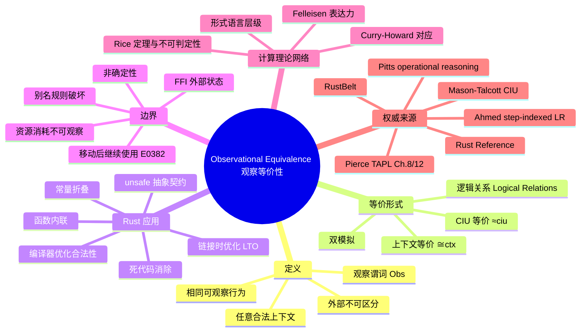

> **内容分级**: [专家级]

# 观察等价性：程序行为的外部不可区分性
>
> **EN**: Observational Equivalence
> **Summary**: Operational semantics notion: two program fragments are observationally equivalent iff every well-typed surrounding context produces the same externally visible behavior, with Rust examples spanning pure functions, ownership moves, unsafe boundaries, and compiler optimizations.
> **Rust 版本**: 1.97.0+ (Edition 2024)
> **受众**: [研究者]
> ⚠️ **声明**: 本文件使用形式化符号辅助直觉理解，所呈现的"定理/引理/推论"为**教学类比**，非经机器验证的严格数学证明。如需严格形式化验证，请参考 [RustBelt](https://plv.mpi-sws.org/rustbelt/)、[Coq](https://coq.inria.fr/)、[Iris](https://iris-project.org/)。
>
> **Bloom 层级**: L4
> **权威来源**: 本文件为 `concept/` 权威页。
> **定位**: 介绍**观察等价性（Observational Equivalence）**——从外部可观察行为的角度定义程序片段是否"相同"，并说明它与操作语义、上下文等价、双模拟以及 Rust 编译器优化、unsafe 边界之间的关系。
> **前置概念**: [操作语义](03_operational_semantics.md) · [指称语义](01_denotational_semantics.md) · [公理语义](05_axiomatic_semantics.md) · [求值策略](04_evaluation_strategies.md) · [所有权形式化](../01_ownership_logic/02_ownership_formal.md)
> **后置概念**: [RustBelt](../02_separation_logic/01_rustbelt.md) · [分离逻辑](../02_separation_logic/02_separation_logic.md) · [Tree Borrows](../01_ownership_logic/05_tree_borrows_deep_dive.md) · [Unsafe Rust](../../03_advanced/02_unsafe/01_unsafe.md)
>
> **来源**: [Rust Reference](https://doc.rust-lang.org/reference/introduction.html) · [RustBelt](https://plv.mpi-sws.org/rustbelt/) · [Pierce — Types and Programming Languages](https://www.cis.upenn.edu/~bcpierce/tapl/) · [Winskel — The Formal Semantics of Programming Languages](https://mitpress.mit.edu/9780262731034) · [arXiv: Contextual Equivalence and Operational Semantics](https://arxiv.org/abs/1808.09835)

---

## 📑 目录

- [观察等价性：程序行为的外部不可区分性](#观察等价性程序行为的外部不可区分性)
  - [📑 目录](#-目录)
  - [一、权威定义（Definition）](#一权威定义definition)
    - [1.1 观察等价性的核心直觉](#11-观察等价性的核心直觉)
    - [1.2 上下文等价（Contextual Equivalence）](#12-上下文等价contextual-equivalence)
    - [1.3 与双模拟（Bisimulation）的关系](#13-与双模拟bisimulation的关系)
    - [1.4 CIU 定理：闭实例使用的同余性](#14-ciu-定理闭实例使用的同余性)
    - [1.5 逻辑关系（Logical Relations）与 Rust unsafe 抽象正确性](#15-逻辑关系logical-relations与-rust-unsafe-抽象正确性)
    - [1.6 在计算理论网络中的位置](#16-在计算理论网络中的位置)
  - [二、Rust 示例](#二rust-示例)
    - [2.1 纯函数表达式的观察等价](#21-纯函数表达式的观察等价)
    - [2.2 所有权移动与借用](#22-所有权移动与借用)
    - [2.3 编译器优化视角：常量折叠、内联与 LTO](#23-编译器优化视角常量折叠内联与-lto)
    - [2.4 unsafe 边界：外部不可观察的内部差异](#24-unsafe-边界外部不可观察的内部差异)
    - [2.5 unsafe 边界反例：违反观察等价的模式](#25-unsafe-边界反例违反观察等价的模式)
  - [三、反命题与边界分析](#三反命题与边界分析)
    - [3.1 反命题树](#31-反命题树)
    - [3.2 边界极限](#32-边界极限)
  - [四、国际权威来源与延伸阅读](#四国际权威来源与延伸阅读)
    - [4.1 观察等价性与上下文等价](#41-观察等价性与上下文等价)
    - [4.2 逻辑关系与 Rust 抽象安全](#42-逻辑关系与-rust-抽象安全)
    - [4.3 计算理论、表达力与 Curry-Howard 背景](#43-计算理论表达力与-curry-howard-背景)
    - [4.4 Rust 官方与工程参考](#44-rust-官方与工程参考)
  - [五、嵌入式测验（Embedded Quiz）](#五嵌入式测验embedded-quiz)
    - [测验 1：观察等价性的核心判断标准是什么？（理解层）](#测验-1观察等价性的核心判断标准是什么理解层)
    - [测验 2：以下两个函数是否观察等价？为什么？（应用层）](#测验-2以下两个函数是否观察等价为什么应用层)
    - [测验 3：为什么 `unsafe` 抽象的安全性可以表述为观察等价问题？（分析层）](#测验-3为什么-unsafe-抽象的安全性可以表述为观察等价问题分析层)
    - [测验 4：CIU 定理与逻辑关系的作用（综合层）](#测验-4ciu-定理与逻辑关系的作用综合层)
    - [测验 5：编译器优化的观察等价基础（应用层）](#测验-5编译器优化的观察等价基础应用层)
  - [🧭 思维导图（Mindmap）](#-思维导图mindmap)
  - [相关概念](#相关概念)

---

## 一、权威定义（Definition）

### 1.1 观察等价性的核心直觉

**观察等价性**（Observational Equivalence）是程序语义中的核心关系：两个程序片段（表达式、函数、模块）在外部观察者眼中"无法区分"，则称它们观察等价。所谓"外部观察者"，是指任何合法的程序上下文（context）：主函数、测试框架、I/O 系统调用，甚至另一个 crate 的代码。

> **教学类比（定义）**
>
> 对于两个 Rust 表达式 `e₁` 与 `e₂`，若对**任意**类型匹配的程序上下文 `C[-]`，填充后得到的完整程序 `C[e₁]` 与 `C[e₂]` 具有相同的外部可观察行为（终止/发散、返回值、I/O、panic 模式），则称：
> $$
e_1 \cong_{\text{obs}} e_2
> $$

"相同的外部可观察行为"通常包括：

| 可观察维度 | 说明 | Rust 实例 |
|:---|:---|:---|
| 终止性 | 是否停机、是否 panic | `panic!()` 与不 panic 的表达式**不等价** |
| 返回值 | 最终返回给上下文的数据 | 相同 `i32` 结果可视为等价 |
| I/O 副作用 | 标准输出、文件、网络 | `println!` 改变可观察行为 |
| 内存错误 | UB、use-after-free、数据竞争 | `unsafe` 代码可能引入不可观察但破坏语义的差异 |

观察等价性**不关注内部实现细节**，只关注外部行为。因此它是编译器优化、重构、抽象屏障的理论基础。

### 1.2 上下文等价（Contextual Equivalence）

在类型化 λ 演算和大多数现代 PL 理论中，"观察等价"与"上下文等价"（Contextual Equivalence）通常被视为同一概念的两种表述：

- **观察等价**强调"外部观察者无法区分"；
- **上下文等价**强调"把所有合法上下文都试一遍仍然无法区分"。

对于 Rust 这类有**所有权和生命周期**的语言，上下文必须是"类型良好且借用检查通过"的。非法上下文（例如制造悬垂引用的上下文）不属于等价性比较的范围——它们会在编译期被拒绝。

> **形式化定义（教学类比）**
>
> 设 `Γ ⊢ e₁ : τ` 且 `Γ ⊢ e₂ : τ` 为 Rust 类型系统中的两个良类型项。给定一个观察谓词 `Obs(·)`（通常取"是否停机/发散/panic 并返回特定值"），称 `e₁` 与 `e₂` 在上下文 `Γ` 下**上下文等价**，记作：
> $$
\Gamma \vdash e_1 \cong_{\text{ctx}} e_2 : \tau
$$
> 当且仅当对任意将类型 `τ` 的洞填充为可观察类型（如 `()`）的合法程序上下文 `C[-]`，都有：
> $$
\text{Obs}(C[e_1]) = \text{Obs}(C[e_2])
$$
>
> 其中"合法"指 `C[e₁]` 与 `C[e₂]` 都通过类型检查与借用检查。该定义直接来自 Pierce 对类型化 λ 演算中上下文等价的陈述（Pierce, 2002, Ch. 8, §8.2）。

上下文等价具有三个关键性质，使其成为编译器优化和抽象屏障的合适基准：

1. **自反性、对称性、传递性**：即它是一个等价关系。
2. **相合性（Congruence）**：若 `e₁ ≅_{ctx} e₂`，则对任意上下文 `C[-]` 也有 `C[e₁] ≅_{ctx} C[e₂]`。这是"可替换即等价"的数学保证。
3. **充分性（Adequacy）**：上下文等价只区分那些确实能在某个上下文中产生不同观察结果的项，不会过粗。

在 Rust 中，借用检查器和生命周期约束进一步限制了合法上下文的集合：某些在 C/C++ 中合法的上下文（如制造悬垂指针）在 Rust 中直接无法通过编译，因此不被纳入等价性比较。这意味着 Rust 的"合法上下文"比无类型语言更小，观察等价性也因此更强。

### 1.3 与双模拟（Bisimulation）的关系

- **操作语义 + 双模拟**：通过逐步转移关系证明两个程序状态互相"模拟"，从而推导观察等价。常用于并发进程、协议验证。
- **观察等价**：更抽象，只要求最终可观察行为一致，不强制逐步对应。

在 Rust 中，[Tree Borrows](../01_ownership_logic/05_tree_borrows_deep_dive.md) 等别名模型使用双模拟思路证明不同借用状态的行为一致性；而观察等价更多用于编译器正确性、优化合法性和 unsafe 抽象契约。

### 1.4 CIU 定理：闭实例使用的同余性

直接枚举所有程序上下文来证明上下文等价往往不可行。Mason 与 Talcott（1991）提出的 **CIU 等价**（Closed Instances of Uses，闭使用的实例）给出了一种更实用的等价刻画：

> **CIU 等价（教学类比）**
>
> 两个项 `e₁`、`e₂` 是 CIU 等价的，当且仅当把它们分别替换到任意**闭合的求值上下文**（reduction context）中时，产生的可观察行为都相同。
>
> 形式化地，`e₁ ≈_{ciu} e₂` 当且仅当对所有闭合替换 `γ` 和所有求值上下文 `R[-]`：
> $$
\text{Obs}(R[\gamma(e_1)]) = \text{Obs}(R[\gamma(e_2)])
$$

CIU 定理的核心结论是：在大多数基于操作语义的类型化语言中（包括带状态的函数式语言），**CIU 等价与上下文等价重合**。

> **CIU 定理（教学类比）**
>
> 若语言的操作语义满足某些标准条件（确定性、类型保持、progress），则对任意良类型项 `e₁, e₂`：
> $$
 e_1 \cong_{\text{ctx}} e_2 \quad\Longleftrightarrow\quad e_1 \approx_{\text{ciu}} e_2
$$

对 Rust 的工程意义是：证明两个表达式观察等价时，只需检验它们在**所有闭合的、单步求值的上下文**中的行为，而不必真的枚举整个 crate 或所有可能的调用者。Pitts（1997）将 CIU 与 operationally-based logical relations 结合，给出了高阶状态化语言的系统证明方法。

### 1.5 逻辑关系（Logical Relations）与 Rust unsafe 抽象正确性

**逻辑关系**是证明上下文等价的另一组强大工具。与直接操作上下文不同，逻辑关系通过**类型索引的关系**来归纳定义等价：两个值在基础类型上等价当且仅当它们产生相同的观察；在函数类型上等价当且仅当把等价参数映射到等价结果；在递归类型、引用类型、多态类型上则通过相应的 clauses 扩展。

Ahmed（2006）针对递归类型和量词类型提出的 **step-indexed logical relations** 解决了非终止（divergence）与自引用类型带来的循环定义问题：关系不是直接定义在完整执行上，而是定义在"剩余 `k` 步"的近似上。若两个项在任意 `k` 步内都无法区分，则它们观察等价。

> **教学类比（step-indexed logical relation）**
>
> 对类型 `τ`，定义一族关系 `V_k(τ)`（值关系）与 `E_k(τ)`（表达式关系），索引 `k` 为允许的剩余计算步数：
>
> - `k = 0` 时所有项都视为等价（无步数可观察差异）；
> - 对函数类型 `τ₁ → τ₂`，`v₁, v₂ ∈ V_k(τ₁ → τ₂)` 当且仅当对所有 `j < k` 和所有 `v₁', v₂' ∈ V_j(τ₁)`，应用 `v₁ v₁'` 与 `v₂ v₂'` 在 `j` 步内产生相同观察。
>
> 这种近似定义规避了直接自引用，是证明递归类型与 unsafe 抽象安全性的关键技术。

在 Rust 中，**RustBelt**（Jung et al., 2018）使用 Iris 高阶分离逻辑与 step-indexed logical relations 来证明：safe API 与其内部 unsafe 实现在所有合法 safe 上下文下观察等价。换句话说，unsafe 抽象的正确性可以被精确表述为逻辑关系问题：内部实现必须落在 safe 接口所诱导的逻辑关系之内。

```rust
/// 一个简化的 safe unsafe 抽象：内部使用裸指针，
/// 但对外提供与“理想借用交换”不可区分的行为。
pub fn safe_swap<T>(a: &mut T, b: &mut T) {
    // std::mem::swap 内部使用 unsafe，但其规约保证：
    // 对任何满足借用检查 safe 上下文，效果等同于逻辑上的值交换。
    std::mem::swap(a, b);
}
```

这里的"效果等同"正是观察等价：调用 `safe_swap(&mut x, &mut y)` 的上下文无法区分这次调用与一个理想化的、不接触内存的"值互换"操作。

### 1.6 在计算理论网络中的位置

观察等价性并非孤立概念，它与可计算性理论、形式语言、数学函数论和表达力研究相互连接：

- **与 Rice 定理的联系**：Rice 定理指出，任何非平凡的程序语义性质都是不可判定的。由于"与某个给定程序观察等价"本身就是一种非平凡语义性质，因此**精确判定两个任意 Rust 程序是否观察等价是不可判定的**。编译器的优化策略因此只能是**安全近似**：保证生成的代码与原程序观察等价，而不是穷尽所有可能的等价变换。详见 [可计算性理论](../11_computational_models/02_computability_theory.md)。
- **与 Curry-Howard 对应的联系**：在"命题即类型，证明即程序"的视角下，两个证明项（程序）若观察等价，则它们对应同一个命题的"相同证明行为"。Curry-Howard 为理解"同一类型的不同实现为何等价"提供了逻辑直觉。详见 [计算的数学函数](../11_computational_models/04_mathematical_functions_of_computation.md)。
- **与形式语言自动机的联系**：程序的可观察行为可以视为一串"输出/状态转移"组成的字（word）。不同表达能力的形式语言层级（正则、上下文无关、图灵可识别）对应不同粒度的"可观察集"。在 Rust 中，解析器组合子（nom/pest/lalrpop/syn）的表达能力选择本质上是在 Chomsky 层级上定位可识别的观察集。详见 [形式语言与自动机](../11_computational_models/03_formal_languages_and_automata.md)。
- **与 Felleisen 表达力的联系**：Felleisen（1991）区分了"计算能力"与"表达能力"。`async/await`、`?`、`try` 块、`for await` 等构造并不提升 Rust 的图灵完备性，但通过局部转换（local translation）与宏展开改变可表达模式；它们能否被其它构造表达，正是一个**表达力等价**问题。详见 [计算模型等价性](../11_computational_models/05_equivalence_of_computational_models.md)。

---

## 二、Rust 示例

### 2.1 纯函数表达式的观察等价

以下两个表达式在 `i32` 类型下观察等价：

```rust
let a = 2 + 3;
let b = 1 + 4;
```

对任意合法上下文，只要读取 `a` 或 `b` 的最终值，都会得到 `5`。因此 `2 + 3 ≅ 1 + 4`。

再看函数级别：

```rust
fn double(x: i32) -> i32 { x * 2 }
fn shift_left(x: i32) -> i32 { x << 1 }
```

对**所有** `i32` 输入，`double(x)` 与 `shift_left(x)` 返回值相同（忽略溢出语义细节时）。在有符号整数不触发 UB 的前提下，二者观察等价。但若上下文观察 CPU 周期或汇编指令，则它们可能不等价——这正是"观察等价性取决于观察能力"的体现。

### 2.2 所有权移动与借用

所有权转移在观察等价中扮演关键角色：

```rust
fn consume(v: Vec<i32>) -> usize { v.len() }

let v1 = vec![1, 2, 3];
let n1 = consume(v1);

let v2 = vec![1, 2, 3];
let n2 = consume(v2);
```

只要 `v1` 与 `v2` 在调用点之前未被其他上下文观察过具体地址，两段代码观察等价：都返回 `3`，且之后都无法再使用 `v1`/`v2`。

但以下情况**不等价**：

```rust
let v = vec![1, 2, 3];
let r = &v;          // 借用
let n = v.len();     // 通过共享借用观察长度
// r 仍可使用
```

与直接移动不同，借用让上下文在函数调用后继续观察 `v`，因此不能简单替换为 `consume(v)`。

### 2.3 编译器优化视角：常量折叠、内联与 LTO

编译器优化合法性的本质，就是证明优化前后程序观察等价。合法的优化必须保证：对任何不依赖未定义行为或实现细节（如地址、执行时间）的上下文，优化后的程序与原程序产生相同的外部可观察结果。

**常量折叠与死代码消除**是最简单的情形：

```rust
fn folded() -> i32 {
    let x = 42;          // 死变量，可被消除
    let y = 10;
    y + 5
}
```

常量折叠与死代码消除后，等价于：

```rust
fn folded() -> i32 { 15 }
```

因为 `x` 从未被外部上下文观察，消除它不改变观察行为。但若 `x` 涉及 `unsafe` 或 `#[no_mangle]` 符号，则优化可能不再合法。

**函数内联**改变的是调用开销，不改变可观察语义：

```rust
#[inline]
fn double(x: i32) -> i32 { x * 2 }

pub fn caller(x: i32) -> i32 {
    double(x) + 1
}
```

在语义层面，内联后的程序等价于：

```rust
pub fn caller_inlined(x: i32) -> i32 {
    x * 2 + 1
}
```

只要 `double` 没有副作用且不被通过函数指针外部观察，替换就是观察等价的。但若 `double` 被取地址（`let f: fn(i32) -> i32 = double;`）或被 `#[no_mangle]` 暴露给外部符号表，内联可能改变可观察行为（例如调试符号、地址唯一性）。

**链接时优化（LTO）**进一步把跨 crate 边界也纳入等价变换。例如：

```rust
mod crate_a {
    pub fn helper(x: i32) -> i32 { x + 1 }
}

// 在 LTO 下，编译器可以把 `helper` 的体跨模块内联到 `caller` 中。
pub fn caller(x: i32) -> i32 {
    crate_a::helper(x) * 2
}
```

在 `Cargo.toml` 中开启 `lto = true` 后，编译器可以把 `helper` 的体跨 crate 内联到 `caller` 中，生成等价于 `(x + 1) * 2` 的代码。这种跨模块变换的合法性同样由观察等价保证：任何只依赖 `caller` 返回值的 safe 上下文都无法区分是否发生了内联。

### 2.4 unsafe 边界：外部不可观察的内部差异

`unsafe` 块是 Rust 中观察等价最容易失效的区域。

```rust
unsafe fn raw_swap(a: *mut i32, b: *mut i32) {
    let t = *a;
    *a = *b;
    *b = t;
}
```

与使用 `std::mem::swap` 的 safe 版本相比，只要调用者满足别名契约（`a` 与 `b` 不重叠），二者观察等价；但若违反契约，`raw_swap` 可能产生 UB，而 `std::mem::swap` 通过借用检查直接阻止这种调用上下文。

因此，**unsafe 抽象的正确性可以表述为**：safe API 与其内部 unsafe 实现在所有合法 safe 上下文下观察等价。

### 2.5 unsafe 边界反例：违反观察等价的模式

并非所有"看起来行为相同"的代码都观察等价。下面这个 `compile_fail` 示例说明：把 `v.len()` 替换为会移动 `v` 的函数，会在某些上下文中破坏借用/移动规则，从而**不是**上下文等价的合法变换。

```rust,compile_fail,E0382
fn main() {
    let v = vec![1, 2, 3];
    let n = consume(v);
    // 下面的代码试图在 `v` 被移动后继续使用它，
    // 这证明 `consume(v)` 与 `v.len()` 在不同上下文中行为不同。
    println!("{} {}", n, v.len());
}

fn consume(v: Vec<i32>) -> usize { v.len() }
```

错误 `E0382` 表明：在 `consume(v)` 之后，`v` 的所有权已转移，后续上下文无法继续使用 `v`。因此 `v.len()`（不移动所有权）与 `consume(v)`（移动所有权）**不是上下文等价的**，存在一个合法上下文能区分它们。

另一个 unsafe 边界反例涉及别名假设。以下代码在 safe Rust 中无法编译，因为编译器拒绝可能破坏别名规则的上下文：

```rust,compile_fail,E0502
fn main() {
    let mut x = 42;
    let r = &x;           // 不可变借用生效
    unsafe {
        let p = &mut x;   // 试图同时创建可变借用
        *p = 0;
    }
    println!("{}", r);    // r 仍被认为有效
}
```

错误 `E0502` 说明：safe 上下文不能构造出同时持有 `&x` 与 `&mut x` 的程序。这也限定了观察等价性的比较范围——只有不制造数据竞争的上下文才被纳入比较。

在 unsafe 代码中，若实现者误以为"内部指针布局不可观察"而违反别名规则，则可能在某些 safe 上下文中引入 UB，从而破坏 safe API 与 unsafe 实现之间的观察等价。这正是 RustBelt 等验证项目要防止的情况。

---

## 三、反命题与边界分析

### 3.1 反命题树

```text
观察不等价的典型场景
│
├── 终止性不同
│   ├── 一个 panic，另一个正常返回
│   └── 一个无限循环，另一个停机
│
├── 返回值不同
│   ├── 相同输入得到不同结果
│   └── 副作用可见差异（I/O、全局变量）
│
├── 借用/生命周期导致上下文非法
│   ├── 替换后借用检查失败
│   └── 产生悬垂引用或数据竞争
│
└── unsafe 边界破坏
    ├── 合法 safe 上下文触发 UB
    └── 内部指针布局假设被外部观察
```

### 3.2 边界极限

1. **非确定性（Non-determinism）**：若程序本身非确定（如并发调度、随机数生成），观察等价需定义在"可能行为集合"上，而非单一轨迹。
2. **资源消耗**：CPU 时间、内存占用通常不被视为"可观察行为"，但在实时系统或侧信道攻击模型中可能成为区分依据。
3. **编译器内部表示**：LLVM IR 层面的 `poison`/`undef` 差异在源语言层面可能观察等价，但在特定架构下可能暴露为 UB。参见 [LLVM IR 中的 Poison、Undefined Behavior 与 Freeze](09_llvm_ir_poison_ub.md)。
4. **FFI 与外部状态**：跨越 FFI 边界时，C 端可以任意读取内存，导致 Rust 端认为"不可观察"的内部布局被外部观察。

---

## 四、国际权威来源与延伸阅读

### 4.1 观察等价性与上下文等价

- **Pierce, B. C. (2002).** *Types and Programming Languages*. MIT Press. ISBN 978-0-262-16209-8. —— 第 8 章（Operational Semantics）与第 12 章（Normal Forms）系统介绍操作语义、求值上下文与上下文等价；第 1 部分奠定类型化 λ 演算基础。[官方页面](https://www.cis.upenn.edu/~bcpierce/tapl/)
- **Winskel, G. (1993).** *The Formal Semantics of Programming Languages*. MIT Press. ISBN 978-0-262-73103-4. —— 形式化语义经典教材，涵盖操作语义、指称语义与等价关系。
- **Pitts, A. M. (1997).** "Operationally-based theories of program equivalence." In *Semantics and Logics of Computation*, edited by A. M. Pitts and P. Dybjer, 241–298. Cambridge University Press. —— 系统阐述基于操作语义的程序等价理论，包括 CIU 定理与 operationally-based logical relations 的证明方法。[在线版本](https://www.cl.cam.ac.uk/~amp12/papers/index.html)
- **Mason, I. A., & Talcott, C. L. (1991).** "Equivalence in functional languages with effects." *Journal of Functional Programming* 1 (3): 287–327. —— 提出并证明 CIU 等价与上下文等价的重合性。

### 4.2 逻辑关系与 Rust 抽象安全

- **Ahmed, A. (2006).** "Step-indexed syntactic logical relations for recursive and quantified types." In *Programming Languages and Systems: 15th European Symposium on Programming (ESOP 2006)*, 69–83. LNCS 3924. Springer. DOI: [10.1007/11693024_6](https://doi.org/10.1007/11693024_6) —— 提出针对递归类型与量词类型的 step-indexed logical relations。
- **Ahmed, A. (2013).** "Logical Relations: A Powerful Hammer for your Research Toolbox." *Programming Languages Mentoring Workshop (PLMW)*, January 2013. —— 面向研究者的逻辑关系综述，涵盖 step-indexed logical relations 在状态、递归类型与模块化验证中的应用。[PDF](http://www.ccs.neu.edu/home/amal/)
- **Ahmed, A., Dreyer, D., & Rossberg, A. (2009).** "State-dependent representation independence." In *Proceedings of the 36th ACM SIGPLAN-SIGACT Symposium on Principles of Programming Languages (POPL 2009)*, 340–353. ACM. DOI: [10.1145/1480881.1480925](https://doi.org/10.1145/1480881.1480925) —— 将 step-indexed logical relations 扩展到高阶状态化抽象，是 RustBelt 等技术的前置基础。
- **Pitts, A. M., & Stark, I. D. B. (1998).** "Operational reasoning for functions with local state." In *Higher Order Operational Techniques in Semantics*, edited by A. D. Gordon and A. M. Pitts, 227–273. Publications of the Newton Institute. Cambridge University Press. —— 给出高阶状态化语言中基于操作语义的推理方法，是理解函数 + 局部状态时观察等价与 logical relations 的经典参考。[PDF](https://www.cl.cam.ac.uk/~amp12/papers/operfl/operfl.pdf)
- **Jung et al. (2018).** *RustBelt: Securing the Foundations of the Rust Programming Language*. POPL 2018. [https://plv.mpi-sws.org/rustbelt/](https://plv.mpi-sws.org/rustbelt/) —— 使用 Iris 高阶分离逻辑证明 Rust 抽象安全，核心证明目标之一即为 safe/unsafe 边界的上下文等价。
- **Jung et al. (2021).** *The Future of Memory Safety in Rust: A Research Perspective*. [arXiv:2103.15320](https://arxiv.org/abs/2103.15320) —— 讨论 Stacked Borrows / Tree Borrows 等别名模型与行为等价。

### 4.3 计算理论、表达力与 Curry-Howard 背景

- **Sipser, M. (2012).** *Introduction to the Theory of Computation*, 3rd ed. Cengage Learning. ISBN 978-1-133-18779-0. —— 第 4–5 章涵盖 Rice 定理、可判定性/可识别性、图灵机等价等可计算性核心内容。
- **Felleisen, M. (1991).** "On the expressive power of programming languages." *Science of Computer Programming* 17 (1–3): 35–75. —— 提出通过"局部变换/宏表达"判定语言构造是否真正提升表达力的框架。[PDF](https://www.cs.tufts.edu/~nr/cs257/archive/matthias-felleisen/expressive-as-published.pdf)
- **Felleisen, M., & Flatt, M. (1998).** "Units: Cool modules for HOT languages." In *Proceedings of the ACM SIGPLAN 1998 Conference on Programming Language Design and Implementation (PLDI 1998)*, 236–248. ACM. DOI: [10.1145/277650.277731](https://doi.org/10.1145/277650.277731) —— 以模块系统为例展示表达力分析在语言设计中的应用。
- **Barendregt, H. P. (1984).** *The Lambda Calculus: Its Syntax and Semantics*, revised ed. Studies in Logic and the Foundations of Mathematics 103. North-Holland. ISBN 978-0-444-87508-2. DOI: [10.1016/B978-0-444-87508-2.50006-X](https://doi.org/10.1016/B978-0-444-87508-2.50006-X) —— λ 演算标准参考书，奠定可计算函数与 Curry-Howard 对应的数学基础。
- **Girard, J.-Y., Taylor, P., & Lafont, Y. (1989).** *Proofs and Types*. Cambridge Tracts in Theoretical Computer Science 7. Cambridge University Press. ISBN 978-0-521-37181-0. —— 系统阐述 Curry-Howard 对应、命题即类型、证明即程序。[PDF](https://www.paultaylor.eu/stable/Proofs+Types.html)
- **Scott, D. S. (1976).** "Data types as lattices." *SIAM Journal on Computing* 5 (3): 522–587. DOI: [10.1137/0205037](https://doi.org/10.1137/0205037) —— 建立 Scott 域与指称语义，为解释递归类型、非终止与不动点提供数学框架。
- **Hopcroft, J. E., Motwani, R., & Ullman, J. D. (2006).** *Introduction to Automata Theory, Languages, and Computation*, 3rd ed. Pearson. ISBN 978-0-321-46225-1. —— 自动机与形式语言标准教材，涵盖泵引理、Myhill-Nerode 定理与 Chomsky 层级。

### 4.4 Rust 官方与工程参考

- **Rust Reference.** [https://doc.rust-lang.org/reference/introduction.html](https://doc.rust-lang.org/reference/introduction.html) —— Rust 官方语义参考，是判断"合法上下文"的 P0 权威来源。
- **The Rust Programming Language (TRPL).** [https://doc.rust-lang.org/book/](https://doc.rust-lang.org/book/) —— Rust 官方学习资料，对所有权、借用、unsafe 边界有权威描述。

---

## 五、嵌入式测验（Embedded Quiz）

### 测验 1：观察等价性的核心判断标准是什么？（理解层）

**题目**: 两个 Rust 表达式在什么条件下可以称为观察等价？

<details>
<summary>✅ 答案与解析</summary>

当且仅当对任意类型匹配且借用检查合法的程序上下文，填充这两个表达式后得到的外部可观察行为（终止性、返回值、I/O、panic 等）都相同。内部实现细节不同不影响观察等价性。
</details>

---

### 测验 2：以下两个函数是否观察等价？为什么？（应用层）

```rust
fn f1(x: i32) -> i32 { x + x }
fn f2(x: i32) -> i32 { x * 2 }
```

<details>
<summary>✅ 答案与解析</summary>

在 `i32` 不触发溢出的前提下，对任意 `i32` 输入返回值相同，因此观察等价。但若上下文能通过编译器内建或硬件性能计数器观察指令级差异，则它们在这种更强观察力下不等价——观察等价性始终相对于"允许的观察手段"定义。
</details>

---

### 测验 3：为什么 `unsafe` 抽象的安全性可以表述为观察等价问题？（分析层）

**题目**: 为什么"safe API 与其内部 unsafe 实现观察等价"是判断 unsafe 抽象是否安全的一种有效视角？

<details>
<summary>✅ 答案与解析</summary>

safe API 向外部保证的行为应与其内部 unsafe 实现在所有合法 safe 上下文下的可观察行为一致。若存在某个合法 safe 上下文能触发 UB 或得到不同结果，说明 unsafe 实现违反了 safe API 的契约，抽象不安全。RustBelt 的核心证明目标之一即为此类上下文等价。
</details>

---

### 测验 4：CIU 定理与逻辑关系的作用（综合层）

**题目**: 直接证明两个 Rust 表达式在所有可能的程序上下文中观察等价非常困难。CIU 定理和 step-indexed logical relations 分别如何简化这一任务？

<details>
<summary>✅ 答案与解析</summary>

- **CIU 定理**：把"所有程序上下文"简化为"所有闭合的求值上下文（uses）"。若两个闭表达式在任意闭合求值上下文中的可观察行为都相同，则它们上下文等价，无需枚举整个 crate 的所有可能调用者。
- **Step-indexed logical relations**：把"所有上下文"转化为按类型结构归纳定义的关系，并通过剩余步数索引处理非终止与递归类型。它提供了一种结构化的证明方法，使 RustBelt 能够证明 safe API 与 unsafe 实现之间的观察等价。

两者共同把原本不可行的"穷举上下文"证明，变成可归纳、可近似处理的证明任务。
</details>

---

### 测验 5：编译器优化的观察等价基础（应用层）

以下哪种优化**不需要**以观察等价作为合法性保证？

- A. 常量折叠：`2 + 3` 替换为 `5`
- B. 函数内联：把 `double(x)` 的体展开到调用点
- C. 链接时优化（LTO）：跨 crate 内联 `helper` 的体
- D. 改变 `pub fn` 的 ABI 以匹配调用约定

<details>
<summary>✅ 答案与解析</summary>

**D. 改变 `pub fn` 的 ABI 以匹配调用约定**。

常量折叠、内联、LTO 都是语义保持变换：在不依赖未定义行为/实现细节的上下文中，优化前后程序的外部可观察行为相同。改变 ABI 虽然也是编译器决策，但它影响的是调用约定层面的接口契约，不直接是"同一程序不同实现之间的观察等价"问题；若 ABI 改变导致外部调用者行为变化，则属于接口变更而非优化。
</details>

---

## 🧭 思维导图（Mindmap）



> **认知功能**: 本 mindmap 从本页「观察等价性」的章节结构提炼，一级分支对应核心主题，叶子节点为关键子概念，可作为本页的快速导航与复习索引。

---

## 相关概念

- [操作语义：程序行为的形式化定义](03_operational_semantics.md)
- [指称语义](01_denotational_semantics.md)
- [公理语义](05_axiomatic_semantics.md)
- [求值策略](04_evaluation_strategies.md)
- [Aeneas Symbolic Semantics（Aeneas 符号化语义）](07_aeneas_symbolic_semantics.md)
- [RustBelt](../02_separation_logic/01_rustbelt.md)
- [Tree Borrows 深度解析](../01_ownership_logic/05_tree_borrows_deep_dive.md)
- [LLVM IR 中的 Poison、Undefined Behavior 与 Freeze](09_llvm_ir_poison_ub.md)
- [可计算性理论](../11_computational_models/02_computability_theory.md)
- [形式语言与自动机](../11_computational_models/03_formal_languages_and_automata.md)
- [计算的数学函数](../11_computational_models/04_mathematical_functions_of_computation.md)
- [计算模型等价性](../11_computational_models/05_equivalence_of_computational_models.md)
