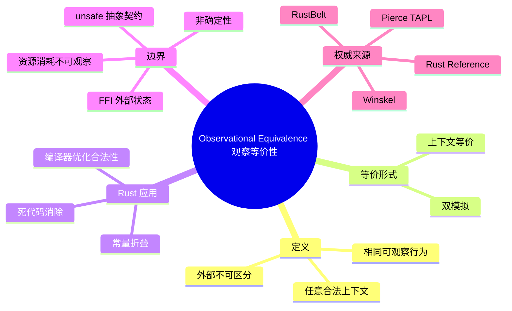

> **内容分级**: [专家级]

# 观察等价性：程序行为的外部不可区分性
>
> **EN**: Observational Equivalence
> **Summary**: Operational semantics notion: two program fragments are observationally equivalent iff every well-typed surrounding context produces the same externally visible behavior, with Rust examples spanning pure functions, ownership moves, unsafe boundaries, and compiler optimizations.
> **Rust 版本**: 1.97.0+ (Edition 2024)
> **受众**: [研究者]
> ⚠️ **声明**: 本文件使用形式化符号辅助直觉理解，所呈现的"定理/引理/推论"为**教学类比**，非经机器验证的严格数学证明。如需严格形式化验证，请参考 [RustBelt](https://plv.mpi-sws.org/rustbelt/)、[Coq](https://coq.inria.fr/)、[Iris](https://iris-project.org/)。
>
> **Bloom 层级**: L4
> **权威来源**: 本文件为 `concept/` 权威页。
> **定位**: 介绍**观察等价性（Observational Equivalence）**——从外部可观察行为的角度定义程序片段是否"相同"，并说明它与操作语义、上下文等价、双模拟以及 Rust 编译器优化、unsafe 边界之间的关系。
> **前置概念**: [操作语义](03_operational_semantics.md) · [指称语义](01_denotational_semantics.md) · [公理语义](05_axiomatic_semantics.md) · [求值策略](04_evaluation_strategies.md) · [所有权形式化](../01_ownership_logic/02_ownership_formal.md)
> **后置概念**: [RustBelt](../02_separation_logic/01_rustbelt.md) · [分离逻辑](../02_separation_logic/02_separation_logic.md) · [Tree Borrows](../01_ownership_logic/05_tree_borrows_deep_dive.md) · [Unsafe Rust](../../03_advanced/02_unsafe/01_unsafe.md)
>
> **来源**: [Rust Reference](https://doc.rust-lang.org/reference/introduction.html) · [RustBelt](https://plv.mpi-sws.org/rustbelt/) · [Pierce — Types and Programming Languages](https://www.cis.upenn.edu/~bcpierce/tapl/) · [Winskel — The Formal Semantics of Programming Languages](https://mitpress.mit.edu/9780262731034) · [arXiv: Contextual Equivalence and Operational Semantics](https://arxiv.org/abs/1808.09835)

---

## 📑 目录

- [观察等价性：程序行为的外部不可区分性](#观察等价性程序行为的外部不可区分性)
  - [📑 目录](#-目录)
  - [一、权威定义（Definition）](#一权威定义definition)
    - [1.1 观察等价性的核心直觉](#11-观察等价性的核心直觉)
    - [1.2 上下文等价（Contextual Equivalence）](#12-上下文等价contextual-equivalence)
    - [1.3 与双模拟（Bisimulation）的关系](#13-与双模拟bisimulation的关系)
  - [二、Rust 示例](#二rust-示例)
    - [2.1 纯函数表达式的观察等价](#21-纯函数表达式的观察等价)
    - [2.2 所有权移动与借用](#22-所有权移动与借用)
    - [2.3 编译器优化视角：常量折叠与死代码消除](#23-编译器优化视角常量折叠与死代码消除)
    - [2.4 unsafe 边界：外部不可观察的内部差异](#24-unsafe-边界外部不可观察的内部差异)
  - [三、反命题与边界分析](#三反命题与边界分析)
    - [3.1 反命题树](#31-反命题树)
    - [3.2 边界极限](#32-边界极限)
  - [四、国际权威来源与延伸阅读](#四国际权威来源与延伸阅读)
  - [五、嵌入式测验（Embedded Quiz）](#五嵌入式测验embedded-quiz)
    - [测验 1：观察等价性的核心判断标准是什么？（理解层）](#测验-1观察等价性的核心判断标准是什么理解层)
    - [测验 2：以下两个函数是否观察等价？为什么？（应用层）](#测验-2以下两个函数是否观察等价为什么应用层)
    - [测验 3：为什么 `unsafe` 抽象的安全性可以表述为观察等价问题？（分析层）](#测验-3为什么-unsafe-抽象的安全性可以表述为观察等价问题分析层)
  - [🧭 思维导图（Mindmap）](#-思维导图mindmap)
  - [相关概念](#相关概念)

---

## 一、权威定义（Definition）

### 1.1 观察等价性的核心直觉

**观察等价性**（Observational Equivalence）是程序语义中的核心关系：两个程序片段（表达式、函数、模块）在外部观察者眼中"无法区分"，则称它们观察等价。所谓"外部观察者"，是指任何合法的程序上下文（context）：主函数、测试框架、I/O 系统调用，甚至另一个 crate 的代码。

> **教学类比（定义）**
>
> 对于两个 Rust 表达式 `e₁` 与 `e₂`，若对**任意**类型匹配的程序上下文 `C[-]`，填充后得到的完整程序 `C[e₁]` 与 `C[e₂]` 具有相同的外部可观察行为（终止/发散、返回值、I/O、panic 模式），则称：
> $$
e_1 \cong_{\text{obs}} e_2
> $$

"相同的外部可观察行为"通常包括：

| 可观察维度 | 说明 | Rust 实例 |
|:---|:---|:---|
| 终止性 | 是否停机、是否 panic | `panic!()` 与不 panic 的表达式**不等价** |
| 返回值 | 最终返回给上下文的数据 | 相同 `i32` 结果可视为等价 |
| I/O 副作用 | 标准输出、文件、网络 | `println!` 改变可观察行为 |
| 内存错误 | UB、use-after-free、数据竞争 | `unsafe` 代码可能引入不可观察但破坏语义的差异 |

观察等价性**不关注内部实现细节**，只关注外部行为。因此它是编译器优化、重构、抽象屏障的理论基础。

### 1.2 上下文等价（Contextual Equivalence）

在类型化 λ 演算和大多数现代 PL 理论中，"观察等价"与"上下文等价"（Contextual Equivalence）通常被视为同一概念的两种表述：

- **观察等价**强调"外部观察者无法区分"；
- **上下文等价**强调"把所有合法上下文都试一遍仍然无法区分"。

对于 Rust 这类有**所有权和生命周期**的语言，上下文必须是"类型良好且借用检查通过"的。非法上下文（例如制造悬垂引用的上下文）不属于等价性比较的范围——它们会在编译期被拒绝。

> **教学类比（引理）**
>
> 若 `e₁` 与 `e₂` 在 Rust 类型系统中具有相同类型 τ，且对任意满足借用检查（borrow-check）的上下文 `C[-] : τ → ()` 都有 `C[e₁]` 与 `C[e₂]` 观察等价，则 `e₁` 与 `e₂` 上下文等价。

### 1.3 与双模拟（Bisimulation）的关系

- **操作语义 + 双模拟**：通过逐步转移关系证明两个程序状态互相"模拟"，从而推导观察等价。常用于并发进程、协议验证。
- **观察等价**：更抽象，只要求最终可观察行为一致，不强制逐步对应。

在 Rust 中，[Tree Borrows](../01_ownership_logic/05_tree_borrows_deep_dive.md) 等别名模型使用双模拟思路证明不同借用状态的行为一致性；而观察等价更多用于编译器正确性、优化合法性和 unsafe 抽象契约。

---

## 二、Rust 示例

### 2.1 纯函数表达式的观察等价

以下两个表达式在 `i32` 类型下观察等价：

```rust
let a = 2 + 3;
let b = 1 + 4;
```

对任意合法上下文，只要读取 `a` 或 `b` 的最终值，都会得到 `5`。因此 `2 + 3 ≅ 1 + 4`。

再看函数级别：

```rust
fn double(x: i32) -> i32 { x * 2 }
fn shift_left(x: i32) -> i32 { x << 1 }
```

对**所有** `i32` 输入，`double(x)` 与 `shift_left(x)` 返回值相同（忽略溢出语义细节时）。在有符号整数不触发 UB 的前提下，二者观察等价。但若上下文观察 CPU 周期或汇编指令，则它们可能不等价——这正是"观察等价性取决于观察能力"的体现。

### 2.2 所有权移动与借用

所有权转移在观察等价中扮演关键角色：

```rust
fn consume(v: Vec<i32>) -> usize { v.len() }

let v1 = vec![1, 2, 3];
let n1 = consume(v1);

let v2 = vec![1, 2, 3];
let n2 = consume(v2);
```

只要 `v1` 与 `v2` 在调用点之前未被其他上下文观察过具体地址，两段代码观察等价：都返回 `3`，且之后都无法再使用 `v1`/`v2`。

但以下情况**不等价**：

```rust
let v = vec![1, 2, 3];
let r = &v;          // 借用
let n = v.len();     // 通过共享借用观察长度
// r 仍可使用
```

与直接移动不同，借用让上下文在函数调用后继续观察 `v`，因此不能简单替换为 `consume(v)`。

### 2.3 编译器优化视角：常量折叠与死代码消除

编译器优化合法性的本质，就是证明优化前后程序观察等价。

```rust
fn optimized() -> i32 {
    let x = 42;          // 死变量，可被消除
    let y = 10;
    y + 5
}
```

常量折叠与死代码消除后，等价于：

```rust
fn optimized() -> i32 { 15 }
```

因为 `x` 从未被外部上下文观察，消除它不改变观察行为。但若 `x` 涉及 `unsafe` 或 `#[no_mangle]` 符号，则优化可能不再合法。

### 2.4 unsafe 边界：外部不可观察的内部差异

`unsafe` 块是 Rust 中观察等价最容易失效的区域。

```rust
unsafe fn raw_swap(a: *mut i32, b: *mut i32) {
    let t = *a;
    *a = *b;
    *b = t;
}
```

与使用 `std::mem::swap` 的 safe 版本相比，只要调用者满足别名契约（`a` 与 `b` 不重叠），二者观察等价；但若违反契约，`raw_swap` 可能产生 UB，而 `std::mem::swap` 通过借用检查直接阻止这种调用上下文。

因此，**unsafe 抽象的正确性可以表述为**：safe API 与其内部 unsafe 实现在所有合法 safe 上下文下观察等价。

---

## 三、反命题与边界分析

### 3.1 反命题树

```text
观察不等价的典型场景
│
├── 终止性不同
│   ├── 一个 panic，另一个正常返回
│   └── 一个无限循环，另一个停机
│
├── 返回值不同
│   ├── 相同输入得到不同结果
│   └── 副作用可见差异（I/O、全局变量）
│
├── 借用/生命周期导致上下文非法
│   ├── 替换后借用检查失败
│   └── 产生悬垂引用或数据竞争
│
└── unsafe 边界破坏
    ├── 合法 safe 上下文触发 UB
    └── 内部指针布局假设被外部观察
```

### 3.2 边界极限

1. **非确定性（Non-determinism）**：若程序本身非确定（如并发调度、随机数生成），观察等价需定义在"可能行为集合"上，而非单一轨迹。
2. **资源消耗**：CPU 时间、内存占用通常不被视为"可观察行为"，但在实时系统或侧信道攻击模型中可能成为区分依据。
3. **编译器内部表示**：LLVM IR 层面的 `poison`/`undef` 差异在源语言层面可能观察等价，但在特定架构下可能暴露为 UB。参见 [LLVM IR 中的 Poison、Undefined Behavior 与 Freeze](09_llvm_ir_poison_ub.md)。
4. **FFI 与外部状态**：跨越 FFI 边界时，C 端可以任意读取内存，导致 Rust 端认为"不可观察"的内部布局被外部观察。

---

## 四、国际权威来源与延伸阅读

- **Pierce, B. C. (2002).** *Types and Programming Languages*. MIT Press. —— 第 1 部分对操作语义与观察等价给出系统介绍。
- **Winskel, G. (1993).** *The Formal Semantics of Programming Languages*. MIT Press. —— 形式化语义经典教材，涵盖操作语义、指称语义与等价关系。
- **Jung et al. (2018).** *RustBelt: Securing the Foundations of the Rust Programming Language*. POPL 2018. [https://plv.mpi-sws.org/rustbelt/](https://plv.mpi-sws.org/rustbelt/) —— 使用 Iris 高阶分离逻辑证明 Rust 抽象安全，核心证明目标之一即为 safe/unsafe 边上下文等价。
- **Jung et al. (2021).** *The Future of Memory Safety in Rust: A Research Perspective*. [arXiv:2103.15320](https://arxiv.org/abs/2103.15320) —— 讨论 Stacked Borrows / Tree Borrows 等别名模型与行为等价。
- **Rust Reference.** [https://doc.rust-lang.org/reference/introduction.html](https://doc.rust-lang.org/reference/introduction.html) —— Rust 官方语义参考，是判断"合法上下文"的 P0 权威来源。
- **arXiv:1808.09835.** *On the Relative Expressiveness of Process Calculi and Programming Languages* —— 包含上下文等价与双模拟关系的讨论（P1 学术来源）。

---

## 五、嵌入式测验（Embedded Quiz）

### 测验 1：观察等价性的核心判断标准是什么？（理解层）

**题目**: 两个 Rust 表达式在什么条件下可以称为观察等价？

<details>
<summary>✅ 答案与解析</summary>

当且仅当对任意类型匹配且借用检查合法的程序上下文，填充这两个表达式后得到的外部可观察行为（终止性、返回值、I/O、panic 等）都相同。内部实现细节不同不影响观察等价性。
</details>

---

### 测验 2：以下两个函数是否观察等价？为什么？（应用层）

```rust
fn f1(x: i32) -> i32 { x + x }
fn f2(x: i32) -> i32 { x * 2 }
```

<details>
<summary>✅ 答案与解析</summary>

在 `i32` 不触发溢出的前提下，对任意 `i32` 输入返回值相同，因此观察等价。但若上下文能通过编译器内建或硬件性能计数器观察指令级差异，则它们在这种更强观察力下不等价——观察等价性始终相对于"允许的观察手段"定义。
</details>

---

### 测验 3：为什么 `unsafe` 抽象的安全性可以表述为观察等价问题？（分析层）

**题目**: 为什么"safe API 与其内部 unsafe 实现观察等价"是判断 unsafe 抽象是否安全的一种有效视角？

<details>
<summary>✅ 答案与解析</summary>

safe API 向外部保证的行为应与其内部 unsafe 实现在所有合法 safe 上下文下的可观察行为一致。若存在某个合法 safe 上下文能触发 UB 或得到不同结果，说明 unsafe 实现违反了 safe API 的契约，抽象不安全。RustBelt 的核心证明目标之一即为此类上下文等价。
</details>

---

## 🧭 思维导图（Mindmap）



> **认知功能**: 本 mindmap 从本页「观察等价性」的章节结构提炼，一级分支对应核心主题，叶子节点为关键子概念，可作为本页的快速导航与复习索引。

---

## 相关概念

- [操作语义：程序行为的形式化定义](03_operational_semantics.md)
- [指称语义](01_denotational_semantics.md)
- [公理语义](05_axiomatic_semantics.md)
- [求值策略](04_evaluation_strategies.md)
- [Aeneas Symbolic Semantics（Aeneas 符号化语义）](07_aeneas_symbolic_semantics.md)
- [RustBelt](../02_separation_logic/01_rustbelt.md)
- [Tree Borrows 深度解析](../01_ownership_logic/05_tree_borrows_deep_dive.md)
- [LLVM IR 中的 Poison、Undefined Behavior 与 Freeze](09_llvm_ir_poison_ub.md)
