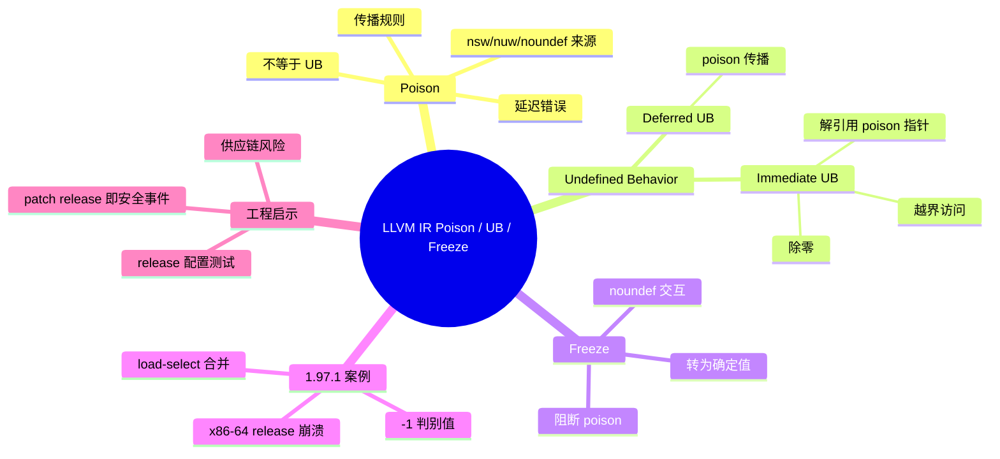

# LLVM IR 中的 Poison、Undefined Behavior 与 Freeze

> **EN**: Poison, Undefined Behavior, and Freeze in LLVM IR
> **Summary**: Explains LLVM IR's poison values, immediate vs. deferred undefined behavior, and the `freeze` instruction, using the Rust 1.97.1 miscompilation as a concrete case study.

> **Rust 版本**: 1.97.1+
> **Bloom 层级**: L4
> **权威来源**: 本文件为 `concept/` 权威页。
> **最后更新**: 2026-07-29

---

## 1. 动机：Rust 1.97.1 的误编译事件

2026-07-16 发布的 Rust 1.97.1 是一个无新特性的 patch release， solely 修复了一个 LLVM 优化 bug。该 bug 的根源在于 LLVM 对条件加载序列做了如下重写：

```text
select cond, (load ptr_1), (load ptr_2)
    === LLVM 优化 ===>
load (select cond, ptr_1, ptr_2)
```

当 `cond` 为普通布尔值时，两种形式等价；但当 `cond` 为 **poison** 时，重写后的形式会立即解引用一个可能无效的指针，从而触发 **undefined behavior**。这正是 LLVM IR 层面 poison 与 UB 相互作用的典型案例。

> 案例详情见 [`concept/07_future/00_version_tracking/rust_1_97_1.md`](../../07_future/00_version_tracking/rust_1_97_1.md)。

---

## 2. Poison Values

### 2.1 什么是 poison？

在 LLVM IR 中，**poison** 是一个特殊的值，表示“某个操作的结果因操作数或标志位不合法而无法产生正常值，但该结果尚未被使用，因此程序行为仍可能是定义良好的”。 poison 可以理解为一种“延迟错误”：它会在被使用时传播，但在未被真正消费之前不会立即导致 UB。

典型的 poison 来源包括：

- 对 `nsw`（no signed wrap）整数加法执行有符号溢出；
- 对 `noundef` 属性标记的返回值返回未定义位模式；
- 对 `undef` 值执行某些操作；
- 对 `exact` 除法产生非精确结果。

### 2.2 poison 与 `undef` 的区别

| 特性 | `undef` | `poison` |
|---|---|---|
| 含义 | “可以是任意值” | “该值非法，但尚未引发 UB” |
| 传播方式 | 被使用时可以“选择”任意值 | 被使用时传播 poison |
| 冻结后 | 变为确定值 | 变为确定值（通过 `freeze`） |
| 典型来源 | 未初始化变量、旧 IR | `nsw`/`nuw`/`noundef` 等优化假设失败 |

### 2.3 poison 的传播规则

大多数操作在任一操作数为 poison 时，结果也是 poison。例如：

```llvm
%a = add nsw i32 %x, %y      ; 若溢出，%a = poison
%b = mul i32 %a, 2           ; %b 也是 poison
```

但 poison 本身不会立即导致 UB；只有当 poison 被用于某些“敏感操作”时，才会升级为 UB。

---

## 3. Undefined Behavior in LLVM IR

### 3.1 Immediate UB

LLVM IR 中的 **immediate UB** 发生在某些操作被执行的瞬间，无论结果是否被后续使用。常见例子：

- 解引用 `poison` 或无效指针；
- `udiv` / `sdiv` / `urem` / `srem` 除以零；
- 内存访问越界；
- `unreachable` 指令被执行；
- `load` 从 `poison` 地址读取。

回到 1.97.1 案例：

```text
原始: select cond, (load ptr_1), (load ptr_2)
变换: load (select cond, ptr_1, ptr_2)
```

当 `cond` 为 poison 时：

- 原始形式：`select` 的结果为 poison，但 poison 只是值，没有解引用，**不触发 UB**。
- 变换形式：`load` 的地址是 `select poison, ptr_1, ptr_2`，即 poison 指针；对 poison 指针执行 `load` 是 **immediate UB**。

### 3.2 Deferred UB

poison 提供了一种“延迟 UB”的机制：错误存在，但只要不传播到敏感操作，程序仍可能表现正常。这种设计允许编译器在假设某些优化条件成立时生成更激进的代码，同时保留在假设失败时通过 poison 传播来暴露问题的能力。

### 3.3 LLVM IR UB 与 Rust 层面 UB 的关系

Rust 的内存安全保证基于以下链条：

```text
Safe Rust 源代码
    ↓（类型检查、borrow check）
MIR
    ↓（MIR → LLVM IR  lowering）
LLVM IR
    ↓（LLVM 优化与代码生成）
机器码
```

Rust 通过所有权和借用规则保证“源代码层面无 UB”。但如果 LLVM 优化器错误地引入了 IR 层面的 UB，则即使 safe Rust 源代码完全合法，最终二进制也可能出现未定义行为。1.97.1 事件正是这种情况。

> 注意：这并不削弱 Rust 所有权模型的价值，而是说明编译器后端的正确性也是安全保证的一部分。

### 3.4 Rust 层面的 poison/UB 类比：`MaybeUninit::uninit().assume_init()`

Rust 标准库中的 `MaybeUninit::uninit().assume_init()` 与 LLVM 的 `poison`/`undef` 有相似的语义效果：它们在**类型系统层面是合法的**，但产生的位模式可能是未初始化的；一旦这些值被实际消费（如参与运算、作为条件分支、或被打印），就会触发未定义行为。

```rust
use std::mem::MaybeUninit;

fn main() {
    // 可以编译，但 x 的位模式未初始化
    let x: i32 = unsafe { MaybeUninit::uninit().assume_init() };
    // 以下行为是 UB：消费了一个可能为 poison/undef 的值
    println!("{}", x);
}
```

> **要点**：`assume_init()` 把“值已初始化”的证明责任交给程序员；如果证明不成立，安全 Rust 代码也会像 LLVM IR 中解引用 poison 指针一样产生 UB。这与 1.97.1 案例的共同点在于——**危险操作在源代码/IR 中看起来合法，但底层语义已失效**。

---

## 4. The `freeze` Instruction

### 4.1 作用

LLVM 提供 `freeze` 指令来“冻结”一个可能是 poison 或 `undef` 的值，将其转换为一个确定的、非 poison 的值：

```llvm
%definite = freeze i32 %maybe_poison
```

`freeze` 保证：

- 如果输入是 poison 或 `undef`，输出是一个任意的 but fixed 的具体值；
- 同一次 `freeze` 调用对同一 poison 输入返回相同值；
- 输出不再是 poison，因此可以用于敏感操作而不会触发 UB。

### 4.2 为什么 `freeze` 能 containment UB？

`freeze` 的核心价值在于**阻断 poison 传播**。在需要保守语义的代码路径上插入 `freeze`，可以将“延迟错误”转换为“确定但可能任意的值”，从而避免 poison 升级为 immediate UB。

例如，若编译器不确定某个值是否为 poison，但需要在条件分支中使用它，可以先 `freeze` 再使用：

```llvm
%cond_safe = freeze i1 %cond_maybe_poison
br i1 %cond_safe, label %then, label %else
```

### 4.3 与 `noundef` 的交互

`noundef` 属性表示“该值不能是 undef 或 poison”。如果函数返回被标记为 `noundef` 但实际返回了 poison，调用方可以视其为 UB。 `freeze` 常用于满足 `noundef` 要求：

```llvm
%ret = freeze i32 %computed   ; 确保返回值不是 poison
call void @foo(i32 noundef %ret)
```

---

## 5. 案例回顾：load-select 合并为何错误

### 5.1 变换前的语义

```text
select cond, (load ptr_1), (load ptr_2)
```

执行顺序：

1. 加载 `ptr_1` 和 `ptr_2`（两者都是有效指针，假设合法程序）；
2. 根据 `cond` 选择其中一个加载结果；
3. 若 `cond` 为 poison，`select` 返回 poison，但**没有解引用 poison 指针**，因此不触发 UB。

### 5.2 变换后的语义

```text
load (select cond, ptr_1, ptr_2)
```

执行顺序：

1. 根据 `cond` 选择 `ptr_1` 或 `ptr_2`；
2. 对选中的指针执行 `load`；
3. 若 `cond` 为 poison，`select` 返回 poison 指针，随后 `load` 解引用 poison 指针，触发 **immediate UB**。

### 5.3 为什么 1.97.0 之前没有崩溃？

在 Rust 1.97.0 之前，触发该路径的 enum 判别值通常是一个小的正整数。即使 LLVM bug 导致越界读取，偏移量也很小，通常仍落在已映射内存内，因此不会 segfault，只是静默地读取了错误数据。

Rust 1.97.0 将 `None` 的判别值改为 `-1`。LLVM 将其解释为大无符号偏移 `2^32 - 1`，导致读取数 GB 之外的未映射页，几乎必然 segfault。

> **形式化验证视角**：此类 IR 变换的语义保持性可以通过 Alive（Lopes et al., 2015）等窥孔优化验证工具来担保；Lee et al. (2017) 则讨论了在 LLVM 中协调高层优化与低层代码表达时如何避免类似的 UB 引入问题。

---

## 6. 反例与常见误解

### 6.1 误解：poison 等同于 UB

**澄清**：poison 本身不是 UB。 poison 是“延迟错误”，只有在传播到敏感操作（如解引用、除零、触发 `unreachable`）时才会升级为 UB。

### 6.2 误解：safe Rust 不可能触发 LLVM 层面的 UB

**澄清**：safe Rust 源代码本身不会触发 Rust 层面的 UB，但如果 LLVM 优化器有 bug，它可能错误地引入 IR 层面的 UB。1.97.1 事件证明 safe Rust 代码也可能因编译器 bug 而生成错误指令。

### 6.3 误解：`freeze` 可以修复所有 poison 问题

**澄清**：`freeze` 只能阻断 poison 传播，不能修复错误的优化逻辑。在 1.97.1 案例中，正确的修复是禁止错误的 load-select 合并，而不是插入 `freeze`。

---

## 7. 对 Rust 工程实践的启示

1. **将编译器正确性纳入供应链风险**：即使使用 safe Rust，仍需关注 rustc / LLVM 的安全公告和 patch release。
2. **及时应用 patch release**：1.97.1 是无新特性的补丁，但直接影响二进制正确性，应视为安全事件响应。
3. **理解 IR 语义有助于定位问题**：当遇到难以解释的崩溃或错误结果时，考虑是否可能是后端优化 bug，而不仅是源代码逻辑问题。
4. **测试覆盖优化构建**：关键路径应在 release 配置下跑集成测试，因为某些优化 bug 只在优化构建下暴露。

---

## 8. 国际权威参考 / International Authority References

- **P0 官方**: [LLVM Language Reference — Poison Values](https://llvm.org/docs/LangRef.html#poison-values)
- **P0 官方**: [LLVM Language Reference — Undefined Behavior](https://llvm.org/docs/LangRef.html#undefined-behavior)
- **P0 官方**: [LLVM Language Reference — freeze Instruction](https://llvm.org/docs/LangRef.html#freeze-instruction)
- **P1 论文**: [Taming Undefined Behavior in LLVM (PLDI 2017)](https://dl.acm.org/doi/10.1145/3062341.3062382) — Lee et al. (2017)
- **P1 论文**: [Alive: Provably Correct Peephole Optimizations (PLDI 2015)](https://doi.org/10.1145/2737924.2737965) — Lopes et al. (2015)
- **P1 技术博客**: [byteiota — Rust 1.97.1: LLVM Miscompilation Fix](https://byteiota.com/rust-1-97-1-llvm-miscompilation-fix/)
- **P1 社区讨论**: [LWN.net — Version 1.97.0 of Rust released](https://lwn.net/Articles/1082032/)
- **P0 官方 issue**: [rust-lang/rust#159035](https://github.com/rust-lang/rust/issues/159035)
- **P0 官方 PR**: [rust-lang/rust#159106](https://github.com/rust-lang/rust/pull/159106)
- **P0 官方**: [Announcing Rust 1.97.1](https://blog.rust-lang.org/2026/07/16/Rust-1.97.1/)

---

## 🧭 思维导图（Mindmap）



---

## 相关概念

- [Rust 1.97.1 稳定补丁](../../07_future/00_version_tracking/rust_1_97_1.md)
- [操作语义](03_operational_semantics.md)
- [公理语义](05_axiomatic_semantics.md)
- [Hoare 逻辑](02_hoare_logic.md)
- [内存模型](../../03_advanced/02_unsafe/06_memory_model.md)
- [LLVM 后端与代码生成](../../06_ecosystem/00_toolchain/09_llvm_backend_and_codegen.md)
