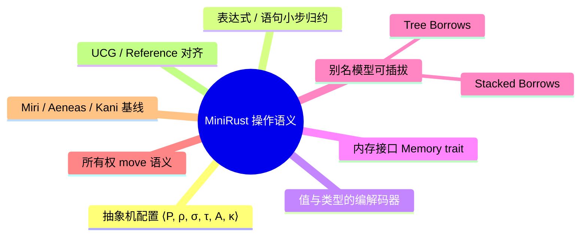

# MiniRust：Rust 操作语义的可执行模型

**EN**: MiniRust: An Executable Operational Semantics for Rust
**Summary**: MiniRust 是 Ralf Jung 等人倡导的 Rust 核心语言可执行小步操作语义，通过显式抽象机状态（表达式/语句、值、类型、内存接口）精确刻画所有权、借用、裸指针与别名模型（Stacked/Tree Borrows）的交互，为 Miri、Aeneas 与 Rust 官方语义规范化提供形式化基线。

> **Rust 版本**: 1.97.0+ (Edition 2024)
> **Bloom 层级**: L4-L5
> **A/S/P 标记**: **S+P** — Structure + Procedure
> **权威来源**: 本文件为 `concept/` 权威页（MiniRust / Rust 可执行操作语义的 project 内 canonical 入口）。
> **最后更新**: 2026-07-31
>
> **前置概念**: [操作语义：程序行为的形式化定义](03_operational_semantics.md) · [Tree Borrows 深度解析](../01_ownership_logic/05_tree_borrows_deep_dive.md) · [Behavior Considered Undefined](../01_ownership_logic/06_behavior_considered_undefined.md) · [Memory Model](../../03_advanced/02_unsafe/06_memory_model.md)
> **后置概念**: [Miri](../04_model_checking/08_miri.md) · [Aeneas Symbolic Semantics](07_aeneas_symbolic_semantics.md) · [Kani](../04_model_checking/09_kani.md) · [async/await 状态机的操作语义](11_async_state_machine_semantics.md) · [Pin 与自引用类型的形式语义](12_pin_and_self_referential_semantics.md)
>
> **国际权威来源**:
> [MiniRust GitHub](https://github.com/minirust/minirust) ·
> [Ralf Jung — MiniRust vision](https://github.com/minirust/minirust) ·
> [Ralf Jung — Tree Borrows blog](https://www.ralfj.de/blog/2023/06/02/tree-borrows.html) ·
> [Tree Borrows paper (PLDI 2025)](https://perso.crans.org/vanile/treebor/) ·
> [Stacked Borrows (POPL 2020)](https://plv.mpi-sws.org/rustbelt/stacked-borrows/) ·
> [Rust Reference — Behavior Considered Undefined](https://doc.rust-lang.org/reference/behavior-considered-undefined.html) ·
> [Unsafe Code Guidelines](https://rust-lang.github.io/unsafe-code-guidelines/)

---

## 0. 定位：为什么需要 MiniRust？

Rust 的编译器（rustc）是一个庞大且不断演进的工程系统，直接用它来做形式化推理非常困难。MiniRust 的做法是：

1. **抽取核心语言子集**：保留所有权、借用、裸指针、enum、struct、函数调用等关键语义，去掉宏、trait 求解、增量编译等实现细节。
2. **给出可执行的小步语义**：用配置 `⟨表达式, 堆, 栈, 权限树⟩` 和转移规则 `→` 精确描述一步归约。
3. **把内存模型参数化**：Stacked Borrows / Tree Borrows 作为可插拔的「别名模型」接入，方便比较两种规则的差异。
4. **为工具提供参考实现**：Miri 的动态检查、Aeneas 的符号化翻译、BorrowSanitizer 的运行时检测都可以对照 MiniRust 的规则验证一致性。

> 与 `rustc` 的关系：MiniRust 不是替代编译器，而是**形式化基线**（formal baseline）。当 Miri 接受某段代码而生产编译器优化后出问题时，可用 MiniRust 判定谁偏离了语义约定。

---

## 1. 核心抽象：表达式、语句、值与配置

MiniRust 把程序状态抽象为抽象机配置（configuration）：

```text
⟨P, ρ, σ, τ, A, κ⟩
```

| 分量 | 含义 | Rust 对应 |
|---|---|---|
| `P` | 当前待执行的程序点（语句/终结符） | MIR 基本块中的语句序列 |
| `ρ` | 局部变量环境（variable → location）| 栈帧中的局部变量表 |
| `σ` | 堆 / 栈内存（location → byte）| 运行时的内存字节 |
| `τ` | 每个内存位置的类型元数据（对齐、有效值、生命周期）| 类型布局与 validity |
| `A` | 别名模型状态（Stacked/Tree Borrows 的 tag 权限）| Miri 的 borrow tracker |
| `κ` | 调用栈 / continuation | unwind、函数返回地址 |

### 1.1 值（Values）与类型（Types）

在 MiniRust 中，**值**是高层结构化对象（如数学整数、元组、枚举变体、指针），而**类型**只是值与底层字节之间的编解码器（codec）。这一分离让「读取未初始化内存」「类型有效性」等概念变得可形式化：

```text
Value ::= Int(n) | Bool(b) | Enum(discr, fields) | Tuple(vals) | Ptr(addr, provenance, tag)
Type  ::= Bool | Int(size) | Tuple(tys) | Enum(variants) | Array(ty, n) | Reference(ty, mut, tag)
```

- **表示关系（representation relation）**：`value : ty` 且 `bytes_of(value) : ty` 同时成立时，才能做类型化读写。
- **指针值**包含地址、provenance（属于哪一次分配）和 tag（Stacked/Tree Borrows 中的借用标识）。

### 1.2 表达式与语句的小步语义

MiniRust 把 MIR 的语句分为赋值、存储、函数调用等，终结符（terminator）负责控制流。核心规则可写成：

```text
⟨assign(place, e); rest, ρ, σ, τ, A⟩
→ ⟨rest, ρ, σ[addr(place) ↦ encode(⟦e⟧, τ(place))], τ, A'⟩
```

其中 `⟦e⟧` 表示在环境 `ρ` 下求值表达式，`A'` 是别名模型对这次写访问的更新结果。

所有权转移规则：

```text
⟨let x = move y; rest, ρ, σ, τ, A⟩
→ ⟨rest, ρ[x↦ρ(y)], σ, τ[y↦invalid], A⟩
```

`move` 把 `y` 对应的 location 标记为**失效**（或保留 provenance 但不可再按原类型读取），这对应 Rust 中「移动后使用」报 `E0382` 的语义根源。

### 1.3 小步归约示例

```text
⟨let mut x = 0; x = 1; x, ρ, σ, τ, A⟩
→ ⟨x = 1; x, ρ[x↦ℓ], σ[ℓ↦0], τ, A⟩
→ ⟨x, ρ[x↦ℓ], σ[ℓ↦1], τ, A⟩
→ 1
```

> 注意：借用 `&x` 不会修改 `σ`，而是生成一个带新 tag 的指针，并在 `A` 中记录 `x` 的权限被共享或重借用。

---

## 2. 内存接口：把内存模型参数化

MiniRust 最重要的设计决策之一是引入**内存接口（memory interface）**：语言语义不直接实现内存，而是对内存提出一组操作原语，让不同的别名模型去实现。

```text
Memory trait:
  fn allocate(&mut self, size, align) -> Pointer
  fn deallocate(&mut self, ptr)
  fn load(&mut self, ptr, ty) -> Result<Value>
  fn store(&mut self, ptr, ty, value) -> Result<()>
  fn retag(&mut self, ptr, kind) -> Pointer
```

这种参数化意味着：

- **基本内存模型（basic memory model）**：只检查对齐与初始化，不追踪别名，适合教学与快速原型。
- **Tree Borrows 内存模型**：把每次 `retag` 看成在借用树中创建子节点，读写时检查节点权限状态机。
- **未来模型**：只要实现同一接口，就可以在 MiniRust 抽象机上替换，从而评估对现有代码的影响。

---

## 3. 借用与别名模型：Stacked vs Tree

MiniRust 把别名模型抽象为一个**可替换模块**。两种模型对同一程序的判定可能不同：

| 场景 | Stacked Borrows | Tree Borrows |
|---|---|---|
| 通过裸指针重新借用后复用原引用 | ❌ 可能判 UB（栈顺序被破坏） | ✅ 允许，父引用仍可读 |
| 共享引用后通过另一共享引用写（无数据竞争前提下）| ❌ 严格禁止 | ❌ 仍禁止 |
| 子树独立演化 | 不支持 | 支持；不同分支可独立失效 |
| 保留两阶段借用（reserved mutable） | 需要特殊处理 | 原生支持 |

### 3.1 Tree Borrows 的权限状态机

每个内存位置的权限是一棵**借用树**：

- **根（root）**：原始分配或 `&mut` 最初产生的引用。
- **子节点**：由父引用重借用（reborrow）产生。
- **状态**：`Active`（可读可写） / `Frozen`（只读） / `Disabled`（不可访问） / `Reserved`（两阶段可变借用的预备态）。

```rust,ignore
// Tree Borrows 允许：父引用在子引用创建后仍可读
let mut data = 0;
let r1: *mut i32 = &mut data;      // 根，tag t0
let r2: *mut i32 = unsafe { &mut *r1 }; // 子，tag t1（从 t0 重借用）
unsafe {
    *r2 = 1;                         // t1 Active 写
    assert_eq!(*r1, 1);              // t0 父引用仍可读
}
```

> 在 Stacked Borrows 中，`r2` 的写会让 `r1` 失效（pop 出栈），`*r1` 可能被判 UB；Tree Borrows 保留父子关系，因此允许。

---

## 4. 与 Miri、Aeneas、Kani 的关系

| 工具 | 如何利用 MiniRust/语义模型 | 区别 |
|---|---|---|
| **Miri** | 直接实现 Tree Borrows，运行时检查 UB | 解释执行，精确但慢；覆盖标准库 |
| **Aeneas** | 从 MIR 翻译到 LLBC，再生成证明义务 | 静态验证，不执行程序 |
| **Kani** | 有界模型检查，把 Rust 代码展开为 SAT/SMT | 关注属性是否成立，不直接模拟别名模型 |
| **MiniRust** | 提供「如果程序按此规则运行会怎样」的参考定义 | 可执行、小步、核心子集 |

> **工程含义**：如果一段 unsafe 代码在 Miri（Tree Borrows）下通过，但在 MiniRust 的某条规则下仍可能 UB，说明该规则比 Miri 更严格或存在实现差异；应优先以 UCG / Rust Reference 的明文规则为准。

---

## 5. 反例：MiniRust 能捕获但类型系统不能的 UB

### 5.1 子借用期间通过父指针写

```rust,ignore
fn main() {
    let mut x = 5;
    let r = &mut x as *mut i32;
    unsafe {
        let s = &mut *r; // 重借用 r
        *r = 10;         // 直接通过 r 写，但 r 已被重借用
        println!("{}", *s);
    }
}
```

**问题**：在 safe 层，编译器看不到裸指针 `r` 与 `s` 的别名关系；MiniRust / Miri 的 Tree Borrows 会发现 `r` 写操作与子借用 `s` 冲突，判定为 UB。

**修正**：避免在子借用存活期间通过父指针写；或在写之前结束子借用的生命周期。

### 5.2 读取未初始化 padding

```rust,ignore
#[repr(C)]
struct WithPadding {
    a: u8,
    b: u32,
}

fn main() {
    let s: WithPadding = unsafe { std::mem::zeroed() };
    let bytes = unsafe {
        std::slice::from_raw_parts(
            &s as *const _ as *const u8,
            std::mem::size_of::<WithPadding>()
        )
    };
    println!("{:?}", &bytes[1..4]); // 读取 padding：UB
}
```

### 5.3 指针 provenance 丢失

```rust,ignore
fn main() {
    let v = vec![1, 2, 3];
    let addr = v.as_ptr() as usize;
    drop(v);
    let _restored = addr as *const i32; // provenance 已失效，解引用即 UB
}
```

---

## 6. 国际权威来源与延伸阅读

- **MiniRust 实现**: [github.com/minirust/minirust](https://github.com/minirust/minirust)
- **MiniRust 愿景**: Ralf Jung, *MiniRust — a precise specification for "Rust lite / MIR plus"* · [GitHub README](https://github.com/minirust/minirust)
- **Tree Borrows 论文**: Villani et al., *Tree Borrows*, PLDI 2025 · [项目页](https://perso.crans.org/vanile/treebor/) · [DOI](https://doi.org/10.1145/3735592)
- **Stacked Borrows 论文**: Jung et al., *Stacked Borrows: An Aliasing Model for Rust*, POPL 2020 · [项目页](https://plv.mpi-sws.org/rustbelt/stacked-borrows/)
- **Ralf Jung 博客**: [Tree Borrows 讲解](https://www.ralfj.de/blog/2023/06/02/tree-borrows.html)
- **Rust 官方**: [Unsafe Code Guidelines](https://rust-lang.github.io/unsafe-code-guidelines/) · [Behavior Considered Undefined](https://doc.rust-lang.org/reference/behavior-considered-undefined.html)
- **相关形式化工作**: [a-mir-formality](https://github.com/rust-lang/a-mir-formality) · [Ferrocene Language Specification](https://spec.ferrocene.dev/)

---

## 7. 思维导图



---

## 8. 后续深化方向

1. 将 MiniRust 配置形式化到 [计算语义框架](../11_computational_models/01_computational_semantics_framework.md) 的「程序 ↔ 图灵机模拟」视角。
2. 在 [Tree Borrows 深度解析](../01_ownership_logic/05_tree_borrows_deep_dive.md) 中补充「从 MiniRust 配置到 borrow tree 的构造算法」。
3. 每季度用 `scripts/check_authority_freshness.py` 复核 MiniRust/Tree Borrows 仓库链接与论文 DOI 的健康度。

## 国际化权威来源补充（International Authority Sources）

- https://arxiv.org/abs/1804.07608

## 国际化权威来源补充（International Authority Sources）

- https://dl.acm.org/doi/10.1145/3158154
- https://rust-unofficial.github.io/patterns/
- https://blog.rust-lang.org/
