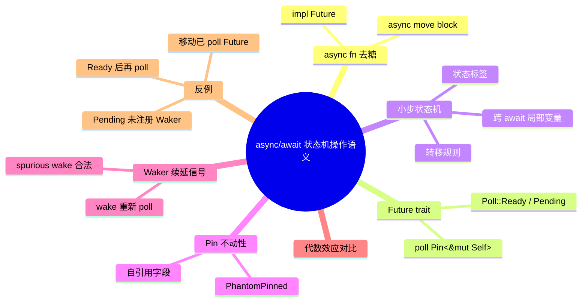

# async/await 状态机的操作语义

**EN**: Operational Semantics of Rust async/await State Machines
**Summary**: 将 Rust 的 `async fn`/`await` 去糖解释为带挂起/恢复的小步状态机，精确刻画 Future trait、Poll 契约、Waker 作为续延信号以及 Pin 不动性在形式语义中的作用。

> **Rust 版本**: 1.97.0+ (Edition 2024)
> **Bloom 层级**: L4-L5
> **A/S/P 标记**: **S+P** — Structure + Procedure
> **权威来源**: 本文件为 `concept/` 权威页（Rust async/await 状态机形式语义的 canonical 入口）。
> **最后更新**: 2026-07-31
>
> **前置概念**: [状态机语义与工作流模型](../../03_advanced/01_async/15_state_machine_semantics.md) · [Future 与 Executor 机制](../../03_advanced/01_async/04_future_and_executor_mechanisms.md) · [Waker 契约深度解析](../../03_advanced/01_async/12_waker_contract_deep_dive.md) · [Pin 与 Unpin](../../03_advanced/01_async/08_pin_unpin.md) · [MiniRust](10_minirust.md)
> **后置概念**: [Pin 与自引用类型的形式语义](12_pin_and_self_referential_semantics.md) · [Send/Sync 并发语义边界](../07_concurrency_semantics/08_send_sync_semantics.md) · [代数效应](../07_concurrency_semantics/04_algebraic_effects.md)
>
> **国际权威来源**:
> [Rust Reference — async functions](https://doc.rust-lang.org/reference/items/functions.html#async-functions) ·
> [std::future::Future](https://doc.rust-lang.org/std/future/trait.Future.html) ·
> [async-book — Execution Model](https://rust-lang.github.io/async-book/01_getting_started/02_why_async.html) ·
> [RFC 2394 — Async/Await](https://rust-lang.github.io/rfcs/2394-async_await.html) ·
> [RFC 2592 — futures_api](https://rust-lang.github.io/rfcs/2592-futures.html) ·
> [RustBelt](https://plv.mpi-sws.org/rustbelt/)

---

## 0. 从语法糖到状态机

Rust 编译器把

```rust,ignore
async fn example(x: i32) -> i32 {
    let y = step1(x).await;
    step2(y).await
}
```

转换为一个**匿名类型**实现 `Future`，其 `poll` 方法根据内部状态分发执行。Rust Reference 给出的去糖规则是：

> An async function is roughly equivalent to a function that returns `impl Future` and with an `async move` block as its body.
> —— [Rust Reference — Async functions](https://doc.rust-lang.org/reference/items/functions.html#async-functions)

形式上，我们可以把它看成带标签转移系统（Labeled Transition System）：

```text
States  = { S0, S1, S2, S3 }
Initial = S0
Final   = S3
Transitions:
  S0 --begin(x)--> S1
  S1 --await step1(x) / Pending--> S1
  S1 --await step1(x) / Ready(y)--> S2
  S2 --await step2(y) / Pending--> S2
  S2 --await step2(y) / Ready(r)--> S3
```

---

## 1. Future trait 与 Poll 契约

```rust,ignore
pub trait Future {
    type Output;
    fn poll(self: Pin<&mut Self>, cx: &mut Context<'_>) -> Poll<Self::Output>;
}

pub enum Poll<T> {
    Ready(T),
    Pending,
}
```

`Future::poll` 是状态机的**单步转移函数**：

- 输入：`Pin<&mut Self>` 保证状态机地址稳定，`Context` 携带 `Waker`。
- 输出：`Poll::Ready(v)` 表示到达终态；`Poll::Pending` 表示需要等待外部事件，且必须已通过某种方式注册 `Waker`。

### 1.1 Poll 契约的形式化

```text
poll : State × Waker → (State' × Poll(Output))  +  UB
```

关键不变量：

1. **幂等性**：对同一个状态机多次调用 `poll` 必须安全；spurious wake 是合法的。
2. **Ready 后不可再 poll**：一旦返回 `Ready`，状态机资源已释放，再次 poll 是 UB。
3. **Pending 必须注册 Waker**：返回 `Pending` 前必须保存 `cx.waker()` 的克隆，否则可能永远不被唤醒。

---

## 2. 小步操作语义

把 async 状态机执行建模为抽象机配置：

```text
⟨S, locals, waker, κ⟩
```

| 分量 | 含义 |
|---|---|
| `S` | 当前状态标签（编译器生成的 enum discriminant） |
| `locals` | 跨 await 存活的局部变量 |
| `waker` | 最近一次 poll 收到的 Waker（用于注册外部事件） |
| `κ` | 调用栈 / continuation |

### 2.1 基本转移规则

```text
(S = S_i  ∧  body_i 可本地推进)
────────────────────────────────────────
⟨S_i, locals, waker, κ⟩ → ⟨S_i', locals', waker, κ⟩

(S = S_i  ∧  body_i 遇到 await fut)
────────────────────────────────────────────────────────────
⟨S_i, locals, waker, κ⟩ → ⟨S_i+1, locals ∪ {saved_fut}, waker', κ⟩
  其中 waker' 已注册到 fut

(S = S_i  ∧  awaited future 返回 Ready(v))
────────────────────────────────────────────
⟨S_i, locals, waker, κ⟩ → ⟨S_i+1, locals[v/x], waker, κ⟩
```

### 2.2 手写 Future 示例

```rust
use std::future::Future;
use std::pin::Pin;
use std::task::{Context, Poll};

/// 教学级手写 Future：三状态状态机
enum ExampleFuture {
    Start(i32),
    WaitingOnStep1(/* future */),
    WaitingOnStep2(i32),
    Done,
}

impl Future for ExampleFuture {
    type Output = i32;

    fn poll(mut self: Pin<&mut Self>, cx: &mut Context<'_>) -> Poll<i32> {
        // 真实编译器生成代码会在这里 match state 并推进
        // 本示例仅展示状态结构
        Poll::Ready(42)
    }
}
```

---

## 3. Pin 与状态机的不动性

`Future::poll` 要求 `Pin<&mut Self>`，因为状态机可能包含**自引用字段**：

```rust,ignore
async fn self_referential() {
    let local = String::from("hello");
    let r = &local;            // 自引用
    std::future::pending::<()>().await;
    println!("{}", r);         // 恢复后仍使用 local 的地址
}
```

编译器生成的状态机类似：

```text
struct __AsyncFuture {
    local: String,
    r: *const String, // 指向 local
    state: u8,
    _pin: PhantomPinned,
}
```

如果 Future 被移动，`local` 地址改变，`r` 悬垂。`Pin` 通过**地址稳定性保证**消除这一问题。详细形式化见 [Pin 与自引用类型的形式语义](12_pin_and_self_referential_semantics.md)。

---

## 4. Waker 作为续延信号

在形式语义中，`Waker` 不是「数据就绪」的承诺，而是**重新 poll 的提示**：

```text
wake : TaskID → Unit
wake(t) 的语义：把任务 t 重新放入执行器就绪队列，未来某个时刻再次调用 poll(t)
```

关键契约：

1. `wake ⟹ 必须重新 poll`。
2. 任意次数、对任意状态的 `wake` 都是合法的（spurious wake）。
3. `Waker::wake` 消耗所有权；`wake_by_ref` 仅借用。

详细实现与记账见 [Waker 契约深度解析](../../03_advanced/01_async/12_waker_contract_deep_dive.md)。

---

## 5. 与代数效应（Algebraic Effects）的关系

Algebraic effects 把 `await`/`yield` 等操作视为**效应操作（effect operation）**，由外层 handler 解释。Rust 的 `async/await` 可视为单一固定 handler 的特化实例：

| 维度 | Rust `async/await` | Algebraic effects |
|---|---|---|
| 控制抽象 | 编译为状态机，隐式 poll/waker | resumable continuation 显式捕获与恢复 |
| 可定制性 | 执行器可定制，Future 语义固定 | handler 可重定义 await/spawn 语义 |
| 表达能力 | 足够 I/O 密集型并发 | 更强，可统一异常、回溯、协程、并发 |

Rust 1.97 尚未引入 language-level effects；`async/await` 是**单一、固定的效应解释**。

---

## 6. 反例与边界

### 6.1 移动已 poll 的 Future

```rust,compile_fail
use std::future::Future;
use std::pin::Pin;
use std::task::{Context, Poll};

async fn foo() {}

fn main() {
    let mut f = foo();
    let _ = Pin::new(&mut f).poll(&mut Context::from_waker(
        &std::task::Waker::noop()
    ));
    let _moved = f; // 若 f 包含自引用，移动即 UB
}
```

> 注：`Waker::noop()` 为 Rust 1.85+ 实验性 API；教学示例使用 `futures::task::noop_waker()` 亦可。

### 6.2 Pending 后未保存 Waker

```rust,ignore
struct BadFuture;

impl Future for BadFuture {
    type Output = ();
    fn poll(self: Pin<&mut Self>, _cx: &mut Context<'_>) -> Poll<()> {
        Poll::Pending // 没有保存 waker，任务将永久挂起
    }
}
```

### 6.3 poll 返回 Ready 后继续 poll

```rust,ignore
struct Once;

impl Future for Once {
    type Output = ();
    fn poll(self: Pin<&mut Self>, _cx: &mut Context<'_>) -> Poll<()> {
        Poll::Ready(())
    }
}

// 对同一个 Once 再次 poll 是 UB（状态机已终态）
```

---

## 7. 国际权威来源

- [Rust Reference — Async functions](https://doc.rust-lang.org/reference/items/functions.html#async-functions)
- [std::future::Future](https://doc.rust-lang.org/std/future/trait.Future.html)
- [async-book — Execution Model](https://rust-lang.github.io/async-book/01_getting_started/02_why_async.html)
- [RFC 2394 — Async/Await](https://rust-lang.github.io/rfcs/2394-async_await.html)
- [RFC 2592 — futures_api](https://rust-lang.github.io/rfcs/2592-futures.html)
- [Plotkin & Pretnar — Handlers of Algebraic Effects, ESOP 2009](https://doi.org/10.1007/978-3-642-00590-9_7)
- [Dolan et al. — Concurrent System Programming with Effect Handlers, TFP 2017](https://doi.org/10.1007/978-3-319-89719-6_6)

---

## 8. 思维导图


