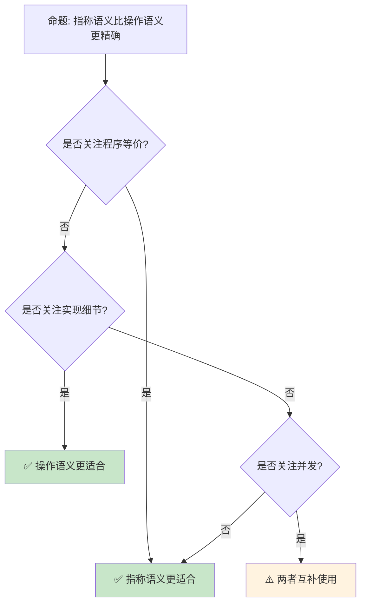

> **内容分级**: [专家级]

# 指称语义与领域理论
>
> **EN**: Denotational Semantics
> **Summary**: Denotational Semantics: formal methods foundations, semantics, and verification techniques relevant to Rust.
> **受众**: [研究者]
> ⚠️ **声明**: 本文件使用形式化符号辅助直觉理解，所呈现的"定理/引理/推论"为**教学类比**，非经机器验证的严格数学证明。如需严格形式化验证，请参考 [Verus](https://github.com/verus-lang/verus)、[Kani](https://model-checking.github.io/kani/)、[Coq](https://coq.inria.fr/)。
>
> **Bloom 层级**: 分析 → 评价
> **定位**: 探讨 Rust 的**指称语义**（Denotational Semantics）基础——从 Scott-Strachey 方法到完备偏序（CPO）、不动点理论，分析 Rust 类型如何通过数学对象赋予意义。
> **前置概念**: [Type Theory](../00_type_theory/02_type_theory.md) · [Operational Semantics](17_operational_semantics.md) · [Linear Logic](../01_ownership_logic/01_linear_logic.md)
> **后置概念**: [Category Theory](../00_type_theory/10_category_theory.md) · [RustBelt](../02_separation_logic/04_rustbelt.md)
>
> **来源**: [Rust Reference](https://doc.rust-lang.org/reference/introduction.html) · [RustBelt](https://plv.mpi-sws.org/rustbelt/) · [Itanium C++ ABI](https://itanium-cxx-abi.github.io/cxx-abi/abi.html)
---

> **来源**:
>
> [The Semantics of Programming Languages (Winskel)](https://www.cl.cam.ac.uk/~gw104/dens.pdf) ·
> [Domain Theory (Abramsky & Jung)](https://www.cs.ox.ac.uk/files/298/handbook.pdf) ·
> [Wikipedia — Denotational Semantics](https://en.wikipedia.org/wiki/Denotational_semantics) ·
> [Wikipedia — Domain Theory](https://en.wikipedia.org/wiki/Domain_theory)
>
> **前置依赖**:
>
> [Traits](../../02_intermediate/00_traits/01_traits.md) ·
> [Generics](../../02_intermediate/01_generics/02_generics.md)
> **前置依赖**: [Concurrency](../../03_advanced/00_concurrency/01_concurrency.md)
> 🚨 **纯数学内容警告**
>
> 本文档包含大量形式化符号（⊗, ⊸, λ, ∀, ∃ 等）和纯数学推导，属于 **[研究者级]** 内容。
> **99.9% 的 Rust 开发者不需要理解这些内容即可编写生产级代码。**
> 如果你只想学习 Rust 工程实践，请直接跳过本文，前往 [L5 生态层](../06_ecosystem) 或 [L3 高级层](../03_advanced)。
> 本文的数学内容仅服务于：PL 研究者、编译器开发者、形式化验证工程师。

## 📑 目录

- [指称语义与领域理论](#指称语义与领域理论)
  - [📑 目录](#-目录)
  - [一、核心概念](#一核心概念)
    - [1.1 指称语义原理](#11-指称语义原理)
    - [1.2 完备偏序（CPO）](#12-完备偏序cpo)
    - [1.3 不动点定理](#13-不动点定理)
  - [二、Rust 的指称解释](#二rust-的指称解释)
    - [2.1 类型即域](#21-类型即域)
  - [十、边界测试：指称语义的编译错误](#十边界测试指称语义的编译错误)
    - [10.1 边界测试：非终止计算与 `loop {}` 的类型（编译错误）](#101-边界测试非终止计算与-loop--的类型编译错误)
    - [10.2 边界测试：`panic!` 的指称与 `Result` 的指称分离（编译错误）](#102-边界测试panic-的指称与-result-的指称分离编译错误)
    - [2.2 所有权即线性性](#22-所有权即线性性)
    - [2.3 生命周期即区域](#23-生命周期即区域)
  - [三、反命题与边界分析](#三反命题与边界分析)
    - [3.1 反命题树](#31-反命题树)
    - [3.2 边界极限](#32-边界极限)
  - [四、常见陷阱](#四常见陷阱)
  - [五、来源与延伸阅读](#五来源与延伸阅读)
  - [相关概念文件](#相关概念文件)
  - [权威来源索引](#权威来源索引)
    - [10.3 边界测试：发散函数（`!`）的指称语义（编译错误）](#103-边界测试发散函数的指称语义编译错误)
    - [10.4 边界测试：`unsafe` 代码的语义鸿沟（运行时 UB）](#104-边界测试unsafe-代码的语义鸿沟运行时-ub)
    - [10.3 边界测试：不动点语义与递归类型的无限展开（编译错误）](#103-边界测试不动点语义与递归类型的无限展开编译错误)
  - [嵌入式测验（Embedded Quiz）](#嵌入式测验embedded-quiz)
    - [测验 1：指称语义（Denotational Semantics）的核心思想是什么？与操作语义有什么区别？（理解层）](#测验-1指称语义denotational-semantics的核心思想是什么与操作语义有什么区别理解层)
    - [测验 2：什么是"域"（Domain）？为什么需要引入 ⊥（bottom）元素？（理解层）](#测验-2什么是域domain为什么需要引入-bottom元素理解层)
    - [测验 3：Rust 的严格求值（strict/eager evaluation）在指称语义中如何体现？（理解层）](#测验-3rust-的严格求值stricteager-evaluation在指称语义中如何体现理解层)
    - [测验 4：不动点定理（Knaster-Tarski）在递归函数语义中起什么作用？（理解层）](#测验-4不动点定理knaster-tarski在递归函数语义中起什么作用理解层)
    - [测验 5：为什么 Rust 不允许直接递归类型（如 `struct List { head: i32, tail: List }`）？这与指称语义中的域有什么关系？（理解层）](#测验-5为什么-rust-不允许直接递归类型如-struct-list--head-i32-tail-list-这与指称语义中的域有什么关系理解层)
  - [认知路径](#认知路径)
    - [核心推理链](#核心推理链)
    - [反命题与边界](#反命题与边界)

---

## 一、核心概念
>
>

### 1.1 指称语义原理
>

```text
指称语义（Denotational Semantics）:

  核心思想: 程序 = 数学函数
  ├── 语法 → 语义: 每个表达式映射到数学对象
  ├── 组合性: 复合表达式的语义由其部分的语义决定
  └── 抽象: 忽略实现细节，关注计算本质

  对比操作语义:
  ┌─────────────────┬─────────────────┬─────────────────┐
  │ 方面            │ 操作语义        │ 指称语义        │
  ├─────────────────┼─────────────────┼─────────────────┤
  │ 关注点          │ 如何计算        │ 计算什么        │
  │ 表示            │ 状态转换        │ 数学函数        │
  │ 等价证明        │ 模拟关系        │ 等式推导        │
  │ 类型安全        │ 逐步验证        │ 良定义性        │
  │ 并发            │ 交织序列        │ 幂域 / 余代数   │
  └─────────────────┴─────────────────┴─────────────────┘
> [来源: [TRPL](https://doc.rust-lang.org/book/title-page.html)]

  基本框架:
  [[_]]: 语法 → 语义域
  [[x + y]] = plus([[x]], [[y]])
  [[if b then x else y]] = cond([[b]], [[x]], [[y]])
```

> **认知功能**: **指称语义回答"程序计算什么"而非"如何计算"**——通过数学抽象揭示程序的本质含义。
> [来源: [Winskel — Semantics of PL](https://www.cl.cam.ac.uk/~gw104/dens.pdf)]

---

### 1.2 完备偏序（CPO）
>

```text
完备偏序（Complete Partial Order）:

  定义: (D, ⊑) 满足:
  ├── 偏序: 自反、反对称、传递
  ├── 最小元 ⊥（bottom）: ∀d ∈ D, ⊥ ⊑ d
  └── 有向集上确界: 每个有向子集都有最小上界

  有向集: 任意两个元素都有上界
  ⊥ ⊑ d₁ ⊑ d₂ ⊑ ... ⊔dᵢ

  连续函数: 保持上确界的单调函数
  f(⊔dᵢ) = ⊔f(dᵢ)

  Rust 类型映射:
  ├── bool: 两元素格 {false ⊑ true} 加 ⊥
  ├── int: 离散集加 ⊥ 和 ⊤（如果有限）
  ├── Option<T>: ⊥ ⊑ None ⊑ Some(d)
  └── 函数类型: 逐点序 f ⊑ g iff ∀x, f(x) ⊑ g(x)
```

> **CPO 洞察**: **CPO 为递归和并发提供了数学基础**——递归函数的语义通过最小不动点定义。
> [来源: [Wikipedia — Domain Theory](https://en.wikipedia.org/wiki/Domain_theory)]

---

### 1.3 不动点定理
>

```text
Kleene 不动点定理:

  定理: 连续函数 f: D → D 在 CPO D 上有最小不动点
  fix(f) = ⊔{fⁿ(⊥) | n ≥ 0}

  证明:
  ├── ⊥ ⊑ f(⊓)（因为 ⊥ 是最小元）
  ├── 单调性: fⁿ(⊥) ⊑ fⁿ⁺¹(⊥)
  ├── 有向链: {⊥, f(⊥), f²(⊥), ...}
  └── 上确界存在（CPO 定义）

  递归函数:
  rec f(x) = if x == 0 then 1 else x * f(x-1)
  [[rec f]] = fix(λF.λx. if x==0 then 1 else x * F(x-1))

  在 Rust 中:
  ├── 递归函数对应不动点
  ├── 类型检查保证终止性（如果可能）
  └── 发散程序映射到 ⊥
```

> **不动点洞察**: **Kleene 不动点定理是递归的数学基础**——所有递归定义都可以通过最小不动点赋予语义。
> [来源: [Abramsky & Jung — Domain Theory](https://www.cs.ox.ac.uk/files/298/handbook.pdf)]

---

## 二、Rust 的指称解释

### 2.1 类型即域
>

## 十、边界测试：指称语义的编译错误

### 10.1 边界测试：非终止计算与 `loop {}` 的类型（编译错误）

```rust,ignore
fn main() {
    // ❌ 编译错误: `loop {}` 的类型是 `!` (never type)，
    // 在 Rust 1.41+ 中可被强制转换为任何类型
    let x: i32 = loop {}; // 无限循环，无返回值
}

// 正确: never type 的指称是底部元素 ⊥
fn diverges() -> ! {
    loop {} // ✅ 返回 never type，表示非终止
}

// never type 可被强制转换为任何类型
fn call_diverges() -> i32 {
    diverges() // ✅ ! → i32 是合法的强制转换
}
```

> **修正**:
> 在指称语义中，类型 `T` 的指称是一个数学域（domain），包含所有可能的值。
> `!`（never type）的指称是**底部元素** `⊥`，表示非终止或 panic。
> `⊥` 是任何域的子集（因为 `⊥ ⊑ v` 对所有 `v` 成立），因此 `!` 可被强制转换为任何类型。
> 这与 Haskell 的 `undefined :: a` 或 Scala 的 `Nothing` 类似——底部类型是所有类型的子类型。
> Rust 的 `!` 类型目前仍在部分特性中不稳定，但核心语义已稳定。
> [来源: [Rust Reference](https://doc.rust-lang.org/reference/introduction.html)]

### 10.2 边界测试：`panic!` 的指称与 `Result` 的指称分离（编译错误）

```rust,ignore
fn may_fail() -> Result<i32, String> {
    // ❌ 编译错误: panic! 返回 !，不是 Result
    // panic 的指称是 ⊥（底部），不是 Err
    panic!("not implemented");
}

// 正确: panic 与 Result 的语义区分
fn may_fail_fixed() -> Result<i32, String> {
    Err("not implemented".to_string()) // ✅ Err 是 Result 的正常变体
}

fn main() {
    // panic 表示编程错误，不应被常规捕获
    // Result 表示预期内的错误，应被调用者处理
}
```

> **修正**:
> 在指称语义中，`panic!` 和 `Result::Err` 有完全不同的指称。
> `panic!` 的指称是 `⊥`（底部）——表示计算失败，栈展开释放资源，通常不应恢复。
> `Result::Err` 的指称是 `Ok(v) ⊑ Err(e)` 域中的一个正常元素——错误是值空间的一部分，可被匹配、传播、转换。
> Rust 强制区分这两种错误模式：`panic` 用于不可恢复错误（bug），`Result` 用于可恢复错误（文件不存在、网络超时）。
> 这与 Java 的异常（Exception vs Error）或 Haskell 的 `Either`（无 panic 机制）形成对比。
> [来源: [The Rust Programming Language](https://doc.rust-lang.org/book/title-page.html)]

```text
Rust 类型的指称:

  基本类型:
  ├── bool: 两元素 CPO {⊥, false, true}
  ├── i32: 离散 CPO，含 ⊥（panic/发散）
  ├── (): 单元素域 {⊥, ()}
  └── ! (never): 空域 {⊥}

  复合类型:
  ├── (T, U): 乘积域 [[T]] × [[U]]
  ├── Option<T>: 提升域 [[T]]⊥
  ├── Result<T, E>: 和域 [[T]] + [[E]]
  └── Vec<T>: 列表域 [[T]]*

  函数类型:
  ├── T → U: 连续函数空间 [[T]] → [[U]]
  ├── 闭包: 环境与代码的配对
  └── 高阶函数: 函数空间的函数
```

> **类型洞察**: **Rust 的代数数据类型直接对应域论构造**——乘积、和、函数空间都是标准域论操作。
> [来源: [Rust Reference — Types](https://doc.rust-lang.org/reference/types.html)]

---

### 2.2 所有权即线性性
>

```text
所有权的指称语义:

  线性逻辑解释:
  ├── owned T: ![[T]] — 指数模态（可释放）
  ├── &T: [[T]] — 共享引用（只读）
  ├── &mut T: [[T]] — 唯一引用（排他）
  └── move: 资源转移 = 线性蕴含消去

  分离逻辑解释:
  ├── owned(x, T): x ↦ [[T]]
  ├── borrow(x, &T): ∃v. x ↦ v * readonly(v)
  └── borrow_mut(x, &mut T): x ↦ v * exclusive(v)

  内存模型:
  ├── 堆: Loc → Val（部分函数）
  ├── 栈: Var → Loc（变量到位置）
  └── 所有权: 堆的分离分解
```

> **所有权（Ownership）洞察**: **Rust 的所有权在指称语义中表现为资源分离**——线性逻辑和分离逻辑提供了精确的数学框架。
> [来源: [RustBelt](https://plv.mpi-sws.org/rustbelt/)]

---

### 2.3 生命周期即区域
>

```text
生命周期的指称解释:

  区域（Region）:
  ├── 时间区间: [birth, death]
  ├── 偏序: 包含关系 r₁ ⊆ r₂
  └── 交集: r₁ ∩ r₂

  生命周期约束:
  ├── 'a: 'b ↔ [[a]] ⊆ [[b]]
  ├── &'a T: T 在区域 'a 内有效
  └── &'a mut T: T 在区域 'a 内唯一有效

  子类型化:
  ├── &'static T <: &'a T（静态引用更通用）
  ├── &'a T <: &'b T if 'a: 'b
  └── 逆变: &'a T 对 'a 逆变

  区域推断:
  ├── HM 类型推断的扩展
  ├── 约束收集: 程序点产生区域约束
  └── 约束求解: 最小区域分配
```

> **生命周期（Lifetimes）洞察**: **生命周期是编译期的区域推断系统**——指称语义中表现为时间区间的集合包含关系。
> [来源: [Rust Reference — Lifetimes](https://doc.rust-lang.org/reference/lifetime-elision.html)]

---

## 三、反命题与边界分析

### 3.1 反命题树
>



> **认知功能**: **指称语义和操作语义各有优势**——等价证明用指称，实现分析用操作。
> [来源: [Winskel — Semantics](https://www.cl.cam.ac.uk/~gw104/dens.pdf)]

---

### 3.2 边界极限
>

```text
边界 1: 非终止性
├── 发散程序映射到 ⊥
├── 但 ⊥ 不区分不同原因的发散
└── 缓解: 使用幂域或余代数

边界 2: 并发
├── 交错语义复杂
├── 需要幂域（Powerdomain）
└── 缓解: 事件结构、余代数方法

边界 3: 状态与突变
├── 纯函数语义难以表达状态
├── 需要单子（Monad）或线性逻辑
└── 缓解: 状态单子、线性类型系统

边界 4: unsafe 代码
├── 类型系统保证失效
├── 需要外部逻辑验证
└── 缓解: 分离逻辑、Iris 框架

边界 5: 高阶类型
├── 依赖类型、GADTs 语义复杂
├── 需要超结构（Hyperdoctrine）
└── 缓解: 范畴语义、立方类型论
```

> **边界要点**: 指称语义的边界与**非终止性**、**并发**、**状态**、**unsafe** 和**高阶类型**相关。
> [来源: [PL Foundations](https://softwarefoundations.cis.upenn.edu/)]

---

## 四、常见陷阱

```text
陷阱 1: 混淆语法与语义
  ❌ 将程序文本等同于其含义
     // 两个语法不同的程序可能有相同语义

  ✅ 区分表示层和含义层
     // [[x + y]] = [[y + x]]（如果 + 可交换）

陷阱 2: 忽略 ⊥ 的处理
  ❌ 假设所有程序都有定义值
     // 发散程序映射到 ⊥

  ✅ 显式处理部分性
     // 使用提升域（lifted domain）

陷阱 3: 混淆不同层级的语义
  ❌ 将操作语义的步骤与指称语义的等式混淆
     // 两者是不同抽象层级

  ✅ 明确使用的语义框架
     // 证明一致性时才关联两者

陷阱 4: 过度抽象
  ❌ 使用复杂数学表示简单概念
     // 增加理解成本

  ✅ 选择合适的抽象级别
     // 简单程序用简单模型
```

> **陷阱总结**: 指称语义的陷阱主要与**语法/语义混淆**、**⊥ 处理**、**语义层级**和**抽象过度**相关。
> [来源: [Semantics Course Notes](https://www.cl.cam.ac.uk/teaching/2021/Semantics/)]

---

## 五、来源与延伸阅读
>

| 来源 | 可信度 | 说明 |
|:---|:---:|:---|
| [Winskel — Semantics](https://www.cl.cam.ac.uk/~gw104/dens.pdf) | ✅ 一级 | 经典教材 |
| [Abramsky & Jung — Domain Theory](https://www.cs.ox.ac.uk/files/298/handbook.pdf) | ✅ 一级 | 领域理论 |
| [Wikipedia — Denotational Semantics](https://en.wikipedia.org/wiki/Denotational_semantics) | ✅ 二级 | 概述 |
| [Wikipedia — Domain Theory](https://en.wikipedia.org/wiki/Domain_theory) | ✅ 二级 | 领域理论 |
| [Software Foundations](https://softwarefoundations.cis.upenn.edu/) | ✅ 一级 | Coq 形式化 |

---

```rust
fn main() {
    // 简单的 lambda 演算风格闭包
    let add = |x: i32| move |y: i32| x + y;
    let add5 = add(5);
    println!("{}", add5(3)); // 8
}
```

```rust
fn main() {
    let compose = |f: fn(i32) -> i32, g: fn(i32) -> i32| {
        move |x: i32| f(g(x))
    };
    let add1 = |x: i32| x + 1;
    let double = |x: i32| x * 2;
    let h = compose(add1, double);
    println!("{}", h(5)); // 11
}
```

## 相关概念文件

- [Type Theory](../00_type_theory/02_type_theory.md) — 类型论
- [Operational Semantics](17_operational_semantics.md) — 操作语义
- [Linear Logic](../01_ownership_logic/01_linear_logic.md) — 线性逻辑
- [Category Theory](../00_type_theory/10_category_theory.md) — 范畴论
- [RustBelt](../02_separation_logic/04_rustbelt.md) — RustBelt

---

> **权威来源**: [Rust Reference](https://doc.rust-lang.org/reference/introduction.html)
>
> **权威来源对齐变更日志**: 2026-05-22 创建 [Authority Source Sprint Batch 11](../../00_meta/02_sources/international_authority_index.md)

**文档版本**: 1.0
**对应 Rust 版本**: 1.96.1+ (Edition 2024)
**最后更新**: 2026-05-22
**状态**: ✅ 概念文件创建完成

---

## 权威来源索引

### 10.3 边界测试：发散函数（`!`）的指称语义（编译错误）

```rust,ignore
fn diverges() -> ! {
    loop {}
}

fn main() {
    let x = diverges();
    // ❌ 编译错误: x 的类型是 !，不能作为值使用
    // 但从指称语义看，diverges() 的语义是 ⊥（底），不返回任何值
    // let y: i32 = x; // ! 可 coerce 为 i32，但不能打印或操作
    println!("{}", x); // ! 未实现 Display
}
```

> **修正**:
>
> 在指称语义中，**底**（bottom，⊥）表示非终止或错误的计算。
> Rust 的 `!` 类型（never type）是 ⊥ 的类型论对应：没有值的类型。
> `diverges() -> !` 的语义是"此函数永不返回"，其"返回值"是 ⊥。
> `!` 可 coerce 为任意类型（ex falso quodlibet），因此 `let y: i32 = diverges()` 合法——但 `diverges()` 永不执行到赋值点，所以 `y` 永远不会被使用。
> 这与 Haskell 的 `undefined :: a`（值层面的 ⊥，有类型但运行时（Runtime）错误）或 Scala 的 `Nothing`（类型层面的 ⊥，无值）类似——Rust 的 `!` 更接近 Scala 的 `Nothing`，是空类型（uninhabited type）。
> `!` 的稳定化使 Rust 的类型系统（Type System）在理论上更完整，支持更精确的控制流分析。
> [来源: [Denotational Semantics](https://en.wikipedia.org/wiki/Denotational_semantics)] ·
> [来源: [Rust RFC 1216](https://rust-lang.github.io/rfcs//1216-bang-type.html)]

### 10.4 边界测试：`unsafe` 代码的语义鸿沟（运行时 UB）

```rust,ignore
fn main() {
    let mut x = 42;
    let r = &mut x as *mut i32;
    unsafe {
        let r2 = r.add(1);
        *r2 = 0; // ❌ 运行时 UB: 越界写入
    }
}
```

> **修正**:
>
> 指称语义为 safe Rust 提供了精确的数学模型，但 `unsafe` 代码打破了这一模型。Safe Rust 的语义保证：没有数据竞争、没有悬垂指针、没有类型混淆。
> `unsafe` 块允许开发者绕过这些保证，但要求手动维护语义不变式。
> 上述代码中，`r.add(1)` 指向 `x` 之后的内存（未分配），写入是未定义行为——指称语义无法描述 `unsafe` 代码的行为，因为 `unsafe` 进入了实现定义的领域。
> 形式化验证工具（Miri、Kani、RustBelt）试图为 `unsafe` 代码建立安全边界：Miri 解释执行检测 UB，Kani 符号验证断言，RustBelt 在分离逻辑中证明 unsafe 抽象的安全性。
> 但完全的形式化覆盖仍是开放问题——`unsafe` 是 Rust 语义中的"已知未知"。
> [来源: [RustBelt Paper](https://doi.org/10.1145/3158154)] ·
> [来源: [The Rustonomicon](https://doc.rust-lang.org/nomicon/index.html)]

### 10.3 边界测试：不动点语义与递归类型的无限展开（编译错误）

```rust,ignore
enum List<T> {
    Nil,
    Cons(T, Box<List<T>>),
}

// 试图创建无限类型（不动点）
// ❌ 编译错误: Rust 不允许直接表达 μX.F(X) 这样的不动点类型
// 需通过递归 enum 间接实现

fn main() {
    let list = List::Cons(1, Box::new(List::Cons(2, Box::new(List::Nil))));
    // 有限的递归结构可以，但无限类型（如 Stream）需用 trait object 或延迟计算
}
```

> **修正**:
> 指称语义（Denotational Semantics）使用**域论**（domain theory）处理递归：递归类型 `μX.F(X)` 定义为 `F` 的最小不动点，包含有限和无限值（惰性求值）。
> Rust 是**严格求值**语言，不支持直接表达无限值（如 Haskell 的无限列表 `[1..]`）。
> Rust 中的无限结构：
>
> 1) **trait object**：`Box<dyn Iterator<Item = i32>>`（运行时（Runtime）延迟计算）；
> 2) **生成器/协程**：`async fn` 或 `gen` 块（2024+）；
> 3) **手动状态机**：`Stream` 实现。递归类型（`List<T>`）在 Rust 中必须间接（`Box` 或 `Rc`），因为编译器需要确定类型大小。
>
> 这与 Haskell 的惰性递归类型（`data List a = Nil | Cons a (List a)`，可无限）或 ML 的惰性 `datatype` 不同——Rust 的严格语义和静态大小要求排除了直接的不动点类型。
> [来源: [Denotational Semantics](https://en.wikipedia.org/wiki/Denotational_semantics)] ·
> [来源: [Domain Theory](https://en.wikipedia.org/wiki/Domain_theory)]

## 嵌入式测验（Embedded Quiz）

### 测验 1：指称语义（Denotational Semantics）的核心思想是什么？与操作语义有什么区别？（理解层）

**题目**: 指称语义（Denotational Semantics）的核心思想是什么？与操作语义有什么区别？

<details>
<summary>✅ 答案与解析</summary>

核心思想：程序的含义是数学对象（函数、域元素），语义的组合是数学函数的组合。操作语义描述"如何执行"，指称语义描述"意味着什么"。
</details>

---

### 测验 2：什么是"域"（Domain）？为什么需要引入 ⊥（bottom）元素？（理解层）

**题目**: 什么是"域"（Domain）？为什么需要引入 ⊥（bottom）元素？

<details>
<summary>✅ 答案与解析</summary>

域是带有偏序关系的数学结构，用于建模计算的近似信息。⊥ 表示"无信息/发散"，使无限计算（如递归、循环）有合法的数学表示。
</details>

---

### 测验 3：Rust 的严格求值（strict/eager evaluation）在指称语义中如何体现？（理解层）

**题目**: Rust 的严格求值（strict/eager evaluation）在指称语义中如何体现？

<details>
<summary>✅ 答案与解析</summary>

函数参数在进入函数体前被求值，对应域语义中函数是严格函数：f(⊥) = ⊥。非严格语言允许 f(⊥) ≠ ⊥。
</details>

---

### 测验 4：不动点定理（Knaster-Tarski）在递归函数语义中起什么作用？（理解层）

**题目**: 不动点定理（Knaster-Tarski）在递归函数语义中起什么作用？

<details>
<summary>✅ 答案与解析</summary>

保证连续函数在完备格上有最小不动点，从而使递归定义（如 `fn fact(n) { if n==0 {1} else {n*fact(n-1)}}`）有良定义的数学含义。
</details>

---

### 测验 5：为什么 Rust 不允许直接递归类型（如 `struct List { head: i32, tail: List }`）？这与指称语义中的域有什么关系？（理解层）

**题目**: 为什么 Rust 不允许直接递归类型（如 `struct List { head: i32, tail: List }`）？这与指称语义中的域有什么关系？

<details>
<summary>✅ 答案与解析</summary>

直接递归类型大小无限，Rust 要求编译期确定大小。需用间接层（`Box<List>`）引入延迟/指针，对应域论中通过展开近似序列构造不动点解。
</details>

## 认知路径

> **认知路径**: 从 L0 基础概念出发，经由本节的 **指称语义与领域理论** 核心原理，通向 L2 进阶模式与 L3 工程实践。

### 核心推理链

| 定理 | 前提 | 结论 | 置信度 |
|:---|:---|:---|:---|
| 指称语义与领域理论 基础定义 ⟹ 正确用法 | 理解语法与语义 | 能写出符合惯用法的代码 | 高 |
| 指称语义与领域理论 正确用法 ⟹ 常见陷阱 | 忽略边界条件 | 编译错误或运行时（Runtime） bug | 高 |
| 指称语义与领域理论 常见陷阱 ⟹ 深度掌握 | 系统学习反模式 | 能进行代码审查与优化 | 高 |

> **过渡**: 掌握 指称语义与领域理论 的基础语法后，下一步需要理解其在类型系统（Type System）中的位置与与其他概念的交互关系。
> **过渡**: 在实践中应用 指称语义与领域理论 时，务必关注边界条件与异常处理，这是从"能编译"到"能生产"的关键跃迁。
> **过渡**: 指称语义与领域理论 的设计理念体现了 Rust 零成本抽象（Zero-Cost Abstraction）与安全保证的核心权衡，理解这一权衡有助于迁移到更高级的并发与形式化验证领域。

### 反命题与边界

> **反命题**:
> "指称语义与领域理论 在所有场景下都是最佳选择" —— 错误。
> 需要根据具体上下文权衡性能、可读性与安全性，某些场景下显式替代方案可能更优。
