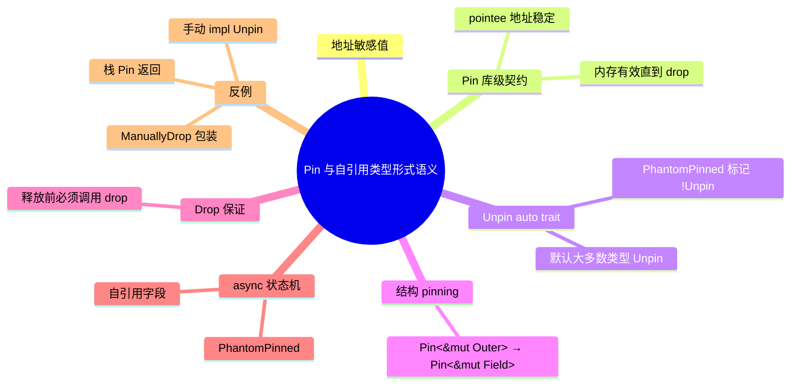

# Pin 与自引用类型的形式语义

**EN**: Formal Semantics of Pin and Self-Referential Types
**Summary**: 将 Rust 的 `Pin<P>` 解释为地址敏感值的库级契约，形式化 `Unpin`、结构 pinning、Drop 保证与自引用类型的不动性不变量，并给出常见反例。

> **Rust 版本**: 1.97.0+ (Edition 2024)
> **Bloom 层级**: L4-L5
> **A/S/P 标记**: **S** — Structure
> **权威来源**: 本文件为 `concept/` 权威页（Pin / 自引用类型形式语义的 canonical 入口）。
> **最后更新**: 2026-07-31
>
> **前置概念**: [Pin 与 Unpin](../../03_advanced/01_async/08_pin_unpin.md) · [状态机语义与工作流模型](../../03_advanced/01_async/15_state_machine_semantics.md) · [async/await 状态机的操作语义](11_async_state_machine_semantics.md) · [MiniRust](10_minirust.md)
> **后置概念**: [Waker 契约深度解析](../../03_advanced/01_async/12_waker_contract_deep_dive.md) · [形式化 unsafe 契约](../01_ownership_logic/07_unsafe_contracts_formal.md)
>
> **国际权威来源**:
> [std::pin module docs](https://doc.rust-lang.org/std/pin/index.html) ·
> [std::pin::Pin](https://doc.rust-lang.org/std/pin/struct.Pin.html) ·
> [std::marker::Unpin](https://doc.rust-lang.org/std/marker/trait.Unpin.html) ·
> [RFC 2349 — Pin](https://github.com/rust-lang/rfcs/pull/2349) ·
> [RFC 2394 — Async/Await](https://rust-lang.github.io/rfcs/2394-async_await.html) ·
> [RustBelt](https://plv.mpi-sws.org/rustbelt/)

---

## 0. 问题：自引用类型的移动陷阱

自引用结构体（self-referential struct）在 Rust 中是一个经典的安全难题：

```rust,ignore
struct SelfRef {
    data: String,
    ptr_to_data: *const u8,  // 指向 data 内部的指针
}

let mut s = SelfRef {
    data: String::from("hello"),
    ptr_to_data: std::ptr::null(),
};
s.ptr_to_data = s.data.as_ptr();  // 自引用

let s2 = s;  // 移动后 ptr_to_data 指向旧地址！
// s2.ptr_to_data 现在悬空
```

> **核心问题**: Rust 默认允许移动值，但自引用结构体（Struct）移动后，内部指针变成**悬空指针**（dangling pointer）。

---

## 1. Pin 的库级契约

`Pin<P>`（其中 `P` 是指针类型）不 pin 指针本身，而是对指针的 **pointee** 作出承诺：

```text
Pin<P> 的语义契约：
  从 Pin<P> 被创建起，直到 pointee 的 drop 返回或 panic，
  pointee 必须保持位于同一内存地址且保持有效。
```

这是一项**库级契约**，不依赖编译器魔法；违反契约的 unsafe 代码会导致 UB。 (Source: [std::pin module docs](https://doc.rust-lang.org/std/pin/index.html))

### 1.1 形式化不变量

```text
∀ t ∈ [t_pin, t_drop) .
  addr(pointee, t) = addr(pointee, t_pin)  ∧  memory_at(addr) valid
```

其中 `t_pin` 是 `Pin` 创建时刻，`t_drop` 是 `Drop::drop` 开始时刻。

---

## 2. Unpin：取消 Pin 的默认安全网

`Unpin` 是 auto trait：

```text
T: Unpin  ⟺  T 没有任何地址敏感状态，移动 T 总是安全的
```

- 几乎所有类型自动实现 `Unpin`。
- 包含 `PhantomPinned` 或 `!Unpin` 字段的类型自动 `!Unpin`。
- `Pin<&mut T>` 在 `T: Unpin` 时可安全解包为 `&mut T`；否则需 `unsafe`。

---

## 3. 结构 Pinning（Structural Pinning）

当类型承诺「被 pin 后，某字段也保持 pin 状态」时，称该字段是**结构 pinned**。投影规则：

```text
structurally pinned field:
  Pin<&mut Outer> → Pin<&mut Field>

not structurally pinned field:
  Pin<&mut Outer> → &mut Field
```

`pin-project` 等 crate 就是自动生成这些投影的安全封装。 (Source: [std::pin module docs](https://doc.rust-lang.org/std/pin/index.html))

---

## 4. Drop 保证

Pinning 不仅要求值不被移动，还要求：

> 在 pointee 的内存被复用或释放之前，必须先调用其 `drop`。

这允许侵入式数据结构（如侵入式双向链表）在 drop 时通知邻居节点移除指针。

```rust,ignore
// 反模式：ManuallyDrop 会抑制 drop，破坏 Pin 的 Drop 保证
let mut pin: Pin<Box<ManuallyDrop<Type>>> = Box::pin(ManuallyDrop::new(Type));
let inner: Pin<&mut Type> = unsafe {
    Pin::map_unchecked_mut(pin.as_mut(), |x| &mut **x)
};
```

---

## 5. 与 async 状态机的关系

`async fn` 编译生成的状态机是典型的地址敏感类型：

```text
async fn example() {
    let local = String::from("hello");
    let r = &local;
    await_something().await;
    println!("{}", r);
}
```

去糖后状态机：

```text
struct ExampleFuture {
    local: String,
    r: *const String, // 指向 local
    state: u8,
    _pin: PhantomPinned, // !Unpin
}
```

`Future::poll` 接收 `Pin<&mut Self>` 正是为了保证 `local` 地址稳定，使 `r` 在挂起/恢复之间始终有效。详见 [async/await 状态机的操作语义](11_async_state_machine_semantics.md)。

---

## 6. 反例与边界

### 6.1 手动实现 `Unpin` 破坏自引用保证

```rust,ignore
use std::pin::Pin;
use std::marker::PhantomPinned;

struct SelfRef {
    data: String,
    ptr: *const String,
    _pin: PhantomPinned,
}

// ⚠️ 逻辑错误：为 !Unpin 类型手动实现 Unpin
unsafe impl Unpin for SelfRef {}

fn main() {
    let mut s = SelfRef { data: String::from("hello"), ptr: std::ptr::null(), _pin: PhantomPinned };
    s.ptr = &s.data;
    let mut pinned = Box::pin(s);
    let moved = std::mem::replace(&mut *pinned, SelfRef { data: String::from("new"), ptr: std::ptr::null(), _pin: PhantomPinned });
    // s.ptr 现在悬垂！运行时 UB
}
```

### 6.2 `Pin<&mut ManuallyDrop<T>>` 不等价于 Pin T

```rust,ignore
use std::pin::Pin;
use std::mem::ManuallyDrop;
use std::marker::PhantomPinned;

struct Inner { _pin: PhantomPinned }

let mut x: ManuallyDrop<Inner> = ManuallyDrop::new(Inner { _pin: PhantomPinned });
// 编译通过：ManuallyDrop<Inner>: Unpin
let pinned: Pin<&mut ManuallyDrop<Inner>> = Pin::new(&mut x);
// 但 ManuallyDrop::take 可安全移出 Inner，破坏 Pin 契约
```

### 6.3 栈上 Pin 返回后悬垂

```rust,compile_fail
use std::pin::Pin;

fn pin_stack() -> Pin<&mut i32> {
    let mut x = 42;
    Pin::new(&mut x) // 错误：返回局部变量引用
}
```

---

## 7. 国际权威来源

- [std::pin module docs](https://doc.rust-lang.org/std/pin/index.html)
- [std::pin::Pin](https://doc.rust-lang.org/std/pin/struct.Pin.html)
- [std::marker::Unpin](https://doc.rust-lang.org/std/marker/trait.Unpin.html)
- [RFC 2349 — Pin](https://github.com/rust-lang/rfcs/pull/2349)
- [RFC 2394 — Async/Await](https://rust-lang.github.io/rfcs/2394-async_await.html)
- [Rustonomicon — Pin](https://doc.rust-lang.org/nomicon/pin.html)

---

## 8. 思维导图


