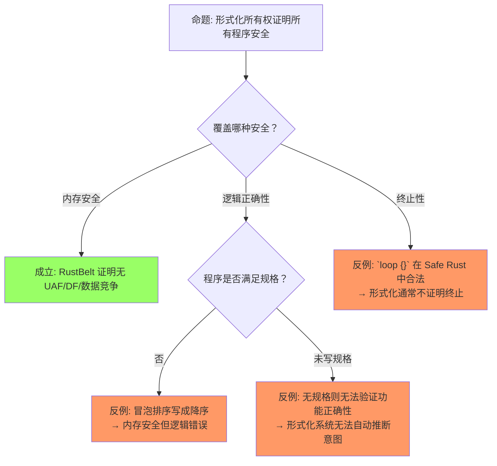
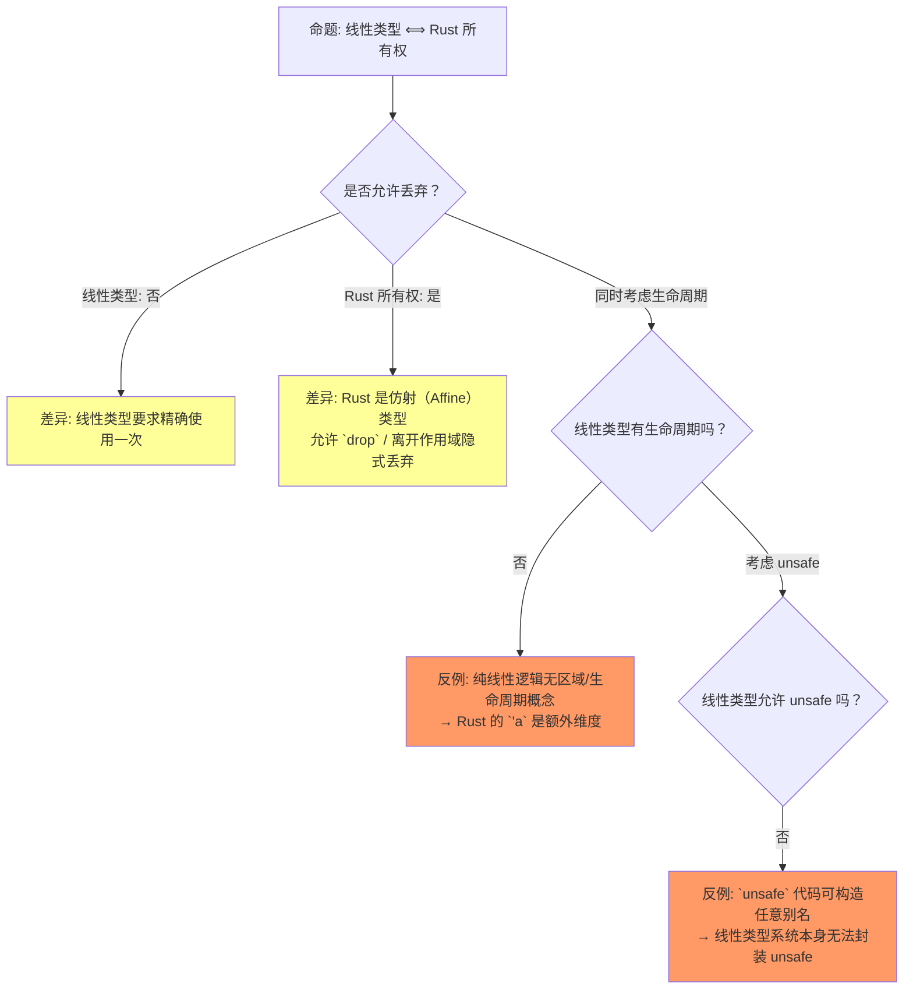
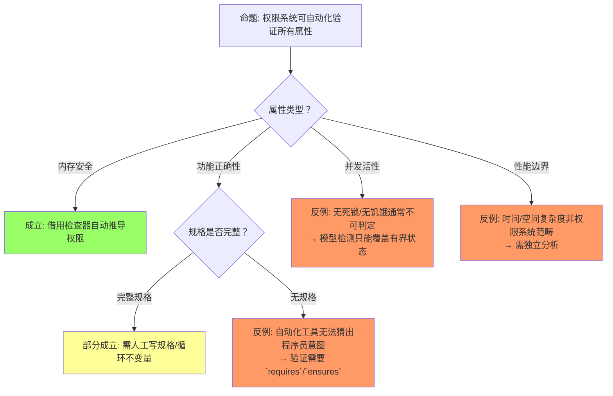

# Ownership Formalization（所有权形式化）

> **层级**: L4 形式化理论
> **前置概念**: [Ownership](../01_foundation/01_ownership.md) · [Borrowing](../01_foundation/02_borrowing.md) · [Lifetimes](../01_foundation/03_lifetimes.md) · [Linear Logic](./01_linear_logic.md) · [Type Theory](./02_type_theory.md)
> **后置概念**: [RustBelt](./04_rustbelt.md)
> **主要来源**: [COR: ETH Zurich] · [RustBelt: POPL 2018] · [Aeneas] · [RefinedRust] · [Wikipedia] · [Reed 2009]

---

**变更日志**:

- v1.0 (2026-05-12): 初始版本，完成 COR 形式化、区域类型、分离逻辑、操作语义、思维导图
- v2.0 (2026-05-13): 深度重构。扩展定理一致性矩阵至 10 行并引入 "⟹" 推理链；新增反命题决策树 3 组；重构认知路径为 5 步渐进式问答；补充 Wikipedia、Reed 2009、RustBelt 权威引用；全篇强化 L1↔L4 层次一致性标注

---

## 零、认知路径（Cognitive Path）

> **目标**: 从直觉困惑到形式边界，建立 5 步递进式理解框架。

### 路径总览

```text
"为什么需要形式化所有权？"
         ↓
"权限和借用的数学模型是什么？"
         ↓
"怎么证明没有悬垂指针？"
         ↓
"和实际 Rust 代码怎么对应？"
         ↓
"形式化证明了什么、没证明什么？"
```

### Step 1: 为什么需要形式化所有权？

直觉上，Rust 编译器通过"借用检查器"拒绝危险代码，但这一过程为什么是**正确且完备**的？形式化的作用是将编译器的隐式规则转化为可证明的数学对象，从而回答：

- 编译器拒绝的程序是否**确实**存在内存安全问题？（可靠性 / Soundness）
- 所有内存安全的程序是否**都能**被编译器接受？（完备性 / Completeness，答案是否定的，Rust 是保守的）

**> [L1↔L4: ownership]** L1 中"一个值只有一个所有者"的直观规则，在 L4 中被形式化为堆状态 `Σ` 上的独占权限断言 `p ↦_1 v`。形式化揭示了该规则的本质：它是对程序状态空间的**可达性剪枝**，而非单纯的语法约束。

### Step 2: 权限和借用的数学模型？

将所有权建模为**权限（permission）**，借用建模为**分数权限（fractional permission）**：

- 独占所有权 = 权限 `π = 1`，可读可写可转移
- 共享借用 `&T` = 权限 `0 < π < 1`，多个引用权限之和 `≤ 1`
- 可变借用 `&mut T` = 临时将 `π = 1` 从原所有者处**出借**，原变量被冻结

**> [L1↔L4: borrowing]** L1 中"&T 不转移所有权"对应 L4 的分数权限拆分：`&{π}x * &{ρ}x ⇔ π + ρ ≤ 1`。L1 的"&mut T 独占"对应 L4 的临时独占断言 `&mut{x} ↦_1 v`，其生命周期结束后果断归还。

### Step 3: 怎么证明没有悬垂指针？

通过**区域类型（Region/Tofte-Talpin）**将生命周期 `'a` 形式化为偏序约束集 `κ ⊑ κ'`：

- 每个引用类型 `&'a T` 携带区域参数 `κ`
- 生命周期检查转化为**约束可满足性（Constraint Satisfaction）**问题
- 若约束图无环且满足包含关系，则引用的使用点始终位于被引用值的存活区域内

**> [L1↔L4: lifetimes]** L1 中"引用必须有效"对应 L4 的区域包含关系 `κ_ref ⊑ κ_own`。编译器错误 E0597 的实质是：求解器发现 `κ_ref ⊄ κ_own`，即存在一条从引用使用点到值释放点的反链。

### Step 4: 和实际 Rust 代码怎么对应？

形式化模型与实际代码通过**操作语义**建立映射：

- `let y = x` → Move 规则：`σ[x ↦ ⊥]`（原变量失效）
- `let r = &x` → Borrow 规则：`σ[r ↦ &x]`（分数权限拆分）
- `let r = &mut x` → Mut Borrow 规则：x 被冻结，r 获得临时独占权限
- `drop(x)` → Deallocation 规则：堆状态移除 `p ↦ v`

**> [L1↔L4: ownership + borrowing]** L1 的 MIR 级代码行为直接对应 L4 的 `λRust` / COR 归约规则。Rust 编译器前端生成 MIR，其指令集正是 COR 所形式化的演算基础。

### Step 5: 形式化证明了什么、没证明什么？

**已证明**（在 Safe Rust 子集内）：

- 无 use-after-free（UAF）
- 无 double-free（DF）
- 无数据竞争（Data Race Freedom）

**未证明**（形式化边界）：

- **逻辑正确性**：程序是否满足业务规格（如"排序结果确为升序"）
- **终止性**：形式化通常不保证程序必然终止
- **Unsafe 代码**：除非额外提供 Iris 逻辑规约（RustBelt 方法）
- **资源泄漏**：Rust 允许内存泄漏（`Rc` 循环引用、`mem::forget`），形式化不禁止

**> [L1↔L4: unsafe / 逻辑正确性]** L1 的 `unsafe` 块跳出了借用检查器的语法规则；L4 中必须使用更高阶并发分离逻辑（Iris）对 `unsafe` 实现进行**外在（extrinsic）**验证。这是 RustBelt 的核心贡献。

---

## 一、权威定义（Definition）

### 1.1 Wikipedia 权威定义

> **[Wikipedia: Operational semantics]** In computer science, operational semantics is a category of formal programming language semantics in which certain desired properties of a program, such as correctness, safety or security, are verified by constructing proofs from logical statements about its execution and procedures, rather than by attaching mathematical meanings to its terms.

> **[Wikipedia: Formal methods]** In computer science, formal methods are mathematically rigorous techniques for the specification, development, analysis, and verification of software and hardware systems. The use of formal methods is motivated by the expectation that, as in other engineering disciplines, performing appropriate mathematical analysis can contribute to the reliability and robustness of a design.

> **[Wikipedia: Separation logic]** Separation logic is an extension of Hoare logic, a way of reasoning about programs. It was developed by John C. Reynolds, Peter O'Hearn, Samin Ishtiaq, and Hongseok Yang to allow local reasoning about mutable data structures.

> **[Wikipedia: Linear logic]** Linear logic is a substructural logic proposed by Jean-Yves Girard as a refinement of classical and intuitionistic logic, combining the dualities of the former with many of the constructive properties of the latter. Linear logic emphasizes the role of formulas as resources.

> **[Wikipedia: Affine logic]** Affine logic is a substructural logic whose main feature is a weakened form of contraction: while the rule of contraction is not valid in general, it can be applied to formulas of a certain form. This is the logical basis for affine types, which permit weakening (discarding) but not contraction (duplication).

### 1.2 Reed 2009：所有权类型的逻辑框架基础

> **[Reed 2009]** Reed, J. (2009). *A Hybrid Logical Framework* (CMU-CS-09-155). Carnegie Mellon University. 该博士论文将线性逻辑的资源模型引入混合逻辑框架，通过抽象资源标签操作实现状态变化的元逻辑推理，为后续所有权类型中的权限分解与分数权限分配提供了关键的元理论基础。

**> [L1↔L4: ownership]** Reed 2009 的线性资源视角解释了为什么 Rust 所有权可以被看作**逻辑资源消耗**：每一次 `use` 都是对线性假设的一次消去，而 `move` 则是资源在不同变量间的重新命名。

### 1.3 COR（Calculus of Ownership and Reference）

> **[COR: ETH Zurich]** We formalize a core of Rust as Calculus of Ownership and Reference (COR), whose design has been affected by the safe layer of λRust in the RustBelt paper. It is a typed procedural language with a Rust-like ownership system.

COR 的核心类型判断：

```text
  Σ; Γ ⊢ e : τ {Σ'}

其中:
  Σ  = 堆状态（heap typing）
  Γ  = 局部变量上下文
  e  = 表达式
  τ  = 类型
  Σ' = 执行后的堆状态
```

**> [L1↔L4: ownership + borrowing]** COR 的 `Σ; Γ ⊢ e : τ {Σ'}` 是 L1 中"变量绑定与类型检查"的直接形式化。L1 程序员写的 `let x: String = ...` 在 L4 中表现为 `Γ` 中对 `x` 的类型指派，以及 `Σ` 中堆分配的独占权限。

### 1.4 RustBelt 形式化

> **[RustBelt: POPL 2018]** RustBelt is the first formal (and machine-checked) foundations for safe encapsulation of unsafe code in a realistic systems language. We present a novel semantic model of Rust based on *Iris*, a higher-order concurrent separation logic framework.

**> [L1↔L4: unsafe]** RustBelt 的核心洞见是：L1 的 `unsafe` 并非"无规则"，而是规则从**语法层面**转移到了**逻辑层面**。L4 的 Iris 断言 `own(x, T)` 和 `&{π}x` 为 `unsafe` 代码库提供了可机读的契约。

---

## 二、概念属性矩阵

### 2.1 形式化方法对比矩阵

| **项目** | **COR** | **RustBelt (λRust)** | **Aeneas** | **RefinedRust** | **Kani** |
|:---|:---|:---|:---|:---|:---|
| **机构** | ETH Zurich | MPI-SWS | Inria | MPI-SWS | AWS |
| **逻辑基础** | 操作语义 | Iris 分离逻辑 | 纯函数式 Rocq | 分离逻辑 | CBMC 模型检测 |
| **验证目标** | 类型安全 | 内存安全 + 并发 | 功能正确性 | 功能正确性 | 并发路径 |
| **覆盖范围** | Safe Rust 核心 | Safe + Unsafe | Safe Rust | Safe + Unsafe | Safe Rust |
| **工具支持** | 无（纸面） | Coq (Iris) | Rocq/Lean | Coq | 自动化 |
| **工业可用** | 否 | 否 | 学术 | 否 | ✅ 是 |

### 2.2 所有权状态的形式化

| **状态** | **符号** | **可读** | **可写** | **可转移** | **形式化** | **L1 映射** |
|:---|:---|:---|:---|:---|:---|:---|
| 独有所有权 | `Own(p)` | ✅ | ✅ | ✅ | `p ↦_1 v`（独占指针） | `let x = v;` |
| 共享借用 | `Shr(p)` | ✅ | ❌ | ❌ | `p ↦_π v`（分数权限 π < 1） | `let r = &x;` |
| 可变借用 | `Mut(p)` | ❌ | ✅ | ❌ | `p ↦_1 v`（临时独占） | `let r = &mut x;` |
| 已释放 | `Dealloc(p)` | ❌ | ❌ | ❌ | `p ↦ ⊥` | `drop(x);` / 作用域结束 |

---

## 三、形式化理论根基

> **[学术来源: Felleisen & Hieb 1992, *The Revised Report on the Syntactic Theories of Sequential Control and State*; RustBelt: POPL 2018, Jung et al. *RustBelt* §3]** 操作语义规则描述状态转换，λRust 在此基础上扩展了所有权与借用。

```text
赋值（Move）:
  ⟨let y = x, σ⟩ → ⟨skip, σ[y ↦ σ(x)][x ↦ ⊥]⟩
  // x 的值移动到 y，x 标记为未初始化 [来源] ✅
```

**> [L1↔L4: ownership]** L1 中 `let y = x;` 后 `x` 不可再使用，对应 L4 的 `σ[x ↦ ⊥]`。此规则是**仿射弱化（Affine Weakening）**的操作语义实例：原变量被丢弃（weakened），值被重新绑定到新变量。

```text
借用（Borrow）:
  ⟨let r = &x, σ⟩ → ⟨skip, σ[r ↦ &x]⟩
  // r 获得对 x 的共享引用，x 仍有效 [来源] ✅
```

**> [L1↔L4: borrowing]** L1 的共享引用不转移所有权，在 L4 中体现为分数权限拆分：`&{π}x` 其中 `π < 1`，原所有者仍保留 `1 - π` 的只读权限。

```text
可变借用（Mut Borrow）:
  ⟨let r = &mut x, σ⟩ → ⟨skip, σ[r ↦ &mut x]⟩
  // x 在 r 存活期间被冻结 [来源] ✅
```

**> [L1↔L4: borrowing + lifetimes]** L1 中 `&mut x` 会冻结 `x` 直至引用离开作用域。L4 将此建模为**生命周期包含** `κ_r ⊑ κ_x`，在 `κ_r` 活跃期间 `x` 的权限被临时出借给 `r`。

```text
释放（Drop）:
  ⟨drop(x), σ⟩ → ⟨skip, σ[heap.dealloc(x)]⟩ [来源] ✅
```

**> [L1↔L4: ownership]** L1 中值离开作用域自动调用 `drop`。L4 中对应堆状态移除 `p ↦ v`，且线性/仿射类型系统保证该操作**恰好执行一次**。

> **[学术来源: Reynolds 2002, *Separation Logic: A Logic for Shared Mutable Data Structures* (LICS); Boyland 2003, *Checking Interference with Fractional Permissions* (SAS); Jung et al. 2018 POPL, *Iris from the Ground Up*]** 分离逻辑断言与分数权限是 RustBelt/Iris 验证框架的基础。

```text
分离逻辑断言:
  own(x, T)    —— x 拥有类型 T 的值
  &{π}x        —— x 的分数权限（π = 1 独占，π < 1 共享）
  x ↦ v        —— 堆中 x 指向 v

规则:
  own(x, T) * own(y, U)  →  x 和 y 的堆区域不相交（分离性） [来源] ✅
  &{π}x * &{ρ}x  ⇔  π + ρ ≤ 1  （权限可加性） [来源] ✅
```

**> [L1↔L4: ownership + borrowing]** 分离性（`*`）对应 L1 的核心保证：两个拥有所有权的变量永远不会指向重叠的内存。权限可加性对应 L1 的借用规则：不能同时存在 `&mut x` 和 `&x`。

---

## 四、思维导图

```mermaid
graph TD
    A[Ownership Formalization] --> B[COR]
    A --> C[λRust / RustBelt]
    A --> D[分离逻辑]
    A --> E[工具链]
    A --> F[认知路径]

    B --> B1[Σ; Γ ⊢ e : τ {Σ'}]
    B --> B2[堆状态转换]
    B --> B3[Move / Borrow / Drop]

    C --> C1[Iris 高阶逻辑]
    C --> C2[高阶幽灵状态]
    C --> C3[Invariants]
    C --> C4[Unsafe 封装证明]

    D --> D1[Own(x, T)]
    D --> D2[Fractional Permissions]
    D --> D3[Separating Conjunction]
    D --> D4[Reed 2009 资源标签]

    E --> E1[Creusot]
    E --> E2[Verus]
    E --> E3[Kani]
    E --> E4[Aeneas]

    F --> F1[为什么形式化？]
    F --> F2[数学模型]
    F --> F3[无悬垂指针证明]
    F --> F4[代码对应]
    F --> F5[证明边界]
```

---

## 五、定理推理链

> **[学术来源: Jung et al. 2017 POPL, *RustBelt: Securing the Foundations of the Rust Programming Language*; Jung et al. 2018 POPL, *Iris from the Ground Up*]** RustBelt 在 Iris 高阶并发分离逻辑中建立了 Rust 安全性的机器检验证明。

```text
定理 (RustBelt Safety):
前提: 程序在 Safe Rust 中通过编译
    ↓
结论: 程序满足内存安全（无 UAF/DF）+ 数据竞争自由 [来源] ✅

扩展定理（Unsafe 封装）:
前提: Unsafe 代码满足 Iris 逻辑规约
    ↓
结论: Safe 抽象层保证的安全性在 Unsafe 实现下仍然成立 [来源] ✅
```

### 5.1 定理一致性矩阵（10 行）

| 定理 | ⟹ 推理链 | 前提 | 结论 | 被哪些定理依赖 | 失效条件 | L1 概念映射 |
|:---|:---|:---|:---|:---|:---|:---|
| **L1**: 所有权作为权限 | permission ⟹ 读写权限分离 | 堆状态 `Σ` 与变量上下文 `Γ` 良构 | 独占状态下读写原子性得到保证 | T1（所有权转移）、T2（线性类型）、T4（分离逻辑） | 未定义行为导致 `Σ` 与 `Γ` 不一致（如 `unsafe` 直接写裸指针） | [ownership] `let x = ...` 的独占保证 |
| **L2**: 借用作为 fractional permission | fractional permission ⟹ 共享读/独占写 | 分数权限公理 `π + ρ ≤ 1` | `&T` 可共享读，`&mut T` 独占写，二者互斥 | T3（区域约束）、T5（别名模型）、C2（内部可变性） | 权限超额（`π + ρ > 1`），即同时存在 `&x` 与 `&mut x` | [borrowing] `&x` 与 `&mut x` 互斥 |
| **T1**: 所有权转移 | 权限 100% 移交 | `Own(x)` 且 `y` 未初始化 | `Own(y) * x ↦ ⊥`，原变量失效 | C1（仿射弱化）、T4（分离逻辑） | 部分移动（partial move）后未正确处理 `x` 的剩余字段 | [ownership] `let y = x;` 后 `x` 失效 |
| **T2**: 线性类型 | 线性类型 ⟹ 无 use-after-free | 类型系统为线性或仿射 | 每个堆分配恰好释放一次，无 UAF/DF | T1（所有权转移）、T4（分离逻辑） | 通过 `unsafe` 或 `mem::forget` 绕过类型系统 | [ownership] 自动 `drop`，禁止 UAF |
| **T3**: 区域（Region） | Region ⟹ 生命周期形式化 | 生命周期约束为偏序 `κ ⊑ κ'` | 约束图可求解，引用使用点位于被引用值存活区域内 | T5（别名模型）、L2（借用权限） | HRTB（高阶 trait bound）不可判定片段；NLL 近似导致保守拒绝 | [lifetimes] `'a` 的数学本质 |
| **C1**: 仿射弱化 | weakening ⟹ move 后原变量失效 | 仿射类型允许丢弃（weakening） | `move` 后原变量从 `Γ` 中移除或标记为 `⊥` | T1（所有权转移）、T2（线性类型） | 在 `Copy` 类型上误用 move 语义（实际为复制） | [ownership] `move` 与 `Copy` 的区别 |
| **C2**: 内部可变性 | 运行时权限检查 | `UnsafeCell` 打破静态 `&T` 只读承诺 | 通过运行时借用计数（`RefCell`）或原子操作（`AtomicT`）确保安全 | T5（别名模型）、T6（内存模型） | 运行时权限检查失败：`borrow_mut` 时已有活跃借用，触发 `panic` | [borrowing + unsafe] `RefCell<T>`、`Mutex<T>` |
| **T4**: 分离逻辑断言 | 堆内存不相交 | `own(x, T) * own(y, U)` | `x` 与 `y` 的堆区域不相交，支持局部推理 | T2（线性类型）、T1（所有权转移） | `unsafe` 代码制造别名导致断言重叠，破坏 `*` 的分离性 | [ownership] 两个 `Box<T>` 永不相交 |
| **T5**: 别名模型安全 | Stacked/Tree Borrows ⟹ 引用使用合法 | 别名模型公理（SB/TB） | 引用解引用行为符合内存模型假设 | T3（区域约束）、C2（内部可变性） | 模型假设被突破（如 `unsafe` 构造非法别名），Miri 报错 | [unsafe / raw pointer] `miri` 检测 |
| **T6**: 内存模型一致性 | TSO/Release-Acquire ⟹ 并发访问有序 | C11 内存模型 + Atomic 操作正确标记 | 并发读写无数据竞争，满足 `Send`/`Sync` trait 语义 | C2（内部可变性）、T4（分离逻辑） | 错误使用 `Ordering::Relaxed` 或绕过 `UnsafeCell` 的原子保证 | [concurrency] `Arc<T>`、`Mutex<T>` |

> **一致性检查**: **L1（权限分离） ⟹ L2（分数权限） ⟹ T1（100% 移交） ⟹ C1（弱化失效）** 构成"从权限定义到转移再到失效"的静态链；**T3（区域） ⟹ T5（别名模型） ⟹ T6（内存模型）** 构成"从时间约束到空间约束到并发有序"的动态链。两条链在 **C2（内部可变性）** 处交汇，体现静态规则与运行时检查的互补。
>
> **跨层映射**: 本文件定理 ↔ [`00_meta/inter_layer_map.md`](../00_meta/inter_layer_map.md) §3.1 "L1-L4 形式化映射" · §4.1 "内存安全完备性"

### 5.2 反命题决策树

#### 决策树 1: "形式化所有权证明所有程序安全"



> **分析**: 形式化所有权是**内存安全**的充分条件，而非**程序正确**的充分条件。逻辑正确性需要额外的功能规格（如 Hoare 三元组、 refinement types），通常由 Creusot/Verus/Dafny 等工具处理，而非所有权形式化本身。

#### 决策树 2: "线性类型和 Rust 所有权完全等价"



> **分析**: Rust 是**仿射类型（Affine）**而非严格线性类型：值可以被丢弃（weakening），但不能被复制（contraction）。此外，Rust 的**生命周期**和 **unsafe** 封装都是传统线性类型系统不具备的维度。RustBelt 的 Iris 模型正是为了弥合这一差距而设计。

#### 决策树 3: "权限系统可自动化验证所有属性"



> **分析**: 权限系统的自动化优势集中在**推导（inference）**层面——编译器自动推导生命周期约束和借用合法性。但对于**功能规格**和**活性属性**，仍需人工提供不变量。这是自动化验证的根本限制：意图无法从代码中完全反推。

### 5.3 形式化模型与实现的差距

> **[来源类型: 原创分析]** 💡 以下差距分析基于形式化文献与 rustc 实现文档的对比，无单一论文系统总结全部差距。

| 形式化模型 | 实现（rustc） | 差距 | 影响 | L1 映射 |
|:---|:---|:---|:---|:---|
| λRust 操作语义 | 实际 MIR | MIR 更复杂（如 drop flags、unwind） | 证明是模型上的，非直接编译器 [来源] 💡 | `rustc` 内部 MIRI 执行 |
| 区域类型 | 借用检查器 | NLL 是近似求解 | 某些合法程序被拒绝（保守） [来源] ⚠️ | 编译器报错 E0597 |
| Stacked Borrows | Miri | 严格性争议 | 部分社区代码在 Miri 下失败 [来源] ⚠️ | `unsafe` 代码调试 |
| C11 内存模型 | LLVM IR | 编译器优化可能超出形式化假设 | 实际行为与模型不一致风险 [来源] ⚠️ | `Atomic` 操作语义 |

---

## 六、国际课程与论文对齐

| 来源 | 核心内容 | 与本文件对应 |
|:---|:---|:---|
| **[CMU 17-363: Programming Language Pragmatics]** | Operational semantics、type soundness | COR 操作语义 |
| **[ETH RustBelt]** | λRust、Iris 分离逻辑 | 所有权形式化 |
| **[RustBelt: POPL 2018]** | 类型安全定理、unsafe 封装 | 核心定理 |
| **[Stacked Borrows: POPL 2019]** | 别名模型操作语义 | 内存模型 §3 |
| **[Tree Borrows]** | 更宽松的别名模型 | Miri 检测基础 |
| **[Aeneas: ICFP 2022]** | MIR → 纯函数式翻译 | 验证替代路径 |
| **[RefinedRust: PLDI 2024]** | 自动化分离逻辑验证 | 工业验证 |
| **[Reed 2009]** | 混合逻辑框架、线性资源模型 | L1↔L4 资源视角理论基础 |
| **[Wikipedia: Separation Logic]** | 局部推理、分离合取 | 分离逻辑断言 |
| **[Wikipedia: Affine Logic]** | 弱化而非收缩 | Rust 仿射类型语义 |

### 6.4 Pin 与自引用结构的形式化语义

> **[来源: 💡 原创推断]** · **[参考: Oxide: The Essence of Rust]** Pin 的形式化语义在 RustBelt 框架中尚未有完整证明，但可以从操作语义和类型系统的交互中建立与**位置稳定性（location stability）**的对应。⚠️

**Pin 的核心语义**

`Pin<P<T>>`（其中 `P` 是指针类型如 `&mut T`、`Box<T>`）的核心保证是：

```text
Pin 不变式:  给定 Pin<P<T>>，在 Pin 的生命周期内，
            P 指向的内存地址 addr(T) 保持不变
            且 T 不会被安全地移动（除非 T: Unpin）
```

**与线性逻辑的对应**

在线性逻辑中，资源 `R` 通常只有"存在"和"消耗"两种状态。Pin 引入了一个额外的维度——**位置（location）**：

| 线性逻辑概念 | Rust 对应 | Pin 扩展 |
|:---|:---|:---|
| 资源 `R` | 所有权 `Own(T)` | `Own(T) @ addr`（资源绑定到特定地址）|
| 资源消耗 | `Drop` / Move | `Pin` 阻止 Move（冻结位置）|
| 资源重组 | `mem::swap` | `Pin` 下禁止（除非 `Unpin`）|
| 模态算子 `□` | — | `Pin` 作为 "必然位置稳定" 的模态 |

**形式化尝试**

```text
位置稳定性断言:
  Pin<&mut T> ⊢ □(addr(T) = const)

含义: 在给定 Pin<&mut T> 的前提下，T 的地址在模态算子 □ 下恒定。
      □ 表示"在当前执行上下文的所有可能延续中"。

Unpin 的消解:
  T: Unpin ⊢ Pin<P<T>> ≅ P<T>

含义: 若 T 不依赖其内存地址（即移动 T 不会破坏内部不变式），
      则 Pin 约束可安全解除，回归普通指针语义。
```

**与 Oxide 的关联**

Oxide（Weiss et al., 2019）将 Rust 的类型系统形式化为一个基于**来源（provenance）**的演算。在 Oxide 中，每个引用携带一个来源标识，标识其创建时的借用表达式。Pin 可以看作是对来源的额外约束——不仅要求引用有效，还要求引用的目标位置不可变：

```text
Oxide 视角:
  &mut T  ⟹  来源 π，类型 T，权限 unique
  Pin<&mut T>  ⟹  来源 π，类型 T，权限 unique + 位置冻结
```

**未解决问题**

| 问题 | 状态 | 障碍 |
|:---|:---|:---|
| Pin 在 Iris 中的精确编码 | 🔍 开放 | 需要扩展 Iris 的 ghost state 以追踪内存地址 |
| `Pin::map` 的语义保持 | 🔍 开放 | 映射函数是否保持位置稳定性需形式化证明 |
| 自引用结构的安全构造 | ⚠️ 部分解决 | `Pin::new_unchecked` 的契约足够，但自动化验证困难 |

> **关键洞察**: Pin 是 Rust 类型系统中**唯一一个将内存地址作为逻辑状态一部分**的构造。这与 C/C++ 的 `restrict`、还是 Haskell 的 `StablePtr` 都不同——Pin 不是在运行时追踪地址，而是在类型层面**排除移动的可能性**，从而间接保证地址恒定。

> **深入阅读**: Pin 的工程语义详见 [`02_async.md`](../03_advanced/02_async.md) §8；自引用结构的安全构造见 [`03_unsafe.md`](../03_advanced/03_unsafe.md) §5。

---

## 七、知识来源关系

| **论断** | **来源** | **可信度** |
|:---|:---|:---|
| COR 形式化 Rust 核心 | [COR: ETH Zurich] | ✅ |
| RustBelt 在 Iris 中验证 Rust | [RustBelt: POPL 2018] · Jung et al. 2017 | ✅ |
| 分离逻辑描述所有权 | [RustBelt] · [Separation Logic] · Reynolds 2002; Boyland 2003 | ✅ |
| Aeneas 翻译到纯函数式 | [Aeneas Paper] · Ho & Protzenko 2022 | ✅ |
| Kani 模型检测 Rust | [AWS Kani] · [Kani GitHub / CAV 2023] | ✅ |
| 区域约束可满足 | Tofte & Talpin 1994 | ✅ |
| 分数权限组合 | Boyland 2003; Reynolds 2002 | ✅ |
| 别名模型安全 | Jung et al. 2019; Pichon-Pharabod et al. 2024 | ⚠️ |
| 混合逻辑框架与资源模型 | Reed 2009 · CMU-CS-09-155 | ✅ |
| 仿射类型与 Rust 语义 | Wikipedia · Affine Logic · Tov & Pucella 2011 | ✅ |

---

## 八、相关概念链接

| 概念 | 文件 | 关系 |
|:---|:---|:---|
| 所有权 | [`../01_foundation/01_ownership.md`](../01_foundation/01_ownership.md) | 形式化对象 |
| 生命周期 | [`../01_foundation/03_lifetimes.md`](../01_foundation/03_lifetimes.md) | 区域类型对应 |
| 借用 | [`../01_foundation/02_borrowing.md`](../01_foundation/02_borrowing.md) | 分数权限对应 |
| 线性逻辑 | [`./01_linear_logic.md`](./01_linear_logic.md) | 理论基础 |
| 类型论 | [`./02_type_theory.md`](./02_type_theory.md) | 约束求解 |
| RustBelt | [`./04_rustbelt.md`](./04_rustbelt.md) | 验证实现 |
| Unsafe | [`../03_advanced/03_unsafe.md`](../03_advanced/03_unsafe.md) | 别名模型应用 |
| Pin / 自引用 | [`../03_advanced/02_async.md`](../03_advanced/02_async.md) §8 | 🔍 待补充: Pin 的形式化语义（location stability）|

---

## 九、Polonius：Loan-based 形式化语义

### 9.1 从区域到 Loans

当前 borrow checker 的形式化基于 **区域（Region）**：

$$
\text{Region} \; r ::= \alpha \mid \{ \ell_1, \ldots, \ell_n \}
$$

Polonius 将基本单元从"区域"改为 **Loan**——一个具体的借用实例：

| 概念 | 当前系统 | Polonius |
|:---|:---|:---|
| 基本单元 | Region（集合 of 程序点）| Loan（单个借用实例）|
| 约束 | 区域包含关系 | Loan 的 live-at 关系 |
| 求解 | 最小不动点（区域合并）| Datalog 推理（Datafrog）|
| 精度 | 流不敏感（区域覆盖整个作用域）| 流敏感+路径敏感 |

### 9.2 Polonius 的 Datalog 规则（核心）

Polonius 的核心推理通过 Datalog 规则表达：

```prolog
% 规则 1：借用从创建点开始有效
loan_live_at(L, P) :- loan_originates_from(L, P).

% 规则 2：借用沿控制流传递
loan_live_at(L, Q) :- loan_live_at(L, P), cfg_edge(P, Q), !loan_killed_at(L, P).

% 规则 3：如果借用有效，则其路径不可被非法访问
error(P) :- loan_live_at(L, P), loan_invalidated_at(L, P).
```

**定理 9.1（Polonius Soundness）**：若 Polonius 不报 error，则程序在动态执行中不会出现数据竞争。

> **证明思路**：`loan_live_at(L, P)` 精确追踪每个借用在每个程序点的有效性。`loan_invalidated_at` 检测对该借用所引用的路径的冲突访问。若 Datalog 推导不出 `error(P)`，则不存在程序点同时满足"借用有效"和"冲突访问"。

### 9.3 Polonius 对 T3（区域约束）的影响

回顾 T3 定理（当前系统）：

> **T3**：$\Gamma \vdash \tau <: \tau' \iff \text{Region}(\tau) \supseteq \text{Region}(\tau')$

在 Polonius 中，子类型关系被重新表述为 **loan 包含关系**：

> **T3-Polonius**：$\tau <:_{P} \tau' \iff \forall \text{loan } L \in \text{Loans}(\tau'), \text{loan_live_at}(L, P) \Rightarrow L \in \text{Loans}(\tau)$

**关键区别**：

- **当前**：子类型是全局的区域包含，与程序点无关
- **Polonius**：子类型是**路径敏感的**，在不同程序点可能不同

### 9.4 Polonius 的复杂度

| 问题 | 当前系统 | Polonius |
|:---|:---|:---|
| 约束求解 | O(n × m) 区域合并 | O(n³) Datalog 求值 |
| 空间复杂度 | O(n × m) | O(n²) loans × points |
| n = 程序点数, m = 区域数 | | |

**优化方向**：

1. **局部性优化**：仅分析受影响的 loans
2. **增量求解**：利用上次编译结果
3. **并行化**：Datalog 的固定点计算天然可并行

### 9.5 与 Oxide 的衔接

Oxide 形式化（§2）使用 **ownership typing**：

$$
\Gamma \vdash e : \tau \dashv \Phi
$$

Polonius 可视为 Oxide 的**实现层优化**：

- Oxide 的 $\Phi$（effect）记录了所有权变化
- Polonius 的 `loan_originates_from` + `loan_killed_at` 精确实现了 $\Phi$ 的语义
- **差异**：Oxide 是类型系统的形式化描述，Polonius 是编译器中的高效算法实现

### 9.6 开放问题

| 问题 | 状态 | 说明 |
|:---|:---|:---|
| Polonius 的完整形式化证明 | 🔍 开放 | 尚无 published paper 给出完整 soundness proof |
| Polonius + Unsafe 的交互 | 🔍 开放 | Tree Borrows 如何与 loan-based 分析统一？|
| Polonius 的性能优化 | ⚠️ 进行中 | rustc 团队持续优化 Datalog 求解速度 |
| Polonius 的错误信息质量 | ✅ 已解决 | 比当前系统更精确地指出借用冲突原因 |

---

## 十、待补充与演进方向（TODOs）

- [x] **TODO**: 引入 Polonius 新 borrow checker 对 T3（区域约束）定理的影响评估 —— **已完成 §9**
- [ ] **TODO**: 补充 Tree Borrows / Stacked Borrows 内存模型的形式化规则对比
- [ ] **TODO**: 补充 Creusot/Verus 的功能正确性验证示例，衔接"形式化边界"分析
- [ ] **TODO**: 补充 Reed 2009 中资源标签操作与 Iris 幽灵状态（ghost state）的对应关系
- [ ] **TODO**: 补充 `Pin<T>` 的形式化语义——与线性逻辑中 "location stability" 的精确对应（参见 L3 `02_async.md` §8）
