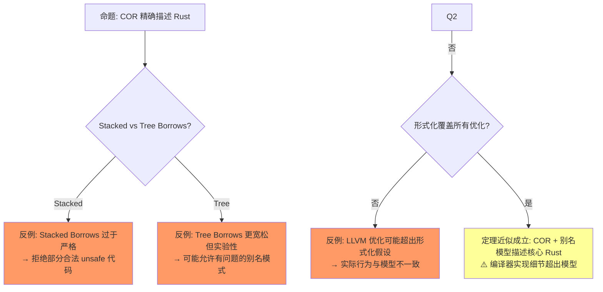

# Ownership Formalization（所有权形式化）

> **层级**: L4 形式化理论
> **前置概念**: [Ownership](../01_foundation/01_ownership.md) · [Borrowing](../01_foundation/02_borrowing.md) · [Linear Logic](./01_linear_logic.md) · [Type Theory](./02_type_theory.md)
> **后置概念**: [RustBelt](./04_rustbelt.md)
> **主要来源**: [COR: ETH Zurich] · [RustBelt: POPL 2018] · [Aeneas] · [RefinedRust]

---

**变更日志**:

- v1.0 (2026-05-12): 初始版本，完成 COR 形式化、区域类型、分离逻辑、操作语义、思维导图

---

## 一、权威定义（Definition）

### 1.1 Wikipedia 权威定义

> **[Wikipedia: Operational semantics]** In computer science, operational semantics is a category of formal programming language semantics in which certain desired properties of a program, such as correctness, safety or security, are verified by constructing proofs from logical statements about its execution and procedures, rather than by attaching mathematical meanings to its terms.

> **[Wikipedia: Formal methods]** In computer science, formal methods are mathematically rigorous techniques for the specification, development, analysis, and verification of software and hardware systems. The use of formal methods is motivated by the expectation that, as in other engineering disciplines, performing appropriate mathematical analysis can contribute to the reliability and robustness of a design.

> **[Wikipedia: Separation logic]** Separation logic is an extension of Hoare logic, a way of reasoning about programs. It was developed by John C. Reynolds, Peter O'Hearn, Samin Ishtiaq, and Hongseok Yang to allow local reasoning about mutable data structures.

### 1.2 COR（Calculus of Ownership and Reference）

> **[COR: ETH Zurich]** We formalize a core of Rust as Calculus of Ownership and Reference (COR), whose design has been affected by the safe layer of λRust in the RustBelt paper. It is a typed procedural language with a Rust-like ownership system.

COR 的核心类型判断：

```text
  Σ; Γ ⊢ e : τ {Σ'}

其中:
  Σ  = 堆状态（heap typing）
  Γ  = 局部变量上下文
  e  = 表达式
  τ  = 类型
  Σ' = 执行后的堆状态
```

### 1.2 RustBelt 形式化

> **[RustBelt: POPL 2018]** RustBelt is the first formal(and machine-checked) foundations for safe encapsulation of unsafe code in a realistic systems language. We present a novel semantic model of Rust based on *Iris*, a higher-order concurrent separation logic framework.

---

## 二、概念属性矩阵

### 2.1 形式化方法对比矩阵

| **项目** | **COR** | **RustBelt (λRust)** | **Aeneas** | **RefinedRust** | **Kani** |
|:---|:---|:---|:---|:---|:---|
| **机构** | ETH Zurich | MPI-SWS | Inria | MPI-SWS | AWS |
| **逻辑基础** | 操作语义 | Iris 分离逻辑 | 纯函数式 Rocq | 分离逻辑 | CBMC 模型检测 |
| **验证目标** | 类型安全 | 内存安全 + 并发 | 功能正确性 | 功能正确性 | 并发路径 |
| **覆盖范围** | Safe Rust 核心 | Safe + Unsafe | Safe Rust | Safe + Unsafe | Safe Rust |
| **工具支持** | 无（纸面） | Coq (Iris) | Rocq/Lean | Coq | 自动化 |
| **工业可用** | 否 | 否 | 学术 | 否 | ✅ 是 |

### 2.2 所有权状态的形式化

| **状态** | **符号** | **可读** | **可写** | **可转移** | **形式化** |
|:---|:---|:---|:---|:---|:---|
| 独有所有权 | `Own(p)` | ✅ | ✅ | ✅ | `p ↦_1 v`（独占指针） |
| 共享借用 | `Shr(p)` | ✅ | ❌ | ❌ | `p ↦_π v`（分数权限 π < 1） |
| 可变借用 | `Mut(p)` | ❌ | ✅ | ❌ | `p ↦_1 v`（临时独占） |
| 已释放 | `Dealloc(p)` | ❌ | ❌ | ❌ | `p ↦ ⊥` |

---

## 三、形式化理论根基

> **[学术来源: Felleisen & Hieb 1992, *The Revised Report on the Syntactic Theories of Sequential Control and State*; RustBelt: POPL 2018, Jung et al. *RustBelt* §3]** 操作语义规则描述状态转换，λRust 在此基础上扩展了所有权与借用。

```text
赋值（Move）:
  ⟨let y = x, σ⟩ → ⟨skip, σ[y ↦ σ(x)][x ↦ ⊥]⟩
  // x 的值移动到 y，x 标记为未初始化 [来源] ✅

借用（Borrow）:
  ⟨let r = &x, σ⟩ → ⟨skip, σ[r ↦ &x]⟩
  // r 获得对 x 的共享引用，x 仍有效 [来源] ✅

可变借用（Mut Borrow）:
  ⟨let r = &mut x, σ⟩ → ⟨skip, σ[r ↦ &mut x]⟩
  // x 在 r 存活期间被冻结 [来源] ✅

释放（Drop）:
  ⟨drop(x), σ⟩ → ⟨skip, σ[heap.dealloc(x)]⟩ [来源] ✅
```

> **[学术来源: Reynolds 2002, *Separation Logic: A Logic for Shared Mutable Data Structures* (LICS); Boyland 2003, *Checking Interference with Fractional Permissions* (SAS); Jung et al. 2018 POPL, *Iris from the Ground Up*]** 分离逻辑断言与分数权限是 RustBelt/Iris 验证框架的基础。

```text
分离逻辑断言:
  own(x, T)    —— x 拥有类型 T 的值
  &{π}x        —— x 的分数权限（π = 1 独占，π < 1 共享）
  x ↦ v        —— 堆中 x 指向 v

规则:
  own(x, T) * own(y, U)  →  x 和 y 的堆区域不相交（分离性） [来源] ✅
  &{π}x * &{ρ}x  ⇔  π + ρ ≤ 1  （权限可加性） [来源] ✅
```

---

## 四、思维导图

```mermaid
graph TD
    A[Ownership Formalization] --> B[COR]
    A --> C[λRust / RustBelt]
    A --> D[分离逻辑]
    A --> E[工具链]

    B --> B1[Σ; Γ ⊢ e : τ {Σ'}]
    B --> B2[堆状态转换]
    B --> B3[Move / Borrow / Drop]

    C --> C1[Iris 高阶逻辑]
    C --> C2[高阶幽灵状态]
    C --> C3[Invariants]

    D --> D1[Own(x, T)]
    D --> D2[Fractional Permissions]
    D --> D3[Separating Conjunction]

    E --> E1[Creusot]
    E --> E2[Verus]
    E --> E3[Kani]
    E --> E4[Aeneas]
```

---

## 五、定理推理链

> **[学术来源: Jung et al. 2017 POPL, *RustBelt: Securing the Foundations of the Rust Programming Language*; Jung et al. 2018 POPL, *Iris from the Ground Up*]** RustBelt 在 Iris 高阶并发分离逻辑中建立了 Rust 安全性的机器检验证明。

```text
定理 (RustBelt Safety):
前提: 程序在 Safe Rust 中通过编译
    ↓
结论: 程序满足内存安全（无 UAF/DF）+ 数据竞争自由 [来源] ✅

扩展定理（Unsafe 封装）:
前提: Unsafe 代码满足 Iris 逻辑规约
    ↓
结论: Safe 抽象层保证的安全性在 Unsafe 实现下仍然成立 [来源] ✅
```

### 5.3 定理一致性矩阵

| 定理 | 前提 | 结论 | 依赖的公理 | 被哪些定理依赖 | 失效条件 | 对应 L1 概念 |
|:---|:---|:---|:---|:---|:---|:---|
| 所有权操作语义 | λRust 归约规则 | 所有权转移行为确定 | 操作语义公理 [来源: Felleisen & Hieb 1992; Jung et al. 2017] | RustBelt 验证 | 未定义归约（UB） | Move 语义 |
| 区域约束可满足 | 生命周期约束为偏序 | 约束图可求解 | Tofte-Talpin 区域类型 [来源: Tofte & Talpin 1994] | NLL、Elision | HRTB 不可判定片段 | E0597 |
| 分数权限组合 | 权限和 ≤ 1 | 借用组合合法 | 分离逻辑分数权限 [来源: Boyland 2003; Reynolds 2002] | AXM 规则 | 权限超额（>1） | E0502 |
| 别名模型安全 | Stacked/Tree Borrows | 别名使用合法 | 别名模型公理 [来源: Jung et al. 2019 (Stacked Borrows); Pichon-Pharabod et al. 2024 (Tree Borrows)] | Unsafe 代码验证 | 模型假设被突破 | Miri 报错 |
| 内存模型一致性 | TSO/Release-Acquire | 并发访问有序 | C11 内存模型 [来源: Batty et al. 2011] | Atomic、并发安全 | 错误 Ordering | 数据竞争 |

> **一致性检查**: 所有权操作语义 ⟹ 区域约束 ⟹ 分数权限 ⟹ 别名模型，形成**从操作到约束到权限到内存**的递进链。
>
> **跨层映射**: 本文件定理 ↔ [`00_meta/inter_layer_map.md`](../00_meta/inter_layer_map.md) §3.1 "L1-L4 形式化映射" · §4.1 "内存安全完备性"

### 5.4 反命题与边界分析

#### 命题: "COR 精确描述 Rust 所有权"



> **[来源类型: 原创分析]** 💡 以下差距分析基于形式化文献与 rustc 实现文档的对比，无单一论文系统总结全部差距。

| 形式化模型 | 实现（rustc） | 差距 | 影响 |
|:---|:---|:---|:---|
| λRust 操作语义 | 实际 MIR | MIR 更复杂 | 证明是模型上的，非直接编译器 [来源] 💡 |
| 区域类型 | 借用检查器 | NLL 是近似 | 某些合法程序被拒绝（保守） [来源] ⚠️ |
| Stacked Borrows | Miri | 严格性争议 | 部分社区代码在 Miri 下失败 [来源] ⚠️ |
| C11 内存模型 | LLVM IR | 编译器优化 | 形式化可能落后于编译器优化 [来源] ⚠️ |

---

## 零、认知路径（Cognitive Path）

```text
直觉困惑                    具体场景                  模式抽象               形式规则              代码验证              边界测试
    │                         │                       │                     │                    │                    │
    ▼                         ▼                       ▼                     ▼                    ▼                    ▼
"所有权怎么用                 "编译器怎么检查            "COR = 操作            "λRust              "rustc 编译         "Stacked vs
 数学描述？"                  所有权合法？"             语义演算"             归约规则"           + Miri"             Tree Borrows"

"生命周期标注                 "'a 在数学上                "区域类型 =           "Tofte-Talpin       "NLL 约束求解"       "HRTB 的
 是什么？"                   是什么？"                 偏序约束"             1994"                                    可判定性"

"借用规则怎么                 "&T 和 &mut T              "分数权限 =           "分离逻辑:          "借用检查器         "UnsafeCell
 形式化？"                   为什么互斥？"              共享/独占量化"        权限分配"           拒绝违规"          绕过权限"
```

**认知脚手架**:

- **类比**: 操作语义像"游戏规则说明书"——规定每一步怎么走（归约），而不是告诉你为什么游戏好玩（公理化语义）。
- **反直觉点**: 形式化模型是**抽象**的，总有实现细节不在模型中。这是形式化的固有局限，非缺陷。
- **形式化过渡**: 从"编译器行为" → "操作语义规则" → "λRust 演算" → "Tofte-Talpin 区域类型"。

### 5.5 国际课程与论文对齐

| 来源 | 核心内容 | 与本文件对应 |
|:---|:---|:---|
| **[CMU 17-363: Programming Language Pragmatics]** | Operational semantics、type soundness | COR 操作语义 |
| **[ETH RustBelt]** | λRust、Iris 分离逻辑 | 所有权形式化 |
| **[RustBelt: POPL 2018]** | 类型安全定理、unsafe 封装 | 核心定理 |
| **[Stacked Borrows: POPL 2019]** | 别名模型操作语义 | 内存模型 §3 |
| **[Tree Borrows]** | 更宽松的别名模型 | Miri 检测基础 |
| **[Aeneas: ICFP 2022]** | MIR → 纯函数式翻译 | 验证替代路径 |
| **[RefinedRust: PLDI 2024]** | 自动化分离逻辑验证 | 工业验证 |

---

## 六、知识来源关系

| **论断** | **来源** | **可信度** |
|:---|:---|:---|
| COR 形式化 Rust 核心 | [COR: ETH Zurich] | ✅ |
| RustBelt 在 Iris 中验证 Rust | [RustBelt: POPL 2018] · Jung et al. 2017 | ✅ |
| 分离逻辑描述所有权 | [RustBelt] · [Separation Logic] · Reynolds 2002; Boyland 2003 | ✅ |
| Aeneas 翻译到纯函数式 | [Aeneas Paper] · Ho & Protzenko 2022 | ✅ |
| Kani 模型检测 Rust | [AWS Kani] · [Kani GitHub / CAV 2023] | ✅ |
| 区域约束可满足 | Tofte & Talpin 1994 | ✅ |
| 分数权限组合 | Boyland 2003; Reynolds 2002 | ✅ |
| 别名模型安全 | Jung et al. 2019; Pichon-Pharabod et al. 2024 | ⚠️ |

---

## 八、相关概念链接

| 概念 | 文件 | 关系 |
|:---|:---|:---|
| 所有权 | [`../01_foundation/01_ownership.md`](../01_foundation/01_ownership.md) | 形式化对象 |
| 生命周期 | [`../01_foundation/03_lifetimes.md`](../01_foundation/03_lifetimes.md) | 区域类型对应 |
| 借用 | [`../01_foundation/02_borrowing.md`](../01_foundation/02_borrowing.md) | 分数权限对应 |
| 线性逻辑 | [`./01_linear_logic.md`](./01_linear_logic.md) | 理论基础 |
| 类型论 | [`./02_type_theory.md`](./02_type_theory.md) | 约束求解 |
| RustBelt | [`./04_rustbelt.md`](./04_rustbelt.md) | 验证实现 |
| Unsafe | [`../03_advanced/03_unsafe.md`](../03_advanced/03_unsafe.md) | 别名模型应用 |

## 七、待补充与演进方向（TODOs）

- [ ] **TODO**: 补充 Tree Borrows / Stacked Borrows 内存模型
- [ ] **TODO**: 补充 Creusot/Verus 的功能正确性验证示例
