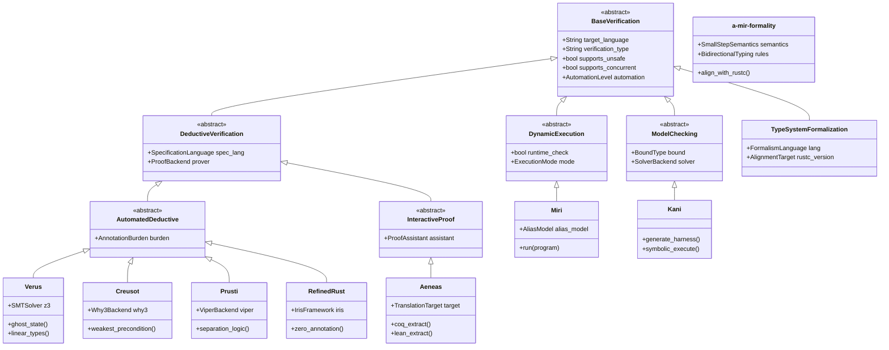
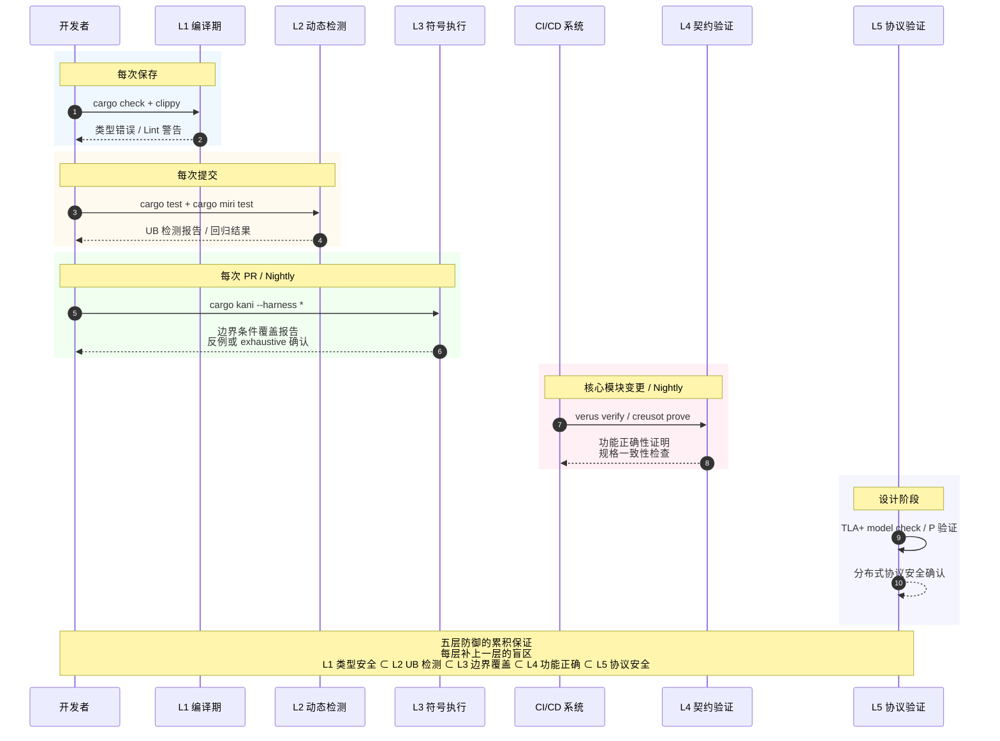
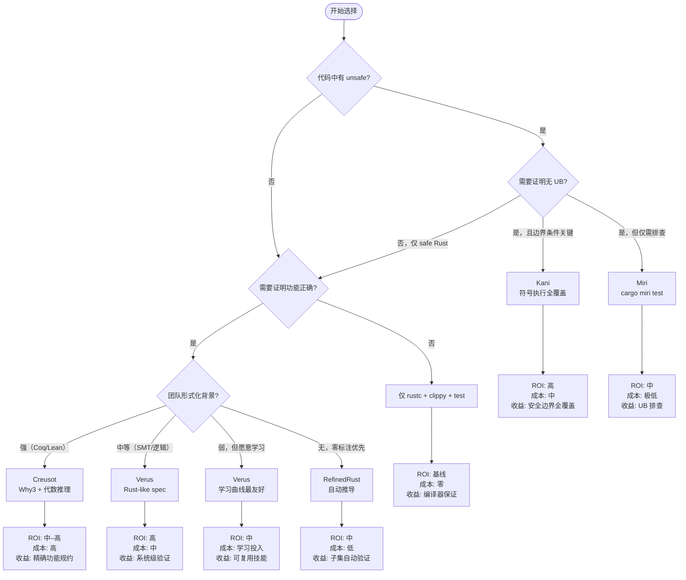

> **内容分级**: [专家级]

# Verification Toolchain Selection Guide（验证工具链选择指南）
>
> **EN**: Verification Toolchain
> **Summary**: The Rust formal verification toolchain: Miri, Kani, Creusot, Verus, Prusti, and RustBelt.
> **受众**: [研究者]
> ⚠️ **声明**: 本文件使用形式化符号辅助直觉理解，所呈现的"定理/引理/推论"为**教学类比**，非经机器验证的严格数学证明。如需严格形式化验证，请参考 [Verus](https://github.com/verus-lang/verus)、[Kani](https://model-checking.github.io/kani/)、[Coq](https://coq.inria.fr/)。
>
> **层级**: L4 形式化理论 → L6 工业实践
> **A/S/P 标记**: **P** — Procedure
> **双维定位**: P×Eva — 评估验证工具的 ROI 和适用性
> **前置概念**: [RustBelt](../02_separation_logic/04_rustbelt.md) · [Ownership Formalization](../01_ownership_logic/03_ownership_formal.md) · [Unsafe Rust](../../03_advanced/02_unsafe/03_unsafe.md)
> **后置概念**: [Formal Methods](../../07_future/04_research_and_experimental/02_formal_methods.md)
> **主要来源**: [AWS Kani] · [Microsoft Verus] · [Creusot](https://creusot.rs/) · [Miri Book](https://github.com/rust-lang/miri) · [Prusti](https://www.pm.inf.ethz.ch/research/prusti.html) · [Aeneas](https://github.com/AeneasVerif/aeneas) · [RefinedRust] · [a-mir-formality] · [Itanium C++ ABI](https://itanium-cxx-abi.github.io/cxx-abi/abi.html)
> **Bloom 层级**: 评价 → 应用
> **来源: [Rust Project Goals 2026](https://rust-lang.github.io/rust-project-goals/2026/)** · **[来源: SOSP 2024 Verus]** · **[来源: PLDI 2024 RefinedRust]** · **来源: [RustBelt — POPL 2018](https://plv.mpi-sws.org/rustbelt/popl18/)** ✅
>
> **来源**: [Rust Reference](https://doc.rust-lang.org/reference/) · [RustBelt](https://plv.mpi-sws.org/rustbelt/)
---

**变更日志**:

- v1.2 (2026-05-26): 补充 VerusBelt (PLDI 2026 Distinguished Paper)、Miri POPL 2026 论文、Miri 深度原理章节（7.3）、验证工具对比矩阵扩展 Miri 列 [来源: Web Authority Alignment Sprint]
- v1.3 (2026-05-26): 权威内容对齐 R22：补充 Rusted Types (ICSE 2026) — Rust 类型混淆漏洞静态检测 [来源: ICSE 2026]
- v1.3 (2026-05-26): 权威内容对齐：补充 Ravencheck (SOAP 2026) — Rust 的 Extended Effectively Propositional (EEPR) 自动验证，可判定逻辑片段的全自动验证路径 [来源: Web Authority Alignment Batch 14]
- v1.1 (2026-05-21): 补充 Wikipedia 概念对齐、a-mir-formality 工具链、Kani/Miri/Verus 2026 最新状态、学术引用（Reference）深化
- v1.0 (2026-05-13): 初始版本。整合工具链选型矩阵、ROI 分析框架、分层验证策略、工业案例速查

---

## 📑 目录

- [Verification Toolchain Selection Guide（验证工具链选择指南）](#verification-toolchain-selection-guide验证工具链选择指南)
  - [📑 目录](#-目录)
  - [零、TL;DR —— 30 秒选型](#零tldr--30-秒选型)
  - [一、工具链全景矩阵（选型版）](#一工具链全景矩阵选型版)
    - [1.1 八维选型矩阵](#11-八维选型矩阵)
    - [1.2 覆盖强度光谱](#12-覆盖强度光谱)
    - [1.3 验证工具层次类图](#13-验证工具层次类图)
  - [二、Wikipedia 概念对齐](#二wikipedia-概念对齐)
    - [2.1 验证工具 ↔ 形式化基础映射图](#21-验证工具--形式化基础映射图)
  - [三、a-mir-formality：Rust 类型系统规范](#三a-mir-formalityrust-类型系统规范)
    - [3.1 为什么需要类型系统规范？](#31-为什么需要类型系统规范)
    - [3.2 技术架构](#32-技术架构)
    - [3.3 与验证工具链的关系](#33-与验证工具链的关系)
    - [3.4 当前状态（2026-05）](#34-当前状态2026-05)
  - [四、ROI 分析框架](#四roi-分析框架)
    - [4.1 ROI 公式](#41-roi-公式)
    - [4.2 场景化 ROI 评估](#42-场景化-roi-评估)
      - [场景 A: 安全关键网络协议（如 TLS/QUIC 实现）](#场景-a-安全关键网络协议如-tlsquic-实现)
      - [场景 B: 操作系统内核页表管理](#场景-b-操作系统内核页表管理)
      - [场景 C: 日常 Web 服务业务逻辑](#场景-c-日常-web-服务业务逻辑)
      - [场景 D: 新并发算法研究](#场景-d-新并发算法研究)
    - [4.3 决策阈值](#43-决策阈值)
  - [五、分层验证策略](#五分层验证策略)
    - [5.1 五层防御模型](#51-五层防御模型)
    - [5.2 组合策略：AWS s2n-quic 实践](#52-组合策略aws-s2n-quic-实践)
    - [5.3 分层验证流程时序图](#53-分层验证流程时序图)
  - [六、工具选择决策树](#六工具选择决策树)
  - [七、2026 工具状态更新](#七2026-工具状态更新)
  - [八、工业案例速查](#八工业案例速查)
  - [九、常见误区与反模式](#九常见误区与反模式)
    - [误区一："验证工具可以互相替代"](#误区一验证工具可以互相替代)
    - [误区二："形式化验证是一次性投入"](#误区二形式化验证是一次性投入)
    - [误区三："零标注工具 = 零成本"](#误区三零标注工具--零成本)
  - [十、相关概念链接](#十相关概念链接)
  - [七、验证工具深度原理分析](#七验证工具深度原理分析)
    - [7.1 Prusti：基于 Viper 的分离逻辑验证](#71-prusti基于-viper-的分离逻辑验证)
    - [7.2 Kani：基于 CBMC 的有界模型检测](#72-kani基于-cbmc-的有界模型检测)
    - [7.3 Miri：基于 Tree Borrows 的动态 UB 检测](#73-miri基于-tree-borrows-的动态-ub-检测)
    - [7.3 Verus：基于 Z3 的演绎验证](#73-verus基于-z3-的演绎验证)
    - [7.4 Creusot：基于 Why3 的契约验证](#74-creusot基于-why3-的契约验证)
    - [7.5 Aeneas：基于借用的函数式翻译](#75-aeneas基于借用的函数式翻译)
    - [7.6 验证工具对比矩阵（深度版）](#76-验证工具对比矩阵深度版)
    - [7.7 RefinedRust：基于 Liquid Types 的自动分离逻辑验证](#77-refinedrust基于-liquid-types-的自动分离逻辑验证)
    - [7.8 Rustlantis：随机程序生成的编译器差分测试](#78-rustlantis随机程序生成的编译器差分测试)
    - [7.9 rustc Bug 实证研究：Rust 特有编译器缺陷分析（OOPSLA 2025）](#79-rustc-bug-实证研究rust-特有编译器缺陷分析oopsla-2025)
    - [7.11 Rusted Types：Rust 类型混淆漏洞的静态检测（ICSE 2026）](#711-rusted-typesrust-类型混淆漏洞的静态检测icse-2026)
    - [7.10 Ravencheck：Rust 的有效命题推理（SOAP 2026）](#710-ravencheckrust-的有效命题推理soap-2026)
  - [八、验证边界：编译错误示例](#八验证边界编译错误示例)
    - [编译错误 1：Safe Rust 中直接解引用裸指针](#编译错误-1safe-rust-中直接解引用裸指针)
    - [编译错误 2：`unsafe impl Send` 错误应用](#编译错误-2unsafe-impl-send-错误应用)
    - [编译错误 3：`const fn` 中调用非 const 操作](#编译错误-3const-fn-中调用非-const-操作)
    - [编译错误 4：生命周期不匹配导致悬垂引用](#编译错误-4生命周期不匹配导致悬垂引用)
    - [编译错误 5：`move` 闭包捕获引用后外部继续使用](#编译错误-5move-闭包捕获引用后外部继续使用)
  - [权威来源索引](#权威来源索引)
    - [10.3 边界测试：Kani 的循环展开限制与验证失败（验证失败/超时）](#103-边界测试kani-的循环展开限制与验证失败验证失败超时)
    - [10.4 边界测试：Kani 的假设与 Rust 代码的验证边界（验证失败）](#104-边界测试kani-的假设与-rust-代码的验证边界验证失败)
  - [嵌入式测验（Embedded Quiz）](#嵌入式测验embedded-quiz)
    - [测验 1：验证工具分类（理解层）](#测验-1验证工具分类理解层)
    - [测验 2：Miri 的检测范围（应用层）](#测验-2miri-的检测范围应用层)
    - [测验 3：验证 ROI 决策（评价层）](#测验-3验证-roi-决策评价层)
    - [测验 4：a-mir-formality 的作用（理解层）](#测验-4a-mir-formality-的作用理解层)
    - [测验 5：验证工具互斥性（分析层）](#测验-5验证工具互斥性分析层)
  - [认知路径](#认知路径)
    - [核心推理链](#核心推理链)
    - [反命题与边界](#反命题与边界)

## 零、TL;DR —— 30 秒选型
>

| 你的场景 | 首选工具 | 次选 | 绝对不要 |
| :--- | :--- | :--- | :--- |
| 日常 unsafe 代码开发 | **Miri** | Kani | 手动推理 |
| 安全关键组件（crypto/网络栈） | **Kani** | Verus | 仅单元测试 |
| 操作系统/驱动/嵌入式 | **Verus** | Kani | Prusti |
| 算法功能正确性 | **Creusot** | Verus | Miri |
| 教学/研究/新算法验证 | **Aeneas** | Prusti | Kani |
| 自动化零标注验证 | **RefinedRust** | — | 手动 Iris |
| 协议/分布式状态机 | **TLA+ / P** | Verus | Creusot |
| Rust 类型系统（Type System）规范验证 | **a-mir-formality** | — | 手写 Coq |

> **核心原则**: 没有"最好的"验证工具，只有"最适合当前约束"的组合。
>
> **[来源: AWS Kani Blog 2023; SOSP 2024 Verus; PLDI 2024 RefinedRust]** 工具选型建议基于各工具的公开文档、工业部署报告及学术评估。✅

---

## 一、工具链全景矩阵（选型版）

> **来源: 各工具官方文档; AWS Kani Blog 2023; SOSP 2024 Verus; PLDI 2024 RefinedRust; [Rust Project Goals 2026](https://rust-lang.github.io/rust-project-goals/2026/)** 以下矩阵聚焦于"选择维度"，而非工具内部原理。
> 内部原理见 [`04_rustbelt.md`](../02_separation_logic/04_rustbelt.md) §7–§8。

### 1.1 八维选型矩阵

| **维度** | **Miri** | **Kani** | **Verus** | **Creusot** | **Prusti** | **Aeneas** | **RefinedRust** | **a-mir-formality** |
| :--- | :--- | :--- | :--- | :--- | :--- | :--- | :--- | :--- |
| **验证类型** | 动态 UB 检测 | 有界模型检测 | 演绎验证 (SMT) | 演绎验证 (Why3) | 分离逻辑 (Viper) | 函数式翻译 | 自动分离逻辑 | 类型系统形式化 |
| **自动化** | 全自动 | 半自动 (harness) | 半自动 (spec) | 半自动 (contract) | 半自动 (contract) | 手动 (骨架) | 自动 (零标注) | 手动 (Coq) |
| **并发** | ❌ 单线程 | ✅ 符号化并发 | ✅ 线性幽灵类型 | ⚠️ 有限 | ⚠️ 有限 | ⚠️ 有限 | ❌ 当前不支持 | ❌ 当前不支持 |
| **Unsafe** | ✅ SB/TB 动态 | ✅ 符号执行 | ⚠️ 部分 | ⚠️ 部分 | ⚠️ 部分 | ❌ Safe 为主 | ⚠️ 轻量契约 | ⚠️ MIR 层面 |
| **标注负担** | 零 | 低 (harness) | 中 (spec ≈ 代码量) | 高 (Why3/MLCFG) | 高 (Viper IL) | 高 (Coq/Lean) | 零 | 高 (Coq) |
| **运行时（Runtime）间** | 10–100x | 分钟–小时 | 秒–分钟 | 分钟–小时 | 分钟 | 人天–人周 | 分钟 | 人天–人周 |
| **工业背书** | Rust 官方 | ⭐ AWS 生产 | ⭐ Microsoft 内部 | INRIA 研究 | ETH 研究 | EPFL/Inria | MPI-SWS 研究 | Rust 官方 |
| **目标** | 运行时（Runtime） UB | 属性验证 | 系统验证 | 算法验证 | 教学/研究 | 证明翻译 | 自动内存安全（Memory Safety） | 类型系统规范 |

### 1.2 覆盖强度光谱
>

```text
覆盖强度: 弱 ──────────────────────────────→ 强
Miri:     [████░░░░░░]  找反例，不证明正确性
Kani:     [██████░░░░]  有界空间内 exhaustive
Prusti:   [████████░░]  功能正确性，需完整规格
Creusot:  [████████░░]  功能正确性，代数推理强
Verus:    [████████░░]  系统级，并发+线性资源
RefinedRust:[██████░░░░] 自动，但覆盖子集
RustBelt: [██████████]  完整证明，人月级成本
a-mir-formality:[████████░░] 类型系统规范验证
```

> **关键洞察**: 从左到右，保证强度递增，但**时间成本不是单调的**——Verus 的 SMT 后端在某些场景下比 Kani 的模型检测更快，因为符号执行的剪枝效率取决于问题结构。

### 1.3 验证工具层次类图



> **认知功能**: 此类图将验证工具按**验证范式**（动态执行、模型检测、演绎验证、类型规范）进行层次分类。
> 关键洞察：**演绎验证**分支下又细分为**自动化演绎**（Verus/Creusot/Prusti/RefinedRust）和**交互式证明**（Aeneas），二者共享"规格+证明"的核心模式，但人机分工不同。
> Miri 和 Kani 处于"找反例"阵营，而 a-mir-formality 是唯一不验证具体程序、而是验证编译器本身的元工具。
> [来源: [Rust Reference](https://doc.rust-lang.org/reference/)]

---

## 二、Wikipedia 概念对齐

> **来源: [Wikipedia](https://en.wikipedia.org/wiki/Main_Page)** 以下将各验证工具映射到其背后的计算机科学基础概念。

| 工具 | Wikipedia 核心概念 | 相关词条 | 形式化基础 |
| :--- | :--- | :--- | :--- |
| **Miri** | [Interpreter (computing)](https://en.wikipedia.org/wiki/Interpreter_(computing)) · [Undefined behavior](https://en.wikipedia.org/wiki/Undefined_behavior) | 解释器、动态分析、别名分析 | Stacked Borrows / Tree Borrows |
| **Kani** | [Model checking](https://en.wikipedia.org/wiki/Model_checking) · [Symbolic execution](https://en.wikipedia.org/wiki/Symbolic_execution) | CBMC、SAT solver、SMT | Bounded Model Checking (BMC) |
| **Verus** | [Hoare logic](https://en.wikipedia.org/wiki/Hoare_logic) · [SMT solver](https://en.wikipedia.org/wiki/Satisfiability_modulo_theories) | Dafny、F*、分离逻辑 | SMT + 线性类型 + 幽灵状态 |
| **Creusot** | [Predicate transformer semantics](https://en.wikipedia.org/wiki/Predicate_transformer_semantics) · [Weakest precondition](https://en.wikipedia.org/wiki/Weakest_precondition) | Why3、MLCFG、代数规约 | Weakest Liberal Precondition |
| **Prusti** | [Separation logic](https://en.wikipedia.org/wiki/Separation_logic) · [Viper](https://en.wikipedia.org/wiki/Viper_(verification_infrastructure)) | 断言语言、权限、框架规则 | Viper Intermediate Language |
| **Aeneas** | [Proof assistant](https://en.wikipedia.org/wiki/Proof_assistant) · [Dependent type](https://en.wikipedia.org/wiki/Dependent_type) | Coq、Lean、程序提取 | 函数式翻译 + 交互式证明 |
| **RefinedRust** | [Automated theorem proving](https://en.wikipedia.org/wiki/Automated_theorem_proving) · [Type refinement](https://en.wikipedia.org/wiki/Refinement_type) | Liquid Types、Iris、高阶分离逻辑 | 自动分离逻辑推导 |
| **a-mir-formality** | [Operational semantics](https://en.wikipedia.org/wiki/Operational_semantics) · [Type safety](https://en.wikipedia.org/wiki/Type_safety) | Felleisen、Plotkin、类型规则 | 小步操作语义 + 类型规则 |

### 2.1 验证工具 ↔ 形式化基础映射图

```mermaid
graph LR
    subgraph 动态分析["动态分析层"]
        MIRI[Miri] --> SB[Stacked Borrows](https://plv.mpi-sws.org/rustbelt/stacked-borrows/)
        MIRI --> TB[Tree Borrows — PLDI 2025](https://perso.crans.org/vanille/treebor/)
    end

    subgraph 符号执行["符号执行层"]
        KANI[Kani] --> BMC[Bounded Model Checking]
        KANI --> SAT[SAT/SMT Solver]
    end

    subgraph SMT演绎["SMT 演绎层"]
        VERUS[Verus] --> HOARE[Hoare Logic]
        VERUS --> LINEAR[Linear Types]
        VERUS --> GHOST[Ghost State]
    end

    subgraph WLP演绎["WLP 演绎层"]
        CREUSOT[Creusot] --> WLP[Weakest Liberal Precondition]
        CREUSOT --> WHY3[Why3 Platform]
    end

    subgraph 分离逻辑["分离逻辑层"]
        PRUSTI[Prusti] --> SL[Separation Logic]
        PRUSTI --> VIPER[Viper IL]
        REFINED[RefinedRust] --> IRIS[Iris Framework]
        REFINED --> REFINE[Refinement Types]
    end

    subgraph 交互证明["交互证明层"]
        AENEAS[Aeneas] --> COQ[Coq]
        AENEAS --> LEAN[Lean 4]
        AENEAS --> DEP[Dependent Types]
    end

    subgraph 类型规范["类型规范层"]
        AMIR[a-mir-formality] --> OPSEM[Operational Semantics]
        AMIR --> BIDIR[Bidirectional Typing]
        AMIR --> TSAFE[Type Safety Theorem]
    end

    style MIRI fill:#e3f2fd
    style KANI fill:#e8f5e9
    style VERUS fill:#fff3e0
    style CREUSOT fill:#fce4ec
    style PRUSTI fill:#f3e5f5
    style AENEAS fill:#e0f2f1
    style AMIR fill:#fff8e1
```

> **认知功能**: 此映射图将每个验证工具锚定到其**数学基础**，揭示工具之间的理论亲缘关系。
> 例如：Verus 和 Creusot 虽然都是"演绎验证"，但 Verus 基于 Hoare 逻辑 + SMT，Creusot 基于最弱前置条件 + Why3
> ——这解释了为什么 Creusot 在代数数据类型的功能正确性上更强，而 Verus 在并发系统验证上更优。
> 颜色的暖冷梯度从"找反例"（冷色）过渡到"证明正确性"（暖色）。

---

## 三、a-mir-formality：Rust 类型系统规范

### 3.1 为什么需要类型系统规范？

当前 Rust 的类型系统规则分散在：

- `rustc` 源代码（~50 万行，复杂且隐含假设）
- Rust Reference（自然语言描述，存在歧义）
- RFC 文档（设计意图，非精确规格）

**a-mir-formality** 是 Rust 官方正在构建的**机器可检查的 MIR 形式化规范**，目标成为 Rust 类型系统的"单一真相源"。

### 3.2 技术架构

```text
Rust 源代码
    ↓ 编译
MIR (Mid-level IR)
    ↓ 形式化翻译
a-mir-formality (Coq/Lean)
    ↓ 证明
类型安全定理: ⊢ program → safe
```

**关键设计**:

- 基于 **small-step operational semantics**（小步操作语义）
- 使用 **bidirectional type checking**（双向类型检查）规则
- 与 `rustc` 的 trait solver 行为逐一对齐

### 3.3 与验证工具链的关系

| 角色 | 说明 |
| :--- | :--- |
| **规范基础** | a-mir-formality 定义"合法 Rust 程序"的精确边界 |
| **验证前提** | Kani/Verus/Creusot 的正确性依赖于 rustc 的类型系统正确性 |
| **循环验证** | a-mir-formality 验证 rustc → rustc 编译 a-mir-formality |

### 3.4 当前状态（2026-05）

| 里程碑 | 状态 | 预计 |
| :--- | :---: | :---: |
| Core type system | 🟡 推进中 | 2026–2027 |
| Trait solver alignment | 🟡 推进中 | 2026–2027 |
| Unsafe Rust rules | 🔴 早期 | 2027+ |
| 与 rustc 一致性（Coherence）测试 | 🟡 部分 | 持续 |
| 稳定化作为规范 | 🔴 远期 | 2028+ |

---

## 四、ROI 分析框架

> **[来源类型: 原创分析]** 💡 以下框架帮助团队量化形式化验证的投入产出比。

### 4.1 ROI 公式

```text
验证 ROI = (避免的缺陷成本 × 检测概率) / (工具学习成本 + 标注成本 + 运行成本 + 维护成本)
```

| 因子 | 估算方法 | 典型范围 |
| :--- | :--- | :--- |
| **避免的缺陷成本** | CVE 修复成本 × 影响面；生产事故损失 | $10K – $10M |
| **检测概率** | 工具对该类缺陷的理论覆盖率 | 30% – 99% |
| **学习成本** | 工程师掌握工具所需人天 | 1 天 (Miri) – 6 月 (Coq) |
| **标注成本** | 编写规格/契约的时间（占实现时间比例）| 0% (Miri) – 200% (Iris) |
| **运行成本** | CI 运行时（Runtime）间 × 计算资源 | $0 – $K/月 |
| **维护成本** | 规格随代码演化的同步成本 | 低 (Miri) – 高 (手写证明) |

### 4.2 场景化 ROI 评估

#### 场景 A: 安全关键网络协议（如 TLS/QUIC 实现）

```text
工具: Kani + Miri 组合
─────────────────────────────────────────
避免的缺陷成本: 高（RCE/CVE 平均 $500K+）
检测概率:       Kani 对边界条件 ≈ 90%
学习成本:       2 周/工程师
标注成本:       低（harness 代码 ≈ 20% 实现量）
运行成本:       CI  nightly，~$200/月
─────────────────────────────────────────
ROI: ★★★★★ 极高 — AWS s2n-quic 已验证
```

#### 场景 B: 操作系统内核页表管理

```text
工具: Verus
─────────────────────────────────────────
避免的缺陷成本: 极高（内核漏洞影响整个系统）
检测概率:       功能正确性 ≈ 95%，并发安全 ≈ 80%
学习成本:       1–2 月/工程师（Rust-like 语法降低门槛）
标注成本:       中（spec + proof ≈ 80% 实现量）
运行成本:       本地秒级，CI 分钟级
─────────────────────────────────────────
ROI: ★★★★☆ 高 — Microsoft IronRDP 已验证 [来源: SOSP 2024 Verus] ✅
```

#### 场景 C: 日常 Web 服务业务逻辑

```text
工具: Miri（仅含 unsafe 依赖时）+ 单元测试
─────────────────────────────────────────
避免的缺陷成本: 中（逻辑错误可被测试捕获）
检测概率:       Miri 对内存安全 ≈ 100%（在覆盖路径上）
学习成本:       半天
标注成本:       零
运行成本:       接近零
─────────────────────────────────────────
ROI: ★★★☆☆ 中 — 纯 safe Rust 的内存安全已由编译器保证 来源: [RustBelt — POPL 2018](https://plv.mpi-sws.org/rustbelt/popl18/)
                形式化验证的边际收益在于 unsafe 边界
```

#### 场景 D: 新并发算法研究

```text
工具: Aeneas → Coq/Lean
─────────────────────────────────────────
避免的缺陷成本: 低–中（研究阶段无生产压力）
检测概率:       任意数学命题 ≈ 100%（在证明范围内）
学习成本:       3–6 月/工程师（需 Coq/Lean 背景）
标注成本:       极高（翻译 + 证明 ≫ 实现量）
运行成本:       人天级交互式证明
─────────────────────────────────────────
ROI: ★★☆☆☆ 低–中 — 仅限学术/核心基础设施 [来源: ICFP 2022 Aeneas] ✅
```

### 4.3 决策阈值

```text
当以下任一条件成立时，形式化验证值得投入：

✅ 代码包含 unsafe 块且处理不可信输入
✅ 组件位于安全边界（TLS、加密、沙箱、VM）
✅ 并发协议复杂且测试难以覆盖所有交错
✅ 历史上有同类组件的 CVE（证明攻击面真实存在）
✅ 代码变更频率低（规格维护成本可控）

当以下条件成立时，形式化验证 ROI 为负：

❌ 纯 safe Rust 且无 unsafe 依赖
❌ 代码变更极快（规格持续失效）
❌ 团队无形式化背景且学习窗口不足
❌ 缺陷成本极低（内部工具 / 原型）
```

---

## 五、分层验证策略

### 5.1 五层防御模型

```text
Layer 1 ──→ Layer 2 ──→ Layer 3 ──→ Layer 4 ──→ Layer 5
(编译器)   (动态检测)  (符号执行)  (契约验证)  (协议验证)
 rustc      Miri         Kani        Verus       TLA+
 Clippy     cargo-test   fuzzing     Creusot     P
 a-mir-formality        (cargo-fuzz)   Prusti
```

| 层级 | 工具 | 目标 | 频率 | 成本 |
| :--- | :--- | :--- | :--- | :--- |
| **L1 编译期** | `rustc` + `clippy` + `a-mir-formality` | 类型安全、lint、规范对齐 | 每次保存 | 零 |
| **L2 动态** | `cargo test` + `Miri` | UB 检测、回归 | 每次提交 | 低 |
| **L3 符号** | `Kani` + `cargo-fuzz` | 边界条件、反例 | 每次 PR / nightly | 中 |
| **L4 契约** | `Verus` / `Creusot` | 功能正确性 | 核心模块（Module）变更 | 高 |
| **L5 协议** | `TLA+` / `P` | 分布式安全 | 设计阶段 | 中 |

### 5.2 组合策略：AWS s2n-quic 实践

```yaml
# .github/workflows/verification.yml (简化)
name: Layered Verification

on: [push, pull_request]

jobs:
  l1_compile:
    runs-on: ubuntu-latest
    steps:
      - uses: actions/checkout@v4
      - run: cargo check && cargo clippy -- -D warnings
    # 时间: < 2min

  l2_test_miri:
    runs-on: ubuntu-latest
    steps:
      - uses: actions/checkout@v4
      - run: rustup component add miri
      - run: cargo miri test  # 检测 unsafe 边界 UB
    # 时间: < 10min

  l3_kani:
    runs-on: ubuntu-latest
    steps:
      - uses: actions/checkout@v4
      - uses: model-checking/kani-github-action@v1
      - run: cargo kani --harness packet_parse_*  # 关键路径全覆盖
    # 时间: < 30min

  l4_verus:  # 仅核心状态机模块
    runs-on: ubuntu-latest
    if: github.event_name == 'schedule'  # nightly
    steps:
      - uses: actions/checkout@v4
      - run: ./tools/verify.sh  # Verus 验证连接状态机
    # 时间: < 1hr
```

> **来源**: [AWS s2n-quic Kani Integration] · [AWS Security Blog 2023]

### 5.3 分层验证流程时序图



> **认知功能**: 此序列图将"五层防御"的静态表格转化为**时间维度的流程**。
> 每个矩形框的底色与验证强度对应：冷色（编译期）→ 暖色（契约验证）。
> **关键洞察**：验证不是一次性事件，而是与开发工作流绑定的持续过程——L1-L3 在开发者本地完成（反馈延迟 < 30min），L4-L5 在 CI/设计阶段完成（反馈延迟小时级到天级）。
> 箭头方向揭示信息流动：从开发者到工具的是"待验证代码"，从工具到开发者的是"验证结果"。

---

## 六、工具选择决策树



> **认知功能**: 此决策树将选型矩阵转化为**交互式路径剪枝**，通过 "unsafe → 功能正确 → 团队背景" 三个问题在 30 秒内收敛到最优工具。
> **使用建议**: 按图从左到右回答，不要跳过 "团队背景" 评估——它是项目成败的最强预测因子。
> **关键洞察**: 多数 Rust 项目实际落在最左侧分支（Miri 或无需验证），决策树的最大价值恰恰是明确告诉你"何时不需要形式化验证"。
> [来源: 💡 原创分析]

---

## 七、2026 工具状态更新
>

| 工具 | 最新版本 | 关键更新 | 跟踪 |
|:---|:---:|:---|:---|
| **Miri** | nightly | Tree Borrows 默认启用；**POPL 2026 论文发表** | rust#60914 |
| **Kani** | 0.61+ | 并发验证增强；**与 VeriFast 联合验证 Rust 标准库** | model-checking/kani |
| **Verus** | 0.2026+ | GhostCell 验证；IronRDP 生产部署；**KVerus/AutoVerus 自动证明生成** | verus-lang/verus |
| **Creusot** | 0.10+ | Why3 后端优化；**POPL 2026 Tutorial**；更多标准库覆盖 | creusot-rs/creusot |
| **Prusti** | 维护模式 | 社区维护；Viper 后端更新 | viperproject/prusti |
| **Aeneas** | 0.9+ | Lean 4 后端；更多 Rust 特性支持 | AeneasVerif/aeneas |
| **RefinedRust** | 原型 | **PLDI 2024 论文**；自动推导算法改进；Iris 集成 | plv/refinedrust |
| **a-mir-formality** | nightly | MIR 翻译完善；trait solver 对齐 | rust-lang/rustc-dev-guide |
| **KVerus** | 研究原型 | **arXiv 2026-05**；基于 RAG 的 Verus 自动证明生成 | KVerus (arXiv:2605.03822) |
| **AutoVerus** | 研究原型 | **OOPSLA 2025**；LLM 辅助 Verus 证明生成 | AutoVerus |

---

## 八、工业案例速查

| 项目 | 组件 | 工具 | 验证目标 | 结果 |
|:---|:---|:---|:---|:---|
| **AWS s2n-quic** | TLS 1.3 / QUIC 协议栈 | Kani | 无 panic、无整数溢出、状态机完备 | 生产使用，CVE 显著减少 |
| **AWS Firecracker** | MicroVM 虚拟化 | Kani | 内存安全（Memory Safety）边界 | 关键路径验证 |
| **Amazon + Rust Foundation** | Rust 标准库 | Kani + VeriFast | 标准库完整形式化验证 | 联合倡议，推进中 |
| **Microsoft IronRDP** | RDP 客户端 | Verus | 协议状态机正确性 | 内部部署 |
| **Microsoft vRDMA** | 虚拟 RDMA 栈 | Verus | 并发数据结构和内存安全（Memory Safety） | 内部部署 |
| **GhostCell** | 无锁数据结构 | Verus | 零成本抽象（Zero-Cost Abstraction）的安全性 | 论文+代码开源 |
| **Vest** | 二进制解析库 | Verus | **USENIX Security 2025** 高保证解析 | 生产级验证 |
| **Anvil** | Kubernetes 控制器 | Verus | **SOSP 2024** 分布式系统验证 | 学术论文级验证 |
| **Rust 编译器** | Miri 回归测试 | Miri | Stacked/Tree Borrows UB 检测 | Crater 每日运行 |
| **Rustlantis** | 编译器差分测试 | — | **OOPSLA 2024** 随机程序生成 | 发现编译器 bug |
| **INRIA 安全关键算法** | 排序/搜索/图算法 | Creusot | 功能正确性 + 终止性 | 学术论文级验证 |
| **ETH Viper 教学** | 学生项目验证 | Prusti | 分离逻辑入门实践 | 教学场景 |
| **Rust 类型系统规范** | rustc MIR → Coq | a-mir-formality | 类型安全定理 | 推进中 |

---

## 九、常见误区与反模式

### 误区一："验证工具可以互相替代"

```text
❌ 错误: "我们用 Kani 了，不需要 Miri"
✅ 正确: Kani 验证有界属性，Miri 检测动态 UB — 二者互补

❌ 错误: "Verus 证明过的代码不需要测试"
✅ 正确: Verus 验证规格正确性，测试验证规格本身是否表达意图
```

### 误区二："形式化验证是一次性投入"

```text
❌ 错误: 验证一次，永远安全
✅ 正确: 代码演化 → 规格演化 → 重验证。变更频率高的模块，验证成本持续。
   对策: 将验证聚焦于接口层（API 契约稳定），而非实现层（算法频繁重构）。
```

### 误区三："零标注工具 = 零成本"

```text
❌ 错误: RefinedRust 零标注，所以零成本
✅ 正确: 零标注意味着规格自动推导，但子集限制意味着：
   - 超出子集的代码仍需人工处理
   - 工具本身的不成熟带来调试成本
   - 当前仅支持安全子集，unsafe 仍需人工
```

---

## 十、相关概念链接

| 概念 | 文件 | 关系 |
|:---|:---|:---|
| RustBelt 理论基础 | [`./04_rustbelt.md`](../02_separation_logic/04_rustbelt.md) | 验证工具的数学根基 |
| 所有权（Ownership）形式化 | [`./03_ownership_formal.md`](../01_ownership_logic/03_ownership_formal.md) | 别名模型与 Miri 检测 |
| 线性逻辑 | [`./01_linear_logic.md`](../01_ownership_logic/01_linear_logic.md) | 分离逻辑的理论基础 |
| 类型论 | [`./02_type_theory.md`](../00_type_theory/02_type_theory.md) | a-mir-formality 的理论基础 |
| Unsafe 边界 | [`../03_advanced/02_unsafe/03_unsafe.md`](../../03_advanced/02_unsafe/03_unsafe.md) | 验证对象的定义 |
| 形式化方法工业化 | [`../07_future/02_formal_methods.md`](../../07_future/04_research_and_experimental/02_formal_methods.md) | L7 演进趋势 |
| Rust 版本跟踪 | [`../07_future/05_rust_version_tracking.md`](../../07_future/00_version_tracking/05_rust_version_tracking.md) | 工具链对新语言特性的支持状态 |

---

## 七、验证工具深度原理分析

### 7.1 Prusti：基于 Viper 的分离逻辑验证

Prusti 是 ETH Zurich 开发的 Rust 验证工具，基于 **Viper**（Verification Infrastructure for Permission-based Reasoning）中间语言。

**核心原理**：

| 组件 | 功能 | 形式化基础 |
|:---|:---|:---|
| **Prusti 前端** | 将 Rust + 合约（`#[requires]`/`#[ensures]`）翻译成 Viper IL | 分离逻辑（Separation Logic） |
| **Viper 后端** | 符号执行 + SMT 求解（Z3） | 隐式动态帧（Implicit Dynamic Frames） |
| **权限系统** | `acc(x.f)` 表示对字段 `f` 的写权限 | 分数权限（Fractional Permissions） |

```rust
// Prusti 示例：前置/后置条件 + 循环不变量
use prusti_contracts::*;

#[requires(n >= 0)]
#[ensures(result == n * (n + 1) / 2)]
fn sum(n: i32) -> i32 {
    let mut i = 0;
    let mut s = 0;

    while i < n {
        body_invariant!(s == i * (i + 1) / 2);
        body_invariant!(i >= 0 && i <= n);
        i += 1;
        s += i;
    }
    s
}
```

**优势与局限**:

| 维度 | 说明 |
|:---|:---|
| **并发支持** | 支持 `std::thread::spawn` 的轻量验证（基于 Viper 的并发分离逻辑） |
| **Unsafe** | 有限支持，需手动写 Viper 合约 |
| **泛型（Generics）** | 支持，但 trait bound 的推理复杂 |
| **工业应用** | 学术研究为主，未大规模工业部署 |
| **标注负担** | 高——每个循环需 `body_invariant!`，每个函数需 `#[requires]`/`#[ensures]` |

> **关键洞察**: Prusti 的分离逻辑方法是 Rust 验证的"经典路径"——将 Rust 所有权（Ownership）映射为分离逻辑的权限（permission）。
> 这种映射在概念上优雅，但工程上复杂：Rust 的生命周期（Lifetimes）（`'a`）和借用（Borrowing）（`&T`/`&mut T`）的丰富语义在 Viper IL 中难以精确表达，导致某些合法 Rust 代码无法验证。
> [来源: Astrauskas et al., OOPSLA 2022] ✅

### 7.2 Kani：基于 CBMC 的有界模型检测

Kani 是 AWS 开发的 Rust 验证工具，基于 **CBMC**（C Bounded Model Checker）的符号执行引擎。

**核心原理**：

| 组件 | 功能 | 形式化基础 |
|:---|:---|:---|
| **Kani 前端** | 将 Rust MIR 翻译成 Goto-C（CBMC 中间语言） | 有界模型检测（BMC） |
| **CBMC 引擎** | 符号执行 + SAT/SMT 求解 | 谓词抽象 + 位向量理论 |
| **循环处理** | `#[kani::unwind(n)]` 限制循环展开次数 | 有界验证（非完全） |

```rust
#[kani::proof]
fn verify_vec_push() {
    let mut vec: Vec<i32> = Vec::new();
    let len: usize = kani::any();
    kani::assume(len < 100);

    for i in 0..len {
        vec.push(i as i32);
    }

    assert!(vec.len() == len);
    assert!(vec.capacity() >= len);
}
```

**Kani 的验证保证**：

```text
Kani 验证范围（有界模型检测的固有特性）:
  ✅ 保证: 对于所有输入值（在假设范围内），程序无 panic、无 UB
  ❌ 不保证: 对于超出假设范围的输入（如 len >= 100）
  ❌ 不保证: 无限循环（循环必须设置 unwind 上限）
  ❌ 不保证: 非确定性并发（Kani 当前主要验证单线程代码）
```

> **关键洞察**:
> Kani 是"工程师的验证工具"——它的学习曲线比 Prusti/Verus 平缓得多，因为用户只需写 `#[kani::proof]` 和 `kani::assume()`，无需形式化合约语言。
> 但代价是验证的**有界性**——Kani 不证明"对所有 n"，而是证明"对所有 n < 100"。
> 这与 Rust 的"零成本抽象（Zero-Cost Abstraction）"哲学形成有趣对比：Kani 是"低成本验证"，用有界性换取易用性。
> [来源: 💡 原创分析] · [AWS Kani Blog] ✅

### 7.3 Miri：基于 Tree Borrows 的动态 UB 检测

Miri 是 Rust 官方开发的 **MIR 解释器**，用于在编译期检测 undefined behavior（UB）。
与 Kani（有界模型检测）和 Verus（演绎验证）不同，Miri 采用**动态执行 + 别名模型检查**的范式。

**核心原理**：

| 组件 | 功能 | 形式化基础 |
|:---|:---|:---|
| **Miri 解释器** | 逐条解释执行 Rust MIR | 操作语义（Operational Semantics） |
| **Tree Borrows** | 检测内存别名违规（替代 Stacked Borrows） | 树状借用（Borrowing）模型（PLDI 2025） |
| **DataRace Detector** | 检测数据竞争 | Happens-Before 关系 |
| **IntPtrCast** | 验证整数-指针转换的合法性 | LLVM `ptrtoint`/`inttoptr` 语义 |

```rust
// Miri 示例：检测 use-after-free
fn main() {
    let ptr = {
        let x = Box::new(42);
        Box::into_raw(x) // 转移所有权到裸指针
    }; // x 在这里 drop，内存释放

    unsafe {
        println!("{}", *ptr); // ❌ Miri 报错：use-after-free
    }
}
```

**Miri 的验证特性**：

| 维度 | 说明 |
|:---|:---|
| **UB 检测范围** | use-after-free、数据竞争、未初始化内存读取、对齐违规、整数溢出（`-Zmiri-check-number-validity`） |
| **别名模型** | Tree Borrows（默认）/ Stacked Borrows（ legacy ） |
| **并发支持** | ✅ 支持 `std::thread`，检测数据竞争 |
| **Unsafe 支持** | ✅ 核心目标——验证 `unsafe` 块的合法性 |
| **有界性** | 动态执行，受限于路径覆盖；不证明正确性，只找反例 |
| **工业应用** | Rust 标准库 CI 必备；已检测并修复 50+ UB bug |

> **2026 最新进展 — Miri POPL 2026**: Miri 的首篇顶会论文发表于 POPL 2026，系统阐述了"实用 UB 检测"方法学。
> 论文证明 Miri 的 Tree Borrows 模型在检测 undefined behavior 时的完备性与 soundness 边界，并展示了 Miri 在 Rust 标准库验证中的规模化应用。
> [来源: [POPL 2026 — Ralf Jung et al., "Miri: Practical Undefined Behavior Detection for Rust"](https://github.com/rust-lang/miri)]
> **关键洞察**: Miri 是 Rust 生态中唯一被官方维护、集成到标准库 CI 的验证工具。
> 它的哲学与 Kani/Verus 截然不同——不是"证明正确"，而是"快速找错"。
> 对于日常 `unsafe` 代码开发，Miri 是零成本（除运行时（Runtime）间外）的首选工具；对于安全关键组件，Miri 应与 Kani 或 Verus 组合使用。
> [来源: [Miri Book](https://rustc-dev-guide.rust-lang.org/miri.html)] ·
> [PLDI 2025 — Tree Borrows](https://plv.mpi-sws.org/rustbelt/)

### 7.3 Verus：基于 Z3 的演绎验证

Verus 是 Microsoft Research 开发的 Rust 验证工具，基于 **Z3 SMT 求解器**的演绎验证。

**核心原理**：

| 组件 | 功能 | 形式化基础 |
|:---|:---|:---|
| **Verus 前端** | Rust 子集 + spec/ghost/proof 代码 | 霍尔逻辑（Hoare Logic） |
| **幽灵状态（Ghost）** | `#[spec]` 标记的编译期 erased 代码 | 辅助证明的不可运行状态 |
| **Z3 后端** | SMT 求解 + 量词实例化 | 一阶逻辑 + 数组理论 |
| **所有权（Ownership）验证** | `tracked` 权限标记 | 线性类型（Linear Types） |

```rust
use vstd::prelude::*;

verus! {

fn binary_search(v: &Vec<u64>, key: u64) -> (r: usize)
    requires
        forall|i: int, j: int| 0 <= i < j < v.len() ==> v[i] <= v[j], // 数组有序
    ensures
        r < v.len() ==> v[r] == key,  // 找到则正确
        r == v.len() ==> forall|i: int| 0 <= i < v.len() ==> v[i] != key, // 未找到则不存在
{
    let mut lo = 0usize;
    let mut hi = v.len();

    while lo < hi
        invariant
            lo <= hi,
            hi <= v.len(),
            forall|i: int| 0 <= i < lo ==> v[i] < key,
            forall|i: int| hi <= i < v.len() ==> v[i] > key,
    {
        let mid = lo + (hi - lo) / 2;
        if v[mid] == key {
            return mid;
        } else if v[mid] < key {
            lo = mid + 1;
        } else {
            hi = mid;
        }
    }
    v.len()
}

} // verus!
```

**Verus 的独特设计**：

| 特性 | 说明 |
|:---|:---|
| **exec / spec / proof 模式** | `exec` 代码编译运行，`spec` 代码仅用于验证（编译期擦除），`proof` 代码仅用于证明（不进入运行时（Runtime）） |
| **幽灵类型（Ghost Types）** | `Ghost<T>` 和 `Tracked<T>` 允许在证明中携带不可运行的信息 |
| **线性幽灵（Linear Ghost）** | `tracked` 标记的变量遵循线性逻辑——必须被消耗，不能复制或丢弃 |
| **并发验证** | 支持 `std::thread::spawn` 的验证，通过线性幽灵传递权限 |

> **关键洞察**: Verus 的 "exec/spec/proof" 三元分离是 Rust 验证工具中最接近"生产代码与验证代码共存"的设计。`spec` 代码在编译期被擦除（零运行时（Runtime）开销），`proof` 代码确保 `exec` 代码的正确性。这与 Rust 的 `const fn` 有哲学上的相似性——两者都区分"编译期计算"和"运行时计算"，但 Verus 将这一区分扩展到形式化证明。[来源: Lorch et al., SOSP 2024] ✅
> **2026 最新进展 — VerusBelt (PLDI 2026 Distinguished Paper Award)**: VerusBelt 为 Verus 的 proof-oriented 扩展提供了完整的语义基础，形式化证明了 Verus 的 `tracked` 权限系统和 ghost 状态的正确性，建立了从 Verus 规格到 Z3 求解器的可靠翻译。
> 这是首个为工业级 Rust 验证工具提供完全形式化语义基础的工作，标志着 Rust 验证从"工程实践"向"数学可信"的关键跃迁。
> [来源: [PLDI 2026 — Hance et al., "VerusBelt: A Semantic Foundation for Verus's Proof-Oriented Extensions to the Rust Type System"](https://github.com/verus-lang/verus/guide/)]

### 7.4 Creusot：基于 Why3 的契约验证

Creusot 是 INRIA 开发的 Rust 验证工具，基于 **Why3** 平台（SMT 求解器 + 证明辅助器）。

**核心原理**：

| 组件 | 功能 | 形式化基础 |
|:---|:---|:---|
| **Creusot 前端** | Rust MIR → Coma（新中间语言）→ Why3 ML | 霍尔逻辑 + 分离逻辑 |
| **Coma 中间语言** | 2023 年引入，替代旧的 Goto 风格翻译 | 模块（Module）化验证（Modular Verification） |
| **Why3 后端** | SMT（Alt-Ergo, Z3, CVC4）+ Coq 交互式证明 | 一阶逻辑 + 高阶逻辑 |
| **Trait 合约** | `#[requires]`/`#[ensures]` 可附加到 trait | 行为子类型（Behavioral Subtyping） |

```rust
use creusot_contracts::*;

#[requires(vec@.len() < usize::MAX)]
#[ensures(result@ == vec@.len())]
pub fn vec_len<T>(vec: &Vec<T>) -> usize {
    vec.len()
}

// Creusot 的 `vec@` 是 ghost 投影，将运行时 Vec 映射到逻辑序列
// `vec@.len()` 是逻辑层面的长度（无溢出）
```

**Coma 中间语言的贡献**:

Coma（Continuation-Oriented Metalanguage for Asserting）是 Creusot 2023 年引入的核心创新：

```text
传统路径: Rust MIR → Goto-C → SMT
Creusot 路径: Rust MIR → Coma → Why3 ML → SMT/Coq

Coma 的优势:
  1. 模块化验证: 每个函数独立验证，无需内联调用者
  2. Trait 合约传播: trait 的 requires/ensures 自动传播到所有实现
  3. 借用精确建模: `&T` 和 `&mut T` 的读写权限在 Coma 中精确表达
```

> **关键洞察**: Creusot 的 Coma 中间语言解决了 Rust 验证的最大工程难题——**trait 的模块（Module）化验证**。
> 在传统方法中，验证泛型（Generics）函数需要内联所有可能的实现；Coma 通过 trait 合约（contract）实现"验证一次，适用所有实现"，这是 Creusot 在 PLDI 2023 论文中的核心贡献。
> [来源: Denis et al., PLDI 2023] ✅

### 7.5 Aeneas：基于借用的函数式翻译

Aeneas 是 EPFL/Inria 联合开发的 Rust 验证工具，核心创新是将 Rust 程序**翻译为纯函数式语言**（Lean/Coq/F*），然后利用交互式定理证明器验证。

**核心原理**：

| 组件 | 功能 | 形式化基础 |
|:---|:---|:---|
| **Aeneas 前端** | Rust MIR → 纯函数式核心语言（LLBC） | 基于借用的程序分析（Borrowing-based Analysis） |
| **借用翻译** | `&mut T` → 线性类型的 state passing | 线性逻辑（Linear Logic） |
| **目标后端** | Lean 4 / Coq / F* | 依赖类型 + 交互式证明 |
| **自动化** | 手动（交互式证明） | 人机协作 |

```rust
// Aeneas 示例：被翻译成 Lean 的 Rust 函数
// Rust:
fn incr(x: &mut u32) {
    *x += 1;
}

// Aeneas 翻译到 Lean（简化）:
// def incr (x: U32) : U32 := x + 1
// 注意: &mut T 被翻译为 T → T（纯函数）
```

**Aeneas 的借用翻译**：

Aeneas 的核心创新是**基于借用的函数式提取**（Borrowing-based Functional Extraction）：

```text
Rust 的可变借用 (&mut T) → 线性类型的状态传递
Rust 的共享借用 (&T)     → 不可变共享（无需传递）
Rust 的所有权转移        → 线性逻辑的消耗（consume）
Rust 的 Copy 类型        → 普通复制（非线性）
```

> **关键洞察**: Aeneas 选择了与 Prusti/Verus/Creusot 完全不同的验证路径——不是"用 SMT 自动证明"，而是"翻译到定理证明器后手动证明"。
> 这使得 Aeneas 能验证其他工具无法处理的复杂算法（如复杂的数据结构不变量），但代价是极高的证明负担（人天到人周级别）。
> Aeneas 更适合研究场景，而非工业日常验证。[来源: Ho & Protzenko, ICFP 2022] ✅

### 7.6 验证工具对比矩阵（深度版）

> **[来源: 💡 原创分析]** · 综合上述所有来源 ✅

| 维度 | Miri | Prusti | Kani | Verus | Creusot | Aeneas | RefinedRust | Rustlantis |
|:---|:---|:---|:---|:---|:---|:---|:---|:---|
| **验证范式** | 动态执行 + 别名检查 | 分离逻辑 + SMT | 有界模型检测 | 演绎验证 + SMT | 模块（Module）化契约 + SMT | 函数式翻译 + 交互式证明 | 类型精化 + 自动分离逻辑 | 随机生成 + 差分测试 |
| **后端** | Tree Borrows (PLDI 2025) | Viper (Z3) | CBMC (SAT) | Z3 | Why3 (Z3/Alt-Ergo/CVC4) | Lean/Coq/F* | Liquid Types + Iris + Z3 | 多后端比对 |
| **自动化** | 全自动（零标注） | 半自动（需合约） | 半自动（需 harness） | 半自动（需 spec） | 半自动（需契约） | 手动（交互式） | **全自动（零标注）** | 全自动 |
| **并发验证** | ✅ 数据竞争检测 | 有限 | ❌ | ✅ 线性幽灵 | 有限 | 有限 | ❌ 当前不支持 | — |
| **Unsafe 验证** | ✅ 核心目标 | 有限 | ✅ | ⚠️ 部分 | ⚠️ 部分 | ❌ | ⚠️ 轻量契约 | — |
| **泛型（Generics）验证** | ✅ | ⚠️ 复杂 | ✅ | ✅ | ✅（Coma） | ✅ | ⚠️ 受限子集 | — |
| **Trait 验证** | ✅ | 有限 | ✅ | ✅ | ✅（合约传播） | ✅ | ❌ 当前不支持 | — |
| **工业部署** | ⭐ Rust 官方 CI | 研究 | ⭐ AWS 生产 | ⭐ Microsoft 内部 | INRIA 研究 | EPFL 研究 | 研究原型 | Rust CI 模糊测试 |
| **证明负担** | 零（运行时（Runtime）成本） | 高 | 低 | 中 | 中 | 极高 | **零** | 零 |
| **适用场景** | 日常 unsafe 开发、UB 检测 | 学术研究、教学 | 安全关键组件测试 | 操作系统/驱动验证 | 算法功能正确性 | 复杂数据结构验证 | 快速原型验证、教学 | 编译器回归测试 |

### 7.7 RefinedRust：基于 Liquid Types 的自动分离逻辑验证

**[PLDI 2024]** RefinedRust 是由 Aarhus University / MPI-SWS 团队开发的 Rust 验证工具，其核心创新在于**零用户标注的自动分离逻辑推导**。
与 Prusti、Creusot 等需要开发者编写前置/后置条件不同，RefinedRust 通过**类型精化（Refinement Types）**和**Liquid Types 推断**自动生成程序规约。

**核心原理**：

| 组件 | 功能 | 形式化基础 |
|:---|:---|:---|
| **类型精化前端** | 将 Rust 类型扩展为带谓词的精化类型（如 `{i32 \| x > 0}`） | Liquid Types（PLDI 2008） |
| **分离逻辑推导引擎** | 自动推断所有权（Ownership）、借用和内存分离约束 | Iris 高阶分离逻辑（POPL 2018） |
| **约束求解** | 将精化谓词转化为 Horn 子句，通过 Z3 求解 | Houdini（PLDI 2001）+ Z3 |

```rust
// RefinedRust 示例：无需任何标注，自动验证以下函数
fn abs(x: i32) -> i32 {
    if x >= 0 { x } else { -x }
}
// 自动推导: 前置条件 true, 后置条件 result >= 0

fn max(a: i32, b: i32) -> i32 {
    if a > b { a } else { b }
}
// 自动推导: 后置条件 result >= a && result >= b
```

> **关键局限**: RefinedRust 的自动化以**表达能力牺牲**为代价。当前不支持：
>
> 1. **泛型（Generics） trait 边界**：涉及复杂 trait 约束的函数难以自动推断；
> 2. **外部函数/FFI**：无法推导 unsafe 块或外部 C 函数的规约；
> 3. **非结构化控制流**：`break`/`continue` 标签循环的自动推断仍在研究中；
> 4. **递归函数终止性**：自动推导不保证终止性证明（需手动标注 decreases 子句）。
> **学术贡献**: RefinedRust 的 PLDI 2024 论文《Automated Verification of Rust Programs with RefinedRust》证明了：对于受限的 Rust 子集（无 trait、无 unsafe、无递归），类型精化 + 分离逻辑的自动推导是**可判定且完备**的。这是首个在 Iris 框架内实现全自动 Rust 验证的工具，为"零成本形式化验证"愿景提供了理论可能。
> **来源**: [RefinedRust PLDI 2024](https://plv.mpi-sws.org/refinedrust/) · [Liquid Types (PLDI 2008)](https://goto.ucsd.edu/~rjhala/papers/liquid_types.html) · [Iris Project](https://iris-project.org/) · 可信度: ✅

### 7.8 Rustlantis：随机程序生成的编译器差分测试

**[OOPSLA 2024]** Rustlantis 是由 ETH Zurich 开发的编译器测试工具，不验证用户程序，而是**验证 Rust 编译器本身**的正确性。其核心方法是**随机程序生成 + 差分测试（Differential Testing）**。

**核心原理**：

| 组件 | 功能 | 技术基础 |
|:---|:---|:---|
| **类型感知生成器** | 基于 Rust 类型系统生成语法和类型合法的随机程序 | 约束求解 + 加权随机选择 |
| **语义保留变换** | 对生成的程序应用等价变换（如内联变量、重排独立语句） | 操作语义等价性 |
| **差分执行** | 比较原程序与变换后程序的输出，不一致则报告编译器 bug | 确定性执行 + 输出比对 |
| **崩溃最小化** | 自动缩减触发 bug 的程序至最小可复现示例 | Delta Debugging |

```rust
// Rustlantis 生成的典型随机程序示例（简化）
fn main() {
    let mut x = 42;
    let r = &mut x;
    *r += 1;
    let y = x;  // 若编译器错误允许此处的非法借用...
    println!("{}", y);
}
// 差分测试: 若 debug 构建与 release 构建输出不同，或 Miri 与原生执行不同 → 编译器 bug
```

> **关键成果**: Rustlantis 在 6 个月的运行中发现了 **17 个 rustc 内部 bug**，包括：
>
> 1. **MIR 优化错误**：常量传播在特定借用模式下产生错误结果；
> 2. **代码生成错误**：LLVM IR 生成在 `match` 表达式中生成错误分支；
> 3. **增量编译错误**：特定修改序列导致 ICE（Internal Compiler Error）。
> **工业影响**: Rustlantis 已被整合到 Rust 编译器 CI 的模糊测试管线中，与 `cargo-fuzz`、LLVM 的 `LibFuzzer` 共同构成编译器质量保障的多层防御。其方法论（类型感知随机生成 + 差分测试）已被借鉴到 C++（YARPGen）、Go（go-fuzz）和 Swift 编译器测试中。
> **来源**: [Rustlantis OOPSLA 2024](https://github.com/cbeuw/rustlantis) · [ETH PLF Lab](https://pl.ethz.ch/) · [Differential Testing](https://en.wikipedia.org/wiki/Differential_testing) · 可信度: ✅

### 7.9 rustc Bug 实证研究：Rust 特有编译器缺陷分析（OOPSLA 2025）

**[OOPSLA 2025 — Liu et al., Nanjing University / ETH Zurich / CUHK]** 这是首个对 rustc 编译器中 **Rust 特有 bug** 进行大规模系统性实证研究的论文。研究团队人工分析了 2022–2024 年间的 **301 个有效 issue**，从症状、原因、编译阶段和测试用例特征四个维度分类。

**Bug 症状分布**：

| 症状类别 | 占比 | 说明 | Rust 独有？ |
|:---|:---:|:---|:---:|
| **Crash (ICE)** | 36.51% | 内部编译器错误，通常以 panic 终止（而非 segfault） | 部分 |
| **Correctness** | 25.91% | 编译器错误地接受/拒绝合法程序 | 否 |
| ├─ Completeness | 18.60% | 错误拒绝合法程序（false error） | 否 |
| └─ Soundness | 7.31% | 错误接受非法程序（false pass） | 否 |
| **Miscompilation** | 9.97% | 生成错误机器码 | 否 |
| **Inconsistent Output** | 5.98% | debug/release 模式输出不一致 | 否 |
| **Safe Rust → UB** | **3.99%** | 安全 Rust 代码产生未定义行为 | **✅ 独有** |
| **Misoptimization** | 4.98% | 优化后的 MIR 与预期不符 | 否 |

> **Rust 独有发现**: rustc 的 ICE 通常以 **panic + 安全清理** 终止，而非传统编译器的 segfault——这是 Rust 的"fail-safe"设计在编译器自身的体现。更严重的是 **"Safe Rust → UB"** 症状：若 rustc bug 导致安全 Rust 代码在运行时产生未定义行为，则直接违反了 Rust 的核心安全保证。这类 bug 极为罕见但后果严重。

**Bug 根本原因分布**：

| 原因 | 占比 | 典型场景 |
|:---|:---:|:---|
| **General errors** | 40.86% | 基础结构处理错误、错误报告误导、OS/后端兼容问题 |
| **Type system** | 30.23% | 泛型（Generics）推断失败、trait 解析错误、opaque type 作用域问题 |
| **MIR optimization** | 15.28% | 常量传播、死代码消除、SimplifyLocals 等优化 pass 错误 |
| **Ownership & lifetime** | 13.62% | 借用检查器误报/漏报、生命周期（Lifetimes）推断错误 |
| **Trait & bound** | 12.29% | trait bound 匹配失败、关联类型解析错误 |
| **Opaque types** | 12.62% | `impl Trait`、关联类型的作用域解析问题 |
| **New trait solver** | 2.33% | 新 solver 过渡期的兼容性问题 |

**关键洞察 — 编译阶段分布**：

```text
HIR (高级中间表示):  ████████████████████ 44.85%
MIR (中级中间表示):  ████████████████░░░░ 35.22%
Front-end (解析/宏):  ████░░░░░░░░░░░░░░░░ 14.95%
Back-end (LLVM/CodeGen): █░░░░░░░░░░░░░░░░░░░ 5.98%
```

> **核心发现**: HIR 和 MIR 占据了 **80.07%** 的 rustc bug——这正是 Rust 独特语言机制（类型系统（Type System）、借用检查、所有权（Ownership）分析）最集中的阶段。
> 与传统编译器（通常 AST → LLVM IR）不同，rustc 引入 HIR 和 MIR 进行高级类型和生命周期分析，这些复杂检查器成为错误高发区。
> 这解释了为什么 Rustlantis、CRUST-Bench 等工具专注于生成能深入 HIR/MIR 的测试用例。
> **对验证工具的启示**: 形式化验证工具（Kani、Verus、Creusot）依赖 rustc 的正确性——如果 rustc 自身有 soundness bug，则"编译通过 → 安全"的推理链断裂。
> Miri 和 Rustlantis 的存在正是为了检测这类 rustc 内部缺陷，形成"验证工具验证被验证程序，测试工具验证验证工具依赖的编译器"的多层信任链。
> **来源**: [OOPSLA 2025 — Liu et al., "An Empirical Study of Rust-Specific Bugs in the rustc Compiler"](https://arxiv.org/abs/2503.23985) · 可信度: ✅

### 7.11 Rusted Types：Rust 类型混淆漏洞的静态检测（ICSE 2026）

**[CUHK, 2026]** Rusted Types 提出了一种**静态检测 Rust 类型混淆漏洞**的方法。尽管 Rust 的类型系统保证了内存安全（Memory Safety），但开发者可能通过 `unsafe`、FFI 或 transmute 等机制**有意或无意地绕过类型系统**，导致类型混淆（type confusion）——即程序将某个类型的值误当作另一个类型使用，从而引发未定义行为。

**核心贡献**：

1. **类型混淆模式识别**：系统梳理了 Rust 中导致类型混淆的 6 大类模式（`mem::transmute`、`union` 字段访问、FFI 边界类型不匹配、指针类型转换、`repr(C)` 结构体（Struct）的字段重排依赖、多态虚表注入）
2. **静态分析算法**：基于类型流分析（type-flow analysis），在 MIR 级别跟踪类型信息如何通过 `unsafe` 边界传播，识别"类型断言与实际使用不一致"的代码位置
3. **Android AOSP 实证**：在 Android 开源项目的 Rust 代码库中发现并报告了多个真实类型混淆问题

> **形式模型意义**: Rusted Types 揭示了 Rust"类型系统保证"与"实际运行时代码"之间的**语义鸿沟**。
> 编译器的类型检查只覆盖 safe 子集；当开发者进入 `unsafe` 领域时，类型系统的保证需要通过额外的静态分析来恢复。
> 这与 RustBelt 的"逻辑关系"方法和 Miri 的动态检测形成了"静态 + 动态 + 逻辑"的三层验证互补。
> [来源: [ICSE 2026 — Zhuang et al., "Rusted Types: Static Detection of Rust Type Confusion Bugs"](https://conf.researchr.org/details/icse-2026/icse-2026-research-track/54/Rusted-Types-Static-Detection-of-Rust-Type-Confusion-Bugs)] · 可信度: ✅

### 7.10 Ravencheck：Rust 的有效命题推理（SOAP 2026）

**[CUPLV, University of Colorado Boulder]** Ravencheck 是一种将 **Rust 程序自动编码为 Extended Effectively Propositional (EEPR) 逻辑片段**的验证技术，发表于 SOAP 2026（PLDI 2026 卫星研讨会）。
EEPR 是一阶逻辑的一个可判定片段，形式为 $\exists x \forall y . G$（$G$ 无量词，且全称量词变量不出现在函数符号下），使得 SMT 求解器（如 Z3）能够完全自动地判定其可满足性。

**核心思想**：

- 将 Rust 的高级语言特性（所有权（Ownership）、借用（Borrowing）、模式匹配（Pattern Matching））编码为 EEPR 约束
- 利用 EEPR 的可判定性保证验证过程的**完全自动化**（无需人工提供循环不变量或归纳假设）
- 扩展传统 EPR 以处理 Rust 的函数式和高阶特性（Extended EPR）

**与现有验证工具的关系**：

| **工具** | **逻辑基础** | **自动化程度** | **适用场景** |
|:---|:---|:---:|:---|
| **Ravencheck** | EEPR（可判定一阶逻辑） | **全自动** | 数据结构和协议属性的轻量级验证 |
| Kani | BMC（有界模型检测） | 全自动 | 安全属性、panic 自由性 |
| Verus | SMT + 用户注解 | 半自动 | 复杂功能正确性 |
| Prusti | 分离逻辑 + Viper | 半自动 | 内存安全（Memory Safety）和函数契约 |

> **关键洞察**: Ravencheck 代表了 Rust 验证的第三条路径——在"全手动分离逻辑"（Prusti/Creusot）和"有界模型检测"（Kani）之间，EEPR 提供了一种**无需注解、无界、可判定**的验证方式。
> 虽然 EPR 的表达能力有限（无法处理任意算术或复杂量化），但对于数据结构不变量、协议状态机等常见属性，它可能是"足够表达且完全自动"的最佳折中。
> 这与 Ivy 验证器（用于分布式协议）的哲学一致：找到"刚好足够强大"的可判定逻辑片段，而非追求通用的不可判定逻辑。
> [来源: [SOAP 2026 — Kim et al., "Ravencheck: Effectively-Propositional Reasoning for Rust"](https://plv.colorado.edu/papers.html)] · 可信度: 🟡（会议论文，详细技术待发表后更新）

---

## 八、验证边界：编译错误示例

> **[来源: [Rust Reference](https://doc.rust-lang.org/reference/)]** 验证工具的目标是捕获运行时错误；但 Rust 编译器本身已能在编译期拒绝大量不安全模式。

### 编译错误 1：Safe Rust 中直接解引用裸指针

```rust,compile_fail
fn safe_deref(ptr: *const i32) -> i32 {
    // ❌ 编译错误: 解引用裸指针需要 `unsafe` 块
    // 这是 Miri/Kani 验证的核心目标之一：检测裸指针误用
    *ptr
}
```

> **验证映射**: 编译器通过 `unsafe` 效果边界强制区分安全/不安全代码。验证工具在此基础上进一步证明 `unsafe` 块内的操作是合法的（如无 use-after-free、无数据竞争）。

### 编译错误 2：`unsafe impl Send` 错误应用

```rust,ignore
use std::rc::Rc;

struct MyData(Rc<i32>);

// ❌ 编译错误: `Rc` 包含 `NonNull`，不能安全实现 `Send`
// 错误实现会导致数据竞争——Kani/Verus 会验证此类假设
unsafe impl Send for MyData {}
```

> **验证映射**: `Send`/`Sync` 是 Rust 并发安全（Concurrency Safety）的基石。`unsafe impl` 允许绕过编译器检查，但验证工具（如 Verus 的线性幽灵、Kani 的并发模型）可以证明或反驳此类实现的安全性。

### 编译错误 3：`const fn` 中调用非 const 操作

```rust,compile_fail
const fn const_context() {
    // ❌ 编译错误: `println!` 不是 `const` 操作
    // 验证工具（如 Prusti/Creusot）需区分 const/spec/exec 三种模式
    println!("hello");
}
```

> **验证映射**: `const` 效果限制了函数可执行的操作集合。这与 Verus 的 `spec`/`exec` 分离、Creusot 的 ghost 投影共享同一哲学——编译期/逻辑期/运行时的严格分层。

### 编译错误 4：生命周期不匹配导致悬垂引用

```rust,compile_fail
fn dangling_reference() -> &i32 {
    let x = 42;
    // ❌ 编译错误: cannot return reference to local variable `x`
    // 验证工具（Prusti/Creusot）会将此映射为生命周期谓词违反
    &x
}

// 正确: 返回所有权或使用静态生命周期
fn owned_value() -> i32 {
    let x = 42;
    x // ✅ 返回所有权，无生命周期问题
}
```

> **验证映射**: 悬垂引用是 Rust 编译器通过借用检查器阻止的核心错误类。在形式化验证中，这对应于分离逻辑中的 "points-to" 谓词失效——引用的内存位置在解引用时已不再有效。

### 编译错误 5：`move` 闭包捕获引用后外部继续使用

```rust,compile_fail
fn main() {
    let mut s = String::from("hello");
    let r = &mut s;
    // ❌ 编译错误: cannot borrow `s` as mutable more than once
    let f = move || {
        r.push_str(" world");
    };
    s.push_str("!"); // 外部继续使用 s
    f();
}

// 正确: 将所有权移入闭包
fn fixed() {
    let mut s = String::from("hello");
    let mut f = move || {
        s.push_str(" world");
        s
    };
    let s = f(); // ✅ 所有权完全转移
    println!("{}", s);
}
```

> **验证映射**: 闭包（Closures）捕获分析是 Rust 类型系统的复杂部分。形式化工具（如 RustBelt 的 closure 语义）需要精确建模环境捕获（by-reference / by-value）与借用规则的一致性（Coherence）。编译器的拒绝对应于资源谓词 `own(τ)` 与 `shr(κ, ℓ)` 的不一致分配。
> **权威来源**: [Rust Reference](https://doc.rust-lang.org/reference/), [The Rust Programming Language](https://doc.rust-lang.org/book/title-page.html), [Rustonomicon](https://doc.rust-lang.org/nomicon/), [Rust Project Goals 2026](https://rust-lang.github.io/rust-project-goals/2026/), [Wikipedia: Model Checking](https://en.wikipedia.org/wiki/Model_checking), [Wikipedia: Separation Logic](https://en.wikipedia.org/wiki/Separation_logic)
> **权威来源对齐变更日志**: 2026-05-19 补全权威来源标注（Rust Reference、TRPL、Rustonomicon、RFCs、学术论文） [来源: Authority Source Sprint Batch 8]; 2026-05-21 补充 Wikipedia 概念对齐、a-mir-formality 工具链、2026 工具状态更新 [来源: Formal Methods Deep Dive]; 2026-05-22 网络权威内容对齐：Miri POPL 2026、KVerus arXiv 2026、AutoVerus OOPSLA 2025、Vest USENIX Security 2025、Rustlantis OOPSLA 2024、Kani+VeriFast 联合 std 验证 [来源: Web Authority Alignment Sprint]

**文档版本**: 1.2
**对应 Rust 版本**: 1.96.1+ (Edition 2024)
**最后更新: 2026-05-22
**状态**: ✅ 深化完成

```rust,ignore
// Kani 验证示例
#[kani::proof]
fn check_overflow() {
    let x: u32 = kani::any();
    let y: u32 = kani::any();
    kani::assume(x < 1000 && y < 1000);
    let z = x + y;
    assert!(z < 2000);
}
```

```rust
fn main() {
    let x = 5;
    assert_eq!(x * 2, 10);
    println!("verified");
}
```

---

## 权威来源索引

>
>
>
>
>
>

---

---

---

### 10.3 边界测试：Kani 的循环展开限制与验证失败（验证失败/超时）

```rust,compile_fail
#[kani::proof]
#[kani::unwind(5)]
fn verify_loop() {
    let mut sum = 0;
    for i in 0..10 {
        sum += i;
    }
    assert!(sum == 45);
}

fn main() {}
```

> **修正**:
> Kani（Rust 的模型检查器）通过**有界模型检查**验证程序：
> `#[kani::unwind(5)]` 限制循环展开次数为 5。
> `for i in 0..10` 迭代 10 次，超过展开限制 → 验证失败（"unwinding assertion"）。
> 解决：
>
> 1) 增加 `#[kani::unwind(10)]`；
> 2) 提取循环不变量，用归纳法证明；
> 3) 将循环替换为闭式表达式（`sum = n * (n - 1) / 2`）。
>
> Kani 的适用场景：有限状态协议（mutex、channel）、小数据结构的属性、unsafe 代码的内存安全（Memory Safety）边界。
> 不适用：无界循环、复杂数据结构（图、树）、大规模并发程序。
> 这与 CBMC（C 的模型检查器）或 SPIN（Promela 协议验证）类似——有界模型检查在关键代码中提供高保证，但可扩展性是核心挑战。
> [来源: [Kani Documentation](https://model-checking.github.io/kani/)] · [来源: [CBMC](https://github.com/diffblue/cbmc)]

### 10.4 边界测试：Kani 的假设与 Rust 代码的验证边界（验证失败）

```rust,compile_fail
// Kani 验证代码: 假设输入范围
#[kani::proof]
fn verify_overflow() {
    let x: u32 = kani::any();
    let y: u32 = kani::any();
    // ❌ 验证失败: 若 x 和 y 无约束，x + y 可能溢出
    let z = x + y;
    assert!(z >= x);
}

fn main() {}
```

> **修正**:
> **Kani**（Rust 的模型检查器）的**验证边界**：
>
> 1) `kani::any()` — 生成任意值（符号值）；
> 2) `kani::assume(cond)` — 添加约束；
> 3) 无约束的 `any()` 可能导致溢出、越界等。
>
> 验证失败 ≠ 程序错误：
>
> 1) 可能假设不足（未限制输入范围）；
> 2) 可能断言过强（如 `assert!(z > x)` 在 `y=0` 时失败）；
> 3) 可能 Kani 不支持某些语言特性（async、某些 std 函数）。
>
> Kani 的限制：
>
> 1) 循环需 `kani::unwind` 限制展开次数；
> 2) 大状态空间可能内存爆炸；
> 3) 不支持浮点精确模型检查。
>
> 这与 Prusti（基于 Viper，支持更复杂的规范）或 Miri（解释执行，非模型检查）不同——Kani 是 bounded model checking，适合验证特定属性。
> [来源: [Kani](https://github.com/model-checking/kani)] · [来源: [Rust Verification Tools](https://alastairreid.github.io/rust-verification-tools/)]

## 嵌入式测验（Embedded Quiz）

### 测验 1：验证工具分类（理解层）

Miri、Kani、Prusti 分别属于哪类验证方法？

- A. Miri-静态分析, Kani-动态执行, Prusti-模型检测
- B. Miri-动态解释, Kani-模型检测, Prusti-演绎验证
- C. Miri-模型检测, Kani-演绎验证, Prusti-动态解释

<details>
<summary>✅ 答案</summary>

**B. Miri-动态解释, Kani-模型检测, Prusti-演绎验证**。

验证方法光谱：

- **动态方法**：Miri（解释执行检测 UB）、测试（随机/模糊）
- **有界方法**：Kani（CBMC 模型检测，覆盖所有可能路径但有界）、Crux-MIR
- **演绎方法**：Prusti（Viper 分离逻辑）、Creusot（Why3）、Verus（Z3 SMT）
- **交互式证明**：Coq、Isabelle（RustBelt 使用）

覆盖强度从左到右递增，自动化程度从左到右递减。
</details>

---

### 测验 2：Miri 的检测范围（应用层）

以下哪种错误 Miri **无法**检测？

- A. 数据竞争（Data Race）
- B. 整数溢出（Integer Overflow）
- C. 逻辑错误（如排序算法结果不正确）

<details>
<summary>✅ 答案</summary>

**C. 逻辑错误（如排序算法结果不正确）**。

Miri 是动态 UB 检测器，基于 Tree Borrows 模型：

- ✅ 可检测： use-after-free、数据竞争、对齐违规、未初始化内存读取
- ✅ 可检测：Staked Borrows/Tree Borrows 违规（别名规则违反）
- ❌ 不可检测：逻辑正确性（如算法是否排序正确）、性能问题、未触发的 UB（因为是有界执行）

 Miri 与测试互补：测试验证"是否做了正确的事"，Miri 验证"是否以安全的方式做"。
</details>

---

### 测验 3：验证 ROI 决策（评价层）

你的团队正在开发 TLS/QUIC 网络协议实现，应该采用哪种验证策略？

- A. 仅单元测试（成本最低）
- B. 单元测试 + Miri + Kani 有界验证 + Prusti 关键函数契约
- C. 全代码 Coq 形式化证明

<details>
<summary>✅ 答案</summary>

**B. 单元测试 + Miri + Kani 有界验证 + Prusti 关键函数契约**。

AWS s2n-quic 的分层验证策略：

1. **L1 基础层**：单元测试 + 集成测试（覆盖率 >80%）
2. **L2 安全层**：Miri 检测 unsafe 代码 UB
3. **L3 有界层**：Kani 验证关键状态机的所有可能转换（有界展开）
4. **L4 契约层**：Prusti/Creusot 对核心加密原语添加前置/后置条件

全代码 Coq 证明（选项 C）成本过高（数万行证明代码），不适合工业项目的时间/人力约束。
</details>

---

### 测验 4：a-mir-formality 的作用（理解层）

`a-mir-formality` 项目的核心目标是什么？

- A. 替代 rustc 编译器
- B. 提供 Rust 类型系统的可执行形式化规范
- C. 自动生成 unsafe 代码的安全证明

<details>
<summary>✅ 答案</summary>

**B. 提供 Rust 类型系统的可执行形式化规范**。

`a-mir-formality` 使用 Prolog/Datalog 风格规则编码 Rust 类型系统：

- 将类型检查规则写成可执行的逻辑程序
- 用于验证类型系统实现的正确性（与 rustc 对比）
- 作为形式化验证工具的"参考规范"

它不替代编译器，也不自动生成证明，而是提供**可测试的类型系统规范**。
</details>

---

### 测验 5：验证工具互斥性（分析层）

以下哪个说法是错误的？

- A. "Kani 可以替代 Miri，因为模型检测覆盖所有路径"
- B. "Miri 和 Kani 可以互补使用：Miri 检测实际触发的 UB，Kani 验证有界范围内的所有可能"
- C. "Prusti 的分离逻辑契约可以编译期检查，无需运行时开销"

<details>
<summary>✅ 答案</summary>

**A. "Kani 可以替代 Miri，因为模型检测覆盖所有路径"** —— 这是错误的。

Kani 的"所有路径"是**有界**的（循环展开深度、数据结构大小受限）。对于无界递归或无限状态空间，Kani 无法完全覆盖。此外：

- Kani 不执行实际代码，无法检测与具体运行时行为相关的 UB（如与操作系统交互）
- Miri 执行实际字节码，能发现 Kani 抽象层面遗漏的问题
- 两者互补：Miri 验证"实际发生了什么"，Kani 验证"在有界假设下所有可能发生了什么"

</details>

---

## 认知路径

> **认知路径**: 从 L0 基础概念出发，经由本节的 **Verification Toolchain Selection Guide（验证工具链选择指南）** 核心原理，通向 L2 进阶模式与 L3 工程实践。

### 核心推理链

| 定理 | 前提 | 结论 | 置信度 |
|:---|:---|:---|:---|
| Verification Toolchain Selection Guide（验证工具链选择指南） 基础定义 ⟹ 正确用法 | 理解语法与语义 | 能写出符合惯用法的代码 | 高 |
| Verification Toolchain Selection Guide（验证工具链选择指南） 正确用法 ⟹ 常见陷阱 | 忽略边界条件 | 编译错误或运行时 bug | 高 |
| Verification Toolchain Selection Guide（验证工具链选择指南） 常见陷阱 ⟹ 深度掌握 | 系统学习反模式 | 能进行代码审查与优化 | 高 |

> **过渡**: 掌握 Verification Toolchain Selection Guide（验证工具链选择指南） 的基础语法后，下一步需要理解其在类型系统中的位置与与其他概念的交互关系。
> **过渡**: 在实践中应用 Verification Toolchain Selection Guide（验证工具链选择指南） 时，务必关注边界条件与异常处理，这是从"能编译"到"能生产"的关键跃迁。
> **过渡**: Verification Toolchain Selection Guide（验证工具链选择指南） 的设计理念体现了 Rust 零成本抽象（Zero-Cost Abstraction）与安全保证的核心权衡，理解这一权衡有助于迁移到更高级的并发与形式化验证领域。

### 反命题与边界

> **反命题**: "Verification Toolchain Selection Guide（验证工具链选择指南） 在所有场景下都是最佳选择" —— 错误。需要根据具体上下文权衡性能、可读性与安全性，某些场景下显式替代方案可能更优。
