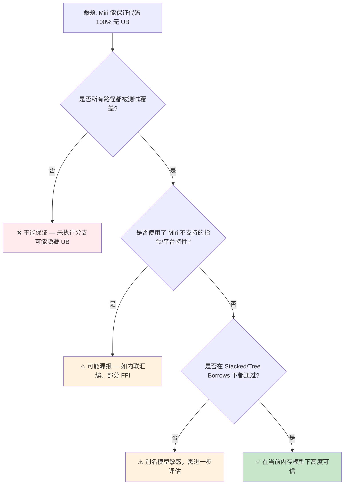

> **内容分级**: [综述级]
>
> **本节关键术语**: Miri · 未定义行为（UB） · Stacked Borrows · Tree Borrows · 别名规则（Aliasing Rules） · MIR 解释器 — [完整对照表](../../00_meta/01_terminology/01_terminology_glossary.md)
>

# Miri：Rust 未定义行为动态检测器

> **EN**: Miri: Rust Undefined Behavior Detector
> **Summary**: Miri is Rust's official MIR interpreter for detecting undefined behavior in unsafe and safe Rust code. Covers installation, common UB classes, Stacked Borrows vs Tree Borrows, and integration with existing crate tests.
> **Rust 版本**: 1.97.0+ (Edition 2024)
> **受众**: [进阶 / 工程 / 形式化]
> **Bloom 层级**: L2-L4
> **权威来源**: 本文件为 `concept/` 权威页。
> **A/S/P 标记**: **A** — Application
> **双维定位**: T×Fml — 工具链与形式化验证
> **定位**: 将 Miri 从“nightly 玩具”还原为日常 unsafe 代码审查与教学的标准工具。
> **前置概念**: [Unsafe Rust](../../03_advanced/02_unsafe/01_unsafe.md) · [Borrowing](../../01_foundation/01_ownership_borrow_lifetime/02_borrowing.md) · [Ownership](../../01_foundation/01_ownership_borrow_lifetime/01_ownership.md)
> **后置概念**: [Tree Borrows](../01_ownership_logic/05_tree_borrows_deep_dive.md) · [BorrowSanitizer](../02_separation_logic/04_borrow_sanitizer_in_formal.md) · [Kani](04_modern_verification_tools.md)

---

> **来源**: [Miri 官方 README](https://github.com/rust-lang/miri) · [rustc-dev-guide — Miri](https://rustc-dev-guide.rust-lang.org/miri.html) · [Brown University — Interactive Rust Book](https://rust-book.cs.brown.edu/) · [TRPL — Unsafe Rust](https://doc.rust-lang.org/book/ch19-01-unsafe-rust.html) · [Itanium C++ ABI](https://itanium-cxx-abi.github.io/cxx-abi/abi.html)
> [Rustonomicon — What Unsafe Does](https://doc.rust-lang.org/nomicon/what-unsafe-does.html) ·
> [Tree Borrows Paper](https://www.ralfj.de/blog/2023/06/02/tree-borrows.html) ·
> [Stacked Borrows Paper](https://plv.mpi-sws.org/rustbelt/stacked-borrows/)

---

## 📑 目录

- [Miri：Rust 未定义行为动态检测器](#mirirust-未定义行为动态检测器)
  - [📑 目录](#-目录)
  - [一、Miri 是什么](#一miri-是什么)
    - [与测试/Clippy 的区别](#与测试clippy-的区别)
  - [二、能检测哪些未定义行为](#二能检测哪些未定义行为)
  - [三、安装与基本用法](#三安装与基本用法)
    - [安装](#安装)
    - [运行测试](#运行测试)
    - [运行单个示例或二进制](#运行单个示例或二进制)
    - [常用 Miri 环境变量](#常用-miri-环境变量)
  - [四、Stacked Borrows vs Tree Borrows](#四stacked-borrows-vs-tree-borrows)
    - [Stacked Borrows（SB）](#stacked-borrowssb)
    - [Tree Borrows（TB）](#tree-borrowstb)
    - [选择建议](#选择建议)
  - [五、项目内可运行示例](#五项目内可运行示例)
    - [最小可运行示例](#最小可运行示例)
  - [六、常见错误与修复模式](#六常见错误与修复模式)
  - [七、反命题与边界](#七反命题与边界)
    - [7.1 反命题树](#71-反命题树)
    - [7.2 边界极限](#72-边界极限)
  - [八、权威来源索引](#八权威来源索引)
  - [相关工具交叉索引](#相关工具交叉索引)

---

## 一、Miri 是什么

**Miri** 是 Rust 官方维护的 **MIR（Mid-level IR）解释器**。与 `rustc` 直接生成机器码不同，Miri 在 MIR 层面逐条解释执行程序，同时追踪每块内存的**有效性、初始化状态、借用（Borrowing）权限**和**别名关系**。当程序即将触发未定义行为（UB）时，Miri 会报错并指出具体位置。 (Source: [Miri 官方 README](https://github.com/rust-lang/miri))

> **关键洞察**: Miri 不是测试框架，而是**运行时（Runtime）语义检查器**。它回答的问题是：“这段代码在 Rust 抽象机上的执行是否违反了内存模型？”
>
> [Miri 官方 README](https://github.com/rust-lang/miri)

### 与测试/Clippy 的区别

| 工具 | 检查阶段 | 能发现的问题 | 不能发现的问题 |
|:---|:---|:---|:---|
| `cargo test` | 运行时（Runtime） | 逻辑错误、断言失败 | UB、内存模型违规 |
| `cargo clippy` | 编译期 | 风格问题、常见反模式 | 复杂别名违规 |
| **Miri** | MIR 解释执行 | 悬垂指针、use-after-free、别名冲突、越界偏移、未初始化读取 | 死锁、业务逻辑错误、无限循环 |

---

## 二、能检测哪些未定义行为

Miri 目前能检测的主要 UB 类别包括：

| UB 类别 | 典型代码模式 | Miri 报错关键词 |
|:---|:---|:---|
| **悬垂指针解引用（Reference）** | 返回局部变量指针后使用 | `use-after-free` |
| **未初始化内存读取** | `MaybeUninit::assume_init()` 过早 | `reading uninitialized memory` |
| **别名规则违反** | `&mut` 与 `&` 同时活跃并写入 | `ambiguous borrow` / `noprotected` |
| **越界指针偏移** | `ptr.offset(n)` 超出分配对象 | `pointer arithmetic overflow` |
| **类型混淆** | 通过错误类型读取内存 | `type validation failed` |
| **违反 `UnsafeCell` 规则** | 通过 `&T` 修改非内部可变性数据 | `trying to reborrow` |
| **未对齐访问** | 读取未对齐地址 | `alignment` |

> **注意**: Miri 使用**动态分析**，只能验证实际执行到的路径。未被测试覆盖的分支仍然可能隐藏 UB。 (Source: [rustc-dev-guide — Miri](https://rustc-dev-guide.rust-lang.org/miri.html))
>
> [Rust Reference — Behavior considered undefined](https://doc.rust-lang.org/reference/behavior-considered-undefined.html)

---

## 三、安装与基本用法

本节围绕「安装与基本用法」展开，依次讨论安装、运行测试、运行单个示例或二进制与常用 Miri 环境变量。

### 安装

```bash
rustup component add miri
```

Miri 需要 **nightly toolchain**。如果当前默认工具链不是 nightly：

```bash
rustup component add miri --toolchain nightly
rustup run nightly cargo miri --version
```

### 运行测试

在项目根目录运行所有 Miri 测试：

```bash
# 使用默认 Tree Borrows 模型
MIRIFLAGS="-Zmiri-tree-borrows" cargo miri test miri_tests

# 使用旧版 Stacked Borrows 模型
MIRIFLAGS="-Zmiri-stacked-borrows" cargo miri test miri_tests
```

### 运行单个示例或二进制

```bash
cargo miri run --manifest-path crates/c01_ownership_borrow_scope/Cargo.toml --bin ts
cargo miri test --manifest-path crates/c02_type_system/Cargo.toml miri_tests
```

### 常用 Miri 环境变量

| 变量 | 作用 |
|:---|:---|
| `MIRIFLAGS="-Zmiri-tree-borrows"` | 使用 Tree Borrows 别名模型（推荐） |
| `MIRIFLAGS="-Zmiri-stacked-borrows"` | 使用 Stacked Borrows 别名模型 |
| `MIRIFLAGS="-Zmiri-disable-isolation"` | 允许文件系统 / 网络访问 |
| `MIRIFLAGS="-Zmiri-disable-stacked-borrows"` | 关闭借用（Borrowing）检查（仅检测基本 UB） |

---

## 四、Stacked Borrows vs Tree Borrows

Rust 官方尚未最终确定内存模型，Miri 实现了两种竞争模型：

### Stacked Borrows（SB）

- 2018 年提出，是 Rust 内存模型的早期形式化尝试。
- 将每次借用（Borrowing）视为一个“标签”，按栈结构管理。
- **更严格**：会拒绝一些实际安全的代码模式。

### Tree Borrows（TB）

- 2023 年提出，试图在严格性与表达能力之间取得平衡。
- 将内存访问权限组织为树结构，区分“独占”与“共享”节点。
- **更宽松**：允许更多合理的别名模式，同时仍拒绝真正的 UB。

### 选择建议

```bash
# 默认推荐：Tree Borrows
MIRIFLAGS="-Zmiri-tree-borrows" cargo miri test

# 若 Tree Borrows 通过但代码在 Stacked Borrows 下失败，
# 说明代码依赖了更宽松的别名规则；优先修复代码，
# 除非能证明该模式在官方内存模型中会被接受。
```

> **深度文档**: [Tree Borrows 深度解析](../01_ownership_logic/05_tree_borrows_deep_dive.md)

---

## 五、项目内可运行示例

本项目已在多个 crate 中接入 Miri 测试：

| Crate / 文件 | 覆盖主题 | 运行命令 |
|:---|:---|:---|
| [`crates/c02_type_system/src/miri_tests.rs`](../../crates/c02_type_system/src/miri_tests.rs) | `MaybeUninit`、`NonNull`、`ManuallyDrop`、裸指针别名 | `cargo miri test --package c02_type_system miri_tests` |
| `crates/c06_async/src/miri_tests.rs` | 异步（Async）运行时（Runtime）内存安全（Memory Safety） | `cargo miri test --package c06_async miri_tests` |
| [`crates/c08_algorithms/src/miri_tests.rs`](../../crates/c08_algorithms/src/miri_tests.rs) | 排序、链表、数据结构 | `cargo miri test --package c08_algorithms miri_tests` |
| [`exercises/src/unsafe_rust/ex05_miri_validation.rs`](../../exercises/src/unsafe_rust/ex05_miri_validation.rs) | UB 识别与修复练习 | `cargo miri test --package exercises ex05_miri_validation` |

### 最小可运行示例

```rust
// 这段代码在 Miri 下会报错：use-after-free
pub fn dangling_pointer_bad() -> *const i32 {
    let x = 42;
    &x as *const i32
}

#[test]
fn test_dangling_pointer() {
    let ptr = dangling_pointer_bad();
    // 在 Miri 中下一行会触发 UB 报错
    unsafe { assert_eq!(*ptr, 42); }
}
```

修复后：

```rust
pub fn heap_pointer_fixed() -> *const i32 {
    let boxed = Box::new(42);
    Box::into_raw(boxed)
}

#[test]
fn test_heap_pointer() {
    let ptr = heap_pointer_fixed();
    unsafe {
        assert_eq!(*ptr, 42);
        let _ = Box::from_raw(ptr as *mut i32); // 释放内存
    }
}
```

---

## 六、常见错误与修复模式

| 错误 | Miri 输出 | 修复策略 |
|:---|:---|:---|
| 返回局部变量指针 | `use-after-free` | 改为堆分配或让调用者提供缓冲区 |
| 同时存在 `&mut` 与其他引用（Reference）并写入 | `trying to reborrow` / `no protected tag` | 缩小借用（Borrowing）作用域，或使用 `Cell`/`RefCell` |
| `MaybeUninit` 未初始化就 `assume_init` | `reading uninitialized memory` | 确保所有字节已写入后再调用 |
| 裸指针越界偏移 | `pointer arithmetic overflow` | 检查偏移量，使用 `wrapping_offset` 仅在合法场景 |
| 通过 `&T` 修改数据 | `trying to reborrow` | 使用 `UnsafeCell` 或内部可变性包装 |

---

## 七、反命题与边界

本节从反命题树 与 边界极限 两个层面剖析「反命题与边界」。

### 7.1 反命题树



### 7.2 边界极限

- Miri 运行在 nightly 工具链上，不能替代 stable CI。
- Miri 解释执行速度慢（100-1000x），不适合大规模集成测试。
- Miri 对 FFI 支持有限：调用 C 函数时只能检测已建模的函数行为。
- Miri 不能检测并发死锁、业务逻辑错误或性能问题。

---

## 八、权威来源索引

| 来源 | 可信度 | 说明 |
|:---|:---:|:---|
| [Miri GitHub](https://github.com/rust-lang/miri) | ✅ 一级 | 官方仓库，安装与使用文档 |
| [Rust Reference — UB](https://doc.rust-lang.org/reference/behavior-considered-undefined.html) | ✅ 一级 | Rust 官方未定义行为列表 |
| [Stacked Borrows Paper](https://plv.mpi-sws.org/rustbelt/stacked-borrows/) | ✅ 二级 | 学术形式化模型 |
| [Tree Borrows Blog](https://www.ralfj.de/blog/2023/06/02/tree-borrows.html) | ✅ 二级 | Tree Borrows 设计说明 |
| [Rustonomicon](https://doc.rust-lang.org/nomicon/index.html) | ✅ 二级 | unsafe Rust 实践指南 |

## 相关工具交叉索引

| 工具 / 概念 | 定位 | 权威来源 |
|:---|:---|:---|
| [Tree Borrows](../01_ownership_logic/05_tree_borrows_deep_dive.md) | Rust 别名模型演进方向；Miri 默认使用的内存模型 | [Tree Borrows 论文/博客](https://www.ralfj.de/blog/2023/06/02/tree-borrows.html) |
| [Stacked Borrows](../01_ownership_logic/05_tree_borrows_deep_dive.md) | 早期 Rust 别名模型，Miri 中可通过 `-Zmiri-stacked-borrows` 启用 | [Stacked Borrows 论文](https://plv.mpi-sws.org/rustbelt/stacked-borrows/) |
| [Safety Tags](../02_separation_logic/03_safety_tags_in_formal.md) | 将 `unsafe` 安全契约结构化，未来可与 Miri 动态检查联动 | [RFC #3842](https://github.com/rust-lang/rfcs/pull/3842) |
| [BorrowSanitizer](../02_separation_logic/04_borrow_sanitizer_in_formal.md) | 原生执行速度下的别名模型运行时（Runtime）检测，填补 Miri 在多语言场景的空缺 | [Rust Project Goal #624](https://github.com/rust-lang/rust-project-goals/issues/624) |
| [Kani](09_kani.md) | 有界模型检查器，与 Miri 形成“动态 UB 检测 + 有界形式化证明”互补 | [Kani 官方文档](https://model-checking.github.io/kani/) |
| [AutoVerus / Verus](07_autoverus.md) | SMT 演绎验证，可证明 Miri 无法穷尽的功能正确性 | [Verus GitHub](https://github.com/verus-lang/verus) |

---

> **权威来源**: [The Rust Reference](https://doc.rust-lang.org/reference/introduction.html) · [The Rustonomicon](https://doc.rust-lang.org/nomicon/index.html) · [Miri](https://github.com/rust-lang/miri)
> **权威来源对齐变更日志**: 2026-06-26 创建，对齐 Rust 1.97.0 / Miri nightly · 2026-07-09 新增 Safety Tags / BorrowSanitizer / AutoVerus / Tree Borrows 交叉引用（Reference） [P2-Q3 形式化工具交叉引用]
> [Authority Source Sprint Batch L4](../../00_meta/02_sources/05_international_authority_index.md)

**文档版本**: 1.1
**最后更新**: 2026-07-09
**状态**: ✅ 权威来源对齐完成 (Batch L4)
